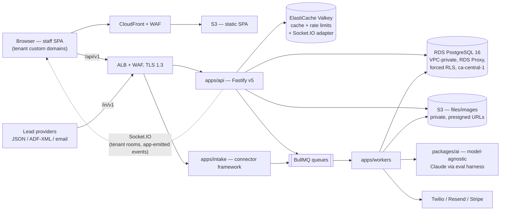

# ARCHITECTURE.md — Living System Map

> Claude: keep this current. Update it whenever a module is added, a boundary
> moves, or a data flow changes. A stale architecture doc is worse than none —
> if you notice drift between this file and the code, fix the file in the same
> session. Diagrams use Mermaid so they render on GitHub and in artifacts.
>
> **Authoritative deep design** lives in `../../kia-tracker-specs/docs/new/`
> (`03-architecture/`, `05-database/`, `07-infrastructure/`, `08-ai-automation/`),
> governed by the 26 ADRs in `00-overview/ARCHITECTURE-DECISIONS.md`. This file is
> the compact map of what is actually built here; on conflict, the ADRs win.

## System overview

Dealpilot is a multi-tenant, white-label dealership CRM/DMS with an AI
lead-automation layer. A single React 19 SPA (runtime-themed per tenant, FR-first)
talks to a Fastify v5 REST API (`/api/v1`, ts-rest + Zod contracts) backed by
Amazon RDS for PostgreSQL 16 in `ca-central-1` — VPC-private, RDS Proxy pooling
at launch, forced RLS (Platform → Organization → Store hierarchy, integer cents;
owner decision 2026-07-24, D-013). Files/images live in private S3 buckets
(presigned URLs, CloudFront delivery); realtime UI updates flow over Socket.IO
(tenant-namespaced rooms on the Valkey Redis adapter, events emitted by the
API/worker layer). Slow or side-effecting work (email, SMS, AI
turns, voice, PDFs, images, webhooks, drips) runs in BullMQ workers on
ElastiCache Valkey; a separate intake service ACKs lead webhooks (JSON, ADF/XML,
inbound email) in <100 ms via a configuration-driven connector framework and
enqueues the lead pipeline, whose first AI touch must land in <60 s. Everything —
compute and data — runs single-vendor AWS `ca-central-1` (ECS Fargate behind an
ALB; SPA on S3 + CloudFront) for full Canadian residency. Status: **pre-build —
monorepo scaffold is Phase 0 task A-01; this map describes the agreed target.**

## Component map

## Module responsibilities

| Module / directory | Responsibility (one sentence) | Depends on |
| ------------------ | ----------------------------- | ---------- |
| `apps/web` | Staff SPA: React 19 + Vite 6, TanStack Query v5, runtime white-label theming, FR/EN | ui, contracts, schemas, core, i18n |
| `apps/api` | Fastify v5 REST API: auth, tenant context (`SET LOCAL` + RLS), thin routes → services → repos | db, contracts, schemas, core, i18n |
| `apps/workers` | BullMQ processors: email, SMS, AI turns, voice, PDF/Excel, images, webhook delivery, drips, crons | db, schemas, core, i18n, ai |
| `apps/intake` | Lead-intake edge: per-tenant webhook/ADF/email connectors, sub-100 ms ACK, enqueue only | schemas, contracts |
| `packages/db` | Schema, SQL migrations, generated types, RLS policies | — |
| `packages/schemas` | Zod 4 domain schemas + the single enum/status vocabulary source | — |
| `packages/contracts` | ts-rest API contracts → OpenAPI 3.1 + typed client | schemas |
| `packages/core` | Pure domain math: desking, tax tables, commissions, pipeline gates, money utils (≥90% coverage — the CI gate is pending O-58; ≈ 97.8 % lines measured 2026-09-04 without tooling) | schemas |
| `packages/ui` | shadcn/Base UI design system + tenant theming tokens | — |
| `packages/i18n` | Shared EN/FR resources for SPA, API, workers (emails/PDFs/SMS) | — |
| `packages/ai` | Prompts, 7-tool set, extraction, compliance guards, model eval/A-B harness | schemas, core |

## Data flow

- **API request:** HTTPS + Better Auth cookie → rate limit (global→IP→tenant→endpoint)
  → session → tenant context (never from client headers) → Zod parse → service →
  repo inside `withTenant()` (`SET LOCAL app.tenant_id...`, RLS backstop) →
  Zod-serialized response; every mutation emits an `activity_events` row.
- **Lead pipeline (BullMQ Flow):** intake ACK → normalize/dedupe → consent check
  (CASL basis + expiry) → AI first touch (<60 s) → extraction → routing → agent
  assignment; Socket.IO events (emitted by API/workers, tenant-scoped payloads)
  invalidate SPA query caches.

## Cross-cutting concerns

- **Error handling strategy:** `AppError` taxonomy → single envelope `{ error: { code, message, request_id } }`, messages localized FR/EN; raw DB errors never reach clients; fail closed.
- **Validation boundary:** Zod 4 at every boundary (requests, responses, job payloads, env at startup) from `packages/schemas`/`contracts`; `.passthrough()` banned; interior code trusts types.
- **Auth model:** Better Auth sessions (HTTPS-only Secure/HttpOnly cookies, MFA for managers); 10-role permission matrix enforced server-side; forced RLS as tenant-isolation backstop.
- **Caching:** cache-aside on Valkey with tenant-prefixed keys (`t:{tenantId}:...`) + in-process LRU for hot config; TTL always; Valkey loss degrades performance, never correctness.
- **Observability:** pino structured JSON (tenant/request/trace IDs) → Better Stack; OpenTelemetry across Fastify/BullMQ/pg; Sentry errors+traces (PII-scrubbed); PostHog EU consent-gated.

## Scalability notes

Shared-schema tenancy is sized for dozens-to-hundreds of organizations without
architecture change. First things to break under 10x: single-node Valkey and the
single NAT gateway (pilot cost choices — add replica/second NAT), then
`messages`/`activity_events` growth (monthly range partitioning pre-planned at
>10M rows), then reporting load (read replica on demand). Per-tenant rate quotas
and BullMQ group limiters contain noisy neighbors.
