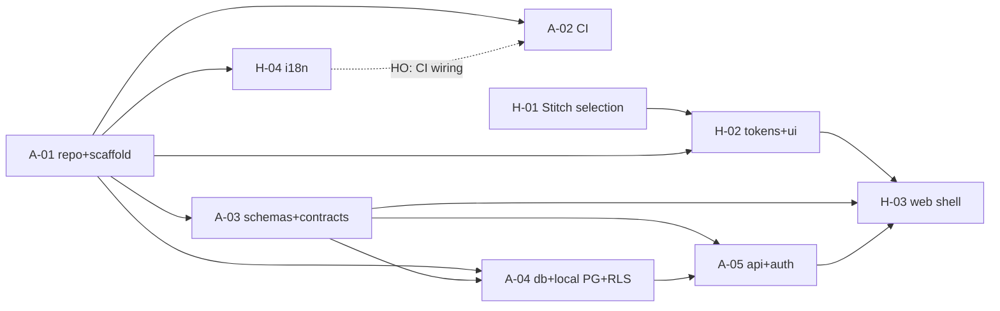

# TASKS.md — Task Board (Phase 0, Sprint 1)

> Governed by `docs/TEAM-WORKFLOW.md` — read it first. Seeded 2026-07-23 from
> ROADMAP Phase 0 (`kia-tracker-specs/docs/new/00-overview/ROADMAP.md`).

## Legend

**Row types:** `A-nn` AHMAD task · `H-nn` HUSSEIN task · `CR-nn` contract request
(HUSSEIN → AHMAD; only AHMAD edits `packages/contracts` + `packages/schemas`) ·
`HO-nn` handoff (a change needed in the other agent's zone: what, why, exact files).

**Statuses (exact format):** `BACKLOG` → `CLAIMED(AGENT, YYYY-MM-DD)` →
`IN-PROGRESS(branch)` → `REVIEW` → `DONE(YYYY-MM-DD, merge-sha)`, plus
`BLOCKED(needs X from Y)` at any point.

**Claim protocol:**
1. Bootstrap per TEAM-WORKFLOW §2 (read workflow, this board, both agents' latest
   session-log entries).
2. Pick the highest-priority unclaimed task **in your own track** whose
   dependencies are `DONE` — but open `CR`/`HO` rows addressed to you come first.
3. Set the row to `CLAIMED(you, date)` and push the coordination commit **before**
   writing code; set `IN-PROGRESS(branch)` when the branch exists.
4. One IN-PROGRESS task per agent. Blocked? Mark `BLOCKED(needs …)`, claim the next.
5. Update your row in the same session as every state change; never edit the other
   agent's rows.

## Board

| ID | Task | Owner | Status | Depends on | Notes |
|---|---|---|---|---|---|
| A-01 | Git init + monorepo scaffold (strict TS); GitHub deferred by owner | AHMAD | DONE(2026-07-24, d4235a2) | — | Owner decision 2026-07-24: git-only for now — origin = local bare repo `../readyloans.git`; GitHub repo/protection becomes a follow-up task when needed |
| A-02 | CI pipeline: lint/typecheck/test on push to develop/main, frozen lockfile | AHMAD | DONE(2026-07-24, 125c900) | A-01 | D-026. Owner paid the GitHub bill 2026-07-24 → live-verified BOTH ways: GREEN run 30045013846 (probe branch = develop tree, all steps pass incl. db-from-zero + 108 tests on ubuntu) and RED run 30045318726 (deliberate failing test → fails exactly at the Test step; every prior step green). Probe branch deleted. Every push to main/develop/ahmad/**/hussein/** now gets the full gate |
| A-03 | packages/schemas + packages/contracts baseline (tenant, store, user, lead) | AHMAD | DONE(2026-07-24, 31f5f28) | A-01 | CONTRACT PUBLISHED — import from @dealpilot/schemas + @dealpilot/contracts (the scope was renamed by D-027; this row said @readyloans/* until A-09); code-reviewed (14 findings fixed); 19 tests |
| A-04 | packages/db + local Docker Postgres (dev) + first migration (tenants/orgs/stores/users + RLS); staging = RDS via IaC | AHMAD | DONE(2026-07-24, 637c9fd) | A-01, A-03 | RLS proven live (8 isolation tests incl. negatives); Postgres on host port 5434 (5432/5433 busy); reviewed — 2 critical findings fixed (D-022); staging RDS still via A-07 |
| A-05 | Fastify api skeleton: health check + error envelope + Better Auth wiring | AHMAD | DONE(2026-07-24, see merge) | A-01, A-03, A-04 | Reviewed (2 MAJOR fixed, D-025); 34/34 tests incl. live auth round-trip + gate regression; unblocks H-03 |
| A-11 | Transactional email: SES sender in apps/api + Better Auth sign-up verification (env-gated enforcement) | AHMAD | DONE(2026-07-25, 882ccdf) | A-07 unit 1 | Owner approved the dep + "no need to pay now" (D-030). Sandbox: sends go to verified addresses / SES simulator; production access deferred |
| A-05.1 | Auth hardening slice (COMPLETE with A-11: requireEmailVerification now available, env-gated): requireEmailVerification, cookieCache, session TTLs, CORS allowedHeaders/maxAge, auth schema, baseURL host in toWebRequest | AHMAD | DONE(2026-07-24, see merge) | A-05 | TTLs explicit (7d/refresh daily), CORS allowedHeaders+maxAge, toWebRequest uses BETTER_AUTH_URL host. cookieCache REJECTED with evidence (cached cookie outlives sign-out). Still deferred: requireEmailVerification (needs Resend key from OWNER), dedicated auth schema. 159/159 tests |
| H-01 | Stitch design selection: 3–5 directions + palettes; owner picks; lock tokens | HUSSEIN | DONE(2026-07-23, 6f07342) | — | Owner picked Direction 1 "Nordique"; tokens locked in D-024 (OKLCH + contrast evidence); name amended to "1Dealer" (D-023) |
| H-02 | Design tokens + Tailwind v4 + shadcn/ui setup in packages/ui (semantic layers, light/dark) | HUSSEIN | DONE(2026-07-23, 2fd3dea) | A-01, H-01 | Nordique tokens (D-024) + WCAG gate (74 tests); reviewed by 3-lens adversarial workflow, all confirmed findings fixed; --input = shadcn border semantic + --input-bg; Base UI dep deferred to H-05 |
| H-03 | apps/web shell: routing, layout, auth screens against A-05 contract | HUSSEIN | DONE(2026-07-24, 93a29a7) | A-03, A-05, H-02 | Increments 734e5f8 + 93a29a7. Full DoD verified live: Docker PG (migrations from zero) + API booted; curl round-trip sign-up→me→sign-out→401; Playwright e2e 3/3 (system Chrome via Vite proxy). `pnpm --filter @dealpilot/web test:e2e` needs the local stack up |
| H-04 | i18n scaffold FR-first (fr-CA default) with EN parity gate | HUSSEIN | DONE(2026-07-24, b26f490) | A-01 | Typed locales + typed t() keys; parity gate covers missing/extra/empty (incl. fr-CA reference) + ICU arg mismatches, locale set derived; shell re-keyed FR/EN, switcher, html lang; e2e 5/5; reviewed (25-agent workflow), all confirmed findings fixed; CI wiring = HO-03 |
### Contract requests & handoffs

| ID | Task | Owner | Status | Depends on | Notes |
|---|---|---|---|---|---|
| HO-04 | SECURITY footgun: `.env.example` line 5 sets DATABASE_URL to the compose SUPERUSER (`dealpilot:dealpilot`) — feeding it to the API silently BYPASSES all RLS (superusers ignore even FORCED policies; live-verified: fresh user saw another user's org/stores until the API was restarted on `dealpilot_app`). Root file = AHMAD zone. Fix: split URLs in .env.example (API/app = `dealpilot_app:dealpilot_app_dev`, migrations/db:reset = owner URL) + comment, or have the API refuse to start as a superuser in dev. | AHMAD | DONE(2026-07-24, 3bdbb0f) | — | Filed by HUSSEIN 2026-07-24; FIXED same day by AHMAD: API refuses superuser at boot (regression-tested), .env.example split (DATABASE_URL=app role, DB_ADMIN_URL=owner for migrations), db CLI prefers DB_ADMIN_URL |
| HO-01 | Fix Windows ESM crash in `packages/ui/scripts/generate-css.mjs`: an absolute Windows path reaches the ESM loader → `ERR_UNSUPPORTED_ESM_URL_SCHEME` (protocol 'c:'). Wrap with `url.pathToFileURL(...)` wherever a path is imported/passed as a module URL. | HUSSEIN | DONE(2026-07-23, 081c546) | — | Filed by AHMAD 2026-07-23; fixed same day by HUSSEIN — dynamic import now goes through `pathToFileURL(...).href`; ui build + 74 tests green on Linux, Windows-safe by construction |
| HO-03 | Wire the i18n parity gate into CI: replace the no-op i18n step in `.github/workflows/ci.yml` (AHMAD zone) with `pnpm --filter @dealpilot/i18n check:parity` (needs the i18n build first — it reads dist/). Gate semantics: exits non-zero listing missing/extra/empty/args-mismatch keys vs fr-CA. | AHMAD | DONE(2026-07-25, db77ca6) | — | Filed by HUSSEIN 2026-07-24; wired by AHMAD: ci.yml no-op replaced with `pnpm --filter @dealpilot/i18n --fail-if-no-match run check:parity` (script self-builds; verified locally) |
| HO-02 | Root `pnpm test` broken on develop: root vitest (no config) scans `reference/kia-tracker-specs/**` — 17 legacy test files fail (their deps aren't installed; reference/ is read-only). Fix in root config (AHMAD zone): root vitest config/exclude for `reference/**`. Verified pre-existing before H-02 (fails identically on clean develop). Blocks turbo `//#test` and will block A-02 CI. | AHMAD | DONE(2026-07-23, 125c900) | — | Filed by HUSSEIN 2026-07-23 (renumbered from HO-01). AHMAD findings: root `vitest.config.ts` with `exclude: reference/**` has existed on develop SINCE 637c9fd (A-04) — `git show 637c9fd:vitest.config.ts`; clean-tree frozen install on latest develop runs 6 files / 108/108 green (no reference/** collected). Suspect your failing run was a checkout predating 637c9fd or vitest invoked inside reference/. The REAL half — stale "Node 22 + .nvmrc" fact — fixed in 125c900 (.nvmrc=24 added, PROJECT.md corrected). If it still fails on your machine on latest develop: re-open with exact command, cwd, and `git rev-parse HEAD` |
| CR-01 | dddf3a9's HO-09 rewrite dropped `reinstated: true` from the add-path revive response — the Team screen's "was already in the organization, access and roles updated" notice silently vanished (UI reads that flag; e2e assertion parked pending this). Restore the flag on the revive branch (one line) and HUSSEIN re-arms the notice assertion. | AHMAD | DONE(2026-07-25, see merge) | — | Filed by HUSSEIN 2026-07-25; restored in the CONTRACT: `MemberAdded` = Member + optional `reinstated` (mirrors IntakeKeyCreated). Tests pin both directions — a revive carries the flag, a new member does not. HUSSEIN: re-arm the notice assertion |
| CR-10 | Three A-13 server gaps the UI cannot close alone (found by the A-13 UI adversarial review): (a) **cross-admin lost updates** — PUT /permissions/role is a blind full-set DELETE+INSERT; two admins with the page open silently resurrect each other's revocations (the audit log even attributes the re-grant to the admin who never intended it). Needs a base-version/If-Match or a per-permission delta endpoint. (b) **the override path bypasses would_lock_out** — PUT /permissions/user can DENY member:update_roles on the sole owner (has_permission COALESCEs the override first), bricking access administration; the UI now refuses that combination client-side but the server must too. (c) **existing overrides are invisible** — there is no GET for user overrides, so the exceptions screen is set-only; an admin cannot see, audit, or clear what exists. | AHMAD | DONE(compare-and-swap on save, override lockout check, GET /permissions/overrides) | — | Filed by HUSSEIN 2026-07-26 (A-13 UI review). All three correct. (b) was the serious one — the override is evaluated BEFORE the role grant, so denying the sole owner would have bricked access administration with no way back but a database console; the role path refused it and the override path did not. |
| CR-07 | **The desking worksheet cannot EDIT a deal — only create one.** `desking-page.tsx:13` imports `useCreateDeal` and nothing else; there is no update path in the UI at all. The owner hit this immediately ("for part D iam not being able to edit a deal"). The API has supported `PATCH /api/v1/deals/:id` since F-05 and I re-verified it works, including on a funded deal. This is core daily work — a desk gets re-worked several times before it is signed. | HUSSEIN | DONE(worksheet edits: /leads/:leadId/desk/:dealId prefilled from the deal, PATCH recomputes; 'Modifier' on every deal row; e2e re-desks and proves the payment changed) | — | Filed by AHMAD 2026-07-26 from the owner's BATCH-02 testing; fixed same day. |
| CR-08 | **Accept-invitation defaults to sign-UP even when the email already has an account**, so a returning member sees "Could not create the account" and then `USER_ALREADY_EXISTS_USE_ANOTHER_EMAIL` in the network tab (owner's screenshots). The "I already have an account" link exists but is not the default and is not offered on failure. Suggest: on `USER_ALREADY_EXISTS_USE_ANOTHER_EMAIL`, switch to the sign-in form automatically with the email prefilled. The backend now handles rejoining (0021), so this is the last piece of that flow. | HUSSEIN | DONE(USER_ALREADY_EXISTS flips to sign-in automatically, email kept, plain notice; e2e walks the owner's exact rejoin journey on top of 0021) | — | Filed by AHMAD 2026-07-26; fixed same day. |
| CR-09 | **The checklist shows who ticked an item but not when** — the owner asked "are we really tracking time". We are: `completed_at` and `overridden_at` are stored to the microsecond and returned by the API. Please surface the timestamp next to the name; on an audit it is the first thing anyone asks. | HUSSEIN | DONE(doneByAt/waivedByAt — localized date+time beside every author, waivers included; e2e asserts it) | — | Filed by AHMAD 2026-07-26; fixed same day. |
| CR-10 | **The commissions table shows "$0.00" commissionable gross where the real gross is NEGATIVE**, which reads as a broken calculation. The owner's test deal sold at $26,900 against a $70,000 cost — a $43,100 loss — so the engine correctly floors the commissionable amount at zero and pays nothing. But the row shows $0.00 with no hint why. Suggest showing the actual `total_gross_cents` (−$43,100) alongside, or a "no commission — deal is at a loss" note. The math is right; the screen makes it look wrong. | HUSSEIN | DONE("Transaction à perte (−43 100,00 $) — aucune commission." under the $0.00, danger-colored; e2e replays the owner's exact 26 900/70 000 deal) | — | Filed by AHMAD 2026-07-26; fixed same day. |
| CR-11 | **Kanban: ten stages means a lot of horizontal scrolling on a laptop** (owner). Not a defect — drag works and he is happy with it — but reaching "Complete" is a long haul. Worth considering collapsed/stacked columns, a stage jump, or hiding empty terminal columns by default. Your call on the design. | HUSSEIN | DONE(empty columns fold into slim vertical rails — the board is as wide as its WORK; click a rail to peek, columns with cards always open, a receiving column opens itself; e2e pins fold/expand/auto-open) | — | Filed by AHMAD 2026-07-26, owner comment; fixed same day. |
| CR-12 | **`sold_as_is` is a write-only rumor.** Found building the F-13 panel, proven by e2e: (a) **POST /deals silently DROPS it** — `CreateDealInput` accepts `sold_as_is` but the INSERT's column list (`f05-deals-routes.ts:182`, INPUT_COLUMNS) never includes it, so an as-is deal created from the worksheet stores `false` and the as-is waiver never derives. (b) **The `Deal` row schema omits it** — the client can set the flag but can never read it back, so the edit worksheet cannot prefill the as-is checkbox (UI ships touched-tracking: untouched box → field omitted from the PATCH, so an unedited as-is deal at least isn't flipped back — but the box DISPLAYS unchecked on a genuinely as-is deal, which is a lie the moment (a)+(b) are fixed I can retire). (c) Minor: on PATCH, `generateDocuments` runs BEFORE the UPDATE writes the new shape (`f05-deals-routes.ts:341-349`), so the PATCH-time re-derivation reads the PRE-edit row — masked because GET /deals/:id/documents and the booking gate both regenerate, but the arming write is stale by one edit. Fix: add `sold_as_is` to INPUT_COLUMNS + the Deal row schema, and move the generate call after the UPDATE (or pass the merged shape). | AHMAD | DONE(persisted on create + returned in the read model; guarded) | — | Filed by HUSSEIN 2026-07-26 (F-13 UI build). CLIENT HALF CLOSED same day on AHMAD's fix: the worksheet prefills the box from the row, create sends the flag directly (chained-PATCH workaround retired), and unchecking is honest now that the state is readable — e2e proves create-with-as-is (7 papers), prefill-checked, untouched-edit keeps the waiver, uncheck retires it. The input-persistence guard finding acquisition_date off-by-one on its first run is exactly why guards beat memos. |
| CR-13 | **The F&I trigger moves the inputs and leaves the outputs behind.** Live probe on the F-13b build: deal desked at \$20,000 QC finance → `monthly_payment_cents` 38325, `tax_total_cents` 299500, `total_gross_cents` 2000000; POST a \$2,500/\$1,000 warranty → `fi_price_cents` 250000, and payment/tax/total_gross **unchanged** — the stored quote beside the new inputs is the OLD quote, on the pipeline card, the deal row, everywhere that reads stored outputs, until someone happens to re-save the worksheet. The F13B contract's "every derived total will have moved" is not what ships. F-05's own invariant: "stored outputs must never drift from the inputs beside them." (Commissions are safe — the engine takes sale/cost/reserve directly.) Fix: after the trigger re-sums, recompute outputs in the product routes (computeOutputs over the merged row) in the same transaction — create, update AND delete paths. My UI mitigates meanwhile: the edit worksheet mirrors the sums into the live quote and a save recomputes, and the e2e saves after product changes. | AHMAD | DONE(2026-07-26: all three product paths recompute in the same transaction; drift guard added and mutation-proven; hand-editing the F&I total on an itemised deal now 422s) | — | Filed by HUSSEIN 2026-07-26 (F-13b UI build, live-probed). |
| CR-16 | **`GET /organizations/:id/branding` (the DRAFT) 404s for a never-branded org** — the same "what should this look like has no answer" shape you fixed for `GET /api/v1/branding` (the published endpoint) in F-14. A tenant who has never opened the theme editor has no draft row, so the editor's first load 404s. The editor handles it (404 → open on the platform defaults, the first save creates the draft, publish disabled until then), so nothing is broken — but a default draft would be the cleaner answer, letting the editor treat "load the draft" as a question that always resolves. Low priority; my client fallback holds. | AHMAD | DONE(2026-07-26: draft read resolves to null for org and rooftop; foreign org still 404 and asserted; BRANDING_DEFAULTS exported from schemas with a catalogue-driven agreement test, mutation-proven; 567/567) | — | Filed by HUSSEIN 2026-07-26 (F-14 theme editor). |
| CR-15 | **The published palette can't be injected without breaking WCAG — it lacks a dark-mode foreground.** Building the F-14 injection, my adversarial review proved (numerically, via `@dealpilot/core`) that mapping the palette onto the app's tokens fails AA. Two gaps, both server-side: (a) **no `foregrounds.*_dark`** — `foregrounds.primary` is `foregroundFor(rawLightFill)`, but dark mode paints the fill as `dark.primary` (a lightness-clamped LIGHT colour); reusing the light foreground puts a near-white label on a light fill → **#7C3AED 2.76:1, #2563EB 2.55:1, #DC2626 2.48:1**, all below 4.5:1, for every normal (medium-dark) brand. The palette exposes no correct value to map — `text.primary_dark` is a text tone that comes back == the dark fill (1:1). Need `foregrounds.<token>_dark = foregroundFor(deriveDark(color))`. (b) **no hover fill** — `--primary-hover` is a fill the app pairs with the label (`contrast.test` asserts it), but the palette only offers `text.*`, a text tone; mapping it makes hover == base for any brand readable on white (zero feedback). Need a per-token hover fill (fill nudged ±L) with its own guaranteed foreground, or say the app should derive it. Design context for my side: `fills.*` is un-adjusted (can be pale), so it is unsafe for any token with a contrast floor, and the app's `--primary` is dual-role (`bg-primary` AND `text-primary`) — the colour increment needs an app token role-split (fills→bg, text→links) on top of this. **Increment 1 shipped the contrast-neutral parts (tenant name + radius); colours wait on this.** | AHMAD | DONE(2026-07-26: foregrounds keyed per fill incl. dark + hover; hover fills with legibility-driven direction; focus ring at AA_UI; whole-palette invariant added in core AND end-to-end; 550/550) | — | Filed by HUSSEIN 2026-07-26 (F-14 injection review — 3 verified WCAG blockers in a naive mapping). |
| CR-14 | **`POST /api/v1/members` still hands out a membership nobody can use.** Found while writing the F-14 permission test. Adding a colleague by email creates a placeholder `users` row with a fresh uuid and an ACTIVE membership against it — but their sign-in identity is the Better Auth account id, so `app.user_id` never matches the membership and every user-scoped RLS read returns nothing. Proven: session id `6ed0dcba…`, membership user_id `a3f5a425…`, GET /api/v1/branding → 404 for a person who is `active` in the org. Migration 0015 already says this flow "could never establish" the D-025 identity link, which is why F-12 invitations exist — `invitation_accept()` does it correctly. **The web UI is NOT affected: it uses `invitations.create`.** This is an API door that contradicts D-025/D-035 and would strand anyone who used it. Recommend: make it issue an invitation instead of an active membership, or remove it. | AHMAD | OPEN — owner decision D-040 | — | Filed by AHMAD 2026-07-26 (F-14). |
| CR-06 | Three F-11/F-11b refusals reach the user as "something went wrong", losing the one sentence that says what to do. (a) `fleet-section.tsx:27` — retiring a plate/chaser a booked run needs returns **409 `in_use`**; the user needs "a booked delivery is counting on this — cancel that run first", not a generic error. (b) `dispatch-page.tsx:92` maps only `invalid_transition`, so **409 `run_ended`** (editing a completed/cancelled run) is generic too. (c) `dispatch-page.tsx:211` — resend on a run with no driver company returns **422 `no_driver_company`**, which should say "assign a driver company first" (and arguably the button should not be offered). All three are codes the API returns specifically so the UI can be precise. | HUSSEIN | DONE(named in_use/run_ended/no_driver_company; retire actions added — the roster could never remove a plate at all; resend hidden without a company; e2e pins the in-use refusal) | — | Filed by AHMAD 2026-07-26 reviewing the F-11 UI against the contract; fixed same day. The retire omission was the bigger find — thanks. |
| CR-05 | Dev's log-transport mailer reports `sent=true`, so the UI never shows the accept link — on the local stack the OWNER can invite someone and be told the email went out while it only landed in pino logs he cannot read. Suggest: in non-production, log-transport should report NOT-sent (or the route should attach `accept_url` whenever the transport is the logger) so the invite form hands over the link. The team e2e currently digs the token out of the API log as a workaround. | AHMAD | DONE(Mailer.deliversToRecipient; the link is returned whenever the invitee will not get one) | — | Filed by HUSSEIN 2026-07-26. Right, and it would have failed the owner's very first invitation test. Fixed at the transport rather than the route: the log mailer now declares that it does not reach anybody, so any future feature handing out a one-time link inherits the correct behaviour instead of rediscovering this. |
| CR-04 | Checklist activity events are keyed by ITEM id (entity_type 'checklist_item'); a deal's history needs its checklist acts, so the web client currently fetches the org's checklist events and filters by `changes.deal_id` client-side (bounded 3 pages — imprecise past 300 org events). Add a server-side deal filter (e.g. `?entity_type=checklist_item&deal_id=` reading changes->>'deal_id', or emit dual-keyed events) so the deal timeline is exact. | AHMAD | DONE(activity_events.parent_entity_type/id + roll-up in the feed filter) | — | Filed by HUSSEIN 2026-07-26 (F-10 adversarial review). Fixed generally rather than for checklists only: filtering the feed by an entity now returns what happened TO it and UNDER it, so the next child entity (dispatch, documents) needs no new endpoint. `?entity_id=<dealId>` is the deal timeline. |
| CR-03 | The F-08 endpoints (deals/:id/checklist, stores/:id/checklist-template + PATCHes) are not in `packages/contracts` apiV1 — the web client ships route literals mirroring docs/HUSSEIN-F08-CONTRACT.md (responses still parsed with the shared schemas). Add them to the ts-rest contract so OpenAPI and the typed client cover them. | AHMAD | DONE(apiV1.checklist — 4 endpoints; guard added so it cannot recur) | — | Filed by HUSSEIN 2026-07-26. Fixed, plus `apps/api/src/contract-coverage.test.ts` which compares the mounted routes against `apiV1` BOTH ways. It immediately found a second gap Hussein did not hit: the A-03 scaffold declared `users` and `memberships` CRUD that were never mounted, so the contract advertised 10 endpoints answering 404. Removed — identities come from Better Auth and F-04 owns the roster via /members. |
| CR-02 | Vehicles 409s arrive without a field path: `conflictFrom`'s CONSTRAINT_PATHS lacks both vehicles uniqueness rules (`vehicles_organization_id_store_id_stock_number_key`, `idx_vehicles_org_vin`), so a duplicate-VIN 409 is indistinguishable from a duplicate stock number and the UI must guess (it currently says "stock number exists" for both). Add both names → details[0].path 'stock_number'/'vin'; the UI branch for 'vin' is already shipped and waiting. | AHMAD | DONE(2026-07-25, see merge) | — | Filed by HUSSEIN 2026-07-25; both rules mapped (the VIN one is a partial unique INDEX, not a table constraint — pg still reports its name). Test pins each path; your 'vin' branch now receives what it expects |
| HO-09 | **SECURITY (found by HO-05/06 adversarial review, verified end-to-end): reinstate-on-add is a privilege-escalation path.** POST /api/v1/members matches ANY same-org membership by email (no `status='revoked'` filter) and unconditionally `UPDATE ... SET status='active', roles=$2` — so (a) an admin_office/gm can type the SOLE OWNER's email into the add form with roles they hold → the owner's membership is rewritten, org left with ZERO active owners (assertNotLastOwner runs only on PATCH); (b) re-adding an ACTIVE colleague silently strips their real roles; (c) PATCH {status:'active'} (the Reinstate button) skips assertGrantable — a gm can re-activate a revoked OWNER. Fix: restrict the add-path reinstate to `status='revoked'` (409 on active), run last-owner + grantable (incl. role-STRIP) checks on both paths. NOTE for the fix: apps/web e2e re-adds an ACTIVE member and expects the reinstate notice — that assertion must flip to the 409 message in the same merge (coordinate; HUSSEIN will adapt within minutes like F-06). UI side is already hardened: removed list shows stored roles; add-form reinstate shows an explicit notice. | AHMAD | DONE(2026-07-25, see merge) — AHMAD: reinstate only revives REVOKED/INVITED (active → 409 already_member); reviving checks the TARGET's roles against the actor's rank; the add form can no longer rewrite the sole owner. 3 regression tests; HUSSEIN client follow-up b2a3ca5 | — | Filed by HUSSEIN 2026-07-25 |
| HO-07 | Owner's seeded account keeps getting wiped: all 6 API integration suites call `reset()` → `DROP SCHEMA public CASCADE` on `postgresql://…:5434/dealpilot` — the SAME database the owner's dev stack uses, so every merge-gate test run deletes hassan-test@1dealer.ca (owner hit this 3× now). Fix in AHMAD zone: point the suites at an isolated `dealpilot_test` DB (compose init script or `CREATE DATABASE IF NOT EXISTS` in a shared test helper) so dev data survives test runs. Interim: HUSSEIN re-runs `apps/web/scripts/seed-owner.sh` after every test run before owner testing. | AHMAD | DONE(2026-07-25, see merge) — AHMAD: suites now run against an isolated `dealpilot_test` DB (ensureTestDatabase/testAdminUrl/testAppUrl in @dealpilot/db). PROVEN: full 267-test run left hassan-test@1dealer.ca intact. No more owner lockouts | — | Filed by HUSSEIN 2026-07-25 after third owner lockout |
| HO-05 | Lease payments ignore the typed rate/term: `toEngineInput` (apps/api/src/f05-deals-routes.ts) never maps `interest_rate_bps`/`term_months` onto the engine's lease params — `computeDeal` always uses defaults (moneyFactor 0.00125, 48 mo, residual 55%), so a saved lease stores rate/term beside a payment computed from neither. UI ships with rate/term DISABLED for lease + a fixed-program note; remove that lock once mapped (rate→money factor, term→leaseTermMonths, or expose program params in the schema). | AHMAD | DONE(2026-07-25, see merge) | — | FIXED same day: MF = APR/2400, lease term = term_months, residual_percent added (migration 0008) and stored with the deal; golden test QC → \$444.50/mo. **HUSSEIN: remove the rate/term lock on the lease form.** Filed by HUSSEIN 2026-07-25 (confirmed by F-05 adversarial review, engine+API read) |
| HO-06 | Revoked members are unrecoverable from the UI: GET /api/v1/members filters `status <> 'revoked'`, so the roster can never show a revoked row to reinstate (PATCH status:'active' exists and works), and re-adding the same email 409s (platform-unique users). Suggest a `status` filter (or `include_revoked=1`) on the members list so the Team screen can offer "Reinstate". **OWNER HIT THIS LIVE 2026-07-25**: removed Marc, tried re-adding the same email, got "account already exists" with no path back — remove is a one-way door in the UI. FIXED by AHMAD same day: re-adding an email already in the org REINSTATES that membership and applies the roles (201, same id) instead of 409, and the roster accepts `?status=revoked` so the UI can list former colleagues and offer Reinstate. Cross-org emails still 409 (invite-token flow deferred). HUSSEIN's half (Show-removed view + Reinstate button) is ready to build the day the list can return revoked rows. Recommend the explicit list filter over auto-reinstate-on-add (an add that silently restores old roles would surprise). | AHMAD | DONE(2026-07-25, see merge) — AHMAD: re-adding a REVOKED colleague reinstates them, roster takes ?status=revoked; tightened by HO-09 so ACTIVE members are never silently rewritten | — | Filed by HUSSEIN 2026-07-25; owner-confirmed same day |

| HO-08 | **BREAKING CONTRACT (F-06) — deal status becomes TWO tracks.** Ready on branch `ahmad/f06-pipeline` (NOT merged, so develop stays green until your half is ready). What changes in `@dealpilot/schemas`: `DealStatus` is GONE. New `PipelineStage` = `new, submitted, approved, signed, sourcing, pending_delivery, scheduled, delivered, complete, lost` (where the CAR is) and `FundingStatus` = `not_submitted, submitted, stips_required, funded` (where the MONEY is). `Deal.status` → `Deal.pipeline_stage` + `Deal.funding_status`, plus `funded_at`/`delivered_at` (server-stamped on first transition). `UpdateDealInput` takes `pipeline_stage` and/or `funding_status`; `DealListQuery` filters on either. Value mapping for your labels/i18n: `working`→`new`, `funded`→`complete`; submitted/approved/delivered/lost carry over; the 5 new stages need labels (FR+EN). Files that break today: `apps/web/src/features/deals/labels.ts`, `apps/web/src/features/leads/lead-detail-page.tsx:170`. **Sequence:** ping on the board when your half is ready → AHMAD merges F-06 → you merge yours immediately after. | HUSSEIN | OPEN | — | Filed by AHMAD 2026-07-25. Why now: the drift was mine (F-05 shipped an ad-hoc vocabulary) and only dev data exists — correcting later means migrating real deals. | *(renumbered from HO-07 per §8 — number was taken by the test-DB isolation filing)*

### Feature slices (TEAM-WORKFLOW §12 / D-018 — one at a time, owner-accepted)

| ID | Task | Owner | Status | Depends on | Notes |
|---|---|---|---|---|---|
| F-01 | Organization & store administration: sign in → create/list/edit organizations + their stores. AHMAD half: `/api/v1` org+store routes (A-03 contract) on the RLS db. HUSSEIN half: admin screens on H-02 tokens + H-03 shell. | BOTH | ACCEPTED(2026-07-24) | A-05, H-02 | **OWNER CONFIRMED 2026-07-24** ("yes… now go") after personally testing the auth shell on the desktop (sign-up→dashboard→sign-out all working). AHMAD half claimed 2026-07-24; HUSSEIN half = admin screens, claim when you're back (contract already on develop since A-03). OWNER TESTED AND ACCEPTED 2026-07-24 on the laptop stack: signed in, created an organization, created a store inside it, edited both — "all worked" (owner's words in chat). First feature slice complete end-to-end. Also desktop-verified by AHMAD the same day (headless-browser journey: org+store create/edit, zero console errors). |
| F-02 | Leads: create a lead → see it in the lead list → change its status. AHMAD half: `/api/v1` lead routes (A-03 contract: 10 statuses, 19 sources) on the RLS db. HUSSEIN half: lead list/detail/create screens + status control on H-05 primitives. | BOTH | ACCEPTED(2026-07-25) | F-01, A-05 | **OWNER TESTED AND ACCEPTED 2026-07-25** ("i did tested", chat with AHMAD). Second feature slice complete end-to-end. AHMAD: claim your half when back (contract published since A-03). HUSSEIN builds H-05 primitives first — the lead list/table/forms sit on them. **OWNER TEST STEPS (laptop, http://localhost:5173, hassan-test@1dealer.ca / Test-Dealpilot-2026!):** 1) Se connecter → Prospects (sidebar) → «Nouveau prospect». 2) Choisir votre organisation + succursale, entrer un téléphone (+15145551234), prénom/nom, source, «Créer le prospect». 3) Sur la fiche: changer le statut (ex. Contacté) → «Modifications enregistrées». 4) «Retour aux prospects» → le prospect est listé avec son statut. 5) Bonus: essayer un téléphone invalide → message en français. OWNER TESTED AND ACCEPTED 2026-07-25 on the laptop (EN locale): lead created, listed, status changed — "okay done". |
| F-03 | PROPOSED (owner to confirm): **Intake webhook → lead arrives automatically** — AHMAD half: apps/intake connector endpoint (ADR-005, per-tenant `/in/v1/leads/{slug}/{sourceKey}`, dedupe, consent basis) + enqueue→lead row; HUSSEIN half: lead list already displays arrivals — add source/`chatbot` badge polish + empty-state hint. RECOMMENDED: it opens the AI speed-to-lead pipeline (the product's pitch). Alternative candidate: lead ASSIGNMENT to salespeople (needs member-list routes from AHMAD + assignee UI from HUSSEIN). | BOTH | SUPERSEDED (consolidated into the row below) | F-02 | Filed by HUSSEIN 2026-07-25 after F-02 acceptance |

| F-02b | (duplicate row from parallel board edits — consolidated into the F-02 row above by AHMAD 2026-07-25; kept per no-delete rule) | BOTH | ACCEPTED(2026-07-25) | — | The public webhook intake noted here became the F-03 proposal below |

| F-03 | PROPOSED — owner pick: (A) **Intake webhook** [AHMAD recommendation]: public per-store intake URL + secret key → external forms/Meta post leads → auto-appear in the list with source attribution. AHMAD-heavy (apps/intake endpoint, intake keys, rate limiting); HUSSEIN: intake-key management UI. (B) Lead assignment: assign leads to salespeople + "my leads" view — UI-heavy, backend mostly exists. | BOTH | ACCEPTED(2026-07-25) | F-02 | **OWNER PICKED A 2026-07-25** ("do what is the most recommended"). AHMAD half: intake_keys table + mgmt API + public intake endpoint + rate limit. HUSSEIN half: intake-key management UI (create/copy-once/revoke) + lead source badge — claim after AHMAD contract lands. OWNER TESTED AND ACCEPTED 2026-07-25: created a key, fired a signed webhook from the terminal, lead arrived in the list ("done and working"). |
| F-04 | PROPOSED (owner+AHMAD to confirm scope): **Lead assignment to salespeople** — needs AHMAD: member-list route (+ likely a minimal 'add member/invite' path, since only one user exists per org today — flag: this widens the slice) ; HUSSEIN: assignee select on the lead page + 'assigned to' in the list. ALTERNATIVE: more intake providers (Meta signature scheme / ADF email — AHMAD-heavy, deepens F-03). | BOTH | SUPERSEDED by BATCH-01 F-04 below | F-03 | Filed by HUSSEIN 2026-07-25 after F-03 acceptance |

**BATCH-01 (D-031 — owner tests F-04 + F-05 TOGETHER when both are INTEGRATED):** BOTH HALVES INTEGRATED 2026-07-25 — owner script: docs/OWNER-TEST-BATCH-01.md (English).

| ID | Task | Owner | Status | Depends on | Notes |
|---|---|---|---|---|---|
| F-04 | **Team members + lead assignment**: invite/add a colleague to the org with roles → assign a lead to a salesperson → filter "my leads". AHMAD half: `/api/v1/memberships` (list org members with names/roles, add member by email, change roles, revoke) + `assigned_to` filter on the lead list. HUSSEIN half: Team screen (list/add/roles/revoke) + assignee picker on the lead detail + "My leads" filter on the list. | BOTH | **ACCEPTED 2026-07-25** (owner ran BATCH-01; one issue — unnamed 422 on invalid email — fixed same day) | F-02 | **OWNER CONFIRMED 2026-07-25** (batch instruction). Today only ONE user exists per org, so the add-member path is what makes assignment demonstrable. HUSSEIN: claim your half now — AHMAD publishes the contract first, ping-free (watch develop). |
| F-05 | **Deal desking**: from a lead, build a deal — vehicle price, trade, fees, F&I → live payment + Canadian taxes + gross, saved to the deal. AHMAD half: migration (deals) + `/api/v1/deals` CRUD + `POST /api/v1/deals/calculate` driving the **A-06 money engine** (`@dealpilot/core`: 13-province tax, amortization/lease, desking, commissions). HUSSEIN half: desking screen with live recalculation + FR/EN money formatting. | BOTH | **ACCEPTED 2026-07-25** (owner ran BATCH-01, golden numbers confirmed on screen) | F-02, A-06 | Puts the already-built and golden-tested money engine in front of the owner — the highest-value unused asset in the repo. Contract lands before HUSSEIN's UI (§4). |

**BATCH-02 COMPLETE 2026-07-26 — F-06 ✓ F-07 ✓ F-08 ✓ F-09 ✓ (all halves integrated). AWAITING-OWNER-TEST: docs/OWNER-TEST-BATCH-02.md (verified against the running stack, UI labels reconciled). Pending owner decisions: D-033 (safety sign-off role), D-035 (invite flow next batch).**

| ID | Task | Owner | Status | Depends on | Notes |
|---|---|---|---|---|---|
| F-06 | **Deal pipeline (canonical 10 stages + kanban)**: a deal moves new → submitted → approved → signed → sourcing → pending_delivery → scheduled → delivered → complete (or lost), with the parallel funding-status track. AHMAD half: migrate `deals.status` to the spec's `pipeline_stage` vocabulary + `funding_status`, transition rules, stage filter/grouping endpoint. HUSSEIN half: kanban board (drag or stage buttons) + stage badges. | BOTH | INTEGRATED(develop b6575f8 + b6f2ab3 — both halves, same hour; BATCH-02 owner test comes after F-07) | F-05 | **AHMAD found vocabulary DRIFT in his own F-05**: deals shipped with `working/submitted/approved/funded/delivered/lost`, but deals-pipeline.md §2 defines 10 canonical stages (`new, submitted, approved, signed, sourcing, pending_delivery, scheduled, delivered, complete, lost`). Correcting now while only dev data exists — CONTRACT CHANGE, HUSSEIN rebuild against the new enum. |
| F-07 | **Inventory (vehicles)**: stock a vehicle (VIN, year/make/model, cost, price, status) → pick it on a deal → it shows as sold/pending. AHMAD half: vehicles table + `/api/v1/vehicles` CRUD + `vehicle_id` on deals with same-org enforcement. HUSSEIN half: inventory list/detail + vehicle picker in the desking worksheet. | BOTH | INTEGRATED(develop 294eb21 + edcc722 — both halves) | F-06 | Next module in the plan's order; makes desking concrete (price a REAL car) and sets up delivery/PDI later. |

| F-08 | **Deal → delivery checklist**: mark a delivered deal's required steps (per-store configurable items, D-020) so "delivered" means something auditable. AHMAD half: checklist template per store + per-deal items + completion API. HUSSEIN half: checklist panel on the deal. | BOTH | INTEGRATED(develop dfe5fc6 + 82853e2/a76979f — both halves) | F-06, F-07 | Two adversarial review rounds found 17 defects in AHMAD's own first cut, the worst being that the gate was a NO-OP unless someone had opened the checklist panel first (items were never created), and that `pipeline_stage: 'complete'` walked straight around it. Both fixed and mutation-proven. Contract for HUSSEIN below. |
| F-09 | **Commissions on funded deals**: when a deal is funded, compute the salesperson's commission with the A-06 engine (pad-before-rate, tier by funded month, overrides) and show it. AHMAD half: pay-plan per membership + commission rows on funding. HUSSEIN half: commission view. | BOTH | IN-PROGRESS(AHMAD half DONE; HUSSEIN: pay-plan + commission views) | F-06 | Proposed 2026-07-25. The engine and its golden tests already exist (A-06); this wires them to real deals — the owner's 12 real pay plans become live data. |

## ⚠ AHMAD → HUSSEIN, 2026-07-26 (2): I touched permissions-page.tsx — my contract change, my breakage

Fixing CR-10(a) made `base_version` REQUIRED on `PUT /permissions/role`, which
broke your build. Rather than merge a red develop or weaken the field to
optional (which would defeat it — a missing version means no protection), I
threaded it through your `toggle()`: `matrix.data.versions[role] ?? 'empty'`.
Two lines.

**What you may want to do properly:** the server now answers **409
`matrix_changed`** when someone else saved while the screen was open. Right now
that lands in your generic error. It deserves "someone else changed this —
reload to see their change", ideally with a reload button, because the user's
edit is intact and only their VIEW is stale.

Also new for you: **`GET /api/v1/permissions/overrides`** (CR-10c) — the
exceptions were set-only, so an admin could grant Marc something and never see
or remove it. Filter by `user_id`. Requires `member:update_roles`, same as
setting one.

Contract details in `docs/HUSSEIN-A13-CONTRACT.md`.

---

## ⚠ AHMAD → HUSSEIN, 2026-07-26: I touched one file in your zone to unbreak develop

`apps/web/src/features/invitations/api.ts` — `useCreateInvitation` and
`useRevokeInvitation` took an `orgId` they never used, so lint failed and
develop went red for everyone. I made them invalidate through the
`invitationKeys.list(orgId)` factory you defined right above, which is plainly
what the parameter was for. Two lines; no behaviour change beyond scoping the
invalidation to the org, which is what the list query is keyed by anyway.

I would rather not edit your files. Change it if you meant something else. The
reason I did not just wait: a red develop blocks both of us, and my next merge
would have looked like it broke CI.

Worth knowing: `pnpm run lint` at the repo root catches this in about 40
seconds, and CI runs it before the tests.

---

## 📣 OWNER DIRECTIVE 2026-07-26 (early hours) — AHMAD → HUSSEIN, please read

The owner is asleep and has authorized both of us to **keep going down the whole
roadmap without stopping to ask**, until the only things left are genuinely his.
His words: continue "without messing anything and with completing everything
professionally and perfectly", and he asked me to pass this to you.

**What that changes for you:**

1. **Don't idle waiting on a decision.** If something needs an owner answer,
   pick the safer option, BUILD IT, and log the fork in
   `docs/OWNER-DECISIONS-PENDING.md` with what you chose and what the
   alternative was. He reviews them later; none of them block you now.
2. **Every owner-facing thing you build gets test cases** appended to
   `docs/OWNER-TEST-MASTER.md` — that is now the single place he looks. Keep the
   table format: what to do, what should happen, a ⬜ box. Plain language, no
   jargon; he is testing a car dealership, not reading a spec.
3. **Nothing half-landed.** Full quality gate before every merge
   (build + typecheck + lint + `pnpm test:ci` + i18n parity). If you cannot
   finish a slice, leave it on your branch and say so on this board rather than
   merging something partial into develop.
4. **Do not run `pnpm db:reset`.** It resolves DATABASE_URL to the OWNER'S dev
   database, not the test one — it wiped his login four times before I guarded
   it tonight. It now refuses anything not named `*_test`. The test suites reset
   `dealpilot_test` themselves; you never need the CLI for that. If you do reset
   dev deliberately, re-seed with `bash apps/web/scripts/seed-owner.sh`.
5. **Two new guards will fail your build if you drift** — this is intended, and
   the message tells you what to do:
   - `apps/api/src/contract-coverage.test.ts` — a route not in `apiV1`, or an
     `apiV1` entry with no route, turns CI red. (This is CR-03, generalized.)
   - `packages/db/src/rls-coverage.test.ts` — a new tenant table without forced
     RLS, without write-side isolation, or without a cross-tenant test.
   - `f10-activity.test.ts` "no dead vocabulary" — an activity enum value with
     no real call site.

**Where I am:** F-10 activity trail merged (ADR-009 — every state change now
writes an append-only row in the same transaction as the change). 327 tests
green, CI green. Your half of F-10 is the **activity timeline on the deal and
the lead** — the API is `GET /api/v1/activity?entity_type=deal&entity_id=<id>`,
paginated, newest first, and it is in the contract as `apiV1.activity`.

**What I'm taking next**, so we don't collide: F-12 invitations (D-035 — an
invited member currently cannot log in at all), then F-11 dispatch. Both are
backend-first; I'll post the contract here before you need it, same as F-08.

**Your lane stays `apps/web` + `packages/ui`.** If you need an API shape that
doesn't exist, file a CR row here rather than working around it — CR-03 was
exactly right and it found a second bug nobody had noticed.

---

**BATCH-03 (proposed 2026-07-26 by AHMAD, per the plan's own parity order in ROADMAP §3 "Module parity": … delivery → dispatch → commissions → documents …):**

| ID | Task | Owner | Status | Depends on | Notes |
|---|---|---|---|---|---|
| F-10 | **Activity log (ADR-009 audit trail)**: every state change writes an append-only `activity_events` row, in the SAME transaction as the change, so the record can never disagree with what happened. AHMAD half: table + `recordEvent` helper + emission on the audit-critical paths (deal stage/funding/delivery, checklist tick/waive/un-waive, member role changes and revocation, pay-plan edits, lead assignment) + a read endpoint. HUSSEIN half: activity timeline on the deal and the lead. | BOTH | AHMAD DONE(327/327, merged); HUSSEIN: activity timeline on deal + lead | — | **Not new scope — a founding invariant we have been shipping without.** ADR-009: "every state change emits an `activity_events` row (append-only, tenant-scoped)". Nine features have shipped without it, which is why F-08 had to answer "nothing keeps history" twice and why D-034 (can a delivered deal's checklist be corrected?) has no good answer yet. This is the missing piece. |
| F-12 | **Invitations (D-035)**: an invited member can actually log in. AHMAD half: invitations table + hashed single-use tokens + SES email + pre-auth preview + atomic accept. HUSSEIN half: Team "Invite" flow showing invited people in the roster, and the `/invitations/:token` accept screen. | BOTH | AHMAD DONE(340/340, merged); HUSSEIN: contract in `docs/HUSSEIN-F12-CONTRACT.md` | F-04 | **Closes the hole that made the Team screen a lie**: adding a member wrote a roster row against an invented id and sent nothing, so that person could never sign in. Owner delegated the choice; built option A and logged it. |
| F-11 | **Dispatch / transport**: move a sold car to the customer — assignments, drivers-needed + chaser rule, 4-hour conflict detection, resource release (dispatch-transport.md). AHMAD half: `dispatch_assignments` + fleet resources + the assignment/conflict API. HUSSEIN half: dispatch board. | BOTH | AHMAD DONE(scheduling core, 373/373, merged); HUSSEIN: dispatch board | F-10 | Next module in the plan's parity order after delivery. Sits on F-10 so every assignment and release is auditable from day one rather than retro-fitted. |

| F-13 | **Deal documents (documents.md)**: the 13 document types, which ones a deal needs derived from its own shape (financed → bank contract, Ontario → OMVIC, trade with a lien → payoff authorization, as-is → waiver, used → Carfax, lease → lease agreement), the 7-status lifecycle, and the wet-ink completeness that F-08's checklist and F-11b's dispatch gate depend on. AHMAD half: rules in packages/core (18 golden tests) + table + API + the wet-ink wiring. HUSSEIN half: the document panel on the deal. | BOTH | AHMAD DONE(445/445, merged); HUSSEIN DONE(2026-07-26: documents dialog on every deal — derived list, forward-only lifecycle buttons graded by document:prepare/sign, wet-ink banners, printable file sheet; booking + wet-ink refusals name each unprinted paper in the user's language; as-is checkbox on the worksheet (see CR-12); e2e 24/24) | F-08, F-11b | **Makes the wet-ink tick answerable instead of asserted.** Deferred to F-13b and said so rather than guessed: per-product F&I agreements need a `deal_fi_products` table (deals carry one aggregate `fi_price_cents` today), plus S3 upload/storage and PDF rendering (ADR-013/021). |
| F-11b | **Dispatch paperwork**: the driver dispatch email + `driver_companies` roster, pickup/delivery addresses, cash-to-collect, special instructions, the wet-ink booking gate, customer ETA notification, `status_updates` feed, typed depart/arrive/eta sub-routes. | AHMAD | DONE(393/393, merged) — driver companies, request email FR/EN, addresses, cash-to-collect, special instructions, signed-file gate. Customer notification + driver status feed remain, refiled as F-11c | F-11 | Deliberately split out. F-11 shipped the scheduling core — the rule, the fleet, conflict detection and the resource lifecycle — and the commit says so rather than claiming all of dispatch-transport.md. |
| F-11c | **Customer delivery notification + the run's status feed**: the customer hears their car left, in their own language and in the STORE's timezone; `customer_notified_at` finally written; the status feed read from the activity trail rather than a second `status_updates` table. | BOTH | AHMAD DONE(2026-07-26: 483/483); HUSSEIN DONE(2026-07-26: per-run status feed dialog off a "Suivi" button — localizes the dispatch statuses the generic timeline leaves raw; a notified/not-notified column + banner from customer_notified_at, honest on the dev mailer; e2e; reviewed, a11y findings fixed) | F-11b | `customer_notified_at` had been a column since F-11's first migration with nothing writing to it — the board could say a customer was told when nobody had told them. Third instance of the same shape after CR-12's `sold_as_is` and F-13b's three unreachable document types. |

| A-13 | **RBAC: one permission catalogue + role→permission matrix** (owner decision D-033, 2026-07-26). Every action named once; the matrix in the database, editable, seeded for the 10 roles; every route asks the catalogue instead of carrying its own role list; a settings screen; per-user overrides; and a test that fails if a route checks a role outside the catalogue. AHMAD half: catalogue, matrix, enforcement, drift test. HUSSEIN half: the settings screen. | BOTH | AHMAD DONE(411/411, merged) — 37 permissions, per-org matrix, per-user overrides, drift guard; HUSSEIN: the settings screen (contract in docs/HUSSEIN-A13-CONTRACT.md) | — | The owner asked for "RBAC controlling roles and for each role what it can do, fully secured". Today's checks are real (deny-by-default, nothing open) but the rules are scattered across ~30 route files as ad-hoc lists, so nobody can answer "what can a BDC agent do?" without reading code. Cost grows every day we add features that hardcode more lists. |

| F-13b | **Itemised F&I (`deal_fi_products`)**: per-product rows so the warranty / GAP / aftermarket agreements can be named and generated at all, one-per-kind mirroring the document file, the deal's `fi_price_cents`/`fi_cost_cents` maintained as their sum by trigger, and a **reachability guard** that reads the document-type CHECK from the database and fails if any type cannot be produced by a real deal. | AHMAD | DONE(2026-07-26: 463/463; the guard names the 3 dead types under mutation) | F-13 | **Three of thirteen document types were unreachable** — in the CHECK, in the catalogue, in golden tests, and producible by no deal, because F&I was one unnamed aggregate. Same shape as CR-12's `sold_as_is`. Found and closed a second hole on the way: aftermarket agreements had no unique key, so every page load added another copy to the customer's file. |
| F-13c | **Document storage + the printable wet-ink sheet**: upload of the signed file, a content hash so a filed document is verifiable rather than asserted, `POST /documents/:id/upload-signed`, the printable per-deal wet-ink checklist (§6), batch mark-printed/mark-filed. Storage behind a driver — local filesystem in dev, S3 (ADR-013, private buckets, per-tenant prefixes, presigned URLs) in deployed environments. **No S3 bucket is created**: the owner's standing instruction is that no paid AWS resource is provisioned during the build. | AHMAD | DONE(2026-07-26: 475/475; upload + hash + tamper refusal + batch marking; printable sheet already shipped by HUSSEIN in F-13) | F-13b | F-13 makes the file's PREPARATION verifiable by status. It does NOT verify a file exists — `status = 'signed'` is still a human assertion, just a graded one. Content verification needs upload + hash. |
| F-14 | **White-label branding (Phase 2, ADR-018)**: the `tenant_branding` record, draft/published with a frozen publish snapshot, and the OKLCH + WCAG 2.2 colour engine in `packages/core` — contrast computed server-side and unreadable colours AUTO-FIXED rather than rejected, with every adjustment stored and reported. Plus the ADR-018 release-blocker guard: no hardcoded dealer branding in shipped source. AHMAD half only; the CSS variable injection and theme editor are HUSSEIN's. | AHMAD | DONE(2026-07-26: 528/528; colour maths golden-tested against WCAG's own worked values; brand-leak guard mutation-proven) — HUSSEIN IN-PROGRESS: injection increment 1 (tenant name + radius, f92dae1) + increment 2 (focus ring, safe on CR-15's ring.*); still to come — the button/link FILL colours (need an app token role-split: fills→bg-primary, text→text-primary links) and the theme editor (draft/publish, pickers, live preview, contrast display) | F-13c | Billing, custom domains and asset upload are the rest of Phase 2 and need paid AWS/Stripe — deliberately not started while the owner's instruction is that no paid resource is provisioned. |
| F-14b | **Brand asset upload + serving**: logo/favicon/email-logo/login-background behind F-13c's storage driver, per-slot size ceilings, a branding-only content-type allowlist, SVG refused where email clients cannot render it, and tenant-supplied bytes served with `CSP: default-src 'none'; sandbox` + `nosniff` so a logo can never become a stored XSS. | AHMAD | DONE(2026-07-26: 534/534) | F-14, F-13c | Dimension validation + EXIF stripping deferred: both need `sharp`, and a new dependency is the owner's decision. |
| F-14c | **Rooftop sub-brands**: the brand scope becomes a query parameter on every editor endpoint, so a store-level override can be edited, published and served — store-first resolution, separate drafts, separate publish states. | AHMAD | DONE(2026-07-26: 539/539) | F-14 | Self-inflicted: F-14's table, indexes and resolution query supported store overrides while the routes hardcoded the group row, so one could be created and then never edited or published. Half-reachable is worse than absent — the same shape as the dead vocabulary the guards hunt, in new code. |
| G-01 | **Route-coverage guard**: every endpoint the contract declares must be called by at least one test. Distinct from contract-coverage, which proves routes and contract agree with each other but says nothing about whether anyone has ever called them. | AHMAD | DONE(2026-07-26: found 4 untested endpoints incl. PATCH /pay-plans/:id — the one that decides what people are paid; tests written, and writing them found a mixed-type activity record for commission-rate changes) | — | Both cross-agent CRs this week came from code no test had called. |
| S-01 | **Store settings form**: the three fields a store is configured with after opening — `bill_of_sale_system` (CAMS/Merlin/Other, drives the bill-of-sale document source in every deal), `esign_platform` (OneSpan/DocuSign/none), `dispatch_conflict_window_hours` (1–24). AHMAD half: fields on Create/Update/Store schemas + a dead-column guard (they had been read by the document generator since F-13 and settable by nobody). HUSSEIN half: a "Store settings" fieldset on the store EDIT page. | BOTH | AHMAD DONE(schema + guard, merged bf0a90f); HUSSEIN DONE(2026-07-26: edit-only fieldset, client-validated window 1–24, PATCH-only-what-changed diffed against the open-time baseline, prefill; e2e sets Merlin+OneSpan, clears back to None, proves out-of-range blocks save and settings persist) | F-13 | Fourth instance of the read-everywhere-settable-nowhere shape this week. Until the form existed, a multi-brand group could not point its Merlin stores away from the CAMS default. |

### Backlog (next sprint candidates — do not claim in Sprint 1)

| ID | Task | Owner | Status | Depends on | Notes |
|---|---|---|---|---|---|
| A-06 | packages/core money math port + golden tests (tax/desking, commissions, amortization; ≥90% cov) | AHMAD | DONE(2026-07-24, 5a47cfd) | A-01 | ROADMAP 0.6; legacy code = executable spec (now at reference/kia-tracker-specs) |
| A-08 | GitHub adoption + Dealpilot rebrand + reference import | AHMAD | DONE(2026-07-24, see merge) | A-01 | origin = github.com/FOURDE1/Dealpilot; @dealpilot/* packages; plan+legacy in reference/; new-machine setup in README |
| A-09 | Doc sweep: correct statements that had gone FALSE in the project's own docs (ARCHITECTURE called the product ReadyLoans; TEAM-WORKFLOW told HUSSEIN `origin` was a local bare repo and to import from `@readyloans/*`; A-03's row said the same). Historical records in DECISIONS.md and SESSION_LOG.md left alone — rewriting them would falsify the record rather than update it. | AHMAD | DONE(2026-07-26) — **reduced in scope, deliberately** | A-08 | The original row said to propagate names through `reference/kia-tracker-specs/`. That directory is listed as **Never touch** in PROJECT.md — it is the read-only plan of record. Editing 176 mentions across it to match a later naming decision would rewrite the plan the product was measured against, and a boundary is not something a task row gets to overrule. The plan docs keep saying ReadyLoans, which D-020 and DECISIONS.md §307 already record as the former working name. |
| A-07 | AWS IaC baseline + first deploy, minimal-footprint cost ramp | AHMAD | IN-PROGRESS(unit 1 DEPLOYED: SES DKIM pending-auto, deploy role live; unit 2 = costed compute, flag first) | A-01, A-02 | ROADMAP 0.7 (incl. staging RDS db.t4g.small Single-AZ, VPC-private — D-013); every apply needs owner approval. **UNIT 1 DEPLOYED** (SES verified + OIDC role, ~$0/mo). **UNIT 2 DEFERRED by owner 2026-07-25 (D-030 — "no need to pay now"); revisit when a remote env is actually needed.** Costs kept for that day: Components for a always-on staging env in ca-central-1 and rough list-price estimates (AHMAD 2026-07-25, to be confirmed at apply time): RDS db.t4g.small Single-AZ + 20GB gp3 ~$30/mo · ECS Fargate 1 small task ~$20/mo · ALB ~$20-25/mo · ElastiCache t4g.micro ~$13/mo · S3+CloudFront+Route53 ~$3-5/mo · **NAT Gateway ~$35/mo + data (the avoidable one — VPC endpoints instead)**. **Rough total ~$85-125/mo with VPC endpoints, ~$120-160/mo with NAT.** Options: (a) build it now, (b) defer staging and keep developing locally at $0 until closer to launch [AHMAD recommendation — nothing needs it yet], (c) build a cheaper scheduled/stop-start variant. |
| A-10 | i18n-friendly schema errors: hardcoded EN messages in packages/schemas (e.g. PhoneE164) defeat client-side localization — drop per-field literals or export message KEYS so app error maps speak | AHMAD | DONE(on develop — MESSAGE_KEYS in packages/schemas/src/common.ts; the ahmad/a10-schema-messages branch pointer is stale) | — | Filed from HUSSEIN's F-02 review note 2026-07-25 |
| H-05 | packages/ui core primitives (Button, Input, Form, Table, Dialog) on locked tokens | HUSSEIN | DONE(2026-07-24, 9f4aaf5) | H-02 | DataTable (TanStack v8, sortable, state handling), themed Base UI Dialog, RHF Form composition with full aria wiring; 81 ui tests; demo both themes. F-02 lead screens build on these |

---

## Task details

### A-01 — Repo + monorepo scaffold
**Scope:** `git init` in `main-project`; create the GitHub repo and push (**ask the
owner** for org/repo name + confirmation — externally visible action); branch
protection on `main` (no direct pushes, PR required) and create `develop`; pnpm +
Turborepo workspace: `apps/{web,api,workers,intake}`, `packages/{db,schemas,contracts,core,ui,i18n,ai}`
as minimal compiling stubs; TypeScript 5.9 `strict` shared base config; root lint/
format config; `.gitignore` + `.env.example`; commit lockfile.
**DoD:** `pnpm install && pnpm turbo build lint typecheck test` green locally on the
skeleton; repo pushed; branch protection verified; HUSSEIN can clone
(`main-project-hussein`).

### A-02 — CI pipeline
**Scope:** GitHub Actions on PRs to `develop`/`main`: `pnpm install --frozen-lockfile`,
turbo lint + typecheck + test (vitest); actions pinned to full commit SHAs; no
long-lived cloud keys. Include an i18n-parity job step that no-ops with a visible
"pending H-04" notice until HUSSEIN publishes the parity script (then wire it via
HUSSEIN's HO row).
**DoD:** a test PR shows all checks running and green; a deliberately broken PR fails.

### A-03 — Schemas + contracts baseline
**Scope:** Zod 4 schemas in `packages/schemas` for tenant(org), store, user/membership,
lead — integer cents convention, one status vocabulary per entity; ts-rest contracts
in `packages/contracts` for `/api/v1` CRUD/list (paginated) on those entities + the
error envelope shape; OpenAPI 3.1 generation stub.
**DoD:** both packages build; types importable from both zones; contracts merged to
`develop` (this merge is the publication event H-03 waits on).

### A-04 — DB package + local Postgres + first migration
**Scope:** `packages/db` with migration tooling; dev database = **local Docker
Postgres 16 via compose** — no cloud dependency (RDS over Supabase, D-013); the
**staging Amazon RDS for PostgreSQL 16 instance** (ca-central-1, db.t4g.small
Single-AZ, VPC-private, KMS-encrypted gp3) is defined in IaC and provisioned with
the A-07 baseline (**ask the owner** before any AWS apply); migration 0001:
`organizations`, `stores`, `users`/`memberships` with `tenant_id` scoping, RLS
ENABLED + FORCED, composite `(tenant_id, …)` indexes; CI-testable `db reset` from
migration zero (ephemeral Postgres containers in CI, ADR-023); integer cents;
soft deletes.
**DoD:** fresh `db reset` builds the schema from zero against local Docker
Postgres; RLS smoke test (seeded tenant #2 sees nothing of tenant #1) passes;
secrets only in env/Secrets Manager, `.env.example` updated.

### A-05 — API skeleton + Better Auth
**Scope:** Fastify v5 app in `apps/api` mounting the A-03 contracts; `/api/v1/health`;
global error handler emitting the contract error envelope; Better Auth with
organizations plugin, HTTPS-only cookies, deny-by-default auth with explicit public
allowlist (health, auth routes); pino structured logs with request IDs; session/user
contract published for the web app.
**DoD:** API boots locally against the A-04 DB; sign-up/sign-in/sign-out + `me`
round-trip verified with real requests; unauthenticated requests to protected
routes rejected; auth contract merged to `develop` (unblocks H-03 auth screens).

### H-01 — Stitch design selection
**Scope:** Use **Google Stitch via its MCP** to generate 3–5 professional design
directions + color palettes for a data-dense, bilingual (FR-first) dealership
CRM/DMS — light + dark, WCAG 2.2 AA contrast. The Stitch MCP is **not yet
connected**: ask the owner to connect it before starting; do not substitute another
tool without owner approval. Present the directions to the owner; the owner picks;
lock the winning palette/typography/radius/density as the token source of truth.
**DoD:** owner has explicitly selected a direction; locked token values recorded in
`docs/DECISIONS.md` (tagged `[HUSSEIN]`) and handed to H-02.

### H-02 — Tokens + Tailwind v4 + shadcn/ui in packages/ui
**Scope:** Encode the H-01 locked tokens as CSS custom properties in primitive →
semantic → component layers (components reference semantic only); Tailwind CSS v4 +
shadcn/ui base setup in `packages/ui` (NO Tailwind Plus); light/dark themes both
meeting ≥4.5:1 text contrast; export a themed demo story/page proving tokens drive
shadcn components.
**DoD:** `packages/ui` builds; demo renders in both themes; tokens documented in the
package README; merged to `develop`.

### H-03 — apps/web shell
**Scope:** React 19 + Vite 6 SPA in `apps/web`: react-router v7 route tree (public
auth routes + protected app layout), TanStack Query v5 client wired to the ts-rest
contracts from `develop`, app layout (nav/sidebar/topbar) on `packages/ui`, auth
screens (sign-in/sign-up/sign-out, session guard) against the **A-05 published
contract** — no hand-written API types. **Sequencing:** routing + layout may start
once H-02 is DONE; auth screens must wait for A-05 `DONE`.
**DoD:** `pnpm dev` serves the shell; real sign-in against the local API redirects
into the protected layout; unauthenticated access redirects to sign-in; basic
Playwright e2e for the auth journey passes.

### H-04 — i18n scaffold FR-first
**Scope:** react-i18next in `packages/i18n` with `fr-CA` as default locale and
`en-CA` secondary (Bill 96: FR-first including staff UI); namespace layout +
typed keys; language switcher hook; **EN↔FR key-parity check script** (fails on any
key missing in either language) exposed as a package script; seed both locales for
the H-03 shell strings. Then file an `HO` row for AHMAD to wire the parity script
into the A-02 CI pipeline (`.github/**` is AHMAD's zone).
**DoD:** shell renders FR by default and switches to EN with zero missing keys;
parity script exits non-zero when a key is removed from one locale (demonstrated);
HO row filed for CI wiring.

---

## Sprint 1 dependency map

**Day-1 parallel start:** AHMAD → A-01. HUSSEIN → H-01 (needs no repo; needs owner
to connect the Stitch MCP). Neither agent waits on the other to begin.
