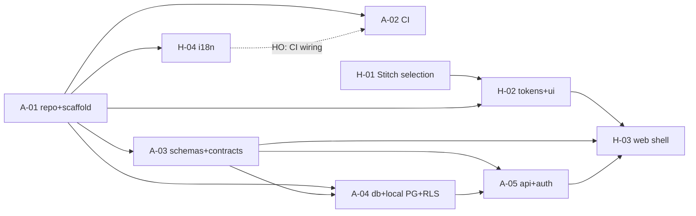

# TASKS.md — Task Board (Phase 0, Sprint 1)

> Governed by `docs/TEAM-WORKFLOW.md` — read it first. Seeded 2026-07-23 from
> ROADMAP Phase 0 (`kia-tracker-specs/docs/new/00-overview/ROADMAP.md`).

## Legend

**Row types:** `A-nn` AHMAD task · `H-nn` HUSSEIN task · `CR-nn` contract request
(HUSSEIN → AHMAD; only AHMAD edits `packages/contracts` + `packages/schemas`) ·
`HO-nn` handoff (a change needed in the other agent's zone: what, why, exact files).

**Statuses (exact format):** `BACKLOG` → `CLAIMED(AGENT, YYYY-MM-DD)` →
`IN-PROGRESS(branch)` → `REVIEW` → `DONE(YYYY-MM-DD, merge-sha)`, plus
`BLOCKED(needs X from Y)` at any point.

**Claim protocol:**
1. Bootstrap per TEAM-WORKFLOW §2 (read workflow, this board, both agents' latest
   session-log entries).
2. Pick the highest-priority unclaimed task **in your own track** whose
   dependencies are `DONE` — but open `CR`/`HO` rows addressed to you come first.
3. Set the row to `CLAIMED(you, date)` and push the coordination commit **before**
   writing code; set `IN-PROGRESS(branch)` when the branch exists.
4. One IN-PROGRESS task per agent. Blocked? Mark `BLOCKED(needs …)`, claim the next.
5. Update your row in the same session as every state change; never edit the other
   agent's rows.

## Board

| ID | Task | Owner | Status | Depends on | Notes |
|---|---|---|---|---|---|
| A-01 | Git init + monorepo scaffold (strict TS); GitHub deferred by owner | AHMAD | DONE(2026-07-24, d4235a2) | — | Owner decision 2026-07-24: git-only for now — origin = local bare repo `../readyloans.git`; GitHub repo/protection becomes a follow-up task when needed |
| A-02 | CI pipeline: lint/typecheck/test on push to develop/main, frozen lockfile | AHMAD | BACKLOG | A-01 | GitHub live (D-019/D-021); runs on PUSH, not PRs — no-PR workflow per D-021 |
| A-03 | packages/schemas + packages/contracts baseline (tenant, store, user, lead) | AHMAD | DONE(2026-07-24, 31f5f28) | A-01 | CONTRACT PUBLISHED — import from @readyloans/schemas + @readyloans/contracts; code-reviewed (14 findings fixed); 19 tests |
| A-04 | packages/db + local Docker Postgres (dev) + first migration (tenants/orgs/stores/users + RLS); staging = RDS via IaC | AHMAD | DONE(2026-07-24, 637c9fd) | A-01, A-03 | RLS proven live (8 isolation tests incl. negatives); Postgres on host port 5434 (5432/5433 busy); reviewed — 2 critical findings fixed (D-022); staging RDS still via A-07 |
| A-05 | Fastify api skeleton: health check + error envelope + Better Auth wiring | AHMAD | BACKLOG | A-01, A-03, A-04 | Auth contract published here unblocks H-03 |
| H-01 | Stitch design selection: 3–5 directions + palettes; owner picks; lock tokens | HUSSEIN | BLOCKED(needs design-direction pick from OWNER) | — | 5 directions generated in Stitch (projects "ReadyLoans H-01 — Direction 1–5"); comparison board delivered to owner; token lock in DECISIONS.md follows the pick |
| H-02 | Design tokens + Tailwind v4 + shadcn/ui setup in packages/ui (semantic layers, light/dark) | HUSSEIN | BACKLOG | A-01, H-01 | NO Tailwind Plus (owner decision 2026-07-23) |
| H-03 | apps/web shell: routing, layout, auth screens against A-05 contract | HUSSEIN | BLOCKED(needs A-03 + A-05 contract publication from AHMAD) | A-03, A-05, H-02 | Layout/routing may start after H-02; auth screens only after A-05 |
| H-04 | i18n scaffold FR-first (fr-CA default) with EN parity gate | HUSSEIN | BACKLOG | A-01 | Parity script here; CI wiring via HO to AHMAD |

### Backlog (next sprint candidates — do not claim in Sprint 1)

| ID | Task | Owner | Status | Depends on | Notes |
|---|---|---|---|---|---|
| A-06 | packages/core money math port + golden tests (tax/desking, commissions, amortization; ≥90% cov) | AHMAD | BACKLOG | A-01 | ROADMAP 0.6; legacy code = executable spec (now at reference/kia-tracker-specs) |
| A-08 | GitHub adoption + Dealpilot rebrand + reference import | AHMAD | DONE(2026-07-24, see merge) | A-01 | origin = github.com/FOURDE1/Dealpilot; @dealpilot/* packages; plan+legacy in reference/; new-machine setup in README |
| A-09 | Doc sweep: propagate "Dealpilot" name + D-020 client answers through reference/docs/new plan docs | AHMAD | BACKLOG | A-08 | Low priority; plan docs currently say ReadyLoans (noted in README/§2.1) |
| A-07 | AWS IaC baseline + first deploy, minimal-footprint cost ramp | AHMAD | BACKLOG | A-01, A-02 | ROADMAP 0.7 (incl. staging RDS db.t4g.small Single-AZ, VPC-private — D-013); every apply needs owner approval |
| H-05 | packages/ui core primitives (Button, Input, Form, Table, Dialog) on locked tokens | HUSSEIN | BACKLOG | H-02 | Feeds all Phase 1 module UIs |

---

## Task details

### A-01 — Repo + monorepo scaffold
**Scope:** `git init` in `main-project`; create the GitHub repo and push (**ask the
owner** for org/repo name + confirmation — externally visible action); branch
protection on `main` (no direct pushes, PR required) and create `develop`; pnpm +
Turborepo workspace: `apps/{web,api,workers,intake}`, `packages/{db,schemas,contracts,core,ui,i18n,ai}`
as minimal compiling stubs; TypeScript 5.9 `strict` shared base config; root lint/
format config; `.gitignore` + `.env.example`; commit lockfile.
**DoD:** `pnpm install && pnpm turbo build lint typecheck test` green locally on the
skeleton; repo pushed; branch protection verified; HUSSEIN can clone
(`main-project-hussein`).

### A-02 — CI pipeline
**Scope:** GitHub Actions on PRs to `develop`/`main`: `pnpm install --frozen-lockfile`,
turbo lint + typecheck + test (vitest); actions pinned to full commit SHAs; no
long-lived cloud keys. Include an i18n-parity job step that no-ops with a visible
"pending H-04" notice until HUSSEIN publishes the parity script (then wire it via
HUSSEIN's HO row).
**DoD:** a test PR shows all checks running and green; a deliberately broken PR fails.

### A-03 — Schemas + contracts baseline
**Scope:** Zod 4 schemas in `packages/schemas` for tenant(org), store, user/membership,
lead — integer cents convention, one status vocabulary per entity; ts-rest contracts
in `packages/contracts` for `/api/v1` CRUD/list (paginated) on those entities + the
error envelope shape; OpenAPI 3.1 generation stub.
**DoD:** both packages build; types importable from both zones; contracts merged to
`develop` (this merge is the publication event H-03 waits on).

### A-04 — DB package + local Postgres + first migration
**Scope:** `packages/db` with migration tooling; dev database = **local Docker
Postgres 16 via compose** — no cloud dependency (RDS over Supabase, D-013); the
**staging Amazon RDS for PostgreSQL 16 instance** (ca-central-1, db.t4g.small
Single-AZ, VPC-private, KMS-encrypted gp3) is defined in IaC and provisioned with
the A-07 baseline (**ask the owner** before any AWS apply); migration 0001:
`organizations`, `stores`, `users`/`memberships` with `tenant_id` scoping, RLS
ENABLED + FORCED, composite `(tenant_id, …)` indexes; CI-testable `db reset` from
migration zero (ephemeral Postgres containers in CI, ADR-023); integer cents;
soft deletes.
**DoD:** fresh `db reset` builds the schema from zero against local Docker
Postgres; RLS smoke test (seeded tenant #2 sees nothing of tenant #1) passes;
secrets only in env/Secrets Manager, `.env.example` updated.

### A-05 — API skeleton + Better Auth
**Scope:** Fastify v5 app in `apps/api` mounting the A-03 contracts; `/api/v1/health`;
global error handler emitting the contract error envelope; Better Auth with
organizations plugin, HTTPS-only cookies, deny-by-default auth with explicit public
allowlist (health, auth routes); pino structured logs with request IDs; session/user
contract published for the web app.
**DoD:** API boots locally against the A-04 DB; sign-up/sign-in/sign-out + `me`
round-trip verified with real requests; unauthenticated requests to protected
routes rejected; auth contract merged to `develop` (unblocks H-03 auth screens).

### H-01 — Stitch design selection
**Scope:** Use **Google Stitch via its MCP** to generate 3–5 professional design
directions + color palettes for a data-dense, bilingual (FR-first) dealership
CRM/DMS — light + dark, WCAG 2.2 AA contrast. The Stitch MCP is **not yet
connected**: ask the owner to connect it before starting; do not substitute another
tool without owner approval. Present the directions to the owner; the owner picks;
lock the winning palette/typography/radius/density as the token source of truth.
**DoD:** owner has explicitly selected a direction; locked token values recorded in
`docs/DECISIONS.md` (tagged `[HUSSEIN]`) and handed to H-02.

### H-02 — Tokens + Tailwind v4 + shadcn/ui in packages/ui
**Scope:** Encode the H-01 locked tokens as CSS custom properties in primitive →
semantic → component layers (components reference semantic only); Tailwind CSS v4 +
shadcn/ui base setup in `packages/ui` (NO Tailwind Plus); light/dark themes both
meeting ≥4.5:1 text contrast; export a themed demo story/page proving tokens drive
shadcn components.
**DoD:** `packages/ui` builds; demo renders in both themes; tokens documented in the
package README; merged to `develop`.

### H-03 — apps/web shell
**Scope:** React 19 + Vite 6 SPA in `apps/web`: react-router v7 route tree (public
auth routes + protected app layout), TanStack Query v5 client wired to the ts-rest
contracts from `develop`, app layout (nav/sidebar/topbar) on `packages/ui`, auth
screens (sign-in/sign-up/sign-out, session guard) against the **A-05 published
contract** — no hand-written API types. **Sequencing:** routing + layout may start
once H-02 is DONE; auth screens must wait for A-05 `DONE`.
**DoD:** `pnpm dev` serves the shell; real sign-in against the local API redirects
into the protected layout; unauthenticated access redirects to sign-in; basic
Playwright e2e for the auth journey passes.

### H-04 — i18n scaffold FR-first
**Scope:** react-i18next in `packages/i18n` with `fr-CA` as default locale and
`en-CA` secondary (Bill 96: FR-first including staff UI); namespace layout +
typed keys; language switcher hook; **EN↔FR key-parity check script** (fails on any
key missing in either language) exposed as a package script; seed both locales for
the H-03 shell strings. Then file an `HO` row for AHMAD to wire the parity script
into the A-02 CI pipeline (`.github/**` is AHMAD's zone).
**DoD:** shell renders FR by default and switches to EN with zero missing keys;
parity script exits non-zero when a key is removed from one locale (demonstrated);
HO row filed for CI wiring.

---

## Sprint 1 dependency map

**Day-1 parallel start:** AHMAD → A-01. HUSSEIN → H-01 (needs no repo; needs owner
to connect the Stitch MCP). Neither agent waits on the other to begin.
