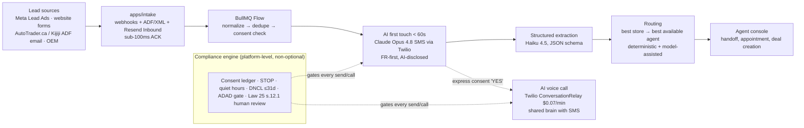

# ReadyLoans — Executive Summary

This document is the single entry point to the ReadyLoans documentation set: it states what ReadyLoans is, who it serves, why we are building it now, the two product pillars (multi-tenant white-label CRM/DMS + AI lead-automation engine), and an honest assessment of the current Kia Mont-Laurier Deal Tracker codebase that ReadyLoans grows out of. Every technology statement here conforms to the canonical decisions in [ARCHITECTURE-DECISIONS.md](./ARCHITECTURE-DECISIONS.md) (referenced as ADR-00X); delivery sequencing is in [ROADMAP.md](./ROADMAP.md); assumptions awaiting the owner's confirmation are in [OPEN-QUESTIONS.md](./OPEN-QUESTIONS.md).

## Table of Contents

1. [What ReadyLoans Is](#1-what-readyloans-is)
2. [Who It Serves](#2-who-it-serves)
3. [Why Now](#3-why-now)
4. [Pillar 1 — Multi-Tenant White-Label CRM/DMS](#4-pillar-1--multi-tenant-white-label-crmdms)
5. [Pillar 2 — AI Lead-Automation Engine](#5-pillar-2--ai-lead-automation-engine)
6. [Business Model](#6-business-model)
7. [Current State — Honest Assessment](#7-current-state--honest-assessment)
8. [Target Architecture at a Glance](#8-target-architecture-at-a-glance)
9. [Documentation Map](#9-documentation-map)

---

## 1. What ReadyLoans Is

ReadyLoans is a **production-grade, multi-tenant, white-label dealership platform for the Canadian market**, built Quebec-first (Bill 96 French-language equivalence, Law 25 privacy, CASL/CRTC communications compliance). It combines two things competitors sell separately:

1. **A full dealership CRM/DMS** — leads, contacts, deal pipeline, desking/finance math (GST/QST/HST-correct), inventory command center, garage work orders, driver dispatch, pre-delivery compliance, funding tracking, commissions with clawbacks, documents/bill-of-sale, and accounting reports — operated per rooftop, branded per tenant.
2. **An AI lead-automation layer** — webhook/ADF lead intake → instant bilingual AI SMS engagement (<60 s) → structured qualification and data capture → routing to the best dealership in the group → assignment to the best available agent — with AI voice as a follow-on channel, all gated by a platform-level Canadian compliance engine.

It evolves the existing single-store **Kia Mont-Laurier Deal Tracker** (React 18 + Vite + Tailwind, Express, Supabase Postgres, react-i18next EN/FR) via a **strangler rebuild** (ADR-026): the current app's business rules are the asset and are ported into a tested core library; its security/tenancy/money foundations are rebuilt from scratch on the canonical stack (ADR-001…ADR-025). The launch is a **clean start**: all legacy data is test data and none of it is migrated — production opens on a clean, empty database with seed/reference configuration, and commission plans and store configuration are entered fresh at tenant onboarding (ADR-026, amended 2026-07-23).

## 2. Who It Serves

### Founding tenants (the owner's own group — tenant #1–#3)

| Store (rooftop) | Province | Role in the network | Store-specific systems |
|---|---|---|---|
| Kia Mont-Laurier | Quebec | Franchise dealership; first onboarded tenant (clean start — no legacy data migrated) | Merlin bill-of-sale; QC GST 5% + QST 9.975%; QC safety regime; own garage (QC inspections/maintenance only — no ON safety) |
| ReadyCar | Ontario | Used-vehicle store | CAMS bill-of-sale; ON 13% HST; ON safety regime |
| Riverside Auto Finance | Ontario | Finance origination arm | Receives finance-qualified leads from the AI layer; subprime/credit-band routing |

This multi-entity structure is not incidental — it is the product's proof case: one **Organization** (dealer group) with multiple **Stores** under the Platform → Organization → Store hierarchy (ADR-007), with staff who span stores (memberships, ADR-006), and cross-store AI lead routing that single-rooftop competitors cannot offer.

### Target market (SaaS phase)

- **Canadian independent dealerships and small dealer groups (1–10 rooftops)** priced out of Salesforce Automotive Cloud (~$300/user/mo) and underserved by US-centric AI vendors (Impel, Podium, Numa, Toma) — none of which lead with CASL/Law 25/Bill 96 compliance or FR-first bilingual agents.
- **Quebec dealerships specifically**, where Bill 96 makes an equivalent French UI and French-first customer communication a legal requirement the incumbents do not meet.

## 3. Why Now

Three forces converge:

1. **The asset already exists.** ~24,000 lines of working dealership UI encode real, validated domain logic: correct QC tax structure (GST 5% + QST 9.975% on the correct base, trade-in credit, Section 87 exemption), 12 real commission pay plans with pads/tiers/overrides, a lead scoring engine (12 operators, 20+ fields), round-robin/load-balanced lead assignment, dispatch conflict detection (4-hour window), and 944/944 EN/FR i18n key parity. The July 2026 audit's verdict: *"treat the current app as an executable spec"* — harvest the product, rebuild the foundation.
2. **Speed-to-lead is a measurable, unsolved industry failure.** Leads contacted within 5 minutes are **21× more likely to qualify**; only **13.2% of dealerships respond within 5 minutes**; **78% of buyers purchase from the first dealer to call back**; 43.2% of automotive leads are mishandled and 14.1% never reach a CRM. An AI layer that answers every lead in under 60 seconds, 24/7, in the customer's language, is the single highest-ROI feature in the category — and the sales pitch writes itself from these numbers.
3. **A defensible Canadian moat.** The compliance engine (CASL consent ledger with 6/24-month implied-consent expiry, global STOP, CRTC quiet hours, DNCL ≤31-day freshness, ADAD express-consent gating on outbound AI calls, Law 25 s.12.1 human review for finance-significant automated decisions, first-turn AI disclosure in FR/EN — ADR-022) is table stakes for operating legally in Canada and a differentiator no US incumbent has built. Penalties are real: CASL up to $10M per corporate violation; Law 25 up to C$25M or 4% of worldwide turnover.

## 4. Pillar 1 — Multi-Tenant White-Label CRM/DMS

**Target** (per ADRs; the legacy system is single-store with no tenant concept):

- **Tenancy:** shared schema, `tenant_id` + `store_id` on every row, Postgres RLS **ENABLED AND FORCED**, `SET LOCAL` per-transaction tenant context, `USING(true)` policies permanently banned (ADR-007/008). Hierarchy: Platform → Organization (dealer group) → Store (rooftop).
- **Auth & roles:** Better Auth 1.3+ with the organization plugin; 10 platform roles (`owner`, `gm`, `sales_manager`, `used_car_manager`, `fi_manager`, `salesperson`, `wholesale_manager`, `logistics`, `admin_office`, `bdc_agent`) via memberships (user, org, store, roles[]); MFA (TOTP) required for owner/gm/admin (ADR-006).
- **White-label:** runtime CSS custom properties from a `tenant_branding` record, resolved custom domain → subdomain → org; OKLCH-derived dark palettes; WCAG AA auto-validation; the same branding record drives emails and PDFs server-side. Hardcoded Kia branding anywhere is a release blocker (ADR-018).
- **Module scope:** every module of the current tracker, rebuilt to parity on the new stack — deal pipeline (10 stages), desking with per-deal `gst_cents`/`qst_cents`/`pst_cents`/`hst_cents` written from the desking engine (ADR-009), inventory, garage/work orders, dispatch, pre-delivery gates, funding, commissions (pad-before-rate, monthly tiers, supervisor overrides, clawbacks), documents with immutable bill-of-sale snapshots (ADR-021), accounting/expense reports.
- **Data invariants:** all money INTEGER cents; soft deletes; real FKs; one enum source in `packages/schemas`; UTC (ADR-009).

Detailed rules per module live under `01-business-logic/`; requirements under `02-product-requirements/`.

## 5. Pillar 2 — AI Lead-Automation Engine

**Target** (entirely new; nothing equivalent exists in the legacy system):

Key design commitments (ADR-005, ADR-012, ADR-020, ADR-022):

- **Intake:** per-tenant endpoints `/in/v1/leads/{tenantSlug}/{sourceKey}` accepting JSON and ADF/XML, plus a Resend Inbound email parser (AutoTrader.ca and Kijiji Autos deliver ADF by email). Deterministic-ID dedupe; provider signature verification; consent basis recorded at intake (implied-inquiry, 6-month CASL window).
- **Conversation:** stateless Claude Messages API + tool runner with a small audited tool set (`lookup_inventory`, `check_agent_availability`, `book_appointment`, `create_or_update_lead`, `request_human`, `send_credit_app_link`); per-tenant prompt caching (~90% input-cost cut); history in Postgres.
- **Voice:** Twilio ConversationRelay (BYO-Claude over WebSocket) so SMS and voice share one brain and tool set; Telnyx documented as the latency/cost alternate. Outbound AI calls only with recorded express consent (ADAD) and inside CRTC quiet hours.
- **Routing:** deterministic rules (language, presence/availability, load, ad-spend tallies) + model-assisted scoring; cross-tenant reads only through audited service-role functions (ADR-007); finance-significant automated decisions carry Law 25 s.12.1 disclosure + human review.
- **Metrics as product:** per-store/per-agent speed-to-lead dashboards (time-to-first-touch, contact rate, appointment rate, show rate) — SLO: AI first-touch < 60 s (ADR-025).

## 6. Business Model

Per ADR-024 (**Target** — pricing points to be confirmed in [OPEN-QUESTIONS.md](./OPEN-QUESTIONS.md) Q-01):

| Element | Decision |
|---|---|
| Unit of sale | Per rooftop (Store), monthly subscription via Stripe Billing |
| Price wedge | $300–$800/mo tiers — undercuts quote-only AI vendors ($500–$2,500+/rooftop) and Numa's ~$200–$400 entry while bundling the CRM/DMS they don't have |
| Usage metering | AI voice minutes, SMS segments, AI conversations via Stripe Meters; overage billed monthly |
| Taxes | Stripe Tax for GST/QST/HST on invoices |
| Entitlements | Seats, stores, AI quotas, feature flags derived from the subscription; the same quotas drive rate limits (ADR-011) |
| Dunning | Grace period → read-only mode; never data deletion |
| Upsell path | Pay-per-AI-booked-appointment metered price (Numa-style), enterprise SSO via WorkOS ($125/connection) |

Positioning vs incumbents: Impel (enterprise, ~$100M revenue, OEM deals), Podium (unified inbox), Numa (1,300+ dealerships, service-department strength), Toma (voice-first, a16z) — all bolt AI onto third-party CRMs. ReadyLoans owns the system of record, so the AI writes into real inventory, real agent availability, and real finance products (Riverside), with no integration tax — and is the only Canada/Quebec-native offer.

## 7. Current State — Honest Assessment

The July 2026 adversarial audit (8 specialist auditors; 24/24 critical/high findings confirmed, 0 refuted) is the ground truth. Planning docs disagree with each other and with the code (`prd.json` marks everything "completed"; it is not), so this section is the corrected picture.

### Scorecard (audit, 2026-07-19)

| Dimension | Score | Dimension | Score |
|---|---|---|---|
| Security | 1/10 | Backend architecture | 3/10 |
| Multi-tenancy | 1/10 | Frontend architecture | 3/10 |
| Financial correctness | 2/10 | Database | 3/10 |
| Ops/DevOps | 2/10 | Quality/testing | 3/10 |
| **Feature breadth / product value** | **7/10** | Overall production readiness | ≈2.5/10 |

### What genuinely works (the asset to harvest)

Leads (webhooks, scoring, assignment, dedupe/merge, convert-to-deal), contacts with weighted full-text search, 10-stage deal kanban with 50+ fields, desking calculator (provincial taxes, trade-ins, F&I, rebates, DealerTrack PDF import), Quebec/Ontario bill-of-sale generator, inventory command center (costs, statuses, photos, days-on-lot), driver dispatch with conflict detection, accounting/expenses (the best-designed, fully integer-cents data model in the project), 4 report types with PDF/Excel export, 12 real commission pay plans, tasks, global search, and **944/944 EN/FR key parity**.

### What is broken (why we rebuild rather than patch)

- **Security:** only 2 of ~150 endpoints authenticated; all ~140 RLS policies are `USING(true)`; anon key + browser-direct DB writes make the database world-open; a storage bucket with insurance/funding documents is anon-writable; live Supabase service-role and Resend keys sit in the working tree (rotation is a Phase 0 task); a forgeable localStorage login blob lets anyone impersonate anyone.
- **Money:** bill of sale double-counts extended warranty on the signed legal total; dollars-vs-cents schizophrenia (the $1,500 commission pad subtracts as $15); clawbacks record $0 and never reverse commissions; supervisor overrides never pay out; manufacturer rebates taxed pre-tax (undercharges ~$299.50 on a $2,000 rebate); the signed bill of sale is never persisted; zero automated tests on any tax/desking/commission path.
- **Architecture:** no background job/queue/cron system anywhere, so every automation, notification, escalation, and workflow is inert scaffolding; no transactions; unbounded queries silently truncate at 1,000 rows (wrong commission-tier payouts past ~1,000 deals); tenancy middleware exists but is registered after routes and never runs.
- **Compliance exposure:** PII (driver's licences, DOB, income, financial docs) effectively public → PIPEDA + Law 25 breach exposure; legally wrong contracts; the desking/leads screens francophone staff use most leak hardcoded English (Bill 96).

### Verdict (adopted as ADR-026)

**Strangler rebuild.** Neither throw away nor patch: the three SaaS-critical layers (auth/authz, tenancy, money model) are absent or inverted by design, but the domain logic is worth harvesting. Business rules are ported to `packages/core` with golden-number tests first; the legacy app is retired module-by-module; **no new features land on the legacy codebase**. Its data is never migrated — legacy data is test data, and production launches on a clean database with pay plans and store configuration entered fresh at onboarding (ADR-026, amended 2026-07-23). Audit effort estimate (2–3 senior engineers): secure single-tenant parity ~2–3 months; hardened multi-tenant SaaS ~4–6 months; AI layer beyond that (see [ROADMAP.md](./ROADMAP.md)).

## 8. Target Architecture at a Glance

Canonical stack (full detail and rationale in [ARCHITECTURE-DECISIONS.md](./ARCHITECTURE-DECISIONS.md)):

| Layer | Choice |
|---|---|
| Monorepo | TypeScript 5.9 strict, pnpm + Turborepo — `apps/{web,api,workers,intake}`, `packages/{db,contracts,schemas,core,ui,i18n,ai}` (ADR-001) |
| Frontend | React 19 + Vite 6 SPA, react-router v7, TanStack Query v5; direct browser→database queries banned (the legacy direct-Supabase anti-pattern) (ADR-002) |
| API | Fastify v5, ts-rest + Zod contract-first, `/api/v1`, OpenAPI 3.1 (ADR-003) |
| Data | Amazon RDS for PostgreSQL 16 in ca-central-1 (Law 25 residency), VPC-private, RDS Proxy pooling at launch, forced RLS, integer cents (ADR-007/008/009, amended 2026-07-24) |
| Jobs/realtime | BullMQ 5 on ElastiCache for Valkey; Socket.IO 4 + Redis adapter on Valkey (tenant-namespaced rooms, events emitted from API/workers) (ADR-004/010/012) |
| AI | Claude Opus 4.8 conversation + Haiku 4.5 extraction, tool runner, per-tenant prompt caching, compliance engine (ADR-022) |
| Comms | Resend + React Email (+ Inbound), Twilio Messaging + ConversationRelay voice (ADR-020) |
| Hosting | AWS `ca-central-1` (Montreal — full Canadian compute+data residency): SPA on S3 + CloudFront with per-tenant ACM custom domains (= white-label mechanism); API/workers/intake as Docker on ECS Fargate behind an ALB; WAF, Route 53, Secrets Manager; database = RDS for PostgreSQL in the same VPC's private subnets, files/images on S3 + CloudFront — single-vendor AWS, the former Supabase exit-path clause discharged (ADR-008/013/014, amended 2026-07-24) |
| Billing/observability | Stripe Billing + Meters + Stripe Tax; Sentry + PostHog EU + OpenTelemetry + pino → Better Stack (ADR-024/025) |

## 9. Documentation Map

| Directory | Contents |
|---|---|
| `00-overview/` | This summary, [ARCHITECTURE-DECISIONS.md](./ARCHITECTURE-DECISIONS.md) (canonical ADRs), [ROADMAP.md](./ROADMAP.md), [OPEN-QUESTIONS.md](./OPEN-QUESTIONS.md) |
| `01-business-logic/` | As-is + target rules per module: leads, contacts, deals/pipeline, desking/finance, inventory, garage/work orders, dispatch, delivery, documents, lenders/bill-of-sale, commissions/clawbacks, sourcing, appointments/tasks, automation/notifications |
| `02-product-requirements/` | Vision/goals, functional requirements |
| `03-architecture/` | System architecture, multi-tenancy, API design |
| `04-security/` | AuthN/AuthZ, API security, data protection |
| `05-database/` | Database architecture, schema design |
| `06-tech-stack/` | Frontend, backend, UI design system, media/i18n/validation |
| `07-infrastructure/` | Hosting topology, CI/CD, observability, reliability & cost |
| `08-ai-automation/` | AI overview, conversation engine, voice agent |
| `09-admin-whitelabel/` | Admin console, white-labeling, localization & legal |
