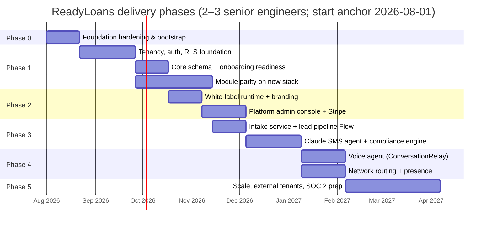

# ReadyLoans — Delivery Roadmap

This document is the phased delivery plan that turns the audited Kia Mont-Laurier Deal Tracker into the ReadyLoans multi-tenant platform, sequenced per the strangler-rebuild strategy (ADR-026): security/tenancy/money foundations first, module parity second, white-label and billing third, AI automation last — because the AI layer writes into the CRM and is only as trustworthy as the foundation beneath it. Each phase lists concrete scope, measurable exit criteria, rough effort (assuming **2–3 senior engineers**, per the audit estimate), and the principal risks. Dates are planning anchors from a 2026-08-01 start; effort ranges are the commitment, dates are not.

## Table of Contents

1. [Timeline Overview](#1-timeline-overview)
2. [Phase 0 — Foundation Hardening & Bootstrap](#2-phase-0--foundation-hardening--bootstrap)
3. [Phase 1 — Multi-Tenant Core](#3-phase-1--multi-tenant-core)
4. [Phase 2 — White-Label + Platform Admin](#4-phase-2--white-label--platform-admin)
5. [Phase 3 — AI Automation MVP (SMS)](#5-phase-3--ai-automation-mvp-sms)
6. [Phase 4 — Voice + Network Routing](#6-phase-4--voice--network-routing)
7. [Phase 5 — Scale & External Tenants](#7-phase-5--scale--external-tenants)
8. [Cross-Phase Workstreams](#8-cross-phase-workstreams)
9. [Sequencing Rules & Dependencies](#9-sequencing-rules--dependencies)

---

## 1. Timeline Overview

| Phase | Calendar (approx.) | Effort (eng-weeks) | Headline outcome |
|---|---|---|---|
| 0 — Foundation hardening | Weeks 0–3 | 4–6 | Leaked keys dead; monorepo + CI live; AWS `ca-central-1` skeleton deployed via IaC; core math ported with golden tests |
| 1 — Multi-tenant core | Months 1–4 | 30–40 | Kia ML running on the new stack as tenant #1, secure single-tenant parity |
| 2 — White-label + admin | Months 4–5.5 | 12–18 | ReadyCar + Riverside live as tenants; branding + billing operational |
| 3 — AI automation MVP | Months 5.5–7.5 | 16–24 | AI SMS first-touch < 60 s on real Kia ML leads, compliance engine enforced |
| 4 — Voice + routing | Months 7.5–9.5 | 16–24 | AI voice calls (consent-gated) + cross-store routing live |
| 5 — Scale | Months 9.5–12+ | ongoing | First external paying tenants; hardening, partitioning, SOC 2 prep |

---

## 2. Phase 0 — Foundation Hardening & Bootstrap

**Goal:** stop the bleeding on the live system and stand up the greenfield skeleton. Nothing user-visible ships.

### Scope

| # | Item | Detail |
|---|---|---|
| 0.1 | **Rotate leaked credentials** | Supabase service-role key, Supabase anon key, Resend API key found in the working tree (audit Emergency #1). Rotate at provider, purge from all copies, move to AWS Secrets Manager (runtime) and GitHub Actions secrets (CI) only (ADR-014/023). |
| 0.2 | **Close the open database** | Lock the anon-writable `deal-files` storage bucket (signed URLs only); disable browser-direct writes where feasible without breaking daily ops; keep the legacy API off the public internet. |
| 0.3 | **Scrub confidential data** | Real employee names + commission compensation committed in docs/seeds; env-guard the seed scripts that point DELETE statements at production. |
| 0.4 | **Freeze legacy features** | No new features on the Express app (ADR-026). Bug fixes only, each logged as a rules-parity note — the legacy app is the business-rules reference, not a data source. |
| 0.5 | **Monorepo bootstrap** | pnpm + Turborepo, TypeScript 5.9 strict, `apps/{web,api,workers,intake}` + `packages/{db,contracts,schemas,core,ui,i18n,ai}` scaffolds (ADR-001); GitHub Actions skeleton: lint, typecheck, Vitest, OpenAPI check, i18n parity gate (ADR-023). |
| 0.6 | **Port the money math with golden tests** | `packages/core`: desking/tax engine (QC GST 5% + QST 9.975%, ON 13% HST, trade-in credit, Section 87, post-tax manufacturer rebates — fixing the pre-tax bug), commission engine (integer cents, pad-before-rate, monthly tiers across all deals in period, overrides to supervisor, clawback reversal), amortization. ≥90% coverage gate on `packages/core` (ADR-023). The legacy app is the executable spec; the audit's defect list is the negative test suite. |
| 0.7 | **AWS foundation (IaC) + first deploy** | Terraform/CDK baseline in the monorepo, applied by CI — mandatory per ADR-014: `ca-central-1` VPC (2 AZs, public/private subnets, single NAT gateway), ECR repos, ECS Fargate cluster + ALB (TLS 1.3, HTTP→HTTPS), S3 + CloudFront SPA skeleton with ACM certs, ElastiCache for Valkey, **staging Amazon RDS for PostgreSQL 16 (db.t4g.small Single-AZ, VPC-private — security-group ingress from ECS task SGs only, KMS-encrypted gp3, credentials in Secrets Manager; dev uses local Docker Postgres — ADR-008, amended 2026-07-24)**, WAF (CloudFront + ALB), Route 53, Secrets Manager. GitHub Actions authenticates via OIDC — no long-lived AWS keys (ADR-023). Skeleton apps deployed end-to-end with the production deploy mechanics from day one (blue-green decided 2026-07-23, ADR-023): SPA build → versioned S3 release + CloudFront pointer flip (instant rollback); images → ECR → **ECS blue/green via CodeDeploy** (two ALB target groups per routed service, alarm-gated traffic shifting, instant revert to blue; `workers` via circuit-breaker task swap — ci-cd.md §7–8). **Build-phase cost ramp (owner decision 2026-07-23):** infrastructure runs at minimal footprint until production launch — smallest Fargate task sizes (a single API task is acceptable pre-launch), dev-tier/single-instance dev and staging, scale-to-zero wherever possible; the full production envelope (~$750–$1,100/mo — restated 2026-07-24 for the RDS move, ADR-014) activates only at production launch. |
| 0.8 | **Design selection via Google Stitch (H-01) — precedes all UI build** | Owner decision 2026-07-23 (ADR-017 amended): before any UI code is written, the design direction, color palette, and UI style are selected using **Google Stitch** — candidate directions generated via its **MCP server** (to be connected by the user; manual Stitch use in the browser is the fallback), the owner picks one, and the chosen direction is **locked as the design tokens** in `packages/ui`, against which shadcn/ui is themed (process: `06-tech-stack/ui-design-system.md` §1.1). No Tailwind Plus purchase — the free professional stack delivers the UI. This step gates every Phase 1 screen: module-parity UI work must not start before the tokens are locked. |

### Exit criteria

- All three leaked keys rotated and confirmed dead; no secrets in any repo.
- `pnpm turbo build lint test` green in CI on the monorepo skeleton.
- IaC baseline applied by CI; skeleton SPA served from CloudFront and a health-checked API task running on ECS Fargate in `ca-central-1`; staging RDS instance (db.t4g.small Single-AZ, VPC-private) provisioned by the same IaC and reachable from the API task only (no public accessibility — ADR-008).
- Infrastructure running at the build-phase minimal-footprint cost profile — no production-envelope spend before launch (owner decision 2026-07-23).
- Stitch design selection (H-01) complete: owner-picked direction locked as design tokens in `packages/ui` (ADR-017 amended 2026-07-23) — Phase 1 UI work is blocked until this lands.
- `packages/core` desking/tax/commission functions pass golden-number tests reproducing known-good legacy outputs **and** corrected outputs for the five audited money bugs (warranty double-count, $15 pad, $0 clawback, inverted overrides, pre-tax rebate).
- Written sign-off that legacy feature development is frozen.

### Effort & risks

- **Effort:** 4–6 eng-weeks (2–3 weeks calendar).
- **Risks:** (a) rotating keys breaks the legacy tracker's integrations — mitigate with a scheduled maintenance window; (b) golden tests reveal ambiguity about which legacy output is "correct" — resolve against the audit's findings and Quebec/Ontario tax law, and log every deliberate divergence for the owner; (c) the AWS/IaC baseline (VPC, IAM, task definitions) is new ops surface the PaaS route avoided (accepted with the ADR-014 decision) — timebox the Terraform/CDK skeleton and never hand-configure the console.

---

## 3. Phase 1 — Multi-Tenant Core

**Goal:** secure single-tenant parity on the new stack, with tenancy built in from row one. Kia Mont-Laurier becomes tenant #1.

### Scope

| Workstream | Detail |
|---|---|
| **Tenancy + auth + RLS** | `organizations` → `stores` → `memberships(user, org, store, roles[])`; Better Auth 1.3+ with organization plugin, 10 roles, MFA for owner/gm/admin (ADR-006); `tenant_id`/`store_id` on every table, RLS ENABLED + FORCED, `SET LOCAL app.tenant_id` per transaction, SECURITY DEFINER membership helpers, composite `(tenant_id, …)` indexes (ADR-007/008). Legacy passwordless login and localStorage session deleted. |
| **Core schema** | Greenfield schema in `packages/db`: integer cents everywhere, per-deal `gst_cents`/`qst_cents`/`pst_cents`/`hst_cents` written by the desking engine, real FKs (no name-ILIKE joins), soft deletes, one status vocabulary per entity in `packages/schemas`, `activity_events` append-only audit trail (ADR-009). CI-tested `db reset` from migration zero — the legacy migration chain cannot build a fresh DB and is not carried forward. |
| **API v1** | Fastify v5, ts-rest + Zod contracts, `/api/v1`, OpenAPI 3.1, global auth with explicit public allowlist, layered rate limiting (ADR-003/011/016). Every legacy endpoint re-created behind auth + tenant scoping — none migrated as-is. |
| **Jobs foundation** | BullMQ 5 on ElastiCache for Valkey: email queue, PDF/Excel queue (Playwright/Chromium workers replace PDFKit — ADR-021), repeatable jobs replacing the nonexistent scheduler (task-overdue sweep, escalation checker) (ADR-010/012). |
| **Module parity** | Rebuild to functional parity, in dependency order: contacts → deals/pipeline (10-stage kanban) → desking (writes tax split-columns back to the deal — fixes the never-persisted desking state) → inventory → delivery/PDI gates → dispatch → commissions/clawbacks (working this time) → documents incl. immutable bill-of-sale snapshots → funding → accounting reports. TanStack Table grids, shadcn/ui on tokens, react-i18next with fr-CA default (ADR-017/019). UI work builds on the design tokens locked by the Phase 0 Stitch design selection (H-01) — no screen starts before that lock. |
| **Clean-database launch + onboarding readiness** | **No data migration (owner decision 2026-07-23):** all legacy data is test data — none of it is carried forward; no ETL, no historical commission reconciliation, no dual-run, no read-only-legacy period. Production launches on a clean, empty database plus seed/reference configuration (provinces, tax profiles, status vocabularies, document templates). Tenant provisioning creates org = owner's group, store = Kia ML; the 12 commission pay plans and all store configuration are entered fresh through the app at onboarding and validated against the legacy code's rules (the executable spec) with owner sign-off. |

### Exit criteria

- Kia Mont-Laurier staff run daily operations (deals, desking, delivery, dispatch, commissions, reports) on the new app, starting from a clean database; the legacy Express app is shut down (retained only as a code/business-rules reference — its data is not migrated).
- Zero endpoints reachable without a session; RLS policies verified by an automated cross-tenant leak test (a seeded tenant #2 must see nothing of tenant #1) run in CI.
- All money paths integer-cents end-to-end; commission plans entered fresh at onboarding produce a first monthly commission run from the corrected engine with owner sign-off (no historical reconciliation — legacy data is test data).
- Bill of sale renders FR-first for Quebec, persists an immutable hashed snapshot, and totals are correct (no warranty double-count; post-tax rebates).
- API p95 < 300 ms on the deal-board and lead-list endpoints (ADR-025 SLO) under staging load.

### Effort & risks

- **Effort:** 30–40 eng-weeks (~2.5–3.5 months calendar with 3 engineers).
- **Risks:** (a) *parity scope creep* — the legacy app has ~46 tables and three generations of half-built features; parity means the audit's "functional" list only, not the stubs; (b) *fresh-configuration gaps* — pay plans and store config are entered by hand at onboarding, not migrated; mitigate by validating every entered plan against the legacy code's rules (the executable spec) and the audit's defect list, with owner review; (c) *desking correctness disputes* — corrected tax math will produce different numbers than staff are used to; owner-facing changelog required; (d) biggest schedule risk in the whole plan — if parity slips, Phases 2–3 slip 1:1.

---

## 4. Phase 2 — White-Label + Platform Admin

**Goal:** the platform becomes multi-tenant in fact, not just in schema: branding, tenant administration, and billing. ReadyCar and Riverside onboard as tenants #2 and #3.

### Scope

| Workstream | Detail |
|---|---|
| **Runtime white-label** | `tenant_branding` record (logo/dark logo/favicon, OKLCH colors, font, radius/density, legal name); resolution custom domain → `{dealer}.readyloans.app` subdomain → login org; CSS variables injected pre-first-paint; WCAG AA auto-validation; derived dark palettes (ADR-018). Release-blocker scan: no hardcoded "Kia" branding anywhere. |
| **Server-side branding** | Same record drives React Email templates and PDF headers/footers (ADR-020/021); per-tenant sending domains/DKIM as tenants mature. |
| **Custom domains** | Per-tenant custom domains on CloudFront with DNS-validated ACM certs (SaaS Manager / multi-tenant distribution model) — the white-label mechanism (ADR-014). |
| **Platform admin console** | Tenant CRUD, store CRUD, membership/invitation management, per-store config (province, tax profile, `bill_of_sale_system` cams/merlin, `esign_platform`, business hours, holiday calendar, `alert_thresholds` JSONB), feature flags, and full subscription-plan/pricing management — create/edit/reprice plans, entitlements, per-tenant overrides, grandfathering (owner decision 2026-07-23; ADR-024) (spec: `09-admin-whitelabel/admin-console.md`). |
| **Billing** | Stripe Billing per-rooftop tiers + Stripe Meters (AI minutes, SMS segments) + Stripe Tax GST/QST/HST; entitlements cached on the tenant record and read by rate limiting; dunning → read-only (ADR-024). **Pricing is data, not code:** Stripe products/prices are created and repriced through the platform admin console, with per-tenant overrides and grandfathering — no deploy to change a price (owner decision 2026-07-23). Internal stores run on a comped internal plan. |
| **Tenant #2/#3 onboarding** | ReadyCar (Ontario: HST 13%, CAMS, ON safety rules) and Riverside Auto Finance onboarded through the real onboarding flow — the flow is the deliverable; the stores are the test. |

### Exit criteria

- Three tenants live under one deployment; a cross-tenant automated leak test passes for all pairs.
- A new tenant can be created, branded, domain-mapped, and invited through the admin console in **< 1 hour** with no engineer involvement.
- One end-to-end Stripe invoice generated in test mode with correct GST/QST/HST and metered line items.
- A plan price change made in the admin console propagates to Stripe and to new invoices without a deploy; a per-tenant override/grandfathered price is honored end-to-end.
- Ontario-specific behavior verified on ReadyCar: 13% HST desking, CAMS bill-of-sale document path, ON safety workflow — proving per-store config actually branches behavior.

### Effort & risks

- **Effort:** 12–18 eng-weeks (~1.5 months calendar, overlapping Phase 1's tail).
- **Risks:** (a) Ontario rules were never fully exercised in the legacy Quebec-first app — expect unmodeled ON-specific gaps (OMVIC fee register, ON safety semantics); (b) branding leakage in PDFs/emails is easy to miss — mitigate with a CI snapshot test rendering each template for two synthetic brands.

---

## 5. Phase 3 — AI Automation MVP (SMS)

**Goal:** the differentiator ships — instant, compliant, bilingual AI SMS engagement on every inbound lead, writing into the CRM it lives in.

### Scope

| Workstream | Detail |
|---|---|
| **Intake service** | `apps/intake`: per-tenant endpoints `/in/v1/leads/{tenantSlug}/{sourceKey}` (JSON + ADF/XML), Resend Inbound email parser for ADF-by-email (AutoTrader.ca, Kijiji Autos), provider signature verification, sub-100ms ACK, deterministic-ID dedupe (ADR-005). Built as a generic, configuration-driven connector framework (ADR-005, amended 2026-07-23): all known lead sources ship as connector definitions, and any new source — JSON webhook, ADF/XML email, or API polling — is added by configuration, not code. First providers per Q-03 in OPEN-QUESTIONS (default: website forms + Meta Lead Ads, then AutoTrader.ca ADF). |
| **Lead pipeline Flow** | BullMQ Flow: intake → normalize → dedupe → consent check → AI first-touch → extraction → routing → assignment; idempotent children; per-tenant limiters (ADR-012). |
| **Compliance engine** | Platform-level, before any message sends: per-lead consent ledger (express/implied, source, timestamp, 6/24-month expiry), immediate global STOP, channel-scoped quiet hours (CRTC 9:00–21:30 weekdays / 10:00–18:00 weekends recipient-local for outbound voice; platform SMS window default 9:00–21:00 per-tenant configurable, with the first-touch reply exempt by default — canonical table in [compliance-and-quality.md §3](../08-ai-automation/compliance-and-quality.md)), per-tenant internal DNC, first-turn AI self-identification FR/EN (ADR-020/022). Blocks the send layer, not individual features. |
| **Claude SMS agent** | Opus 4.8 conversation with tool runner (`lookup_inventory`, `check_agent_availability`, `book_appointment`, `create_or_update_lead`, `request_human`, `send_credit_app_link`, `record_consent`); Haiku 4.5 per-turn structured extraction (JSON schema, `additionalProperties:false`); per-tenant prompt caching; FR-first for Quebec leads (area codes 438/514/450/819/873 + explicit preference); guardrails: never quotes pricing/rates/approval odds (ADR-022). Model choices are launch defaults, not hardcoded: the `packages/ai` evaluation/A-B harness selects the best quality-per-dollar model per task (Opus/Sonnet/Haiku, future models), swappable per tenant/task without code changes (ADR-022, amended 2026-07-23). |
| **Agent console** | Live conversation view (Socket.IO tenant rooms, events emitted from the worker layer — ADR-004), human takeover, handoff summary on the lead, appointment booking writing to the appointments module. |
| **Speed-to-lead telemetry** | Time-to-first-touch, contact rate, appointment rate per store/agent; SLO instrumentation: AI first-touch < 60 s, intake ACK p99 < 1 s (ADR-025). |
| **AI ops assistant** | Decided 2026-07-23 (ADR-022 amended; FR-AI-020/021): Sentry issue webhook → BullMQ `ops-triage` → AI triage (plain-language description, probable cause vs recent releases, suggested fix, affected tenants) → internal ops ticket + **admin-console ops inbox** with "was this helpful" feedback into the eval harness; plus the in-app "describe this screen / guide me" admin helper. Ships on the tail of Phase 3 — it reuses this phase's model-agnostic layer (`packages/ai`) and Phase 2's admin console; guardrails: least-privilege read-only observability access, no secrets/PII in prompts, suggestions only, admin-facing only (observability.md §12). |

### Exit criteria

- 100% of inbound Kia ML leads receive a compliant AI SMS; first-touch p95 < 60 s measured over two consecutive weeks of production traffic.
- STOP honored immediately (automated test: STOP → any further send attempt is blocked and logged); quiet-hours-gated sends deferred to window start, never dropped (deferral applies to drips, re-engagement, and tenants that disabled the default first-touch exemption — [compliance-and-quality.md §3](../08-ai-automation/compliance-and-quality.md)).
- Extraction populates lead fields (name, phone, vehicle interest, trade-in, budget/finance intent, language, timeline) with ≥95% valid-JSON rate; every AI-modified field traceable in `activity_events`.
- Human takeover < 5 s from click; AI stands down for the conversation.
- Cost telemetry: per-conversation token cost visible per tenant (feeds Stripe Meters).

### Effort & risks

- **Effort:** 16–24 eng-weeks (~2 months calendar).
- **Risks:** (a) *compliance is binary* — a CASL violation costs up to $10M; the consent ledger and STOP path must be tested adversarially before real traffic (legal review of consent copy is Q-24 — deferred by owner 2026-07-23, but a mandatory gate before public AI go-live); (b) *conversation quality* — mitigate with an eval suite in `packages/ai` run in CI against recorded conversations before prompt changes ship; (c) ADF feeds vary by provider — build the parser against real AutoTrader.ca/Kijiji samples, not the spec alone.

---

## 6. Phase 4 — Voice + Network Routing

**Goal:** the AI answers and makes phone calls, and the platform routes leads across the owner's network to the best store and best available agent.

### Scope

| Workstream | Detail |
|---|---|
| **Inbound voice** | Twilio ConversationRelay ($0.07/min, BYO-Claude over WebSocket) answering per-store numbers 24/7; same tools and system-prompt core as SMS (one brain, two channels); barge-in; live-agent transfer (ADR-020/022). |
| **Outbound voice (consent-gated)** | ADAD rule: no automated outbound solicitation call without recorded express consent — captured in the SMS flow ("Can our assistant call you now? Reply YES"); DNCL scrub with ≤31-day freshness + internal DNC; quiet-hours engine already enforced at the send layer. |
| **Presence & availability** | Socket.IO connection state + heartbeats backed by Valkey for agent online/presence (ADR-004); availability feeds `check_agent_availability` and assignment. |
| **Network routing** | Deterministic rules (brand/inventory fit, geography, language, agent availability, load, ad-spend distribution tallies) + model-assisted scoring; cross-tenant reads only via audited service-role functions (ADR-007); Law 25 s.12.1: finance-significant automated decisions carry disclosure + human-review queue (Riverside pre-qualification is the canonical case). |
| **Escalation engine** | Speed-to-lead escalation live per [leads.md §5.2](../01-business-logic/leads.md): no contact logged within **10 min** of assignment → lead **taken away** and reassigned to another eligible agent (previous agents excluded via `previous_agents`, `assignment_attempts += 1`, first agent notified, HIGH alert to the sales manager); max **3 attempts**, 3rd strike assigns directly to the sales manager (`assignment_method='escalation'`). Implemented as one BullMQ **delayed job per lead** (`reassign:{lead_id}:{assignment_attempts}`), cancelled when a communication is logged — not a polling sweep (ADR-012). |

### Exit criteria

- Inbound calls to Kia ML answered by the AI in FR/EN with < 800 ms turn latency (target < 500 ms); human transfer works end-to-end.
- Zero outbound AI calls without a stored express-consent record — enforced by a hard gate in the call-initiation path and verified by test.
- A lead qualified at one store and better served by another is routed cross-store with the full audit trail (who/what/why factors) visible to platform admin.
- A staged lead with no contact logged 10 min after assignment is reassigned to a different agent (previous agent excluded, sales manager alerted) and lands with the sales manager on the 3rd failed attempt — verified end-to-end via the delayed-job path, with every hop in `lead_assignment_history`.
- Any AI-made finance-significant recommendation lands in a human-review queue before the customer is informed (Law 25 s.12.1).

### Effort & risks

- **Effort:** 16–24 eng-weeks (~2 months calendar; voice and routing tracks parallelize).
- **Risks:** (a) voice latency/quality tuning is empirical — budget for Telnyx trial (alternate per ADR-020) if ConversationRelay p95 disappoints; (b) routing fairness disputes between stores — mitigate: deterministic rules first, transparent factor logging, model-assist only as tiebreaker; (c) telephony spend can spike — per-tenant AI quotas (ADR-011/024) must be live before enabling voice broadly.

---

## 7. Phase 5 — Scale & External Tenants

**Goal:** ReadyLoans becomes a product sold to dealerships outside the owner's group.

### Scope

- **External onboarding:** self-serve-ish tenant provisioning hardened by the Phase 2 flow; pricing page; 14-day trial (ADR-024); pay-per-AI-booked-appointment metered price as upsell.
- **Enterprise asks:** SAML SSO via Better Auth SSO package, WorkOS ($125/connection) fallback (ADR-006); DB-per-tenant Neon-branch escalation only if a group contractually demands physical isolation (ADR-007/008).
- **Data scale:** monthly partitioning for `messages`, `activity_events`, `notifications` when >10M rows; read replica when reporting load demands (ADR-008).
- **Compliance maturity:** SOC 2 readiness program (evidence: RLS policies, KMS key management, access logs — ADR-015); Law 25 PIA/AIA template per tenant; tested backup/restore with PITR.
- **Integrations:** DealerTrack/lender submission APIs, e-sign (OneSpan/DocuSign per Q-12), additional lead providers, DMS export surfaces via the public OpenAPI (ADR-003).
- **Performance/cost:** load testing to 10× current traffic; run-rate reviewed against the approved production envelope (~$750–$1,100/mo, restated 2026-07-24 for the RDS move; active only from production launch — build phases stay on the minimal-footprint cost ramp per ADR-014) — Graviton/Fargate right-sizing, NAT vs interface-endpoint economics, ElastiCache replica/Multi-AZ before GA, RDS instance right-sizing and read replica when reporting load demands (ADR-008, amended 2026-07-24 — the database already runs on RDS in-VPC; the former Supabase exit-path clause is discharged).

### Exit criteria

- ≥3 external paying rooftops onboarded and retained 90 days; churn and NPS instrumented in PostHog.
- SLOs held for a full quarter: API p95 < 300 ms, intake ACK p99 < 1 s, AI first-touch < 60 s (ADR-025).
- SOC 2 Type 1 evidence collection underway; restore-from-backup drill passed.

### Effort & risks

- **Effort:** ongoing; first external-tenant milestone ~8 eng-weeks after Phase 4.
- **Risks:** (a) selling before Phase 3/4 quality is proven burns the wedge-pricing credibility — gate sales on the Phase 3 exit metrics; (b) support load from external tenants competes with engineering — plan a support rotation.

---

## 8. Cross-Phase Workstreams

These never "finish"; they gate every phase:

| Workstream | Standing rule |
|---|---|
| **i18n parity** | CI EN↔FR key-parity gate from Phase 0 (ADR-019); no string ships in one language. Bill 96 applies to staff UI too. |
| **Testing** | `packages/core` ≥90% coverage always; golden-number tests are append-only; Playwright smoke on every deploy (ADR-023). |
| **Security** | Cross-tenant leak test in CI from Phase 1 onward; quarterly dependency + access review; every service-role function audited on introduction (ADR-007). |
| **Compliance** | Consent/STOP/quiet-hours behavior covered by automated tests from Phase 3; legal review checkpoints before Phase 3 and Phase 4 go-live — **deferred by owner (2026-07-23)** until production-ready, but it remains a **mandatory pre-launch gate**: no public AI go-live without a completed legal review. |
| **Observability** | Sentry + OpenTelemetry + pino from the first Fastify route; SLO dashboards exist before the SLO applies (ADR-025). |

## 9. Sequencing Rules & Dependencies

1. **Foundation before features** (ADR-026): no module parity work starts before tenancy/auth/RLS is merged; no AI work starts before the module it writes into (leads, appointments, deals) reaches parity.
2. **Tenancy before Realtime**: Socket.IO room authorization rides on the same membership/tenant logic as the API, and emitters must tenant-scope every payload (ADR-004, amended 2026-07-24) — Phase 1's tenancy/auth correctness is a hard prerequisite for Phase 3's live console.
3. **Compliance engine before first real SMS**: the consent ledger, STOP, and quiet-hours gates deploy *before* the first production AI message, not alongside it.
4. **Billing meters before voice**: voice spend is unbounded without per-tenant quotas; Phase 2's entitlements must be live before Phase 4 enables outbound calling.
5. **Legacy retirement is the finish line of Phase 1**, not a later cleanup: there is no data cutover, dual-run, or read-only transition period — legacy data is test data and is never migrated (ADR-026, amended 2026-07-23). The Express app is shut down at Phase 1 sign-off and survives only as the business-rules reference (its code is the executable spec; its data is worthless).
6. **ADRs override older specs**: any conflict between a legacy planning document and this roadmap resolves in favor of [ARCHITECTURE-DECISIONS.md](./ARCHITECTURE-DECISIONS.md).
7. **Open questions block their phase**: each item in [OPEN-QUESTIONS.md](./OPEN-QUESTIONS.md) lists the phase it gates; unanswered questions adopt the recommended default rather than stalling the build, with the decision logged. The client's five remaining answers ([CLIENT-QUESTIONS.md](./CLIENT-QUESTIONS.md)) are deferred by the owner to just before each affected configuration is needed — building proceeds meanwhile on the documented defaults.
8. **Design before UI** (ADR-017, amended 2026-07-23): the Stitch design-selection step (H-01, Phase 0 item 0.8) precedes all UI build — design tokens are locked before the first screen is written.
