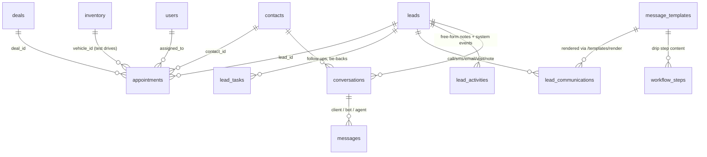
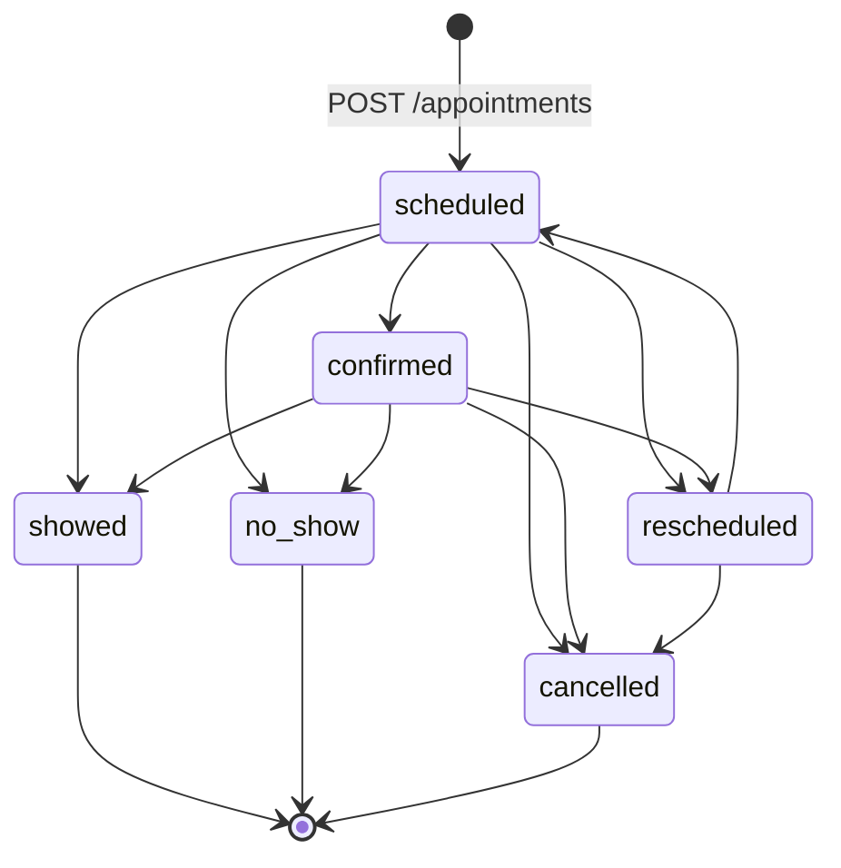
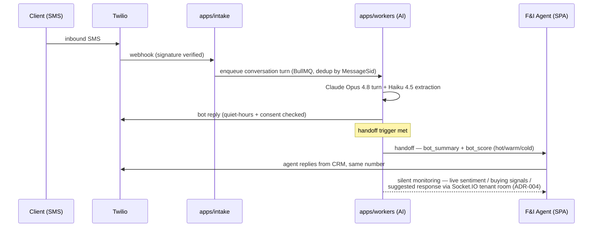

# Business Logic — Appointments, Lead Tasks & Communications

This document specifies the three activity subsystems that surround a lead/contact: **appointments** (booking, conflict detection, status machine, no-show/showed automations), **tasks** (the lead-task follow-up system and the general task system), and the **communications layer** (the call/SMS/email/visit log, the AI/SMS `conversations` + `messages` threads, and message templates with merge-field rendering). Behavior is documented **as implemented** (`server/routes/appointments.js`, `leadTasks.js`, `tasks` via `bulk.js`, `leadCommunications.js`, `leadActivities.js`, `conversations.js`, `templates.js`, `supabase/migrations/2026*`), with future behavior marked **Target** and referenced to the ADRs in `docs/new/00-overview/ARCHITECTURE-DECISIONS.md`.

---

## Table of Contents

1. [Overview & Entity Map](#1-overview--entity-map)
2. [Appointments](#2-appointments)
3. [Tasks](#3-tasks)
4. [Communications Log](#4-communications-log)
5. [Conversations & Messages (AI/SMS Layer)](#5-conversations--messages-aisms-layer)
6. [Message Templates](#6-message-templates)
7. [Compliance in the Send Layer](#7-compliance-in-the-send-layer)
8. [API Surface](#8-api-surface)
9. [Known Defects & Migration Notes](#9-known-defects--migration-notes)

---

## 1. Overview & Entity Map

Design rule (Target, ADR-009): each subsystem has exactly one status vocabulary defined in `packages/schemas`; the drifts documented below are resolved at migration.

---

## 2. Appointments

### 2.1 Types & durations

| Type | Default duration | Notes |
|---|---|---|
| `phone_call` | 15 min | |
| `follow_up` | 30 min | |
| `showroom_visit` | 45 min | |
| `test_drive` | 45 min | Only type subject to **vehicle** conflict detection |

Duration options in the booking UI: 15 / 30 / 45 / 60 / 90 min. Quick-book defaults (LeadDetail Calendar tab): title `"{leadName} — Test Drive"`, type `test_drive`, start = next full hour + 1 h, 1-hour duration, location `"Kia Mont-Laurier Showroom"` (hardcoded tenant string — white-label blocker, ADR-018; Target: store name from tenant config). Dealer working hours displayed 07:00–21:00.

### 2.2 Status machine — three-way drift (must unify)

| Layer | Vocabulary |
|---|---|
| **DB CHECK** (`20260412_appointments.sql`) | `scheduled`, `confirmed`, `completed`, `cancelled`, `no_show` |
| **Server** `VALID_STATUSES` (`appointments.js`) | `scheduled`, `confirmed`, `showed`, `no_show`, `rescheduled`, `cancelled` |
| **Client** (AppointmentsPage) | `scheduled`, `confirmed`, `showed`, `rescheduled`, `cancelled`, `no_show`; LeadDetail calendar also uses `completed` |

**Defect (current):** the server accepts `showed`/`rescheduled` which the DB CHECK rejects — those writes fail at the constraint, meaning the showed/no-show automation (§2.4) can only persist for `no_show`. **Target canonical enum:** `scheduled`, `confirmed`, `showed`, `no_show`, `rescheduled`, `cancelled` (drop `completed`; `showed` is the completion state), with client-enforced transitions promoted to server rules:

(`VALID_TRANSITIONS` as implemented client-side: `scheduled → [confirmed, rescheduled, cancelled, no_show, showed]`; `confirmed → [showed, no_show, rescheduled, cancelled]`; `rescheduled → [scheduled, cancelled]`; `showed`/`no_show`/`cancelled` terminal.)

### 2.3 Conflict detection (server-side, current)

Two independent checks, both using the standard overlap test `start_time < newEnd AND end_time > newStart`:

| Check | Scope | Conflicting statuses considered |
|---|---|---|
| **Salesperson** | Same `assigned_to` (skipped if unassigned) | `scheduled`, `confirmed` |
| **Vehicle** | Same `vehicle_id`, `type='test_drive'` only | NOT IN (`cancelled`, `no_show`, `rescheduled`) |

- `POST /api/appointments` — required: `title`, valid `type`, `start_time`, `end_time` with `end_time > start_time` (DB also enforces `CHECK (end_time > start_time)`). Unless `force: true`, both checks run in parallel; any hit → **409** `{ error: 'Scheduling conflict', salesperson_conflicts: [...], vehicle_conflicts: [...] }` (each conflict `{id, title, start_time, end_time}`). The client displays conflicts and may resubmit with `force`.
- `PATCH /api/appointments/:id` — on time/assignee/vehicle change, merges with existing row values, re-validates ordering, re-runs both checks excluding self → 409. **`force` is not honored on PATCH** (defect: conflicting reschedules cannot be overridden — Target: honor `force` consistently).
- Status forced to `'scheduled'` on create; `created_by` from body (Target: from session).

### 2.4 No-show / showed automations (auto-task side effects)

On PATCH status transition to `no_show` or `showed` (best-effort; failures logged, never block):

1. **Resolve a lead** for the appointment: use `appointment.lead_id`; else if `contact_id`, find an existing non-deleted lead by exact phone, then by email `ilike`; else **auto-promote the contact to a lead**: `{first_name, last_name, phone, email, source: 'appointment_promotion', status: 'contacted', assigned_to: appointment.assigned_to}`. The resolved lead is linked back onto the appointment.
2. **`no_show`** → create a be-back task in `lead_tasks`: title `` `Be-Back: ${appointment.title} (no-show)` ``, `due_at = now + 1 hour`, `assigned_to` = appointment assignee, `source='appointment_no_show'`, `appointment_id` (columns attempted, retried without if absent — schema-drift tolerance). Deduped per lead by title `ilike '%Be-Back:%{title}%'`.
3. **`showed`** with no `deal_id` on the appointment → follow-up task: title `` `Follow up after visit ({title})` ``, `due_at = now + 24 h`, `source='appointment_showed_no_deal'`; deduped by `'%Follow up after visit%{title}%'`.

("Did a deal result?" is inferred solely from `appointment.deal_id` — deals carry no `lead_id` today.)

Target: these automations become BullMQ jobs emitted from the appointment state machine; the auto-promotion source `appointment_promotion` joins the canonical source enum (see `leads.md` §2.1); reminders (`reminder_sent` flag exists, sender unbuilt) are sent via the compliant send layer (§7) at T-24h and T-2h, channel per `preferred_contact`.

### 2.5 Data model & joins

`appointments`: `id`, `lead_id FK leads CASCADE`, `contact_id`, `deal_id`, `vehicle_id FK inventory`, `store_id`, `assigned_to FK users SET NULL`, `type`, `title NOT NULL`, `description`, `location`, `start_time`/`end_time TIMESTAMPTZ NOT NULL`, `status`, `reminder_sent BOOL DEFAULT false`, `created_by`, timestamps. Indexes: `lead_id`, `(assigned_to, start_time)`, `start_time`, `status`.

Migration note: the original migration is lead-only with **no RLS and no store_id**; the route already accepts `contact_id`/`deal_id`/`vehicle_id`/`store_id` — Target schema carries all five FKs, `tenant_id`, and FORCED RLS (ADR-007).

List endpoint `GET /api/appointments` filters: `start` (gte `start_time`), `end` (lte `start_time` — window on start), `lead_id`, `contact_id`, `deal_id`, `vehicle_id`, `assigned_to`, `status`, `type`; left-joins lead, contact, assignee name, and inventory (`stock_number, year, make, model`); ordered `start_time` asc. Calendar UI: react-big-calendar with drag-to-move/resize (PATCH start/end), URL-driven filters, cancelled/no-show rendered muted.

---

## 3. Tasks

Two parallel task systems exist today (defect #11 of the server audit). Both are documented; Target unifies them.

### 3.1 `lead_tasks` (lead follow-up system — the CRM workhorse)

| Field | Rule |
|---|---|
| `lead_id` | required (nested route) |
| `title` | required (400 without) |
| `due_at TIMESTAMPTZ` | nullable |
| `assigned_to FK users` | nullable |
| `priority` | `high` \| `medium` (default) \| `low` |
| `task_type` | `follow_up` (default) \| `test_drive` \| `appointment` \| `other` |
| `completed BOOL` + `completed_at` | PATCH `completed:true` auto-sets `completed_at`; `completed:false` clears it |
| `notes`, `store_id`, `created_by` | optional |
| `source`, `appointment_id` | written by appointment automations (§2.4) |

Behavior:

- `GET /api/leads/:id/tasks` orders incomplete first, then by `due_at` asc (nulls last).
- **Completion logs an activity**: PATCH to completed inserts a `lead_activities` row `{type: 'task_completed', note: 'Completed: {title}'}`.
- **Overdue** = `!completed && due_at < now` (red, "OVERDUE:" prefix). **Due today** = same calendar date (amber).
- Follow-up cadence rules (no-follow-up warning, QuickFollowUp defaults of due tomorrow 09:00, FollowUpAlertBar buckets Overdue / Due Today / Due This Week) are specified in `leads.md` §10.1.

### 3.2 `tasks` (general polymorphic system, F-010)

`tasks`: `title NOT NULL`, `description`, `assignee_id FK users`, `due_date`, `priority` CHECK (`low`,`medium`,`high`,`urgent`), `type` CHECK (`call`,`email`,`meeting`,`follow_up`,`delivery`,`other`), `status` CHECK (`pending`,`in_progress`,`completed`,`cancelled`), polymorphic `entity_type`/`entity_id` (`deal`, `contact`, null), `recurring_interval` CHECK (`daily`,`weekly`,`biweekly`,`monthly`, NULL), `store_id`, `created_by`, `completed_at`, `deleted_at`.

Bulk operations (`/api/bulk`, cap 50 ids, soft-delete-aware):

- `POST /api/bulk/tasks/complete {task_ids}` → `status='completed'`, `completed_at=now`, **only** for tasks currently `pending`/`in_progress` (others silently skipped; response count reflects actual).
- `POST /api/bulk/tasks/reassign {task_ids, assignee_id}`.

### 3.3 Target unification

One `tasks` table: polymorphic subject (`lead` | `deal` | `contact` | `inventory`), single status enum (`pending`, `in_progress`, `completed`, `cancelled`), single priority enum (`low`,`medium`,`high`,`urgent`), `task_type` superset (`follow_up`,`call`,`email`,`meeting`,`test_drive`,`appointment`,`delivery`,`other`), `source` (`manual`, `appointment_no_show`, `appointment_showed_no_deal`, `workflow_step`, `ai_suggested`), `tenant_id`/`store_id`, FORCED RLS. The 15-minute task-overdue sweep becomes a BullMQ repeatable job (ADR-012) feeding notifications (task overdue → sales manager, escalate to GM after 10 min unacknowledged — seeded automation rule).

---

## 4. Communications Log

### 4.1 `lead_communications` (human-touch log)

| Field | Rule |
|---|---|
| `lead_id` | required (nested route) |
| `type` | **`call` \| `sms` \| `email` \| `visit` \| `note`** — enum-validated (400 otherwise) |
| `direction` | `inbound` \| `outbound` (optional but enum-validated; UI forces `visit` = inbound) |
| `subject` | email only |
| `body` | message text (nullable — quick-log writes null body) |
| `duration_seconds INT` | calls; accepted only if `Number.isFinite`, else null |
| `metadata JSONB` | must be an object, else `{}` |
| `created_by FK users` | optional |

Behavior (current):

- `GET /api/leads/:id/communications` — up to 500, newest first; `type` accepts a CSV list.
- **Quick-log auto-logging:** every click on `tel:` / `sms:` / WhatsApp (`https://wa.me/{digits}`) / `mailto:` quick actions POSTs an outbound communication of the matching type (WhatsApp logged as `sms`) — the log is the source for speed-to-lead "contact logged" checks (see `leads.md` §5).
- Template-assisted logging: for `sms`/`email` the composer offers `GET /api/templates?type=` and fills body/subject via `POST /api/templates/render` (§6).
- Manual "Log First Contact" writes the first-contact timestamps and bumps `contact_attempts` (exact writes in `leads.md` §5.1).
- PATCH is scoped by both `commId` and `lead_id` (404 otherwise) and re-validates enums; DELETE is a hard delete scoped by lead.
- **ActivityHeatmap** (Insights tab): 7×24 weekday/hour grid of communications, filters all/call/sms/email/inbound/outbound, "Best Contact Times" = top-3 busiest slots.

Migration note: the table has **no RLS, no store_id, no contact_id** — Target adds `tenant_id`/`store_id`/`contact_id`, FORCED RLS, and links outbound rows to their delivery job (`message_id`) so the log reflects actual provider delivery status rather than optimistic client writes.

### 4.2 `lead_activities` (free-form activity notes)

`lead_activities`: `lead_id`, `type` (free-form — observed: `note`, `task_completed`), `note`, `created_by`, `created_at`. `GET` returns last 100 newest-first; `POST` requires `type`. The Notes tab filters `type==='note'`. Target: system-generated entries move to `activity_events` (ADR-009); `lead_activities` remains only for human notes, or is folded into `lead_communications` `type='note'` (preferred — one timeline source).

---

## 5. Conversations & Messages (AI/SMS Layer)

The scaffold for the ReadyLoans AI lead-automation layer. Data model is live; the AI responder is **not** in this codebase (planned — ADR-022).

### 5.1 Data model (current)

`conversations`: `id`, `lead_id FK SET NULL`, `contact_id FK SET NULL`, `store_id`, `channel NOT NULL DEFAULT 'sms'` CHECK (`sms`,`web`,`whatsapp`), `phone_number`, `twilio_sid`, `status DEFAULT 'bot_active'` CHECK (**`bot_active` → `handed_off` → `agent_active` → `closed`**), `language DEFAULT 'en'` (drift: `'fr'` default elsewhere — Target: tenant-default `fr-CA`, ADR-019), `assigned_agent_id FK users`, `handed_off_at`, `closed_at`, `bot_summary TEXT` (AI summary at handoff), `bot_score INTEGER` (AI lead score at handoff). Realtime-enabled.

`messages`: `conversation_id FK CASCADE`, `sender_type NOT NULL` CHECK (**`client`,`bot`,`agent`**), `sender_id FK users` (agents only), `body NOT NULL`, `media_url` (MMS), `twilio_sid`, `metadata JSONB` (intent/sentiment), `created_at`. Append-only (RLS SELECT/INSERT). Realtime-enabled.

### 5.2 Current behavior

- `POST /api/conversations/:id/messages` requires `sender_type` + `body`; bumps the conversation's `updated_at` (drives inbox ordering).
- **Handoff:** `PUT /api/conversations/:id/handoff` sets `status='handed_off'`, `assigned_agent_id`, `handed_off_at=now`, and stores `bot_summary` + `bot_score`.
- **Close:** `PUT /api/conversations/:id/close`.
- **Twilio inbound** `POST /api/conversations/webhook/twilio` (no signature validation — defect): requires `From` + `Body`; finds the most recent non-closed conversation for that phone or creates one (`{phone_number, channel:'sms'}`, no lead/contact linkage — gap); inserts a `client` message with `twilio_sid = MessageSid`; always answers empty TwiML `<Response></Response>` (bot reply is async — responder unbuilt). Errors also return empty TwiML, never 500 to Twilio.

### 5.3 Target conversation engine (ADR-022, ADR-020, ADR-004)

Business rules carried from the spec (authoritative §10 chatbot spec):

| Rule | Value |
|---|---|
| First-touch | AI SMS engagement < 60 s from intake ACK (SLO, ADR-025) |
| Language | Auto-detect; **Quebec leads** (area codes 438/514/450/819/873) get the explicit EN/FR preference question; language locks once set and feeds agent matching |
| Required before handoff | full name, vehicle interest, monthly budget, trade-in y/n (+details); timeline/email nice-to-have; Fluent leads are never re-asked form data |
| Handoff triggers (any) | client asks for a human · all required fields collected · high buying intent (NLP) · low bot confidence on 2+ consecutive messages |
| Conversation style | ≤160 chars/SMS, one question per message, max 1–2 emojis, never robotic; **never quote pricing/rates/approval odds** |
| Inventory sharing | max 3 vehicles, first photo each via MMS, description only — no pricing, no links |
| Post-handoff | bot goes silent, keeps analyzing both sides; live panel: sentiment, buying signals, concerns, suggested response, hot/warm/cold score with reason (Socket.IO tenant rooms, ADR-004) |
| After-hours | engage + collect, set expectation ("first thing tomorrow morning" / "Monday morning" / next business day per `stores.business_hours` + holidays) |
| Drip replies | client reply on a `drip_active` thread reactivates the lead into assignment; **STOP** → immediate opt-out |
| Limits | max 15 bot messages before forced handoff (per-tenant configurable) |
| Disclosure | AI self-identifies in the first turn, FR+EN (Law 25) |

Status vocabulary reconciliation: legacy route code uses unset/`handed_off`/`closed`; the DB CHECK (`bot_active`,`handed_off`,`agent_active`,`closed`) is the target base, extended with `drip_active` per the drip spec — final enum in `packages/schemas`: `bot_active`, `handed_off`, `agent_active`, `drip_active`, `closed`.

Voice (Phase 2): Twilio ConversationRelay streams to the same Claude brain; call transcripts stored as `messages` with `channel='voice_transcript'`; voicemail → brief message + follow-up SMS; ADAD express-consent gate before any automated outbound call (§7).

---

## 6. Message Templates

### 6.1 Model (`message_templates`)

| Field | Rule |
|---|---|
| `name` | required |
| `type` | **`email` \| `sms`** (enum-validated) |
| `subject` | email only; merge fields allowed |
| `body` | required; `{{merge_field}}` placeholders |
| `category` | `general` (default) \| `outreach` \| `follow_up` \| `appointment` \| `nurture` |
| `is_default` | starred; list orders `is_default DESC, name ASC` |
| `created_by` | optional |

Seeded templates (5): Initial Outreach (email, default), Follow-Up No Response (email), Quick Intro SMS (default), Appointment Reminder SMS, Test Drive Invite (email). **All carry hardcoded Kia Mont-Laurier copy and the table has no `store_id`/RLS — release-blocking white-label gap (ADR-018): Target templates are tenant-scoped, branded server-side, and exist in FR+EN with the CI parity gate (ADR-019).**

### 6.2 Merge fields & rendering (exact, `templates.js`)

Supported merge fields (server-resolved): `{{first_name}}`, `{{last_name}}`, `{{email}}`, `{{phone}}`, `{{vehicle_interest}}`, `{{monthly_budget}}`, `{{current_vehicle}}`, `{{job_title}}`, `{{address}}`, `{{preferred_language}}`, `{{salesperson_name}}` (resolved from `users` via `lead.assigned_to`). The client picker additionally advertises `{{salesperson_name}}` and inserts chips into the body.

`POST /api/templates/render {template_id, lead_id}` → loads template + lead (+ assigned salesperson), replaces `\{\{(\w+)\}\}` with resolved values (missing values → empty string; unknown keys left as-is), returns `{template_id, lead_id, type, subject, body}`. `GET /api/templates/merge-fields` returns the supported list.

### 6.3 Usage points

| Consumer | How |
|---|---|
| LeadDetail Activity composer | Pick template (filtered by `type`) → `/templates/render` → prefills SMS/email log body/subject |
| Workflow/drip steps | `workflow_steps.template_id` (or `custom_subject`/`custom_body`) — content for `email`/`sms` actions |
| Target: AI drip engine | Steps render server-side with i18next (FR-first) + tenant branding; `{{store_name}}`, `{{store_phone}}`, `{{vehicle}}`, `{{salesperson}}` added to the merge vocabulary per the drip spec |

---

## 7. Compliance in the Send Layer

No feature sends directly. Every outbound email/SMS/voice action — quick-log sends, drip steps, appointment reminders, AI turns — flows through one send pipeline (BullMQ, ADR-012/020/022) that enforces, in order:

1. **Consent ledger check** (express/implied basis valid + unexpired — 6-month inquiry / 24-month business relationship; see `contacts.md` §7).
2. **STOP state** — global per-person channel opt-out, applied immediately on any inbound STOP keyword.
3. **CRTC quiet hours** — 9:00–21:30 weekdays, 10:00–18:00 weekends, computed in the **recipient's** timezone; out-of-window messages queue to the next window.
4. **DNCL scrub** (≤ 31-day freshness) + per-tenant internal DNC for voice/SMS solicitation.
5. **ADAD gate** — automated outbound voice calls require recorded **express** consent.
6. **Language** — content rendered in the recipient's `preferred_language` (fr default), FR+EN AI disclosure on first contact.
7. Delivery result written back (`messages.delivered`/provider SID; communication log status) — retries with exponential backoff, DLQ on exhaustion.

Staff-facing notification SMS (HIGH-urgency alerts) bypasses consent/quiet-hours logic (business-operations messages to employees) but respects per-user `sms_enabled` opt-out.

---

## 8. API Surface

Current Express endpoints (all re-created behind Better Auth + tenant scoping under `/api/v1`, ADR-003/006/007):

| Area | Endpoints |
|---|---|
| Appointments | `GET /api/appointments` (filters §2.5) · `POST /api/appointments` (409 + `force`) · `PATCH /api/appointments/:id` (reschedule re-checks conflicts; status automations §2.4) · `DELETE /api/appointments/:id` (hard delete — Target: soft) · `GET /api/leads/:id/appointments` (read-only, limit 200) |
| Lead tasks | `GET /api/leads/:id/tasks` · `POST /api/leads/:id/tasks` (title required) · `PATCH /api/leads/:id/tasks/:taskId` (completion side effects) |
| General tasks (bulk) | `POST /api/bulk/tasks/complete` · `POST /api/bulk/tasks/reassign` (≤ 50 ids) |
| Communications | `GET /api/leads/:id/communications` (≤ 500, `type` CSV) · `POST` (enum-validated) · `PATCH /:commId` · `DELETE /:commId` |
| Activities | `GET /api/leads/:id/activities` (last 100) · `POST` (`type` required) |
| Conversations | `GET /api/conversations` (filters: status, assigned_agent_id, store_id) · `GET /api/conversations/:id` (+ messages asc) · `POST /api/conversations` · `POST /api/conversations/:id/messages` · `PUT /api/conversations/:id/handoff` · `PUT /api/conversations/:id/close` · `POST /api/conversations/webhook/twilio` |
| Templates | `GET /api/templates?type&category` · `GET /api/templates/merge-fields` · `POST /api/templates/render` · `POST /api/templates` · `PATCH/DELETE /api/templates/:id` |
| Target additions | `POST /api/v1/chatbot/engage/:leadId` · `POST /api/v1/chatbot/handoff/:leadId` · `GET /api/v1/chatbot/analysis/:conversationId` · drip enrollment endpoints (see `leads.md` §10.3) · voice `POST /api/v1/voice/call/:leadId` (ADAD-gated) |

---

## 9. Known Defects & Migration Notes

| # | Defect (current) | Fix (Target) |
|---|---|---|
| 1 | Appointment status three-way drift; DB CHECK rejects server's `showed`/`rescheduled` — showed-automation can't persist | Single enum (`scheduled`,`confirmed`,`showed`,`no_show`,`rescheduled`,`cancelled`) in `packages/schemas`; DB CHECK generated from it (ADR-009/016) |
| 2 | `force` ignored on PATCH reschedule | Honor `force` on create and update |
| 3 | Appointments/communications lead-only (no `contact_id`/`deal_id` in original schema), no RLS, no store_id | Full FK set + `tenant_id`/`store_id` + FORCED RLS (ADR-007) |
| 4 | Appointment DELETE is hard; communications DELETE hard | Soft delete everywhere (ADR-009) |
| 5 | `reminder_sent` flag with no sender | Reminder jobs (T-24h / T-2h) through the compliant send layer (§7) |
| 6 | Two task systems (`tasks` vs `lead_tasks`) with different field names (`assignee_id` vs `assigned_to`) and enums | Unified polymorphic `tasks` table (§3.3) |
| 7 | Quick-log writes communications optimistically from the client; no provider delivery status | Outbound sends via BullMQ with delivery write-back |
| 8 | Twilio webhook: no signature validation; unlinked conversations (no lead/contact) | Signature verification at `apps/intake` (ADR-005); phone→lead/contact resolution + STOP/drip routing on every inbound |
| 9 | AI responder absent; `bot_summary`/`bot_score` only writable via manual handoff endpoint | `packages/ai` conversation engine (Opus 4.8 + Haiku 4.5 extraction), tool runner, prompt caching (ADR-022) |
| 10 | Templates global, Kia-branded, EN-only, no RLS | Tenant-scoped, FR+EN pairs (CI parity gate), server-side branding (ADR-018/019) |
| 11 | Conversation `language` default `'en'` vs platform `'fr'` | Tenant-default locale (`fr-CA` for Quebec tenants, ADR-019) |
| 12 | No quiet hours / consent checks anywhere in send paths | Platform compliance engine in the send layer (§7, ADR-020/022) |
| 13 | Merge-field regex leaves unknown keys visible to clients | Render server-side with strict merge-field validation at template save time |
