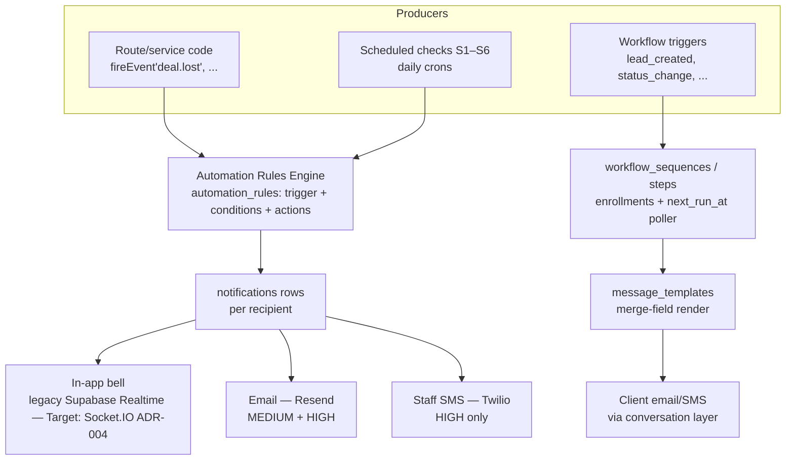

# Automation & Notifications — Engine, Channels, Rules, Workflows, Templates

This document specifies the staff notification system (urgency tiers, channels, the full alert catalog, delivery rules, SMS strategy) and the automation layer that drives it: the event-driven rules engine (`fireEvent` → rules → recipients → channels), the scheduled checks, workflow sequences (multi-step drip/nurture automations), and message templates with merge fields. Rules are documented as implemented in the Kia Mont-Laurier tracker (source code + `discussions/notifications-automation-spec.md`); ReadyLoans changes are marked **Target** with ADR references (`00-overview/ARCHITECTURE-DECISIONS.md`).

## Table of Contents

1. [Subsystem Map & Implementation Status](#1-subsystem-map--implementation-status)
2. [Notification Urgency Tiers & Channels](#2-notification-urgency-tiers--channels)
3. [The Alert Catalog (20 Pre-Seeded Alerts)](#3-the-alert-catalog-20-pre-seeded-alerts)
4. [Configurable Thresholds](#4-configurable-thresholds)
5. [Notification Delivery Rules (UX)](#5-notification-delivery-rules-ux)
6. [SMS Strategy](#6-sms-strategy)
7. [Deal-Closing Report Email (as built)](#7-deal-closing-report-email-as-built)
8. [The Automation Rules Engine](#8-the-automation-rules-engine)
9. [Scheduled Checks (S1–S6)](#9-scheduled-checks-s1s6)
10. [Workflow Sequences](#10-workflow-sequences)
11. [Drip Sequences (Client-Facing)](#11-drip-sequences-client-facing)
12. [Message Templates & Merge Fields](#12-message-templates--merge-fields)
13. [Data Model](#13-data-model)
14. [API Surface](#14-api-surface)
15. [Permissions](#15-permissions)
16. [Target-State Deltas (ReadyLoans)](#16-target-state-deltas-readyloans)

---

## 1. Subsystem Map & Implementation Status



Three distinct consumers — do not conflate them:

1. **Staff notifications** — in-app/email/SMS alerts to employees. Never sent to clients.
2. **Automation rules** — event → notification/action mapping, GM/Owner-configurable.
3. **Client-facing sequences** — workflow sequences and chatbot drips; ALL client messaging goes through the conversation layer (store Twilio number), never the staff engine.

Implementation status: the DB schema and CRUD routes for all of this exist (`notifications`, `automation_rules`, `workflow_sequences/steps/enrollments`, `message_templates`), but **no execution engine runs today** — there is no scheduler firing S1–S6, no poller consuming `workflow_enrollments.next_run_at`, and no escalation worker for `automation_rules.escalation_minutes`. The only email automations actually sending in production are the two transactional deal emails via Resend — the **deal-closing report** (§7) and the **driver-dispatch email** (`dispatch-transport.md` §10). The specified behavior below is the canonical business logic; **Target** execution is BullMQ repeatable jobs and workers (ADR-012).

---

## 2. Notification Urgency Tiers & Channels

| Urgency | Channels | Notes |
|---|---|---|
| `low` | In-app bell only | Never toasts, never emails |
| `medium` | In-app + email (Resend) | One email per alert — no batching/digest (operational alerts) |
| `high` | In-app + email + SMS (Twilio) | SMS delivered within seconds; staff only |

Per-user preference: `users.notification_preferences JSONB`, default:

```json
{ "low": ["in_app"], "medium": ["in_app", "email"], "high": ["in_app", "email", "sms"] }
```

`users.sms_enabled BOOLEAN DEFAULT true` — a user opting out of SMS still receives in-app + email for HIGH alerts. The engine respects both the tier mapping and the user's preferences on every send.

---

## 3. The Alert Catalog (20 Pre-Seeded Alerts)

### HIGH (in-app + email + SMS)

| # | Alert | Trigger event | Recipients |
|---|---|---|---|
| H1 | Chatbot handoff failed | `chatbot.handoff_failed` (no available F&I agent) | Sales Manager, GM |
| H2 | Deal fell through | `deal.lost` (any stage) | Deal's salesperson, Sales Manager |
| H3 | Delivery failed | `delivery.failed` (any reason) | Salesperson, Sales Manager, Logistics |
| H4 | Payment mismatch | `payment.mismatch` (counted cash ≠ expected) | Admin, GM |
| H5 | Client requesting callback | `client.callback_requested` (via chatbot/form) | Assigned salesperson, BDC |

### MEDIUM (in-app + email)

| # | Alert | Trigger event | Recipients |
|---|---|---|---|
| M1 | Safety inspection overdue | `safety.overdue` (WO sent 3+ days, no result) | Used Car Manager |
| M2 | Funding overdue | `funding.overdue` (submitted 7+ days, no update) | F&I agent on deal, GM |
| M3 | Vehicle aging | `inventory.aging_threshold` (30 days in stock) | Used Car Mgr, Wholesale Mgr, GM |
| M4 | Deal approved by lender | `lender.approved` | F&I agent, Salesperson |
| M5 | Checklist override used | `checklist.overridden` | GM |
| M6 | Unmatched delivery photos | `delivery.photos_received` (unmatched) | Admin, Logistics |
| M7 | Trade-in condition mismatch | `trade_in.condition_mismatch` | Salesperson, Sales Manager |
| M8 | Deal funded | `deal.funded` | F&I agent, Salesperson |
| M9 | New lead assigned | `lead.assigned` | Assigned salesperson |
| M10 | Delivery completed | `delivery.completed` | Salesperson, Admin |

### LOW (in-app only)

| # | Alert | Trigger event | Recipients |
|---|---|---|---|
| L1 | Deal stage changed | `deal.stage_changed` | Salesperson |
| L2 | Work order completed | `work_order.completed` | Used Car Mgr, Logistics |
| L3 | Document signed | `document.signed` (DocuSign/OneSpan) | F&I agent |
| L4 | Delivery photos received (matched) | `delivery.photos_received` | Salesperson |
| L5 | Payment confirmed | `payment.received` | Salesperson |

---

## 4. Configurable Thresholds

Per store, editable by GM/Owner. Two generations of defaults exist and MUST be reconciled to the spec values during the `packages/core` port:

| Threshold | Spec default (canonical) | As-built DB default (`stores` columns) |
|---|---|---|
| Lead response time | Handled by chatbot — **no human timer** | — |
| Vehicle aging alert | **30 days** in stock | `aging_threshold_days = 60` |
| Safety inspection overdue | **3 days** since sent to garage | `safety_overdue_days = 14` |
| Funding overdue | **7 days** since submitted to bank | `funding_overdue_days = 7` |
| Deal rotting (stage aging) | **7 days** in same stage | — |
| Vehicle no photos | **48 hours** after arriving on lot | — |
| Recon cost threshold | **$2,000** (alert GM if exceeded; also gates GM recon approval) | — |

Specified storage: `stores.alert_thresholds JSONB` default `{vehicle_aging_days:30, safety_overdue_days:3, funding_overdue_days:7, deal_rotting_days:7, no_photos_hours:48, recon_cost_threshold:2000}`. **Target:** thresholds live on the tenant/store record in `packages/schemas`-typed config; `recon_cost_threshold` stored in cents (200000) per ADR-009.

---

## 5. Notification Delivery Rules (UX)

- **In-app bell:** unread count badge (red, pulses), dropdown of the **20 most recent**, urgency color stripe (red HIGH / amber MEDIUM / none LOW), click deep-links to the record (`link`, e.g. `/deal/abc123`), "Mark all read". Real-time via **Supabase Realtime subscription** on the `notifications` table (legacy; Target: Socket.IO tenant-namespaced rooms, events emitted on notification insert, ADR-004).
- **Email:** Resend; MEDIUM + HIGH only; **one email per alert** — never batched or digested (these are operational alerts, not newsletters).
- **Toasts:** bottom-right, auto-dismiss 5 s, MEDIUM + HIGH only while the user is online; LOW never toasts (accumulates in the bell only).
- As-built read model: `acknowledged`/`acknowledged_at` via `PUT /api/notifications/:id/acknowledge` and `/acknowledge-all`; the spec's model uses `read`/`read_at` + `channels_sent` — reconcile to one vocabulary (`read_at`) in `packages/schemas`.

---

## 6. SMS Strategy

**Staff SMS (notification engine):**

- HIGH urgency only; destination number from the user profile (`users.phone`); opt-out via `sms_enabled` (in-app + email still fire).
- Message format (**max 160 chars**, single segment):

```
[KIA TRACKER] {alert title} — {deal/client name}. View: {link}
```

- **Target (ADR-018):** the hardcoded `[KIA TRACKER]` prefix is a white-label release blocker — the prefix comes from the tenant branding record (e.g. `[READYCAR]`), and links point at the tenant's custom domain.

**Client SMS:**

- Clients are **NEVER contacted by the notification engine.** ALL client messaging — reminders, follow-ups, drips, AI conversations — goes through the conversation layer (Chatbot Engine) using the store's Twilio number, keeping one conversation history per client.

**Twilio topology:**

- One Twilio number per store for client-facing traffic (`stores.twilio_number`); inbound client SMS routes to the conversation engine. Staff alerts use a separate number/messaging service on the same account. Env: `TWILIO_ACCOUNT_SID`, `TWILIO_AUTH_TOKEN`, `TWILIO_PHONE_NUMBER` (or per-store from `stores`).

**Compliance (Target, ADR-020/022 — enforced in the send layer, not per feature):**

- Global immediate **STOP** handling (CASL — legally required), per-lead consent ledger (express/implied basis, 6-month implied-inquiry / 24-month transaction expiry), **CRTC quiet hours** 9:00–21:30 weekdays / 10:00–18:00 weekends recipient-local, DNCL scrub ≤31 days for outbound solicitation, CASL sender-ID footer, ADAD express-consent gate before any automated outbound voice call.

---

## 7. Deal-Closing Report Email (as built)

One of the only two email automations running in production today (the other is the driver-dispatch email — `dispatch-transport.md` §10). Both live in `server/services/email.js` and share the legacy route pair mounted at `/api/email` (`server/routes/email.js`), sending via Resend.

**Trigger (manual, UI-prompted):** `POST /api/email/deal-closing/:dealId`. `DealDetail.jsx` prompts with a `window.confirm` whenever `deal_status` transitions to `complete` (via edit-save or the status action button) and fires the POST on confirm; a manual re-send button shows sending/sent/failed state. There is **no event-driven trigger** — nothing sends this automatically on a pipeline-stage change.

**Recipient resolution:** the comma-separated `DEAL_CLOSING_EMAIL` env var (`.split(',').map(trim)`), sent from `EMAIL_FROM`. **Target:** a per-store configurable recipient list in store settings — never env vars (same rule as `DRIVER_DISPATCH_EMAIL`).

**Subject:** `Deal Closed — {customer_name} — {year} {make} {model} (Stock #{stock_number})` (missing values render `Unknown` / `N/A`).

**Rendered payload** (`sendDealClosingEmail(deal)` — the route loads the full `deals` row first, 404 when missing):

| Section | Fields rendered |
|---|---|
| Vehicle Information | `stock_number`, `vin`, `year make model color`, `vehicle_source`, `listed_online` |
| Deal Information | `customer_name`, `cosigner_name` (only when `has_cosigner`), `salesperson_name`, `financing_bank`, `finance_status`, `money_down_amount` + `money_down_collected`, `cash_back_amount` + `cash_back_sent`, `accessories`, `native_status` (Section 87 tax exemption) |
| Delivery / Compliance | `licensing_province` (uppercased) + `licensing_completed`, `photos_taken`, `wet_ink_signed`, `idv_completed` |
| Trade-In Details (when `has_trade_in`) | `trade_year/make/model/color`, `trade_plate`, `trade_vin`, `trade_stock_number`, `has_lien`; when `has_lien`: `lien_bank`, `lien_amount` |

**Failure behavior:** with `RESEND_API_KEY` unset, the service returns `{ success: false, error: 'Resend API key not configured' }` **without throwing**, and the route still answers `200 { message: 'Deal closing email sent', result }` — a silent no-send. A Resend API error is thrown and surfaces as `500`. The send is logged nowhere (no `activity_events`, no `notifications` row, no delivery record).

**Branding defect (ADR-018 release blocker):** the HTML hardcodes "Deal Closing Report — Kia Mont-Laurier" in the heading, "Sent automatically by Kia Mont-Laurier Deal Tracker" in the footer, and fixed colors (`#1e3a5f` heading, `#c4342d` rule). Money renders via a local `formatCurrency` (`$` + `toFixed(2)` on dollar floats), EN-only.

**Target deltas:** tenant-branded FR/EN template via the ADR-018 server-side branding path, rendered with React Email (ADR-020/021); recipients from store settings; event-driven trigger on pipeline stage `delivered`/`complete` (with the manual re-send retained); the send queued through BullMQ with retries and logged to `activity_events` (actor, recipients, provider message id — ADR-012); money fields rendered from integer cents (ADR-009).

---

## 8. The Automation Rules Engine

### 8.1 Architecture

Core service contract: `fireEvent(eventType, eventData, storeId)` —

1. Look up `automation_rules` where `trigger_event = eventType`, `active = true`, and `store_id` matches (or is NULL = all stores).
2. Evaluate `conditions` (JSONB array) against `eventData`.
3. For each action, resolve recipients (§8.4) to concrete user IDs at the deal's store.
4. Create one `notifications` row per recipient, render `{{template}}` variables from `eventData`.
5. Send per urgency tier + user preferences (§2): in-app always, email MEDIUM+, SMS HIGH.

Producers call `fireEvent` at the integration points: `deals.js` (`deal.stage_changed`, `deal.lost`, `deal.funded`), `deliveryChecklists.js` (`checklist.overridden`), `delivery.js` (`delivery.completed`, `delivery.failed`), `payments.js` (`payment.received`, `payment.mismatch`); remaining events wire in as their modules land. **Target:** `fireEvent` publishes to a BullMQ queue; workers do rule matching + channel dispatch (idempotent job IDs, DLQ per queue, ADR-012); the same events are outbound-webhook topics signed HMAC-SHA256 for external integrators (ADR-005).

### 8.2 Event Catalog (22 events)

```
deal.created            deal.stage_changed        deal.lost               deal.funded
lead.created            lead.assigned             chatbot.handoff_failed  client.callback_requested
delivery.completed      delivery.failed           delivery.photos_received
payment.received        payment.mismatch
work_order.completed    inventory.aging_threshold checklist.overridden    trade_in.condition_mismatch
document.signed         lender.approved           lender.declined
funding.overdue         safety.overdue
```

Single enum source: `packages/schemas` (ADR-009/016). Adding an event = adding it there once.

### 8.3 Rule Structure

```json
{
  "name": "Delivery failed — alert team",
  "trigger_event": "delivery.failed",
  "conditions": [],
  "actions": [{
    "type": "create_notification",
    "urgency": "high",
    "recipients": ["deal.salesperson", "role.sales_manager", "role.logistics"],
    "title": "Delivery failed — {{client_name}}",
    "message": "{{failure_reason}}. Deal {{stock_number}} needs reschedule."
  }],
  "active": true,
  "store_id": null
}
```

Template variables available to titles/messages: `{{client_name}}`, `{{failure_reason}}`, `{{stock_number}}`, and any scalar on `eventData`. `store_id = null` means the rule applies to all stores (Target: all tenant stores, never cross-tenant).

### 8.4 Recipient Targets

| Target | Resolution |
|---|---|
| `deal.salesperson` | The salesperson on the triggering deal |
| `deal.fi_agent` | The F&I agent on the triggering deal |
| `role.gm`, `role.sales_manager`, `role.used_car_manager`, `role.wholesale_manager`, `role.logistics`, `role.admin`, `role.bdc` | All users holding that role **at the deal's store** |
| `role.owner` | Cross-store (organization-level) |

### 8.5 The 20 Seeded Rules

The 20 alerts in §3 ship as seeded `automation_rules` rows (1:1 with H1–H5, M1–M10, L1–L5), each editable by GM/Owner: toggle on/off, edit recipients, adjust thresholds, add custom rules — via the Automation Manager settings page.

### 8.6 As-Built `automation_rules` (M-010 — migration reference)

Schema: `store_id`, `name`, `description`, `trigger_event` (`deal_stage_changed`, `task_overdue`, `vehicle_aging`, `safety_overdue`, `funding_overdue`), `trigger_condition JSONB` (e.g. `{days_overdue: 7}`), `action_type` (`notify` | `email` | `create_task`), `action_config JSONB` (`{target_role, urgency, template}`), **`escalation_minutes`** (escalate if unacknowledged after N minutes), **`escalation_target_role`**, `active`, `created_by`. CRUD at `/api/automation-rules` (POST requires `name`, `trigger_event`, `action_type`).

Seeded as-built rules: Safety Overdue (`{days_overdue:14}` → notify `used_car_manager`, high, escalate `gm` after 30 min); Funding Overdue (`{days_overdue:7}` → `fi_manager`, high, escalate `gm` after 60 min); Vehicle Aging (`{days_threshold:60}` → `used_car_manager`, medium); Deal Stage Change (→ salesperson, low); Task Overdue (→ `sales_manager`, medium, escalate `gm` after 10 min).

**Config storage only — no executor exists.** The escalation feature (re-notify a senior role when a notification stays unacknowledged for `escalation_minutes`) is a canonical rule to implement in the Target worker: a repeatable sweep selects `notifications` where `read_at IS NULL AND created_at < now() − escalation_minutes` and fires the escalation notification once (deduped by deterministic job ID).

---

## 9. Scheduled Checks (S1–S6)

Daily jobs that produce threshold events. Legacy plan was node-cron/Supabase scheduled functions — never wired. **Target: BullMQ repeatable jobs, tenant-local time (ADR-012).**

| # | Check | Schedule | Exact logic |
|---|---|---|---|
| S1 | Vehicle aging | Daily 8:00 | `days_in_stock ≥ threshold` → fire `inventory.aging_threshold`; **skip if already fired for this vehicle at this threshold** (dedupe) |
| S2 | Safety overdue | Daily 8:00 | work orders `status='sent'` AND `sent_at < now − safety_overdue_days` → `safety.overdue` |
| S3 | Funding overdue | Daily 8:00 | deals `funding_status='submitted'` AND `submitted_at < now − funding_overdue_days` → `funding.overdue` |
| S4 | Deal rotting | Daily 8:00 | deals `stage_entered_at < now − 7d` AND `pipeline_stage NOT IN ('complete','lost')` → notify deal.salesperson |
| S5 | Vehicle no photos | Daily 8:00 | inventory `location_status='on_lot'` AND `photo_count=0` AND arrived > 48 h → alert Used Car Manager |
| S6 | Post-delivery follow-up | Daily 10:00 | deals delivered yesterday (or last business day if Monday) → thank-you + drip enrollment (see `delivery.md` §9) |

Dedupe rule: S1's "skip if already fired at this threshold" is specified; the other daily sweeps have no specified dedupe and would re-fire every day — **canonical rule for the port: every scheduled event carries a deterministic job/notification ID (`{event}:{entity_id}:{threshold}`) so each entity/threshold pair alerts exactly once** (aligned with ADR-012 idempotency).

Additional scheduled work owned by other modules but running on the same scheduler: wholesale auto-flag at 60 days in stock, 10-minute lead reassignment timer, drip engine hourly tick (§11), scheduled reports (daily 19:00 sales summary, Monday 8:00 weekly performance + inventory aging, monthly 1st P&L). (The once-planned 3-minute lead heartbeat-offline sweep is superseded by Socket.IO presence — connection state + Valkey-backed heartbeats — `leads.md` §5.3, ADR-004.)

---

## 10. Workflow Sequences

Multi-step automations against leads (as built: `workflow_sequences` + `workflow_steps` + `workflow_enrollments`, route `/api/workflows`).

### 10.1 Structure

- **Sequence:** `name`, `description`, `trigger_on` ∈ `lead_status_change` | `lead_created` | `lead_assigned` | `deal_created` | `no_response`, `trigger_config JSONB`, `is_active` (**default false** — sequences ship off).
- **Steps:** ordered (`step_order`, unique per workflow), `delay_minutes` (offset from the previous step), `action_type` ∈ `email` | `sms` | `call_reminder` | `task` | `notification` | `wait`, `template_id` FK → `message_templates` (or `custom_subject`/`custom_body`), `config JSONB`.
- **Enrollment:** `UNIQUE(workflow_id, lead_id)` — one enrollment per lead per workflow; `status` ∈ `active` | `completed` | `cancelled` | `failed`, `current_step`, **`next_run_at`** (scheduler cursor), `last_error`. Partial index on `next_run_at WHERE status='active' AND next_run_at IS NOT NULL` — the poller queue.

### 10.2 Execution Model (canonical)

```
on trigger match → insert enrollment {status:'active', current_step:0, next_run_at:now + step[0].delay_minutes}
poller (every minute):
  for each enrollment where status='active' AND next_run_at <= now():
    execute step[current_step]  (render template → send via conversation layer / create task / notify)
    current_step += 1
    if no more steps → status='completed', completed_at=now()
    else next_run_at = now() + step[current_step].delay_minutes
  on send failure → retry with backoff; after max attempts → status='failed', last_error recorded
```

As-built gaps (do not carry forward): the enroll endpoint (`POST /api/workflows/:id/enroll`) inserts `{status:'active'}` **without setting `next_run_at`**, so nothing would ever pick the enrollment up — and no poller exists at all; `PUT /api/workflows/:id` deletes and re-inserts all steps (in-flight enrollments' `current_step` becomes meaningless); tables have **no RLS and no `store_id`**; enrollment is lead-only even though a `deal_created` trigger exists (no `deal_id` column).

**Target:** the poller is a BullMQ repeatable job + delayed jobs per step (deterministic ID `wf:{enrollment_id}:{step}`); enrollments gain `deal_id`; all workflow tables gain `tenant_id`/`store_id` + forced RLS (ADR-007/012); client-facing steps (`email`/`sms`) route through the consent-checked send layer (ADR-020/022).

---

## 11. Drip Sequences (Client-Facing)

Owned by the conversation layer (chatbot engine) — a parallel, client-facing sequence system (`drip_sequences` + `drip_enrollments`), distinct from §10's staff-side workflows.

### 11.1 Structure & Engine

- `drip_sequences`: `store_id`, `name` (e.g. `post_delivery`, `lost_couldnt_approve`, `lost_ghosted`), `trigger_event` ∈ `delivery.completed` | `deal.lost` | `lead.unresponsive`, `trigger_condition JSONB` (e.g. `{"lost_reason": "ghosted"}`), `steps JSONB` (array of `{day, message_template, channel}`), `duration_days`, `active`.
- `drip_enrollments`: `drip_sequence_id`, `lead_id`, `deal_id` (post-delivery), `conversation_id`, `status` ∈ `active` | `paused` | `completed` | `opted_out` | `expired` | `reactivated`, `current_step`, `enrolled_at`, `expires_at`, `last_message_sent_at`, `opted_out_at`, `reactivated_at`.
- Engine: **hourly tick** — for each active enrollment, if `enrolled_at + step.day` is due → send via Twilio on the **same store number as the original conversation**, log the message in conversation history, advance `current_step`; all steps done → `completed`; past `expires_at` → `expired`.

### 11.2 Sequences

Post-delivery cadence (Day 1/7/30/90/180/ongoing) — see `delivery.md` §9.3. Lost-lead re-engagement by lost reason:

| Lost reason | Strategy | Duration |
|---|---|---|
| Couldn't get approved | Re-engage when new lender programs available | 6 months |
| Payment too high | Notify when a similar cheaper vehicle arrives in inventory | 3 months |
| Ghosted / unresponsive | Check-ins at 7, 14, 30 days, then monthly | 90 days then expire |
| Went to another dealer | "Still happy?" at 30, 90 days | 90 days |
| Changed their mind | Check in at 30, 60 days | 90 days then expire |

Unresponsive-lead nurture: after 3 failed contact attempts (immediate SMS → +4 h SMS → next-day SMS/call) the lead goes `unresponsive` with `nurture_expires_at = now + 90 days`; no engagement by expiry → `expired`.

### 11.3 Compliance & Reactivation Rules

- Reply **STOP** → immediate automatic opt-out (legally required, CASL); no further messages; global across sequences.
- Positive reply during a drip → reactivate the lead, pause the drip, re-enter the assignment flow.
- Client starts a new deal → drip stops automatically.
- All drip messages logged in the lead's conversation history (single thread per client).
- **Target (ADR-022):** every drip send passes the platform compliance engine — consent ledger (implied 6-month / express 24-month expiry), quiet hours, DNCL, tenant-branded FR/EN content.

---

## 12. Message Templates & Merge Fields

As built: `message_templates` table + `/api/templates` routes.

- Fields: `name`, `type` ∈ `email` | `sms` (enforced 400 otherwise), `subject` (email only), `body` with `{{merge_fields}}`, `category` (default `general`; seen: `outreach`, `follow_up`, `appointment`), `is_default`, `created_by`.
- **Supported merge fields (exact list from `GET /api/templates/merge-fields`):** `first_name`, `last_name`, `email`, `phone`, `vehicle_interest`, `monthly_budget`, `current_vehicle`, `job_title`, `address`, `preferred_language`, `salesperson_name`.
- Rendering: `POST /api/templates/render` `{template_id, lead_id}` → resolves values from the lead row (+ assigned user's name for `salesperson_name`; `preferred_language` falls back to `'fr'`), replaces `{{key}}` tokens, leaves unknown tokens untouched, returns `{subject, body, type}`.
- 5 seeded templates: Initial Outreach (email, default), Follow-Up No Response (email), Quick Intro SMS (default), Appointment Reminder SMS, Test Drive Invite (email).
- Drip-engine template variables (chatbot layer, §11): `{{first_name}}`, `{{last_name}}`, `{{vehicle}}`, `{{salesperson}}`, `{{store_name}}`, `{{store_phone}}`.

Gaps (as built): no `store_id`, no RLS, Kia-flavored seed content, EN-only, and two divergent merge-field vocabularies (templates route vs drip engine). **Target:** tenant-scoped templates with forced RLS (ADR-007); one merge-field vocabulary in `packages/schemas`; **every template stored as an FR/EN pair** with the CI key-parity gate (ADR-019); staff/transactional email rendered via React Email with the tenant branding record (ADR-018/020); ICU message format for plurals/gender via i18next-icu.

---

## 13. Data Model

### 13.1 `notifications` (specified — canonical)

`id`, `user_id` FK CASCADE, `store_id`, `urgency` (`low`/`medium`/`high`), `title`, `message`, `link` (deep link, e.g. `/deal/abc123`), `related_deal_id` (SET NULL), `related_entity_type` (`deal`/`lead`/`inventory`/`work_order`), `related_entity_id`, `channels_sent TEXT[]`, `read`/`read_at`, `email_sent`/`email_sent_at`, `sms_sent`/`sms_sent_at`, `created_at`. Indexes: partial `(user_id, read) WHERE read = false`; `(user_id, created_at DESC)`.

### 13.2 `notifications` (as built — migrates into 13.1)

`type` (e.g. `deal_stage_changed`, `task_overdue`, `task_assigned`, `deal_created`), `title`, `body`, `target_user_id` FK CASCADE, `urgency` CHECK (`low`/`medium`/`high`), `acknowledged`/`acknowledged_at`, polymorphic `entity_type`/`entity_id`, `store_id`, `created_at`. Route quirks: `GET /api/notifications?user_id=` takes the user ID from the **query string** (client-supplied identity — no auth); 50-row limit; `PUT /:id/acknowledge`, `PUT /acknowledge-all`, `POST /` (internal create).

### 13.3 Supporting tables

| Table | Purpose (detail section) |
|---|---|
| `automation_rules` | Rule config: trigger + conditions + actions + urgency + recipients + `store_id` (§8) |
| `workflow_sequences` / `workflow_steps` / `workflow_enrollments` | Staff-side multi-step automations (§10) |
| `drip_sequences` / `drip_enrollments` | Client-facing drips via conversation layer (§11) |
| `message_templates` | Email/SMS templates with merge fields (§12) |
| `users` additions | `roles TEXT[]`, `store_id`, `phone`, `sms_enabled`, `notification_preferences JSONB` |
| `stores` additions | `twilio_number`, `alert_thresholds JSONB`, `business_hours JSONB`, `holiday_dates DATE[]` |

**Target:** all tables gain `tenant_id` + forced RLS with composite `(tenant_id, …)` indexes (ADR-007/008); `notifications` is on the pre-planned monthly-partition list once it passes ~10M rows (ADR-008).

---

## 14. API Surface

```
# Notifications
GET    /api/notifications                     (paginated, filterable; as-built: ?user_id= + ?unread_only=)
GET    /api/notifications/unread-count        (as-built: GET /api/notifications/count)
PUT    /api/notifications/:id/read            (as-built: /:id/acknowledge)
PUT    /api/notifications/read-all            (as-built: /acknowledge-all)
DELETE /api/notifications/:id                 (dismiss)

# Automation rules (GM/Owner only)
GET/POST /api/automations                     (as-built: /api/automation-rules)
PUT      /api/automations/:id
PUT      /api/automations/:id/toggle
DELETE   /api/automations/:id

# Stores & thresholds
GET /api/stores        POST /api/stores (owner)      PUT /api/stores/:id (GM/owner)
GET/PUT /api/stores/:id/thresholds (GM/owner)

# Roles / prefs
GET /api/users/:id/permissions                PUT /api/users/:id/roles (GM/owner)

# Workflows (as built)
GET/POST /api/workflows        GET/PUT/DELETE /api/workflows/:id
PATCH    /api/workflows/:id/toggle
GET      /api/workflows/:id/enrollments       POST /api/workflows/:id/enroll

# Drips (conversation layer)
GET/POST /api/drips            PUT /api/drips/:id
POST     /api/drips/:id/enroll
PUT      /api/drip-enrollments/:id/pause | /resume | /opt-out
GET      /api/leads/:id/drip-status

# Templates
GET/POST /api/templates        PATCH/DELETE /api/templates/:id
GET      /api/templates/merge-fields
POST     /api/templates/render                ({template_id, lead_id})

# Transactional deal emails (as built — §7, dispatch-transport.md §10)
POST /api/email/deal-closing/:dealId          (deal-closing report via Resend)
POST /api/email/driver-dispatch/:dealId       (driver-dispatch email via Resend)

# Internal
POST /api/sms/send                            (called by the notification engine only)
```

**Target:** re-created under `/api/v1` as ts-rest + Zod contracts (ADR-003/016), behind Better Auth with the recipient identity taken from the session — never from a query parameter.

---

## 15. Permissions

| Action | Allowed roles |
|---|---|
| Manage automation rules | Owner, GM only |
| System settings (thresholds, Twilio, business hours) | Owner, GM only |
| Manage workflow sequences / drips / templates | Owner, GM (Automation Manager + Drip Manager settings pages) |
| Read own notifications | Every authenticated user (own rows only — Target: enforced by RLS, ADR-007) |
| Assign roles | Owner, GM |

`role.owner` is the only cross-store recipient target; every other role target resolves within the triggering deal's store.

---

## 16. Target-State Deltas (ReadyLoans)

| Area | Legacy/spec | Target (ADR) |
|---|---|---|
| Execution | No scheduler, no poller, no escalation worker — rules inert | BullMQ 5 repeatable jobs + workers, DLQ per queue, deterministic job IDs (ADR-012) |
| Event bus | In-process `fireEvent` | Queued events; same topics exposed as HMAC-signed outbound webhooks (ADR-005) |
| Realtime bell | Supabase subscription, global channel | Socket.IO tenant-namespaced rooms, authenticated joins, events emitted from the API/worker layer (ADR-004) |
| Identity | `?user_id=` query param, no auth | Better Auth session + memberships; notifications RLS `user_id = auth context` (ADR-006/007) |
| SMS branding | Hardcoded `[KIA TRACKER]` | Tenant-branded sender prefix + custom-domain links (ADR-018) |
| Transactional deal emails (§7) | Hardcoded Kia Mont-Laurier HTML, env-var recipients, manual confirm-prompt trigger, unlogged | Tenant-branded FR/EN React Email, store-config recipients, event-driven on `delivered`/`complete`, queued + logged to `activity_events` (ADR-012/018/020) |
| Client sends | Direct Twilio calls in services | Consent-ledger + STOP + CRTC quiet-hours send layer; all sends queued (ADR-020/022) |
| Templates | EN-only, global, two merge-field vocabularies | FR/EN pairs with CI parity gate, tenant-scoped, one vocabulary in `packages/schemas` (ADR-016/019) |
| Thresholds | Diverging defaults (spec vs DB) | One typed per-store config, cents for money thresholds (ADR-009) |
| Vocabulary | `acknowledged` vs `read`; two rule schemas | Single enums/status vocabularies in `packages/schemas` (ADR-009/016) |
| Tenancy | Workflows/templates unscoped, `USING(true)` RLS | `tenant_id`+`store_id` on every row, forced RLS (ADR-007) |
