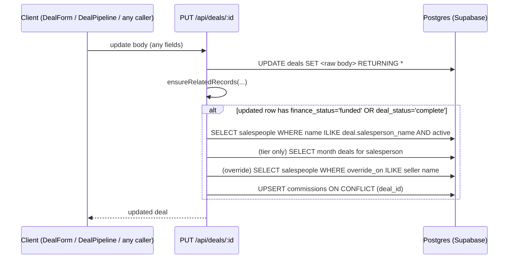
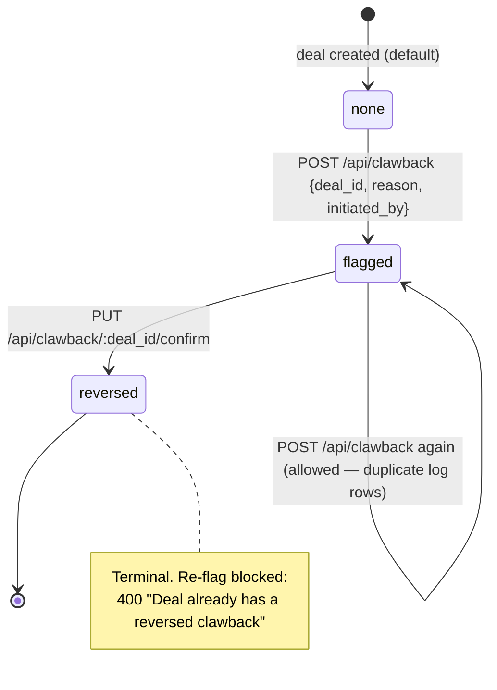

# Commissions & Clawbacks — Exact Calculation, Pay Plans, Clawback Lifecycle

This document captures the commission engine and clawback workflow **exactly as implemented** in `server/routes/deals.js` (`calculateCommission`), `server/routes/clawback.js`, `server/routes/bulk.js`, `server/routes/salespeople.js`, and `server/routes/reports.js`, including the real per-salesperson pay plans seeded in `supabase-migration.sql`. Every defect in the current math is documented, because ReadyLoans must port the *intended* rules — not the bugs — into a tested `packages/core` commission engine (ADR-001, ADR-009, ADR-026). Anything not implemented today is marked **Target**.

## Table of Contents

1. [Data Model](#1-data-model)
2. [The Real Pay Plans (Seeded Production Data)](#2-the-real-pay-plans-seeded-production-data)
3. [When Commission Is Calculated (Trigger Conditions)](#3-when-commission-is-calculated-trigger-conditions)
4. [The Exact Commission Algorithm](#4-the-exact-commission-algorithm)
5. [Worked Examples](#5-worked-examples)
6. [Money-Unit Hazards (Cents Migration Fallout)](#6-money-unit-hazards-cents-migration-fallout)
7. [Commission Reporting](#7-commission-reporting)
8. [Clawbacks](#8-clawbacks)
9. [Bulk Operations Affecting Commissions](#9-bulk-operations-affecting-commissions)
10. [Known Defects (Consolidated)](#10-known-defects-consolidated)
11. [Target-State Commission Engine for ReadyLoans](#11-target-state-commission-engine-for-readyloans)

---

## 1. Data Model

### `salespeople` (pay-plan configuration)

| Column | Type | Meaning |
|---|---|---|
| `id` | UUID PK | |
| `name` | TEXT NOT NULL | **The join key** — deals reference salespeople by name string (`deals.salesperson_name`), matched case-insensitively via ILIKE. No FK anywhere. |
| `commission_rate` | NUMERIC NOT NULL DEFAULT 0 | Base rate as a **decimal fraction** (0.30 = 30%) |
| `has_pad` | BOOLEAN NOT NULL DEFAULT true | Whether the pack/pad deduction applies |
| `pad_amount` | NUMERIC NOT NULL DEFAULT 1500 | The "pad" (house pack) deducted from gross before the rate is applied. Seeded in **dollars** ($1,500) |
| `has_tiered_rate` | BOOLEAN NOT NULL DEFAULT false | Enables the monthly-gross tier |
| `tier_threshold` | NUMERIC NULL | Monthly gross above which the tier rate applies (seeded 60000 = $60,000) |
| `tier_rate` | NUMERIC NULL | Rate used instead of `commission_rate` when the threshold is exceeded |
| `override_on` | TEXT NULL | Name of the salesperson **whose deals** pay this person an override |
| `override_rate` | NUMERIC NULL | Override rate (fraction, e.g. 0.05) |
| `active` | BOOLEAN NOT NULL DEFAULT true | Deactivation is the delete path (`DELETE /api/salespeople/:id` sets `active=false`) |
| `store_id`, `deleted_at` | | Added later; not used by the calculator |

### `commissions` (one row per deal)

`deal_id UUID NOT NULL FK deals ON DELETE CASCADE` with **UNIQUE constraint `commissions_deal_id_key`** — exactly one commission record per deal, which is what makes the calculator's upsert (`onConflict: 'deal_id'`) idempotent. Fields written by the calculator: `salesperson_name`, `commission_rate` (the final rate actually used), `pad_amount`, `gross_for_commission`, `commission_amount`, `override_salesperson`, `override_amount`. All NUMERIC (dollars-era — see §6). Plus `store_id`, `deleted_at`, `created_at`.

### `deals` inputs and `clawback` fields

- Calculator inputs: `deals.sale_price`, `deals.vehicle_cost`, `deals.fi_reserve` — all converted to **INTEGER cents** by migration F-007 (`20260406_soft_delete_cents.sql`).
- Trigger inputs: `deals.finance_status` (`pending`/`approved`/`funded`), `deals.deal_status` (`open`/`complete`/`cancelled`).
- `deals.clawback_status TEXT DEFAULT 'none'` CHECK (`'none'`,`'flagged'`,`'reversed'`).

### `clawback_log` (append-only)

`id PK`, `deal_id NOT NULL FK deals ON DELETE CASCADE`, `commission_id UUID` (**no FK**, and never populated by the route), `salesperson_name TEXT`, `original_amount INTEGER NOT NULL DEFAULT 0` (cents), `reversed_amount INTEGER NOT NULL DEFAULT 0` (cents), `reason TEXT NOT NULL`, `initiated_by UUID FK users ON DELETE SET NULL`, `store_id FK stores`, `created_at`. RLS allows SELECT/INSERT only (append-only by policy shape, though all policies are `USING(true)` today).

---

## 2. The Real Pay Plans (Seeded Production Data)

These 12 plans are live business rules (seeded by `supabase-migration.sql`, editable via `SalespeopleManager` / `PUT /api/salespeople/:id`). They must survive any migration verbatim.

| Salesperson | Rate | Pad | Pad $ | Tier | Override relationship |
|---|---|---|---|---|---|
| Jason Chahine | 30% | no | 0 | — | — |
| Ibrahim Hussain | 20% | yes | 1,500 | — | Omar Mohamed earns 5% on his deals |
| Hussein Alshawi | 25% | yes | 1,500 | — | Hassan Alabboudy earns 5% on his deals |
| Hussein Hussein | 20% | yes | 1,500 | — | — |
| Hussain Safa | 20% | yes | 1,500 | — | — |
| Abdul-Alla Al-Ubeedi | 25% | yes | 1,500 | — | — |
| Hassan Alabboudy | 35% | yes | 1,500 | — | receives: `override_on='Hussein Alshawi'`, `override_rate=0.05` |
| Nicolas Sayah | 5% | yes | 1,500 | — | — |
| Omar Mohamed | 30% | yes | 1,500 | — | receives: `override_on='Ibrahim Hussain'`, `override_rate=0.05` |
| Muhammad Majid Hassan | 25% → 30% | yes | 1,500 | **30% when monthly gross > $60,000, else 25%** (`has_tiered_rate=true`, `tier_threshold=60000`, `tier_rate=0.30`) | — |
| Mustafa Hafid | 20% | yes | 1,500 | — | — |
| Michael Belway | 20% | yes | 1,500 | — | — |

Note the override data direction: the **receiver** carries `override_on = <seller's name>`. Hassan Alabboudy's row says he overrides on Hussein Alshawi's deals; Hussein Alshawi's own row has no override fields. This matters for defect D5 (§10).

---

## 3. When Commission Is Calculated (Trigger Conditions)



Exact rules (as-built):

1. **Sole trigger point:** the tail of `PUT /api/deals/:id`. Condition: the **post-update row** satisfies `finance_status === 'funded' || deal_status === 'complete'` (legacy fields — the new `funding_status`/`pipeline_stage` play no part).
2. Because the condition tests the row, not the change, **every subsequent `PUT` on a funded/complete deal recalculates and overwrites the commission row** — including kanban stage drags (which `PUT` only `pipeline_stage`/`stage_entered_at`). Editing sale numbers after funding silently rewrites the commission.
3. Commission is **not** calculated on `POST /api/deals` (create), on bulk operations (`/api/bulk/deals/update-stage`, `/api/bulk/deals/reassign` — see §9), or by any scheduled job.
4. **Silent skip conditions** (function returns without writing anything, no error, no log): empty `salesperson_name`; `totalGross <= 0`; no active salesperson matches the name (ILIKE + `active=true`, `.single()`); `grossForCommission <= 0` after the pad.
5. `DELETE /api/deals/:id` hard-deletes the deal → the commission row and any clawback log rows **cascade-delete** (audit loss).

---

## 4. The Exact Commission Algorithm

Verbatim math from `calculateCommission(deal)` in `server/routes/deals.js` (lines 6–95). All inputs `Number()`-coerced with default 0.

**Step 1 — Gross:**

```
grossProfit = sale_price − vehicle_cost
totalGross  = grossProfit + fi_reserve
if totalGross ≤ 0 → stop (no commission)
```

**Step 2 — Salesperson lookup:** `salespeople WHERE name ILIKE deal.salesperson_name AND active = true` (`.single()`; not found → stop).

**Step 3 — Pad (pack) deduction:**

```
padAmount          = has_pad ? (pad_amount || 0) : 0
grossForCommission = totalGross − padAmount
if grossForCommission ≤ 0 → stop
```

The pad is deducted from gross **before** the rate is applied. (The Finance Desk spec's display example "Salesperson (30%): $2,101; Pad deduction: −$1,500; Net: $601" implies rate-then-pad — that contradicts the code. **The code is ground truth: pad first, then rate.** On $7,004 gross at 30% the code pays `(7,004 − 1,500) × 0.30 = $1,651.20`, not $601.)

**Step 4 — Tiered rate (only when `has_tiered_rate && tier_threshold && tier_rate`):**

```
monthStart = first day of current calendar month, 00:00 local → ISO
monthEnd   = new Date(year, month+1, 0).toISOString()   // last day of month at 00:00 — see defect D4
monthDeals = all deals WHERE salesperson_name ILIKE <name>
             AND created_at BETWEEN monthStart AND monthEnd
monthlyGross = Σ over monthDeals of (sale_price − vehicle_cost + fi_reserve)
if monthlyGross > tier_threshold → rate = tier_rate   // else rate = commission_rate
```

Tier facts: the window is by **`created_at`**, not funded date; `monthlyGross` is **pre-pad** and **includes the current deal** (it already exists); when the threshold is crossed the tier rate applies to the **entire current deal** (not marginal), and — because recalculation happens on any later `PUT` — previously-funded deals in the month get retro-bumped only if something touches them again.

**Step 5 — Commission:**

```
commissionAmount = grossForCommission × rate
```

**Step 6 — Supervisor override:** guarded by `if (sp.override_on && sp.override_rate)` on the **selling** salesperson's own row (the code comment admits the ambiguity), then:

```
overriders = salespeople WHERE override_on ILIKE deal.salesperson_name AND active = true
for each overrider o:                    // loop overwrites — only the LAST one is kept
    overrideSalesperson = o.name
    overrideAmount      = grossForCommission × o.override_rate
```

Intended rule (per pay plans, §2): a manager whose `override_on` names the seller earns `grossForCommission × override_rate` on that seller's deals. As-built the outer guard means the override search only runs when the **seller** also has `override_on`/`override_rate` set on their own row — with the seeded data (Hussein Alshawi and Ibrahim Hussain have none), **overrides never pay out** (defect D5).

**Step 7 — Persist:** upsert into `commissions` with `onConflict: 'deal_id'`:

```
{ deal_id, salesperson_name, commission_rate: rate (final rate used), pad_amount,
  gross_for_commission, commission_amount, override_salesperson, override_amount }
```

---

## 5. Worked Examples

All figures in dollars (the units the plans were authored in — see §6 for what actually happens post-cents-migration).

### 5.1 Flat rate, no pad — Jason Chahine (30%, `has_pad=false`)

| Input | Value |
|---|---|
| sale_price | 25,000 |
| vehicle_cost | 21,000 |
| fi_reserve | 1,500 |

`totalGross = (25,000 − 21,000) + 1,500 = 5,500` → no pad → `commission = 5,500 × 0.30 = 1,650.00`.

### 5.2 Rate + pad + intended override — Hussein Alshawi (25%, pad 1,500; Hassan Alabboudy 5% override)

Same deal numbers: `totalGross = 5,500` → `grossForCommission = 5,500 − 1,500 = 4,000` → `commission = 4,000 × 0.25 = 1,000.00`.
**Intended** override: Hassan Alabboudy earns `4,000 × 0.05 = 200.00`. **As-built:** the guard in Step 6 fails (Hussein Alshawi's own `override_on` is null) → `override_amount = 0` written.

### 5.3 Tier — Muhammad Majid Hassan (25% base, 30% above $60,000 monthly gross)

Deal: `totalGross = 8,000`, pad 1,500 → `grossForCommission = 6,500`.
Month-to-date deals (incl. this one) sum to `monthlyGross = 63,400` (pre-pad). `63,400 > 60,000` → `rate = 0.30` → `commission = 6,500 × 0.30 = 1,950.00`. Had `monthlyGross` been ≤ 60,000: `6,500 × 0.25 = 1,625.00`. The 30% applies to the whole deal, not just the portion above the threshold.

### 5.4 Pad exceeds gross — Nicolas Sayah (5%, pad 1,500)

`totalGross = 1,200` → `grossForCommission = −300` → **no commission row written at all** (silent skip). A previously-written commission row (from when the deal had different numbers) is *not* deleted — stale rows survive.

---

## 6. Money-Unit Hazards (Cents Migration Fallout)

Migration F-007 (`20260406_soft_delete_cents.sql`) converted `deals.sale_price`, `deals.vehicle_cost`, `deals.fi_reserve` to **INTEGER cents** (`ROUND(old × 100)`). The commission configuration and output tables were **not** converted (the migration's comment lists `commissions` but contains no conversion block). `calculateCommission` mixes the units blindly:

| Field | Unit after migration | Consequence in the formula |
|---|---|---|
| `sale_price`, `vehicle_cost`, `fi_reserve` | cents | `totalGross` is in **cents** |
| `salespeople.pad_amount` = 1500 | dollars (never converted) | Pad deducts 1,500 **cents = $15.00** instead of $1,500 — the "$1,500-pad-as-$15" bug class cited in ADR-009 |
| `salespeople.tier_threshold` = 60000 | dollars | Compared against cents `monthlyGross` → tier trips at **$600** of monthly gross, so Muhammad Majid Hassan effectively always earns 30% |
| `commissions.*` NUMERIC | receives cents values | `commission_amount` is stored in cents while the column/reporting assume dollars |
| `clawback_log.original_amount/reversed_amount` | INTEGER cents (by design) | Consistent only by accident with the cents-valued `commissions` rows — but see clawback defect D1 (§10) |

Worked demonstration (deal 5.2 post-migration): `totalGross = 550,000` cents; pad deducts 1,500 cents → `grossForCommission = 548,500` cents → `commission_amount = 137,125` cents = **$1,371.25** paid vs the intended **$1,000.00**. Every funded deal since the cents migration overpays by `0.25 × ($1,500 − $15) = $371.25` on this plan. **ReadyLoans rule (ADR-009): all money INTEGER cents everywhere — including `pad_amount`, `tier_threshold`, and every commission column — enforced by the shared Zod money type.**

---

## 7. Commission Reporting

`GET /api/reports/commissions?period=ytd|…&date_from&date_to&salesperson` (`server/routes/reports.js`):

- Joins `commissions` → `deals!inner`, windowed on **`deals.created_at`** (not funded date), optional `ilike` salesperson filter.
- **Per-person summary:** groups by `salesperson_name`; per person: `deals` count, `totalGrossForCommission` (Σ `gross_for_commission`), `totalCommission` (Σ `commission_amount`), `rate` and `padAmount` taken from the **first row encountered** (not the plan record).
- **Override earnings:** a second pass credits `override_amount` to `byPerson[override_salesperson].totalOverrides` (creating the person's row if they had no own deals). Dead in practice while D5 stands.
- **Monthly breakdown:** `commission_amount` totals bucketed by `YYYY-MM` of `deals.created_at`.
- Sorted by `totalCommission` desc; raw rows included. Excel (`/api/reports/export/excel?type=commissions`) and PDF (`/export/pdf?type=commissions`) exports feed the same query into ExcelJS / PDFKit (Target: Playwright/Chromium HTML→PDF per ADR-021).

---

## 8. Clawbacks

A clawback flags a deal whose commission must be recovered (deal unwound, funding reversed, customer default within lender clawback window). As-built it is a **two-step flag-and-confirm workflow with a log — it never modifies the `commissions` table or any pay record.** There is **no client UI** for it today (API only).

### Lifecycle



### `POST /api/clawback` — initiate

1. Validate: `deal_id` and `reason` required (400 otherwise). `initiated_by` optional (user UUID).
2. Load deal (`id, salesperson_name, clawback_status, store_id`); 404 if missing.
3. **Guard:** if `clawback_status === 'reversed'` → 400. A deal already `flagged` **can be flagged again** (creates another log entry — dedupe gap).
4. Compute the amount: `totalCommission = Σ Number(c.amount)` over `commissions WHERE deal_id = :deal_id`. **Defect D1: the calculator writes `commission_amount`; there is no `amount` column — the sum is always 0** unless a schema alias exists. Intended behavior: sum the deal's `commission_amount` (+ arguably `override_amount`).
5. Set `deals.clawback_status = 'flagged'`.
6. Insert `clawback_log`: `{ deal_id, salesperson_name (from deal), original_amount: totalCommission, reversed_amount: totalCommission, reason, initiated_by, store_id (from deal) }`. **Full-amount reversal only — no partial clawbacks.** `commission_id` is never populated.
7. Respond 201 `{ message: 'Clawback initiated', deal_id, clawback_status: 'flagged', reversed_amount, log }`.

### `PUT /api/clawback/:deal_id/confirm` — confirm reversal

Single conditional update — `UPDATE deals SET clawback_status='reversed' WHERE id = :deal_id AND clawback_status = 'flagged'`; 404 `"Deal not found or not in flagged state"` when the guard fails (also the response for a plain missing deal). This makes the confirm step idempotent-ish and race-safe at the row level. **No commission mutation, no negative pay entry, no salesperson notification** — reversal is a flag plus the log written at flag time.

### `GET /api/clawback/log?deal_id=&store_id=`

Full `clawback_log`, newest first, optional filters. This is the audit trail for accounting to process actual pay adjustments manually.

### Clawback triggers (business policy — Target)

As-built, initiation is manual (someone calls the API). Target policy: auto-suggest a clawback when a deal moves to `lost` after a commission row exists, when `funding_status` regresses from `funded`, or when a lender clawback notice arrives; confirmation stays a human (F&I manager / accounting) action, and a confirmed clawback generates an offsetting **negative commission entry** in the pay period rather than only a flag (see §11).

---

## 9. Bulk Operations Affecting Commissions

All bulk endpoints: array of ids required, **hard cap 50 per call**, only non-deleted rows (`deleted_at IS NULL`).

| Endpoint | Writes | Commission interplay (as-built) |
|---|---|---|
| `POST /api/bulk/deals/update-stage` `{deal_ids, new_status}` | legacy `deal_status` (no value validation) | Does **not** run `calculateCommission` — but setting `deal_status='complete'` arms the trigger, so the *next* `PUT` on each deal will calculate. Inconsistent with single-deal updates. |
| `POST /api/bulk/deals/reassign` `{deal_ids, salesperson_name}` | `salesperson_name` | **No recalc.** Existing commission rows keep the old salesperson until any later `PUT` fires the trigger, which then rewrites the row under the new name at the new plan — silently repricing history (name-string linkage, D3). |
| `POST /api/bulk/tasks/complete` / `POST /api/bulk/tasks/reassign` | tasks | No commission relevance |

Note on naming: migration `20260406_clawback_bulk.sql` contains only the clawback schema (`deals.clawback_status` + `clawback_log`); **there is no bulk-clawback endpoint** — "bulk" in that migration name refers to the `bulk.js` operations shipped in the same feature batch.

---

## 10. Known Defects (Consolidated)

| # | Defect | Where | Impact |
|---|---|---|---|
| D1 | Clawback sums `commissions.amount` but the writer writes `commission_amount` | `clawback.js` vs `deals.js` | `original_amount`/`reversed_amount` logged as **0** — clawback log financially useless |
| D2 | Units mixed after cents migration: pad ($1,500 → deducts $15), tier threshold ($60,000 → trips at $600), `commissions` columns never converted | F-007 + `calculateCommission` | Systematic overpayment; tier always active for Muhammad Majid Hassan (§6) |
| D3 | Salesperson linkage by ILIKE name string, no FK (`deals.salesperson_name`, `commissions.salesperson_name`, `salespeople.override_on`) | schema-wide | Renames orphan history; bulk reassign reprices silently; homonyms collide |
| D4 | Tier month window: `monthEnd = new Date(y, m+1, 0)` = last day at **00:00** — deals created on the last day after midnight fall outside; window keyed on `created_at`, not funded date; monthly gross pre-pad and includes current deal; whole-deal (non-marginal) tier | `calculateCommission` step 4 | Wrong tier decisions at month boundaries; gaming via deal-creation timing |
| D5 | Override outer guard requires the **seller** to carry `override_on`/`override_rate`; with seeded plans this is never true → **overrides never pay**; loop keeps only the last overrider if several match | `calculateCommission` step 6 | Hassan Alabboudy and Omar Mohamed's 5% overrides silently unpaid |
| D6 | Recalc on **every** `PUT` of a funded/complete deal; upsert overwrites the single row with no history | trigger | Post-funding edits silently change pay; no commission audit trail |
| D7 | Silent skips (no salesperson match, gross ≤ 0, gross ≤ pad) with no error/log; stale rows from earlier calculations are never cleaned | `calculateCommission` | Missing commissions discovered only at payroll |
| D8 | Hard `DELETE /api/deals/:id` cascades `commissions` and `clawback_log` | `deals.js` | Pay/audit records destroyed with the deal |
| D9 | Re-flagging a `flagged` deal allowed → duplicate log rows | `clawback.js` | Double-counting risk in clawback reports |
| D10 | Auth middleware exists (`server/middleware/auth.js`: JWT `authenticateUser` + `requireRole` over the 10-role list, `supabase/migrations/20260406_auth_rbac.sql`) but is applied only to user-account routes (`server/routes/users.js` lines 22, 70) — commission/clawback endpoints and pay-plan CRUD carry no middleware and are open | commission/clawback/salespeople routes | Anyone can change rates, initiate clawbacks, or read pay data |
| D11 | `clawback_log.commission_id` never populated (and has no FK) | `clawback.js` | Cannot join a clawback to the exact commission version it reverses |

---

## 11. Target-State Commission Engine for ReadyLoans

The intended rules to port (the "7/10 asset"), cleansed of the defects above, implemented once in `packages/core` (`CommissionEngine`) with Vitest coverage ≥90% (ADR-023):

1. **Formula (canonical, all INTEGER cents — ADR-009):**
   - `total_gross_cents = (sale_price_cents − vehicle_cost_cents) + fi_reserve_cents`
   - `gross_for_commission_cents = max(0, total_gross_cents − pad_cents)` where `pad_cents` applies only when `has_pad`
   - `rate = tier_rate` iff `has_tiered_rate` and the salesperson's **funded** monthly gross (by `funded_at`, tenant-timezone month, half-open interval `[monthStart, nextMonthStart)`) exceeds `tier_threshold_cents`; else `commission_rate`
   - `commission_cents = round(gross_for_commission_cents × rate)`
   - For every active membership with `override_on_salesperson_id = seller_id`: `override_cents = round(gross_for_commission_cents × override_rate)` — **no dependency on the seller's own override fields, all overriders paid** (one commission-line row each).
2. **Identity:** `deals.salesperson_id → users.id` real FK (name-ILIKE banned, ADR-009); pay plans become per-membership records (`tenant_id`, `store_id`) under FORCED RLS (ADR-007).
3. **Trigger:** exactly once per state change — computed when `funded_at` is first set (and on `complete`), via a BullMQ job with a deterministic job id (`commission:{deal_id}:{funded_at}`), not on arbitrary updates (ADR-012). Post-funding edits require an explicit "recalculate commission" action that versions the previous row (append-only `commission_versions` + `activity_events`).
4. **Clawbacks:** partial amounts supported (`reversed_amount ≤ original_amount`); confirming writes an offsetting negative commission line into the open pay period and emits `commission.clawback_confirmed` (outbound webhook, ADR-005); duplicate flags blocked while `flagged`; `commission_id` FK mandatory; initiation restricted to `fi_manager`/`gm`/`owner` roles (ADR-006), auto-suggested on `deal.lost`-after-commission and on funding regression.
5. **Reporting:** commission statements per pay period (month, tenant timezone), keyed on `funded_at`; FR/EN statement PDFs via the branded document pipeline (ADR-018, ADR-019, ADR-021).
6. **Migration:** seed the 12 pay plans of §2 as tenant #1 (Kia Mont-Laurier) data with `pad_cents = 150000`, `tier_threshold_cents = 6000000`; regression-test the engine against historical `commissions` rows, flagging every deal where the corrected math differs from the paid amount (expected: all padded deals since the cents migration, all override deals) — the discrepancy report goes to Hassan before cutover (ADR-026).
