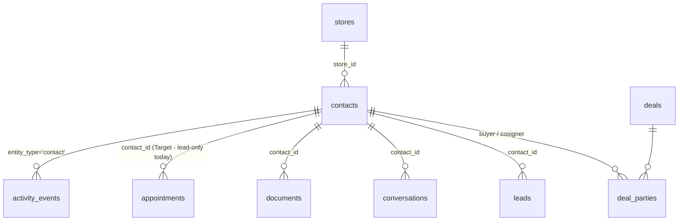
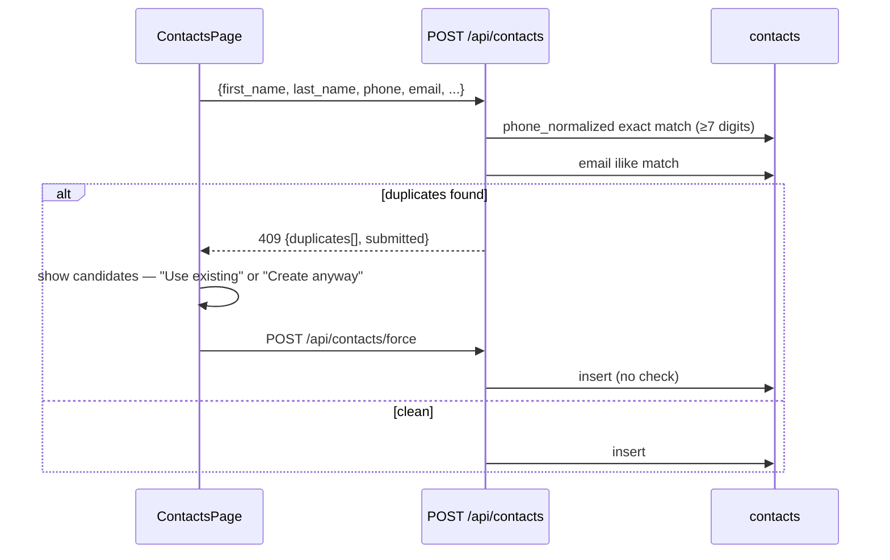

# Business Logic — Contacts: Customer Master, Dedupe, Timeline & Consent

This document specifies the **contact** domain: the customer-master record that outlives any single lead or deal, its dedupe rules (409-and-confirm on create), the relationship model to deals (`deal_parties`) and leads, the unified activity timeline, and the consent/compliance fields that anchor CASL, Law 25 and Bill 96 obligations. Behavior is documented **as implemented** in the Kia Mont-Laurier tracker (`server/routes/contacts.js`, `supabase/migrations/20260406_create_contacts.sql`), with future behavior marked **Target** and referenced to the ADRs in `docs/new/00-overview/ARCHITECTURE-DECISIONS.md`.

---

## Table of Contents

1. [Role of the Contact Record](#1-role-of-the-contact-record)
2. [Data Model](#2-data-model)
3. [Duplicate Detection (Create-Time 409 Flow)](#3-duplicate-detection-create-time-409-flow)
4. [Relationships: Deals, Leads, Conversations](#4-relationships-deals-leads-conversations)
5. [Search](#5-search)
6. [Timeline](#6-timeline)
7. [Consent & Compliance](#7-consent--compliance)
8. [Lifetime Metrics](#8-lifetime-metrics)
9. [API Surface](#9-api-surface)
10. [Known Defects & Migration Notes](#10-known-defects--migration-notes)

---

## 1. Role of the Contact Record

`contacts` is the **customer master**: one row per human, regardless of how many leads they submit or deals they sign. Leads reference contacts via `leads.contact_id`; deals reference contacts both via the legacy denormalized columns (`customer_name`, `customer_phone`, `customer_address`) and via the normalized `deal_parties` join (roles `buyer` / `cosigner`). The contact is where consent, language preference, identity documents, and lifetime value live.

Target (ADR-007/009): `tenant_id` + `store_id` on every row, FORCED RLS; a person who buys at two stores of the same organization is **one contact** scoped to the organization (tenant), with store affinity derived from deals.

---

## 2. Data Model

Table: `contacts` (soft delete `deleted_at`; realtime-enabled; `updated_at` trigger).

| Group | Column | Type / rule |
|---|---|---|
| Identity | `first_name` | TEXT **NOT NULL** |
| | `last_name` | TEXT **NOT NULL** |
| | `email` | TEXT |
| | `phone` | TEXT |
| | `phone_normalized` | TEXT — **auto-maintained by trigger** `contacts_phone_normalize`: `regexp_replace(phone, '[^0-9]', '', 'g')`; never client-writable |
| Address | `address`, `city`, `province`, `postal_code` | TEXT (client create modal defaults province `QC`; provinces offered: QC, ON, NB, NS, PE, NL, MB, SK, AB, BC) |
| Personal | `driver_license`, `employer`, `date_of_birth DATE` | Target: field-level AES-256-GCM envelope encryption + blind HMAC index for licence lookup (ADR-015) |
| Compliance | `preferred_language` | TEXT NOT NULL **DEFAULT 'fr'**, CHECK (`en`,`fr`) — French-first (Bill 96, ADR-019) |
| | `marketing_consent` | BOOLEAN DEFAULT false |
| | `consent_date` | TIMESTAMPTZ — see §7 semantics |
| Relationship | `source` | CHECK (`walk_in`,`phone`,`web`,`referral`,`repeat`,`other`) — note: **narrower than the lead source enum**; lead→contact conversion hardcodes `'web'` |
| | `customer_since` | TIMESTAMPTZ DEFAULT now() |
| | `lifetime_deals` | INTEGER DEFAULT 0 |
| | `lifetime_value` | INTEGER **cents** DEFAULT 0 (ADR-009) |
| | `notes` | TEXT |
| Search | `search_vector` | TSVECTOR — trigger-maintained (§5); never client-writable |
| Scope | `store_id FK stores` | Target: + `tenant_id` |
| Meta | `created_at`, `updated_at`, `deleted_at` | |

Indexes: GIN(`search_vector`), `phone_normalized`, `email`, `(last_name, first_name)`, `deleted_at`, `store_id`.

Write protection (current, `PUT /api/contacts/:id`): the handler strips `id`, `created_at`, `updated_at`, `deleted_at`, `search_vector`, `phone_normalized` from any update body; all string fields are trimmed on insert.

---

## 3. Duplicate Detection (Create-Time 409 Flow)

Unlike leads (post-create scan + merge queue), contact dedupe is **preventive**: a duplicate create attempt is rejected with HTTP 409 and the caller decides.

`POST /api/contacts` — exact algorithm:

1. Validate `first_name` AND `last_name` present (400 otherwise).
2. **Phone check:** normalize to digits; if ≥ 7 digits, exact match on `phone_normalized` — up to 5 matches, tagged `match_type: 'phone'`.
3. **Email check:** `ilike` on the trimmed email — up to 5 matches, de-duplicated against phone matches, tagged `match_type: 'email'`.
4. Any matches → **409** `{ error: 'Potential duplicate contacts found', duplicates: [...], submitted: {first_name, last_name, email, phone} }` — nothing is created; the UI shows the candidates side by side.
5. Clean → insert (trimmed fields, `preferred_language` default `'fr'`, `marketing_consent` default `false`, consent-date rule of §7).

Override path: `POST /api/contacts/force` — identical insert with detection skipped (explicit human decision: "Create anyway").

Contrast with lead dedupe (see `leads.md` §8): leads use last-10-digit phone / email / name grouping with confidence 100/90, a `lead_duplicates` review queue, and an older-record-wins merge. **Target:** contact merge tooling (same keeper-wins backfill pattern as the lead merge, re-pointing `deal_parties`, `leads.contact_id`, `conversations.contact_id`, `documents.contact_id` transactionally), plus a periodic cross-entity scan that links leads to existing contacts by phone at intake time so the AI layer greets known customers by history.

The lead→contact creation path inside `POST /api/leads/:id/convert` currently performs **no duplicate check** (defect — Target: route it through the same 409/force logic server-side, auto-reusing an exact phone match).

---

## 4. Relationships: Deals, Leads, Conversations

### 4.1 `deal_parties` (normalized join)

`deal_parties`: `deal_id FK deals CASCADE`, `contact_id FK contacts CASCADE`, `role` CHECK (`buyer`,`cosigner`), `UNIQUE(deal_id, contact_id, role)`.

- `GET /api/contacts/:id` resolves the contact's deals **through `deal_parties`** (id, stock_number, year, make, model, deal_status, sale_type, created_at — newest first), annotating each with the contact's `role` (default `buyer`).
- Legacy bridge: `POST /api/deals/:id/sync-customer` copies the buyer party's contact fields back onto the legacy `deals.customer_name` / `customer_phone` / `customer_address` columns. Target (ADR-009): the legacy columns are dropped after migration; `deal_parties` becomes the only customer linkage, and cosigners are first-class.

### 4.2 Historical backfill rule (one-time migration, already applied)

`deals.customer_name` was parsed (first token → `first_name`, remainder → `last_name`); dedupe by `phone_normalized` first, then exact first+last name; contact created if none; `deals.contact_id` set; `deal_parties` buyer row inserted; cosigners matched by name only. The same parser is the reference for migrating remaining legacy tenants (ADR-026).

### 4.3 Leads and conversations

- `leads.contact_id` links a lead to its contact (set at conversion; Target: set at intake when a phone match to an existing contact exists).
- `conversations.contact_id` ties AI/SMS threads to the contact so the full communication history survives across leads (see `appointments-tasks-communications.md` §5).

---

## 5. Search

Two server paths (current):

| Path | Mechanism | Behavior |
|---|---|---|
| `GET /api/contacts?search=` | Postgres full-text via `textSearch('search_vector', terms joined ' & ', type: 'plain')` | List filtering |
| `GET /api/contacts/search?q=` | Typeahead: if normalized `q` ≥ 4 digits → `ilike phone_normalized %q%` (limit 10), then top-up to 10 with name/email `ilike` excluding already-found ids; `q` < 2 chars → `[]` | Command palette (Ctrl/Cmd+K) and appointment-booking client picker |

`search_vector` trigger weights (`'simple'` config — accent/diacritic-safe for French names): **A** = first_name + last_name; **B** = email + phone + phone_normalized; **C** = city; **D** = employer.

Target (ADR-015 interaction): once phone/licence are encrypted, equality search moves to **blind HMAC indexes**; the tsvector keeps only non-encrypted fields (names, city, employer).

---

## 6. Timeline

**Current state:** the ContactDetail three-column layout (HubSpot-style: 280px properties | flex timeline | associations) ships with the Timeline column as a **placeholder** — "populated after F-008 Activity Events". The data source exists but is not wired:

- `activity_events` (append-only audit): `entity_type` (`'contact'`, `'deal'`, …), `entity_id`, `action` (`created`,`updated`,`deleted`,`restored`,`stage_changed`,…), `actor_id`, `old_value JSONB`, `new_value JSONB`, `metadata JSONB`, `store_id`, `created_at`. Read via `GET /api/activity-events?entity_type=contact&entity_id={id}` (paginated, limit ≤ 100). Writes come from DB triggers/services, never from this route.

**Target — unified contact timeline** merges, newest-first, with type filters:

| Stream | Source | Notes |
|---|---|---|
| Field/audit events | `activity_events` (entity = contact) | who changed what, old→new |
| Communications | `lead_communications` of all linked leads + `messages` of linked conversations | calls/SMS/email/visits + AI thread, with direction and HANDOFF markers |
| Appointments | `appointments` (Target adds `contact_id`; today appointments are lead-only — gap) | showed/no-show outcomes |
| Deal milestones | `deal_stage_history` via `deal_parties` | stage changes with actor |
| Documents | `documents` (`contact_id`) | uploads by category |
| Consent events | consent ledger (§7 Target) | grants, withdrawals, STOP |

Every state change platform-wide emits an `activity_events` row (tenant-scoped, append-only) per ADR-009, so the timeline is a read-model over existing streams — no new write paths.

---

## 7. Consent & Compliance

### 7.1 Current fields & semantics (implemented)

- `preferred_language` NOT NULL DEFAULT `'fr'` — drives UI language, template selection, and AI agent language matching (Bill 96; ADR-019).
- `marketing_consent` BOOLEAN DEFAULT false.
- `consent_date` write rules (exact, `contacts.js`):
  - On **create**: `consent_date = now()` iff `marketing_consent === true`, else `NULL`.
  - On **update**: whenever `marketing_consent` is present in the payload, `consent_date` is reset — `now()` if true, `NULL` if false. (Withdrawal therefore erases the grant date — see gap below.)

### 7.2 Target — consent ledger (ADR-022, platform compliance engine)

The single boolean is insufficient for CASL/Law 25. Target model: an append-only `consent_events` ledger per person/channel replacing in-place mutation:

| Field | Values |
|---|---|
| `contact_id` / `lead_id` | subject |
| `channel` | `sms` \| `email` \| `voice` \| `all` |
| `basis` | `express` \| `implied_inquiry` (6-month CASL expiry) \| `implied_business_relationship` (24-month expiry) |
| `action` | `granted` \| `withdrawn` \| `expired` \| `stop_keyword` |
| `source` | form id / webhook source / "Reply YES" SMS / staff entry |
| `occurred_at`, `expires_at`, `evidence` (raw payload ref) | |

Rules enforced in the send layer (not per feature — ADR-020):

1. **STOP** on any inbound SMS → immediate, global, channel-wide opt-out (`stop_keyword` event) — already specified for the conversation router.
2. Implied consent auto-expires: 6 months (inquiry) / 24 months (existing business relationship); expiry re-checked before every send.
3. **ADAD gate**: no automated outbound *voice* call without recorded **express** consent ("Can our assistant call you? Reply YES" captured in SMS).
4. CRTC quiet hours (9:00–21:30 weekdays, 10:00–18:00 weekends, recipient-local) + DNCL scrub ≤ 31 days + per-tenant internal DNC.
5. Current `marketing_consent`/`consent_date` migrate as the opening ledger entries; the boolean remains as a derived read-model column.
6. Law 25: consent events are retained (never hard-deleted); contact soft-delete triggers the retention/erasure workflow, not row deletion.

### 7.3 PII handling (Target, ADR-015)

`driver_license`, `date_of_birth`, and any future SIN/banking fields: AES-256-GCM envelope encryption (AWS KMS, per-tenant data keys), blind HMAC index for licence equality lookup, decrypt paths audited. Reporting uses non-PII aggregates only.

---

## 8. Lifetime Metrics

| Field | Semantics |
|---|---|
| `customer_since` | First contact creation (displayed on ContactDetail) |
| `lifetime_deals` | Count of deals (badge on contact cards) |
| `lifetime_value` | INTEGER cents |

Current gap: no recompute job exists — values are static after backfill. **Target:** maintained by a worker on deal `complete` transition — `lifetime_deals = COUNT(deal_parties WHERE role='buyer' AND deal complete)`, `lifetime_value = Σ deals.total_gross_cents` for those deals; recomputed idempotently (BullMQ, deterministic job ID per contact) so replays are safe (ADR-012).

---

## 9. API Surface

Current Express endpoints (all re-created behind auth + tenant scoping at `/api/v1` per ADR-003/006/007):

| Endpoint | Behavior |
|---|---|
| `GET /api/contacts` | Filters: `source`, `search` (FTS), `sort_by` (default `created_at`), `sort_dir`; pagination `limit` (default 50, **max 100**) / `offset`; returns `{data, total}`; soft-delete filtered. List columns include `customer_since`, `lifetime_deals`, `lifetime_value` |
| `GET /api/contacts/search?q=` | Typeahead, phone-first, max 10 (§5) |
| `GET /api/contacts/:id` | Contact + associated deals via `deal_parties` with role annotation |
| `POST /api/contacts` | Create with 409 duplicate flow (§3) |
| `POST /api/contacts/force` | Create bypassing dedupe |
| `PUT /api/contacts/:id` | Update; strips protected columns; consent-date reset rule (§7.1); 404 if soft-deleted |
| `DELETE /api/contacts/:id` | Soft delete (`deleted_at`) |
| `GET /api/activity-events?entity_type=contact&entity_id=` | Timeline events (read-only, paginated) |
| `GET /api/search?q=` | Global command-palette search returning `{contacts, deals}` |

---

## 10. Known Defects & Migration Notes

| # | Defect (current) | Fix (Target) |
|---|---|---|
| 1 | Customer identity duplicated: `deals.customer_*` text columns vs `contacts`/`deal_parties`; manual `sync-customer` bridge | `deal_parties` is the single linkage; legacy columns dropped post-migration (ADR-009/026) |
| 2 | Lead-convert creates contacts with no dedupe and hardcoded `source='web'` | Route through the 409/force dedupe service; carry the lead's real source |
| 3 | Contact source enum (6 values) narrower than lead sources | One shared source vocabulary in `packages/schemas` (ADR-016) |
| 4 | `consent_date` overwritten on withdrawal — grant history lost | Append-only consent ledger; boolean becomes derived (ADR-022) |
| 5 | No consent expiry, no channel granularity, no STOP linkage to contacts | Consent engine in the send layer (ADR-020/022) |
| 6 | Timeline placeholder; appointments/communications not linkable to contacts (lead-only FKs) | Add `contact_id` to appointments/communications; unified timeline read-model (§6) |
| 7 | `lifetime_deals`/`lifetime_value` never recomputed | Worker recompute on deal completion (§8) |
| 8 | RLS `USING(true)`; no tenant isolation; PII plaintext | FORCED RLS + tenant context (ADR-007); field-level encryption + blind indexes (ADR-015) |
| 9 | Duplicate merge exists for leads but not contacts | Transactional contact merge with child re-pointing (§3) |
| 10 | FTS uses `'simple'` config — adequate, but phone/licence will disappear from tsvector under encryption | Blind HMAC equality indexes for encrypted identifiers (ADR-015) |
