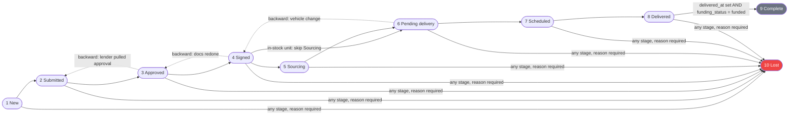

# Deals Pipeline — Stages, Funding Track, Transitions, Kanban & Lost Handling

This document is the canonical business-logic reference for the deal pipeline: the 10 pipeline stages, the parallel funding-status track, every transition rule and guard, kanban board behavior, the legacy deal-status vocabularies that still coexist with the pipeline, and lost-deal handling. Rules are documented **as they exist today** in the Kia Mont-Laurier tracker (source: `server/routes/deals.js`, `server/routes/bulk.js`, `client/src/lib/pipeline.js`, `client/src/components/DealPipeline.jsx`, migration `20260406_deal_pipeline.sql`, and the master spec) — anything not yet implemented is explicitly marked **Target**. In ReadyLoans these rules are ported to `packages/core` as a tested pipeline state machine (ADR-001, ADR-026), with the single status vocabulary owned by `packages/schemas` (ADR-009, ADR-016).

## Table of Contents

1. [Deal State Model — Two Generations of Status Fields](#1-deal-state-model--two-generations-of-status-fields)
2. [The 10 Pipeline Stages](#2-the-10-pipeline-stages)
3. [The Parallel Funding Track](#3-the-parallel-funding-track)
4. [Transition Rules and Guards](#4-transition-rules-and-guards)
5. [Stage-Specific Gates (Checklist Integration)](#5-stage-specific-gates-checklist-integration)
6. [Lost Handling](#6-lost-handling)
7. [Kanban and List Behavior](#7-kanban-and-list-behavior)
8. [Days-in-Stage, Rotting and Automation Hooks](#8-days-in-stage-rotting-and-automation-hooks)
9. [API Surface](#9-api-surface)
10. [Known Defects and As-Built Gaps](#10-known-defects-and-as-built-gaps)
11. [Target-State Deltas for ReadyLoans](#11-target-state-deltas-for-readyloans)

---

## 1. Deal State Model — Two Generations of Status Fields

The `deals` table carries **two overlapping generations** of state. Both are live in production code today; the legacy axes drive `DealForm.jsx`, `stats/summary`, bulk operations, and the commission trigger, while the new axes drive the `DealPipeline.jsx` kanban. ReadyLoans migrates to the new vocabulary only and drops the legacy columns (ADR-009).

| Generation | Column | Values (DB CHECK where present) | Default | Consumed by |
|---|---|---|---|---|
| Legacy | `deal_status` | `open`, `complete`, `cancelled` (CHECK) | `open` | DealForm, stats, bulk update-stage, commission trigger |
| Legacy | `vehicle_status` | `incoming`, `at_garage`, `delivered` (CHECK) | `incoming` | stats ("delivered" count), delivery views |
| Legacy | `finance_status` | `pending`, `approved`, `funded` (CHECK) | `pending` | DealForm, stats, **commission trigger** |
| Legacy | `is_sold` + `sold_type` | boolean; `retail`/`wholesale` | `false` | DealForm sold section |
| Legacy | `sale_type` | `retail`, `wholesale` (CHECK) | — | filters, reports |
| New (M-001) | `pipeline_stage` | 10 stages (§2) — **no DB CHECK** | `new` | DealPipeline kanban/list, `required_documents` gates |
| New (M-001) | `funding_status` | 4 statuses (§3) — **no DB CHECK** | `not_submitted` | DealPipeline funding badge, lead→deal convert |
| Cross-cutting | `clawback_status` | `none`, `flagged`, `reversed` (CHECK) | `none` | clawback API (see `commissions-clawbacks.md`) |

### Legacy → pipeline migration mapping (as implemented in `20260406_deal_pipeline.sql`)

| Legacy condition (evaluated in order) | `pipeline_stage` |
|---|---|
| `deal_status = 'complete'` | `complete` |
| `deal_status = 'cancelled'` | `lost` |
| `vehicle_status = 'delivered'` | `delivered` |
| `finance_status = 'funded'` (not delivered) | `pending_delivery` |
| `finance_status = 'approved'` | `approved` |
| anything else | `new` |

| Legacy condition | `funding_status` |
|---|---|
| `finance_status = 'funded'` | `funded` |
| `finance_status = 'approved'` | `submitted` |
| anything else | `not_submitted` |

The master spec adds two refinements the migration does not implement: `is_sold = true AND complete → complete` (vs plain `complete`), and `open + finance_status 'pending' → submitted`. The implemented mapping above is ground truth; the spec variant is the **Target** mapping for the ReadyLoans data migration of any remaining legacy rows (ADR-026).

---

## 2. The 10 Pipeline Stages

Source of truth as-built: `client/src/lib/pipeline.js` (`PIPELINE_STAGES`). Colors and order are exact.

| # | Stage id | Label (EN) | Color | Entry condition | Notes |
|---|---|---|---|---|---|
| 1 | `new` | New | `#3B82F6` blue | Lead converts (`POST /api/leads/:id/convert` writes `pipeline_stage:'new'`, `funding_status:'not_submitted'`) or deal created manually | Default on insert |
| 2 | `submitted` | Submitted | `#6366F1` indigo | F&I submits the application to DealerTrack / CreditApp / RouteOne (tracked manually — no lender API) | |
| 3 | `approved` | Approved | `#06B6D4` cyan | Approval received (conditional or full) | Deal NOT locked; "many deals die here" |
| 4 | `signed` | Signed | `#F59E0B` amber | Docs signed via DocuSign / OneSpan | Deal is real; triggers document auto-generation (Target); `required_documents` seeds gate `credit_app`, `id_verification`, `insurance` at this stage |
| 5 | `sourcing` | Sourcing | `#8B5CF6` violet | Unit not in stock, being acquired from another dealer | **Skipped entirely for in-stock units** |
| 6 | `pending_delivery` | Pending delivery | `#14B8A6` teal | Vehicle in hand (in stock or sourced unit arrived) | Working the pre-delivery checklist: safety, insurance, IDV, void cheque, wet ink |
| 7 | `scheduled` | Scheduled | `#10B981` emerald | Checklist 100% complete + delivery date set + drivers booked | Gate rules in §5 |
| 8 | `delivered` | Delivered | `#22C55E` green | Driver confirms delivery, wet ink signed, photos taken | Sets `delivered_at` + `delivery_confirmed_by` |
| 9 | `complete` | Complete | `#6B7280` gray | **Delivered AND funded — both** | Terminal (happy path) |
| 10 | `lost` | Lost | `#EF4444` red | Cancelled / backed out / declined — reachable from ANY stage | Terminal (requires reason, §6) |

### Stage graph



Supporting columns added by M-001: `lost_reason`, `lost_reason_detail`, `lost_at`, `stage_entered_at TIMESTAMPTZ DEFAULT now()` (reset on every stage change — powers days-in-stage), `delivered_at`, `delivery_confirmed_by UUID FK users`, `funded_at`, `funding_confirmed_by UUID FK users`. Audit table `deal_stage_history` (`deal_id` FK CASCADE, `from_stage`, `to_stage NOT NULL`, `changed_by` FK users, `changed_at`, `note`) is append-only (RLS SELECT/INSERT only) — **but nothing writes to it yet** (§10).

---

## 3. The Parallel Funding Track

`funding_status` is **not a stage** — it is an independent badge shown on every deal card regardless of pipeline position. Source: `FUNDING_STATUSES` in `client/src/lib/pipeline.js`.

| Order | `funding_status` | Badge color | Meaning |
|---|---|---|---|
| 1 | `not_submitted` | `#9CA3AF` gray | Funding package not yet sent to the bank (default) |
| 2 | `submitted` | `#F59E0B` amber | Package sent, awaiting funding |
| 3 | `stips_required` | `#F97316` orange | Bank needs additional documents (stips) |
| 4 | `funded` | `#22C55E` green | Money received; sets `funded_at` + `funding_confirmed_by` |

### Interaction rules with the pipeline (exact)

1. A deal **can be `delivered` while `funding_status = 'submitted'`** (delivered before funded — common).
2. A deal **can be `funded` while at `pending_delivery`** (funded before delivered) — it stays at its current stage.
3. **`complete` requires BOTH `delivered_at` set AND `funding_status = 'funded'`.** As-built guard: `canComplete(deal) = deal.delivered_at && deal.funding_status === 'funded'` (`client/src/lib/pipeline.js`).
4. Delivered-but-not-funded stays at `delivered`; funded-but-not-delivered stays where it is.
5. **Target:** the system **auto-moves** the deal to `complete` the moment both conditions become true. As-built there is no auto-move — a user must drag/set the stage, and only the client-side guard checks the precondition.

Related funding columns on `deals` (M-007/M-008): `funding_proof_url`, `funding_proof_uploaded_at`, `funding_submitted_to_bank_at`, `funding_docs_sent_at`. The legacy `finance_status` (`pending`/`approved`/`funded`) still coexists and is what actually **triggers commission calculation** on `PUT /api/deals/:id` (see `commissions-clawbacks.md`). ReadyLoans keeps only `funding_status` and derives the commission trigger from `funded_at` being set (ADR-009).

---

## 4. Transition Rules and Guards

### Rule set (business rules — as specified and, where noted, as enforced)

| # | Rule | As-built enforcement | Target enforcement |
|---|---|---|---|
| T1 | **Forward skipping allowed** where a stage doesn't apply: in-stock unit goes `signed → pending_delivery` (skips `sourcing`) | Not restricted (any transition accepted) | Contract allows declared skips only |
| T2 | **Backward moves allowed by ANY user** — explicitly no manager-only restriction. Common: `approved→submitted` (lender pulled approval), `signed→approved` (docs redone), `pending_delivery→signed` (vehicle change) | Not restricted | Same rule, but recorded in stage history with actor |
| T3 | **Any stage → `lost` at any time**, and moving to `lost` **requires a lost reason** (picker of 9, `other` requires free text) | Client-only: `LostReasonModal` blocks the mutation until a reason is chosen; server accepts a raw `PUT` without one | Server rejects `lost` without `lost_reason` (`422 validation_failed`, api-design.md §8) |
| T4 | **Move to `complete` blocked unless `delivered_at` set AND `funding_status='funded'`** | Client-only: `handleDragEnd` silently returns when `canComplete(deal)` is false (spec calls for an explanatory tooltip — not built) | Server validates both conditions (`422` domain-gate error with blocking reasons in `details[]`) |
| T5 | Every stage change **resets `stage_entered_at` to now** | Client sends `stage_entered_at: new Date().toISOString()` alongside `pipeline_stage` in the `PUT` body | Server-side, in the same transaction |
| T6 | Every stage change **appends a `deal_stage_history` row** (`from_stage`, `to_stage`, `changed_by`, `note`) shown as a timeline in deal detail | **Not implemented** — table exists, no writer | Written transactionally; emits `deal.stage_changed` |
| T7 | Moving to `lost` sets `lost_reason`, `lost_reason_detail` (if `other`), `lost_at` | Client sets all three in the `PUT` body | Server-side |
| T8 | `delivered` entry sets `delivered_at` + `delivery_confirmed_by`; `funded` sets `funded_at` + `funding_confirmed_by` | **Not implemented** (columns exist; nothing writes them — which also makes guard T4 unsatisfiable via the UI) | Delivery-confirmation and funding-confirmation endpoints write them |
| T9 | Auto-move to `complete` when delivered + funded both true | Not implemented | Worker/DB rule performs the move and logs it |
| T10 | Stage-change permissions: only Owner, GM, Sales Manager, F&I, Salesperson may move stages; marking Lost allowed for the same set (per the 10-role permission matrix) | Auth middleware **exists** (`server/middleware/auth.js`: JWT `authenticateUser` + `requireRole` over the 10-role vocabulary, backed by `supabase/migrations/20260406_auth_rbac.sql`) but is applied only to user-account routes (`GET /api/users/me`; `POST /api/users/create-account` gated owner/gm/admin_office — `server/routes/users.js` lines 22 and 70). **No deal route applies it** — any caller can move stages or mark lost | Enforced via Better Auth roles (ADR-006) + route guards |

### Critical as-built mechanics

There is **no dedicated stage endpoint**. The kanban performs stage changes through the generic update:

```
PUT /api/deals/:id
Body: { pipeline_stage: <newStage>, stage_entered_at: <now> [, lost_reason, lost_reason_detail, lost_at] }
```

`server/routes/deals.js` applies the body verbatim (no whitelist, no transition validation), then runs `ensureRelatedRecords` (upserts a `delivery_checklists` row when `tentative_delivery_date` is set, and a `sourced_units` row when `is_sourced_unit`), then runs the commission trigger if the updated row has `finance_status='funded'` or `deal_status='complete'`. All guards above marked "client-only" can be bypassed by any direct API call. The spec's `PUT /api/deals/:id/stage` (validates lost reason and the complete guard, inserts history) was never built.

**Bulk stage change** (`POST /api/bulk/deals/update-stage`, max 50 ids, honors `deleted_at IS NULL`) writes the **legacy `deal_status`** column, not `pipeline_stage` — so bulk "stage" moves do not move cards on the kanban. Documented defect (§10).

---

## 5. Stage-Specific Gates (Checklist Integration)

### `pending_delivery → scheduled` — the pre-delivery gate

**As-built:** `delivery_checklists` (1:1 with deal) tracks 4 critical items — `client_insurance_uploaded`, `deal_funded`, `safety_done`, `registration_done` — plus booking fields. `GET /api/delivery-checklists/dashboard` computes `is_ready` (all 4 true) and `missing_items` for every deal with a `tentative_delivery_date`, but **nothing blocks** scheduling; the flags are advisory (red/green dashboard).

**Target (10-item checklist spec):** scheduling is gated on checklist readiness:

- **Hard block (no override, ever):** `safety_status !== 'passed'` while `safety_required` — legal requirement. The only exception is `sold_as_is = true`, which removes safety from the checklist entirely and requires the as-is waiver document.
- **Soft blocks (manager override allowed):** insurance not `verified`; IDV not `completed` (when `idv_required`); void cheque not `received`; funding not `funded`; vehicle not `ready`; wet ink `not_prepared`; delivery date not `confirmed`; drivers `not_booked`; registration not `complete` (ON/QC only).
- **Override:** "Override & Schedule" requires manager selection + mandatory reason; logged to `checklist_overrides` (`overridden_by`, `override_reason NOT NULL`, `incomplete_items TEXT[]`); fires a MEDIUM alert to the GM.
- Conditional auto-hide: cash deals hide void cheque/funding/IDV; `sold_as_is` hides safety; non-ON/QC hides registration. Hidden items don't count toward completion.
- Readiness: `ready = no hard blocks AND no soft blocks` via `GET /api/deals/:id/checklist/readiness → { ready, hard_blocks[], soft_blocks[], hidden_items[] }`.

### `scheduled → delivered` — delivery confirmation

Target flow (`POST /api/deals/:id/delivery/complete`): confirmed when vehicle delivered + wet ink signed + both delivery photos received (client-with-vehicle, client-ID) + payment collected (if applicable) + trade-in received (if applicable). Missing items **warn but do not hard-block** ("Confirm Anyway"). On confirm: `delivered_at` + `delivery_confirmed_by` recorded and the stage auto-moves `scheduled → delivered`. Failed delivery (`delivery_status='failed'` + reason) does NOT advance the stage: client no-show → stays `scheduled` (reschedule); vehicle issue → back to `pending_delivery`; fires a HIGH alert (salesperson + sales manager + logistics).

### `delivered → complete` — see T4/T9 (§4). `signed` document gate

`required_documents` config (as-built, read via `GET /api/documents/required?pipeline_stage=`) seeds per-stage document requirements: `signed` → Credit Application, ID Verification, Proof of Insurance; `pending_delivery` → Bill of Sale, Financing Agreement, Registration; `delivered` → Trade-In Documents. Advisory as-built; Target ties document completeness into stage guards.

---

## 6. Lost Handling

### The 9 lost reasons (exact ids as-built, `LOST_REASONS` in `client/src/lib/pipeline.js`)

| # | id | Label (EN) | Reason-specific nurture messaging (Target) |
|---|---|---|---|
| 1 | `not_approved` | Client couldn't get approved | Re-engage when new lender programs become available |
| 2 | `changed_mind` | Client changed their mind | Standard drip |
| 3 | `went_elsewhere` | Client went to another dealer | Follow up if still looking |
| 4 | `ghosted` | Client not responding / ghosted | Gentle check-in sequence |
| 5 | `vehicle_unavailable` | Vehicle no longer available | Notify when a similar unit arrives |
| 6 | `payment_too_high` | Payment too high | Notify when a similar cheaper vehicle arrives |
| 7 | `trade_disagreement` | Trade-in value disagreement | Standard drip |
| 8 | `idv_failed` | Couldn't verify identity (IDV failed) | No automated re-engagement without new IDV |
| 9 | `other` | Other | Free text captured in `lost_reason_detail` |

### Rules

1. `lost` is reachable from **any** stage at any time (T3). A reason is mandatory; `other` requires `lost_reason_detail`.
2. Marking lost writes `pipeline_stage='lost'`, `lost_reason`, `lost_reason_detail`, `lost_at` (as-built: set by the client in the `PUT` body via `LostReasonModal`).
3. **Lost is not delete.** The deal record is retained with its reason for win/loss analytics; the deal disappears from the kanban (Lost column hidden).
4. **Notification:** `deal.lost` is a HIGH alert (H2) to the salesperson + sales manager (Target — notification engine).
5. **Lost → sales nurture drip (Target):** the client is auto-enrolled in a nurture drip at intervals 3 / 7 / 14 / 30 days, with messaging varying by reason (table above). The client can be re-converted to a new deal at any time during the drip; the salesperson can manually stop the drip on client request.
6. Distinguish from **lead-level lost**: leads use `lost_reason_id → lost_reasons` (a seeded bilingual FK table with 9 EN/FR reasons) and enforce `lost_reason_id` at the API; **deals** use the free-vocabulary ids above with no server enforcement. ReadyLoans unifies both on one enum in `packages/schemas` with FR/EN labels (ADR-009, ADR-019).

---

## 7. Kanban and List Behavior

As-built in `client/src/components/DealPipeline.jsx` (`@hello-pangea/dnd`), route registered in the SPA; view toggle Kanban (default) | List.

### Kanban (as-built)

- **Columns:** `KANBAN_STAGES` = the 10 stages **minus `complete` and `lost`** → 8 columns New → Delivered, fixed width 280px, horizontal scroll. The spec's "toggle to show Complete/Lost" is **not built** — those columns never render (consequence in §10).
- **Column header:** color dot (stage color), stage name (i18n key `pipeline.<stage>`), deal-count badge, and **total $ value** of the column (`Σ sale_price`, hidden when 0, rendered without cents).
- **Card contents:** customer name (fallback "no customer"), `year make model` (fallback "no vehicle"), `sale_price` bold (only when > 0), salesperson initial in a circular avatar, **funding-status pill** (color per §3), and days-in-stage with a clock icon colored by aging (§8).
- **Drag & drop:** drop on a new column issues the `PUT` described in §4/T5. Dropping on the same stage is a no-op. Drag onto `complete` is silently blocked when `canComplete` fails (spec: tooltip — not built). Drag onto `lost` opens `LostReasonModal` first and only mutates after a reason is confirmed — but see §10: no Lost column is rendered, so this path is currently unreachable by drag.
- **Soft-deleted deals** (`deleted_at` set) are filtered out client-side.
- Data source: `GET /api/deals` (full list, no pagination), react-query key `deals-pipeline`, invalidated after every stage mutation.

### List view (as-built)

Sortable-table presentation with columns: Customer | Vehicle | Stage (colored pill) | Salesperson | Value (right-aligned) | Funding (pill) | Days in stage (aging-colored). Rows click through to `/deal/:id`.

### Target additions (spec §1.6, not built)

- Complete/Lost columns behind a visibility toggle.
- Filter bar on both views: stage, salesperson, funding status, date range, sale type (retail/wholesale).
- List sortable by every column including created date; source badge on cards for sourced units (`is_sourced_unit`); sale price **or approval amount** as the bold figure.
- Realtime board updates via Socket.IO events emitted from the API on stage writes, tenant-namespaced rooms (ADR-004) instead of query invalidation only.

---

## 8. Days-in-Stage, Rotting and Automation Hooks

### Aging formula (exact, as-built)

```
days_in_stage = floor((now − stage_entered_at) / 86_400_000)   // 0 when stage_entered_at is null
```

| Days in stage | Color | Meaning |
|---|---|---|
| < 3 | `#22C55E` green | Fresh |
| 3–7 | `#F59E0B` amber | Aging |
| > 7 | `#EF4444` red | **"Rotting"** |

### Scheduled checks that read pipeline state (Target — replaced by BullMQ repeatable jobs, ADR-012)

| Check | Schedule | Logic | Recipients |
|---|---|---|---|
| S3 Funding overdue | Daily 8:00 | `funding_status='submitted'` AND submitted > 7 days ago | F&I on deal + GM (MEDIUM) |
| S4 Deal rotting | Daily 8:00 | `stage_entered_at < now − 7d` AND stage NOT IN (`complete`,`lost`) | Salesperson |

Store-configurable thresholds (`stores.alert_thresholds` JSONB per spec; as-built columns `stores.funding_overdue_days DEFAULT 7`, `safety_overdue_days DEFAULT 14`, `aging_threshold_days DEFAULT 60`): funding overdue 7 days, deal rotting 7 days. Note the DB default for safety overdue (14 d) conflicts with the spec's 3-day alert — normalize in ReadyLoans config.

### Events emitted by pipeline activity (automation engine vocabulary)

`deal.created`, `deal.stage_changed` (LOW → salesperson, seeded rule), `deal.lost` (HIGH → salesperson + sales manager), `deal.funded` (MEDIUM → F&I + salesperson), `funding.overdue`, `delivery.completed`, `delivery.failed`. As-built these exist only as `automation_rules` config rows (`trigger_event`, `trigger_condition`, `action_type 'notify'|'email'|'create_task'`, `escalation_minutes`, `escalation_target_role`) — **no execution engine runs them**. Target: BullMQ workers execute rules and also publish the same events as outbound HMAC-signed webhooks (`deal.stage_changed`, `lead.created`, …) per ADR-005.

---

## 9. API Surface

### As-built (Express — no auth middleware applied on any deal endpoint; see T10)

| Method & path | Behavior |
|---|---|
| `GET /api/deals` | Full list, `created_at` desc, **no pagination, no `deleted_at` filter, no store scoping**. Filters: `salesperson` (eq `salesperson_name`), `deal_status`, `vehicle_status`, `finance_status`, `sale_type`, `licensing_province`, `listed_online`, `date_from`/`date_to`, `search` (ILIKE OR over `customer_name`, `stock_number`, `vin`). No `pipeline_stage`/`funding_status` filters — kanban filters client-side. |
| `GET /api/deals/stats/summary` | Counts over **legacy** axes: total; delivered (`vehicle_status='delivered'`); pending / funded (`finance_status`); retail / wholesale (`sale_type`); listed_online. |
| `GET /api/deals/:id` | Single deal, 404 when missing. |
| `POST /api/deals` | Inserts raw body (no validation); then `ensureRelatedRecords` (checklist / sourced-unit upserts). |
| `PUT /api/deals/:id` | Raw-body update; `ensureRelatedRecords`; **commission trigger** when the updated row has `finance_status='funded'` OR `deal_status='complete'`. This is also the stage-change endpoint (§4). |
| `POST /api/deals/:id/sync-customer` | Copies the `deal_parties` buyer contact back onto legacy `customer_name`/`customer_phone`/`customer_address` columns. |
| `POST /api/email/deal-closing/:dealId` | Legacy email pair (`server/routes/email.js`): loads the full deal row (404 when missing) and sends the **deal-closing report** via Resend to the `DEAL_CLOSING_EMAIL` env list; UI prompts to send when `deal_status` → `complete`. Full spec: `automation-notifications.md` §7. |
| `POST /api/email/driver-dispatch/:dealId` | Same pattern — **driver-dispatch email** to the `DRIVER_DISPATCH_EMAIL` env list; UI prompts when `driver_booked_date` changes. Full spec: `dispatch-transport.md` §10. |
| `DELETE /api/deals/:id` | **Hard delete** (inconsistent with soft-delete convention; cascades `commissions`, `deal_stage_history`, `clawback_log`). |
| `POST /api/bulk/deals/update-stage` | `{deal_ids[≤50], new_status}` → sets legacy `deal_status`; honors `deleted_at`. |
| `POST /api/bulk/deals/reassign` | `{deal_ids[≤50], salesperson_name}` → renames salesperson; **no commission recalc**. |

### Target (ReadyLoans, `/api/v1` — ts-rest + Zod contracts, ADR-003)

- `POST /api/v1/deals/:id/stage` — the only stage mutator: validates the transition (T1–T10), requires `lost_reason` for `lost`, enforces the complete guard, resets `stage_entered_at`, appends `deal_stage_history`, emits `deal.stage_changed`, all in one transaction with `SET LOCAL app.tenant_id` (ADR-007).
- `GET /api/v1/deals/:id/history` — stage timeline.
- `GET /api/v1/deals?pipeline_stage=&funding_status=&store_id=&…` — paginated, tenant-scoped, soft-delete-aware.
- Stats grouped by `pipeline_stage`; funding mutations via `POST /api/v1/deals/:id/funding-status` writing `funded_at`/`funding_confirmed_by`.

---

## 10. Known Defects and As-Built Gaps

| # | Defect | Impact |
|---|---|---|
| G1 | No server-side transition validation; stage changes are raw `PUT`s | Any state jump possible via API; lost-reason and complete guards are client-only |
| G2 | `deal_stage_history` never written | No stage timeline, no audit of who moved what |
| G3 | `delivered_at`/`funded_at`/`*_confirmed_by` never written | `canComplete` can never pass → **`complete` is unreachable from the UI**; funding/delivery analytics empty |
| G4 | Kanban renders no `lost`/`complete` columns and no toggle | Deals cannot be marked lost from the board (modal path dead); lost flow only reachable via direct API |
| G5 | Dual vocabularies live simultaneously (`deal_status`+`finance_status` vs `pipeline_stage`+`funding_status`) | Stats, bulk ops, commissions on legacy fields; kanban on new fields — the two can contradict on the same deal |
| G6 | `POST /api/bulk/deals/update-stage` writes `deal_status`, not `pipeline_stage` | Bulk moves invisible on the kanban; can silently trigger commissions (`deal_status='complete'`) |
| G7 | No `pipeline_stage` CHECK constraint in the DB | Typo'd stages persist silently |
| G8 | Hard delete on deals vs soft-delete convention elsewhere | Kanban filters `deleted_at` client-side, but delete removes commission/audit rows |
| G9 | No pagination/tenancy on `GET /api/deals`; no auth on any deal endpoint (the JWT/`requireRole` middleware exists but only guards user-account routes — T10) | Board loads the entire table for all stores |
| G10 | Silent block on invalid Complete drag (no tooltip) | Users don't learn why the card snapped back |

---

## 11. Target-State Deltas for ReadyLoans

1. **One vocabulary** — `pipeline_stage` (10 values) and `funding_status` (4 values) defined once in `packages/schemas` with FR/EN labels; legacy `deal_status`/`vehicle_status`/`finance_status`/`is_sold` migrated then dropped (ADR-009, ADR-026).
2. **Pipeline state machine in `packages/core`** with the transition matrix of §4 as data, unit-tested to ≥90% coverage (ADR-023); server is the only enforcer, client renders capability hints.
3. **Tenancy:** `tenant_id`/`store_id` on `deals`, `deal_stage_history`; FORCED RLS; kanban queries and realtime channels tenant-namespaced (ADR-004, ADR-007, ADR-008).
4. **Money:** `sale_price` and column totals in integer cents; GST/QST/PST/HST split columns written by the desking engine (ADR-009).
5. **Events:** every transition appends `activity_events` and dispatches outbound webhooks (`deal.stage_changed`, `deal.lost`, `deal.funded`) with HMAC signatures (ADR-005); rotting/overdue checks become BullMQ repeatable jobs (ADR-012).
6. **Lost → nurture** drip runs as a BullMQ Flow with CASL consent checks and quiet hours enforced in the send layer (ADR-012, ADR-020, ADR-022).
7. **RBAC:** stage-move / mark-lost / override permissions from the 10-role matrix enforced via Better Auth memberships (ADR-006).
