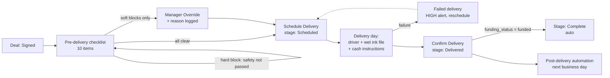
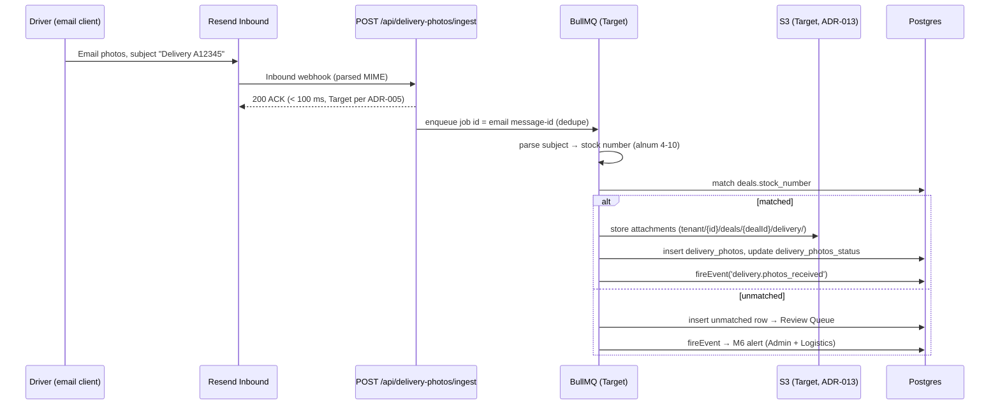

# Delivery — Pre-Delivery Checklist, Delivery Execution & Post-Delivery Automation

This document is the canonical business-rule specification for everything between a deal reaching the **Signed** pipeline stage and the completion of post-delivery follow-up: the 10-item pre-delivery checklist and its enforcement gates, delivery scheduling and dispatch preconditions, delivery photo proof, cash/down-payment collection, trade-in intake at delivery, delivery confirmation, failed-delivery handling, and post-delivery automation. Rules are documented as they exist in the Kia Mont-Laurier tracker (source code + final module specs); anything that changes in the ReadyLoans rebuild is explicitly marked **Target** and tied to an ADR (see `00-overview/ARCHITECTURE-DECISIONS.md`).

## Table of Contents

1. [Scope, Sources & Implementation Status](#1-scope-sources--implementation-status)
2. [Pre-Delivery Checklist](#2-pre-delivery-checklist)
3. [Delivery Scheduling & Dispatch Preconditions](#3-delivery-scheduling--dispatch-preconditions)
4. [Delivery Photo Proof](#4-delivery-photo-proof)
5. [Cash & Down-Payment Collection](#5-cash--down-payment-collection)
6. [Trade-In at Delivery](#6-trade-in-at-delivery)
7. [Delivery Confirmation](#7-delivery-confirmation)
8. [Failed-Delivery Handling](#8-failed-delivery-handling)
9. [Post-Delivery Automation](#9-post-delivery-automation)
10. [Events Emitted by This Module](#10-events-emitted-by-this-module)
11. [Permissions](#11-permissions)
12. [Data Model Summary](#12-data-model-summary)
13. [API Surface](#13-api-surface)
14. [Target-State Deltas (ReadyLoans)](#14-target-state-deltas-readyloans)

---

## 1. Scope, Sources & Implementation Status

Two layers exist and must not be confused:

| Layer | What exists | Where |
|---|---|---|
| **As built (legacy code)** | A 4-item `delivery_checklists` gate (`client_insurance_uploaded`, `deal_funded`, `safety_done`, `registration_done`) that is **tracked but not enforced** (dashboard-only), file uploads to the `deal-files` bucket, dispatch auto-assignment (chasers + dealer plates), PDI checklist expansion (`checklist_items` JSONB, `compliance_pct`, `manager_signed`) | `server/routes/deliveryChecklists.js`, `server/routes/upload.js`, `server/services/dispatch.js`, migrations `migration_v2.sql`, `20260406_pdi_expansion.sql` |
| **Specified (canonical business rules)** | The full 10-item enforced checklist, delivery tracker (photos/payments/trade-in/confirmation/failure), post-delivery automation | `discussions/pre-delivery-checklist-spec.md`, `discussions/delivery-tracker-spec.md`, master spec §2–§3 |

The specified rules are the business logic ReadyLoans ports into `packages/core` with tests first (ADR-026). Where the as-built behavior differs from the spec, both are stated.

End-to-end flow:



---

## 2. Pre-Delivery Checklist

The checklist is the enforcement gate between **Signed** and **Delivered**. 10 items: **9 soft blocks** (manager override possible, with reason) and **1 hard block** (safety inspection — legal requirement, no override exists).

### 2.1 The 10 Items

| # | Item | Block type | Required for | Upload | Status progression |
|---|---|---|---|---|---|
| 1 | Insurance | Soft | All deals | Yes (policy doc) | `not_received → received → verified` |
| 2 | Void cheque | Soft | Financed deals only | Yes (scan/photo) | `not_received → received` |
| 3 | Funding | Soft | Financed deals only | No (auto from Funding Tracker) | `not_submitted → submitted → stips_required → funded` |
| 4 | IDV (identity verification) | Soft | Financed deals only (not cash) | No (status only) | `not_sent → sent → completed → failed` |
| 5 | Safety inspection | **HARD** | All deals unless sold as-is | Yes (inspection report) | `not_started → sent_to_garage → in_progress → passed → failed` |
| 6 | Vehicle ready | Soft | All deals | No | `not_ready → in_recon → ready` |
| 7 | Wet ink file | Soft | All deals | No | `not_prepared → prepared → with_driver` |
| 8 | Delivery date | Soft | All deals | No | `not_set → confirmed` |
| 9 | Drivers booked | Soft | All deals | No (auto from Dispatch) | `not_booked → booked → confirmed` |
| 10 | Registration | Soft | Ontario + Quebec deals only | Yes | `not_started → in_progress → complete` |

### 2.2 Hard Block: Safety Inspection

- `safety_status` MUST be `'passed'` before delivery can be scheduled. **There is no manager override** — this is a provincial legal requirement.
- **Sole exception:** `deals.sold_as_is = true` sets `safety_required = false` and removes the item from the checklist entirely. A sold-as-is deal MUST carry the "Sold As-Is" badge on the deal card/detail and an `as_is_waiver` document in the Document Manager (see `documents.md` §2).
- Safety status is **auto-updated from the Garage/Work Orders module**: completing a `safety_inspection` work order with `safety_result = 'passed'` sets inventory `safety_status='passed'` and, if the WO is deal-linked, checklist `safety_status='passed'` + `safety_completed_at`. On a `failed` result the two source specs diverge: the garage spec writes failure notes to inventory only (checklist untouched); the checklist spec also sets checklist `safety_status='failed'` + notes. Both agree on the operative rule — **the item remains blocking until a repair WO and a re-inspection pass**. Canonical for the `packages/core` port: write `failed` to the checklist too (staff visibility); it blocks either way.
- Province routing: `safety_province` (`ontario`/`quebec`) determines the inspection type; safety WOs may only be sent to garages with the matching capability flag (`does_ontario_safety` / `does_quebec_safety`). The Kia internal garage (`is_internal = true`, Quebec side) never performs Ontario safeties.

### 2.3 Soft Blocks & Manager Override

- The "Schedule Delivery" action with outstanding soft blocks shows a warning listing incomplete items and an **"Override & Schedule"** path.
- Override requires: (a) selecting the overriding manager's name (accountability) and (b) a **required free-text reason**.
- Roles allowed to override: **Owner, GM, Sales Manager, F&I only.**
- Every override is logged to `checklist_overrides`:

```sql
checklist_overrides (
  id UUID PK,
  deal_id UUID NOT NULL REFERENCES deals(id) ON DELETE CASCADE,
  overridden_by UUID REFERENCES users(id),
  override_reason TEXT NOT NULL,
  incomplete_items TEXT[],
  created_at TIMESTAMPTZ DEFAULT now()
)
```

- Override fires the `checklist.overridden` event → **MEDIUM** notification to the GM (rule M5, see `automation-notifications.md`). Override history is visible on the deal record and in audit reports.

### 2.4 Conditional Item Hiding

Hidden items do **not** count toward completion or block readiness. Boolean flags on the checklist drive hiding: `idv_required`, `safety_required`, `registration_required`.

| Condition | Hidden items | Flag behavior |
|---|---|---|
| Cash deal (`deal_type = 'cash'`) | Void cheque, Funding, IDV | `idv_required = false` |
| `sold_as_is = true` | Safety inspection | `safety_required = false` |
| Client province not ON/QC | Registration | `registration_required = false` (auto-true for ON/QC) |

Known spec inconsistency (to resolve in the `packages/core` port): the readiness sample code gates only IDV on `idv_required`; the prose says cash deals also hide void cheque and funding. **Canonical rule: cash deals hide all three** (void cheque, funding, IDV) — the readiness function must gate all three on the deal being financed.

### 2.5 Readiness Computation (exact logic)

`GET /api/deals/:id/checklist/readiness` → `{ ready, hard_blocks[], soft_blocks[], hidden_items[] }`:

```
hard_blocks:
  safety_required && safety_status !== 'passed'        → "Safety inspection not passed"

soft_blocks:
  insurance_status !== 'verified'
  idv_required && idv_status !== 'completed'
  [financed] void_cheque_status !== 'received'
  [financed] funding_status !== 'funded'
  vehicle_ready_status !== 'ready'
  wet_ink_status === 'not_prepared'
  delivery_date_status !== 'confirmed'
  drivers_status === 'not_booked'
  registration_required && registration_status !== 'complete'

hidden_items:
  !idv_required          → "IDV (cash deal)"
  !safety_required       → "Safety (sold as-is)"
  !registration_required → "Registration (not ON/QC)"

ready = hard_blocks.length === 0 && soft_blocks.length === 0
```

### 2.6 Per-Item Rules

**Insurance** — fields: `insurance_status`, `insurance_provider` (e.g. "Intact", "TD Insurance"), `insurance_policy_number`, `insurance_effective_date`, `insurance_file_id`, `insurance_verified_by`, `insurance_verified_at`.
- `received` = policy document uploaded. `verified` = a human confirmed the policy is active, covers the **correct vehicle**, and the effective date is **on or before the delivery date**.
- Validation rule: if `insurance_effective_date` is AFTER the scheduled delivery date → show a warning.

**Void cheque** — `void_cheque_status` (`not_received`/`received`), `void_cheque_file_id`, `void_cheque_received_at`. Financed deals only.

**Funding** — read-only mirror of the deal's `funding_status`, the canonical 4-value enum in `packages/schemas` (`not_submitted → submitted → stips_required → funded` — see `deals-pipeline.md` §3). The Funding Tracker's internal funding-record steps (`preparing`, `in_review` — FR-FUND-001) are workflow states of the funding record only; they roll up to `submitted` on the deal badge and on this checklist item. When `funding_status` reaches `funded`, the checklist item completes automatically and the `deal.funded` event fires (MEDIUM → F&I + salesperson).

**IDV (CreditApp)** — platform: CreditApp IDV (creditapp.ca), biometric verification against government ID.
- Flow: F&I clicks "Send IDV" → enters client phone/email → status `sent` + timestamp → client receives CreditApp link → scans government ID → selfie biometric match → CreditApp returns pass/fail → **F&I manually updates the status** to `completed`/`failed`. On failure: re-send (status resets to `sent`, `idv_attempts` incremented) or escalate.
- Fields: `idv_status`, `idv_sent_at`, `idv_sent_to` (phone or email), `idv_completed_at`, `idv_attempts` (counter), `idv_notes` (failure reason, e.g. "ID expired", "photo mismatch"), `idv_required` (false for cash deals).
- **No CreditApp API integration today** — manual status tracking. CreditApp exposes an Open API; auto-status updates are a planned integration (**Target**, via BullMQ webhook consumer per ADR-005/012).

**Safety inspection** — fields: `safety_status`, `safety_garage_name` (from `garages`), `safety_sent_at`, `safety_completed_at`, `safety_report_file_id`, `safety_notes`, `safety_province`, `safety_required`. Rules in §2.2.

**Vehicle ready** — `not_ready → in_recon → ready`; driven by the Inventory recon workflow (all recon WOs complete → `recon_status='complete'` → vehicle ready).

**Wet ink file** — fields: `wet_ink_status` (`not_prepared`/`prepared`/`with_driver`), `wet_ink_prepared_by`, `wet_ink_prepared_at`, `wet_ink_contents` (doc checklist from Document Manager), `wet_ink_given_to_driver_at`.
- Derivation rule (cross-module, see `documents.md` §6): when **all** documents with `requires_signature = true` reach status `printed` or later → `wet_ink_status = 'prepared'`.
- **Dispatch cannot be booked unless `wet_ink_status` is `prepared` or later.**

**Delivery date** — `not_set → confirmed`.

**Drivers booked** — auto-populated from the Dispatch module (`not_booked → booked → confirmed`). See §3 for the driver-count rule.

**Registration** — `registration_status`, `registration_province` (`ontario`/`quebec`/`other`), `registration_required` (auto: true for ON/QC, false otherwise), `registration_file_id`, `registration_completed_at`.

### 2.7 As-Built Behavior (legacy, for migration reference)

- `delivery_checklists` is 1:1 with deals (`UNIQUE(deal_id)`), auto-created by `deals.js` when a deal gains `tentative_delivery_date`.
- Only 4 "critical items" gate readiness today: `client_insurance_uploaded`, `deal_funded`, `safety_done`, `registration_done`. `GET /api/delivery-checklists/dashboard` computes `is_ready = all 4 true` and `missing_items[]` for every deal with a `tentative_delivery_date` — **display only; nothing blocks a stage move**.
- Uploads: `POST /api/upload/:dealId/insurance` and `/funding-proof` (multer, 10 MB cap) write to the private `deal-files` bucket at `{dealId}/{category}/{timestamp}_{filename}` and upsert `client_insurance_file_url` / `deal_funded_proof_url`.
- PDI expansion (M-004): `checklist_items JSONB` (item shape `{id, section, label, checked, photo_required, photo_url, notes}`), `compliance_pct INTEGER`, `manager_signed` + `manager_signed_by/at`; per-store `pdi_templates` (22 seeded items across sections exterior/interior/mechanical/documents/accessories; photo required for body condition, odometer reading, insurance verified, VIN plate).
- Booking fields: `drivers_booked`, `driver_names`, `booking_company` CHECK (`'supreme'`,`'denises_guys'`), `booked_delivery_time`, `chaser_car_required/booked`, `dealer_plate_required/assigned`.

---

## 3. Delivery Scheduling & Dispatch Preconditions

- Scheduling moves the deal **Pending delivery → Scheduled** and requires checklist readiness (or a logged override, §2.3).
- **Driver-count rule (exact):** `drivers_needed = has_trade_in ? 1 : 2`. With a trade-in, one driver delivers the sold vehicle and drives the trade back. Without one, two drivers are needed (delivery car + chaser to return the drivers); `needsChaser = !has_trade_in`.
- Dispatch validation: booking is refused unless the deal's `wet_ink_status` is `prepared` or later.
- Booking auto-emails the driver company via Resend. Subject: `Driver Request — {{year}} {{make}} {{model}} — {{delivery_date}}`. Body includes pickup address, delivery address, vehicle details (year/make/model/color/stock #), drivers needed, trade-in details, **cash to collect**, wet ink file status, delivery date/time, special instructions.
- Dispatch status flow: `Booked → Confirmed → Picked Up → En Route → Delivered`, each appended to `status_updates JSONB [{status, timestamp, note}]`.
- As-built dispatch service (`services/dispatch.js`): picks the first available `dealer_plates` and `chaser_vehicles` rows, flags (does not block) 4-hour conflicts, hardcodes `dispatch_company: 'supreme'`, and throws when the fleet is exhausted. **Target:** tenant-scoped resource pools, conflict check against booked delivery times, per-ADR-012 queued retries instead of hard throws.

---

## 4. Delivery Photo Proof

Photographic proof of every delivery, ingested by email.

### 4.1 Rules

- Drivers email photos to a designated address (`delivery@{domain}`) with the **stock number in the subject line** (e.g. `A12345` or `Delivery A12345`).
- Parsing: extract subject → find stock-number pattern (**alphanumeric, 4–10 chars**) → match against `deals.stock_number` → save all image attachments to Supabase Storage → create `delivery_photos` rows → update `deals.delivery_photos_status`.
- **2 required photo types:** (1) client WITH the vehicle (proof of delivery), (2) client's government ID (identity confirmation at the delivery point).
- `delivery_photos_status`: `not_received → partial → complete`; **complete at 2+ photos received**.
- No stock # match, or no image attachments → the email lands in the **Review Queue** ("unmatched"); an admin manually assigns via `PUT /api/delivery-photos/:id/assign`. Unmatched photos fire rule M6 (MEDIUM → Admin + Logistics); a successful auto-match fires `delivery.photos_received` (LOW → salesperson, rule L4).
- Deal fields: `delivery_photos_status`, `delivery_photos` (URL array), `delivery_photos_received_at` (first photo), `delivery_photos_count`, `delivery_email_sender`, `delivery_photo_client_with_vehicle` (bool), `delivery_photo_client_id` (bool).
- Known gap: automatic classification of which photo is `client_with_vehicle` vs `client_id` is unspecified — booleans are set manually today. **Target:** Haiku 4.5 image/structured classification in the ingestion worker (ADR-022), human review fallback.

### 4.2 Ingestion Pipeline



- Option A (canonical): **Resend Inbound webhook** → `POST /api/delivery-photos/ingest`. Option B (legacy fallback only): IMAP polling cron every 2 minutes.
- `delivery_photos` table: `id`, `deal_id` FK CASCADE, `photo_type` (`client_with_vehicle`/`client_id`/`cash`/`other`), `url` NOT NULL, `source_email`, `received_at DEFAULT now()`.

---

## 5. Cash & Down-Payment Collection

A single deal can have **multiple payment methods** for its down payment; each payment is tracked individually.

### 5.1 Payment Methods

| `payment_type` | When | Collected by | Proof |
|---|---|---|---|
| `e_transfer_before` | Prior to delivery day | Office | Screenshot / confirmation number |
| `e_transfer_at_delivery` | Delivery day | Client sends during delivery | Driver confirms receipt with office |
| `cash` | At delivery | Driver | **Driver photographs the cash** (emailed to the delivery address, `photo_type='cash'`) |
| `bank_draft` | At delivery or prior | Driver collects or client mails | Copy of draft/certified cheque |

### 5.2 Payment Status Flow

`expected → received → confirmed → deposited`

| Status | Meaning |
|---|---|
| `expected` | Logged with amount + method; not yet collected |
| `received` | Driver has the cash / e-transfer arrived / draft received |
| `confirmed` | **Admin counted and verified the amount matches** (receipt issued) |
| `deposited` | Money in the bank; `deposit_reference` recorded |

Cash workflow: deal specifies amount/method/collector → driver sees the exact amount on the delivery info (and in the dispatch email, §3) → driver counts at delivery → photographs the cash → brings it to the admin office → admin counts, confirms the match, records confirmed amount + receipt number + deposit date. **If the counted amount ≠ expected → the deal is flagged for follow-up and `payment.mismatch` fires (HIGH → Admin + GM, rule H4).** No mismatch tolerance is defined — any delta flags.

### 5.3 Deal-Level Summary Formulas (exact)

```
total_down_payment  = expected down payment (deal-level)
total_collected     = Σ payments where status ≥ received
total_confirmed     = Σ payments where status ≥ confirmed
total_deposited     = Σ payments where status = deposited
payment_complete    = total_confirmed ≥ total_down_payment
outstanding_balance = total_down_payment − total_confirmed
```

Recalculation trigger: whenever a payment transitions to `confirmed`, recompute `deal.down_payment_complete`.

### 5.4 `deal_payments` Table

`id`, `deal_id` FK CASCADE, `payment_type` NOT NULL, `amount` (**Target: INTEGER cents per ADR-009** — the legacy spec used NUMERIC), `status DEFAULT 'expected'`, `received_at`, `received_by` (driver name or `"office"`), `confirmation_number` (e-transfer ref / receipt #), `proof_file_id`, `confirmed_by` FK users, `confirmed_at`, `deposited_at`, `deposit_reference` (bank slip ref), `notes`, timestamps. **Target adds:** `tenant_id`, `store_id`, RLS (ADR-007).

### 5.5 As-Built Legacy (migration reference)

`deals.money_down_amount` (INTEGER cents), `money_down_collected` BOOLEAN, `cash_back_amount` cents, `cash_back_sent` BOOLEAN. The driver-dispatch email renders "Cash Down to Collect = Yes" iff `money_down_amount > 0 && !money_down_collected`. These deal-level booleans migrate into `deal_payments` rows (one `expected` row per outstanding amount) during data migration (ADR-026).

Confirming payments is restricted to **Owner, GM, Admin** (see §11). Payment confirmed fires `payment.received` (LOW → salesperson, rule L5/20).

---

## 6. Trade-In at Delivery

- With a trade-in, only **1 driver** is dispatched (delivers the sold car, drives the trade back). See §3.
- The driver does **NOT** inspect or photograph the trade at the client's location. **Inspection happens at the lot** after arrival, by the Used Car Manager or designee.
- Deal fields: `trade_in_received` (bool), `trade_in_received_at`, `trade_in_received_by` (driver name), `trade_in_inspected` (bool), `trade_in_inspected_at`, `trade_in_inspected_by`, `trade_in_condition_notes`, `trade_in_condition_match` (bool — matches what was agreed with the client).
- **Condition mismatch** (undisclosed damage, higher mileage, missing keys, …): flag the deal for follow-up, fire `trade_in.condition_mismatch` (MEDIUM → salesperson + Sales Manager, rule M7), record the discrepancy for a potential client callback.
- **Inventory auto-creation:** marking the trade-in `received` auto-creates an `inventory` record with: details copied from the deal's trade-in fields, `acquisition_type = 'trade_in'`, `acquisition_cost` = the trade-in **allowance** from the deal (cents), `location_status = 'on_lot'`, `acquisition_date = trade_in_received_at`, `source_deal_id` = the originating deal, `store_id` = the deal's store. The unit then needs VIN decode, photos, inspection, and a recon decision (Inventory module).

---

## 7. Delivery Confirmation

Delivery is confirmable when **all** of:

1. Vehicle physically delivered.
2. Wet ink documents signed by the client.
3. Both required delivery photos received (`client_with_vehicle` + `client_id`).
4. Cash/payment collected (if applicable).
5. Trade-in received back (if applicable).

Rules:

- Missing items produce **warnings, not hard blocks** — the UI offers **[Confirm Anyway]** / **[Wait for Payments]** with a pre-confirmation checklist (e.g. "Cash payment received but not confirmed").
- On confirm (`POST /api/deals/:id/delivery/complete`): records `delivery_completed_by` + `delivery_completed_at`, sets `deals.delivered_at` + `delivery_confirmed_by`, and the pipeline auto-moves **Scheduled → Delivered**. Fires `delivery.completed` (MEDIUM → salesperson + Admin, rule M10).
- **Complete stage rule (pipeline invariant):** the deal auto-moves **Delivered → Complete** only when `delivered_at IS NOT NULL AND funding_status = 'funded'` — whichever of the two happens last triggers the move. Delivered-but-not-funded stays at Delivered.
- Delivery record fields: `delivery_status` (`scheduled`/`in_progress`/`completed`/`failed`), `delivery_scheduled_date`, `delivery_actual_date`, `delivery_completed_at`, `delivery_completed_by`, `delivery_driver_names`, `delivery_address`, `delivery_notes`, `delivery_failed_reason`.
- The mobile **Driver View** (simplified page) shows: delivery details (address, client name, phone), vehicle (year/make/model/color), cash to collect (amount + method), wet-ink file confirmation, photo-upload buttons, and the "Delivery Complete" button.

---

## 8. Failed-Delivery Handling

`POST /api/deals/:id/delivery/fail` sets `delivery_status = 'failed'` and `delivery_failed_reason` (picked from the list below + optional free text). The pipeline stage does **NOT** move to Delivered; immediate reschedule is available. Every failure fires `delivery.failed` (**HIGH** → salesperson + Sales Manager + Logistics, rule H3).

| Failure reason | Consequence |
|---|---|
| Client not home / no-show | Reschedule — deal stays at **Scheduled** |
| Client refuses vehicle | Salesperson follow-up; deal may move to **Lost** (lost reason required) |
| Vehicle issue discovered on arrival | Vehicle returns; deal moves back to **Pending delivery** |
| Wrong documents / missing wet ink | Driver returns; reschedule with correct documents |

---

## 9. Post-Delivery Automation

### 9.1 Trigger

Fires automatically on the **next business day** after delivery confirmation. Legacy definition: next weekday (skip Sat/Sun). Implemented as scheduled check **S6 — daily at 10:00 AM**: select deals delivered yesterday (or last business day, if today is Monday). Manual fallback: `POST /api/deals/:id/post-delivery/trigger`.

Known inconsistency: the S6 business-day logic skips only weekends, while `stores.business_hours`/`holiday_dates` include holidays. **Target:** one shared `nextBusinessDay(storeId)` that honors the store's holiday calendar, executed as a BullMQ repeatable job in tenant-local time (ADR-012).

### 9.2 Actions (in order)

1. **Thank-you message at 10:00 AM**, via SMS or email per the client's `preferred_contact` preference: "Thank you for your purchase, enjoy your [vehicle]…" (FR-first per client `preferred_language`, ADR-019).
2. **Enrollment in the post-delivery drip** (same time). All client messaging goes through the conversation layer on the store's Twilio number — never the staff notification engine.

### 9.3 Post-Delivery Drip Cadence

| Timing | Message | Purpose |
|---|---|---|
| Day 1 (next business day) | Thank you + enjoy the vehicle | Goodwill |
| Day 7 | "How's the new car? Any questions?" | Satisfaction check |
| Day 30 | Service reminder — first oil change | Service revenue |
| Day 90 | Referral ask | Referrals |
| Day 180 | Trade-up check | Re-engagement |
| Ongoing | Seasonal promos, service specials | Revenue |

Stop conditions: client replies **STOP** (immediate, legally required opt-out — CASL); client starts a new deal (drip stops automatically, `post_delivery_drip_status = 'converted'`); manual pause/opt-out.

### 9.4 Deal Fields

`post_delivery_thankyou_sent` (bool), `post_delivery_thankyou_sent_at`, `post_delivery_thankyou_channel` (`text`/`email`), `post_delivery_drip_enrolled` (bool), `post_delivery_drip_enrolled_at`, `post_delivery_drip_status` (`active`/`paused`/`opted_out`/`converted`).

**Target compliance (ADR-020/022, non-optional):** every post-delivery send passes the platform send layer — consent ledger check (implied consent from the transaction, 24-month CASL expiry), CRTC quiet hours (9:00–21:30 weekdays / 10:00–18:00 weekends, recipient-local), global STOP registry, tenant-branded sender ID.

---

## 10. Events Emitted by This Module

| Event | Fired when | Default rule (urgency → recipients) |
|---|---|---|
| `checklist.overridden` | Manager overrides soft blocks | MEDIUM → GM (M5) |
| `delivery.completed` | Delivery confirmed | MEDIUM → salesperson + Admin (M10) |
| `delivery.failed` | Delivery marked failed | HIGH → salesperson + Sales Mgr + Logistics (H3) |
| `delivery.photos_received` | Photos auto-matched to a deal | LOW → salesperson (L4); unmatched variant → MEDIUM Admin + Logistics (M6) |
| `payment.received` | Payment confirmed by admin | LOW → salesperson (L5) |
| `payment.mismatch` | Counted cash ≠ expected | HIGH → Admin + GM (H4) |
| `trade_in.condition_mismatch` | Lot inspection ≠ agreed condition | MEDIUM → salesperson + Sales Mgr (M7) |

Full engine semantics: `automation-notifications.md`. **Target:** the same events are outbound-webhook topics signed per ADR-005.

---

## 11. Permissions

| Action | Allowed roles |
|---|---|
| Override delivery checklist | Owner, GM, Sales Manager, F&I |
| Book delivery | Owner, GM, Sales Manager, F&I, Logistics |
| Confirm delivery complete | Owner, GM, Sales Manager, Logistics, Admin |
| Confirm payments | Owner, GM, Admin **only** |
| Manage dispatch / drivers | Owner, GM, Logistics |
| Mark trade-in received/inspected | Logistics (received), Used Car Manager (inspected) |

Enforced today by convention only (audit finding: no auth middleware on these routes). **Target:** Better Auth memberships + permission matrix in `packages/schemas`, RLS backstop (ADR-006/007).

---

## 12. Data Model Summary

| Table | Purpose | Key columns |
|---|---|---|
| `delivery_checklists` | 1:1 checklist per deal | all §2 item fields, `UNIQUE(deal_id)`, PDI JSONB, booking fields |
| `checklist_overrides` | Override audit log | `deal_id`, `overridden_by`, `override_reason NOT NULL`, `incomplete_items TEXT[]` |
| `delivery_photos` | Photo proof rows | `deal_id`, `photo_type`, `url`, `source_email`, `received_at` |
| `deal_payments` | Per-payment down-payment tracking | `payment_type`, `amount` (cents, Target), `status`, `confirmed_by`, `deposit_reference` |
| `deals` (delivery columns) | Delivery state | `delivery_status`, `delivered_at`, `delivery_confirmed_by`, trade-in receipt fields, post-delivery flags, `total_down_payment`, `down_payment_complete` |
| `dispatch_assignments` | Driver/plate/chaser booking | `num_drivers_needed`, `dispatch_company`, `conflict_flag`, ETA fields |

All tables gain `tenant_id` + `store_id` + forced RLS in the rebuild (ADR-007); money columns become INTEGER cents (ADR-009); `days_at_garage`-style volatile generated columns become query-time computations (ADR-009).

---

## 13. API Surface

```
GET/PUT /api/deals/:id/checklist
GET     /api/deals/:id/checklist/readiness         → { ready, hard_blocks[], soft_blocks[], hidden_items[] }
POST    /api/deals/:id/checklist/override          (manager_id + reason required)
GET     /api/deals/:id/checklist/overrides
POST    /api/deals/:id/checklist/idv/send          (sets sent, increments idv_attempts)

GET/PUT /api/deals/:id/delivery
POST    /api/deals/:id/delivery/complete           (validates, stage → delivered, sets delivered_at)
POST    /api/deals/:id/delivery/fail               (reason required; stage unchanged)
GET/POST /api/deals/:id/delivery/photos            (POST = manual upload)
POST    /api/delivery-photos/ingest                (Resend Inbound webhook)
GET     /api/delivery-photos/unmatched
PUT     /api/delivery-photos/:id/assign

GET/POST /api/deals/:id/payments
PUT     /api/payments/:id
GET     /api/deals/:id/payments/summary            (expected/collected/confirmed/deposited/outstanding)

PUT     /api/deals/:id/trade-in/received
PUT     /api/deals/:id/trade-in/inspected
POST    /api/deals/:id/post-delivery/trigger       (manual override of the S6 run)
```

**Target:** all endpoints re-created under `/api/v1` as ts-rest contracts with Zod schemas (ADR-003/016), behind Better Auth + tenant scoping — none of the legacy unauthenticated routes migrate as-is.

---

## 14. Target-State Deltas (ReadyLoans)

| Area | Legacy/spec | Target (ADR) |
|---|---|---|
| Enforcement | 4-item checklist, display-only | 10-item checklist enforced in `packages/core` with ≥90% test coverage (ADR-023/026) |
| Money | `deal_payments.amount` NUMERIC | INTEGER cents everywhere (ADR-009) |
| Photo ingestion | Route handler parses email inline; IMAP fallback | Resend Inbound → sub-100ms ACK → BullMQ with message-id dedupe + DLQ (ADR-005/012) |
| Photo classification | Manual booleans | Haiku 4.5 structured classification + human review (ADR-022) |
| Scheduler | Specified crons never wired | BullMQ repeatable jobs, tenant-local timezones, holiday-aware business days (ADR-012) |
| Client messaging | Direct Twilio/Resend calls | Send layer with consent ledger, STOP, CRTC quiet hours, tenant branding (ADR-018/020/022) |
| Tenancy | `store_id` optional, no RLS | `tenant_id`+`store_id` NOT NULL, forced RLS, `SET LOCAL` context (ADR-007) |
| Dispatch | Global pools, hardcoded 'supreme' | Tenant-scoped driver companies, booked-time conflict windows |
| Realtime | Supabase subscription on bell only | Socket.IO events emitted on checklist/delivery-board writes, tenant-namespaced rooms (ADR-004) |
| i18n | EN-only driver emails | FR/EN server-side i18n for driver emails, thank-you messages, Driver View (ADR-019) |
