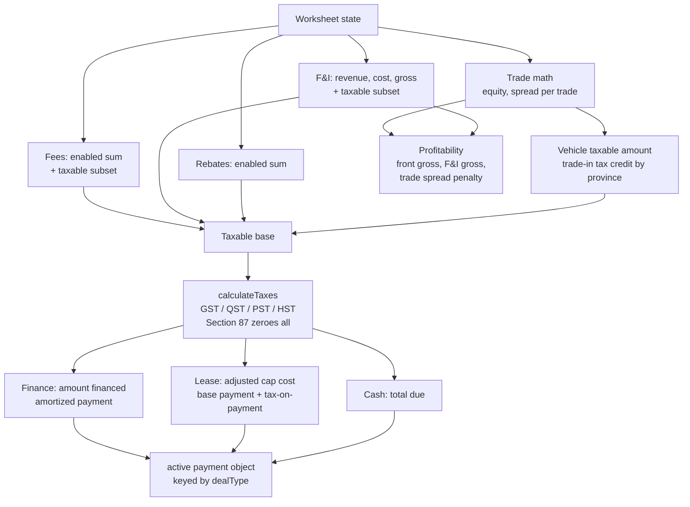
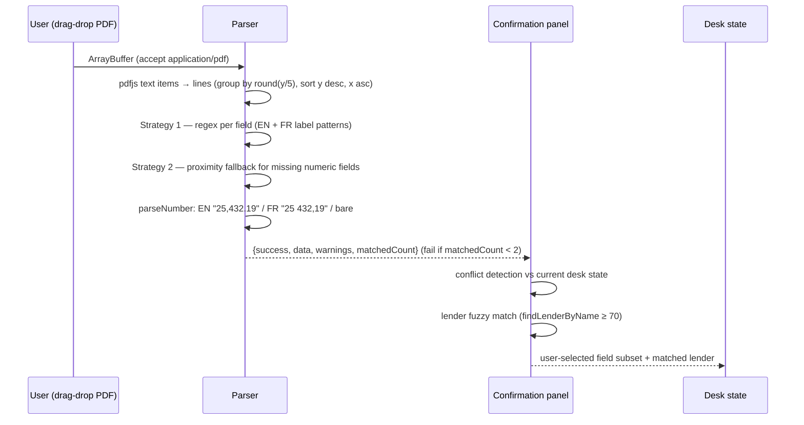

# Desking & Finance-Desk Math — Business Logic Specification

This document is the complete, portable specification of the finance-desk worksheet: vehicle pricing, trade-in and equity math, fees, Quebec/Canada sales-tax rules, rebates, F&I products, lender rate programs, finance/lease/cash payment calculations, scenario comparison, profit analysis, and the DealerTrack PDF import. It documents the rules **as implemented today** (primary source: `client/src/utils/deskingCalculations.js`, `canadianTaxRates.js`, `dealertrackPdfParser.js`, and `discussions/finance-desk-spec.md`), flags every discrepancy between the two, and marks **Target** behavior for the ReadyLoans port into `packages/core` (ADR-001, ADR-009, ADR-026).

## Table of Contents

1. [Scope, Sources & Porting Rules](#1-scope-sources--porting-rules)
2. [Desking Worksheet State Model](#2-desking-worksheet-state-model)
3. [Trade-In Math: Equity, Negative Equity, Spread](#3-trade-in-math-equity-negative-equity-spread)
4. [Fees & F&I Product Line Items](#4-fees--fi-product-line-items)
5. [Rebates](#5-rebates)
6. [Canadian Sales Tax Engine (GST/QST/PST/HST)](#6-canadian-sales-tax-engine-gstqstpsthst)
7. [Finance Deals — Amount Financed & Amortization](#7-finance-deals--amount-financed--amortization)
8. [Lease Deals (Franchise Stores Only)](#8-lease-deals-franchise-stores-only)
9. [Cash Deals](#9-cash-deals)
10. [Profit Analysis & Commission Estimate](#10-profit-analysis--commission-estimate)
11. [Lender Programs: Buy Rate, Sell Rate, Reserve](#11-lender-programs-buy-rate-sell-rate-reserve)
12. [Scenario Comparison](#12-scenario-comparison)
13. [DealerTrack PDF Import](#13-dealertrack-pdf-import)
14. [Deal Types & Per-Store Configuration](#14-deal-types--per-store-configuration)
15. [API Surface (Legacy → Target)](#15-api-surface-legacy--target)
16. [Known Discrepancies & Target Resolutions](#16-known-discrepancies--target-resolutions)

---

## 1. Scope, Sources & Porting Rules

Two implementations of desk math exist in the legacy system and they **do not agree**:

| Implementation | Where | Status |
|---|---|---|
| Client desking engine `computeDeal(state)` | `client/src/utils/deskingCalculations.js` + `canadianTaxRates.js` | **Canonical.** Full 13-province tax model, trade-in tax credit, Section 87 exemption, lease tax-on-payment. This is the math ReadyLoans ports. |
| Module-spec calculator `deskCalculator.js` | `discussions/finance-desk-spec.md` (`calculatePayment`) | Simplified variant: flat per-store `tax_rate`, `net_trade = allowance − lien`, no trade-in tax credit, explicit `lender_fee` input. Superseded except where noted. |

**Porting rules (ADR-009, ADR-026):**

- All math moves to `packages/core` as pure TypeScript functions with Vitest coverage ≥90% (ADR-023). The client never computes money authoritatively; the server writes results back to the deal.
- **Target: money is INTEGER cents end-to-end.** The legacy client engine works in dollar floats while the database stores cents (`deals.sale_price`, `vehicle_cost`, `fi_reserve` are INTEGER cents; `VehiclePanel` converts with `list_price / 100`). This dollars↔cents seam is a documented defect class and is eliminated in the port.
- **Target: per-deal split tax columns** `gst_cents`, `qst_cents`, `pst_cents`, `hst_cents` written from the desking engine at save time — never recomputed from a blended rate (`stores.tax_rate DECIMAL(6,4) DEFAULT 0.14975` remains only as a display default).
- Rates stay decimal: APR as `DECIMAL(5,2)` percent, tax rates as fractional decimals.
- All enums below live once in `packages/schemas` (ADR-016).

---

## 2. Desking Worksheet State Model

`computeDeal(state)` is a pure function: `state` in, `computed` out. Every desking UI component receives both. Fields and defaults as implemented:

| Field | Default | Semantics |
|---|---|---|
| `salePrice` | 0 | Negotiated vehicle selling price (dollars in legacy; **Target: `sale_price_cents`**) |
| `msrp` | 0 | MSRP; lease residual base (falls back to `salePrice` when 0) |
| `vehicleCost` | 0 | Dealer cost; **manager-only** (masked input with eye toggle, `isManager` gate). **Manual input only today** — attaching a stock unit prefills only `sale_price` from `inventory.list_price / 100` (`VehiclePanel.jsx` line 43) and never sets vehicleCost. **Target:** auto-fill from the derived dealer cost `acquisition_cost + transport_cost + recon_cost` (all INTEGER cents, `supabase/migrations/20260406_inventory.sql` lines 31–33; see §10), manager-overridable |
| `trades` | `[]` | Trade-in array, **max 2 trades** (UI blocks "Add 2nd trade" at length 2) |
| `dealType` | `'finance'` | One of `DEAL_TYPES = ['finance', 'lease', 'cash']` |
| `cashDown` | 0 | Cash down payment; reused as "Deposit" in cash mode |
| `rebates` | `[]` | `{id, label, amount, enabled}` free-form lines |
| `interestRate` | 0 | Annual % APR; input clamped 0–30, step 0.01 |
| `term` | 60 | Finance term months; pills `FINANCE_TERMS = [24, 36, 48, 60, 72, 84, 96]` |
| `residualPercent` | 55 | Lease residual % of MSRP; input 0–99 step 0.5 |
| `moneyFactor` | 0.00125 | Lease money factor; input 0–1 step 0.00001 |
| `leaseTerm` | 48 | Lease term months; pills `LEASE_TERMS = [24, 36, 39, 48, 60]` |
| `kmPerYear` | — | Lease annual km allowance (e.g. 20,000), step 1000. **Captured but unused in math** — contract display only |
| `excessKmCharge` | — | $/km over allowance, step 0.01. **Captured but unused in math** |
| `fees` | `[]` | `{id, label, amount, enabled, taxable, custom}` |
| `fiProducts` | `[]` | `{id, label, category, price, cost, enabled, taxable, custom}` |
| `provinceCode` | `'QC'` | Any of the 13 provinces/territories; unknown codes fall back to QC |
| `nativeStatus` | `false` | Section 87 Indian Act tax-exemption flag |
| `selectedLender` | `null` | Lender object (see §11 and `lenders-billofsale.md`) |
| `vehicle` | `{}` | `{year, make, model, color, vin, stock, mileage, condition ('new'\|'used'), trim}` |
| `dealId` | `null` | Bound deal; gates Save & Return and buyer attachment |

Formatting helpers: `formatCurrency(n, locale='en-CA')` → Intl CAD 2 decimals (non-finite → 0); `formatPercent(n, digits=2)`. **Target:** locale follows the tenant (`fr-CA` renders `1 234,56 $`, ADR-019).

### Computation flow



---

## 3. Trade-In Math: Equity, Negative Equity, Spread

Per trade (up to 2), fields: `year, make, model, mileage (km), vin, acv, allowance, lien, lienholder`.

```
equity = allowance − lien          // net trade equity; NEGATIVE when lien exceeds allowance
spread = allowance − acv           // positive = over-allowed (dealer allowed more than actual cash value)
```

Totals across trades: `totalTradeAllowance`, `totalTradeEquity`, `totalTradeSpread`.

Three distinct trade numbers feed three different places — this is the core subtlety of Canadian desking:

| Number | Used in | Effect |
|---|---|---|
| `allowance` (full) | **Tax credit** (§6) | Reduces the vehicle's taxable amount in trade-credit provinces — the lien does NOT affect tax |
| `equity` (allowance − lien) | **Financing credit** (§7) | Reduces amount financed; **negative equity increases it** (lien payoff is rolled into the loan) |
| `spread` (allowance − acv) | **Profit** (§10) | Over-allowance (positive spread) is deducted from total gross |

UI signals: equity badge green when `>= 0`, red when negative; spread badge "Under ACV" (green) when `spread <= 0`, "Over ACV" (red) otherwise, displayed as `abs(spread)`.

**Negative-equity example:** allowance $6,000, lien $8,000, ACV $5,000 → equity −$2,000 (adds $2,000 to amount financed), tax credit still $6,000, spread +$1,000 (cuts gross by $1,000).

The Bill of Sale uses a fourth derived value, `tradeNetEquity = Σallowance − Σlien` (see `lenders-billofsale.md` §3).

---

## 4. Fees & F&I Product Line Items

### 4.1 Summing rules (exact semantics)

- `sumEnabled(entries)`: entries may be a flat number or `{amount, enabled}`; skipped when `enabled === false`; amounts coerced `Number(x) || 0`. (Used for rebates.)
- Fees: only `enabled !== false`. `feesTotal = Σ amount`; `taxableFees = Σ amount where f.taxable === true` — **fees default NON-taxable** unless explicitly flagged.
- F&I products: only `enabled !== false`. `fiRevenue = Σ price`; `fiCost = Σ cost`; `fiGross = fiRevenue − fiCost`; `taxableFi = Σ price where p.taxable !== false` — **products default TAXABLE** (opposite default from fees; preserve exactly in the port).

### 4.2 Known line-item IDs (wired into Bill of Sale)

| ID | Kind | Meaning |
|---|---|---|
| `rdprm` | Fee | Quebec RDPRM lien-registration fee; rendered as the PPSA/Registration fee on the Bill of Sale (Ontario equivalent) |
| `ext-warranty` | Product | Extended Warranty — pulled onto its own BoS pricing line |
| `life-ins` | Product | Life Insurance — BoS Financing Terms line |
| `disability-ins` | Product | Accident & Health (A&H/Disability) Insurance — BoS Financing Terms line |

### 4.3 F&I catalog by store type (finance-desk spec)

Catalog config: `fi_product_catalog (store_id NOT NULL, product_type, product_name, default_provider, available, taxable DEFAULT true, notes)` + `stores.available_fi_products TEXT[]`. F&I agents only see products their store offers.

| Product (`product_type`) | Used-car stores (Ready Group) | Kia / future franchise |
|---|---|---|
| `extended_warranty` | yes | yes |
| `gap` | yes | yes |
| `tire_rim` | no | yes |
| `paint` | no | yes |
| `fabric` | no | yes |
| `theft` | no | yes |
| `maintenance` | no | yes |
| `loan_insurance` (life/disability) | no | yes |
| `rust` | no | yes |

Per-product-on-deal record `deal_fi_products`: `product_type`, `provider` (underwriter), `cost NOT NULL DEFAULT 0` (dealer cost), `sell_price NOT NULL DEFAULT 0`, `profit GENERATED ALWAYS AS (sell_price − cost) STORED`, `term TEXT` (e.g. `"5 years / 100,000 km"`), `deductible`, `taxable DEFAULT true`, `notes`. Any add/update/delete recalculates `deal.fi_products_total`.

The PDF parser recognizes a wider product vocabulary than the three wired IDs (GAP, replacement warranty, critical illness, appearance protection, tire & rim, anti-theft — §13); **Target:** the catalog enum in `packages/schemas` is the superset of both lists.

---

## 5. Rebates

Free-form lines `{id, label, amount, enabled}`; `rebatesTotal = sumEnabled(rebates)`. As-built (legacy client engine), rebates do double duty:

1. **Reduce the taxable base** (rebate-before-tax treatment, §6.3) — **this is one of the five audited money bugs** (gap-analysis F6): in Canada a manufacturer rebate is consideration paid on the customer's behalf and must be taxed **post-tax**. A $2,000 rebate undercharges ~$299.50 of tax at the QC combined 14.975% rate, on a legal document.
2. **Reduce the amount financed / cash subtotal** as a down-payment-like credit (§7, §9) — correct, retained.

**Target (D-12, FR-FIN-002, NFR-CMP-010):** manufacturer rebates are applied **after** tax — `rebatesTotal` is removed from `taxableBase` (§6.3) and survives only as a post-tax down-payment credit inside `totalDownFinance` / `amountFinanced` (§7.1) and `cashSubtotal` (§9). The corrected outputs are mandatory golden-number tests in `packages/core` before Phase 0 exit (ROADMAP Phase 0.6).

There is no manufacturer-program catalog (gap: OEM incentive integration unbuilt). The PDF importer maps a parsed `rebate` amount into a rebate line. **Target:** keep free-form lines; add an optional `program_code` for OEM rebates when integrated.

---

## 6. Canadian Sales Tax Engine (GST/QST/PST/HST)

Source: `canadianTaxRates.js`. Rates effective 2025–2026. `PROVINCES[code] = {name, nameFr, taxType, gst, pst, hst, pstOnGst, tradeInTaxCredit}`.

### 6.1 Province table

| Code | Tax type | GST | PST/QST | HST | Trade-in tax credit |
|---|---|---|---|---|---|
| AB | GST | 5% | — | — | yes |
| BC | GST+PST | 5% | 7% | — | **no** |
| MB | GST+PST | 5% | 7% | — | **no** |
| NB | HST | — | — | 15% | yes |
| NL | HST | — | — | 15% | yes |
| NS | HST | — | — | **14%** | yes |
| NT | GST | 5% | — | — | yes |
| NU | GST | 5% | — | — | yes |
| ON | HST | — | — | 13% | yes |
| PE | HST | — | — | 15% | yes |
| **QC** | **GST+QST** | **5%** | **9.975%** | — | **yes** |
| SK | GST+PST | 5% | 6% | — | yes |
| YT | GST | 5% | — | — | yes |

- `pstOnGst: false` for every province — QST-on-GST compounding was abolished 2013-01-01. Quebec combined effective rate = 5% + 9.975% = **14.975%** (matches `stores.tax_rate DEFAULT 0.14975`).
- Unknown province codes fall back to QC everywhere.
- Bilingual labels (`nameFr`) drive the FR province selector (Bill 96, ADR-019).

### 6.2 Trade-in tax credit

```
taxableAmountForVehicle(salePrice, tradeAllowance, provinceCode) =
    province.tradeInTaxCredit ? max(0, salePrice − tradeAllowance) : salePrice
```

The credit uses the **full trade allowance, not equity** — a lien never changes the tax. BC and MB get no credit. (The module-spec calculator omits this credit entirely — see §16, D-1.)

### 6.3 Taxable base

```
Legacy (as-built): taxableBase = max(0, vehicleTaxable + taxableFees + taxableFi − rebatesTotal)
Target (D-12):     taxableBase = max(0, vehicleTaxable + taxableFees + taxableFi)
```

The legacy engine subtracts rebates from the base (rebate-before-tax) — the audited F6 money bug (§5). **Target:** manufacturer rebates are taxed post-tax — `rebatesTotal` never touches the base and applies only as a down-payment credit after taxes are computed (§5, §7.1, §9; FR-FIN-002, NFR-CMP-010). Non-taxable fees (the default) and tax-exempt products are excluded in both formulations.

### 6.4 Tax computation

`calculateTaxes(taxableBase, provinceCode, nativeStatus)`:

- `nativeStatus === true` (Section 87 Indian Act) or `base <= 0` → all components 0; exempt result carries `exempt: true` and breakdown `[{label: 'Section 87 Exempt', rate: 0, amount: 0}]`. UI renders green `EXEMPT` tags in the worksheet, hero chip, and `(EXEMPT — Section 87)` on the Bill of Sale tax line. `deals.native_status BOOLEAN` persists the flag.
- Otherwise:

```
gst     = base × gst
pstBase = pstOnGst ? base + gst : base        // pstOnGst is false everywhere today
pst     = pstBase × pst                        // labeled QST (9.975%) for QC, PST (x.xxx%) elsewhere (3-decimal label)
hst     = base × hst                           // labeled HST (13.00%) etc.
total   = gst + pst + hst
```

- `combinedTaxRate(provinceCode)`: `hst` when present; else `gst + (1 + gst) × pst − 1` when `pstOnGst` (as coded); else `gst + pst`. Used only for lease tax-on-payment (§8).

**Target (ADR-009):** the engine's per-component amounts are persisted to `deals.gst_cents / qst_cents / pst_cents / hst_cents` (QST stored in its own column, not lumped with PST). The expense-side flat presets (`qc 14.975% / on 13% / atl 15% / bc 12% / sk 11% / mb 12% / gst 5%` in `ExpenseForm.jsx`) remain a separate input-tax convenience and must not leak into deal math.

---

## 7. Finance Deals — Amount Financed & Amortization

### 7.1 Formulas (canonical, as implemented)

```
totalDownFinance = cashDown + totalTradeEquity + rebatesTotal

amountFinanced = max(0, salePrice + taxes.total + feesTotal + fiRevenue
                        − cashDown − totalTradeEquity − rebatesTotal)

r = interestRate / 100 / 12                    // monthly decimal rate
monthlyPayment(P, rate, n):
    P <= 0 or n <= 0  → 0
    r === 0           → P / n                  // 0% financing = straight division
    else              → P × r × (1+r)^n / ((1+r)^n − 1)

biweekly = monthly × 12 / 26                   // simple annualized division
weekly   = monthly × 12 / 52                   // NOT accelerated schedules (see D-6)

financeTotalPaid  = monthly × term
costOfBorrowing   = max(0, financeTotalPaid − amountFinanced)
totalObligation   = financeTotalPaid + totalDownFinance    // active.totalCost — total consumer outlay
```

Notes:

- ALL enabled fees and F&I revenue are financed, taxable or not; taxes are financed in full.
- Negative trade equity flows through with its sign: `− (−2,000) = +2,000` rolled into the loan.
- The module-spec variant adds an explicit `lender_fee` input (`deals.lender_fee DEFAULT 0`); the client engine models lender fees as a fee line. **Target:** a dedicated, non-taxable `lender_fee_cents` line-item id so it can print separately and feed reserve math.

### 7.2 Worked example (QC, negative equity)

Inputs: sale price $25,000 · trade allowance $6,000, lien $8,000, ACV $5,000 · cash down $2,000 · rebate $500 · fees: admin $499 (taxable) + RDPRM $102 (non-taxable) · F&I: extended warranty $1,800 (cost $800) + GAP $950 (cost $300), both taxable · 7.99% APR × 72 months.

| Step | Value |
|---|---|
| Trade equity / spread | −$2,000 / +$1,000 (over-allowed) |
| Vehicle taxable (QC credit) | max(0, 25,000 − 6,000) = $19,000 |
| Taxable base | 19,000 + 499 + 2,750 − 500 = **$21,749** |
| GST 5% | $1,087.45 |
| QST 9.975% | $2,169.46 |
| Tax total | **$3,256.91** |
| Amount financed | 25,000 + 3,256.91 + 601 + 2,750 − 2,000 − (−2,000) − 500 = **$31,107.91** |
| Monthly @ 7.99% × 72 | **$545.27** (biweekly $251.66, weekly $125.83) |
| Total paid over term | $39,259.44 |
| Cost of borrowing | $8,151.53 |
| Total obligation | 39,259.44 + 500 (totalDownFinance) = $39,759.44 |

The table reproduces the **as-built** engine, including the pre-tax rebate defect. Target engine on the same inputs (post-tax rebate, D-12): taxable base 19,000 + 499 + 2,750 = **$22,249**; GST $1,112.45; QST $2,219.34; tax total **$3,331.79** (+$74.88 = $500 × 14.975%); amount financed **$31,182.79** — the $500 rebate still credits the amount financed but no longer reduces the tax base. Both variants are golden-number fixtures in `packages/core`.

### 7.3 Worksheet display order (DealStructureCard, finance tab)

Sale Price (editable) − Trade Equity − Cash Down − Rebates = Subtotal (`max(0, sp − equity − cashDown − rebates)`); indented per-tax breakdown lines (EXEMPT tag when native); + Fees Total; + F&I Products; **= Amount Financed**; rate/term controls; Monthly (highlighted) / Biweekly / Weekly; Cost of Borrowing; Total Obligation.

---

## 8. Lease Deals (Franchise Stores Only)

Lease is enabled per store — Kia/franchise stores only; used-car stores never see the lease tab (per-store config, §14).

```
capCost         = salePrice
capReductions   = cashDown + totalTradeEquity + rebatesTotal
adjustedCapCost = max(0, capCost − capReductions + feesTotal + fiRevenue)   // fees + F&I capitalized
residualDollar  = (msrp || salePrice) × residualPercent / 100               // residual on MSRP, salePrice fallback

leaseBase          = (adjustedCapCost − residualDollar) / leaseTerm          // depreciation
                   + (adjustedCapCost + residualDollar) × moneyFactor        // finance charge
leaseTaxOnPayment  = nativeStatus ? 0 : leaseBase × combinedTaxRate(province)
leaseMonthly       = leaseBase + leaseTaxOnPayment                           // tax on the PAYMENT STREAM, not upfront
equivalentApr      = moneyFactor × 2400                                      // display only
leaseTotalCost     = leaseMonthly × leaseTerm + cashDown
```

Worked example (QC): MSRP $32,000, sale $30,500, residual 55% → $17,600; down $2,000; fees $500; MF 0.00125; 48 mo. `adjustedCapCost` = 30,500 − 2,000 + 500 = $29,000. Depreciation = (29,000 − 17,600)/48 = $237.50; finance charge = 46,600 × 0.00125 = $58.25; base = $295.75; tax @14.975% = $44.29; **monthly $340.04**; equivalent APR 3.00%; total lease cost $18,321.92.

`kmPerYear` and `excessKmCharge` are captured for the contract but do not enter payment math. The module-spec lease formula (taxes upfront inside depreciation) is superseded by this tax-on-payment model — see §16 D-2. Lease terms have no dedicated DB columns yet (`msrp`, `residual`, `money_factor`, `km_allowance` — **Target:** add `lease_*` columns alongside the finance columns on deals).

---

## 9. Cash Deals

No amortization. `cashDown` is repurposed as a deposit:

```
cashSubtotal = max(0, salePrice − totalTradeEquity − rebatesTotal)   // deposit NOT in subtotal
cashTotalDue = cashSubtotal + taxes.total + feesTotal + fiRevenue
balanceOwing = max(0, cashTotalDue − cashDown)
```

Active summary for cash: monthly/biweekly/weekly/term/rate all 0; `financed = totalCost = cashTotalDue`. Cash deals also relax the pre-delivery checklist (no funding, void cheque, or IDV items — see `lenders-billofsale.md` §4).

---

## 10. Profit Analysis & Commission Estimate

Manager-gated (`isManager`) collapsible section in PaymentSummary; vehicle cost input is masked for non-managers.

```
frontGross = salePrice − vehicleCost                   // vehicleCost = manual manager input (see below)
fiGross    = fiRevenue − fiCost
totalGross = frontGross + fiGross − totalTradeSpread   // over-allowed trade cuts gross
grossPct   = salePrice > 0 ? totalGross / salePrice × 100 : 0
```

`vehicleCost` sourcing: as-built it is **never sourced from inventory** — no `total_invested` column exists anywhere in the schema; the inventory cost columns are `acquisition_cost`, `transport_cost`, `recon_cost` (INTEGER cents) plus `list_price` (`supabase/migrations/20260406_inventory.sql` lines 31–34), and the stock-attach flow (`VehiclePanel.jsx` line 43) maps only `list_price / 100` into `sale_price`. **Target:** when a stock unit is attached, auto-fill `vehicle_cost_cents = acquisition_cost + transport_cost + recon_cost` (the derived total-invested basis defined in `inventory.md` §7.4 — computed, never stored), keeping the manager-gated override.

The module-spec profit model adds lender reserve to back gross:

```
fiReserve = rateSpread × amountFinanced                // rate-markup profit, see §11
backGross = fiReserve + Σ(product sell_price − product cost)
totalGross(spec) = frontGross + backGross
```

**Target:** unified formula `total_gross = front_gross + fi_gross + fi_reserve − trade_spread`, all cents, persisted to `deals.front_gross / back_gross / total_gross` (columns already specced).

**Commission estimate** (canonical engine, from `salespeople`/`commissions` schema and the reports aggregation):

```
gross_for_commission = total_gross − pad_amount            // if has_pad (pad default $1,500)
rate                 = has_tiered_rate && gross > tier_threshold ? tier_rate : commission_rate
commission_amount    = gross_for_commission × rate
override_amount      = gross_for_commission × override_rate  // paid to override_on person
```

Caution: the finance-desk spec's illustration computes `30% × $7,004 = $2,101 − $1,500 pad = $601` (pad applied **after** the rate). The commission engine applies the pad **before** the rate: `(7,004 − 1,500) × 30% = $1,651.20`. The engine order is canonical (§16 D-4). Clawbacks reverse commissions via `deals.clawback_status ('none'|'flagged'|'reversed')` + append-only `clawback_log` (cents).

---

## 11. Lender Programs: Buy Rate, Sell Rate, Reserve

The rate program on every submission (full lender management in `lenders-billofsale.md`):

| Field | Meaning |
|---|---|
| `buy_rate` | Lender's base rate charged to the dealer |
| `sell_rate` | Rate presented to the customer (dealer may mark up) |
| `rate_spread` | `GENERATED ALWAYS AS (sell_rate − buy_rate) STORED`, NULL-guarded |
| `approval_amount` | Approved financing ceiling |
| `term`, `payment` | Approved term (months) and monthly payment |
| `expiry_date` | Approval expiry |

```
fi_reserve = rate_spread × amount_financed
```

(The spec's UI illustration shows Reserve $854 at 2.00% spread on ~$21,310 financed, which does not reconcile with the formula — $426 would; the **formula is canonical**, the illustration is not.)

Selecting a winning submission (`POST /api/submissions/:id/select`) deselects all others and writes `selected_lender`, `approval_amount`, `buy_rate`, `sell_rate`, `approval_term`, `monthly_payment` onto the deal; the desk pre-fills rate/term from the selected approval. Submission-count strategy by credit tier (business guidance, not enforced):

| Credit tier | Typical submissions | Strategy |
|---|---|---|
| Prime (700+) | 1–2 lenders | Best-rate shopping |
| Near-prime (600–699) | 2–4 | Rate + approval shopping |
| Subprime (500–599) | 3–5 | Approval shopping |
| Deep subprime (<500) | 5+ | Shotgun — any approval |

---

## 12. Scenario Comparison

Compare **up to 4 scenarios**: different lenders/rates, terms, with/without products, different down payments.

- Scenario record: `{id, name, recommended (bool), snapshot: {dealType, monthly, term, rate, totalDown, …}}`. As implemented, the snapshot stores **summary numbers only** and `onLoadScenario` reloads it into the desk — snapshot fidelity is a known risk (§16 D-7).
- Actions: Save Current, Load, Delete, star-toggle "recommended" (amber highlight). Display per scenario: name, dealType chip, monthly (cash shows `/—`), `{term}mo`, rate %, total down.
- The module spec's side-by-side matrix (rate / term / payment / total cost / cost of borrowing / spread / reserve, with best-payment / lowest-borrowing-cost / highest-reserve highlights) plus `POST /api/deals/:id/desk/compare` is the **Target** presentation; the implemented UI is a stacked list.
- Live recalculation is debounced; term pills 48/60/72/84 in the module spec, 24–96 in the client engine (superset wins — §16 D-5).

**Target:** scenarios persist server-side as full input-state snapshots (`deal_scenarios` table: `id, deal_id, tenant_id, store_id, name, recommended, input_state JSONB, computed_summary JSONB, created_by, created_at`) so a load reproduces the desk exactly.

---

## 13. DealerTrack PDF Import

Imports a DealerTrack Canada worksheet PDF to prefill the desk. Parser: `client/src/utils/dealertrackPdfParser.js` (pdfjs-dist). **Target:** parsing moves to a BullMQ worker (ADR-012) with the identical field contract; the SPA uploads and receives the parsed envelope.

### 13.1 Extraction pipeline



- **Strategy 1:** per-field regex lists against reconstructed text — bilingual labels (e.g. `Cash Price:`/`Prix comptant:`, `Lien Amount:`/`Solde de prêt:`, `Montant financé:`, `PPSA:`/`RDPRM:`, `PDSF:` for MSRP). VIN pattern excludes I/O/Q (`[A-HJ-NPR-Z0-9]{13,17}`).
- **Strategy 2:** proximity search for numeric fields still missing — same row: `|dy| < 6` and `−10 < dx < 400`; row below: `−30 < dy < 0`, `−200 < dx < 300`; nearest candidate wins (same-row preferred).
- Failure: `matchedCount < 2` → `success: false` with message about scanned/image-based PDFs.
- **Warnings** (surfaced amber, non-blocking): interest rate outside 0–30%; term outside 12–120 months; negative `sellingPrice/msrp/amountFinanced/tradeAllowance/tradePayoff`.

### 13.2 Parsed field groups and desk mapping

| Group (`PARSED_FIELD_GROUPS`) | Fields |
|---|---|
| parsedVehicle | year, make, model, vin, stockNumber, mileage, bodyStyle |
| parsedPricing | msrp, sellingPrice |
| parsedTrade | tradeAllowance, tradePayoff, tradeACV |
| parsedFinance | amountFinanced, interestRate, term, monthlyPayment, biWeeklyPayment, cashDown, rebate, costOfBorrowing, totalObligation |
| parsedFees | adminFee, licenseFee, ppsaFee, installationDeliveryFee, gstHstAmount, pst |
| parsedProducts | extendedWarranty, gapProtection, replacementWarranty, lifeInsurance, ahInsurance, criticalIllness, appearanceProtection, tireAndRim, antiTheft |
| parsedLender | lenderName, province |

Field→state mapping: vehicle fields → `state.vehicle`; `msrp`→`msrp`; `sellingPrice`→`salePrice`; `province` (full name, EN/FR via `PROVINCE_NAME_TO_CODE`) → `provinceCode`; `tradeAllowance`→`trades[0].allowance`; **`tradePayoff`→`trades[0].lien`**; `tradeACV`→`trades[0].acv`; `interestRate`/`term`/`cashDown` direct; `lenderName` → fuzzy-matched `selectedLender`.

### 13.3 Confirmation & conflict rules

- All parsed fields pre-checked; user can exclude any before import.
- `hasConflict`: case-insensitive string compare of parsed vs current value; current values of `null`/`''`/`0` never conflict (empty desk imports cleanly).
- Lender fuzzy match `findLenderByName`: normalize to lowercase alphanumerics; score 100 exact name, 80 substring either direction, 70 shortName exact/contained; **threshold ≥ 70**, else "will not auto-select".

---

## 14. Deal Types & Per-Store Configuration

| Deal type | Availability | Calculator |
|---|---|---|
| `finance` | All stores (default) | Standard amortization (§7) |
| `cash` | All stores | No amortization (§9) |
| `lease` | Kia/franchise stores ONLY (per-store config) | Money-factor lease (§8) |

Per-store desk configuration (tenant config in ReadyLoans, ADR-007):

| Store field | Purpose | Example |
|---|---|---|
| `stores.province` | Drives default tax province and safety/registration regime | `'QC'` |
| `stores.tax_rate DECIMAL(6,4)` | Blended display default (0.14975 QC, 0.13 ON) — never the tax source of truth in Target | 0.14975 |
| `stores.submission_platforms TEXT[]` | Filters the platform dropdown: used-car stores `['dealertrack','creditapp']`, Kia `['dealertrack','routeone']` | |
| `stores.available_fi_products TEXT[]` | F&I catalog visibility (§4.3) | |
| Lease availability | Franchise-only flag | |
| `deals.tax_rate` | Auto-set from store province at deal creation (legacy) | |

---

## 15. API Surface (Legacy → Target)

Legacy Express endpoints (module spec) and their Target Fastify/ts-rest home under `/api/v1` (ADR-003):

| Legacy | Target | Notes |
|---|---|---|
| `GET /api/deals/:id/desk` | `GET /api/v1/deals/:dealId/desk` | Full desk sheet: numbers, submissions, products, profit |
| `POST /api/deals/:id/desk/calculate` | `POST /api/v1/deals/:dealId/desk/calculate` | Pure call into `packages/core` `computeDeal`; cents in/out |
| `POST /api/deals/:id/desk/compare` | `POST /api/v1/deals/:dealId/desk/compare` | ≤4 scenarios, side-by-side matrix |
| `GET/POST /api/deals/:id/fi-products`, `PUT/DELETE /api/fi-products/:id` | `/api/v1/deals/:dealId/fi-products`… | Recalculates `fi_products_total` |
| `GET/PUT /api/stores/:id/fi-catalog` | `GET/PUT /api/v1/stores/:storeId/fi-catalog` | Store catalog admin |
| `GET /api/deals/:id/profit` | `GET /api/v1/deals/:dealId/profit` | Manager-role gated server-side (legacy gating was client-prop only) |
| (client-side parser) | `POST /api/v1/deals/:dealId/desk/import-pdf` | Async job; result pushed via Socket.IO tenant-room event (ADR-004) |

Every Target endpoint is authenticated, tenant-scoped (ADR-006/007), and Zod-validated (ADR-016). Desk saves emit `activity_events` and write the tax split columns (ADR-009).

---

## 16. Known Discrepancies & Target Resolutions

| # | Discrepancy (as found) | Target resolution |
|---|---|---|
| D-1 | Module-spec calculator: flat `store.tax_rate` on `vehicle_price + taxable F&I`, **no trade-in tax credit**, `net_trade = allowance − lien` used for both tax and financing; its ON example taxes the full $22,000 despite a trade | Client engine wins: trade-credit on **allowance** (except BC/MB), financing credit on **equity**, per-component GST/QST/PST/HST |
| D-2 | Module-spec lease formula taxes upfront inside depreciation; client engine taxes the payment stream | Tax-on-payment model wins (correct for QC/ON lease practice) |
| D-3 | Client engine has no `lender_fee` input; spec has `deals.lender_fee DEFAULT 0` | Dedicated non-taxable `lender_fee_cents` line-item id |
| D-4 | Finance-desk spec commission example applies pad after rate ($2,101 − $1,500); commission engine applies pad before rate | Engine order canonical: `(gross − pad) × rate` |
| D-5 | Term pills differ: spec 48/60/72/84; engine 24–96 finance, 24/36/39/48/60 lease | Engine superset canonical |
| D-6 | Biweekly/weekly = monthly × 12/26 and × 12/52 — not lender-accurate accelerated schedules | Keep as estimates, label "estimated"; add true accelerated schedules when a lender program requires them |
| D-7 | Scenario snapshots store summary numbers only; load fidelity depends on page code | Persist full input state server-side (§12) |
| D-8 | Dollars-float client math vs INTEGER-cents DB; `list_price / 100` conversion at the seam; no tax/fee/total columns on deals at all today | ADR-009: cents everywhere; engine outputs persisted incl. `gst_cents/qst_cents/pst_cents/hst_cents` |
| D-9 | Manager gating (`isManager` for vehicle cost/profit) is a client prop defaulting `true`; no server enforcement | Server-side role checks (fi_manager/gm/owner) + response field masking (ADR-006/007) |
| D-10 | `kmPerYear`/`excessKmCharge` captured but unused; lease fields have no DB columns | Add `lease_*` columns; print km terms on lease contract |
| D-11 | Rounding unspecified (floats accumulate) | Cents integers; round half-up at each persisted line; payment rounded to cent; property-based tests in `packages/core` |
| D-12 | **Rebates subtracted from the taxable base** (rebate-before-tax, §5/§6.3) — manufacturer rebates must be taxed post-tax in Canada; a $2,000 rebate undercharges ~$299.50 of tax on a legal document (gap-analysis F6, one of the five audited money bugs) | `rebatesTotal` removed from `taxableBase` (§6.3 Target formula); rebates remain only a post-tax down-payment credit (§5, §7.1, §9); corrected outputs required by the Phase 0 golden-number tests (FR-FIN-002, NFR-CMP-010, ROADMAP Phase 0.6) |

Related documents: `lenders-billofsale.md` (lender management, funding lifecycle, Bill of Sale line items, pre-delivery verification), `00-overview/ARCHITECTURE-DECISIONS.md` (ADR-001…026).
