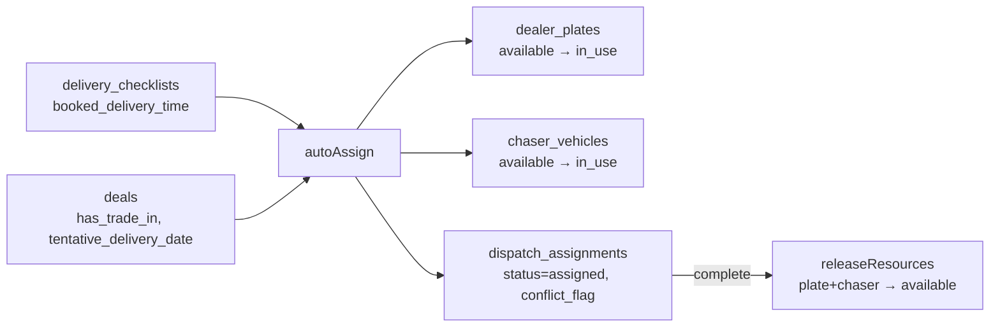
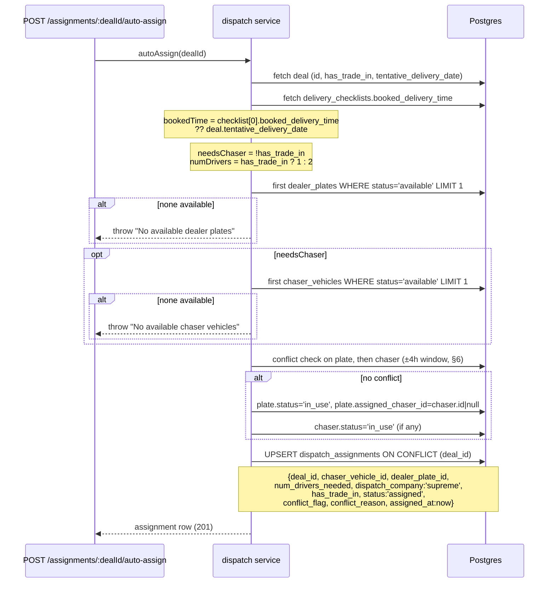
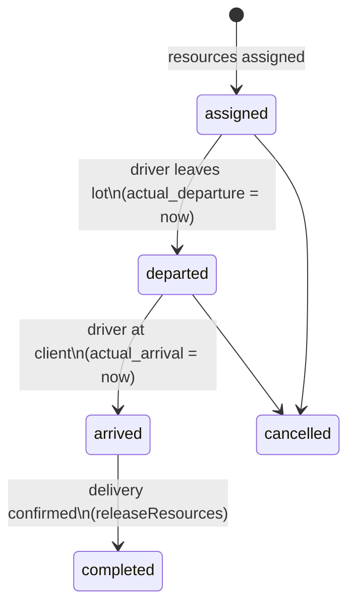

# Dispatch & Transport — Fleet Assignment, Conflict Detection, ETA Tracking

This document specifies the delivery-logistics domain: the fleet resource pools (chaser vehicles, dealer plates), the auto-assignment algorithm with its 4-hour conflict-detection window, the driver/ETA tracking model, and the driver-company upgrade path. The assignment algorithm is documented **exactly as implemented** in `server/services/dispatch.js` (the reference implementation to port into `packages/core`, ADR-026); schema facts come from `supabase/migration_v2.sql` and `supabase/migrations/20260406_dispatch_eta.sql`; the driver-company/auto-email upgrade is the spec'd design from the master spec §11.1. ReadyLoans changes are marked **Target** per the ADRs (`00-overview/ARCHITECTURE-DECISIONS.md`).

## Table of Contents

1. [Domain Overview](#1-domain-overview)
2. [Fleet Resources](#2-fleet-resources)
3. [The `dispatch_assignments` Table](#3-the-dispatch_assignments-table)
4. [Drivers-Needed & Chaser Rule](#4-drivers-needed--chaser-rule)
5. [Auto-Assignment Algorithm (as implemented)](#5-auto-assignment-algorithm-as-implemented)
6. [4-Hour Conflict Detection](#6-4-hour-conflict-detection)
7. [Resource Release / Completion](#7-resource-release--completion)
8. [ETA & Driver Tracking (M-005)](#8-eta--driver-tracking-m-005)
9. [Driver Companies & Auto-Email (spec'd upgrade)](#9-driver-companies--auto-email-specd-upgrade)
10. [Driver Dispatch Email (as implemented)](#10-driver-dispatch-email-as-implemented)
11. [API Surface](#11-api-surface)
12. [Legacy Gaps → Target Resolutions](#12-legacy-gaps--target-resolutions)

---

## 1. Domain Overview

When a deal reaches delivery, the store must send driver(s) to the client with: the delivery vehicle, a **dealer plate** (temporary plate for the unregistered unit), and — when there is no trade-in to drive back — a **chaser vehicle** (follow car that returns the drivers). Dispatch answers: how many drivers, which plate, which chaser, when, and whether those resources collide with another delivery in the same time window.



## 2. Fleet Resources

Two per-store resource pools (as built they are **global** — no store scoping; Target scopes both by `tenant_id` + `store_id`, ADR-007):

### `chaser_vehicles`
`id`, `name` NOT NULL (e.g. "White Kia Soul"), `status` CHECK `('available','in_use')` DEFAULT `'available'`, `store_id`, `deleted_at`, timestamps.

### `dealer_plates`
`id`, `plate_number` TEXT NOT NULL UNIQUE, `status` CHECK `('available','in_use')` DEFAULT `'available'`, `assigned_chaser_id` FK `chaser_vehicles` SET NULL (a plate can be paired to the chaser carrying it), `store_id`, `deleted_at`, timestamps.

CRUD (as built, unauthenticated — Target: `logistics`, `gm`, `owner` roles): `GET/POST /api/dispatch/chasers`, `PUT/DELETE /chasers/:id`, `GET/POST /plates`, `PUT/DELETE /plates/:id` (`PUT /plates/:id` accepts `plate_number`, `status`, `assigned_chaser_id`).

## 3. The `dispatch_assignments` Table

One assignment per deal — `UNIQUE(deal_id)`, FK deals CASCADE (upsert target).

| Group | Column | Type / Values |
|---|---|---|
| Core | `deal_id` UNIQUE NOT NULL; `chaser_vehicle_id` FK SET NULL; `dealer_plate_id` FK SET NULL | |
| Requirements | `num_drivers_needed` INT NOT NULL DEFAULT 1; `has_trade_in` BOOL | snapshot of the rule inputs (§4) |
| Vendor | `dispatch_company` CHECK `('supreme','denises_guys')` | the two booking vendors; also on `delivery_checklists.booking_company` |
| Lifecycle | `status` CHECK `('pending','assigned','in_transit','completed')` DEFAULT `'pending'` | resource lifecycle |
| Conflict | `conflict_flag` BOOL; `conflict_reason` TEXT | §6 |
| Times | `assigned_at`, `completed_at` | |
| Driver (M-005) | `driver_name`, `driver_phone`, `driver_vehicle` | who is physically driving |
| ETA (M-005) | `eta_departure`, `eta_arrival`, `actual_departure`, `actual_arrival` TIMESTAMPTZ | §8 |
| Trip status (M-005) | `dispatch_status` CHECK `('assigned','departed','arrived','completed','cancelled')` DEFAULT `'assigned'` | **second, parallel status field** — see gap table |
| Notify (M-005) | `customer_notified` BOOL DEFAULT false, `customer_notified_at` | §8.3 |
| Meta | `store_id`, `deleted_at`, timestamps (trigger) | |

**Target (ADR-009 — one status vocabulary per entity):** merge `status` and `dispatch_status` into a single lifecycle: `pending → assigned → departed → arrived → completed | cancelled`, where resource release fires on `completed`/`cancelled`. Migration maps legacy `in_transit` → `departed`.

## 4. Drivers-Needed & Chaser Rule

The core logistics business rule, implemented in `autoAssign` and reused by the dispatch email:

```
needsChaser = NOT has_trade_in
numDrivers  = has_trade_in ? 1 : 2
```

| Deal has trade-in? | Drivers | Chaser | Why |
|---|---|---|---|
| Yes | 1 | No | Driver delivers the sold car and **drives the trade-in back** |
| No | 2 | Yes | Driver 1 delivers the sold car; driver 2 follows in the chaser and brings driver 1 home |

The driver does **not** inspect or photograph the trade-in at the client's location — inspection happens at the lot after return (see `inventory.md` §4 trade-in auto-creation and the Delivery Tracker spec).

## 5. Auto-Assignment Algorithm (as implemented)

`autoAssign(dealId)` — `server/services/dispatch.js`, invoked by `POST /api/dispatch/assignments/:dealId/auto-assign`. Port verbatim to `packages/core` with tests before any behavior change (ADR-026).



Exact behaviors to preserve or consciously change:

1. **Booked-time resolution (exact as-built semantics):** if the deal has any `delivery_checklists` row, `bookedTime = checklists[0].booked_delivery_time` — even when that value is null; `deals.tentative_delivery_date` is the fallback **only when no checklist row exists at all**. A checklist row with a null booked time therefore yields `bookedTime = null`, and conflict detection is **skipped entirely**. (Target: coalesce `booked_delivery_time ?? tentative_delivery_date` regardless of row existence.)
2. **Resource selection is arbitrary** — first available row, no ordering, no round-robin, no distance/capacity logic.
3. **Hard failure on exhaustion:** no plates → throw `'No available dealer plates'`; chaser needed and none → throw `'No available chaser vehicles'`. No queuing/waitlist. (Target: return a typed 409 with a `resource_exhausted` code and enqueue a retry suggestion; still no silent queuing.)
4. `dispatch_company` is **hardcoded `'supreme'`** — Target: chosen from the store's driver-company roster (§9).
5. Upsert on `deal_id`: re-running auto-assign **replaces** the deal's assignment (idempotent per deal).
6. Conflicting assignments are still created with `status:'assigned'` but **do not consume resources** (§6) — plate/chaser stay `available` for human re-planning.

## 6. 4-Hour Conflict Detection

Window: `bookedTime ± 4 hours` (`windowMs = 4 * 60 * 60 * 1000`).

As implemented, for the selected plate (and then the chaser, only if the plate had no conflict — short-circuit):

```sql
SELECT id, deal_id FROM dispatch_assignments
WHERE dealer_plate_id = :selectedPlateId       -- or chaser_vehicle_id = :chaserId
  AND deal_id != :dealId
  AND status IN ('assigned')
  AND assigned_at BETWEEN :bookedTime - interval '4 hours'
                      AND :bookedTime + interval '4 hours';
```

On a hit:

- `conflict_flag = true`
- `conflict_reason = "Dealer plate {plate_number} is assigned to deal {deal_id} within 4-hour window"` or `"Chaser {name} is assigned to deal {deal_id} within 4-hour window"`

Rules:

- **Conflicts never block assignment.** The row is created flagged for human review; `GET /api/dispatch/conflicts` lists all `conflict_flag = true` assignments for the logistics dashboard.
- **When a conflict is flagged, resources are NOT marked `in_use`** — only conflict-free assignments consume the plate/chaser.

**Known approximation (documented defect, fix in Target):** the window compares against the other assignments' **`assigned_at`** (when the booking was made), not their **booked delivery times**. Two deliveries booked days apart but scheduled the same afternoon are not detected; two same-day bookings for different afternoons false-positive. **Target rule:** compare `bookedTime` of the candidate against the *resolved booked time* of each other active assignment (checklist `booked_delivery_time` ?? `tentative_delivery_date`), same ±4h window, evaluated in SQL with a lateral join — the 4-hour constant stays, configurable per store later (`stores.dispatch_conflict_window_hours` DEFAULT 4).

## 7. Resource Release / Completion

`releaseResources(assignmentId)` — invoked by `POST /api/dispatch/assignments/:id/complete`:

1. Fetch assignment (throw if missing).
2. Chaser (if any) → `status = 'available'`.
3. Plate (if any) → `status = 'available'`, `assigned_chaser_id = null`.
4. Assignment → `status = 'completed'`, `completed_at = now()`.

Not transactional today (four sequential writes) — **Target:** single transaction; releasing also fires the `dispatch.completed` event consumed by the Delivery Tracker (delivery confirmation flow) and notifications.

## 8. ETA & Driver Tracking (M-005)

### 8.1 What exists (as built)

Migration `20260406_dispatch_eta.sql` added the driver/ETA columns (§3) — but **no dedicated endpoints or workflow exist**. `routes/dispatch.js` exposes only the raw `PUT /api/dispatch/assignments/:id` (unvalidated body update), which is how ETA fields would be written today. `customer_notified` is a bare flag; **no notifier sends anything**. GPS tracking is explicitly out of scope (status-only tracking).

### 8.2 Trip status model



Timestamp rules (Target, enforced in the API):

| Transition | Auto-set |
|---|---|
| → `departed` | `actual_departure = now()` if absent |
| → `arrived` | `actual_arrival = now()` if absent |
| → `completed` | `completed_at = now()`; release resources (§7) |
| ETA edits | `eta_departure` / `eta_arrival` writable while status ∈ (`assigned`,`departed`); ETA is **driver-provided text/time**, not computed |

### 8.3 Customer notification (Target)

When `dispatch_status → 'departed'`, enqueue a BullMQ job (ADR-012) that sends the client an SMS via the store's Twilio number (ADR-020): tenant-branded, FR-first per client `preferred_language` (ADR-019), quiet-hours checked (CRTC 9:00–21:30 weekdays / 10:00–18:00 weekends, recipient-local) and consent-checked in the send layer. On success set `customer_notified = true`, `customer_notified_at = now()`. The flag becomes an outcome record, not a manual checkbox.

### 8.4 Spec'd status timeline (driver-company upgrade)

The §11.1 upgrade defines a human-readable status flow for driver companies without app access: `Booked → Confirmed → Picked Up → En Route → Delivered`, each update appended to a `status_updates JSONB` array of `{status, timestamp, note}` via `POST /api/dispatch/:id/status-update`, plus a free-text `eta` field the driver phones/texts in. **Target reconciles this with §8.2:** the five human statuses map onto the machine lifecycle (Booked/Confirmed → `assigned`, Picked Up/En Route → `departed`, Delivered → `arrived`), and `status_updates` is kept as the append-only annotation log.

## 9. Driver Companies & Auto-Email (spec'd upgrade)

Replaces the hardcoded `'supreme' | 'denises_guys'` enum with a managed roster (spec §11.1 — not yet built):

### `driver_companies`
`id`, `store_id` (**NULL = available to all stores** in the org), `name`, `email` NOT NULL (dispatch requests go here), `phone`, `contact_name`, `service_area`, `rate_info` (flat rate / per-km notes), `active`.

### New dispatch columns (spec'd)
`driver_company_id` FK, `dispatch_type` CHECK `('delivery','pickup','transfer')`, `pickup_address`, `delivery_address`, `has_trade_in`, `drivers_needed` (default 1 — same formula as §4), `email_sent` + `email_sent_at`, `wet_ink_file_ready` BOOL, `cash_to_collect` (cents in Target), `special_instructions`, `eta` TEXT (driver-provided), `status_updates` JSONB `[]`.

### Rules

- **Auto-email on booking** via Resend. Subject: `Driver Request — {{year}} {{make}} {{model}} — {{delivery_date}}`. Body: pickup address, delivery address, vehicle details (year/make/model/color/stock#), drivers needed (with the §4 explanation), trade-in details, cash to collect, wet-ink file status, delivery date/time, special instructions. UI shows sent/not-sent indicator + "Resend Email" button.
- **Booking gate:** a dispatch cannot be booked unless the deal's `wet_ink_file_status` is `'prepared'` or later (the driver must leave with a complete wet-ink file — see the Document Manager spec). API returns 400 with the blocking reason.
- `dispatch_type='pickup'` covers sourced-unit pickups (see `sourcing-suppliers.md` §2) and `'transfer'` covers store-to-store moves (see `inventory.md` §10.3).
- **Target:** the email renders through the tenant-branded React Email pipeline (ADR-018/020/021) in a BullMQ worker, FR/EN per recipient config — the current hardcoded English "Kia Mont-Laurier" template is a release blocker (ADR-018).

## 10. Driver Dispatch Email (as implemented)

`services/email.js → sendDriverDispatchEmail(deal)` (trigger: `POST /api/email/driver-dispatch/:dealId`). Current content — the reference for the Target template:

- Subject: `Driver Dispatch — {customer} — {vehicle} (Stock #...)`.
- Client: name, cosigner (if `has_cosigner`), `customer_address`, `customer_phone`.
- Vehicle: year/make/model, `stock_number`, `vin`, `pickup_location`, `chaser_vehicle_info`.
- Delivery: `delivery_address` (falls back to `customer_address`), `delivery_date`, salesperson.
- Driver instructions: **"Cash Down to Collect" = Yes iff `money_down_amount > 0 AND NOT money_down_collected`** (with the amount); cash back shown if `> 0`; **"Wet Ink to Sign" = Yes iff `wet_ink_signed === false`** (strict false — null renders No; Target treats null as "unknown → Yes").
- Trade-in "to Pick Up" section if `has_trade_in`, incl. `lien_bank` + `lien_amount` when `has_lien`.
- Recipients from env `DRIVER_DISPATCH_EMAIL` (comma-separated) — **Target:** recipients come from the assignment's `driver_companies.email` + store logistics contacts, per-tenant config, never env vars.

## 11. API Surface

| Legacy endpoint | Behavior | Target (`/api/v1`, roles: logistics/gm/owner unless noted) |
|---|---|---|
| `GET /api/dispatch/chasers` · `POST` · `PUT /:id` · `DELETE /:id` | chaser CRUD | keep, tenant-scoped |
| `GET /api/dispatch/plates` · `POST` · `PUT /:id` · `DELETE /:id` | plate CRUD | keep |
| `GET /api/dispatch/assignments` | all assignments + joined deal/chaser/plate | pagination + filters (status, date, store) |
| `POST /api/dispatch/assignments/:dealId/auto-assign` | §5 algorithm, 201 | keep; typed 409 on resource exhaustion |
| `PUT /api/dispatch/assignments/:id` | raw body update (ETA fields set here today) | replace with typed transitions: `POST /:id/depart`, `POST /:id/arrive`, `PUT /:id/eta`, `PUT /:id/driver` |
| `POST /api/dispatch/assignments/:id/complete` | releaseResources | keep; transactional |
| `GET /api/dispatch/conflicts` | `conflict_flag = true` rows | keep |
| Spec'd, unbuilt | `POST /api/dispatch/:id/status-update` (append to `status_updates`); driver-company CRUD; booking auto-email | build in Target (§8.4, §9) |

## 12. Legacy Gaps → Target Resolutions

| # | Gap (evidence) | Target resolution (ADR) |
|---|---|---|
| 1 | Plates/chasers are global pools — no store scoping | `tenant_id` + `store_id` NOT NULL + FORCED RLS (ADR-007) |
| 2 | Conflict window compares `assigned_at`, not booked delivery times | Compare resolved booked times (§6); keep ±4h constant |
| 3 | Hard throw when fleet exhausted; no re-assignment path | Typed 409 `resource_exhausted`; logistics notification |
| 4 | `dispatch_company` hardcoded `'supreme'` | Driver-company roster (§9) |
| 5 | Dual status fields (`status` vs `dispatch_status`) | Single lifecycle enum in `packages/schemas` (ADR-009) |
| 6 | ETA fields writable only via raw unvalidated PUT; no auto-timestamps | Typed transition endpoints with auto-timestamps (§8.2) |
| 7 | `customer_notified` flag with no sender | BullMQ SMS job, consent + quiet-hours gated (§8.3, ADR-012/020/022) |
| 8 | Conflicting assignments say `status='assigned'` but hold no resources | Explicit `needs_review` sub-state surfaced in UI; resources stay free |
| 9 | Dispatch email English-only, Kia-branded, env-var recipients | Tenant-branded bilingual React Email via workers (ADR-018/019/020/021) |
| 10 | No auth on any dispatch route | Better Auth + `logistics`/`gm`/`owner` roles (ADR-006) |
| 11 | `releaseResources` non-transactional | Single transaction + `dispatch.completed` event |
| 12 | No wet-ink booking gate (spec'd only) | Enforce `wet_ink_file_status >= 'prepared'` at booking (§9) |
