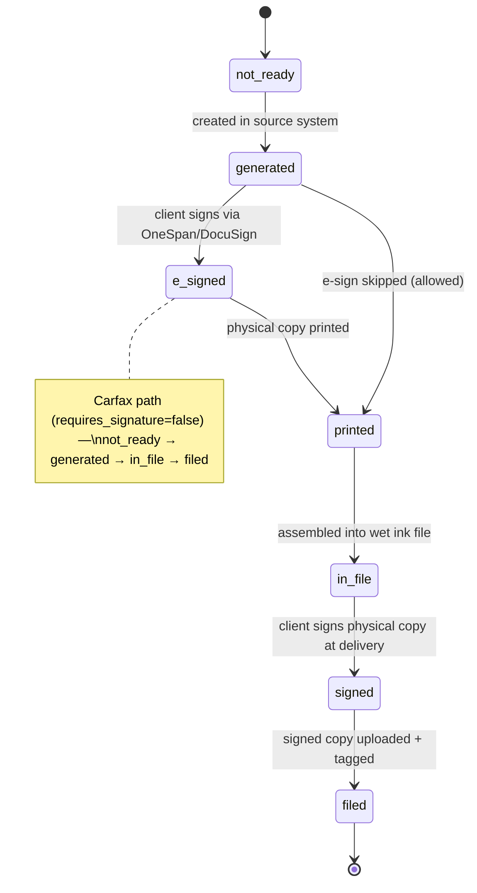

# Documents — Deal File & Document Manager

This document specifies the Document Manager: the per-deal document catalog (13 types) and the conditions that put each document into a deal file, auto-generation rules, the 7-status lifecycle from generation through e-sign, wet ink re-signing at delivery, and filing, upload/storage mechanics, email ingestion, search, and linkage to deals and other modules. Rules are documented as implemented in the Kia Mont-Laurier tracker (source code + `discussions/document-manager-spec.md`); ReadyLoans changes are marked **Target** with ADR references (`00-overview/ARCHITECTURE-DECISIONS.md`).

## Table of Contents

1. [Scope & Implementation Status](#1-scope--implementation-status)
2. [Document Catalog — The 13 Types](#2-document-catalog--the-13-types)
3. [Auto-Generation Rules](#3-auto-generation-rules)
4. [Document Lifecycle & Statuses](#4-document-lifecycle--statuses)
5. [E-Signature Tracking](#5-e-signature-tracking)
6. [Wet Ink File Workflow](#6-wet-ink-file-workflow)
7. [Upload, Storage & Retrieval](#7-upload-storage--retrieval)
8. [Email Ingestion & OCR](#8-email-ingestion--ocr)
9. [Stage-Gated Required Documents (as built)](#9-stage-gated-required-documents-as-built)
10. [Search](#10-search)
11. [Data Model](#11-data-model)
12. [API Surface](#12-api-surface)
13. [Linkage to Other Modules](#13-linkage-to-other-modules)
14. [Compliance Notes](#14-compliance-notes)
15. [Target-State Deltas (ReadyLoans)](#15-target-state-deltas-readyloans)

---

## 1. Scope & Implementation Status

Two generations of document tracking exist:

| Layer | What exists | Where |
|---|---|---|
| **As built (legacy code)** | A flat `documents` metadata registry (9 categories, polymorphic links to deal/contact/inventory), category-mapped uploads into the private `deal-files` Storage bucket, and a `required_documents` per-stage config table | `server/routes/documents.js`, `server/routes/upload.js`, migration `20260406_documents.sql` |
| **Specified (canonical business rules)** | The full Document Manager: `deal_documents` with the 13-type catalog, conditional auto-generation, 7-status lifecycle, e-sign tracking, wet ink workflow, bulk upload, search | `discussions/document-manager-spec.md`, master spec §8 |

Core operating pattern (both layers): **e-sign remotely first (OneSpan or DocuSign, per store), then ALL documents are re-signed wet ink at delivery.** There is **no e-sign API integration today** — envelope/package IDs are tracked for reference only and signed copies are uploaded manually.

---

## 2. Document Catalog — The 13 Types

| # | `document_type` | Document | Source system | Condition (when added to the deal file) | E-Sign | Wet ink |
|---|---|---|---|---|---|---|
| 1 | `bank_contract` | Bank contract | DealerTrack | All **financed** deals | Yes | Yes |
| 2 | `bill_of_sale` | Bill of sale | **CAMS** (Ready Group stores) / **Merlin** (Kia) | All deals | Yes | Yes |
| 3 | `warranty_agreement` | Extended warranty agreement | F&I product sale | Only if warranty sold | Yes | Yes |
| 4 | `gap_agreement` | GAP agreement | F&I product sale | Only if GAP sold | Yes | Yes |
| 5 | `aftermarket_agreement` | Aftermarket product agreement(s) | F&I product sale | One per additional F&I product sold | Yes | Yes |
| 6 | `privacy_consent` | Privacy/consent disclosure | Internal form | All deals | Yes | Yes |
| 7 | `omvic_disclosure` | OMVIC disclosure | Regulatory | **Ontario deals only** | Yes | Yes |
| 8 | `vehicle_condition` | Vehicle condition disclosure | Internal form | All deals | Yes | Yes |
| 9 | `trade_in_lien_authorization` | Trade-in lien payoff authorization | Internal form | Only if the trade-in has a lien | Yes | Yes |
| 10 | `odometer_statement` | Odometer statement | Internal form | All deals | Yes | Yes |
| 11 | `as_is_waiver` | As-is waiver | Internal form | Only if `sold_as_is = true` | Yes | Yes |
| 12 | `carfax_report` | Carfax report | Carfax | All **used**-vehicle deals | N/A (`requires_signature = false`) | Included in file, not signed |
| 13 | `lease_agreement` | Lease agreement | DealerTrack / lender | **Lease deals only** (Kia/franchise stores; used-car stores never lease) | Yes | Yes |

Source-system values: `dealertrack`, `cams`, `merlin`, `internal`, `carfax`. The bill-of-sale source is chosen per store from `stores.bill_of_sale_system` (`'CAMS'` default, `'Merlin'` for Kia, `'Other'` allowed).

Known spec gap: `lease_agreement` appears in the catalog and generation logic but is missing from the `document_type` enum comment in the spec SQL — the `packages/schemas` enum (single enum source, ADR-009/016) MUST include all 13 values.

---

## 3. Auto-Generation Rules

Trigger: when a deal reaches the **Signed** pipeline stage, the system auto-calls the generate endpoint **if no documents exist yet** for the deal (a manual "Generate Checklist" button exists too, shown only when the deal has zero documents).

Generation algorithm (exact):

```
base set (all deals):        bill_of_sale, privacy_consent, vehicle_condition, odometer_statement
+ financed deal:             bank_contract
+ licensing_province = ON:   omvic_disclosure
+ each deal_fi_products row: warranty_agreement | gap_agreement | aftermarket_agreement (one per product)
+ trade-in with lien:        trade_in_lien_authorization
+ sold_as_is = true:         as_is_waiver
+ used vehicle:              carfax_report          (requires_signature = false)
+ deal_type = 'lease':       lease_agreement        (Kia/franchise stores only)
```

- `source_system` set per document: `bill_of_sale` → `'cams'` (Ready Group) or `'merlin'` (Kia) from the deal's store; DealerTrack docs → `'dealertrack'`; internal forms → `'internal'`.
- **F&I product sync rule:** when F&I products are added to or removed from a deal, the corresponding agreement documents are added/removed automatically (removal only while the doc is still `not_ready`/`generated`).
- The as-is waiver is the compliance counterpart of the safety-inspection exemption: a `sold_as_is` deal skips the safety hard block (see `delivery.md` §2.2) **only** because this disclosure document exists in the file.

---

## 4. Document Lifecycle & Statuses



| Status | Meaning |
|---|---|
| `not_ready` | Not created yet |
| `generated` | Created in the source system (CAMS/Merlin/DealerTrack) or internally |
| `e_signed` | Client signed remotely via OneSpan/DocuSign (signature docs only) |
| `printed` | Physical copy printed for the wet ink file |
| `in_file` | Included in the wet ink file given to the driver |
| `signed` | Client signed the physical copy at delivery |
| `filed` | Signed doc uploaded to the system; the deal file entry is complete |

- Non-signed documents (Carfax) use the simplified flow: `not_ready → generated → in_file → filed`.
- The spec does not force `e_signed` before `printed` — e-sign is the preferred remote pre-signing step, not a gate. **Canonical rule: `printed` may follow `generated` directly**; `signed` at delivery is what matters legally (wet ink governs).
- Completion metric: `GET /api/deals/:id/documents/completion` → `{ total, completed, percentage, missing[] }` where completed = docs at `filed` (Carfax counts once filed).

---

## 5. E-Signature Tracking

- Per-store platform: `stores.esign_platform` ∈ `onespan` | `docusign`. F&I sends envelopes on that platform **outside the system** and records the reference here.
- Tracking fields on `deal_documents`: `esign_platform`, `esign_envelope_id`, `esign_sent_at`, `esign_signed_at`.
- Recording `esign_signed_at` fires the `document.signed` event (LOW → F&I agent, rule L3 — see `automation-notifications.md`).
- **No API integration** (manual today). **Target:** platform webhook consumers (envelope-completed events) via `apps/intake` + BullMQ, updating `esign_signed_at` automatically (ADR-005/012). E-sign remains per-tenant configuration.

---

## 6. Wet Ink File Workflow

The wet ink file is the physical folder of documents the driver carries to delivery for client re-signing. Prepared by **F&I or admin/office staff, depending on the store**.

```
print all wet-ink docs → assemble in sort_order → mark each "printed"
  → ALL requires_signature docs at printed-or-later ⇒ deal.wet_ink_status = 'prepared'
  → file handed to driver ⇒ wet_ink_status = 'with_driver'   (tracked in the pre-delivery checklist)
  → after delivery, each signed doc is uploaded ⇒ status 'filed'
```

Rules:

- **Cross-module derivation rule (exact):** when all documents with `requires_signature = true` are at status `printed` or later → the deal's `wet_ink_status` becomes `'prepared'` (this feeds checklist item #7, `delivery.md` §2.6).
- **Dispatch cannot be booked** unless `wet_ink_status` is `prepared` or later.
- The system renders a **printable checklist** per deal (`GET /api/deals/:id/documents/wet-ink-checklist`): the deal's document list in `sort_order` with "Prepared by ___ / Date ___" signature lines.
- Batch operations: `POST /api/deals/:id/documents/mark-printed` (all at once) and `POST /api/deals/:id/documents/mark-filed` (batch, with uploads). Bulk Upload UI: drag-and-drop multiple files, each mapped to a `document_type` via dropdown with matched/unmatched indicators, saved as a batch.
- After delivery, signed docs return with the driver; admin/F&I scans or photographs each one, uploads it (`signed_file_url`), and marks it `filed` (`filed_at`, `filed_by`).

---

## 7. Upload, Storage & Retrieval

### 7.1 As Built (legacy)

- Bucket: single private Supabase Storage bucket **`deal-files`** (`public = false`).
- Category-mapped uploads: `POST /api/upload/:dealId/:category` (multer memory storage, **10 MB limit**) with `CATEGORY_MAP`:

| Category | Table.column updated |
|---|---|
| `insurance` | `delivery_checklists.client_insurance_file_url` |
| `funding-proof` | `delivery_checklists.deal_funded_proof_url` |
| `bill-of-sale` | `sourced_units.bill_of_sale_file_url` |
| `payment-proof` | `sourced_units.proof_of_payment_url` |

- Storage path convention: `{dealId}/{category}/{Date.now()}_{originalFilename}`; retrieval via signed URL (`createSignedUrl`, 3600 s expiry).
- Defect: the upload response returns `getPublicUrl(...)` for a **private** bucket — the returned `url` is dead; only the signed-URL GET works. Do not carry this pattern forward.
- Metadata registry: `documents` table rows (`category`, `filename`, `storage_path`, `file_size` bytes, `mime_type`, `uploaded_by`, `notes`) with polymorphic optional links `deal_id` / `contact_id` / `inventory_id`; soft-deleted via `deleted_at`.

### 7.2 Target (ADR-013/015)

- Per-tenant path prefixes `tenant/{tenantId}/deals/{dealId}/documents/...`, Storage RLS on `storage.objects`, signed URLs only.
- Contracts/IDs/credit apps live in a **stricter bucket class** with tighter access and retention policies than vehicle photos; ID documents and void cheques fall under field-level PII handling (AES-256-GCM envelope encryption for extracted data, ADR-015).
- Generated documents (bill of sale, internal forms) are produced by the React→HTML→Chromium PDF pipeline in sandboxed workers and stored as **immutable snapshots with content hashes** — the generation payload is persisted at render time (ADR-021; fixes the audit finding that the BoS was never persisted).

---

## 8. Email Ingestion & OCR

- **Today:** the only email-ingested documents are delivery photos (see `delivery.md` §4 — Resend Inbound → `POST /api/delivery-photos/ingest`, stock number in the subject line, unmatched items to a review queue). All other signed documents are uploaded manually.
- **Future phase (explicitly deferred in the spec):** scanner/email auto-ingest of signed documents with OCR auto-detection of `document_type` and auto-matching to the deal.
- **Target:** one inbound-email pipeline (Resend Inbound, ADR-005) with per-tenant ingest addresses (`docs+{tenantSlug}@…`), sub-100ms ACK, BullMQ processing with deterministic job IDs (message-id), Haiku 4.5 structured extraction for document-type classification (`additionalProperties:false` JSON schema, ADR-022), and a human review queue for low-confidence matches — the same pattern as delivery-photo ingestion.

---

## 9. Stage-Gated Required Documents (as built)

The legacy system carries a config-driven per-stage requirement list, `required_documents` (`pipeline_stage`, `category`, `label`, `sort_order`; read-only via `GET /api/documents/required?pipeline_stage=`). Seeded gates:

| Pipeline stage | Required documents (category) |
|---|---|
| `signed` | Credit Application (`credit_app`), ID Verification (`id_verification`), Proof of Insurance (`insurance`) |
| `pending_delivery` | Bill of Sale (`bill_of_sale`), Financing Agreement (`financing`), Registration (`registration`) |
| `delivered` | Trade-In Documents (`trade_docs`) |

Legacy `documents.category` enum (9 values): `bill_of_sale`, `credit_app`, `insurance`, `registration`, `trade_docs`, `safety_cert`, `financing`, `id_verification`, `other`.

**Target:** the `required_documents` concept merges into the `deal_documents` generation rules (§3) — one vocabulary (`document_type`, 13 values in `packages/schemas`), tenant-scoped requirement overrides instead of a global table.

---

## 10. Search

`GET /api/documents/search` — instant retrieval of any filed document by:

- deal number
- client name
- stock number
- VIN
- document type

Results are grouped by deal (DocumentSearch.jsx admin page); click to view/download via signed URL. Any authorized user can retrieve documents from the deal record (DocumentSection tab: color-coded status badges, "X of Y filed" progress bar, View Original / View Signed / Upload Signed Copy per row).

---

## 11. Data Model

### 11.1 `deal_documents` (specified — canonical)

| Column | Type / values | Notes |
|---|---|---|
| `id` | UUID PK | |
| `deal_id` | UUID NOT NULL FK deals ON DELETE CASCADE | indexed |
| `store_id` | UUID NOT NULL FK stores | **Target: + `tenant_id`, RLS (ADR-007)** |
| `document_type` | enum, 13 values (§2) | single source in `packages/schemas` |
| `document_name` | TEXT NOT NULL | display name, e.g. "GAP Agreement — Safe-Guard" |
| `source_system` | `dealertrack` \| `cams` \| `merlin` \| `internal` \| `carfax` | |
| `status` | 7 statuses (§4), default `not_ready` | indexed |
| `requires_signature` | BOOLEAN DEFAULT true | false for Carfax/info-only docs |
| `esign_platform` / `esign_envelope_id` / `esign_sent_at` / `esign_signed_at` | e-sign tracking | reference only, no API |
| `printed_at` / `printed_by` | physical tracking | `printed_by` FK users |
| `signed_at_delivery` | TIMESTAMPTZ | wet ink signature timestamp |
| `unsigned_file_url` / `signed_file_url` | Storage paths | original vs uploaded signed copy |
| `filed_at` / `filed_by` | filing | `filed_by` FK users |
| `notes`, `sort_order` (default 0), timestamps | | `sort_order` = wet-ink checklist display order |

### 11.2 `documents` (as built — migrates into 11.1)

`id`, `deal_id`/`contact_id`/`inventory_id` (all SET NULL), `category` (9-value enum, §9), `filename` NOT NULL, `storage_path` NOT NULL, `file_size`, `mime_type`, `uploaded_by`, `store_id`, `notes`, `created_at`, `deleted_at`.

### 11.3 Store configuration

`stores.esign_platform` (`onespan`/`docusign`), `stores.bill_of_sale_system` (`CAMS`/`Merlin`/`Other`).

---

## 12. API Surface

```
GET/POST   /api/deals/:id/documents
PUT/DELETE /api/documents/:id
POST       /api/deals/:id/documents/generate          (auto checklist by deal type; no-op if docs exist)
GET        /api/deals/:id/documents/completion        → { total, completed, percentage, missing[] }
POST       /api/documents/:id/upload-unsigned
POST       /api/documents/:id/upload-signed
GET        /api/deals/:id/documents/wet-ink-checklist (printable)
POST       /api/deals/:id/documents/mark-printed      (batch)
POST       /api/deals/:id/documents/mark-filed        (batch, with uploads)
GET        /api/documents/search                      (deal #, client name, stock #, VIN, doc type)

# Legacy (as built, migrate then retire):
GET/POST   /api/documents            DELETE /api/documents/:id      (metadata registry, soft delete)
GET        /api/documents/required?pipeline_stage=
POST/GET/DELETE /api/upload/:dealId/:category
```

**Target:** re-created under `/api/v1` as ts-rest + Zod contracts behind Better Auth and tenant scoping (ADR-003/006/016).

---

## 13. Linkage to Other Modules

| Module | Rule |
|---|---|
| Deal Pipeline | Reaching **Signed** auto-generates the document checklist (§3) |
| Pre-Delivery Checklist | `wet_ink_status` derives from document completion: all `requires_signature` docs `printed`+ ⇒ `prepared` (`delivery.md` §2.6) |
| Delivery Tracker | Wet ink file handed to driver → `with_driver`; signed docs return and are filed post-delivery |
| F&I Products | `deal_fi_products` add/remove ⇒ agreement documents auto-added/removed |
| Stores (tenancy) | Bill-of-sale source system (CAMS vs Merlin) and e-sign platform are per-store config |
| Funding Tracker | Bank contract belongs to financed deals; stips uploads live on the funding record, not here |
| Notifications | `document.signed` → LOW alert to F&I (rule L3) |
| Sold as-is | `as_is_waiver` document is the required counterpart of the safety-inspection exemption |

---

## 14. Compliance Notes

- **Wet ink governs:** every signature document is physically re-signed at delivery regardless of prior e-sign — the filed wet-ink copy is the legal record.
- **OMVIC disclosure** is Ontario-only (Ontario regulator); **registration** documents apply to ON/QC deals only.
- **Bill 96 / i18n (Target, ADR-019/021):** every generated document renders FR-first for Quebec tenants from server-side i18n resources; contracts of adhesion present French first. Bilingual immutable snapshots with hashes.
- **Law 25 / PIPEDA (Target, ADR-013/015):** ID documents, void cheques, and credit applications are high-sensitivity; stored in the restricted bucket class, access-audited, retention-scheduled; extracted PII fields envelope-encrypted with blind HMAC indexes for lookup.
- **White-label (ADR-018):** generated documents consume the tenant branding record — any hardcoded "Kia Mont-Laurier" template is a release blocker.

---

## 15. Target-State Deltas (ReadyLoans)

| Area | Legacy/spec | Target (ADR) |
|---|---|---|
| Document generation | Source-system paper + manual uploads; BoS math client-side, never persisted | React→HTML→Chromium PDF in sandboxed BullMQ workers; immutable hashed snapshots (ADR-021) |
| Vocabulary | Two enums (`documents.category` 9 values, `deal_documents.document_type` 13 values) | One enum in `packages/schemas`, 13 values incl. `lease_agreement` (ADR-009/016) |
| Storage | Single `deal-files` bucket, bucket-wide policies, public-URL bug | Per-tenant prefixes, Storage RLS, signed URLs only, stricter document bucket class (ADR-013) |
| E-sign | Manual envelope-ID tracking | Per-tenant e-sign config + webhook status consumers (ADR-005) |
| Ingestion | Manual upload; photo email only | Resend Inbound per-tenant addresses + Haiku 4.5 type classification + review queue (ADR-005/022) |
| Tenancy | `store_id` only, `USING(true)` RLS | `tenant_id`+`store_id`, forced RLS (ADR-007) |
| Search | ILIKE across fields | Tenant-scoped indexed search; composite `(tenant_id, …)` indexes (ADR-008) |
| i18n / branding | EN-only, Kia-branded | FR-first bilingual templates, tenant branding record server-side (ADR-018/019) |
