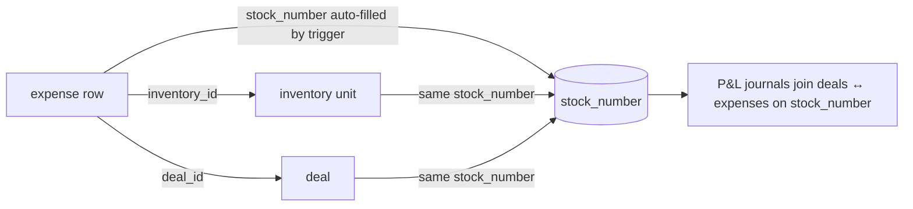
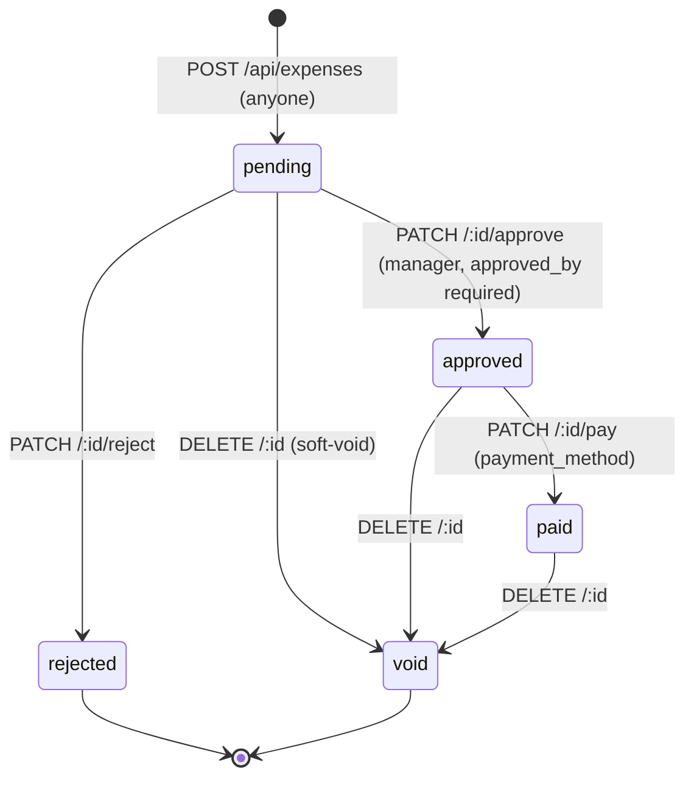

# Expenses & Accounting — Vehicle Expense Ledger, Source Costs, and the Accounting Roadmap

This document specifies the expenses/accounting module **as implemented** in `supabase/migrations/20260414_expenses.sql`, `server/routes/expenses.js`, `server/routes/suppliers.js`, `server/routes/sourceCosts.js`, and the client surfaces `client/src/pages/AccountingPage.jsx`, `client/src/pages/InventoryDetailPage.jsx`, and `client/src/components/expenses/*` — the audit called this data model "the best-designed in the project" and it is the only fully cents-native module. It also captures the marketing source-cost ledger and the full accounting roadmap (chart of accounts, journal plans, tax reports, Tier 2/3 modules) from `docs/ACCOUNTING-ROADMAP.md`. Built behavior is documented as-is; everything from the roadmap onward is marked **Target**.

## Table of Contents

1. [Locked Decisions](#1-locked-decisions)
2. [Data Model](#2-data-model)
3. [Chart of Accounts — the 17 Expense Categories](#3-chart-of-accounts--the-17-expense-categories)
4. [Expense Lifecycle & Approval Workflow](#4-expense-lifecycle--approval-workflow)
5. [Expenses API](#5-expenses-api)
6. [Supplier Registry](#6-supplier-registry)
7. [Receipts Storage](#7-receipts-storage)
8. [UI Surfaces](#8-ui-surfaces)
9. [Accounting Page — Journal Tabs (As Built)](#9-accounting-page--journal-tabs-as-built)
10. [Source Costs (Marketing Spend Ledger)](#10-source-costs-marketing-spend-ledger)
11. [Known Defects & Gaps](#11-known-defects--gaps)
12. [Accounting Roadmap — Session 3 Backlog (Target)](#12-accounting-roadmap--session-3-backlog-target)
13. [Accounting Roadmap — Tier 2 Reports (Target)](#13-accounting-roadmap--tier-2-reports-target)
14. [Accounting Roadmap — Tier 3 New Modules (Target)](#14-accounting-roadmap--tier-3-new-modules-target)
15. [Open Questions](#15-open-questions)
16. [Target Architecture Mapping (ADRs)](#16-target-architecture-mapping-adrs)

---

## 1. Locked Decisions

From `ACCOUNTING-ROADMAP.md`, explicitly marked "don't re-ask":

| # | Decision |
|---|---|
| 1 | Expenses attach to **both** inventory units and deals; they roll up to each other via `stock_number` |
| 2 | **Manager approval required** for status transitions; anyone authenticated may ADD an expense |
| 3 | Receipts upload directly to Supabase Storage bucket **`expense-receipts`** (bucket created manually; public vs signed-URL policy still open — §15) |
| 4 | Expense status model: **`pending → approved → paid`**, plus `rejected` and `void` |
| 5 | **DELETE soft-voids** (sets `status='void'`, preserves audit trail) — never hard-deletes |
| 6 | Export format: **CSV now**; server-side PDF + Excel planned via `server/services/reportGenerator.js` |
| 7 | **No QuickBooks/Sage export yet** (deferred; IIF/CSV would be Tier 2) |
| 8 | No new libraries; Tailwind + existing stack only |

---

## 2. Data Model

All from `20260414_expenses.sql`. Money is **INTEGER cents natively** (the module was born after F-007 and follows ADR-009 already).

### `expenses`

| Column | Type / Rule |
|---|---|
| `id` | UUID PK |
| `store_id` | UUID FK stores (nullable) |
| `inventory_id` | UUID FK inventory ON DELETE SET NULL |
| `deal_id` | UUID FK deals ON DELETE SET NULL |
| `stock_number` | TEXT denormalized — auto-filled by trigger from linked inventory |
| — | CONSTRAINT `expense_must_link CHECK (inventory_id IS NOT NULL OR deal_id IS NOT NULL OR stock_number IS NOT NULL)` — an expense must attach to something |
| `category_code` | TEXT NOT NULL FK `expense_categories(code)` |
| `supplier_id` | UUID FK suppliers ON DELETE SET NULL |
| `supplier_name` | TEXT free-text fallback when no registered supplier |
| `amount_cents` | INTEGER NOT NULL CHECK ≥ 0 |
| `tax_cents` | INTEGER NOT NULL DEFAULT 0 CHECK ≥ 0 — tax tracked separately per expense (input-tax-credit ready), but **no GST vs QST split** (Target, §12) |
| `total_cents` | INTEGER **GENERATED ALWAYS AS (amount_cents + tax_cents) STORED** |
| `invoice_number` | TEXT |
| `expense_date` | DATE NOT NULL DEFAULT CURRENT_DATE |
| `description`, `notes` | TEXT |
| `receipt_url` | TEXT (Supabase Storage URL) |
| `status` | TEXT DEFAULT `'pending'` CHECK (`'pending'`,`'approved'`,`'paid'`,`'rejected'`,`'void'`) |
| `approved_by` | UUID FK users SET NULL; `approved_at` TIMESTAMPTZ |
| `paid_at` | TIMESTAMPTZ |
| `payment_method` | TEXT (`'cash'`,`'cheque'`,`'etransfer'`,`'credit'`,`'ap'`) |
| `created_by` | UUID FK users; `created_at`, `updated_at` |

Partial indexes on `inventory_id`, `deal_id`, `stock_number` (WHERE NOT NULL); plus `supplier_id`, `category_code`, `expense_date DESC`, `status`.

Trigger `trg_expenses_fill_stock` (fn `expenses_fill_stock`, BEFORE INSERT/UPDATE): copies `stock_number` from the linked inventory row when missing, and sets `updated_at` (this table is not on the shared `update_updated_at()` trigger).

**No RLS is enabled on `expenses`, `suppliers`, or `expense_categories`** — with the anon key in the browser these tables are fully open (audit critical finding; Target: forced RLS per ADR-007).

### `vehicle_expense_summary` (view — the only DB view in the system)

Per inventory unit (LEFT JOIN inventory → expenses, GROUP BY `i.id`):

| Field | Definition |
|---|---|
| `expense_count` | count of expense rows |
| `total_cents` | `SUM(total_cents)` where `status IN ('approved','paid')` — **pending/rejected/void excluded from vehicle cost** |
| `pending_cents` | `SUM` where `status = 'pending'` |
| `paid_cents` | `SUM` where `status = 'paid'` |

### Rollup rule

`stock_number` is the practical join key between the deal ledger and the vehicle expense ledger — which is why the trigger guarantees it is populated.

---

## 3. Chart of Accounts — the 17 Expense Categories

`expense_categories` is the system's **proto chart of accounts**: `code` (TEXT UNIQUE), `label`, `description`, **`is_cogs BOOLEAN NOT NULL DEFAULT TRUE`** (cost-of-goods-sold vs operating expense classification), `display_order` (default 100), `is_active`. Seeded values:

| Code | Label | COGS | Order |
|---|---|---|---|
| `purchase` | Purchase | yes | 10 |
| `transport` | Transport | yes | 20 |
| `safety_pdi` | Safety / PDI | yes | 30 |
| `recon_mech` | Recon — Mechanical | yes | 40 |
| `recon_body` | Recon — Body | yes | 50 |
| `detail` | Detailing | yes | 60 |
| `parts` | Parts | yes | 70 |
| `sublet` | Sublet | yes | 80 |
| `keys` | Keys | yes | 90 |
| `advertising` | Advertising | **no** | 100 |
| `pack` | Pack / Dealer Fee | yes | 110 |
| `floorplan` | Floorplan Interest | yes | 120 |
| `commission_sales` | Sales Commission | **no** | 130 |
| `commission_fi` | F&I Commission | **no** | 140 |
| `warranty_cost` | Warranty Cost | yes | 150 |
| `admin` | Admin | **no** | 160 |
| `other` | Other | **no** | 900 |

The `is_cogs` flag is the intended dividing line for a future P&L statement (COGS reduces vehicle gross; non-COGS is overhead). **Target:** ReadyLoans promotes this into a real per-tenant chart of accounts in `packages/schemas` (single enum source, ADR-009/ADR-016), with tenant-extensible custom categories layered over the global seed (the `store_id IS NULL` = global + store-specific override pattern already used by scoring rules).

---

## 4. Expense Lifecycle & Approval Workflow

Rules as implemented:

- `POST /api/expenses` requires `category_code`, `amount_cents ≥ 0`, and at least one of `inventory_id | deal_id | stock_number` (400 otherwise). Defaults: `status='pending'`, `expense_date=today`, `tax_cents=0`. Amounts pass through `Math.round(Number(x))`.
- **Approve** (`PATCH /api/expenses/:id/approve`): requires `approved_by` (manager user id) in the body — 400 without it. Sets `status='approved'`, `approved_by`, `approved_at=now()`. This is the only "manager gate" in code today: the caller self-declares the manager id; there is no `requireRole` middleware on the route (enforcement gap — Target: real RBAC per ADR-006, `fi_manager`/`gm`/`owner`/`admin_office` approve).
- **Reject** (`PATCH /:id/reject`): `status='rejected'`, `approved_by` optional, `approved_at=now()`.
- **Pay** (`PATCH /:id/pay`): `status='paid'`, `paid_at=now()`, optional `payment_method`.
- **Delete** (`DELETE /:id`): **soft-void** — sets `status='void'`; the row survives for audit. Returns `{success: true, expense}`.
- `PUT /:id` general update strips `id`, `created_at`, `created_by`, and `total_cents` (generated column) from the patch and stamps `updated_at`.
- Only `approved` + `paid` expenses count toward vehicle cost (view definition + every P&L tab filters the same way). `pending` is visible but excluded; `rejected`/`void` never count.

---

## 5. Expenses API

All under `/api/expenses` (Express, no auth middleware today):

| Endpoint | Behavior |
|---|---|
| `GET /api/expenses` | Filters: `inventory_id`, `deal_id`, `stock_number`, `status`, `category_code`, `supplier_id`, `from`/`to` (on `expense_date`), `limit` (default **500**). Joins `supplier:suppliers(id,name)` and `category:expense_categories(code,label,is_cogs)`. Ordered `expense_date DESC`. |
| `GET /api/expenses/categories` | Active categories ordered by `display_order` |
| `GET /api/expenses/summary/inventory/:id` | Row from `vehicle_expense_summary`; zero-shape default `{inventory_id, expense_count:0, total_cents:0, pending_cents:0, paid_cents:0}` when absent |
| `POST /api/expenses` | Create (see §4). 201 |
| `PUT /api/expenses/:id` | Whitelist-negative update (strips id/created_at/created_by/total_cents) |
| `PATCH /api/expenses/:id/approve` | → approved (requires `approved_by`) |
| `PATCH /api/expenses/:id/reject` | → rejected |
| `PATCH /api/expenses/:id/pay` | → paid (+`payment_method`) |
| `DELETE /api/expenses/:id` | → void (soft) |

---

## 6. Supplier Registry

Table `suppliers` (no RLS, no `store_id` — multi-tenant gap): `name NOT NULL`, `category` (`'mechanical'|'detail'|'transport'|'parts'|'advertising'`), `contact_name`, `phone`, `email`, `address`, `tax_number` (GST/HST/BN), `payment_terms` (`'net30'`, `'cod'`, …), `notes`, `is_active` (default true), `created_by`, timestamps. Partial index on `is_active`; index on `LOWER(name)`.

`server/routes/suppliers.js` enforces a **field whitelist** on create/update (empty strings coerced to null): `name, category, contact_name, phone, email, address, tax_number, payment_terms, notes, is_active, city, postal_code, province, country, fax, dealer_number, rin_number, pst_number, driver_license, driver_license_expiry, default_expense_type, default_account, posted, tax_exempt, memo`.

The accounting-flavored columns — `default_expense_type`, **`default_account`**, `posted`, `tax_exempt`, plus `rin_number` (Ontario Registrant Identification Number) and `pst_number` — exist to support bookkeeping export (vendor → default GL account mapping). They are stored but not yet consumed by any journal (Target: QuickBooks/Sage export, §13).

| Endpoint | Behavior |
|---|---|
| `GET /api/suppliers?active=true&q=` | Ordered by name; `active==='true'` filters `is_active`; `q` → `name ilike %q%` |
| `GET /api/suppliers/:id` | Single |
| `POST /api/suppliers` | Requires non-blank trimmed `name`; `is_active` defaults true. 201 |
| `PUT /api/suppliers/:id` | Whitelisted update + `updated_at=now()` |
| `DELETE /api/suppliers/:id` | Soft: `is_active=false` |

Client: `SuppliersPage.jsx` (list + `SupplierDetailDrawer.jsx` + `ImportSuppliersModal.jsx` bulk import), and `SupplierSelector.jsx` (searchable dropdown with inline "Add supplier") inside the expense form.

---

## 7. Receipts Storage

- Bucket: **`expense-receipts`** (separate from `deal-files`). Upload happens **directly from the browser** in `ExpenseForm.jsx` via `supabase.storage.from('expense-receipts').upload(...)`, then the public URL is auto-filled into `expenses.receipt_url`. Spinner + error handling in the form.
- Policy decision (public-read vs RLS/signed URLs) is **still open** (§15). Today the URL stored is public.
- **Target (ADR-013):** private bucket, per-tenant path prefixes `tenant/{id}/receipts/...`, storage RLS, signed URLs only; uploads proxied through the API/worker with MIME validation.

---

## 8. UI Surfaces

| Component | Role |
|---|---|
| `ExpensesPanel.jsx` | Reusable ledger panel — accepts `inventoryId` / `dealId` / `stockNumber`; embedded in `DealDetail.jsx` (Section 3D, with `isManager={true}` **hardcoded** — no real role check) and in `InventoryDetailPage.jsx`. Lists expenses, status chips, approve/reject/pay actions, add button |
| `ExpenseForm.jsx` | Modal: category select, `SupplierSelector`, amount + tax (entered dollars, stored cents), invoice number, date, notes, receipt upload |
| `MultipleExpensesModal.jsx` | Batch entry of several expense lines at once |
| `InventoryDetailPage.jsx` (`/inventory/:id`) | Hero card + **cost summary strip: Purchase / Transport / Recon / Added Expenses / Total** + embedded ExpensesPanel |
| `AccountingPage.jsx` (`/accounting`) | Journal/report tab shell (§9), sidebar nav entry |

---

## 9. Accounting Page — Journal Tabs (As Built)

`/accounting` has 8 tabs. All tabs fetch raw lists (`/api/expenses`, `/api/deals`, `/api/inventory`) and aggregate **client-side**; money helper `money(cents)` renders `Intl.NumberFormat('en-CA', CAD).format(n/100)`.

### 9.1 Reconciliation

- Date range (defaults: first of current month → today), status filter (`All (except void)` / pending / approved / paid / rejected), group-by `category | supplier | stock | none`. Fetches `/api/expenses?from&to&limit=2000`; `void` rows always skipped.
- Grouped cards with per-group totals (`Σ total_cents`) and entry counts; grand-total banner.
- CSV export columns: `Date, Stock #, Category, Supplier, Invoice #, Description, Amount, Tax, Total, Status` (commas in text replaced with `;`); filename `reconciliation_{from}_to_{to}.csv`.

### 9.2 P&L by Vehicle

Per-deal rows (first 200 deals): `Net P&L = sale_price − vehicle_cost − Σ approved/paid expenses for the deal's stock_number`. Each row runs its own expenses query (`PLRow` — N+1, defect). Deal money is read as **dollars and multiplied ×100** (`Math.round(Number(sale_price)*100)`) to compare against expense cents — correct only for dollars-era rows (§11). Green when P&L ≥ 0, red otherwise.

### 9.3 Vendor Spend

Date range (defaults Jan 1 → today), fetch limit 5000; excludes `void` **and `rejected`**. Grouped by supplier name (`supplier.name || supplier_name || '— no supplier —'`): transaction count + `Σ total_cents`, sorted by spend DESC.

### 9.4 Aged Inventory

From `/api/inventory`, excluding `location_status='delivered'`, sorted oldest `acquisition_date` first. Columns: Stock #, Vehicle, Acquired, **Days in Stock** badge (`≥ 90` red, `≥ 60` amber, else emerald), Purchase Cost, Recon (= `transport_cost + recon_cost`), **Total Cost** (= acquisition + transport + recon, all cents).

### 9.5 P&L Journal (delivered-deal ledger)

- Filters: date range (Jan 1 → today), "Delivered only" toggle (default on → `deal_status === 'complete'`); deals filtered by `delivery_date` within range.
- Expense totals pre-aggregated by `stock_number` over one `/api/expenses?from&to&limit=10000` fetch (approved/paid only).
- Per row: `Gross = sale − vehicle_cost − expenses`; `Gross % = gross / sale × 100`. Totals footer with overall gross %.
- CSV columns: `Delivery, Stock #, Year, Make, Model, Customer, Salesperson, Sale, Vehicle Cost, Expenses, Gross, Gross %`; filename `pl_journal_{from}_to_{to}.csv`.

### 9.6 Commissions

Delivered deals (`deal_status === 'complete'`, dated by `delivery_date || updated_at` within range) grouped by free-text `salesperson_name` (fallback `'— unassigned —'`): Deals, Sales Volume (`Σ sale`), **Front Gross** (`Σ (sale − vehicle_cost)`), Commission (`Σ deal.commission_amount × 100`). Sorted by commission DESC with totals footer. **Defect:** `commission_amount` is a column of the `commissions` table, not of `deals` — this tab reads `deal.commission_amount`, which is undefined on deal rows, so Commission renders $0.00 (audit also flags grouping by free-text name).

### 9.7 Purchase Journal

Inventory filtered by `acquisition_date` in range; group-by `vendor` (`acquired_from || source_name || '— unknown —'`) / `type` (`acquisition_type`) / `none`. Row: Acquired, Stock #, Vehicle, Type, Purchase (`acquisition_cost`), Transport (`transport_cost`), Total (= purchase + transport). Grand-total banner.

### 9.8 More Reports

Static list of the Tier 2 backlog (§13) — placeholders only.

---

## 10. Source Costs (Marketing Spend Ledger)

Table `source_costs` (`20260412`): `source TEXT NOT NULL`, `month DATE NOT NULL` (stored first-of-month, e.g. `2026-07-01`), **`spend DECIMAL(12,2)` — dollars, NOT cents** (documented deviation from the cents convention), `notes`, `store_id FK SET NULL`, `created_by`, timestamps, **`UNIQUE(source, month, store_id)`**. Indexes `(store_id, month)` and `(source, month)`.

`server/routes/sourceCosts.js` (`/api/source-costs`):

| Endpoint | Behavior |
|---|---|
| `GET /?month=&source=` | Order `month DESC, source ASC`; exact-match filters |
| `POST /` | **UPSERT on conflict `(source, month, store_id)`** — one spend record per source per month per store; re-posting overwrites. Required: `source`, `month`; `spend` defaults 0. 201 |
| `PATCH /:id` | Strips id/created_at, stamps updated_at |
| `DELETE /:id` | Hard delete |

Consumption: `sourceRoiAnalytics.js` aggregates spend per source and per `YYYY-MM:source` bucket to compute `costPerLead`, `costPerConversion`, and `roi` (see `reports-analytics.md` §8); entry UI is the ad-spend editor on `SourceROIPage.jsx`. Seeded April 2026: facebook $800, meta_lead_form $500, website $200, google_ads $600 — note `facebook`/`google_ads` are not in the `leads.source` CHECK list (enum drift; single enum source per ADR-009/ADR-016 fixes this).

Relationship to the planned `lead_distribution_config` table (multi-store ad-spend lead sharing — `contribution_amount INTEGER cents`, `contribution_percentage`, `leads_received`, `actual_percentage`, `UNIQUE(store_id, platform, month)`): `source_costs` measures ROI per marketing source; `lead_distribution_config` allocates incoming leads between stores in proportion to ad spend. They must share one spend-entry flow in ReadyLoans (Target).

---

## 11. Known Defects & Gaps

| # | Issue | Consequence |
|---|---|---|
| 1 | No RLS on `expenses`, `suppliers`, `expense_categories`; browser writes receipts directly to storage | World-open financial ledger with the shipped anon key (audit critical) |
| 2 | No `store_id` on suppliers/expense_categories; `expenses.store_id` nullable and unenforced | Cross-tenant vendor and category bleed |
| 3 | Approval gate is honor-system (`approved_by` passed by the client, no `requireRole`) | Anyone can "approve" as anyone |
| 4 | Dollars×100 conversion of deal money in P&L tabs assumes dollars-era rows | 100× errors on cents-era deal rows (the global dollars-vs-cents defect) |
| 5 | Commissions tab reads nonexistent `deal.commission_amount` | Commission column always $0.00 |
| 6 | Client-side aggregation over unbounded `GET /deals` / `GET /inventory` + PostgREST 1,000-row cap | Journals silently truncate at scale |
| 7 | `PLRow` N+1 (one expenses query per deal row, up to 200) | Page grinds at volume |
| 8 | `source_costs.spend` in dollars vs cents-everywhere convention | Unit-mixing hazard in ROI math |
| 9 | `tax_cents` is a single lump | No GST/QST/HST/PST split → no input-tax-credit report (Target §12) |
| 10 | AccountingPage is hardcoded English, light-theme only | Bill 96 (ADR-019) and theming (ADR-017/018) blockers |

---

## 12. Accounting Roadmap — Session 3 Backlog (Target)

Next build items, in order (from `ACCOUNTING-ROADMAP.md`):

1. **Persist tax breakdown on deals** — the current blocker for tax collection reports. Migration adds `tax_total_cents`, `tax_gst_cents`, `tax_pst_cents`, `tax_hst_cents`, `tax_qst_cents` to `deals`; the desking engine writes them back on "Save & Return to Deal" (today desking navigates without persisting — `PUT /api/deals/:id` with `computeDeal()` outputs). This is codified platform-wide by ADR-009 (per-deal GST/QST/PST/HST split columns written from the desking engine, never recomputed from a blended rate).
2. **Tax Collection reports** — GST, HST, PST, QST collected + summary over a date range; detail ledger + per-tax-type totals.
3. **Sold Vehicles Journal** — by manufacturer, by salesperson, retail vs wholesale, with P&L.
4. **OMVIC transaction fee register** — requires per-deal `omvic_fee_cents` OR derivation from `province + is_retail` (Ontario deals only).
5. **F&I Manager commissions** — open decision: `is_fi_manager` flag on `salespeople` vs a separate `fi_commissions` table (§15).
6. **Server-side PDF + Excel exports** for all Accounting tabs (extend `reportGenerator.js`; under ADR-021 this lands as HTML→Chromium PDF in workers instead).
7. **Vehicle Purchase by Finance Type / by Amount** — new group-by options on the Purchase Journal.
8. **Inventory List (as-at), Inventory List with Expenses, By Floorplan** — new tab or Aged Inventory extension.

---

## 13. Accounting Roadmap — Tier 2 Reports (Target)

All achievable on existing data once Session 3 lands: P&L Journal with-HST / with-GST variants; Revenue/Cost Statement for Delivered Vehicles; Buyer Report; Returned Retail Customers; Conditional Sale reports; Traded Vehicles / Vehicle Movements / Arrival reports; customer-centric reports (customer emails, **Indian Status transactions** — Section 87 tax-exempt sales, keyed off `deals.native_status`; financed customers); **Accounts Receivable + AR by status** (needs an AR schema — deal outstanding-balance if tracked, else a new table); Inventory Turnover; Sold vs Wholesale breakdown; Monthly Revenue (Financed Vehicles); Bottom Price Catalogue; For-Sale Catalogue sorted by price. QuickBooks/Sage IIF/CSV export also sits in this tier (uses `suppliers.default_account` / `default_expense_type` mappings).

---

## 14. Accounting Roadmap — Tier 3 New Modules (Target)

Each is a multi-session build with its own schema work:

| Module | Scope | Unlocks |
|---|---|---|
| **Lease module** | Contracts table, maturity tracking, customer insurance | 9 reports (book value, current leases, insurance expiry, matured/maturing, HST on leases, monthly revenue) |
| **Parts & Service** | Parts inventory, work orders, mechanic labor | ~24 reports |
| **Payment schedules / Loans / Investors** | Amortization tracking, investor allocations | ~10 reports (missing payments, unpaid principal by investor, upcoming payments, matured loans, refinancing, interest earned) — directly relevant to Riverside Auto Finance / the ReadyLoans lending direction |
| **Auction module** | Separate integration | 6 reports |
| **Rental module** | Contracts + revenue | 1–2 reports |
| **Payroll / clock in-out** | Time tracking | 2 reports |
| **Audit log** | System-wide | 3 reports (superseded by `activity_events` + ADR-009 in the rebuild) |
| **Equifax integration** | Paid API | 1 report |
| **GAP + customer insurance tracking** | Insurance contract fields on deals | 3 reports |

---

## 15. Open Questions

Carried from the roadmap, to be resolved in Session 3 / migration planning:

1. F&I commissions: role flag on `salespeople` vs separate `fi_commissions` schema?
2. Receipts bucket: public-read vs signed URLs? (ADR-013 predetermines the answer for ReadyLoans: private + signed.)
3. Tax write-back: only on "Save & Return" click, or debounced on every desking input change?
4. PDF branding: reuse existing reportGenerator header/footer or a new Accounting design? (Moot under ADR-021/ADR-018 — tenant-branded HTML templates.)

---

## 16. Target Architecture Mapping (ADRs)

| Concern | Today | Target |
|---|---|---|
| Money | Cents-native (the model module) | Unchanged — INTEGER cents platform-wide (ADR-009); `source_costs.spend` converted to cents |
| Tax | Lump `tax_cents` per expense; no deal-level tax | Per-deal GST/QST/PST/HST split columns from the desking engine; effective-dated provincial tax-rate table server-side (ADR-009) |
| Approval | Honor-system `approved_by` | Better Auth roles + membership checks; approve restricted to manager roles; every transition emits `activity_events` (ADR-006, ADR-009) |
| Journals | Client-side aggregation over raw lists | SQL aggregation in `/api/v1/accounting/*` ts-rest contracts; TanStack Table grids (ADR-003, ADR-017) |
| Exports | Client CSV | CSV + worker-generated Excel (ExcelJS) and PDF (Playwright/Chromium), tenant-branded, FR/EN (ADR-021, ADR-018, ADR-019) |
| Receipts | Public URLs, browser-direct upload | Private per-tenant prefixes, storage RLS, signed URLs, sharp preprocessing (ADR-013) |
| Tenancy | Mostly unscoped | `tenant_id`/`store_id` NOT NULL + forced RLS (ADR-007) |
| Category catalog | Global seed table | Single enum source in `packages/schemas` + per-tenant extensions (ADR-016) |
| Vendor accounting fields | Stored, unused | Drive GL-account mapping for QuickBooks/Sage export (Tier 2) |
| Dealer billing vs platform billing | n/a | Dealer-facing accounting (this module) stays separate from platform subscription billing, which is Stripe Billing + Stripe Tax (ADR-024) |
