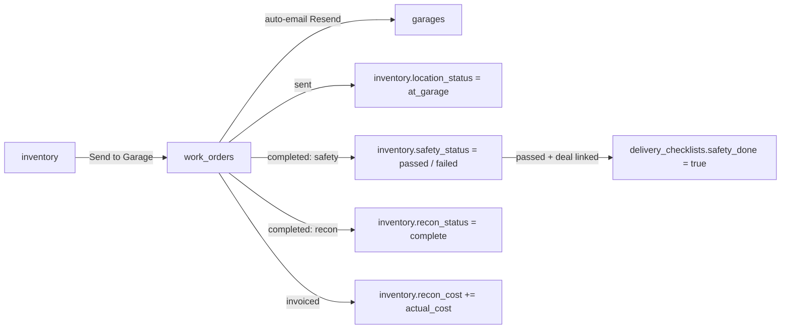
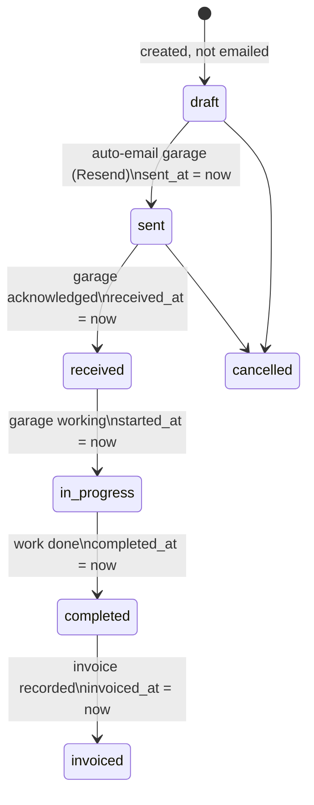
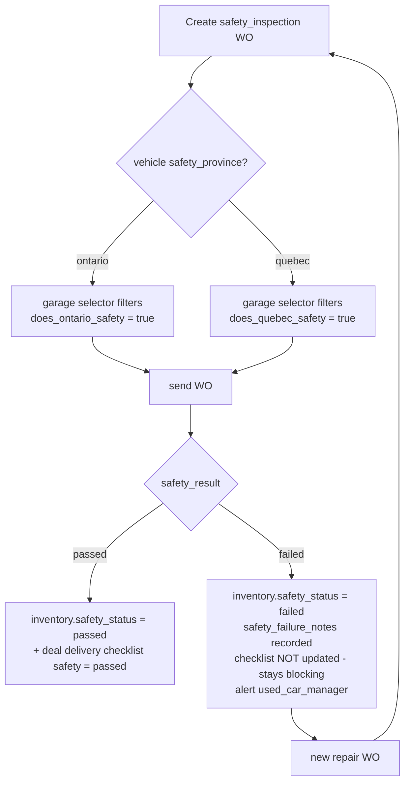

# Garage & Work Orders — Work Order Lifecycle, PDI Expansion, Mechanic Workflows

This document defines the garage/service domain: the garage registry (internal + external shops with province-specific safety capabilities), the work-order lifecycle with its inventory and delivery-checklist side effects, cost roll-up into reconditioning, the expanded Pre-Delivery Inspection (PDI) checklist, and the day-to-day mechanic/lot workflows. Rules are documented **as implemented** in `server/routes/workOrders.js`, `supabase/migrations/20260406_garage_work_orders.sql`, and `20260406_pdi_expansion.sql`, with the fuller spec'd design from `discussions/garage-work-orders-spec.md` and ReadyLoans changes marked **Target** per the ADRs (`00-overview/ARCHITECTURE-DECISIONS.md`).

## Table of Contents

1. [Domain Overview](#1-domain-overview)
2. [Garage Registry](#2-garage-registry)
3. [Work Order Types & Cross-Module Connections](#3-work-order-types--cross-module-connections)
4. [Work Order Lifecycle](#4-work-order-lifecycle)
5. [Safety Inspection Rules (Ontario vs Quebec)](#5-safety-inspection-rules-ontario-vs-quebec)
6. [Cost Tracking & Recon Roll-Up](#6-cost-tracking--recon-roll-up)
7. [Garage Queue, SLAs & Automation Events](#7-garage-queue-slas--automation-events)
8. [PDI Expansion (Pre-Delivery Inspection)](#8-pdi-expansion-pre-delivery-inspection)
9. [Mechanic & Lot Workflows](#9-mechanic--lot-workflows)
10. [API Surface](#10-api-surface)
11. [Legacy Gaps → Target Resolutions](#11-legacy-gaps--target-resolutions)

---

## 1. Domain Overview

Vehicles needing safety certification or reconditioning are sent to garages via **work orders** (WOs). A WO auto-emails the garage, moves the vehicle's `location_status` to `at_garage`, tracks progress and cost, and on completion cascades results back into `inventory.safety_status` / `inventory.recon_status` and — for safety inspections tied to a deal — the deal's delivery checklist. Vehicles are moved to/from garages by **lot staff** ("lot guys"), never external dispatch drivers.

## 2. Garage Registry

### `garages` (as built, `20260406_garage_work_orders.sql`)

| Column | Type / Default | Business meaning |
|---|---|---|
| `store_id` | UUID NOT NULL FK stores | garages are managed as **per-store relationships**; the same physical shop can appear under multiple stores |
| `name`, `email`, `phone`, `contact_name`, `address` | TEXT | `email` is the WO destination |
| `province` | TEXT | `'ontario'` / `'quebec'` |
| `services` | JSONB DEFAULT `'[]'` | `['safety_inspection','mechanical','body_work','detailing','general_maintenance']` |
| `does_ontario_safety` | BOOL DEFAULT false | **capability flag — routing rule, §5** |
| `does_quebec_safety` | BOOL DEFAULT false | |
| `is_internal` | BOOL DEFAULT false | true only for the dealership's own shop (Kia ML's garage) |
| `standard_rates` | JSONB DEFAULT `'{}'` | rate card per service, e.g. `{"safety_inspection": 15000, "oil_change": 8900, "detail_interior": 20000}` (cents in Target) |
| `avg_turnaround_days` | INT DEFAULT 3 | tracked over time (update formula undefined in legacy — Target: rolling average of `completed_at − sent_at` over last 20 completed WOs) |
| `active` | BOOL DEFAULT true | deactivate, never hard delete |

**Kia internal garage rules (real-world constraints, seed tenant #1):** located on the **Quebec side**; performs Quebec inspections, maintenance, and repairs; does **NOT** perform Ontario safety inspections (`does_ontario_safety = false`, `is_internal = true`). All Ontario-side stores (Ready Group) must use external garages for Ontario safety.

## 3. Work Order Types & Cross-Module Connections

`work_orders.type` CHECK — 5 values, each cascading to a different inventory field:

| `type` | Scope | Updates on completion |
|---|---|---|
| `safety_inspection` | ON or QC certification | `inventory.safety_status` + deal's delivery checklist (§5) |
| `mechanical` | engine, transmission, brakes, suspension | `inventory.recon_status` |
| `body_work` | paint, dents, bumpers, glass, trim | `inventory.recon_status` |
| `detailing` | interior/exterior clean, polish, odor | `inventory.recon_status` |
| `general_maintenance` | oil, tires, fluids, battery | `inventory.recon_status` |

### `work_orders` (as built)

`id`, `store_id` NOT NULL, `inventory_id` FK inventory CASCADE, `garage_id` FK garages, `deal_id` (spec'd, nullable — link when work is for a specific deal), `type` NOT NULL, `status` (§4), `description`, `line_items` JSONB `[]` of `{description, estimated_cost, actual_cost}`, `estimated_cost` INTEGER cents DEFAULT 0, `actual_cost` INTEGER cents DEFAULT 0, `safety_result` CHECK `('passed','failed')`, `safety_province` CHECK `('ontario','quebec')`, `safety_failure_notes` (spec'd), timeline stamps `sent_at`/`received_at`/`started_at`/`completed_at`/`invoiced_at`, `invoice_number` + `invoice_file_id` (spec'd), transport fields (spec'd: `transport_to_garage_by/at`, `transport_from_garage_by/at`), `assigned_to` FK users (internal manager), `created_by`, `notes`, `deleted_at`, timestamps.

**WO number (spec'd, not yet in DB):** `wo_number` TEXT UNIQUE, auto-generated **`WO-YYYY-NNNN`** sequential per year (e.g. `WO-2026-0001`). Target implements it as a per-tenant-per-year sequence (`WO-{year}-{seq}` scoped to the tenant, ADR-007).

## 4. Work Order Lifecycle

DB values: `draft` (default), `sent`, `received`, `in_progress`, `completed`, `invoiced` (+ `cancelled` in the spec enum; as-built delete = soft delete `deleted_at`).

### 4.1 Auto-timestamps (as implemented in `PUT /api/work-orders/:id`)

Each status write auto-sets its timestamp if not already provided: `sent`→`sent_at`, `received`→`received_at`, `in_progress`→`started_at`, `completed`→`completed_at`, `invoiced`→`invoiced_at`.

### 4.2 Side effects at creation (as implemented in `POST /api/work-orders`)

Required: `type` AND `inventory_id` (400 otherwise). On insert:

- `type = 'safety_inspection'` → `inventory.safety_status = 'sent_to_garage'`, `safety_sent_at = now()`.
- any other type → `inventory.recon_status = 'in_progress'`, `inventory.location_status = 'at_garage'`.

**Note (as-built quirk):** these fire at *creation*, not at *send* — a `draft` WO already flips inventory state. **Target:** move the inventory side effects to the `draft → sent` transition (matches the spec: "WO created/sent → at_garage").

### 4.3 Side effects at completion (as implemented)

When `status → 'completed'` and the WO has an `inventory_id`:

- `safety_inspection`: `inventory.safety_status = (safety_result === 'passed' ? 'passed' : 'failed')`, `safety_completed_at = now()`. Anything other than `'passed'` is treated as failed — completion of a safety WO **requires** a `safety_result`.
- other types: `inventory.recon_status = 'complete'`. **As-built gap:** `location_status` is NOT reset — the vehicle stays `at_garage` until the pickup action (§9.2) moves it back to `on_lot`. This is intentional in the spec (pickup is a separate physical event) but the pickup endpoint is unbuilt.

Spec'd refinement carried into Target: **all recon WOs for a vehicle must be complete** before `recon_status = 'complete'` (the as-built code sets it on the first completed WO — fix with a count check).

### 4.4 Auto-email on send (spec'd)

Setting status to `sent` sends the WO email via Resend:

- Subject: `Work Order #{{wo_number}} — {{year}} {{make}} {{model}} — {{service_type}}`
- Body: store name + date; vehicle block (year, make, model, trim, VIN, mileage km, exterior color, stock #); service (type + description); dealership contact (name, store phone, store email); closing line "Please confirm receipt of this work order."
- UI: "Resend Email" button on the WO detail.

**Target (ADR-012/018/019/020/021):** the email is a BullMQ job rendering a tenant-branded bilingual React Email template; garage acknowledgment remains manual (staff set `received` from the garage's reply — no garage portal in scope).

## 5. Safety Inspection Rules (Ontario vs Quebec)

The compliance-critical routing rule:

- **Province filtering:** the vehicle's `safety_province` (from the deal's licensing province or the inventory record) filters eligible garages. Ontario safety → only `does_ontario_safety = true`; Quebec → only `does_quebec_safety = true`. This is what prevents sending Ontario safety work to Kia ML's Quebec-only internal garage.
- **Passed:** cascades to the delivery checklist only when the WO is linked to a deal (`deal_id` set) — `delivery_checklists.safety_done = true` (legacy 4-item gate; Target: `safety_status = 'passed'` in the expanded pre-delivery model).
- **Failed:** the delivery checklist is **not** updated — safety remains a delivery blocker. Typical loop: repair WO → re-inspection WO.
- Safety is one of the 4 critical delivery gates (`client_insurance_uploaded`, `deal_funded`, `safety_done`, `registration_done`) computed by `GET /api/delivery-checklists/dashboard` → `is_ready` = all four true.

## 6. Cost Tracking & Recon Roll-Up

| Field | Rule |
|---|---|
| `estimated_cost` | Auto-filled from the selected garage's `standard_rates[service_type]` when present; user-overridable |
| `actual_cost` | From the garage invoice, recorded at `invoiced` with `invoice_number` + uploaded invoice file |
| Roll-up | `inventory.recon_cost = Σ actual_cost of the vehicle's completed/invoiced WOs` — recomputed when a WO is invoiced |
| Downstream | `total_invested = acquisition_cost + transport_cost + recon_cost` → front-gross basis in desking and wholesale P&L (see `inventory.md` §7.4, §10.2) |

All amounts INTEGER cents (ADR-009). The recon **approval gate** (estimate > $2,000 default → GM approval before sending) lives on the inventory side — see `inventory.md` §7.3; a WO for an over-threshold recon must not reach `sent` until `inventory.recon_status = 'recon_approved'`.

## 7. Garage Queue, SLAs & Automation Events

### 7.1 Garage queue view

Queue = WOs with `status IN ('sent','received','in_progress')`. Columns: vehicle (year make model, stock #, VIN), garage, service, sent date, **days at garage** (computed from `sent_at` at query time — never a stored generated column, ADR-009), status, estimated completion.

| Days at garage | Color |
|---|---|
| < 3 | green |
| 3–5 | amber |
| > 5 | red |

Overdue query: `sent_at < now() − interval '3 days' AND status NOT IN ('completed','invoiced','cancelled')`.

### 7.2 SLA thresholds (two systems, both documented)

| Rule | Threshold | Recipient / urgency | Source |
|---|---|---|---|
| Safety WO overdue (queue) | 3 days | used_car_manager, MEDIUM | garage spec daily job |
| Safety sent, no result | 5 days | used_car_manager | Inventory Command Center alert list |
| Safety overdue (store config) | `stores.safety_overdue_days` DEFAULT 14 | used_car_manager HIGH, escalate to gm after 30 min unacknowledged | seeded `automation_rules` row |

These coexist in the legacy artifacts. **Target:** one configurable ladder per store — early-warning at 3 days (safety) / 5 days (any WO), hard-overdue at `stores.safety_overdue_days` with escalation — all evaluated by a daily BullMQ repeatable job (ADR-012).

### 7.3 Automation events

| Event | Action |
|---|---|
| `work_order.sent` | `inventory.location_status → 'at_garage'` |
| `work_order.completed` | LOW notification to used_car_manager |
| `work_order.safety_passed` | update inventory + delivery checklist (§5) |
| `work_order.safety_failed` | update inventory; alert used_car_manager |
| `work_order.pickup` | `inventory.location_status → 'on_lot'` |
| `work_order.invoiced` | recompute `inventory.recon_cost` (§6) |
| WO overdue (daily sweep) | MEDIUM notification to used_car_manager |

## 8. PDI Expansion (Pre-Delivery Inspection)

Migration `20260406_pdi_expansion.sql` (M-004) expands the 4-item delivery checklist into a full, per-store-configurable PDI.

### 8.1 Data model

`delivery_checklists` additions: `section` TEXT; `checklist_items` JSONB DEFAULT `'[]'` — item shape `{id, section, label, checked, photo_required, photo_url, notes}`; `compliance_pct` INTEGER DEFAULT 0; manager sign-off trio `manager_signed` BOOL DEFAULT false, `manager_signed_by` FK users, `manager_signed_at`.

`pdi_templates` (per-store item catalog): `id`, `store_id` FK stores, `section` NOT NULL (`'exterior'|'interior'|'mechanical'|'documents'|'accessories'`), `label` NOT NULL, `photo_required` BOOL DEFAULT false, `sort_order` INT DEFAULT 0, `active` BOOL DEFAULT true.

### 8.2 Seeded default PDI (22 items)

Photo-required items are the evidence trail: **body condition, odometer reading, insurance verified, VIN plate photo.**

| Section | Items (sort order) | Photo required |
|---|---|---|
| exterior (6) | Body condition (no dents/scratches) ①; Paint condition ②; All lights working ③; Windshield condition ④; Tire condition & pressure ⑤; License plates installed ⑥ | ① |
| interior (5) | Seats clean & undamaged ⑦; Dashboard & controls working ⑧; AC/Heat functional ⑨; Radio & speakers working ⑩; Floor mats installed ⑪ | — |
| mechanical (4) | Odometer reading recorded ⑫; Engine runs properly ⑬; Brakes tested ⑭; Fluid levels checked ⑮ | ⑫ |
| documents (4) | Bill of sale signed ⑯; Insurance verified ⑰; Registration complete ⑱; Financing docs signed ⑲ | ⑰ |
| accessories (3) | Spare key provided ⑳; Owner manual provided ㉑; VIN plate photo ㉒ | ㉒ |

### 8.3 PDI rules

- A deal's PDI is **instantiated from the store's active `pdi_templates`** (sorted by `sort_order`) into `checklist_items` when the delivery checklist is created; stores customize by adding/deactivating template rows — instantiated checklists are not retroactively changed.
- `compliance_pct = round(checked_items / total_items × 100)` — recomputed on every item update.
- Items with `photo_required = true` count as complete only when both `checked = true` AND `photo_url` is set.
- **Manager sign-off:** a manager (`gm`, `sales_manager`, or `used_car_manager`) signs the completed PDI — records `manager_signed_by` + `manager_signed_at`. Target rule: `compliance_pct = 100` is a precondition for sign-off; sign-off is a precondition for scheduling delivery in the expanded pre-delivery gate (alongside insurance verified, void cheque, funding funded, IDV completed, safety passed, wet-ink prepared — see the Pre-Delivery Enforcement spec).
- The PDI is distinct from the recon inspection (`inventory.md` §7.2): recon happens at *intake* to decide work; PDI happens at *delivery prep* to certify the unit is customer-ready.

## 9. Mechanic & Lot Workflows

### 9.1 Internal garage (mechanic-facing)

For `is_internal = true` garages, WOs are assigned to a staff user via `work_orders.assigned_to`. Daily flow:

1. Mechanic/service manager works the queue view filtered to the internal garage, ordered `sent_at ASC`.
2. Sets `received → in_progress` when starting (auto-stamps `started_at`).
3. Records findings in `line_items` (`{description, estimated_cost, actual_cost}` per line) and `notes`.
4. Safety WOs end with an explicit **[Passed] / [Failed — add notes]** action (`safety_result` required at completion).
5. Completion triggers the §4.3 cascades and the used-car-manager notification.

External garages have no portal: `received`, `in_progress`, `completed` are set by dealership staff based on the garage's phone/email updates (explicit design decision — no garage-side accounts in scope).

### 9.2 Lot staff (transport)

Vehicles are shuttled by lot staff, tracked on the WO (spec'd fields): drop-off `transport_to_garage_by` + `transport_to_garage_at`; pickup `transport_from_garage_by` + `transport_from_garage_at` via `POST /api/work-orders/:id/pickup`, which also sets `inventory.location_status = 'on_lot'` and clears `location_details`. No external dispatch drivers are involved (contrast with customer deliveries — `dispatch-transport.md`).

### 9.3 UI components (spec'd)

`WorkOrderForm` (vehicle search by stock#/VIN; service dropdown; garage selector filtered by service capability + safety province, showing the standard rate; auto-filled editable estimate; dropped-off-by name; [Save as Draft] / [Send to Garage]); `WorkOrderCard` (WO #, status badge, color-coded days at garage); `GarageQueue` (route `/work-orders`, wrench icon); `WorkOrderDetail` slide-out (timeline, actions: Mark Received / Mark Complete / Record Invoice / Mark Picked Up / Resend Email, Passed/Failed for safety); `GarageManager` settings (route `/settings/garages`, rate-card editor, QC/ON certification badges, avg turnaround). "Send to Garage" button in the inventory detail pre-fills the form. EN/FR for all strings (ADR-019).

## 10. API Surface

| Legacy endpoint (as built) | Behavior | Target (`/api/v1`, authenticated + tenant-scoped) |
|---|---|---|
| `GET /api/work-orders?status=&type=&garage_id=&inventory_id=` | non-deleted, `{data,total}` | + pagination, store filter |
| `GET /api/work-orders/:id` | single | keep |
| `POST /api/work-orders` | required `type`+`inventory_id`; inventory side effects (§4.2) | move side effects to `sent`; generate `wo_number` |
| `PUT /api/work-orders/:id` | auto-timestamps per status; completion cascades (§4.3) | typed transition validation (no `completed → sent`) |
| `DELETE /api/work-orders/:id` | soft delete | keep as `cancelled` |
| `GET /api/work-orders/garages/list` | active garages | full garage CRUD (`GET/POST /api/v1/garages`, `PUT /:id`, `DELETE` = deactivate) + `GET/PUT /:id/rates` |
| Spec'd, unbuilt | `POST /:id/send` (email + status), `PUT /:id/complete`, `PUT /:id/invoice` (recompute recon_cost), `POST /:id/pickup`, `PUT /:id/safety-result`, `GET /garage-queue`, `GET /overdue`, `GET /by-vehicle/:inventoryId` | build in Target |
| PDI (unbuilt routes) | checklist instantiation from templates; item check/photo update; manager sign-off | `GET/PUT /api/v1/deals/:id/pdi`, `POST /api/v1/deals/:id/pdi/sign`; `GET/POST/PUT /api/v1/pdi-templates` (per store) |

## 11. Legacy Gaps → Target Resolutions

| # | Gap (evidence) | Target resolution (ADR) |
|---|---|---|
| 1 | No auth on WO/garage routes | Better Auth + roles: `used_car_manager`/`gm` manage WOs; mechanics update assigned WOs (ADR-006) |
| 2 | Inventory side effects fire at WO *creation*, not send | Trigger on `draft → sent` transition (§4.2) |
| 3 | First completed recon WO sets `recon_status='complete'` even with open WOs | Complete only when zero open recon WOs remain (§4.3) |
| 4 | `location_status` never returns to `on_lot` (pickup endpoint unbuilt) | Build `POST /:id/pickup` (§9.2) |
| 5 | `wo_number` spec'd but absent from schema | Per-tenant `WO-YYYY-NNNN` sequence (§3) |
| 6 | `days_at_garage` spec'd as a `NOW()` STORED generated column (invalid) | Query-time computation / view (ADR-009) |
| 7 | Auto-email spec'd but unbuilt; would be Kia-branded English | BullMQ + tenant-branded bilingual React Email (ADR-012/018/019/020) |
| 8 | `avg_turnaround_days` static default 3, no update formula | Rolling average of last 20 completed WOs (§2) |
| 9 | Conflicting safety SLA thresholds (3d / 5d / 14d) | Configurable per-store ladder (§7.2) |
| 10 | `standard_rates` example values in dollars | Cents (ADR-009) |
| 11 | PDI `checklist_items` JSONB has no schema validation; RLS `USING(true)` | Zod item schema in `packages/schemas` (ADR-016); FORCED RLS with tenant_id (ADR-007) |
| 12 | 'glass' appears in a GarageManager example but not in the services enum | Glass work is `body_work`; enum unchanged, documented here |
