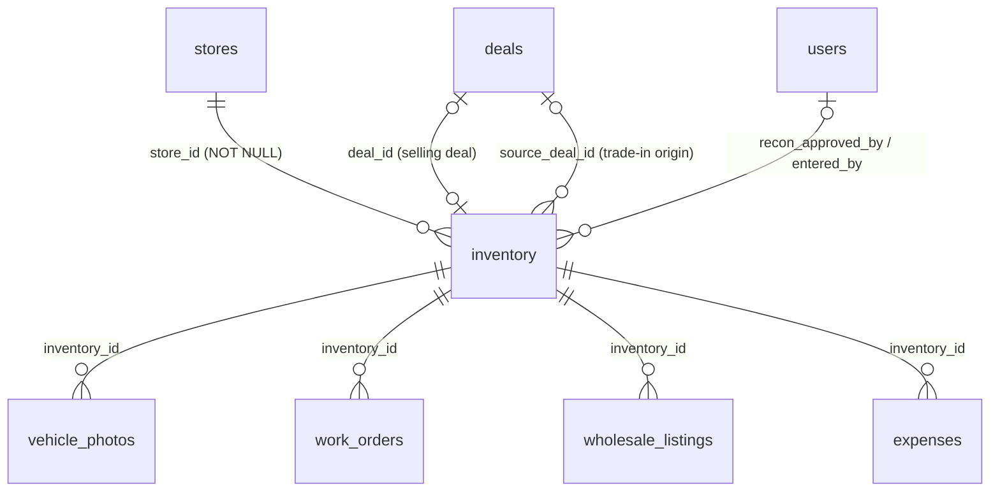
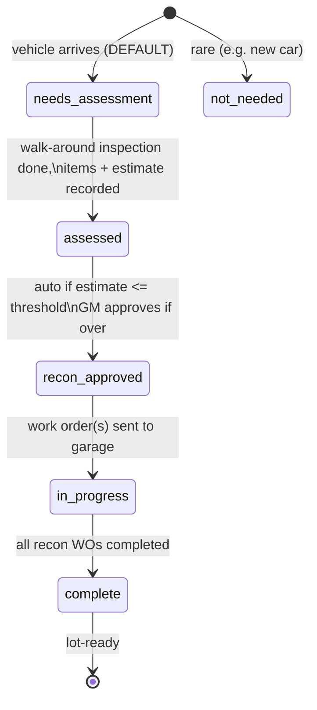
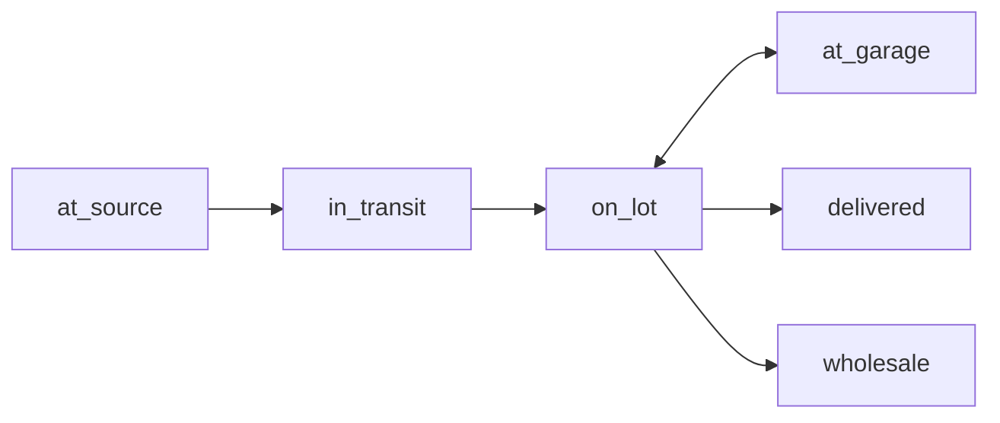

# Inventory — Vehicle Lifecycle, Photos, Reconditioning, Cross-Store Visibility & Wholesale

This document is the canonical business-logic reference for the ReadyLoans inventory module. It records the resolved architecture decision (separate `inventory` table), the vehicle intake paths, VIN decoding, photo compliance, the reconditioning approval workflow, cross-store visibility rules, and the wholesale pipeline — documenting rules **as they exist** in the legacy Kia Mont-Laurier tracker (source: `supabase/migrations/20260406_inventory.sql`, `20260406_wholesale.sql`, `server/routes/inventory.js`, `server/routes/wholesale.js`, and the final module spec in `discussions/inventory-command-center-spec.md`), with ReadyLoans changes explicitly marked as **Target** per the ADRs (`00-overview/ARCHITECTURE-DECISIONS.md`).

## Table of Contents

1. [Architecture Decision: Separate Inventory Table](#1-architecture-decision-separate-inventory-table)
2. [Entity Model](#2-entity-model)
3. [The `inventory` Table](#3-the-inventory-table)
4. [Vehicle Intake](#4-vehicle-intake)
5. [VIN Decoding](#5-vin-decoding)
6. [Photo Management](#6-photo-management)
7. [Reconditioning Workflow](#7-reconditioning-workflow)
8. [Location & Aging](#8-location--aging)
9. [Cross-Store Visibility & Cost Hiding](#9-cross-store-visibility--cost-hiding)
10. [Wholesale](#10-wholesale)
11. [API Surface](#11-api-surface)
12. [Automated Alerts](#12-automated-alerts)
13. [Legacy Gaps → Target Resolutions](#13-legacy-gaps--target-resolutions)

---

## 1. Architecture Decision: Separate Inventory Table

The Gap Map in the master spec flagged "inventory table architecture" as Critical Architecture Decision #1: the original tracker stored vehicle data **on the `deals` table** (a deal *was* a vehicle). The decision is resolved and already implemented in migration `20260406_inventory.sql`:

**Vehicles exist independently of deals in a dedicated `inventory` table.** Deals link to inventory via `inventory.deal_id` (the deal currently selling this unit) and `inventory.source_deal_id` (the deal that *produced* this unit, e.g. a trade-in origin).

Why (from the final spec, confirmed by the migration):

| Capability | Impossible on deals-table model | Enabled by separate table |
|---|---|---|
| Speculative/auction buys with no customer | ✗ | ✓ |
| Trade-in auto-creates a sellable unit on delivery | ✗ | ✓ |
| Vehicle status independent of deal status | ✗ (one `vehicle_status` field) | ✓ (`location_status` + `deal_status` + `safety_status` + `recon_status`) |
| Same unit re-listed after a lost deal | ✗ | ✓ |
| Internal wholesale between stores | ✗ | ✓ (two inventory rows, one per store) |

The legacy `deals` vehicle columns (`stock_number`, `vin`, `year`, `make`, `model`, `color`, `vehicle_source`, `vehicle_status`) still coexist with the inventory table. **Target (ADR-009, ADR-026):** during the strangler rebuild, the deal keeps only a real FK `deals.inventory_id → inventory.id`; the denormalized vehicle columns on deals are migrated then dropped. One status vocabulary per entity, defined once in `packages/schemas` (ADR-016).

## 2. Entity Model



**Target (ADR-007):** every row additionally carries `tenant_id` (organization) alongside `store_id`, with FORCED RLS; composite indexes `(tenant_id, store_id, location_status)` etc.

## 3. The `inventory` Table

As built (`20260406_inventory.sql`). All money columns are **INTEGER cents** (ADR-009 already honored here).

| Group | Column | Type / Constraint | Notes |
|---|---|---|---|
| Identity | `vin` | TEXT | 17 chars, no I/O/Q (Zod `vinSchema`) |
| | `stock_number` | TEXT NOT NULL | Spec: UNIQUE — enforce per-store uniqueness in Target |
| | `year`, `make`, `model` | NOT NULL | |
| | `trim`, `body_type`, `engine`, `drive_type`, `fuel_type`, `doors`, `exterior_color`, `interior_color`, `mileage`, `country_of_origin` | | populated by VIN decode (§5) |
| Classification | `vehicle_type` | CHECK `('new','used')` DEFAULT `'used'` | |
| | `acquisition_type` | NOT NULL CHECK `('auction','dealer_trade','trade_in','internal_wholesale','consignment')` | |
| | `acquisition_date` | DATE NOT NULL DEFAULT CURRENT_DATE | |
| Costs (cents) | `acquisition_cost` | INTEGER NOT NULL DEFAULT 0 | |
| | `transport_cost` | INTEGER DEFAULT 0 | |
| | `recon_cost` | INTEGER DEFAULT 0 | rolled up from work-order invoices (see `garage-work-orders.md`) |
| | `list_price` | INTEGER NULL | |
| Location | `location_status` | CHECK `('at_source','in_transit','on_lot','at_garage','delivered','wholesale')` DEFAULT `'on_lot'` | |
| | `location_details` | TEXT | which garage / source dealership |
| Safety | `safety_status` | CHECK `('not_required','not_started','sent_to_garage','in_progress','passed','failed')` DEFAULT `'not_started'` | driven by work orders |
| | `safety_sent_at`, `safety_completed_at`, `safety_province`, `safety_notes` | | `safety_province` ∈ ontario/quebec (no DB CHECK — Target: add) |
| Recon | `recon_status` | CHECK `('not_needed','needs_assessment','assessed','recon_approved','in_progress','complete')` DEFAULT `'needs_assessment'` | §7 |
| | `recon_items` | JSONB DEFAULT `'[]'` | `[{category, description, estimated_cost, actual_cost, status}]` |
| | `recon_estimated_total` | INTEGER cents | |
| | `recon_approval_required`, `recon_approved_by` FK users, `recon_approved_at` | | GM approval gate (§7) |
| Photos | `photo_count` INT DEFAULT 0, `photo_complete` BOOL | | plus 6 per-angle flags: `photos_front`, `photos_back`, `photos_driver_side`, `photos_passenger_side`, `photos_interior`, `photos_odometer` |
| Deal linkage | `deal_id` FK deals | | selling deal |
| | `deal_status` | CHECK `('available','reserved','sold_pending','delivered','wholesale')` DEFAULT `'available'` | inventory-side status, independent of the deal pipeline |
| | `source_deal_id` FK deals | | trade-in origin deal |
| Aging | `days_on_lot` INT DEFAULT 0 (denormalized), `lot_arrival_date` DATE | | see §8 |
| Meta | `store_id` NOT NULL FK stores, `notes`, `deleted_at`, `created_at`/`updated_at` (trigger) | | soft delete (ADR-009) |

Total invested is **derived, not stored**: `total_invested = acquisition_cost + transport_cost + recon_cost`. The spec proposed a STORED generated column for both `total_invested` and `days_in_stock (CURRENT_DATE − acquisition_date)`; the latter is invalid Postgres (volatile function in a generated column) and ADR-009 bans it — **Target:** compute both in a view or query, never store `NOW()`-derived values.

## 4. Vehicle Intake

Entered by the used-car manager or admin/office staff. Entry paths per acquisition type:

| `acquisition_type` | Entry path | Notes |
|---|---|---|
| `auction` | Manual form + VIN decode | |
| `dealer_trade` | Manual form + VIN decode | |
| `trade_in` | **AUTO-created** by the Delivery Tracker | rule below |
| `internal_wholesale` | Manual, by the **buying** store | created by the transfer endpoint (§10.3) |
| `consignment` | Manual | |

As built, `POST /api/inventory` requires `stock_number`, `year`, `make`, `model`, `acquisition_type` (400 otherwise) and defaults: `vehicle_type='used'`, `acquisition_date=today`, `acquisition_cost=0`, `transport_cost=0`, `location_status='on_lot'`, `store_id` = first store row (single-tenant assumption — **Target:** tenant context from session, never defaulted). Known defect carried into Target as a fix: `lot_arrival_date` is set to today only when the request body *explicitly* contains `location_status==='on_lot'`; relying on the default leaves it NULL — Target sets `lot_arrival_date` whenever the effective location is `on_lot`.

### Trade-in auto-creation rule (Spec'd, cross-module)

When the Delivery Tracker marks a deal's trade-in received (`deals.trade_in_received = true`), the system auto-creates an inventory row:

- Vehicle fields copied from the deal's structured trade-in columns (`trade_in_year/make/model/trim/mileage/vin/color`).
- `acquisition_type = 'trade_in'`
- `acquisition_cost` = the trade-in **allowance** from the deal (cents)
- `location_status = 'on_lot'`, `acquisition_date = trade_in_received_at`
- `source_deal_id` = the originating deal; `store_id` = the deal's store
- VIN decode triggered if a VIN is present.

The new unit then still needs photos (§6), inspection, and a recon decision (§7). Physical inspection happens **at the lot after arrival** by the used-car manager — drivers never inspect at the client's address (see `dispatch-transport.md`).

## 5. VIN Decoding

As spec'd (Inventory Command Center final spec) and to be implemented in `apps/api` as a proxied call (browser→provider calls are banned; all data via the typed API client, ADR-002).

- Provider **(decided 2026-07-23)**: production uses a **commercial, Canadian-aware VIN decode service** (e.g., DataOne), chosen through a short accuracy evaluation on Canadian-market VINs — the owner's stated priority is maximum accuracy on Canadian trims/specs. **NHTSA vPIC** (free: `https://vpic.nhtsa.dot.gov/api/vehicles/DecodeVinValues/{VIN}?format=json`, npm wrapper `@shaggytools/nhtsa-api-wrapper` from the legacy plan) is retained as the **dev-environment fallback only**. Both providers sit behind the same endpoint `POST /api/v1/inventory/vin-decode`, so the provider is per-environment configuration, not code.
- Flow: enter VIN → decode → auto-populate form → user reviews/edits every field → save. Manual entry is the fallback when decode fails (invalid VIN or API down) — decode is a convenience, never a gate.

Field mapping (vPIC names shown; the commercial provider normalizes into the same inventory columns):

| vPIC field | Inventory column |
|---|---|
| `ModelYear` | `year` |
| `Make` | `make` |
| `Model` | `model` |
| `Trim` | `trim` |
| `BodyClass` | `body_type` |
| `DisplacementL` + `EngineConfiguration` + `FuelTypePrimary` | `engine` |
| `DriveType` | `drive_type` |
| `Doors` | `doors` |
| `PlantCountry` | `country_of_origin` |

VIN validation (shared Zod refinement, ADR-016): exactly 17 characters, regex `^[A-HJ-NPR-Z0-9]+$` (letters I, O, Q forbidden) — already implemented in `server/schemas/index.js` and carried into `packages/schemas`.

## 6. Photo Management

### 6.1 Required angles and completeness

Six required angles, each tracked with an individual boolean flag on `inventory` and a typed row in `vehicle_photos`:

| # | Angle (`angle_type`) | Required |
|---|---|---|
| 1 | `front` | Yes |
| 2 | `back` | Yes |
| 3 | `driver_side` | Yes |
| 4 | `passenger_side` | Yes |
| 5 | `interior` (dashboard) | Yes |
| 6 | `odometer` | Yes |
| 7+ | `additional` (damage, features, trunk…) | Optional |

Rule: **`photo_complete = true` only when all 6 required angles are present.** (The spec's "5 minimum" heading is a known inconsistency; the operative rule is 6.) Upload updates the per-angle flag, increments `photo_count`, and recalculates `photo_complete`.

`vehicle_photos` (as built): `id`, `inventory_id` FK CASCADE, `angle_type` CHECK (7 values above), `storage_path`, `file_name`, `uploaded_by` FK users, `created_at`. RLS allows SELECT/INSERT/DELETE (no UPDATE — photos are replaced, not edited).

### 6.2 Compliance alert

**48 hours after a vehicle arrives on lot with fewer than 6 required photos → alert the used-car manager** (automation rule #5 in the notifications engine; measured from `lot_arrival_date`). Photo count and completion badge shown on every vehicle card; missing angles highlighted red in the detail view.

### 6.3 Storage pipeline (Target, ADR-013)

Photos live in Amazon S3 under per-tenant prefixes `tenant/{tenantId}/inventory/{inventoryId}/{angle}.jpg`, private bucket + presigned URLs only (ADR-013, amended 2026-07-24). Every upload passes a **sharp** worker step (BullMQ, ADR-012): EXIF/GPS strip, max-dimension enforcement, blurhash/LQIP generation, optional dealer watermark, and pre-generation of the bounded WebP variant set (immutable variant keys). Serving via CloudFront. The chatbot/AI layer sends at most the **first photo per vehicle (front angle preferred), max 3 vehicles per conversation** via MMS (ADR-022 guardrail).

## 7. Reconditioning Workflow

### 7.1 Status machine



DB values: `not_needed`, `needs_assessment` (default), `assessed`, `recon_approved`, `in_progress`, `complete`.

### 7.2 Inspection checklist (5 categories)

Standard walk-around by the used-car manager (or designee) on arrival:

| Category | Items |
|---|---|
| Mechanical | engine, transmission, brakes, suspension, steering, exhaust, AC, battery |
| Body | paint, dents, scratches, rust, bumpers, trim, glass, mirrors, lights |
| Interior | seats, carpet, headliner, dash, controls, gauges, electronics, smell |
| Tires | tread depth, condition, matching, spare |
| Safety | wipers, horn, seatbelts, airbag light, ABS light |

Per-item condition: `not_checked` | `good` | `needs_work` | `urgent`, plus `notes`, `checked_by`, `checked_at` (spec'd `recon_checklist` table; as built the summary lives in `inventory.recon_items` JSONB: `[{category, description, estimated_cost, actual_cost, status}]`).

### 7.3 Approval gate

- **If `recon_estimated_total` > the store threshold (default $2,000 = 200000 cents) → `recon_approval_required = true` and GM approval is required before any work order is sent.** Approval records `recon_approved_by` + `recon_approved_at`.
- Under threshold → auto-approved; work order goes straight to the garage.
- The threshold is per-store config. **Target:** add `stores.recon_approval_threshold_cents INTEGER DEFAULT 200000` (the legacy spec references the threshold but never defined the column — known gap).
- Automated alert: **recon cost exceeds $2,000 → notify GM** (Inventory Command Center alert list).

Endpoints (spec'd): `POST /api/inventory/:id/recon/assess` (creates checklist, status→`assessed`, computes `recon_estimated_total`, sets `recon_approval_required` when over threshold), `PUT /api/inventory/:id/recon/approve` (GM only), `PUT /api/inventory/:id/recon/complete` (writes **actual** costs back to `recon_cost`).

### 7.4 Cost roll-up

`recon_cost = Σ actual_cost of completed/invoiced work orders for the vehicle` (see `garage-work-orders.md` §6). This feeds `total_invested = acquisition_cost + transport_cost + recon_cost`, which is the `vehicle_cost` basis for front gross in desking and the cost basis for wholesale P&L (§10).

## 8. Location & Aging

Location pipeline (kanban columns in the Inventory Command Center):



Work orders automate two hops: WO sent → `at_garage` (+ `location_details` = garage name); WO pickup → back to `on_lot` (details cleared).

Aging rules:

| Rule | Value |
|---|---|
| Card/row aging colors | green < 30 days, amber 30–60, red > 60 |
| Aging alert to GM + wholesale manager | 45 days in stock |
| Wholesale review auto-flag | 60 days (§10.1) |
| Store-configurable threshold | `stores.aging_threshold_days` (default 60) — drives the seeded `vehicle_aging` automation rule |

As built, aging uses denormalized `days_on_lot` + `lot_arrival_date`. **Target (ADR-009):** `days_on_lot` is computed in queries/views from `lot_arrival_date` (or `acquisition_date` fallback); no stored volatile columns; a nightly BullMQ repeatable job (ADR-012) evaluates threshold alerts.

Dashboard views (spec'd, unchanged in Target): **Pipeline** (kanban by `location_status`, default for used-car manager), **Grid** (photo cards), **Table** (GM financial review), **Aging** (sorted `days_on_lot` desc, wholesale manager). Stats bar: Total Units | On Lot | At Garage | In Transit | At Source | Sold Pending | Avg Days in Stock | Total Invested | Units > 30 Days.

## 9. Cross-Store Visibility & Cost Hiding

Vehicles are visible across stores inside the same organization (dealer group) so any store can sell any unit; **cost data is hidden outside the owning store** for everyone except the owner:

| Role | Own store | Other stores (same org) |
|---|---|---|
| Owner | Full, incl. cost | Full, incl. cost |
| GM | Full, incl. cost | Vehicles visible, **cost hidden** |
| Used Car Manager | Full | Vehicles visible, cost hidden |
| Wholesale Manager | Full | Vehicles visible, cost hidden |
| Salesperson | Vehicles, **no cost** | Vehicles, no cost |

Hidden fields when cost is masked: `acquisition_cost`, `transport_cost`, `recon_cost`, `total_invested`, `list_price` (internal), profit margin.

**Enforcement (Target, ADR-007):** tenant isolation between *organizations* is Postgres RLS (FORCED). Cross-store visibility *within* an org and cost-field masking are **application-level column masking** in the API serializer — explicitly not RLS, per ADR-007 ("Cost-field visibility (cross-store inventory) is app-level column masking"). Endpoints: `GET /api/v1/inventory?scope=all-stores` (owner), `GET /api/v1/inventory/store/:storeId` (cost fields stripped for non-owners). Never expose masked fields in list payloads and rely on the client to hide them.

## 10. Wholesale

Two distinct flows share the `wholesale_listings` table: external auction/direct wholesale (10.1–10.2) and internal store-to-store transfer (10.3).

### 10.1 Flagging rules

| Trigger | Action |
|---|---|
| 30 days in stock | Notification to wholesale manager + GM |
| 60 days in stock | **Auto-flagged for wholesale review** (daily job); wholesale manager must act |
| Any time | GM can manually flag (`POST /api/inventory/:id/flag-wholesale`) |

Flag reasons: `aging`, `overstock`, `damage`, `low_demand`, `manual`. At flag time the spec snapshots `total_invested` onto the listing (cost basis frozen even if recon continues).

### 10.2 Listing → sale

Platforms: **TradeRev, ACV Auctions, EBlock** (online auctions) and **direct** (negotiated dealer-to-dealer). One vehicle may be listed on multiple platforms simultaneously.

Workflow: `flagged → listed → offer_received → sold` (or `cancelled`). Offers tracked as `[{buyer, amount, date, platform, status: pending|accepted|declined, notes}]` with `best_offer` auto-calculated as the highest.

As built (`wholesale_listings`, money in cents): `inventory_id` NOT NULL FK CASCADE, `store_id`, `auction_house`, `auction_date`, `reserve_price` DEFAULT 0, `final_price` NULL, `result` CHECK `('pending','sold','no_sale','withdrawn')`, `buyer_name`, `buyer_contact`, `profit_loss` (can be negative), `notes`, `deleted_at`.

**P&L rule (implemented in `server/routes/wholesale.js` PUT):** when `result = 'sold'` AND `final_price` is set:

```
total_invested = acquisition_cost + transport_cost + recon_cost   (from linked inventory, nulls → 0)
profit_loss    = final_price − total_invested                     (stored on the listing; negative = wholesale loss)
```

`reserve_price` is an auction floor only — it never enters P&L. On sale, `inventory.deal_status → 'wholesale'` and `location_status → 'wholesale'` (the older §12 variant said "delivered"; the §11 final spec — `wholesale` — is authoritative). Wholesale losses roll into reporting.

Dashboard: table sorted by days in stock (vehicle, days, total invested, asking, best offer, platform, status); row colors **amber > 45 days, red > 60 days** (authoritative §11 values). Route `/wholesale`. Stats endpoint: flagged, listed, sold this month, total wholesale loss.

### 10.3 Internal wholesale between stores

`POST /api/inventory/:id/wholesale-to-store` (spec'd; Target endpoint `POST /api/v1/inventory/:id/transfer`):

1. Selling store's record: `deal_status = 'wholesale'` ("sold — internal wholesale"), records `sold_to_store_id` + `internal_wholesale_price` (cents).
2. Buying store gets a **new inventory record**: `acquisition_type = 'internal_wholesale'`, `acquisition_cost = internal_wholesale_price`, fresh `acquisition_date`, `source` linkage preserved via notes/`source_deal_id` where applicable.

Cost basis therefore resets at the transfer price — the buying store's margin is computed against what it paid, and the selling store realizes its P&L at transfer. **Target (ADR-007):** transfers within one organization run under the caller's tenant context; a *cross-organization* transfer (future marketplace) must go through an audited service-role function.

## 11. API Surface

As built today (`server/routes/inventory.js`, `server/routes/wholesale.js`) → Target `/api/v1` equivalents (Fastify + ts-rest, ADR-003; all behind auth + tenant scoping):

| Legacy endpoint | Behavior | Target notes |
|---|---|---|
| `GET /api/inventory` | filters: `location_status`, `deal_status`, `safety_status`, `recon_status`, `search` (stock/vin/make/model), sort; soft-delete filtered; `{data,total}` | add pagination (none today), tenant scope, cost masking |
| `GET /api/inventory/:id` | row + `photos[]` from `vehicle_photos` | |
| `POST /api/inventory` | required: stock_number, year, make, model, acquisition_type | store from session; fix `lot_arrival_date` default |
| `PUT /api/inventory/:id` | strips id/created_at/updated_at/deleted_at, otherwise unvalidated | full Zod schema, `.passthrough()` banned (ADR-016) |
| `DELETE /api/inventory/:id` | soft delete | keep |
| Spec'd, unbuilt | `POST /vin-decode`, `/photos` upload/delete, `/stats`, `/aging`, `/garage-queue`, `/incoming`, `/wholesale` (flagged), `/photo-compliance`, `/:id/flag-wholesale`, `/:id/wholesale-to-store`, recon `assess/approve/complete` | build in Target |
| `GET /api/wholesale?result=` | listings, newest first | |
| `POST /api/wholesale` | required `inventory_id`; `reserve_price` default 0 | |
| `PUT /api/wholesale/:id` | auto-computes `profit_loss` on sold (§10.2) | |
| (missing) | no DELETE route despite `deleted_at` column | add soft-delete route |

## 12. Automated Alerts

Consolidated inventory alert matrix (executed by the notifications/automation engine; **Target:** BullMQ repeatable jobs, ADR-012):

| Condition | Recipient | Urgency |
|---|---|---|
| Vehicle > 45 days in stock | GM + wholesale manager | medium |
| 60 days in stock | auto-flag for wholesale (system action) + wholesale manager | medium |
| Safety sent > 5 days, no result | used-car manager | medium |
| On lot > 48 h with < 6 required photos | used-car manager | medium |
| Incoming unit ETA today | logistics | low |
| Recon estimate > $2,000 | GM (approval gate, §7.3) | high |
| `vehicle_aging` seeded rule (store threshold, default 60d) | used-car manager | medium |

## 13. Legacy Gaps → Target Resolutions

| # | Legacy gap (evidence) | Target resolution (ADR) |
|---|---|---|
| 1 | `store_id` defaulted to first store row on create | Tenant/store from authenticated session only (ADR-006/007) |
| 2 | No auth on any inventory/wholesale route | All routes behind Better Auth + role checks (ADR-006) |
| 3 | `days_in_stock`/`total_invested` spec'd as volatile STORED generated columns | Views/query-time computation (ADR-009) |
| 4 | `lot_arrival_date` NULL when `location_status` omitted | Set from effective value, not raw body |
| 5 | "Ready" kanban column has no `location_status` value | Ready = `on_lot` AND `recon_status='complete'` AND `safety_status IN ('passed','not_required')` — derived, not a new enum value |
| 6 | Recon threshold referenced but no store column | `stores.recon_approval_threshold_cents` DEFAULT 200000 |
| 7 | No `tenant_id`; RLS `USING(true)` | tenant_id + FORCED RLS (ADR-007); `USING(true)` permanently banned |
| 8 | Photo storage public-URL leak in upload response | Signed URLs only, per-tenant prefixes (ADR-013) |
| 9 | Wholesale row colors conflict between spec versions | §11 final wins: amber > 45d, red > 60d |
| 10 | `safety_province` has no CHECK | Enum in `packages/schemas` + generated DB CHECK (ADR-016) |
