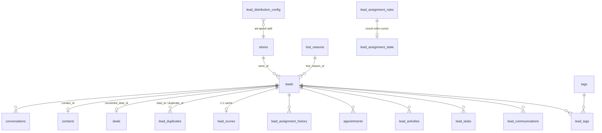
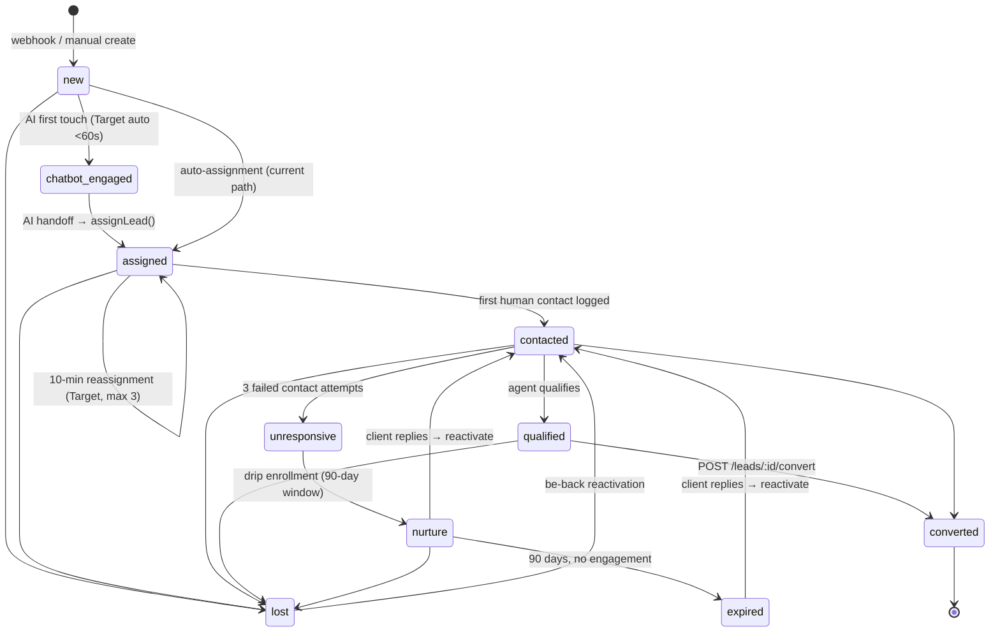

# Business Logic — Leads: Lifecycle, Intake, Scoring, Assignment & Recovery

This document is the canonical business-logic specification for the **lead** domain in ReadyLoans: every source and webhook that creates a lead, the 10-state status machine, speed-to-lead SLAs and timers, the configurable scoring rules engine, assignment rules (round-robin / load-balanced / source-based) and the reassignment escalation ladder, duplicate detection and merge, the be-back re-engagement queue, follow-up cadence and nurture drips, and lost reasons. Rules are documented **as currently implemented** in the Kia Mont-Laurier tracker (source of truth: `server/routes/leads.js`, `assignmentRules.js`, `duplicates.js`, `scoringRules.js`, `supabase/migrations/2026*`), with future behavior explicitly marked **Target** and tied to the ADRs (`docs/new/00-overview/ARCHITECTURE-DECISIONS.md`). Where legacy behavior conflicts with an ADR, the ADR wins (ADR-026).

---

## Table of Contents

1. [Lead Entity — Canonical Data Model](#1-lead-entity--canonical-data-model)
2. [Lead Sources & Intake](#2-lead-sources--intake)
3. [Store Distribution (Weighted Ad-Spend Queue)](#3-store-distribution-weighted-ad-spend-queue)
4. [Lead Status Machine](#4-lead-status-machine)
5. [Speed-to-Lead Rules & Timers](#5-speed-to-lead-rules--timers)
6. [Scoring Rules Engine](#6-scoring-rules-engine)
7. [Assignment Rules & Round-Robin](#7-assignment-rules--round-robin)
8. [Duplicate Detection & Merge](#8-duplicate-detection--merge)
9. [Be-Back Queue](#9-be-back-queue)
10. [Follow-Up Cadence & Nurture Drips](#10-follow-up-cadence--nurture-drips)
11. [Lost Reasons](#11-lost-reasons)
12. [Lead → Deal Conversion](#12-lead--deal-conversion)
13. [API Surface](#13-api-surface)
14. [Known Defects & Migration Notes](#14-known-defects--migration-notes)

---

## 1. Lead Entity — Canonical Data Model

Table: `leads` (soft-deleted via `deleted_at`; realtime-enabled; indexes on `store_id`, `status`, `assigned_to`, `phone`, `source`, `source_platform`, `deleted_at`, partial on `has_trade_in`).

| Group | Columns | Rules |
|---|---|---|
| Identity | `id UUID PK`, `store_id FK stores`, `contact_id FK contacts` | `store_id` is NULL while in the central queue (Target); currently defaulted to the first `stores` row on manual create (defect — see §14) |
| Source | `source` (CHECK, see §2), `source_platform` (`google`\|`meta`), `source_campaign`, `source_url`, `source_form_data JSONB` | Raw webhook payload always retained in `source_form_data` |
| Client | `first_name`, `last_name`, `email`, `phone TEXT NOT NULL`, `preferred_language DEFAULT 'fr'` (`en`\|`fr`), `date_of_birth DATE` | **Phone is the only required contact field.** French-first default per Bill 96 (ADR-019) |
| Credit app (Fluent) | `vehicle_interest`, `monthly_budget TEXT`, `current_vehicle`, `employment_status`, `monthly_income INTEGER` (cents), `income_timeframe`, `job_title`, `address`, `housing_status` (`rent`\|`own`), `monthly_housing INTEGER` (cents), `address_length TEXT` | Money in integer cents (ADR-009). Target: field-level AES-256-GCM encryption for DOB/income (ADR-015) |
| Meta form | `income_threshold BOOLEAN` | "Do you make more than $1,800/month?" |
| Trade-in | `has_trade_in BOOL NOT NULL DEFAULT false`, `trade_in_year INT`, `trade_in_make/model/trim`, `trade_in_mileage INT`, `trade_in_condition` (`excellent`\|`good`\|`fair`\|`poor`), `trade_in_value INTEGER` (cents), `trade_in_vin`, `trade_in_color`, `trade_in_notes` | Partial index `WHERE has_trade_in = TRUE`; legacy free-text `current_vehicle` retained |
| Scoring | `score INTEGER DEFAULT 0` (0–100), `score_factors JSONB` | Cached duplicate in `lead_scores` table (§6) |
| Chatbot / AI | `chatbot_engaged BOOL`, `chatbot_engaged_at`, `chatbot_summary TEXT`, `chatbot_handoff_at` | Populated by the AI conversation layer (see `appointments-tasks-communications.md` §5) |
| Status | `status DEFAULT 'new'` — 10-state CHECK (§4) | |
| Assignment | `assigned_to FK users`, `assigned_at`, `assignment_method TEXT`, `assignment_attempts INT DEFAULT 0`, `previous_agents JSONB DEFAULT '[]'` | `assignment_method` ∈ `auto_language`, `auto_availability`, `manual`, `escalation`, `reassignment` (Target vocabulary) |
| Contact tracking | `contact_attempts INT DEFAULT 0`, `first_contacted_at`, `last_contacted_at`, `response_time_seconds INTEGER` | `response_time_seconds` = creation → first human contact (speed-to-lead metric, §5) |
| Conversion | `converted_deal_id FK deals`, `converted_at` | §12 |
| Lost | `lost_reason_id FK lost_reasons`, `lost_reason_note TEXT`, `lost_at` (+ legacy free-text `lost_reason`) | §11 |
| Nurture | `nurture_drip_status DEFAULT 'none'` (`none`\|`active`\|`paused`\|`opted_out`\|`expired`), `nurture_started_at`, `nurture_expires_at`, `nurture_last_sent_at` | 90-day expiry window (§10) |
| Duplicates | `is_duplicate BOOL`, `duplicate_of FK leads` (self-FK) | §8 |



Target (ADR-007/009): every row also carries `tenant_id` (organization); FORCED RLS with `(tenant_id, …)` composite indexes; the lead status enum lives once in `packages/schemas`.

---

## 2. Lead Sources & Intake

### 2.1 Source vocabulary

Current DB CHECK on `leads.source`: `fluent_form`, `meta_lead_form`, `manual`, `chatbot`, `website`.

Current server-accepted list (`mapSource()` in `leads.js` — anything else coerces to `manual`): `fluent_form`, `meta_lead_form`, `manual`, `chatbot`, `website`, `walk_in`, `phone`, `web`, `referral`, `other`, `repeat`, `instagram`, `google_ads`, `autotrader`, `cargurus`, `kijiji`, `marketplace`, `kia_oem`, `service`.

Known drift (must be resolved into one enum in `packages/schemas`, ADR-009/016):

| Location | Deviation |
|---|---|
| Client `SOURCE_CONFIG` | Uses `web` while filter chips use `website`; `facebook` vs `meta_lead_form` |
| `appointments.js` contact→lead auto-promotion | Writes `source: 'appointment_promotion'` — **not in any list**; violates DB CHECK |
| Seeded `source_costs` / scoring rules | Reference `facebook`, `google_ads` — not in the DB CHECK |
| DB CHECK vs server list | Server accepts 14 values the CHECK rejects |

Target canonical source enum: `fluent_form`, `meta_lead_form`, `manual`, `chatbot`, `website`, `walk_in`, `phone`, `referral`, `repeat`, `service`, `instagram`, `marketplace`, `google_ads`, `autotrader`, `cargurus`, `kijiji`, `oem`, `appointment_promotion`, `other` — plus `source_platform` ∈ `google` | `meta` | `organic` | `oem` | `other` for ad-spend attribution.

### 2.2 Intake channels

| # | Channel | Current endpoint | Payload | Required fields | Money handling |
|---|---|---|---|---|---|
| 1 | **Fluent Forms** (WordPress, 2 landing pages, full credit pre-qual) | `POST /api/leads/webhook/fluent` | 16 fields (see mapping below) | none enforced (gap) | `monthly_income`, `monthly_housing` → `Math.round(parseFloat(x) * 100)` cents |
| 2 | **Meta Lead Ads** (via Zapier) | `POST /api/leads/webhook/meta` | 6 fields | none enforced (gap) | `income_threshold` = true iff `'Yes'` or boolean `true` |
| 3 | **Manual entry** (calls, walk-ins, referrals) | `POST /api/leads` | any lead fields | `phone` (400 without) | — |
| 4 | **Chatbot / AI intake** | created by conversation layer | — | — | — |
| 5 | **Generic connectors** (any current or future source) | Target: `POST /in/v1/leads/{tenantSlug}/{sourceKey}` via the §2.3 connector framework (decided 2026-07-23) | JSON webhook, ADF/XML email, API polling | per-connector config | per-mapping preset |

**Fluent Forms field mapping (16 fields):**

| Form field | Lead column |
|---|---|
| Vehicle Type | `vehicle_interest` |
| Monthly Budget | `monthly_budget` |
| Currently driving a vehicle | `current_vehicle` |
| Employment Status | `employment_status` |
| Monthly Income | `monthly_income` (cents) |
| Earning Income Time Frame | `income_timeframe` |
| Your Job Title | `job_title` |
| Address | `address` |
| Rent or Own | `housing_status` |
| Monthly Rent or Mortgage | `monthly_housing` (cents) |
| Length at address | `address_length` |
| Day/Month/Year | `date_of_birth` |
| Full Name | split on first space → `first_name` + `last_name` |
| Email | `email` |
| Phone/Mobile (`phone \|\| mobile`) | `phone` |
| (raw payload) | `source_form_data JSONB` |

Fluent webhook sets `source='fluent_form'`, `source_platform='google'`. Meta webhook sets `source='meta_lead_form'`, `source_platform='meta'`, maps `vehicle_type || vehicle_interest`, same name split.

**Current create-path side effects (manual `POST /api/leads` only):**

1. Inline duplicate check by phone (last-7-digits `ilike`) → sets `is_duplicate` + `duplicate_of` but still creates the lead.
2. Score via `calculateScore()` (fallback score `10` on any error).
3. Auto-assignment: `assignLead(lead.id)` (§7) — failure never blocks creation.
4. Fire-and-forget full duplicate scan `scanLeadForDuplicates(lead.id)` (§8).
5. `has_trade_in` derived truthy from `has_trade_in || trade_in_make || current_vehicle`.
6. `preferred_language` defaults `'fr'`; `status` forced `'new'`; `assigned_to` forced `null` pre-assignment.

**Defect (current):** the Fluent and Meta webhooks DO run step 2 — both call the full rules-engine `calculateScore(leadData, leadData.store_id)` before insert, with the same fallback score `10` only on engine error (`server/routes/leads.js` lines 397 and 427, identical to the manual path) — but they skip the inline phone dedupe check (step 1), auto-assignment via `assignLead` (step 3), the fire-and-forget `scanLeadForDuplicates` (step 4), and the manual path's `store_id` defaulting, and have **no signature verification** (webhook handlers at `leads.js` lines 369–436 vs the manual path at 248–367).

### 2.3 Target intake architecture (ADR-005, ADR-012)

All inbound lead traffic moves to `apps/intake`:

- Per-tenant endpoints `POST /in/v1/leads/{tenantSlug}/{sourceKey}` accepting JSON **and ADF/XML**; Resend Inbound parses ADF-by-email (AutoTrader.ca, Kijiji Autos).
- Provider signature verification mandatory: Meta `X-Hub-Signature-256`, Twilio request signature, per-source shared secrets otherwise.
- Intake validates (Zod, ADR-016), normalizes to a canonical Lead envelope, records the **CASL consent basis** (implied-inquiry, 6-month expiry — ADR-022 consent ledger), and ACKs in **< 100 ms** (p99 < 1 s, ADR-025 SLO).
- Processing continues as a **BullMQ Flow**: `intake → normalize/dedupe → consent check → AI first-touch → extraction → routing → agent assignment`, with deterministic job IDs (provider lead ID or payload hash) so webhook redelivery is idempotent.
- **Connector framework (decided 2026-07-23):** every source — the cataloged ones above and any future provider — runs as a **configuration-driven connector**, not bespoke code. A connector is a per-tenant config record: `source_key`, connector type (`json_webhook` | `adf_xml_email` | `api_poll`), a field-mapping preset into the canonical Lead envelope, an auth/signature scheme, and its CASL consent basis. Fluent, Meta, AutoTrader.ca, Kijiji Autos, CarGurus, Marketplace, and OEM feeds all register as connectors; adding a new lead provider means registering a connector + mapping from the admin console — no code change, no deploy. `api_poll` connectors run as BullMQ repeatable jobs (ADR-012); all three types funnel into the same normalize → dedupe → consent → first-touch Flow above.

---

## 3. Store Distribution (Weighted Ad-Spend Queue)

**Status: Target** (schema exists — `lead_distribution_config` — distribution algorithm not yet implemented in routes).

All webhook leads enter a **central queue** (`store_id = NULL`) and are distributed to stores in proportion to each store's **monthly ad-spend contribution per platform**. Google and Meta have separate splits.

Config table `lead_distribution_config`: `store_id NOT NULL`, `platform` (`google`|`meta`), `contribution_amount INTEGER` cents, `contribution_percentage DECIMAL(5,2)` (auto-derived from platform total), `month DATE` (first of month), `leads_received INT`, `actual_percentage DECIMAL(5,2)`, `UNIQUE(store_id, platform, month)`.

**Algorithm — running tally, never random:**

1. On each new lead, determine `source_platform` (google vs meta).
2. For every store on that platform this month, compute `actual_percentage = leads_received / total_platform_leads`.
3. Assign the lead to the store **furthest below its target percentage**.
4. Increment that store's `leads_received`; recalculate `actual_percentage`.

Worked example (60/40 Google target): after 10 leads at 5/5, Store A (50% < 60%) receives the next lead; at 6/5 (54.5%) still below → A again; at 7/5 (58.3% ≈ target) → B receives the next.

Updating a store's spend (`PUT /api/leads/distribution/config`) recalculates `contribution_percentage` for **all** stores on that platform. Distribution Dashboard (Owner only, target vs actual + deviation, 3-month history) reads `GET /api/leads/distribution`.

Target note (ADR-007): distribution runs cross-store inside one organization; cross-**tenant** AI network routing (ReadyLoans marketplace) goes only through audited service-role functions.

---

## 4. Lead Status Machine

DB CHECK — 10 states: `new`, `chatbot_engaged`, `assigned`, `contacted`, `qualified`, `converted`, `unresponsive`, `nurture`, `expired`, `lost`.



**Current transition mechanics** (`PUT|PATCH /api/leads/:id`, shared handler):

- No transition validation — any status can be written (Target: enforce the machine above in `packages/core` with an explicit allowed-transitions map).
- Auto-timestamps set only if not already present: `assigned` → `assigned_at`; `contacted` → `first_contacted_at`; `converted` → `converted_at`; `nurture` → `nurture_started_at` + `nurture_drip_status='active'` + `nurture_expires_at = now + 90 days`.
- `lost` **requires `lost_reason_id`** (400 `"lost_reason_id is required when marking a lead as lost"`); sets `lost_at`.
- Un-losing (any status ≠ `lost` written over a lost lead) clears `lost_reason_id`, `lost_reason_note`, `lost_at`.
- Bulk path (`PATCH /api/leads/bulk`, whitelist `status`, `assigned_to`, `lost_reason`): same timestamp mirroring, but **does not require a lost reason** (drift — Target: same rule as single update).

Status semantics:

| Status | Meaning | Counts toward agent workload? |
|---|---|---|
| `new` | Created, not yet engaged | yes |
| `chatbot_engaged` | AI conversation active, pre-handoff | yes |
| `assigned` | With a human agent, no contact logged yet | yes |
| `contacted` | ≥1 human contact logged | yes |
| `qualified` | Agent-qualified, working toward a deal | yes |
| `converted` | Deal created from lead (terminal-success) | **no** |
| `unresponsive` | 3 contact attempts exhausted | yes |
| `nurture` | In 90-day drip | yes |
| `expired` | Drip window elapsed without engagement | yes |
| `lost` | Explicitly lost with reason | **no** |

(`TERMINAL_STATUSES = ['lost','converted','closed']` in `assignmentRules.js`; `closed` is legacy vocabulary and is dropped in the target enum.)

---

## 5. Speed-to-Lead Rules & Timers

### 5.1 Current implementation (SpeedToLeadTimer)

| Constant | Value | Behavior |
|---|---|---|
| `SLA_TARGET` | **300 s (5 min)** | Full progress bar = SLA consumed |
| Ticking states | `new`, `chatbot_engaged`, `assigned` with no `first_contacted_at` | Live 1 s timer from `created_at` |
| Bar color | <60% of SLA green, ≥60% yellow, ≥80% orange, ≥100% red + pulse | |
| Rating bands | <300 s **excellent** · <900 s (15 m) **good** · <1800 s (30 m) **fair** · else **slow** | Frozen once contacted |

- "Log First Contact" (visible while `!first_contacted_at` and status ∈ `new`/`chatbot_engaged`/`assigned`) writes in one PUT: `first_contacted_at = now`, `last_contacted_at = now`, `response_time_seconds = now − created_at`, `contact_attempts += 1`, and bumps status `new → contacted` (other statuses unchanged).
- Every outbound quick-action (tel:/sms:/WhatsApp/mailto) also auto-logs a communication (see `appointments-tasks-communications.md` §4).
- Lead-age card colors (spec, list/kanban): **< 5 min green** (fresh — AI should be engaging), **5–15 min amber** (AI should have handed off), **> 15 min unassigned red** (escalation — alert sales manager).
- Stats: `GET /api/leads/stats/response-time` reports average `response_time_seconds` per agent.

Known drift: SalespersonLeaderboard uses response-time bands <1 h green / <4 h yellow and reads a nonexistent `first_response_at` field — Target normalizes on `first_contacted_at` and the 5/15/30-minute bands.

### 5.2 Timer ladder (Target — ADR-012 repeatable jobs; ADR-025 SLOs)

| Timer | Trigger | Window | Action on expiry |
|---|---|---|---|
| **AI first-touch** | intake ACK | **< 60 s** (SLO) | AI SMS engagement (`chatbot_engaged`); alert on burn-rate breach |
| **Human SLA** | lead visible to staff | 5 min (`SLA_TARGET`) | UI escalation colors; sales-manager alert at 15 min unassigned |
| **10-minute reassignment** | `assigned_at` set | 10 min with no contact logged | Lead **taken away** (not shared): current agent appended to `previous_agents` `[{user_id, assigned_at, reassigned_at, reason:"no_response"}]`; reassigned via §7 excluding previous agents; `assignment_attempts += 1`; first agent notified; HIGH alert to sales manager; timer restarts |
| **3-strike escalation** | 3rd failed assignment | — | Assign directly to the sales manager (`assignment_method='escalation'`) |
| **Contact-attempt cadence** | AI engagement | attempt 1 immediate → wait 4 h → attempt 2 → wait 24 h → attempt 3 next day (SMS or call) | After 3 failures → `status='unresponsive'` → nurture (§10) |

Implementation: one BullMQ delayed job per lead keyed `reassign:{lead_id}:{assignment_attempts}` (deterministic ID = idempotent), cancelled when a communication is logged; **not** the legacy every-minute polling sweep.

### 5.3 Agent presence & schedules (feeds §7) — **Target (schema-only today)**

**Nothing of the presence/heartbeat/schedule mechanism is built.** The only existing artifact is the bare `staff_schedules` table (`supabase/migrations/20260406_leads.sql` lines 112–121): `user_id FK users CASCADE`, `day_of_week INT CHECK (0=Sun…6=Sat)`, `start_time TIME`, `end_time TIME`, `active BOOLEAN DEFAULT true`. No route serves it (`server/index.js` registers no schedules router), `server/routes/users.js` has no heartbeat endpoint (its full surface is `GET /`, `GET /me`, `POST /login`, `POST /create-account`, `PUT /:id`), and no migration defines `is_online`, `last_seen_at`, `preferred_languages`, or `max_active_leads`.

Target design (specified — unbuilt):

- **Presence:** the legacy plan was `PUT /api/users/heartbeat` every 60 s from the app shell setting `is_online = true` / `last_seen_at = now`, a cron marking users offline after 3 min of silence, and page-unload offline marking. That polling design is superseded before ever being built — presence ships directly as **Socket.IO presence** (connection state + Valkey-backed heartbeats) on tenant-namespaced rooms (ADR-004).
- **User columns to add:** `preferred_languages TEXT[] DEFAULT '{en}'` and `max_active_leads INT DEFAULT 10` (consumed by the §7.3 funnel).
- **Schedules API:** `GET /api/v1/schedules/today` feeds assignment; `staff_schedules` is retained as the source of working hours.

---

## 6. Scoring Rules Engine

Two scoring systems exist today; **only the server-side rules engine is carried forward**. The hardcoded client formula (source-quality 0–25 + completeness 0–20 + recency 0–25 + status 0–20 + assigned +10, duplicated in `LeadsPage`/`LeadKanbanBoard`, with source/status keys that don't match real enums) is deprecated and deleted in the rebuild.

### 6.1 Rule model (`lead_scoring_rules`)

| Field | Type / values |
|---|---|
| `name` | required |
| `field` | `budget`, `source`, `status`, `has_trade_in`, `has_phone`, `has_email`, `vehicle_interest`, `tags`, `assigned_to`, `created_days_ago`, plus direct columns: `phone`, `email`, `first_name`, `last_name`, `monthly_budget`, `employment_status`, `monthly_income`, `address`, `income_threshold`, `current_vehicle`, `preferred_language` |
| `operator` | `gt`, `gte`, `lt`, `lte`, `eq`, `neq`, `contains`, `not_contains`, `exists`, `not_exists`, `in`, `not_in` (`exists`/`not_exists` need no `value`) |
| `value` | stringly-typed; comma lists for `in`/`not_in` |
| `score` | signed integer (negative allowed) |
| `is_active` | default true (DELETE = soft `is_active=false`; `?hard=true` for hard delete) |
| `priority` | integer, evaluated **descending** |
| `store_id` | nullable — NULL rules are global; store queries match `store_id = X OR store_id IS NULL` |

### 6.2 Evaluation semantics (`calculateScore(lead, storeId)` — exact)

1. Load active rules (store-scoped + global), ordered `priority DESC`.
2. Resolve virtual fields: `budget` → `monthly_budget ?? budget`; `has_trade_in` → `!!(current_vehicle || has_trade_in)`; `has_phone`/`has_email` → truthiness; `created_days_ago` → `floor((now − created_at) / 86400000)`; `tags` → array of tag names (fetched only if any rule targets `tags`).
3. Operator semantics: `exists` = non-empty (arrays: length > 0; booleans: value itself); numeric comparisons only when both sides parse as numbers and the field is neither boolean nor array; `contains` on arrays = case-insensitive exact element match, on strings = case-insensitive substring; `in`/`not_in` split `value` on commas.
4. **Every matching rule adds its `score`** (additive, no first-match-wins). Base score 0.
5. Final score clamped to `[0, 100]`.
6. Result upserted into the `lead_scores` cache (`lead_id UNIQUE`, `score`, `breakdown JSONB [{rule_id, rule_name, field, points}]`, `scored_at`) **and** synced onto `leads.score` when changed.

Recalculation triggers: lead create (all paths, fallback `10` on engine error), `POST /api/scoring-rules/calculate/:leadId`, batch `POST /api/scoring-rules/calculate-all` (per-store optional), and after a duplicate merge (§8). Target: also recalc on any scored-field update and on tag changes, as a BullMQ job.

### 6.3 Seeded default rules (Kia ML tenant)

| Rule | Field / operator / value | Points | Priority |
|---|---|---|---|
| Has phone | `has_phone exists` | +10 | 100 |
| Has email | `has_email exists` | +10 | 90 |
| Facebook source | `source eq facebook` | +15 | 80 (defect: `facebook` not in source enum — never matches) |
| Going cold | `created_days_ago gte 7` | −10 | 70 |
| Has trade-in | `has_trade_in eq true` | +20 | 60 |
| Unassigned | `assigned_to not_exists` | −15 | 50 |

### 6.4 Score bands (shared UI + AI vocabulary)

| Band | Range | Display |
|---|---|---|
| **Hot** | ≥ 80 | green `#16A34A`, flame icon |
| **Warm** | 40–79 | yellow/amber |
| **Cold** | < 40 | red |

Target: the AI conversation layer's handoff score (`conversations.bot_score`, hot/warm/cold with reason — ADR-022) writes through this same engine's vocabulary; scores become an input to routing (§7) and to the be-back queue sort (§9).

---

## 7. Assignment Rules & Round-Robin

### 7.1 Rule model (`lead_assignment_rules`)

| Field | Type / default | Meaning |
|---|---|---|
| `name` | `'New Rule'` | |
| `strategy` | `round_robin` (default) \| `load_balanced` \| `source_based` | |
| `active` | true | |
| `priority` | INT, default 1 — **ascending; lower number checked first** | |
| `sources TEXT[]` | `{}` = catch-all | Rule matches if empty or contains `lead.source` |
| `included_users UUID[]` | `{}` = all users | Intersected with the user pool |
| `excluded_users UUID[]` | `{}` | Removed from pool |
| `source_mappings JSONB` | `{}` | `{source: user_id}` for `source_based` |
| `max_leads_per_user` | 0 = unlimited | Cap on **active** (non-terminal) leads |

Support tables: `lead_assignment_state` (`rule_id UNIQUE`, `last_assigned_index INT DEFAULT -1` — per-rule round-robin cursor, seeded on rule create) and `lead_assignment_history` (append-only audit: `lead_id`, `assigned_to`, `rule_id`, `rule_name`, `strategy`, `lead_source`, `assigned_at`).

### 7.2 `assignLead(leadId)` — exact algorithm (current)

```mermaid
flowchart TD
    A[Load lead] --> B{Already assigned?}
    B -- yes --> Z1[Return 'Lead already assigned' — never reassigns]
    B -- no --> C[Load active rules, priority ASC]
    C --> D[First rule whose sources[] is empty<br/>or contains lead.source wins]
    D --> E[Pool = all users ∩ included_users − excluded_users]
    E --> F{max_leads_per_user > 0?}
    F -- yes --> G[Drop users whose non-terminal<br/>assigned-lead count ≥ cap]
    F -- no --> H
    G --> H{Strategy}
    H -- round_robin --> I["nextIndex = (last_assigned_index + 1) % pool.length;<br/>persist cursor"]
    H -- load_balanced --> J[Fewest active non-terminal leads;<br/>first-min wins ties]
    H -- source_based --> K[source_mappings lead.source → user if eligible,<br/>else first eligible]
    I --> L
    J --> L
    K --> L[Write lead: assigned_to, assigned_at = now;<br/>status bump new → assigned only]
    L --> M[Append lead_assignment_history row]
```

Empty pool → `'No eligible users for assignment'`; all capped → `'All users at max lead capacity'` (lead stays unassigned — surfaces in the >15-min red escalation band, §5).

Batch: `POST /api/assignment-rules/auto-assign` assigns all `assigned_to IS NULL AND status != 'lost'` leads **sequentially** (round-robin cursor must advance between assignments). Manual: `POST /api/leads/:id/assign`, `POST /api/assignment-rules/assign {lead_id}`. Workload: `GET /api/assignment-rules/workload` → per user `total_leads`, `active_leads`, `recent_assignments_24h`.

Accepted quirk (current): the round-robin index rotates over the *filtered* eligible list, so rotation drifts when eligibility changes.

### 7.3 Target agent-selection funnel (post-AI-handoff — supersedes plain strategies for AI-routed leads)

After the AI conversation hands off (ADR-022 deterministic + model-assisted routing), the agent is chosen by this ordered funnel:

1. **Language match** — `lead.preferred_language ∈ agent.preferred_languages` (Bill 96: FR leads get FR-capable agents).
2. **Online** — presence active (Socket.IO presence, ADR-004 — the legacy heartbeat/`is_online` design was never built, §5.3).
3. **On schedule** — `staff_schedules` shows the agent working now (table exists; no API yet, §5.3).
4. **Load balance** — fewest active leads, under `max_active_leads` (default 10).

No agent available → escalate to sales manager. Then the **10-minute reassignment timer** (§5.2) runs: reassign excluding `previous_agents`, max 3 attempts, then direct assignment to the sales manager. Every hop is written to `lead_assignment_history` and `previous_agents`, and the sales manager sees reassignments in real time (M9/H-class notifications).

The rules-engine of §7.1–7.2 remains the mechanism for manual sources (walk-in, phone) and as the fallback when the AI layer is disabled for a tenant.

---

## 8. Duplicate Detection & Merge

### 8.1 Normalization & matching (current, `duplicates.js`)

| Field | Normalization | Valid when |
|---|---|---|
| Phone | strip non-digits, keep **last 10 digits** | ≥ 7 digits |
| Email | lowercase + trim | non-empty |
| Name | `"first last"` lowercased/trimmed | length > 1 |

- `match_type` = joined matched fields: `phone`, `email`, `name`, `phone_email`, `phone_name`, `email_name`, `phone_email_name` (DB CHECK enumerates exactly these).
- **Confidence:** phone or email match → `100`; name-only → `90`.
- **Pair direction:** the *newer* lead (later `created_at`) is `lead_id`; the *older* is `duplicate_of` — **the older lead is always the canonical keeper**.
- Storage: `lead_duplicates` (`UNIQUE(lead_id, duplicate_of)`, `status` `pending`|`merged`|`dismissed`, `store_id`, resolver/merger audit columns). Comparison is store-scoped when a store is known.

Detection triggers: fire-and-forget scan on manual lead create; single-lead scan `POST /api/duplicates/scan-lead/:leadId`; full scan `POST /api/duplicates/scan` (groups all non-deleted leads by normalized phone/email/name; currently defaults `store_id` to the hardcoded Kia ML UUID `4edcf6fb-d93e-4fe7-8d0f-9440dd60c907` — must be tenant-parameterized). Additionally the create endpoint does an inline last-7-digit phone `ilike` check that flags `is_duplicate`/`duplicate_of` on the new row itself.

### 8.2 Merge workflow (`POST /api/duplicates/:id/merge` — exact, current)

Source = `lead_id` (newer); Keeper = `duplicate_of` (older).

1. **Field backfill** — for the whitelist [`phone`, `email`, `first_name`, `last_name`, `vehicle_interest`, `monthly_budget`, `current_vehicle`, `employment_status`, `monthly_income`, `income_timeframe`, `job_title`, `address`, `housing_status`, `monthly_housing`, `address_length`, `income_threshold`, `preferred_language`, `date_of_birth`, `notes`, `source_platform`, `source_campaign`, `source_url`]: copy source→keeper **only where the keeper's value is empty** — keeper data always wins on conflict.
2. **Re-point children** to the keeper: `lead_communications`, `lead_tags`, `appointments`. (Current gap: `lead_activities`, `lead_tasks`, `conversations` are **not** transferred — Target: transfer all child tables in one transaction.)
3. Delete the source's `lead_scores` row.
4. Source lead → `status='lost'`, free-text `lost_reason = "Merged into {keeper name}"`, `lost_at=now` (bypasses the `lost_reason_id` rule — Target: a dedicated seeded lost reason `merged_duplicate`). Source is *not* soft-deleted.
5. Duplicate row → `status='merged'`, `merged_by`, `merged_at`.
6. All other `pending` duplicate pairs involving the source (either side) → auto-`dismissed`.
7. Keeper score recalculated (best-effort).

Dismiss: `PATCH /api/duplicates/:id/dismiss` → `status='dismissed'`, `resolved_by`, `resolved_at`. UI: side-by-side pair with matched fields highlighted; filter tabs all/pending/merged/dismissed; LeadDetail shows a duplicate banner when the lead appears in any pending pair.

### 8.3 Duplicate-as-signal (Target)

A duplicate submission is a **high-intent signal**. On webhook duplicate detection: merge new submission data into the existing lead (new source tracked in `source_form_data`), auto-send the AI confirmation message *"Hi {first_name}, it looks like you've already submitted an application with us. Just confirming — are you still interested in finding a vehicle?"* (FR-first per lead language), reactivate if in `nurture`/`expired`, and if the client is already on an **active deal**, alert the assigned salesperson instead of re-engaging. Duplicate counts feed analytics. Merge, backfill, child-transfer, and score-recalc run atomically in one transaction (current code is non-transactional — Target fix, ADR-003 service layer).

---

## 9. Be-Back Queue

Re-engagement work queue over dormant leads. **Current implementation** (`BeBackQueue` component):

- **Population:** leads with `status ∈ {nurture, expired, lost, unresponsive}`.
- **Urgency tiers** by `daysSince(last_contacted_at || updated_at)`:

| Tier | Threshold | Color |
|---|---|---|
| Critical | ≥ 90 days | red (+ header alert: "N critical — no contact 90+ days") |
| High | ≥ 30 days | orange |
| Medium | ≥ 14 days | yellow |
| Low | < 14 days | emerald |

- **Sorts:** aging (longest since contact — default), score (server `lead.score` desc), recent (`updated_at` desc), created (oldest first). Search across name / vehicle_interest / phone / email.
- **Reactivate action:** `PATCH /api/leads/:id {status:'contacted'}` — straight to `contacted`, which re-enters the active pipeline. Cards surface `lost_reason`, `contact_attempts`, and quick `tel:`/`sms:`/`mailto:` links.

A second be-back mechanism exists at the appointment level: a **no-show** auto-creates a `Be-Back: {appointment title} (no-show)` task due `now + 1 h` (see `appointments-tasks-communications.md` §2.4).

Target: be-back re-engagement becomes an AI drip trigger — reactivation from the queue can enroll the lead into a lost-reason-specific sequence (§10.3) instead of a bare status flip, respecting the consent ledger and STOP state (ADR-022).

---

## 10. Follow-Up Cadence & Nurture Drips

### 10.1 Follow-up tasks (current)

- Tasks live in `lead_tasks` with `task_type='follow_up'` (full task model in `appointments-tasks-communications.md` §3).
- A lead in `new`/`assigned`/`contacted`/`qualified` with **no incomplete follow-up task** is flagged in the UI ("no follow-up scheduled" amber warning → QuickFollowUpModal).
- QuickFollowUp defaults: due **tomorrow 09:00 local**, title `Follow up with {name}`, priority `medium`; bulk mode creates one task per selected lead.
- FollowUpAlertBar buckets incomplete follow-ups: **Overdue** (due < now, red pulsing), **Due Today** (amber), **Due This Week** (≤ now + 7 d, blue); green all-clear banner otherwise.

### 10.2 Unresponsive → 90-day nurture (current fields + Target engine)

Contact-attempt cadence before nurture (Target execution; fields current):

| Attempt | Timing | Channel |
|---|---|---|
| 1 | Immediate (AI) | SMS |
| 2 | +4 hours | SMS |
| 3 | Next day | SMS or call |

After 3 failures: `status='unresponsive'` → enroll: `nurture_drip_status='active'`, `nurture_started_at=now`, `nurture_expires_at = now + 90 days` (the +90-day write is implemented today in the status-update handler). `nurture_last_sent_at` tracks the last drip send. After 90 days with no engagement → `status='expired'`. **Any client reply at any point reactivates the lead and re-enters the assignment flow (§7.3).** Controls: pause / resume / opt-out endpoints + `POST /api/leads/:id/reactivate`.

### 10.3 Drip sequences (engine)

Current schema (`workflow_sequences` / `workflow_steps` / `workflow_enrollments` — config exists, **no executor is built**):

- Triggers: `lead_status_change` (`{from_status, to_status}`, blank = any), `lead_created`, `lead_assigned`, `deal_created`, `no_response` (after X days).
- Steps: `step_order`, `delay_minutes` (step 1 = 0 "immediately"; default subsequent 1440 = 1 day), `action_type` ∈ `email` | `sms` | `call_reminder` | `task` | `notification` | `wait`, `template_id` (message_templates) or `custom_subject`/`custom_body`.
- Enrollments: `UNIQUE(workflow_id, lead_id)`, `status` `active`|`completed`|`cancelled`|`failed`, `current_step`, `next_run_at` (poller cursor, partial-indexed), `last_error`.

Target executor (ADR-012): a BullMQ **drip engine** worker consumes `next_run_at`; every send passes the platform send layer — consent ledger check, global **STOP** (immediate opt-out, legally required), CRTC quiet hours (9:00–21:30 weekdays / 10:00–18:00 weekends, recipient-local), DNCL scrub ≤31 days (ADR-020/022). Drip messages log into the lead's conversation history; a client reply pauses the drip and reactivates the lead; starting a new deal stops the drip automatically.

**Lost-lead re-engagement sequences by reason (Target):**

| Lost reason | Strategy | Duration |
|---|---|---|
| Couldn't get approved / financing denied | Re-engage when new lender programs available | 6 months |
| Payment too high / price too high | Notify when a similar lower-priced unit hits inventory | 3 months |
| Ghosted / no response | Check-ins at 7, 14, 30 days, then monthly | 90 days → expire |
| Went to another dealer | "Still happy?" at 30 and 90 days | 90 days |
| Changed their mind | Check-in at 30 and 60 days | 90 days → expire |

### 10.4 Saved views feeding the cadence

`saved_filters` (`name`, `filters JSONB`, `is_default`, `is_shared`, `created_by`, `store_id`) power team work queues (e.g., "overdue follow-ups", "hot unassigned") via `GET/POST/DELETE /api/saved-filters`.

---

## 11. Lost Reasons

Config table `lost_reasons`: `id`, `name UNIQUE`, **`name_fr`** (bilingual label — Bill 96), `icon` (emoji), `display_order`, `is_active`, `store_id` (nullable = global). Managed via `server/routes/lostReasons.js`.

**Seeded lead lost reasons (9, all with EN/FR labels — `supabase/migrations/20260412_lost_reasons.sql` lines 38–46):**

| # | Name | FR (`name_fr`) | Icon |
|---|---|---|---|
| 1 | Price too high | Prix trop élevé | 💰 |
| 2 | Chose competitor | A choisi un concurrent | 🏪 |
| 3 | Bad timing | Mauvais moment | ⏰ |
| 4 | No response | Aucune réponse | 📵 |
| 5 | Changed mind | A changé d'avis | 🔄 |
| 6 | Found elsewhere | Trouvé ailleurs | 🔍 |
| 7 | Financing denied | Financement refusé | 🏦 |
| 8 | Just browsing | Juste en exploration | 👀 |
| 9 | Other | Autre | 📝 |

Note: the seeds are **store-scoped to the Kia ML UUID** `4edcf6fb-d93e-4fe7-8d0f-9440dd60c907`, not global (`store_id NULL`) as the schema's nullable-`store_id` design suggests. Target: `lost_reasons` become part of the tenant provisioning templates (copied per tenant, org-wide defaults with `store_id NULL` — ADR-026).

Rules:

- Marking a lead lost **requires** `lost_reason_id` (single-update path); optional free-text `lost_reason_note`. UI intercepts the `lost` status selection with a LostReasonModal.
- The UI renders `name_fr` when the locale is French (`isFr && r.name_fr ? r.name_fr : r.name`), falling back to `name` since `name_fr` is nullable. All 9 seeds carry FR labels; Target: the CI EN↔FR parity gate (ADR-019) makes `name_fr` mandatory for tenant-added reasons too.
- Lead lost reasons are a **separate vocabulary** from deal lost reasons (deal pipeline uses `not_approved`, `changed_mind`, `went_elsewhere`, `ghosted`, `vehicle_unavailable`, `payment_too_high`, `trade_disagreement`, `idv_failed`, `other` as free columns on `deals`). Target: both become FK-backed, tenant-scoped reason tables in `packages/schemas`, and the lost reason selects the re-engagement drip (§10.3).
- Win/loss analytics (`GET /api/analytics/win-loss`) aggregate lost reasons, monthly win-rate trend, and per-source performance; source ROI (`GET /api/analytics/source-roi` + `source_costs` monthly spend) computes cost-per-lead and ROI per source.

---

## 12. Lead → Deal Conversion

`POST /api/leads/:id/convert` (current, exact):

1. Load lead (404 if missing).
2. **Contact:** reuse `lead.contact_id` if present; else insert a contact from lead fields (`first/last/email/phone/preferred_language/address`, `employer = lead.job_title`, `source='web'` hardcoded — no duplicate check on this path).
3. **Deal:** insert with `customer_name = "first last"`, `customer_phone`, `contact_id`, `store_id`, `pipeline_stage='new'`, `funding_status='not_submitted'`.
4. **Lead:** `status='converted'`, `converted_deal_id`, `converted_at=now`, `contact_id`.
5. Return `{ lead_id, deal_id, contact_id }`.

Known gaps (current): not transactional (contact can be created and the deal insert fail); the client "Convert to Deal" button navigates to `/deal/new` without passing lead data, so form prefill is lost; vehicle-interest / budget / trade-in fields are not copied onto the deal. Target: single transactional conversion service in `packages/core` that pre-fills the deal (trade-in block from `trade_in_*`, salesperson from `assigned_to`), runs contact dedupe (`contacts.md` §3), and stops any active drip enrollment.

---

## 13. API Surface

Current Express endpoints (all unauthenticated today — every one is re-created behind Better Auth + tenant scoping under `/api/v1` per ADR-003/006/007; nothing is migrated as-is):

| Area | Endpoints |
|---|---|
| CRUD | `GET /api/leads` (filters: `status`, `source` — both CSV, `assigned_to`, `store_id`, `search`, `score_min/max`, `has_phone/has_email`, `created_after/before`, `lost_reason_id`, `tags` CSV, `sort`, `order`; returns `{data, total}`) · `GET /api/leads/:id` · `POST /api/leads` · `PUT|PATCH /api/leads/:id` · `DELETE /api/leads/:id` (soft) |
| Bulk | `PATCH /api/leads/bulk {lead_ids, updates}` (whitelist status/assigned_to/lost_reason) · `DELETE /api/leads/bulk` (soft) |
| Webhooks | `POST /api/leads/webhook/fluent` · `POST /api/leads/webhook/meta` → Target `POST /in/v1/leads/{tenantSlug}/{sourceKey}` on `apps/intake` |
| Tags | `GET /api/leads/:id/tags` · `PUT` (replace-all) · `POST` (add one, idempotent upsert) · `DELETE /api/leads/:id/tags/:tagId`; global `GET /api/tags` |
| Assignment | `POST /api/assignment-rules/assign` · `POST /api/assignment-rules/auto-assign` · `GET /api/assignment-rules` (+ POST/PATCH/DELETE) · `GET /api/assignment-rules/history` · `GET /api/assignment-rules/workload` |
| Presence / schedules | **No current endpoints** (`staff_schedules` is schema-only, §5.3). Target: Socket.IO presence, tenant-namespaced rooms (ADR-004) + `GET /api/v1/schedules/today` |
| Scoring | `GET /api/scoring-rules` · `POST/PATCH/DELETE /api/scoring-rules[/:id]` · `GET /api/scoring-rules/scores?min&max` · `POST /api/scoring-rules/calculate/:leadId` · `POST /api/scoring-rules/calculate-all` |
| Duplicates | `GET /api/duplicates[?status]` · `POST /api/duplicates/scan` · `POST /api/duplicates/scan-lead/:leadId` · `POST /api/duplicates/:id/merge` · `PATCH /api/duplicates/:id/dismiss` |
| Conversion | `POST /api/leads/:id/convert` |
| Nurture | status write to `nurture` (auto-enrolls); Target: `PUT .../nurture/pause|resume|opt-out`, `POST /api/leads/:id/reactivate` |
| Distribution | Target: `GET /api/leads/distribution` · `GET|PUT /api/leads/distribution/config` · `GET /api/leads/distribution/history` |
| Stats | `GET /api/leads/stats` (conversion rate, by source, by store) · `GET /api/leads/stats/response-time` |
| Sub-resources | `/api/leads/:id/activities` · `/api/leads/:id/tasks` · `/api/leads/:id/communications` · `/api/leads/:id/appointments` (see `appointments-tasks-communications.md`) |
| Saved filters | `GET/POST/DELETE /api/saved-filters` |
| Analytics | `GET /api/analytics/source-roi?period=` · `GET /api/analytics/win-loss?period=` · `GET/POST/PATCH /api/source-costs` |

---

## 14. Known Defects & Migration Notes

Carried from the code audit; each maps to a canonical fix:

| # | Defect (current) | Fix (Target) |
|---|---|---|
| 1 | No auth/RBAC on any lead endpoint; webhooks unsigned | Better Auth memberships + FORCED RLS (ADR-006/007); provider signatures in `apps/intake` (ADR-005) |
| 2 | `store_id` defaults to first `stores` row; hardcoded store UUID in duplicate scan | Tenant context from `SET LOCAL app.tenant_id`; no defaults (ADR-007) |
| 3 | Webhook paths skip dedupe, auto-assignment and store defaulting (scoring does run — §2.2) | Single BullMQ lead Flow for every intake path (ADR-012) |
| 4 | Source-enum drift across DB CHECK / server / client; scoring seed references nonexistent `facebook` | One enum in `packages/schemas`; DB CHECKs generated from it (ADR-009/016) |
| 5 | Two scoring systems (client formula + server rules) | Server rules engine only; client renders `lead_scores.breakdown` |
| 6 | No status-transition validation; bulk lost skips reason | Transition map in `packages/core`; identical rules on bulk |
| 7 | Merge non-transactional; skips `lead_activities`/`lead_tasks`/`conversations`; writes free-text lost_reason | Transactional merge service; full child transfer; seeded `merged_duplicate` reason |
| 8 | Tag replace-all non-transactional (delete-then-insert) | Single transaction |
| 9 | No pagination on `GET /api/leads`; tag filtering post-query in JS | Paginated contract (limit/offset), tag filter in SQL |
| 10 | Search interpolates user input into PostgREST `.or(ilike)` strings | Parameterized queries via the typed data layer |
| 11 | `monthly_income`/`monthly_housing` cents vs `monthly_budget` free text | All money integer cents; budget normalized to a cents range (ADR-009) |
| 12 | Reassignment timer, distribution algorithm, nurture executor unbuilt (schema-only) | BullMQ repeatable/delayed jobs with deterministic IDs (ADR-012) |
| 13 | Presence entirely unbuilt (no heartbeat route, no `is_online`/`last_seen_at`/`preferred_languages`/`max_active_leads` columns; `staff_schedules` schema-only — §5.3) | Socket.IO presence (ADR-004) + user columns + schedules API |
| 14 | Lead PII (DOB, income, address) plaintext | Field-level AES-256-GCM + blind HMAC indexes for phone lookup (ADR-015) |
| 15 | No consent tracking on lead intake | Consent ledger entry (implied-inquiry, 6-month CASL expiry) written at intake (ADR-022) |
