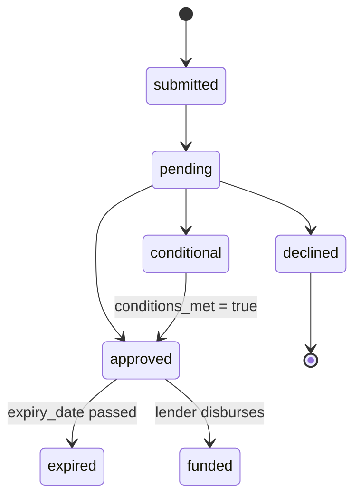
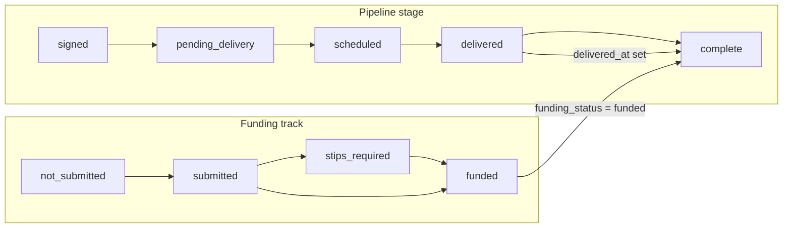
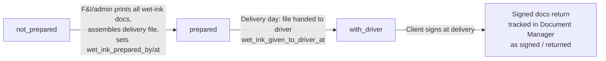

# Lenders, Funding & Bill of Sale — Business Logic Specification

This document specifies lender management, the lender-submission and funding lifecycles, the composition of the Bill of Sale down to every printed line item, and the pre-delivery verification workflows (wet-ink file, registration, void cheque, IDV, insurance). Rules are documented **as implemented** (sources: `client/src/utils/lenderData.js`, `billOfSale.js`, `BillOfSale.jsx`, `server/routes/lenders.js`, `upload.js`, the DB migrations, and `discussions/finance-desk-spec.md`, `pre-delivery-checklist-spec.md`, `delivery-tracker-spec.md`); **Target** marks ReadyLoans behavior per the ADRs. All desk math referenced here is defined in `desking-finance.md`.

## Table of Contents

1. [Lender Management](#1-lender-management)
2. [Lender Submissions](#2-lender-submissions)
3. [Deal Funding Lifecycle](#3-deal-funding-lifecycle)
4. [Bill of Sale — Composition & Line Items](#4-bill-of-sale--composition--line-items)
5. [Pre-Delivery Verification Workflows](#5-pre-delivery-verification-workflows)
6. [Document Storage & Stage Gates](#6-document-storage--stage-gates)
7. [Gaps & Target Resolutions](#7-gaps--target-resolutions)

---

## 1. Lender Management

Two lender stores coexist in the legacy system and must be unified (§7 G-1):

### 1.1 Server-side lender registry (`lenders` table)

| Column | Type / default | Notes |
|---|---|---|
| `id` | UUID PK | |
| `name` | TEXT NOT NULL | |
| `contact_name`, `contact_email`, `contact_phone` | TEXT | Rep contacts |
| `rate_sheet_url` | TEXT | Link to current rate sheet |
| `avg_turnaround_days` | INTEGER DEFAULT 3 | Expected decision time |
| `approval_criteria` | TEXT | Free-text underwriting notes |
| `active` | BOOLEAN DEFAULT true | Soft deactivation flag |
| `store_id` | UUID FK stores (nullable) | Optional store scoping |

Legacy routes (`/api/lenders`): `GET /` (active only, name order), `POST /` (requires `name`). **No update or delete endpoint exists** — a lender can never be edited or deactivated via API (gap).

### 1.2 Client-side lender catalog (`lenderData.js`)

Categories, in display order: `PRIME`, `NEAR_PRIME`, `SUBPRIME`, `IN_HOUSE` (empty — planned), `CAPTIVE`, `CUSTOM`. Seeded Canadian auto-finance defaults (`{id, name, shortName, category, defaultRate: null, notes}`):

| Category | Seeded lenders |
|---|---|
| PRIME | TD Auto Finance, RBC, CIBC, Scotiabank, Desjardins, National Bank, BMO |
| NEAR_PRIME | Scotia Dealer Advantage (SDA), iA Financial, ACC, TD Non-Prime, Eden Park |
| SUBPRIME | Santander Consumer Canada, Iceberg Finance, Quantifi (Desjardins), Rifco, Northlake Financial |
| CAPTIVE | Kia Finance (KFCC) |

- Custom lenders persist in **localStorage** key `dealTracker_customLenders`; hidden default-lender ids in `dealTracker_hiddenLenders`. Custom ids: `custom-{Date.now()}`; category stored `CUSTOM` with the chosen category kept in `customCategory`; shortName defaults to first 6 chars.
- `getAllLenders({includeHidden})` = defaults + custom − hidden. Manage panel: custom lenders editable/deletable; defaults hide/unhide only.
- Fuzzy match `findLenderByName(rawName)` (used by the DealerTrack PDF import): normalize to lowercase alphanumerics; score 100 exact, 80 substring either direction, 70 shortName exact/contained; **match threshold ≥ 70**.

**Target:** one tenant-scoped `lenders` table (tenant_id + store_id, RLS-forced per ADR-007) seeded from the catalog above per organization; category enum in `packages/schemas`; localStorage persistence deleted; full CRUD + deactivate endpoints under `/api/v1/lenders` (ADR-003). `deals.financing_bank` (legacy free text) is migrated to a real `lender_id` FK and dropped (ADR-009).

---

## 2. Lender Submissions

Multi-lender shopping: one deal, many submissions, exactly one selected. No API integration with DealerTrack / RouteOne / CreditApp — F&I agents work those platforms and log results manually (integration is a ReadyLoans roadmap item).

### 2.1 Submission record

Implemented table `deal_submissions` (DB) vs specced `lender_submissions` (finance-desk spec) — the union, which is the Target shape:

| Field | Type | Notes |
|---|---|---|
| `deal_id` | UUID NOT NULL FK deals CASCADE | |
| `lender_id` / `lender_name` | FK lenders (DB) / TEXT (spec) | **Target: FK only** |
| `platform` | TEXT | `'dealertrack'` \| `'creditapp'` \| `'routeone'` \| `'manual'`; dropdown filtered by `stores.submission_platforms` |
| `status` | TEXT DEFAULT `'submitted'` | See §2.2 |
| `approval_amount` | money | Approved ceiling |
| `buy_rate`, `sell_rate` | DECIMAL(5,2) % | Dealer base rate vs customer rate |
| `rate_spread` | GENERATED `(sell_rate − buy_rate)` STORED, NULL-guarded | Reserve basis: `fi_reserve = rate_spread × amount_financed` |
| `term` | INTEGER months | |
| `payment` / `monthly_payment` | money (INTEGER cents in DB) | |
| `conditions` | TEXT | Conditional-approval stipulations |
| `conditions_met` | BOOLEAN DEFAULT false | Conditional → Approved gate |
| `decline_reason` | TEXT | When declined |
| `expiry_date` | DATE | Approval expiry |
| `selected` | BOOLEAN DEFAULT false | Exactly one per deal |
| `submitted_at` / `responded_at` / `funded_at` | TIMESTAMPTZ | Lifecycle stamps |
| `submitted_by` | UUID FK users | |
| `notes`, `store_id`, timestamps | | **Target: + tenant_id** |

### 2.2 Submission status lifecycle

Status enum union: `submitted`, `pending`, `approved`, `conditional`, `declined`, `expired` (spec) + `funded` (DB CHECK).



Server side effects (`PUT /api/lenders/submissions/:id`, as implemented):

- `status ∈ {approved, declined, conditional}` → auto-set `responded_at = now()`.
- `status = 'funded'` → auto-set `funded_at = now()`.
- `status → 'approved'` fires the **`lender.approved` notification event** (spec).

### 2.3 Selection rule

`POST /api/submissions/:id/select`:

1. Marks this submission `selected = true`; **deselects all other submissions on the deal** (kept for records as "not selected").
2. Auto-writes deal finance fields: `selected_lender`, `approval_amount`, `buy_rate`, `sell_rate`, `approval_term`, `monthly_payment`.
3. A selected approval is the prerequisite for advancing the pipeline to **Signed**.

UI: selected approval highlighted with accent border + star; each card shows lender, platform, status, `$approval @ sell% × term = $payment`, `Buy | Sell | Spread`, conditions checkbox, decline reason.

---

## 3. Deal Funding Lifecycle

Funding is a **parallel track, not a pipeline stage**. Badge visible on every deal card regardless of stage.

### 3.1 `deals.funding_status`

| Value | Badge | Meaning |
|---|---|---|
| `not_submitted` | gray (default) | Funding package not yet sent to the bank |
| `submitted` | amber | Package sent, awaiting disbursement |
| `stips_required` | orange | Bank requires additional documents (stipulations) |
| `funded` | green | Money received from lender |

(DB today has no CHECK on `funding_status`; migration data used `not_submitted`/`submitted`/`funded`. **Target:** full 4-value enum with CHECK generated from `packages/schemas`.)

### 3.2 Interaction with the pipeline



- A deal can be **Delivered while `submitted`** (delivered before funded — tracked as the `not_funded` bottleneck / cash-flow risk in reports) or **funded while pending delivery**.
- **Complete requires BOTH** `delivered_at` set AND `funding_status = 'funded'`; the system auto-moves to Complete when the second condition lands. Drag-to-Complete is blocked otherwise (tooltip + API validation).
- Confirmation audit fields: `funded_at`, `funding_confirmed_by UUID FK users`; delivery mirror: `delivered_at`, `delivery_confirmed_by`.

### 3.3 Funding evidence & timing fields (deals)

| Field | Purpose |
|---|---|
| `funding_docs_sent_at` | When the signed doc package went to the bank |
| `funding_submitted_to_bank_at` | When funding was formally requested |
| `funding_proof_url` + `funding_proof_uploaded_at` | Proof-of-funding document (also mirrored at `delivery_checklists.deal_funded_proof_url` via the `funding-proof` upload category) |

### 3.4 Funding SLA alerting

- `stores.funding_overdue_days INTEGER DEFAULT 7`.
- Seeded automation rule: trigger `funding_overdue` `{days_overdue: 7}` → notify `fi_manager` urgency `high`; **escalate to `gm` after 60 minutes unacknowledged**.
- **Target:** the overdue sweep runs as a BullMQ repeatable job (ADR-012); reports surface `not_funded` (delivered-but-unfunded) counts.

---

## 4. Bill of Sale — Composition & Line Items

The printable "Vehicle Purchase Agreement". Payload builder: `getBillOfSaleData(state, deal)` in `client/src/utils/billOfSale.js`; renderer `BillOfSale.jsx`; handed between routes via sessionStorage key `BOS_SESSION_KEY = 'kia_bos_payload_v1'`. Modal actions: Print / Save PDF / Email.

**Cardinal rule (code comment, legal clause 5):** the BoS **stops at "Total To Be Financed"** — no cost of borrowing and no total-with-interest is ever printed; cost-of-borrowing disclosure comes from the lender.

### 4.1 Pricing stack — every line, in print order

| # | Line | Formula / source | Notes |
|---|---|---|---|
| 1 | Total Sale Price | `salePrice` | Negotiated price |
| 2 | OMVIC Fee | `provinceCode === 'ON' ? 10 : 0` | $10 Ontario transaction fee only |
| 3 | Extended Warranty | F&I product id `ext-warranty` price (0 if absent) | Pulled out of the F&I list onto its own line |
| 4 | **Total Vehicle Price** | `salePrice + omvicFee + extWarranty` | |
| 5 | (Trade-In Allowance) | `Σ trades.allowance`, parenthesized credit | Full allowance, not equity |
| 6 | **Total Vehicle Price Less Trade** | `max(0, totalVehiclePrice − tradeAllowance)` | |
| 7 | Tax on total ({taxLabel}) | `computed.taxes.total` from the desking engine | Label: `HST` \| `GST + QST` (QC) \| `GST + PST` \| `GST` \| `Tax`; red `(EXEMPT — Section 87)` tag when `taxExempt` |
| 8..n | Each enabled fee | `fees[]` where `enabled !== false && amount > 0` → `{id, label, amount, taxable}` | Includes `rdprm` (RDPRM in QC / PPSA in ON) |
| n.. | Each enabled F&I product **except `ext-warranty`** | `fiProducts[]` where `enabled !== false && price > 0` | Ext. warranty already on line 3 |
| — | **Total Purchase Price** | `totalLessTrade + taxAmount + feesTotal + fiTotal` | |
| — | **Amount Financed (Subject to Approval)** | `computed.amountFinanced` (desking engine — see `desking-finance.md` §7) | A dead inline alternative formula exists in the code but is superseded: "state engine already has the correct number" |

### 4.2 Financing Terms box — every line

| Line | Source | Notes |
|---|---|---|
| Principal Amount | `financing.amountFinanced` | |
| Life Insurance | product id `life-ins` price | |
| A&H Insurance | product id `disability-ins` price | Accident & Health / disability |
| Loss-of-Income Insurance | blank placeholder | Not wired |
| PST on Insurance | blank placeholder | Not wired |
| Registration / PPSA Fee | fee id `rdprm` amount | |
| **Total To Be Financed** | `= amountFinanced` (same number, different label) — grand row | Final printed money line |
| Payment | `computed.financeMonthly` | |
| Number of Payments ({frequency}) | `term`; `paymentFrequency` hard-coded `'monthly'` | |
| Final Payment | blank | |
| Payments Start Date | `''` (unfilled) | |
| Rate | `interestRate` `% APR` | |
| Term | `term` months | |
| Lender | `selectedLender.{name, shortName}` or null | |

Financing block also carries (not all printed as lines): `cashDown`, `rebatesTotal`, `tradeNetEquity = Σallowance − Σlien`.

### 4.3 Non-pricing sections

- **Header:** dealer name/address/phone + `HST #` and `Reg #` blanks; Date (`toLocaleDateString('en-CA')`) + Delivery Date (blank). Dealer block is **hard-coded `KIA MONT-LAURIER`** with blank address/city/phone — release-blocking white-label gap (ADR-018).
- **Purchaser:** name, co-buyer (blank), address, city, postal code, province (full name from tax table), driver licence (blank), res./cell phone, email; blank Insurance Co. / Policy / Exp / Agent lines. Sourced from the deal row with snake/camel fallbacks (`customer_name`, `postal_code`, `cell_phone`, `salesperson_name`).
- **Purchase clause (italic):** "I, THE PURCHASER, AGREE TO PURCHASE THE FOLLOWING VEHICLE… ON THE TERMS SET OUT ON THE FRONT AND BACK OF THIS PAGE AND ALL ATTACHMENTS."
- **Vehicle description:** condition (`'new'→'New'` else `'Used'`), year, make, model, color, trim, stock #, VIN (monospace), "Distance Travelled On Delivery … Km.", Lic. No blank; Purchaser's Initials line.
- **Left column:** Dealer Guaranty (`____ DAYS OR ____ KMs, whichever comes first`); **used vehicles only:** AS-IS box with statutory as-is disclaimer + initials; Third-Party Warranty blanks; Financing-incentive disclosure ("Will the dealer or salesperson receive any incentive for the financing… Yes/No" + initials); Trade-In section — lien question, GST registration + signature blanks, trade table (year, make/model, VIN, allowance, lien). Trades included only when `allowance || acv || year || vin`.
- **Boxes:** "Sales Final"; signature blocks (Purchaser, Co-Signer, Sales Manager, Sales Person); Comments; footer recall-registration banner.

### 4.4 Page 2 — "Preowned Vehicle: Additional Terms" (12 clauses)

1 Safety Standards Certificate · **1A Subject to Finance Approval — "THIS IS NOT THE FINAL BILL OF SALE… final terms may be adjusted upon lender approval"** · 2 Trade-ins (purchaser warrants ownership / no undisclosed lien; liable for payoff shortfall) · 3 Warranty disclaimer · 4 Purchaser pays tax increases between agreement and delivery · 5 Cost-of-borrowing disclosure comes from the lender, not the BoS · 6 **Title transfers only upon payment in full** · 7 Credit/security/default (collection costs incl. legal fees) · 8 Cancellation only per consumer-protection legislation · 9 Acknowledgements + signature/date · 10 CAMVAP arbitration · 11 CAMVAP-unavailable fallback · 12 Concerns & Rights — OMVIC 1-800-943-6002 / www.omvic.on.ca.

Explicit template note in the render: **"Legal terms above are a template. Final wording must be reviewed and adapted by the Dealer's legal counsel."** The whole legal text is Ontario/OMVIC-oriented; no Quebec (OPC) variant and no French version exists despite QC being the home province — see §7 G-3.

### 4.5 Store BoS configuration

`stores.bill_of_sale_system TEXT DEFAULT 'CAMS'` CHECK (`'CAMS'`,`'Merlin'`,`'Other'`) records which external BoS/paperwork system a store uses; `stores.esign_platform` names the e-sign vendor (DocuSign / OneSpan referenced by the pipeline spec for the Signed stage).

### 4.6 Target composition rules (ADR-018, ADR-021)

- Dealer identity, HST #, registration #, logo → from `tenant_branding` + store record; hard-coded "KIA MONT-LAURIER" is a release blocker.
- Render path: React → HTML → PDF via Playwright/Chromium in a sandboxed BullMQ worker; PDFKit retired.
- Every generated BoS is an **immutable snapshot**: payload persisted at generation time with a content hash into the `documents` bucket/table (`category = 'bill_of_sale'`) — today the payload lives only in sessionStorage and is never persisted (audit finding).
- Bilingual: FR-first document for Quebec tenants with province-correct legal terms (OPC for QC, OMVIC for ON); i18n via server-side `packages/i18n` (ADR-019).
- All money lines printed from cents integers (ADR-009).

---

## 5. Pre-Delivery Verification Workflows

The pre-delivery checklist is the enforcement gate between **Signed** and **Delivered**. Storage: `delivery_checklists` (1:1 with deals, `UNIQUE(deal_id)`). Ten items; most are soft blocks, one is a hard block.

### 5.1 Checklist overview

| # | Item | Block type | Required for | File upload | Status values |
|---|---|---|---|---|---|
| 1 | Insurance | Soft | All deals | Yes (policy doc) | `not_received → received → verified` |
| 2 | Void cheque | Soft | Financed deals only | Yes (scan/photo) | `not_received → received` |
| 3 | Funding | Soft | Financed deals only | No (auto from funding track, §3) | `not_submitted → submitted → stips_required → funded` |
| 4 | IDV | Soft | Financed deals only | No (status tracking) | `not_sent → sent → completed → failed` |
| 5 | Safety inspection | **HARD** | All deals unless sold as-is | Yes (inspection report) | `not_started → sent_to_garage → in_progress → passed → failed` |
| 6 | Vehicle ready | Soft | All deals | No | `not_ready → in_recon → ready` |
| 7 | Wet ink file | Soft | All deals | No | `not_prepared → prepared → with_driver` |
| 8 | Delivery date | Soft | All deals | No | `not_set → confirmed` |
| 9 | Drivers booked | Soft | All deals | No (auto from dispatch) | `not_booked → booked → confirmed` |
| 10 | Registration | Soft | Ontario + Quebec deals only | Yes (registration doc) | `not_started → in_progress → complete` |

Status colors: green = complete (`verified/received/passed/funded/ready/confirmed/complete`), amber = in progress, red = not started; lock icon on the hard-block item.

### 5.2 Enforcement & overrides

- **Hard block:** `safety_required && safety_status !== 'passed'` prevents delivery scheduling with **no override** — legal requirement. Exception: `deals.sold_as_is = true` removes safety from the checklist entirely ("Sold As-Is" badge + specific disclosure document required in the Document Manager).
- **Soft blocks:** incomplete items produce a warning list on "Schedule Delivery"; a manager can **Override & Schedule** — requires selecting the manager (`overridden_by`) and a free-text reason. Logged to `checklist_overrides (id, deal_id FK CASCADE, overridden_by FK users, override_reason NOT NULL, incomplete_items TEXT[], created_at)`; history visible on the deal and in audit reports.
- **Conditional visibility (auto-hidden, excluded from completion %):** cash deals hide Void cheque, Funding, IDV (`idv_required = false`); sold-as-is hides Safety (`safety_required = false`); non-ON/QC client province hides Registration (`registration_required = false`).

Readiness endpoint `GET /api/deals/:id/checklist/readiness` returns `{ready, hard_blocks[], soft_blocks[], hidden_items[]}` with exact predicates:

```
hard:  safety_required && safety_status !== 'passed'
soft:  insurance_status !== 'verified'
       idv_required && idv_status !== 'completed'
       void_cheque_status !== 'received'
       funding_status !== 'funded'
       vehicle_ready_status !== 'ready'
       wet_ink_status === 'not_prepared'
       delivery_date_status !== 'confirmed'
       drivers_status === 'not_booked'
       registration_required && registration_status !== 'complete'
ready: hard_blocks.length === 0 && soft_blocks.length === 0
```

### 5.3 Insurance verification

Fields: `insurance_status ('not_received'|'received'|'verified')`, `insurance_provider` (e.g. "Intact", "TD Insurance"), `insurance_policy_number`, `insurance_effective_date DATE`, `insurance_file_id` (legacy upload category `insurance` → `delivery_checklists.client_insurance_file_url`), `insurance_verified_by UUID`, `insurance_verified_at`.

- **Received** = policy document uploaded. **Verified** = a human confirmed the policy is active, covers the correct vehicle, and `insurance_effective_date` ≤ scheduled delivery date.
- Warning shown when the effective date is AFTER the scheduled delivery date.

### 5.4 Void cheque

Financed deals only (PAD/pre-authorized-debit setup for the lender). Fields: `void_cheque_status ('not_received'|'received')`, `void_cheque_file_id`, `void_cheque_received_at`. **Target:** banking data captured from the cheque is field-level encrypted (AES-256-GCM envelope, ADR-015).

### 5.5 IDV (Identity Verification)

Platform: **CreditApp IDV (creditapp.ca)** — biometric verification against government ID. No API integration today; manual status tracking (CreditApp has an open API — later integration point).

Process: F&I clicks "Send IDV" → enters client phone/email → status `sent` + timestamp → client receives link, scans government ID, takes selfie → CreditApp returns pass/fail → F&I sets `completed` or `failed`; on failure, re-send (resets to `sent`, increments attempts) or escalate.

Fields: `idv_status ('not_sent'|'sent'|'completed'|'failed')`, `idv_sent_at`, `idv_sent_to` (phone or email), `idv_completed_at`, `idv_attempts INTEGER DEFAULT 0`, `idv_notes` (failure reason, e.g. "ID expired", "photo mismatch"), `idv_required BOOLEAN DEFAULT true` (false for cash deals). Endpoint: `POST /api/deals/:id/checklist/idv/send`. "Couldn't verify identity (IDV failed)" is a predefined deal lost-reason.

### 5.6 Wet-ink file

The physical signing package that travels with the driver.



Fields: `wet_ink_status ('not_prepared'|'prepared'|'with_driver')`, `wet_ink_prepared_by UUID`, `wet_ink_prepared_at`, `wet_ink_contents` (document checklist from the Document Manager), `wet_ink_given_to_driver_at`. The legacy deals boolean `wet_ink_signed` records the post-delivery outcome; **delivery confirmation requires wet-ink signed** (§5.9). Driver mobile view shows wet-ink file status ("confirm they have it").

### 5.7 Registration / licensing

Required only when the client province is Ontario or Quebec (`registration_required` auto-set from province; hidden otherwise). Fields: `registration_status ('not_started'|'in_progress'|'complete')`, `registration_province ('ontario'|'quebec'|'other')`, `registration_file_id`, `registration_completed_at`. Related deal fields: `licensing_province` CHECK (`'ontario'`,`'quebec'`,`'other'`), `licensing_completed BOOLEAN` — the reports engine flags `licensing_incomplete` (not delivered AND licensing not completed; SAAQ licensing is a Quebec delivery prerequisite).

### 5.8 Safety inspection (hard block)

Fields: `safety_status ('not_started'|'sent_to_garage'|'in_progress'|'passed'|'failed')`, `safety_garage_name`, `safety_sent_at`, `safety_completed_at`, `safety_report_file_id`, `safety_notes`, `safety_province ('ontario'|'quebec')`, `safety_required BOOLEAN DEFAULT true`.

- Auto-sync from Garage Work Orders: creating a `safety_inspection` work order sets inventory `safety_status='sent_to_garage'` + `safety_sent_at`; completing it writes `passed`/`failed` (`safety_result !== 'passed'` → failed) + `safety_completed_at`, which updates the checklist.
- Garage routing respects capability flags `garages.does_ontario_safety` / `does_quebec_safety` (province-specific certification).
- SLA: `stores.safety_overdue_days DEFAULT 14`; seeded automation rule notifies `used_car_manager` (high), escalates to `gm` after 30 minutes unacknowledged.

### 5.9 Delivery confirmation criteria

Delivery is confirmed when: vehicle physically delivered ✓, wet-ink documents signed ✓, delivery photos received (client-with-vehicle + client-ID, 2 required) ✓, cash/payment collected if applicable ✓, trade-in received back if applicable ✓. Missing items warn but do not hard-block confirmation; confirming moves `pipeline_stage` Scheduled → Delivered and sets `delivered_at` / `delivery_confirmed_by`. Failed deliveries record `delivery_status='failed'` + reason and never auto-advance. Down-payment collection itself follows `deal_payments` statuses `expected → received → confirmed → deposited` (Delivery Tracker scope; money-down/cash-back rollups: `money_down_amount/collected`, `cash_back_amount/sent`).

**Funding vs delivery:** funded is NOT required to deliver (soft block, overridable) — but Complete requires both (§3.2), and delivered-not-funded deals surface as the `not_funded` bottleneck.

---

## 6. Document Storage & Stage Gates

### 6.1 Upload categories (legacy `POST /api/upload/:dealId/:category`, bucket `deal-files`, max 10 MB, path `{dealId}/{category}/{timestamp}_{originalname}`)

| Category | Stored at |
|---|---|
| `insurance` | `delivery_checklists.client_insurance_file_url` |
| `funding-proof` | `delivery_checklists.deal_funded_proof_url` |
| `bill-of-sale` | `sourced_units.bill_of_sale_file_url` (seller's BoS for sourced units) |
| `payment-proof` | `sourced_units.proof_of_payment_url` |

Reads return **signed URLs (3600 s)**; the upload response leaks a public URL (inconsistency — Target: signed-only, private per-tenant prefixes, storage RLS, ADR-013).

### 6.2 `documents` table categories

`'bill_of_sale'`, `'credit_app'`, `'insurance'`, `'registration'`, `'trade_docs'`, `'safety_cert'`, `'financing'`, `'id_verification'`, `'other'` — linked to deal/contact/inventory, with `filename`, `storage_path`, `file_size`, `mime_type`, `uploaded_by`, `store_id`, `deleted_at`.

### 6.3 Stage-gated required documents (`required_documents` seed)

| Pipeline stage | Required documents |
|---|---|
| `signed` | Credit Application (`credit_app`), ID Verification (`id_verification`), Proof of Insurance (`insurance`) |
| `pending_delivery` | Bill of Sale (`bill_of_sale`), Financing Agreement (`financing`), Registration (`registration`) |
| `delivered` | Trade-In Documents (`trade_docs`) |

**Target:** `required_documents` becomes tenant/store-scoped configuration (it is global today) and the checklist readiness endpoint reads it.

---

## 7. Gaps & Target Resolutions

| # | Gap (as found) | Target resolution |
|---|---|---|
| G-1 | Two lender stores: server `lenders` table + client localStorage catalog (`dealTracker_customLenders`/`dealTracker_hiddenLenders`) — not multi-user safe; no lender update/delete API | Single tenant-scoped `lenders` table with full CRUD, per-org seed of the Canadian catalog, category enum in `packages/schemas` |
| G-2 | `deals.financing_bank` free text coexists with `lender_id` FK model; submission status values unvalidated server-side | Real FK only; status enum with DB CHECK from `packages/schemas` (ADR-009/016) |
| G-3 | BoS legal text is Ontario/OMVIC (OMVIC fee, CAMVAP, OMVIC contact) with no Quebec OPC variant and no French version; blanks: delivery date, payments start date, driver licence, co-buyer, insurance lines | Province-specific bilingual templates (FR-first for QC), legal-counsel review per province; all party/insurance fields data-driven (ADR-018/019/021) |
| G-4 | Dealer identity hard-coded `KIA MONT-LAURIER` in the BoS payload (and expense print letterhead) | `tenant_branding` + store record; hardcoded branding is a release blocker (ADR-018) |
| G-5 | BoS payload lives only in sessionStorage (`kia_bos_payload_v1`); never persisted; PDFKit/print path | Immutable snapshot + hash persisted to `documents` at generation; Playwright/Chromium render in workers (ADR-021) |
| G-6 | `funding_status` has no DB CHECK; `stips_required` exists in spec but not in migration data values | 4-value enum with CHECK; migration maps legacy values |
| G-7 | Checklist/override/IDV endpoints unauthenticated; manager override identity is a self-selected dropdown | Better Auth session identity + role checks (manager roles only for override), tenant-scoped RLS (ADR-006/007) |
| G-8 | Upload mixes public URL (upload response) with signed URL (read); single flat bucket, 4 fixed categories | Private per-tenant prefixes, signed URLs only, storage RLS; document categories driven by the `documents` enum (ADR-013) |
| G-9 | IDV/banking/licence data handled as plain fields | Field-level AES-256-GCM envelope encryption + blind HMAC indexes for licence/banking PII (ADR-015) |
| G-10 | `lender.approved` event, funding/safety overdue sweeps depend on a scheduler that does not exist | BullMQ repeatable jobs + notification events; escalation timers honored (ADR-012) |
| G-11 | Wet-ink "contents" checklist references Document Manager wiring that is spec-only | `wet_ink_contents` as JSONB of document ids validated against stage-gated required documents (§6.3) |
| G-12 | `required_documents` and BoS clause set are global, not per-store/province | Tenant/store-scoped config tables |

Related documents: `desking-finance.md` (worksheet math, amount financed, taxes, reserve), `00-overview/ARCHITECTURE-DECISIONS.md` (ADR-001…026).
