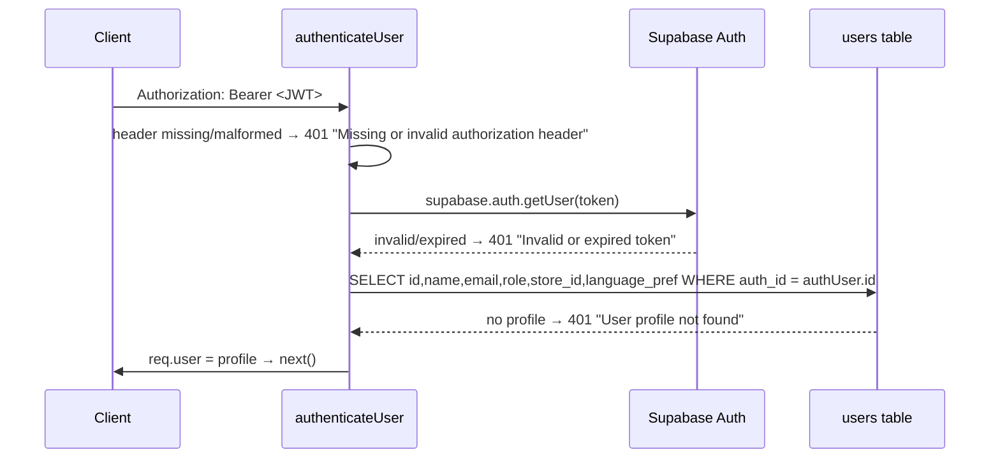

# Platform & Admin Domains — Users, Roles, Stores, Tags, Saved Filters, Search, Bulk Ops, Audit Trail

This document specifies the cross-cutting platform/administration domains **as implemented**: identity (`server/routes/users.js`, `server/middleware/auth.js`), the parallel salespeople registry, the 10-role taxonomy and its (mostly unenforced) permission model, stores and the `scopeToStore` proto-tenancy middleware, the tag catalog, saved filters, global search + command palette, bulk operations, and the `activity_events` audit trail. These are the domains the ReadyLoans rebuild replaces first (tenancy + auth + RLS before anything else, ADR-026), so every current rule, gap, and spoofable path is recorded, with the target behavior marked **Target** and mapped to ADRs.

## Table of Contents

1. [Identity: `users` Table & Auth Middleware](#1-identity-users-table--auth-middleware)
2. [Users API](#2-users-api)
3. [Role Taxonomy & Permission Model](#3-role-taxonomy--permission-model)
4. [Salespeople Registry (Parallel Identity)](#4-salespeople-registry-parallel-identity)
5. [Stores & Store Scoping Today](#5-stores--store-scoping-today)
6. [Tags](#6-tags)
7. [Saved Filters](#7-saved-filters)
8. [Global Search & Command Palette](#8-global-search--command-palette)
9. [Bulk Operations](#9-bulk-operations)
10. [Activity Events Audit Trail](#10-activity-events-audit-trail)
11. [Cross-Domain Gap Summary](#11-cross-domain-gap-summary)
12. [Target Architecture Mapping (ADRs)](#12-target-architecture-mapping-adrs)

---

## 1. Identity: `users` Table & Auth Middleware

### `users` (schema.sql + `20260406_auth_rbac.sql`)

| Column | Type / Rule |
|---|---|
| `id` | UUID PK |
| `name` | TEXT NOT NULL |
| `email` | TEXT UNIQUE NOT NULL (stored lowercased by routes) |
| `role` | TEXT NOT NULL DEFAULT `'salesperson'`, CHECK against the 10-role list (§3); migration re-mapped legacy roles to `salesperson` |
| `language_pref` | TEXT NOT NULL DEFAULT `'en'` CHECK (`'en'`,`'fr'`) — per-user UI language (Bill 96) |
| `auth_id` | UUID UNIQUE → Supabase `auth.users`; index `idx_users_auth_id` |
| `store_id` | UUID FK stores (nullable — owner-type users can be storeless); backfilled to Kia ML |
| `deleted_at` | TIMESTAMPTZ soft delete (F-007) |
| `created_at` | TIMESTAMPTZ DEFAULT now() |

Identity is split: the Supabase Auth account (`auth_id`) carries credentials; the application `users` row carries role, store, and language. RLS on `users` is `USING(true)` for SELECT/INSERT/UPDATE (policy names claim restrictions that are not implemented; no DELETE policy). Realtime enabled.

### `authenticateUser` (`middleware/auth.js`)

`requireRole(...allowedRoles)` is a factory chained after `authenticateUser`: 401 if `req.user` absent; 403 `{error:'Insufficient permissions', required:[...], current: role}` if the role is not allowlisted.

**Enforcement reality:** only **2 of ~150 endpoints** use this middleware (`GET /api/users/me`, `POST /api/users/create-account`). Every other route in the system is unauthenticated. The Supabase client used by all routes is the **service-role key**, bypassing RLS entirely — authorization is therefore purely application-level and, today, nearly absent.

**Frontend auth artifact:** the logged-in user is persisted as `localStorage.kia_user`; the session-restore call (`fetch(\`\${API_URL}/users/me\`)` in `App.jsx`) is broken by an escaped-template-literal bug, so the app always falls back to the forgeable localStorage blob (audit critical — anyone can log in as anyone). Deleted in the rebuild (ADR-006 consequence).

---

## 2. Users API

`/api/users` (the only router with any auth):

| Endpoint | Auth | Behavior |
|---|---|---|
| `GET /api/users` | none (gap) | All users (`id, name, email, role, store_id, language_pref, created_at`), ordered by name |
| `GET /api/users/me` | `authenticateUser` | Returns `req.user` |
| `POST /api/users/login` | none | **LEGACY, marked for removal.** Body `name + email`; looks up by lowercased email; on miss (`PGRST116`) **auto-creates** `{name, email}` and returns it. Passwordless trust-based login — transition artifact, privilege-escalation vector |
| `POST /api/users/create-account` | `authenticateUser` + `requireRole('owner','gm','admin_office')` | Validates `name, email, password (min 8/max 128), role ∈ validRoles`; flow: (1) `supabase.auth.admin.createUser({email, password, email_confirm: true})`; (2) insert profile with `store_id = body.store_id \|\| req.user.store_id` (**tenant inheritance rule** — new accounts default to the creator's store); (3) **compensating action**: if the profile insert fails, the just-created auth user is deleted (manual rollback). 201 |
| `PUT /api/users/:id` | none (**critical gap**) | Updates preferences; strips only `auth_id` and `id`. Because `role` is not stripped and there is no auth, **anyone can set anyone's role to `owner`** (audit critical #2) |
| `PUT /api/users/heartbeat` | planned (lead-routing spec) | **Target:** sets `is_online=true, last_seen_at=now()`; frontend heartbeats every 60s; cron marks users offline after 3 minutes silence. Supersedes: **Socket.IO presence** (connection state + Valkey-backed heartbeats) replaces heartbeat polling entirely (ADR-004) |

**Target (ADR-006):** Better Auth 1.3+ replaces Supabase Auth — organization plugin, memberships `(user, organization, store, roles[])`, MFA (TOTP) required for owner/gm/admin, rotating sessions, HTTPS-only Secure/HttpOnly/SameSite=Lax cookies, per-tenant revocation, admin-only invitations (no self-registration). The passwordless login and the unauthenticated role-update path are deleted, not migrated.

---

## 3. Role Taxonomy & Permission Model

Authoritative 10-role list (CHECK constraint + `validRoles` in `users.js`):

`owner`, `gm`, `sales_manager`, `used_car_manager`, `fi_manager`, `salesperson`, `wholesale_manager`, `logistics`, `admin_office`, `bdc_agent`.

(The Tier-0 spec variant names `fi_agent`/`receptionist` for the last two seats; the deployed CHECK uses `fi_manager`/`bdc_agent` — the deployed list wins and is the one the ADR-006 permission matrix models.)

### Intended permission matrix (Tier-0 spec — **Target**, almost none enforced today)

| Capability | Roles |
|---|---|
| `GET /deals` | all authenticated |
| `POST /deals` | all except logistics, bdc/receptionist |
| `DELETE /deals` | owner, gm, sales_manager |
| Financial summary + report exports | owner, gm, fi_manager |
| Salespeople management (`PUT/DELETE /salespeople`) | owner, gm (+ sales_manager for management screens) |
| `POST /users` (account creation) | owner only per spec; implemented as owner/gm/admin_office |
| Clawback flag | owner, gm, fi_manager |

### Intended row-level visibility (Tier-0 spec — **Target**)

| Role | Stores | Financials | Commissions |
|---|---|---|---|
| owner | all stores | full | full |
| gm | own store | full | full |
| sales_manager | own store | full | own team only |
| fi_manager | own store | full | **hidden** |
| salesperson | **own deals only** | **sale price only** | own only |
| logistics | delivery-related records only | hidden | hidden |

**Current reality:** login works, but roles are almost never enforced — all 10 roles see the same 23-item navigation and every API endpoint is open (audit). The only live checks are the two `users.js` endpoints and the client-side `owner` bypass in `scopeToStore` (§5). `ExpensesPanel` receives `isManager={true}` hardcoded.

**Target (ADR-006/ADR-007):** the 10 roles become Better Auth roles with a permission matrix in `packages/schemas`; memberships allow one person to span stores/orgs with different roles (Hassan's staff span Kia ML / ReadyCar / Riverside); MFA for owner/gm/admin; cost-field visibility implemented as app-level column masking; salesperson row-scoping via RLS + `scopeToOwnDeals`-style policies.

---

## 4. Salespeople Registry (Parallel Identity)

`salespeople` is a **separate, name-keyed table** from `users` — commission pay-plan records, not login accounts. Deals reference them by free-text `deals.salesperson_name` (no FK); leads reference `users.id` via `assigned_to`; the leaderboard bridges the two by fuzzy name matching (see `reports-analytics.md` §10).

Fields: `name NOT NULL`, `commission_rate NUMERIC` (fraction, 0.30 = 30%), `has_pad` (default true) + `pad_amount` (default 1500 dollars), `has_tiered_rate` + `tier_threshold` + `tier_rate`, `override_on` (free-text name of the salesperson whose deals pay this person an override) + `override_rate`, `active` (default true), plus `store_id`, `deleted_at`. Twelve real pay plans are seeded (rates 5%–35%, $1,500 pads, one monthly tier at $60k, two 5% supervisor overrides) — see `commissions-clawbacks.md` §2 for the full table.

`/api/salespeople`:

| Endpoint | Behavior |
|---|---|
| `GET /?active=true\|false` | All, ordered by name; optional exact bool filter |
| `GET /:id` | Single (404 via `.single()`) |
| `POST /` | Inserts **raw `req.body`** — no field whitelist (mass-assignment risk). 201 |
| `PUT /:id` | Updates raw `req.body` (same risk) |
| `DELETE /:id` | Soft: `active=false` ("Salesperson deactivated") |

UI `SalespeopleManager.jsx` (`/salespeople`): rate entered as %, stored fraction (`/100`); `has_pad` default true with `pad_amount` default **$1,500** (0 when unchecked); tier editor ("X% if > threshold"); override editor (`override_on` placeholder "e.g. Hussein Alshawi", "X% on {name}"); deactivated rows at 40% opacity.

**Target (ADR-009):** `users` and `salespeople` unify — `deals.salesperson_id → users.id` real FK; pay plans become a `commission_plans` record attached to the membership; name-ILIKE matching is banned.

---

## 5. Stores & Store Scoping Today

### `stores` table (tenant anchor, F-004)

| Column | Type / Default | Purpose |
|---|---|---|
| `id` | UUID PK | |
| `name` | TEXT NOT NULL | |
| `code` | TEXT UNIQUE NOT NULL | e.g. `KIA-ML`, `READY-AUTO` |
| `province` | TEXT NOT NULL DEFAULT `'QC'` | Drives compliance regime (ON vs QC safety, OMVIC vs Quebec rules) |
| `tax_rate` | DECIMAL(6,4) NOT NULL DEFAULT `0.14975` | Combined per-store rate (QC = GST 5% + QST 9.975%). DECIMAL(6,4) rounds 14.975% → 14.98% (defect; ADR-009 replaces blended rate with split columns) |
| `address`, `city`, `postal_code`, `phone`, `email` | TEXT | |
| `hours` | JSONB | `{mon: "8:00-17:00", ...}` |
| `holiday_calendar` | JSONB | array of dates |
| `aging_threshold_days` | INTEGER NOT NULL DEFAULT 60 | Inventory aging alert threshold |
| `safety_overdue_days` | INTEGER NOT NULL DEFAULT 14 | Safety inspection SLA |
| `funding_overdue_days` | INTEGER NOT NULL DEFAULT 7 | Funding SLA |
| `bill_of_sale_system` | TEXT DEFAULT `'CAMS'` CHECK (`'CAMS'`,`'Merlin'`,`'Other'`) | Ready Group = CAMS, Kia store = Merlin |
| `esign_platform` | TEXT | e.g. OneSpan |
| `created_at` / `updated_at` | trigger-maintained | |

Seeded store #1: `Kia Mont-Laurier` / `KIA-ML` / QC / 0.14975 / Mont-Laurier (UUID `4edcf6fb-d93e-4fe7-8d0f-9440dd60c907` hardcoded in later seeds — fresh-install hazard). The Tier-0 spec additionally planned `slug`, `twilio_number`, `submission_platforms`, `business_hours`, `holiday_dates`, `logo_url`, and an `alert_thresholds JSONB` default `{vehicle_aging_days:30, safety_overdue_days:3, funding_overdue_days:7, deal_rotting_days:7, no_photos_hours:48, recon_cost_threshold:2000}` — white-label knobs that exist only on paper (**Target**, absorbed by `tenant_branding` + store config under ADR-018).

### Stores API (`/api/stores`)

| Endpoint | Behavior |
|---|---|
| `GET /` | All stores ordered by name (projection: id, name, code, province, tax_rate, city, phone, email, aging_threshold_days, safety_overdue_days, funding_overdue_days, bill_of_sale_system) |
| `GET /:id` | Full row (`select *`), 404 on miss |
| `PUT /:id` | Update settings; strips `id`, `created_at`, `updated_at`. **No permission check** — anyone can edit store settings, including tax_rate |

No create/delete endpoints — stores are provisioned out-of-band. `updateStoreSchema` (Zod, `.passthrough()`) exists with bounds (`tax_rate` 0–1, `aging_threshold_days` 1–365, `safety_overdue_days`/`funding_overdue_days` 1–90) but is **wired to nothing**.

### `scopeToStore` middleware — proto-multi-tenancy

Resolution of `req.storeId`, in priority order:

1. `req.headers['x-store-id']` (client-controlled)
2. `req.query.store_id` (client-controlled)
3. `req.user.store_id` (only present after `authenticateUser`)
4. `null`

**Owner bypass:** if `req.user.role === 'owner'` → `req.storeId = null` = "all stores".

Intended usage pattern per route: `if (req.storeId) query = query.eq('store_id', req.storeId)`.

**Why it does nothing today:** `app.use(scopeToStore)` is registered in `server/index.js` **after all 45 routers**, so Express never runs it for any business route (only the health check). Routes must opt in individually; almost none do. Even where honored, the header/query sources are checked **before** the authenticated user's store, so any client can read another store's data by setting `x-store-id` (spoofable tenancy — audit critical).

### `store_id` coverage (data layer)

- **Scoped (column exists):** users, deals, contacts, salespeople, commissions, delivery_checklists, sourced_units, chaser_vehicles, dealer_plates, dispatch_assignments, inventory (NOT NULL), garages (NOT NULL), work_orders (NOT NULL), leads, lead_distribution_config (NOT NULL), conversations, tasks, notifications, activity_events, documents, lenders, deal_submissions, wholesale_listings, automation_rules, clawback_log, pdi_templates, lead_duplicates, lead_scoring_rules, lost_reasons, saved_filters, source_costs, expenses.
- **NOT scoped (gaps):** tags, lead_tags, appointments, lead_communications, message_templates, workflow_sequences/steps/enrollments, lead_assignment_rules/state/history, suppliers, expense_categories, required_documents, deal_stage_history, deal_parties, staff_schedules, lead_scores.
- **RLS:** every policy in the database is `USING(true)` — store isolation is not enforced anywhere at the DB level.

The one good in-tree template: `scoringRules.js` reads rules as `store_id = :storeId OR store_id IS NULL` (store-specific + global fallback) — the pattern ReadyLoans generalizes for tenant-overridable catalogs.

**Target (ADR-007):** hierarchy Platform → Organization (dealer group) → Store (rooftop); `tenant_id` + `store_id` on every business row; RLS ENABLED AND FORCED with `SET LOCAL app.tenant_id/app.user_id/app.store_ids` per transaction; `USING(true)` permanently banned; client-supplied store headers never trusted — tenant context derives from the verified session only; cross-tenant reads (AI network routing, platform admin) via audited SECURITY DEFINER functions.

---

## 6. Tags

Table `tags` (`20260411`): `id`, `name VARCHAR(50) NOT NULL UNIQUE`, `color VARCHAR(7) DEFAULT '#3B82F6'` (hex), `created_at`. **Explicitly global — no store scoping** (comment in migration). Join table `lead_tags` (`lead_id`, `tag_id`, `UNIQUE(lead_id, tag_id)`, cascade delete both ways).

`/api/tags`:

| Endpoint | Behavior |
|---|---|
| `GET /` | All tags, name ASC. Response wrapped `{data: [...]}` (unlike most endpoints) |
| `POST /` | Requires non-blank string `name`; **normalized: trimmed + truncated to 50 chars**; default color `#3B82F6`; **UPSERT on conflict `name`** — idempotent create (re-posting a name updates its color). 201 |
| `DELETE /:id` | Hard delete; DB cascades to `lead_tags` |

Per-lead tagging: `GET /api/leads/:id/tags`, `POST /api/leads/:id/tags {tag_id}`, `DELETE /api/leads/:id/tags/:tagId` (used by `TagPicker`/`TagBadge` and bulk tag-apply, which POSTs per selected lead). LeadsPage fetches tags **per lead in parallel** (N+1 — perf defect). Tags are also a scoring input (`field: 'tags'`, operators `contains/not_contains/in/not_in/exists`).

**Defect for multi-tenancy:** `tags.name` is globally unique — two tenants cannot both have a "VIP" tag. **Target:** `tenant_id` on tags with `UNIQUE(tenant_id, name)`; tag entities extended beyond leads (deals, contacts) with a polymorphic or per-entity join (ADR-007, ADR-009).

---

## 7. Saved Filters

Table `saved_filters` (`20260412`): `name NOT NULL`, `filters JSONB NOT NULL` (serialized LeadsPage querystring state: search, status csv, source csv, assigned_to, score_min/max, has_phone/has_email, created_after/before, lost_reason_id, tags), `is_default`, `is_shared` (personal vs team views), `created_by FK users SET NULL`, `store_id FK SET NULL`, timestamps. Indexes `(store_id, created_by)`, `(is_default, created_by)`.

`/api/saved-filters`:

| Endpoint | Behavior |
|---|---|
| `GET /` | Returns **ALL** filters — the comment says "user's filters + shared" but no owner/shared filtering is applied (gap: every user sees everyone's saved views). Order `is_default DESC, name ASC` |
| `POST /` | Requires `name` + `filters` (400). Defaults `is_default=false`, `is_shared=false`. 201 |
| `PATCH /:id` | Strips id/created_at; stamps `updated_at` |
| `DELETE /:id` | Hard delete |
| `POST /:id/set-default` | **Single-default-per-user rule:** loads the filter's `created_by`, unsets `is_default` on that user's other default, sets this one default. Both writes stamp `updated_at`. 404 if missing |

UI: LeadsPage saved-views dropdown — default shows a star, `is_shared` labeled "share with team".

**Target:** `is_shared=false` filters visible only to `created_by`; shared filters visible tenant-wide; enforced by RLS (`created_by = app.user_id OR is_shared`) rather than route logic (ADR-007).

---

## 8. Global Search & Command Palette

### Server (`GET /api/search?q=`)

- Query trimmed; **minimum length 2**, otherwise returns `{contacts: [], deals: [], vehicles: []}` (the `vehicles` key exists only in this empty shape — vehicle search is referenced but **not implemented**).
- Phone handling: strips non-digits; if ≥ 4 digits, adds `phone_normalized ilike %digits%` to the contacts OR-clause (contacts maintain `phone_normalized` via trigger).
- Contacts query: `deleted_at IS NULL`, OR over `first_name/last_name/email ilike %term%` (+ phone_normalized), **limit 5**.
- Deals query: `deleted_at IS NULL`, OR over `stock_number/vin/customer_name ilike %term%`, **limit 5**.
- Both run in parallel. The raw term is interpolated into the PostgREST `.or()` filter string — commas/parentheses in input can break or manipulate the filter (injection-adjacent defect, audit High).

### Client (`CommandPalette.jsx`)

Ctrl/Cmd+K opens (also the top-bar "/" shortcut); Esc closes; 200ms debounce; arrow-key navigation + Enter. Results: contacts → `/contacts/:id` (subtitle phone or email); deals → `/deal/:id` (label `#stock year make model`, subtitle customer or status). Failures are silent by design.

**Target (Tier-0 spec + ADRs):** `GET /api/v1/search?q=&types=` over weighted tsvector columns (contacts: name weight A, email/phone B, city C; deals get their own search_vector from customer/vehicle/stock); **5 results per type, 20 max**, relevance-ranked; partial matching for phone last-4, VIN last-6, stock-number prefix; recent searches in localStorage (last 5); parameterized queries only; tenant-scoped via RLS (ADR-007); GIN indexes per ADR-008.

---

## 9. Bulk Operations

### `/api/bulk` (`server/routes/bulk.js`)

All four endpoints share the guardrails: `*_ids` must be a non-empty array, **max 50 ids per operation** (400 otherwise), updates filtered by `deleted_at IS NULL`, response reports the updated rows.

| Endpoint | Required body | Behavior |
|---|---|---|
| `POST /bulk/deals/update-stage` | `{deal_ids[], new_status}` | Sets `deals.deal_status = new_status` (legacy status axis — **not** `pipeline_stage`; no transition validation). Returns `{updated, deals:[{id, deal_status}]}` |
| `POST /bulk/deals/reassign` | `{deal_ids[], salesperson_name}` | Sets free-text `salesperson_name` on all. Returns `{updated, deals}`. **Note:** does not recompute commissions |
| `POST /bulk/tasks/complete` | `{task_ids[]}` | Sets `status='completed'`, `completed_at=now()` — only rows currently in `('pending','in_progress')`. Returns `{completed, tasks}` |
| `POST /bulk/tasks/reassign` | `{task_ids[], assignee_id}` | Sets `assignee_id`. Returns `{reassigned, tasks}` |

No auth, no store check, no activity logging, no transaction (single UPDATE each, so atomic per statement but unaudited).

### Lead bulk operations (`/api/leads/bulk`, used by `BulkActionBar.jsx`)

- `PATCH /api/leads/bulk {lead_ids, updates: {status}}` — bulk status change.
- `DELETE /api/leads/bulk {lead_ids}` — bulk delete (confirm dialog).
- Bulk tag apply and bulk follow-up scheduling fan out **per-lead** requests (`POST /leads/:id/tags`, one task POST per lead via `QuickFollowUpModal` with `task_type='follow_up'`, default due tomorrow 09:00).

### Selection UX (LeadsPage)

Checkbox per card; **shift-click range select**; select-all with indeterminate state; Escape clears. `BulkActionBar` is a fixed bottom bar appearing at selection ≥ 1 with: change status, schedule follow-up, add tags, **client-side CSV export** (columns: First Name, Last Name, Email, Phone, Status, Source, Vehicle Interest, Score, Created At — quoted/escaped, filename `leads-export-YYYY-MM-DD.csv`), delete.

**Target (Tier-0 spec + ADRs):** bulk endpoints validate stage transitions, require manager+ roles for cross-user operations, run in a transaction, write one `activity_events` row per affected record, and return `{succeeded: [], failed: [{id, error}]}` (partial success allowed). Bulk >10 rows moves to a server-side function per the guardrails; heavy bulk imports get their own rate-limit bucket (ADR-011) and run via BullMQ (ADR-012).

---

## 10. Activity Events Audit Trail

### Table `activity_events` (F-008)

| Column | Type / Rule |
|---|---|
| `id` | UUID PK |
| `entity_type` | TEXT NOT NULL — `'deal'`, `'contact'`, `'salesperson'`, … |
| `entity_id` | UUID NOT NULL (polymorphic, **no FK**) |
| `action` | TEXT NOT NULL — `'created'`, `'updated'`, `'deleted'`, `'restored'`, `'stage_changed'`, … |
| `actor_id` | UUID FK users ON DELETE SET NULL |
| `old_value` / `new_value` | JSONB |
| `metadata` | JSONB — e.g. `{field:'deal_status', from:'open', to:'complete'}` |
| `store_id` | UUID FK stores |
| `created_at` | TIMESTAMPTZ |

Indexes: `(entity_type, entity_id)`, `actor_id`, `store_id`, `created_at`. **RLS: SELECT + INSERT only — append-only by policy shape** (no UPDATE/DELETE policies). Realtime enabled. A sibling append-only table `deal_stage_history` (`deal_id, from_stage, to_stage, changed_by, changed_at, note`) records pipeline moves specifically.

### Logger (`middleware/activityLogger.js`)

`logActivity({entityType, entityId, action, actorId=null, oldValue=null, newValue=null, metadata=null, storeId=null})` inserts one row. **Fire-and-forget by design:** errors are caught and console-logged; logging never blocks the main operation (best-effort audit, not guaranteed).

### Read API (`GET /api/activity-events`)

- Required query: `entity_type` **and** `entity_id` (400 otherwise) — the trail is only queryable per entity today (no per-actor, per-store, or global feeds).
- Pagination: `limit` (default 50, **max 100**) + `offset` via `.range()`; returns `{data, total}` with exact count; ordered `created_at DESC`.

### Current reality

The audit confirmed the logger is **called by almost nothing** — timelines render empty (the ContactDetail center column is an explicit placeholder "populated after F-008 Activity Events"). The schema and read path work; the write discipline is missing.

### Target

- **Every state change emits an `activity_events` row** — append-only, tenant-scoped (ADR-009 platform invariant). Mutations log only fields that actually changed (diff old vs new).
- Expanded `event_type` catalog (Tier-0 spec): `stage_change, field_update, note_added, email_sent/received, sms_sent/received, call_logged, document_uploaded, document_signed, payment_received, payment_confirmed, task_created/completed, assignment_changed, status_change, approval_received, funding_confirmed, delivery_completed, delivery_failed, work_order_created/completed, photo_uploaded, checklist_item_completed, override_applied, lead_converted, contact_merged, record_created, record_updated` — plus denormalized `user_name`, `title`, `description`, `channel ('sms'|'email'|'phone'|'in_person'|'system')`, and a `contact_id` column so contact timelines aggregate across entities.
- Query API: by entity, by contact, by store (admin), by user (performance tracking); filters on event_type/date/channel; **cursor pagination, 50/page**.
- `ActivityTimeline` UI: per-type icons, filter tabs All | Notes | Communications | Changes | Documents | Payments, relative timestamps, infinite scroll (HubSpot-style three-column record layout).
- Ops: monthly range partitioning pre-planned once the table passes ~10M rows (ADR-008); Law 25 audit obligations (AI decisions, consent changes, PII decrypt events) write to this same trail (ADR-015, ADR-022).

---

## 11. Cross-Domain Gap Summary

| # | Gap | Domain | Severity |
|---|---|---|---|
| 1 | Only 2 endpoints authenticated; service-role key everywhere; RLS decorative (`USING(true)`) | all | Critical |
| 2 | `PUT /api/users/:id` allows unauthenticated role escalation; passwordless `POST /login` auto-creates users | identity | Critical |
| 3 | `scopeToStore` mounted after routes (never runs); client-controlled `x-store-id` outranks the user's store | tenancy | Critical |
| 4 | Forgeable `localStorage.kia_user` session + broken `/users/me` restore | identity | Critical |
| 5 | `users` vs `salespeople` split identity; deals join by name string; leaderboard fuzzy-matches names | identity | High |
| 6 | `stores.PUT` unprotected (tax_rate editable by anyone); store thresholds never consumed by alerts/reports | stores | High |
| 7 | `tags.name` globally unique; tags/appointments/communications/templates/workflows/suppliers not store-scoped | tenancy | High |
| 8 | Saved filters visible to all users regardless of `is_shared`/`created_by` | filters | Medium |
| 9 | Search interpolates raw input into PostgREST `.or()`; vehicles search unimplemented | search | Medium |
| 10 | Bulk ops: no permissions, no transition validation, no activity logging, no per-item error report | bulk | Medium |
| 11 | Activity logger wired to almost no mutations; audit trail empty | audit | High |
| 12 | Mass assignment on salespeople (raw body insert/update) | admin | Medium |

---

## 12. Target Architecture Mapping (ADRs)

| Domain | Today | Target |
|---|---|---|
| Auth | Supabase Auth + 2 protected endpoints + localStorage fallback | Better Auth 1.3+ (organization plugin), MFA for managers, DB-backed rotating sessions, cookie-based (ADR-006) |
| Roles | 10-role CHECK, unenforced | Same 10 roles as Better Auth roles + permission matrix in `packages/schemas`; memberships `(user, org, store, roles[])` (ADR-006) |
| Identity model | users + salespeople split | Unified users; `deals.salesperson_id → users.id`; pay plans on membership records (ADR-009) |
| Tenancy | `store_id` columns + dead middleware | Platform → Organization → Store; `tenant_id/store_id` NOT NULL; RLS ENABLED AND FORCED with `SET LOCAL` context; `USING(true)` banned (ADR-007) |
| Store config | `stores` row, partially dead fields | Store record + `tenant_branding` (logo, OKLCH colors, fonts, domains) powering runtime white-label + server-side email/PDF branding (ADR-018); alert thresholds consumed by BullMQ repeatable jobs (ADR-012) |
| Presence | 60s heartbeat plan | Socket.IO presence for agent online state, tenant-namespaced rooms (ADR-004) |
| Tags / filters | Global tags, leaky filters | Tenant-scoped tags `UNIQUE(tenant_id, name)`; RLS-enforced filter visibility (ADR-007) |
| Search | ILIKE OR-strings | tsvector weighted search, typed contract `GET /api/v1/search`, tenant-scoped, GIN-indexed (ADR-003, ADR-008) |
| Bulk ops | 4 open endpoints, max 50 | Transactional, permission-checked, per-item results, activity-logged; big jobs via BullMQ + tenant rate limits (ADR-011, ADR-012) |
| Audit | Best-effort logger, unused | Mandatory activity events on every mutation, append-only, partition-ready, feeding notifications and compliance evidence (ADR-008, ADR-009) |
| Validation | Zod schemas exist, unwired; `.passthrough()` | Zod 4 shared schemas wired into every route via ts-rest contracts; `.passthrough()` banned (ADR-016) |
