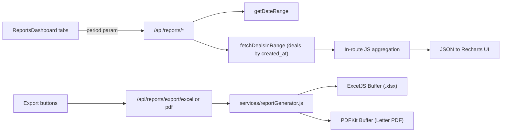

# Reports & Analytics — Report Types, Exact Metrics, Exports, and Analytics Engines

This document specifies the reporting and analytics layer **exactly as implemented** in `server/routes/reports.js`, `server/services/reportGenerator.js` (ExcelJS + PDFKit), `server/routes/sourceRoiAnalytics.js`, `server/routes/winLossAnalytics.js`, and the client components under `client/src/components/reports/` plus `SourceROIPage.jsx`, `WinLossPage.jsx`, `SalespersonLeaderboard.jsx`, and `ActivityHeatmap.jsx`. Every formula, status filter, column, and color threshold is captured so the ReadyLoans rebuild can port the *intended* metrics into `packages/core` with tests (ADR-001, ADR-026) while fixing the documented defects. Planned-but-unbuilt behavior (GM Command Center, per-unit P&L, scheduled reports) is marked **Target**.

## Table of Contents

1. [Report Surface Map](#1-report-surface-map)
2. [Period Model](#2-period-model)
3. [Report 1 — Sales Performance](#3-report-1--sales-performance)
4. [Report 2 — Commission Tracker](#4-report-2--commission-tracker)
5. [Report 3 — Financial Summary](#5-report-3--financial-summary)
6. [Report 4 — Inventory Pipeline](#6-report-4--inventory-pipeline)
7. [PDF / Excel Export Engine](#7-pdf--excel-export-engine)
8. [Source ROI Analytics](#8-source-roi-analytics)
9. [Win/Loss Analytics](#9-winloss-analytics)
10. [Salesperson Leaderboard](#10-salesperson-leaderboard)
11. [Activity Heatmap](#11-activity-heatmap)
12. [Formula Quick Reference](#12-formula-quick-reference)
13. [Known Defects & Inconsistencies](#13-known-defects--inconsistencies)
14. [Target: GM Command Center, Per-Unit P&L, Scheduled Reports](#14-target-gm-command-center-per-unit-pl-scheduled-reports)
15. [Target Architecture Mapping (ADRs)](#15-target-architecture-mapping-adrs)

---

## 1. Report Surface Map

`ReportsDashboard.jsx` (route `/reports`) is a tab shell with four tabs. Periods `weekly | monthly | ytd` (default `ytd`) are passed to the first three tabs; Inventory Pipeline takes no period.

| Tab | Component | Data endpoint | Export endpoints |
|---|---|---|---|
| Sales | `reports/SalesPerformance.jsx` | `GET /api/reports/sales-performance?period=` | `GET /api/reports/export/{excel\|pdf}?type=sales&period=` |
| Commissions | `reports/CommissionTracker.jsx` | `GET /api/reports/commissions?period=` | `...?type=commissions&period=` |
| Financial | `reports/FinancialSummary.jsx` | `GET /api/reports/financial-summary?period=` | `...?type=financial&period=` |
| Inventory | `reports/InventoryPipeline.jsx` | `GET /api/reports/inventory-pipeline` (no params) | `...?type=inventory&period=ytd` (period hardcoded) |

Standalone analytics pages (outside the Reports shell):

| Page | Route | Endpoint |
|---|---|---|
| Source ROI | `SourceROIPage.jsx` | `GET /api/analytics/source-roi?period=` + `GET/POST/PATCH /api/source-costs` |
| Win/Loss | `WinLossPage.jsx` | `GET /api/analytics/win-loss?period=` |
| Leaderboard | `SalespersonLeaderboard.jsx` | Client-side joins over `GET /api/salespeople`, `/api/deals`, `/api/users`, `/api/leads` |
| Activity Heatmap | `ActivityHeatmap.jsx` (LeadDetail → Insights tab) | `GET /api/leads/:id/communications` |
| Accounting journals | `pages/AccountingPage.jsx` | See `expenses-accounting.md` |



No report endpoint applies authentication, store scoping, or `deleted_at` filtering (see §13). All aggregation happens in JavaScript in the route handler after fetching raw deal rows.

---

## 2. Period Model

### Reports (`getDateRange(period, dateFrom, dateTo)` in `reports.js`)

| Input | Resolved range |
|---|---|
| `date_from` AND `date_to` both provided | Explicit range wins |
| `period=weekly` | `now − 7 days` → `now` |
| `period=monthly` | First day of the **current calendar month** → `now` |
| anything else (default `ytd`) | Jan 1 of current year → `now` |

`fetchDealsInRange(from, to)` selects **all** `deals` rows with `created_at` in `[from, to]`, newest first. It does **not** filter `deleted_at IS NULL`, does **not** exclude `deal_status='cancelled'`, and does **not** filter by `store_id` — soft-deleted and cancelled deals inflate sales/financial reports (defect; the inventory report is the only one that excludes cancelled).

### Analytics (`periodToDate(period)` in ROI and win/loss)

| `period` | Since |
|---|---|
| `30d` | now − 30 days |
| `90d` (default) | now − 90 days |
| `6m` | same day 6 months back |
| `1y` | same day 1 year back |
| `all` | no lower bound (null) |

---

## 3. Report 1 — Sales Performance

**Endpoint:** `GET /api/reports/sales-performance?period=&date_from=&date_to=`

### Per-salesperson aggregation

Deals grouped by `salesperson_name` (a free-text string on the deal, fallback bucket `'Unknown'` — there is no FK to `salespeople`). Per person:

| Field | Formula |
|---|---|
| `deals` | count of deals |
| `completed` | count where `deal_status === 'complete'` |
| `totalGross` | `Σ (sale_price − vehicle_cost)` — **excludes** F&I |
| `totalSales` | `Σ sale_price` |
| `totalFI` | `Σ fi_reserve` |

Sorted by `totalGross` DESC.

### Trends

- **Monthly trend** — keyed `YYYY-MM` from `created_at`: `{deals, totalGross}` where `totalGross = Σ (sale_price − vehicle_cost + fi_reserve)`. Note the trend gross **includes** F&I while the per-person `totalGross` does not (intentional in-code, but a naming trap — see §13).
- **Weekly trend** — keyed by week-start date (Sunday: `date − dayOfWeek`), ISO date `slice(0,10)`; same F&I-inclusive formula.

### Summary block

| Field | Formula |
|---|---|
| `totalDeals` | deal count in range |
| `completedDeals` | count where `deal_status === 'complete'` |
| `conversionRate` | `completedDeals / totalDeals × 100`, 1 decimal, **returned as a string** via `toFixed` |
| `totalGross` | `Σ (sale_price − vehicle_cost + fi_reserve)` (F&I-inclusive) |
| `avgGrossPerDeal` | `totalGross / totalDeals`, 2-decimal string |

### UI (`SalesPerformance.jsx`)

- 5 metric cards: Total Deals, Completed Deals, Conversion Rate (blue), Total Gross (green, CAD `en-CA` currency 0-decimals), Avg Gross.
- Horizontal bar chart "Deals by Salesperson" (Recharts, fill `#1e3a5f`, Y-axis category width 120).
- Line chart "Gross Trend" (`#c4342d`; `weeklyTrend` when period=weekly using the `week` X-key, else `monthlyTrend` using `month`; Y-axis formatted `$Xk`).
- Leaderboard table columns: `#`, Salesperson, Deals, Completed, Total Sales, Gross Profit (green), F&I Reserve — zebra-striped, ranked in server sort order (gross DESC).
- Export buttons open `window.open` to the Excel (green button) / PDF (red button) export endpoints.

---

## 4. Report 2 — Commission Tracker

**Endpoint:** `GET /api/reports/commissions?period=&date_from=&date_to=&salesperson=`

Queries `commissions` **inner-joined** with `deals` (`deals!inner(created_at, sale_price, vehicle_cost, fi_reserve, deal_status, salesperson_name)`); the date range applies to the **deal's `created_at`**, not the commission's own date. Optional `salesperson` filter uses `ilike` on `commissions.salesperson_name` with no added wildcards (i.e., case-insensitive exact match).

Commission rows are **precomputed** by the deal-save calculator (see `commissions-clawbacks.md`); this endpoint only aggregates: `salesperson_name`, `commission_rate`, `pad_amount`, `gross_for_commission`, `commission_amount`, `override_salesperson`, `override_amount`.

### Aggregation

Per person: `deals` count, `totalGrossForCommission = Σ gross_for_commission`, `totalCommission = Σ commission_amount`, `rate` and `padAmount` taken from the **first row seen** (assumed constant per person). Sorted `totalCommission` DESC.

**Override second pass:** for every row with `override_salesperson` set and `override_amount > 0`, `override_amount` is credited to the **override recipient's** bucket as `totalOverrides` (a synthetic bucket with `rate=0, padAmount=0` is created if that person has no own deals in range). Business rule: a supervisor earns an override commission on another salesperson's deals (e.g., Hassan Alabboudy 5% on Hussein Alshawi's deals).

**Monthly breakdown** keyed `YYYY-MM` of the joined deal's `created_at` (fallback commission `created_at`): `{total: Σ commission_amount, count}`.

The response also includes the raw `commissions` array (full rows with joined deal fields).

### UI (`CommissionTracker.jsx`)

- Summary cards: **Total Commissions** = `Σ (totalCommission + totalOverrides)` across all people (green); Salespeople count; Total Deals.
- Monthly commissions bar chart (`#2d6a4f`, Y formatted `$Xk`).
- Commission breakdown table columns: Salesperson, Deals, Rate (`rate × 100` 0-decimals `%`), Pad, Gross for Commission, Commission (green), Overrides (blue), **Total Earned** = `totalCommission + totalOverrides` (bold). Footer row with column totals.

---

## 5. Report 3 — Financial Summary

**Endpoint:** `GET /api/reports/financial-summary?period=&date_from=&date_to=`

### Summary

| Field | Formula |
|---|---|
| `totalSales` | `Σ sale_price` |
| `totalCost` | `Σ vehicle_cost` |
| `totalGross` | `totalSales − totalCost` |
| `totalFI` | `Σ fi_reserve` |
| `totalNet` | `totalGross + totalFI` |
| `avgGrossPerDeal` | `totalNet / dealCount`, 2 dp — **misnamed: it is average NET per deal** |

### Money flow

| Field | Formula |
|---|---|
| `moneyDownTotal` | `Σ money_down_amount` |
| `moneyDownCollected` | `Σ money_down_amount` where `money_down_collected = true` |
| `moneyDownOutstanding` | `moneyDownTotal − moneyDownCollected` |
| `cashBackTotal` | `Σ cash_back_amount` |
| `cashBackSent` | `Σ cash_back_amount` where `cash_back_sent = true` |
| `cashBackPending` | `cashBackTotal − cashBackSent` |
| `lienTotal` | `Σ lien_amount` where `has_lien = true` (trade-in lien payoffs owed) |

### Breakdown & trend

- **Retail vs wholesale** by `sale_type ∈ {retail, wholesale}`: per side `{count, totalGross}` where gross = `sale − cost + fi_reserve`.
- **Monthly trend** keyed `YYYY-MM`: `{sales, cost, gross (sale − cost, F&I excluded), fi, count}`.
- **No GST/QST/HST computation exists anywhere in the report layer.** The only tax config is `stores.tax_rate` (0.14975 for Quebec = GST 5% + QST 9.975%), which reports never read. Per-deal tax splits are a Target (ADR-009; see `expenses-accounting.md` §Roadmap).

### UI (`FinancialSummary.jsx`)

- 6 metric cards: Total Sales, Total Cost (red), Gross Profit (green), F&I Reserve (blue), Net Gross (dark green), Avg Gross.
- Money Flow panel: two progress bars — money-down collected % (green bar) with Collected/Outstanding sub-labels; cash-back sent % (blue bar) with Sent/Pending sub-labels; Total Liens line (orange).
- Retail vs Wholesale donut (innerRadius 50 / outerRadius 80, palette `#1e3a5f`/`#c4342d`) + two count cards (retail indigo, wholesale orange) with gross sub-labels.
- Monthly Revenue stacked bar: Gross Profit `#2d6a4f` + F&I Reserve `#7b2d8b`, stackId `a`.

---

## 6. Report 4 — Inventory Pipeline

**Endpoint:** `GET /api/reports/inventory-pipeline` (no parameters)

Operates on all deals where `deal_status != 'cancelled'` (soft-deleted rows still included). This is a **deal-based** inventory view — it predates the standalone `inventory` table and reads the legacy `vehicle_status`/`finance_status` fields on deals.

| Output | Definition |
|---|---|
| `vehicleStatus` | counts for `vehicle_status ∈ {incoming, at_garage, delivered}` |
| `financeStatus` | counts for `finance_status ∈ {pending, approved, funded}` |
| `avgDaysToDelivery` | mean of `(delivery_date − created_at)` in days over deals having both, 1 dp |
| `aging[]` | deals with `vehicle_status !== 'delivered'` → `{id, stock_number, vehicle: "year make model", customer, salesperson, vehicle_status, finance_status, days_old = floor((now − created_at)/86400s), created_at}`, sorted `days_old` DESC |
| `bottlenecks.not_funded` | delivered but `finance_status !== 'funded'` (delivered-not-funded = cash-flow risk) |
| `bottlenecks.no_delivery_date` | `deal_status === 'open'` AND no `tentative_delivery_date` |
| `bottlenecks.licensing_incomplete` | not delivered AND `licensing_completed` falsy (SAAQ/licensing gate) |
| `totalActive` | count of non-cancelled deals |

### UI (`InventoryPipeline.jsx`)

- Summary cards: Total Active, Avg Days to Delivery (blue), Not Funded (red), No Delivery Date (orange).
- Two funnels (`FunnelBar`, min visual width 5%): Vehicle Pipeline (incoming yellow / at_garage blue / delivered green) and Finance Pipeline (pending yellow / approved blue / funded green), each with count and `% of totalActive`.
- Bottleneck alert panel (red) listing the three counts when any is > 0.
- Aging Inventory table (header `#b45309`), **top 50 rows only**, click navigates `/deal/:id`. Row highlight: `days_old > 60` → `bg-red-50`; `> 30` → `bg-yellow-50`. Days value: bold red > 60, yellow > 30, gray otherwise. These 30/60 thresholds are hardcoded — the per-store `aging_threshold_days` config (default 60) is not consumed here (defect).
- Export always sends `period=ytd`.

---

## 7. PDF / Excel Export Engine

**Service:** `server/services/reportGenerator.js`. API: `generateExcel(type, deals, commissions, period)` → `.xlsx` Buffer; `generatePDF(type, deals, commissions, period)` → PDF Buffer. `type ∈ {sales, commissions, financial, inventory}`.

**Export endpoints:** `GET /api/reports/export/excel` and `GET /api/reports/export/pdf` with query `type` (default `financial`; `type=commissions` triggers the extra commissions fetch with deal join over the range) and `period`/`date_from`/`date_to`. Response streams the buffer with `Content-Disposition: attachment; filename=report-<type>-<period>.xlsx|.pdf`; Excel MIME `application/vnd.openxmlformats-officedocument.spreadsheetml.sheet`.

**Branding (hardcoded — white-label release blocker per ADR-018):** header color `#1e3a5f` (navy), accent `#c4342d` (red), workbook creator "Kia Mont-Laurier", PDF Letter size with header "Kia Mont-Laurier" + `Report: {Type} | Period: {PERIOD}` + generation timestamp (`en-CA` locale). Currency formatted CAD (`en-CA`), Excel numFmt `$#,##0.00`. English-only output (Bill 96 gap — ADR-019 Target: server-side i18n).

### Per-type layout

| Type | Excel | PDF |
|---|---|---|
| `sales` | Columns: Salesperson, Deals, Completed, Conv. Rate, Total Sales, Total Gross, Total F&I. Grouped by `salesperson_name` (fallback 'Unknown'), sorted Total Gross DESC. **Total Gross excludes F&I** (separate column). | Sales-by-person table where per-person gross = `Σ(sale_price − vehicle_cost + fi_reserve)` — **includes F&I, diverging from the Excel sheet** |
| `commissions` | Columns: Salesperson, Deals, Rate (%), Pad, Gross for Comm., Commission, Overrides, **Total Earned = commission + overrides**; second pass credits `override_amount` to `override_salesperson` (synthetic row rate/pad 0 if needed); rate/pad from person's first commission row; sorted Total Earned DESC | Salesperson / Deals / Commission / Overrides / Total table, same aggregation |
| `financial` | Metric rows: Total Deals, Total Sales Revenue, Total Cost, Gross Profit, Total F&I Reserve, Net Gross; then Money Down block (Total/Collected/Outstanding); then Cash Back block (Total/Sent/Pending) | "Summary" + "Money Flow" sections mirroring Excel |
| `inventory` | Per-deal rows: Stock #, Vehicle ("year make model"), Customer, Salesperson, Vehicle Status, Finance Status, **Days Old = floor((now − created_at)/86400s)** — sorted oldest first; excludes `deal_status='cancelled'` | Counts of active by `vehicle_status`, plus "Aging Inventory" table of non-delivered units sorted days DESC (no threshold applied) |

PDF tables paginate at `y > 720` with zebra striping `#f0f4f8` on even rows.

**Target (ADR-021):** PDFKit is replaced by React → HTML → PDF via headless Chromium (Playwright) in sandboxed BullMQ workers; ExcelJS is retained. Templates consume the `tenant_branding` record and `packages/i18n` resources; generated files become immutable snapshots with hashes.

---

## 8. Source ROI Analytics

**Endpoint:** `GET /api/analytics/source-roi?period=` (`30d|90d|6m|1y|all`, default `90d`). Marketing spend lives in `source_costs` (see `expenses-accounting.md` §Source Costs).

### Computation pipeline

1. Leads: `deleted_at IS NULL`, `created_at >= since` — fields `id, source, status, converted_deal_id, created_at`.
2. Revenue: for leads with `converted_deal_id`, fetch those deals' `sale_price`. **Revenue = gross sale price of the converted deal, not profit.**
3. Spend: all `source_costs` rows with `month >= 'YYYY-MM-01'` of the since-date; aggregated `spendBySource[source]` and `monthlySpend["YYYY-MM:source"]`.
4. Per-source aggregation (sources with spend but zero leads still included; `source = null` bucketed `'unknown'`):

| Metric | Formula (all guarded to 0 on zero denominator/spend) |
|---|---|
| `totalLeads` | lead count |
| `convertedLeads` | leads where `status === 'converted'` **OR** `converted_deal_id` set |
| `totalRevenue` | `Σ sale_price` of converted leads' deals |
| `costPerLead` | `spend / totalLeads` (2 dp) |
| `costPerConversion` | `spend / convertedLeads` (2 dp) |
| `conversionRate` | `convertedLeads / totalLeads × 100` (1 dp) |
| `roi` | `(totalRevenue − spend) / spend × 100` (1 dp, percent return) |

Sources sorted by `roi` DESC.

5. Totals: `totalLeads`, `totalConverted`, `totalSpend` (2 dp), `totalRevenue` (2 dp), `avgCostPerLead = totalSpend/totalLeads`, `avgConversionRate = totalConverted/totalLeads × 100` (1 dp), `overallROI = (totalRevenue − totalSpend)/totalSpend × 100` (1 dp).
6. Monthly breakdown per `month:source` bucket: `{leads, converted, revenue, spend, costPerLead, roi}`, sorted month ASC then source ASC.

No store filtering (multi-tenant gap).

### UI (`SourceROIPage.jsx`)

- ROI badge colors: `≥ 200%` green, `≥ 0` yellow, `< 0` red.
- Monthly ad-spend entry: `GET /api/source-costs?month=YYYY-MM-01`; create/overwrite via `POST /api/source-costs {source, month, spend}` (upsert); inline edit `PATCH /api/source-costs/:id {spend}`. Source list includes all lead sources plus `fluent_form`, `chatbot`, `unknown`.
- Display format `$Xk` when ≥ 1,000; horizontal bar charts for leads/spend/revenue per source.

---

## 9. Win/Loss Analytics

**Endpoint:** `GET /api/analytics/win-loss?period=` (same period model as ROI).

**Classification constants:** `WON_STATUSES = ['converted']`, `LOST_STATUSES = ['lost']`.

- **won** := `status ∈ WON_STATUSES` **OR** `converted_deal_id` set (a lead with a linked deal counts as won even if its status was never updated).
- **lost** := `status ∈ LOST_STATUSES`.
- **open** := neither. `decided = won + lost`; open leads are excluded from rate denominators.

| Output | Definition |
|---|---|
| `summary` | `{total, won, lost, open, winRate = won/decided×100 (1 dp), lossRate = lost/decided×100 (1 dp)}` |
| `lostReasons[]` | counts by joined `lost_reasons.name` (fallback `'Unknown'`), sorted count DESC, each with `percentage = count/lostTotal×100` (1 dp). `name_fr`/`icon` are fetched but only the EN name is used in aggregation (Bill 96 gap) |
| `monthlyTrend[]` | keyed `created_at.slice(0,7)` — bucketed by lead **creation** month, not decision month: `{month, won, lost, winRate = won/(won+lost)×100}` sorted ASC |
| `sourcePerformance[]` | per source (null → `'unknown'`): `{total, won, lost, winRate}`, sorted total DESC |

### UI (`WinLossPage.jsx`)

Summary cards (`winRate ≥ 50` green else red); lost-reason horizontal bars; monthly stacked won/lost bars; source performance table highlighting the best source (green background) and worst (red background).

---

## 10. Salesperson Leaderboard

`SalespersonLeaderboard.jsx` computes everything **client-side** by joining four full-list fetches — a direct consequence of the missing FK model:

- salespeople ↔ deals: **case-insensitive string match** on `deals.salesperson_name`.
- salespeople ↔ users: fuzzy full-name scoring `matchSalespersonToUser` — exact 100, startsWith + space 80, startsWith 70, first-name equal 60, any-name-part 30.
- users ↔ leads: `leads.assigned_to === user.id`.

| Metric | Definition |
|---|---|
| `closedDeals` | deals with pipeline_stage/status in `['won','closed','delivered']` — **does not include `'complete'`**, mismatching the canonical pipeline vocabulary (defect) |
| `activeLeads` | leads not in `['converted','lost','closed']` |
| `conversionRate` | `closedDeals / (spLeads + spDeals) × 100` |
| `avgResponseTime` | mean of `first_response_at − created_at` in hours — field name drifts from the canonical `first_contacted_at` (defect) |

Response-time badge: `< 1h` green, `< 4h` yellow, else red (note: inconsistent with the 5/15/30-minute SpeedToLead bands used in the lead module). Periods `30d/90d/6m/1y/all` filter by `created_at` client-side. Rank icons: 1 = gold trophy, 2 = silver, 3 = bronze. Sort options: deals / conversion / response / leads. The page is hardcoded English (Bill 96 gap).

---

## 11. Activity Heatmap

`ActivityHeatmap.jsx` renders on the LeadDetail **Insights** tab from the lead's communications timeline (`lead_communications`):

- **7×24 grid** (weekday × hour) of communication counts; cell intensity is a 5-step emerald scale by `count / max` ratio.
- Filter chips: `all / call / sms / email / inbound / outbound`.
- **"Best Contact Times"** = top-3 busiest slots.
- Per-type totals: calls / texts / emails / visits.

**Target:** at multi-tenant scale this becomes a store-level heatmap (all leads, not one) computed SQL-side, feeding the AI outbound-call scheduler's quiet-hours-aware time picking (ADR-020, ADR-022).

---

## 12. Formula Quick Reference

| Metric | Formula |
|---|---|
| Deal gross (per-person, Excel) | `sale_price − vehicle_cost` |
| Deal net / trend gross | `sale_price − vehicle_cost + fi_reserve` |
| Conversion rate (sales) | `completedDeals / totalDeals × 100` (`deal_status='complete'`) |
| Commission total earned | `Σ commission_amount + Σ override_amount credited to recipient` |
| Money down outstanding | `Σ money_down_amount − Σ collected` |
| Cash back pending | `Σ cash_back_amount − Σ sent` |
| Avg days to delivery | `mean(delivery_date − created_at)` in days |
| Days old (aging) | `floor((now − created_at) / 86400s)` |
| Cost per lead | `spend / totalLeads` |
| Cost per conversion | `spend / convertedLeads` |
| Source ROI % | `(revenue − spend) / spend × 100` (revenue = converted deals' sale_price) |
| Win rate | `won / (won + lost) × 100`; won = `'converted'` OR `converted_deal_id`; open excluded |
| Target per-unit P&L | see §14 |

---

## 13. Known Defects & Inconsistencies

These must **not** be ported; ReadyLoans ports the intended rule (ADR-026: legacy is the executable spec, ADRs win conflicts).

| # | Defect | Impact |
|---|---|---|
| 1 | `fetchDealsInRange` ignores `deleted_at` and includes cancelled deals | Sales/commissions/financial reports overstate volume and gross |
| 2 | Gross formula drift: per-person Excel gross excludes F&I; PDF per-person and all trends include it | Same "gross" label means two numbers |
| 3 | Rates returned as strings (`toFixed`) | Type inconsistency for API consumers |
| 4 | **Dollars-vs-cents**: deals money columns were migrated to INTEGER cents (F-007) but report code and `fmt()` in the UI treat values as dollars (no `/100`) | 100× display/aggregation errors on cents-era rows — audit-confirmed critical |
| 5 | No auth, no store scoping on any report/analytics endpoint | Cross-tenant leakage in multi-store deployment |
| 6 | Unbounded queries + PostgREST 1,000-row default cap | Past ~1,000 deals, YTD reports and exports silently truncate — wrong totals and commission-tier checks |
| 7 | Aging thresholds 30/60 hardcoded in report + UI; `stores.aging_threshold_days` never read | Per-store config is dead |
| 8 | Kia Mont-Laurier branding + English hardcoded in generator | White-label (ADR-018) and Bill 96 (ADR-019) blockers |
| 9 | Leaderboard joins by fuzzy name matching; `closedDeals` vocabulary mismatch; `first_response_at` vs `first_contacted_at` drift | Wrong attribution; fixed by real FKs + single enum source (ADR-009, ADR-016) |
| 10 | Win/loss monthly trend buckets by lead creation month, not decision month | Trend misattributes late decisions to old months |
| 11 | Commission report aggregates rate/pad from "first row seen" | Wrong when a plan changed mid-period |
| 12 | No tax reporting at all (no GST/QST/HST collected reports) | Blocked on per-deal tax split columns (Target, ADR-009) |

---

## 14. Target: GM Command Center, Per-Unit P&L, Scheduled Reports

Planned in the master spec (§3.5 Reporting & Analytics upgrade); nothing below is built. All Target.

### 14.1 GM Command Center (Target)

Default view on login for `gm` and `owner` roles. Stats row: deals in pipeline by stage; total gross this month (`Σ total_gross` of deals completed this month); units sold this month (deals reaching `delivered`); avg front gross; avg back gross; funding pipeline (count + $ submitted-not-funded); inventory count; units > 30 days; leads this month; lead conversion rate (converted/total this month).

Charts: deals by stage (horizontal bar); monthly gross trend (line, last 12 months); sales by salesperson (bar — units + gross this month); inventory aging distribution (donut 0-30 / 30-60 / 60+); lead sources (pie); funding status (stacked bar). Tables: deals needing attention (**rotting > 7 days in stage**, overdue funding, incomplete checklists); today's deliveries; recent activity (last 20 stage changes / leads / completions).

Endpoint: `GET /api/reports/gm-dashboard` (ReadyLoans: `GET /api/v1/reports/gm-dashboard`, ts-rest contract per ADR-003).

### 14.2 Per-unit P&L (Target)

Rendered on every deal and inventory record (`GET /api/reports/unit-pl/:dealId`). Canonical formula (all INTEGER cents per ADR-009):

```
REVENUE      = sale_price + fi_products + fi_reserve          (e.g. 22,000 + 2,750 + 854 = 25,604)
COST         = acquisition_cost + transport_cost + recon_cost (15,000 + 500 + 2,000 = 17,500)
GROSS PROFIT = REVENUE − COST                                 (8,104)
EXPENSES     = commission + pack/holdback                     (1,931 + 0)
NET PROFIT   = GROSS PROFIT − EXPENSES                        (6,173)
```

The AccountingPage P&L tabs (see `expenses-accounting.md`) already approximate this with `sale − vehicle_cost − approved/paid expenses`; the Target unifies both onto the inventory cost triplet + expenses ledger + commission engine output.

### 14.3 Scheduled reports (Target)

Delivery via BullMQ repeatable jobs (ADR-012) + Resend (ADR-020), recipients configurable per store:

| Report | Schedule | Recipients | Format |
|---|---|---|---|
| Daily sales summary | Daily 7:00 PM | GM, sales manager | Email HTML |
| Weekly performance | Monday 8:00 AM | GM, owner | Email + PDF |
| Monthly P&L | 1st of month | GM, owner | Email + Excel |
| Inventory aging | Monday 8:00 AM | Used car manager, wholesale manager | Email |

`scheduled_reports` table: `store_id NOT NULL`, `report_type ('daily_sales'|'weekly_performance'|'monthly_pl'|'inventory_aging')`, `schedule` (cron expression → repeatable-job spec), `recipients JSONB [{user_id, email}]`, `format ('email'|'email_pdf'|'email_excel')`, `active`, `last_sent_at`. Plus `tenant_id` per ADR-007.

---

## 15. Target Architecture Mapping (ADRs)

| Concern | Today | Target |
|---|---|---|
| Aggregation | JS loops over full-table fetches in route handlers | SQL-side aggregation with mandatory pagination; report queries route to read replica when added (ADR-008) |
| Metric definitions | Duplicated/drifting formulas per file | Single tested implementation in `packages/core` (≥90% Vitest coverage gate, ADR-023) |
| Money | Dollars/cents mixed | INTEGER cents everywhere; per-deal `gst_cents/qst_cents/pst_cents/hst_cents` enable tax-collected reports (ADR-009) |
| Contracts | Untyped Express JSON | ts-rest + Zod at `/api/v1/reports/*`, OpenAPI 3.1 (ADR-003, ADR-016) |
| PDF | PDFKit imperative, hardcoded brand | React→HTML→Chromium PDF in workers, tenant-branded, FR/EN (ADR-021, ADR-018, ADR-019) |
| Excel | ExcelJS inline in request | ExcelJS retained, moved to BullMQ workers; export endpoints rate-limited per ADR-011 (expensive-path bucket) |
| Scheduling | None (no cron/queue exists) | BullMQ repeatable jobs (ADR-012) |
| Tenancy | None | `tenant_id/store_id` + forced RLS; owner/GM cross-store views via memberships (ADR-006, ADR-007) |
| Dashboards | Recharts ad hoc | shadcn Charts (Recharts) themed by tenant tokens; TanStack Table v8 grids (ADR-017) |
