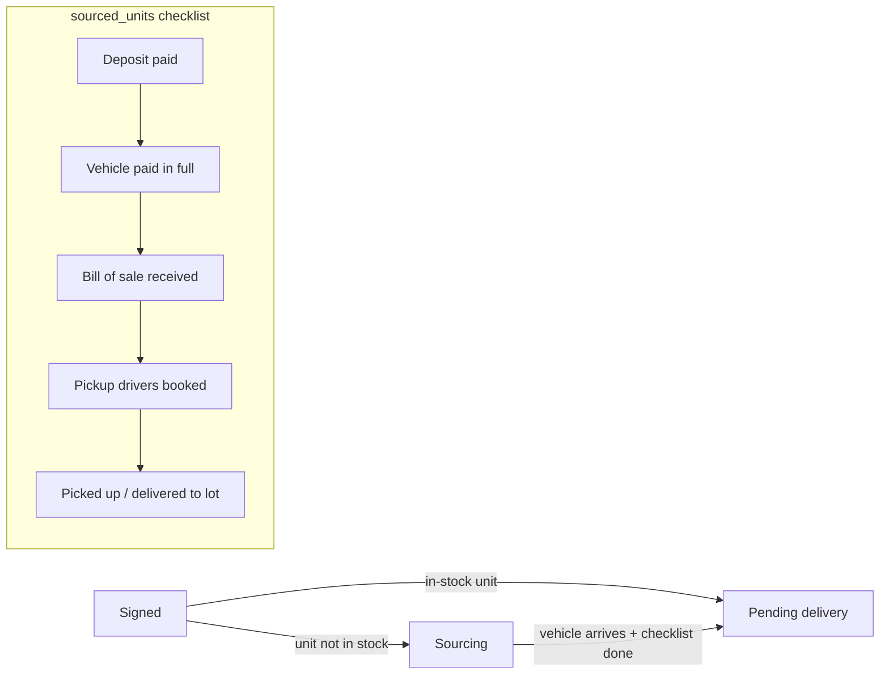

# Sourcing & Suppliers — Sourced Units, Supplier Registry, Source Costs & ROI Analytics

This document defines the business logic for acquiring vehicles for specific deals (sourced units), the supplier/vendor registry that feeds the expense system, and the marketing source-cost + ROI analytics that measure what each lead source actually returns. Rules are documented **as implemented** in the legacy tracker (`server/routes/sourcedUnits.js`, `suppliers.js`, `sourceCosts.js`, `sourceRoiAnalytics.js`, `supabase/migration_v2.sql`, `supabase/migrations/20260412_source_costs.sql`, `20260414_expenses.sql`), with ReadyLoans changes marked **Target** per the ADRs (`00-overview/ARCHITECTURE-DECISIONS.md`).

## Table of Contents

1. [Concepts: Three Different "Sources"](#1-concepts-three-different-sources)
2. [Sourced Units (deal-driven acquisition)](#2-sourced-units-deal-driven-acquisition)
3. [Suppliers Registry](#3-suppliers-registry)
4. [Expenses Link (supplier spend per vehicle/deal)](#4-expenses-link-supplier-spend-per-vehicledeal)
5. [Source Costs (marketing spend per source/month)](#5-source-costs-marketing-spend-per-sourcemonth)
6. [Source ROI Analytics — Formulas](#6-source-roi-analytics--formulas)
7. [API Surface](#7-api-surface)
8. [Legacy Gaps → Target Resolutions](#8-legacy-gaps--target-resolutions)

---

## 1. Concepts: Three Different "Sources"

The word "source" covers three unrelated domains — keep them separate in code and conversation:

| Domain | Table | Meaning | Money direction |
|---|---|---|---|
| **Sourced unit** | `sourced_units` | A vehicle bought from another dealer/seller *for a specific signed deal* (unit not in stock) | Money out (vehicle purchase) |
| **Supplier** | `suppliers` + `expenses` | Vendors we pay for recon, transport, parts, advertising, etc. | Money out (operating/COGS spend) |
| **Lead source** | `leads.source` + `source_costs` | Where a lead came from (fluent_form, meta_lead_form, google_ads…) and what we spent on that channel per month | Money out (ad spend) vs revenue in (converted deals) |

## 2. Sourced Units (deal-driven acquisition)

### 2.1 Where it sits in the deal pipeline

A deal enters the **Sourcing** stage (`pipeline_stage = 'sourcing'`, violet `#8B5CF6`) when the client has signed but the unit must be acquired from another dealership. **The stage is skipped entirely for in-stock units** (Signed → Pending delivery). When the sourced vehicle arrives, the deal moves to `pending_delivery`.



### 2.2 The `sourced_units` table (as built, `migration_v2.sql`)

One row per deal — `UNIQUE(deal_id)`, FK `deals ON DELETE CASCADE`. Auto-created by `deals.js → ensureRelatedRecords()` whenever a deal has `is_sourced_unit = true` (upsert on `deal_id`, `ignoreDuplicates`).

| Group | Column | Type / Values | Business meaning |
|---|---|---|---|
| Seller | `seller_name` | TEXT | selling dealership/person |
| | `seller_location` | TEXT | city/address — drives pickup logistics |
| Payment | `deposit_premium_paid` | BOOL | deposit put down to hold the unit |
| | `deposit_amount` | DECIMAL(10,2) **dollars — legacy gap** | Target: `deposit_amount_cents INTEGER` (ADR-009) |
| | `vehicle_paid` | BOOL | paid in full |
| | `payment_method` | CHECK `('wire','etransfer','cc')` | |
| | `proof_of_payment_url` | TEXT | uploaded via `POST /api/upload/:dealId/payment-proof` → Supabase Storage `deal-files/{dealId}/payment-proof/…` |
| Paperwork | `bill_of_sale_received` | BOOL | |
| | `bill_of_sale_file_url` | TEXT | upload category `bill-of-sale` |
| Pickup | `drivers_booked_for_pickup` | BOOL | |
| | `pickup_driver_names` | TEXT | |
| | `pickup_company` | TEXT | free text (dispatch vendors: 'supreme', 'denises_guys') |
| | `pickup_date` | DATE | planned |
| | `pickup_datetime` | TIMESTAMPTZ | booked slot |
| | `picked_up_delivered` | BOOL | unit physically at our lot |
| Compliance | `comes_with_safety` | BOOL | seller provides a safety certificate — if false, a `safety_inspection` work order is needed before delivery (see `garage-work-orders.md`) |
| Meta | `store_id`, `deleted_at`, `created_at`/`updated_at` (trigger) | | |

### 2.3 Behavior rules (as implemented)

- `GET /api/sourced-units/:dealId` **never 404s**: when no row exists (PGRST116) it returns the default form-ready shape (all booleans `false`, everything else `null`) so the UI always renders a complete checklist.
- `PUT /api/sourced-units/:dealId` is upsert (update, then insert on no-row). No field whitelist today — **Target:** full Zod schema (ADR-016).
- `GET /api/sourced-units` joins deal context: `stock_number, year, make, model, customer_name`.
- The driver-dispatch email includes sourcing context (`pickup_location`, `chaser_vehicle_info` on the deal) — see `dispatch-transport.md`.

### 2.4 Relationship to the inventory table (Target)

Sourced units predate the separate `inventory` table (see `inventory.md` §1). **Target:** when a sourced unit is marked `picked_up_delivered`, create/link an `inventory` row with `acquisition_type = 'dealer_trade'` (or `auction` per actual source), `acquisition_cost` = purchase price, `deal_id` = the driving deal, `deal_status = 'sold_pending'`. The `sourced_units` row remains the *procurement checklist*; the `inventory` row is the *asset record*. This closes the legacy gap where sourced vehicles never became inventory assets.

## 3. Suppliers Registry

Vendors paid for reconditioning, transport, parts, advertising, and other services. As built (`20260414_expenses.sql` + `server/routes/suppliers.js`).

### 3.1 Schema and field whitelist

`suppliers`: `id`, `name` NOT NULL, `category` (`'mechanical'|'detail'|'transport'|'parts'|'advertising'`), `contact_name`, `phone`, `email`, `address`, `city`, `postal_code`, `province`, `country`, `fax`, `tax_number` (GST/HST business number), `pst_number`, `dealer_number`, `rin_number` (**Ontario Registrant Identification Number** — OMVIC-registered dealers), `driver_license`, `driver_license_expiry`, `payment_terms` (`'net30'`, `'cod'`, …), accounting-export fields (`default_expense_type`, `default_account`, `posted`, `tax_exempt`, `memo`), `notes`, `is_active` BOOL DEFAULT true, `created_by`, timestamps.

The route enforces a strict **field whitelist** on create/update (empty strings coerced to null) — the only legacy route family that does this correctly; keep the pattern, expressed as a Zod schema in Target.

### 3.2 Rules

- `POST /api/suppliers` requires a non-blank trimmed `name`; `is_active` defaults true.
- Delete is soft: `is_active = false` (never hard delete — suppliers are referenced by historical expenses).
- Listing: ordered by name; `?active=true` filter; `?q=` name ILIKE search.
- **Legacy gap:** no `store_id`, no RLS. **Target (ADR-007):** suppliers are **organization-scoped** (`tenant_id` NOT NULL, `store_id` NULL = shared across the group's stores), FORCED RLS.

## 4. Expenses Link (supplier spend per vehicle/deal)

Suppliers exist to be paid; the payment record is an `expenses` row (full expense logic is in the accounting docs — summarized here because supplier ROI depends on it):

- Every expense **must link** to at least one of `inventory_id`, `deal_id`, `stock_number` (DB CHECK `expense_must_link`).
- `supplier_id FK suppliers ON DELETE SET NULL` with `supplier_name` free-text fallback for one-off vendors.
- Money: `amount_cents` + `tax_cents` → `total_cents GENERATED ALWAYS AS (amount_cents + tax_cents) STORED` (immutable expression — allowed under ADR-009).
- `category_code FK expense_categories(code)`; categories carry **`is_cogs`** so per-unit cost roll-ups distinguish COGS (purchase, transport, safety_pdi, recon_mech, recon_body, detail, parts, sublet, keys, pack, floorplan, warranty_cost) from opex (advertising, commission_sales, commission_fi, admin, other).
- Approval workflow: `pending → approved | rejected → paid`; delete = `status='void'` (audit-preserving).
- Per-vehicle rollup view `vehicle_expense_summary`: `total_cents` = SUM where status IN ('approved','paid'); `pending_cents`; `paid_cents`.

**Target:** `advertising`-category expenses attributable to a lead source should reconcile against `source_costs` (§5) monthly — today they are two disconnected ledgers.

## 5. Source Costs (marketing spend per source/month)

As built (`20260412_source_costs.sql`, `server/routes/sourceCosts.js`).

| Column | Type | Notes |
|---|---|---|
| `source` | TEXT NOT NULL | matches `leads.source` values (`fluent_form`, `meta_lead_form`, `google_ads`, `facebook`, `website`, …) — **enum drift exists** (seeds use `facebook`/`google_ads` which are not in the original leads CHECK); Target: one enum in `packages/schemas` |
| `month` | DATE NOT NULL | **always the first of the month** (`YYYY-MM-01`) |
| `spend` | DECIMAL(12,2) **dollars — deviates from cents convention** | Target: `spend_cents INTEGER` (ADR-009) |
| `notes` | TEXT | |
| `store_id` | FK stores SET NULL | |
| `created_by` | FK users SET NULL | |
| Constraint | `UNIQUE(source, month, store_id)` | **one spend record per source per month per store** |

Rules:

- `POST /api/source-costs` is an **UPSERT** on `(source, month, store_id)` — re-posting the same month overwrites the spend (idempotent monthly entry). Required: `source`, `month`; `spend` defaults 0.
- Listing ordered `month DESC, source ASC`; exact-match filters `?month=`, `?source=`.
- Seeded example (April 2026): facebook $800, meta_lead_form $500, website $200, google_ads $600.

Related but distinct: `lead_distribution_config` (per-store **ad-budget contribution** used to *route* leads between stores — `contribution_amount INTEGER cents`, `contribution_percentage`, `leads_received`, `actual_percentage`, `UNIQUE(store_id, platform, month)`). `source_costs` measures ROI; `lead_distribution_config` weights routing. Do not merge them.

## 6. Source ROI Analytics — Formulas

As implemented in `server/routes/sourceRoiAnalytics.js`. This is the canonical math for `GET /api/analytics/source-roi?period=` — port verbatim into `packages/core` with tests (ADR-001, ADR-026).

### 6.1 Period resolution

| `period` | Lower bound (`since`) |
|---|---|
| `30d` | now − 30 days |
| `90d` (default) | now − 90 days |
| `6m` | same day 6 months back |
| `1y` | same day 1 year back |
| `all` | none |

### 6.2 Inputs

1. **Leads**: non-deleted, `created_at >= since` → `(id, source, status, converted_deal_id, created_at)`. Leads with null source bucket to `'unknown'`.
2. **Revenue**: for leads with `converted_deal_id`, the converted deal's `sale_price`. **Revenue = gross sale price of the converted deal — not profit.** (Documented intentionally: front/back gross attribution to marketing source is a Target enhancement, below.)
3. **Spend**: all `source_costs` with `month >= YYYY-MM-01` of the since-date, aggregated `spendBySource[source]` and `monthlySpend["YYYY-MM:source"]`.

### 6.3 Per-source metrics (all divisions guarded → 0 when the denominator or spend is 0)

```
converted        := lead.status = 'converted' OR lead.converted_deal_id IS NOT NULL
totalLeads       = count(leads for source)
convertedLeads   = count(converted leads for source)
totalRevenue     = Σ sale_price of converted leads' deals

costPerLead      = spend / totalLeads                          (2 decimals)
costPerConversion= spend / convertedLeads                      (2 decimals)
conversionRate   = convertedLeads / totalLeads × 100           (1 decimal)
roi              = (totalRevenue − spend) / spend × 100        (1 decimal, percent return)
```

Sources with spend but zero leads are still included (visible burn with no return). Result sorted by `roi DESC`.

### 6.4 Totals

```
totalSpend        = Σ spend (2 dp)         totalRevenue = Σ revenue (2 dp)
avgCostPerLead    = totalSpend / totalLeads
avgConversionRate = totalConverted / totalLeads × 100          (1 dp)
overallROI        = (totalRevenue − totalSpend) / totalSpend × 100   (1 dp)
```

### 6.5 Monthly breakdown

Bucketed by `month:source` (lead-creation month): `leads`, `converted`, `revenue`, `spend` (from `monthlySpend`), plus `costPerLead` and `roi` with the same formulas; sorted month ASC then source ASC.

### 6.6 Companion metric — win/loss (context)

`GET /api/analytics/win-loss` uses the same period logic with: `won := status='converted' OR converted_deal_id set`; `lost := status='lost'`; open leads excluded from denominators; `winRate = won / (won + lost) × 100`. Its per-source table complements ROI (conversion quality vs dollar efficiency).

### 6.7 Target refinements

| Item | Target |
|---|---|
| Revenue basis | Add a `grossPerSource` variant using `front_gross + back_gross` from the desking engine (cents) once deals carry per-deal gross columns — sale price overstates return on low-margin units |
| Money units | All spend/revenue in **integer cents** end-to-end (ADR-009); format at render via `Intl` fr-CA/en-CA |
| Tenancy | Every query scoped `tenant_id` (+ optional `store_id` filter) — the legacy endpoint has **no store filtering at all** (cross-store leak) |
| Attribution window | Legacy attributes a conversion to the lead-creation month; keep, but document that long sales cycles skew month buckets |
| Source enum | Single source vocabulary in `packages/schemas`, shared by `leads.source`, `source_costs.source`, and intake normalization (ADR-005/016) |

## 7. API Surface

| Legacy endpoint | Behavior | Target (`/api/v1`, authenticated + tenant-scoped) |
|---|---|---|
| `GET /api/sourced-units` | all units + deal join | `GET /api/v1/sourced-units` |
| `GET /api/sourced-units/:dealId` | single; default shape if absent | keep default-shape contract |
| `PUT /api/sourced-units/:dealId` | upsert, no validation | Zod-validated upsert |
| `GET /api/suppliers?active=&q=` | list/search | keep |
| `POST /api/suppliers` / `PUT /:id` | whitelisted create/update | Zod schema |
| `DELETE /api/suppliers/:id` | soft (`is_active=false`) | keep |
| `GET /api/source-costs?month=&source=` | list | keep + tenant scope |
| `POST /api/source-costs` | upsert on `(source,month,store_id)` | keep semantics, cents |
| `PATCH /api/source-costs/:id`, `DELETE /:id` | update / hard delete | soft delete in Target |
| `GET /api/analytics/source-roi?period=` | §6 payload | move math to `packages/core`, ≥90% test coverage (ADR-023) |

## 8. Legacy Gaps → Target Resolutions

| # | Gap (evidence) | Target resolution (ADR) |
|---|---|---|
| 1 | `sourced_units.deposit_amount` DECIMAL dollars; `source_costs.spend` DECIMAL dollars | Integer cents everywhere (ADR-009) |
| 2 | No auth on any route in this domain | Better Auth + role checks (ADR-006); source-cost entry restricted to `owner`/`gm` |
| 3 | Suppliers/`expense_categories` have no `store_id`/`tenant_id` and no RLS | Org-scoped `tenant_id` + FORCED RLS (ADR-007) |
| 4 | ROI endpoint has no store/tenant filter | Mandatory tenant scope; optional store facet |
| 5 | Lead-source enum drift (`facebook`, `google_ads` outside CHECK) | One enum in `packages/schemas`, DB CHECK generated (ADR-016) |
| 6 | Sourced unit never becomes an inventory asset | Auto-create/link `inventory` row on `picked_up_delivered` (§2.4) |
| 7 | Advertising expenses and `source_costs` are disconnected ledgers | Monthly reconciliation report (advertising expenses by supplier vs source_costs by channel) |
| 8 | `updated_at` never maintained on `source_costs`/`suppliers` (no trigger) | Standard `updated_at` trigger on all tables (packages/db migration convention) |
