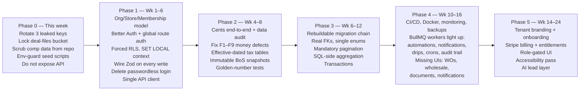

# ReadyLoans — Gap Analysis

This document synthesizes the three status sources — `discussions/BUILT-VS-PLAN.md` (April 2026), `discussions/kia-tracker-gap-map.md` (23 open items, 4 architecture decisions), and `PROJECT-AUDIT-REPORT.md` (July 19, 2026 adversarial audit; 8 auditors, 24/24 critical/high findings confirmed) — into a single picture of what exists, what is partial, what is missing, and what is defective in the current Kia Mont-Laurier Deal Tracker. It is the evidence base for the priorities and statuses in `functional-requirements.md` and for the strangler-rebuild sequencing in ADR-026. Every stack reference conforms to `00-overview/ARCHITECTURE-DECISIONS.md`.

## Table of Contents

1. [Sources and Ground-Truth Rules](#1-sources-and-ground-truth-rules)
2. [Audit Scorecard](#2-audit-scorecard)
3. [Module Maturity Matrix](#3-module-maturity-matrix)
4. [What Exists and Works — the Asset](#4-what-exists-and-works--the-asset)
5. [What Is Partial — the "No Engine" Pattern](#5-what-is-partial--the-no-engine-pattern)
6. [What Is Missing Entirely](#6-what-is-missing-entirely)
7. [Known Defects](#7-known-defects)
8. [Compliance Gaps](#8-compliance-gaps)
9. [Spec Conflicts and Version Drift](#9-spec-conflicts-and-version-drift)
10. [Open Decisions](#10-open-decisions)
11. [Gap → Remediation Phase Mapping](#11-gap--remediation-phase-mapping)

---

## 1. Sources and Ground-Truth Rules

| Document | Date | Reliability | Use |
|---|---|---|---|
| `PROJECT-AUDIT-REPORT.md` | 2026-07-19 | **Ground truth.** All 24 critical/high findings survived adversarial verification; 0 refuted | Module maturity, defect catalog, remediation phases |
| `discussions/BUILT-VS-PLAN.md` | ~2026-04 | Accurate for its date but **stale** — predates the lead-manager/desking/accounting build sessions | Historical baseline; field-level inventory gaps |
| `discussions/kia-tracker-gap-map.md` | ~2026-04 | Accurate as a question list; its 4 architecture decisions are now resolved by ADRs | Open-decision inventory |
| `prd.json` | 2026-04-06 | **Unreliable** — marks every story in all tiers "completed"; the audit explicitly refutes this | Story naming only; never for status |
| `progress.txt` | — | Empty | None |

Rule adopted throughout `docs/new/`: **when documents conflict, the July 2026 audit wins on status, and the ADRs win on target architecture.** `BUILT-VS-PLAN.md` says "Lead Manager 0%"; the audit shows leads as the most built-out area of the codebase — three months of building happened in between. Both statements were true when written; only the audit is true now.

## 2. Audit Scorecard

| Dimension | Score /10 | One-line reason |
|---|---|---|
| Security | 1 | 2 of ~150 endpoints authenticated; ~140 RLS policies all `USING(true)`; anon-writable storage bucket; live keys in tree |
| Multi-tenancy | 1 | `stores` table exists; scoping middleware registered after routes so it never executes; tenant spoofable via client header |
| Financial correctness | 2 | Dollars-vs-cents split-brain; Bill of Sale double-counts warranty; $0 clawback; inverted overrides |
| Ops / DevOps | 2 | No Dockerfile, CI, deploy config, backups; seed scripts point at production DB with DELETE statements |
| Backend | 3 | No service layer, no transactions, unbounded queries capped silently at 1,000 rows by PostgREST |
| Frontend | 3 | ~24,000 lines JSX; forgeable localStorage login; 44/52 fetch files send no auth header; 9 aria attributes total |
| Database | 3 | Migrations cannot rebuild a fresh DB; `schema.sql` drifted; live prod DB is the only source of truth |
| Quality / testing | 3 | 82 test cases, ~90% assert only that modules load; zero tests on any tax/desking/commission path |
| **Feature breadth / product value** | **7** | **The real asset** — the working dealership logic ReadyLoans harvests (ADR-026) |

Overall production readiness ≈ 2.5/10; multi-tenant SaaS readiness ≈ 1.5/10. Verdict adopted as ADR-026: neither patch nor discard — **strangler rebuild**, with the current app treated as an executable spec.

## 3. Module Maturity Matrix

Combined view: the 14-module plan percentages (April) against the audit's corrected classification (July).

| # | Module | Apr 2026 (BUILT-VS-PLAN) | Jul 2026 audit classification | Trajectory |
|---|---|---|---|---|
| 1 | Lead Manager | NOT BUILT — 0% | **Functional** — webhooks (Fluent Forms, Meta, manual), scoring engine (12 operators, 20+ fields), assignment engine (round-robin/load-balanced/source-based, caps, history), duplicate detect + merge, kanban, bulk ops, convert-to-deal | Built between snapshots; missing the AI-era cascade (language → online → schedule → load) and 10-min reassignment |
| 2 | Chatbot Engine | NOT BUILT — 0% | **Stub** — stores inbound SMS, sends empty reply, no Twilio SDK | Still missing; becomes the ReadyLoans AI layer (ADR-022) |
| 3 | Deal Pipeline | PARTIAL — 60% | **Functional** — 50+ fields, 10-stage kanban, commission auto-calc | Kanban landed; stage-history timeline still unwired |
| 4 | Finance Desk | MINIMAL — 15% | **Functional (desking) / Stub (lenders)** — provincial taxes, trade-ins, F&I products, rebates, DealerTrack PDF import, scenario compare; lender list is a static client-side array | Desking built with money defects (§7.1); submissions workflow missing |
| 5 | Inventory Command Center | PARTIAL — 25% | **Functional** — acquisition/recon/safety costs and statuses, photos, days-on-lot | Built; alerts/automation inert (no scheduler) |
| 6 | Document Manager | MINIMAL — 10% | **Stub** | Unchanged |
| 7 | Garage / Work Orders | NOT BUILT — 5% | **Partial** — API exists, no UI | Slight progress |
| 8 | Driver Dispatch | BUILT — 70% | **Functional** — chasers, plates, drivers, 4-hour conflict detection | Stable; auto-email upgrade missing |
| 9 | Pre-Delivery Checklist | BUILT — 75% | **Partial** — 4-item checklist works (insurance, funded, safety, registration); 22-item PDI template seeded but unused; **tracks, does not enforce** | Enforcement gate (10 items, hard/soft blocks) missing |
| 10 | Delivery Tracker | BUILT — 65% | **Partial** — booking + compliance flags; no photo ingestion, payments, trade-in intake, post-delivery | Core delivery-ops workflows missing |
| 11 | Funding Tracker | MINIMAL — 15% | **Partial** — status badge only; no stips, no funding records | Unchanged |
| 12 | Notifications & Automation | MINIMAL — 15% | **Stub** — rule CRUD without evaluator; static bell | Unchanged; blocked by absent scheduler |
| 13 | Wholesale Manager | MINIMAL — 10% | **Stub** — `sale_type` field only | Unchanged |
| 14 | Reporting & Analytics | BUILT — 60% | **Functional** — 4 PDF/Excel reports + win/loss + source ROI + leaderboard; plus the Accounting module (not in the 14-module plan) | Grew; GM Command Center and scheduled reports missing |

Modules that exist **outside** the original 14-module plan and are functional today: **Contacts** (dedupe-on-create, weighted FTS), **Appointments** (double-booking + vehicle-conflict checks), **Tasks**, **Global search (Ctrl+K)**, **Accounting/Expenses/Suppliers** (integer-cents native — the best-designed data model in the project), **Tags/saved filters/lost reasons**, **i18n** (944/944 EN/FR key parity).

## 4. What Exists and Works — the Asset

The 7/10 product value that ADR-026 mandates preserving. These are ported to `packages/core` / the new stack with tests, not rewritten from imagination:

| Asset | Detail worth preserving verbatim |
|---|---|
| Provincial tax structure | QC GST 5% + QST 9.975% on correct bases; ON HST 13%; trade-in tax credit; Section 87 (Indian Status) exemption; correct amortization `M = P·r(1+r)^n/((1+r)^n−1)` |
| Commission pay plans | 12 real plans: rates 5%–35%, $1,500 pads, monthly tier (Muhammad Majid Hassan: 30% if monthly gross > $60k else 25%), supervisor overrides (Omar +5% on Ibrahim; Hassan A. +5% on Hussein Alshawi) |
| Commission rule set (guardrails) | Money in cents; rates NUMERIC(5,4); **pad subtracted before rate**; tier check across ALL the salesperson's deals in the period; override paid to the supervisor; clawback checked before payout |
| Deal pipeline | 10 stages (new → submitted → approved → signed → sourcing → pending_delivery → scheduled → delivered → complete → lost) with stage colors, parallel funding badge, complete = delivered AND funded |
| Lead engines | Scoring (12 operators, 20+ fields, cached), assignment (round-robin / load-balanced / source-based with caps and history), duplicate detection + merge |
| Dispatch conflict algorithm | Auto-assign of chasers/dealer plates with a 4-hour conflict-detection window |
| Desking calculator | Provincial taxes, trade-ins, F&I products, rebates, lender rates, DealerTrack PDF import, scenario comparison |
| Accounting data model | `expenses` with `amount_cents`/`tax_cents`/generated `total_cents`, status pending → approved → paid (+ rejected/void), soft-void DELETE, `vehicle_expense_summary` (approved+paid only), 17 categories with `is_cogs` |
| Contacts model | Weighted FTS (name A, email/phone B, city C), dedupe on phone+email, merge keeping older `customer_since`, `deal_parties` buyer/cosigner |
| i18n corpus | 944/944 EN/FR key parity — genuinely good; carries into `packages/i18n` |
| Design system | "KIA Command" tokens, kanban/card/mobile specs, competitive-research patterns (deal rotting, 3-column record, Ctrl+K, slide-outs) |

## 5. What Is Partial — the "No Engine" Pattern

The audit's central structural finding: **the recurring failure mode is "table + CRUD API, but no execution engine and no UI." There is no background job, cron, or queue system anywhere in the server** — so everything time-based or event-driven is inert. ADR-012 (BullMQ 5, repeatable jobs) exists precisely to close this class of gap.

| Partial capability | What exists | What's dead |
|---|---|---|
| Message templates | `{{merge_field}}` rendering | No sending channel (no Twilio SDK, email only for 2 internal notices) |
| Workflows / nurture | Design + enrollment CRUD | Nothing executes steps — no scheduler |
| Automation/alert engine | Rule CRUD | No evaluator; no `fireEvent` calls |
| Notifications center | Bell UI shell | Static; nothing writes notifications |
| Activity timeline / audit trail | Schema + `activityLogger` service | Called by nothing; timeline renders empty |
| Funding tracker | Status badge on deal | No `funding_records`, no stips, no aging job |
| Garage / work orders | API routes | No UI, no auto-email, no cascades to inventory/checklist |
| Delivery / PDI | 4-item checklist with uploads | 22-item PDI template seeded but unused; no enforcement gate |
| Clawback + bulk ops | Bulk ops work | Clawback records $0 and never reverses the commission |
| Auth & RBAC | Login works; 10 roles stored | Roles almost never enforced — all 10 roles see the same 23-item menu |
| Zod validation | Full schema library exists | Imported by **zero** routes |
| Soft deletes | `deleted_at` columns exist | Nothing honors them; unique constraints block re-creation after delete |
| Multi-store tenancy | `stores` table + `scopeToStore` middleware | Middleware registered after routes — never runs; spoofable |

## 6. What Is Missing Entirely

Grouped by why they're missing:

**Never specced for the legacy app (ReadyLoans-new, per ADRs):**
- Organizations layer above stores; memberships `(user, org, store, roles[])` (ADR-006/007)
- Forced RLS with `SET LOCAL` tenant context; real tenant isolation (ADR-007)
- White-label branding runtime (`tenant_branding`, custom domains, branded emails/PDFs) (ADR-018)
- Stripe billing, meters, entitlements (ADR-024)
- ADF/XML intake, per-tenant webhook endpoints, signed outbound webhooks (ADR-005)
- Field-level PII encryption + blind indexes (ADR-015)
- Observability stack (Sentry/PostHog/OTel/pino/Better Stack) (ADR-025)
- CI/CD, environments, Docker, backups (ADR-023)

**Specced in the master spec but never built:**
- AI conversation engine (SMS agent, extraction, handoff, silent monitoring, drips) — the chatbot module was deliberately sequenced last
- Weighted store distribution of leads by ad spend + Distribution Dashboard
- 10-minute reassignment timer; 90-day unresponsive nurture
- Pre-delivery enforcement gate (hard safety block; manager overrides logged to `checklist_overrides`)
- Delivery photo email ingestion; `deal_payments` collection workflow; trade-in intake → auto inventory record
- Driver-company auto-email; drivers-needed formula; wet-ink dispatch gate
- Document Manager (13-doc catalog, lifecycle, wet-ink file workflow)
- Wholesale listings/offers/auto-flagging
- GM Command Center; per-unit P&L endpoint; scheduled reports
- 20 seeded alerts; 22-event automation engine; 6 daily cron checks; escalation chains
- Tax write-back to deals (`tax_*_cents` columns) — blocks every tax-collection report (Accounting Session 3 blocker)

## 7. Known Defects

All confirmed by the audit's adversarial verification pass. Severity as assigned there.

### 7.1 Financial correctness (legal/payroll risk)

| # | Defect | Consequence |
|---|---|---|
| F1 🔴 | Bill of Sale **double-counts extended warranty** in "Total Purchase Price" (once in vehicle price, again in F&I total) | A $2,500 warranty overstates the signed legal total by $2,500 |
| F2 🔴 | **Dollars-vs-cents split-brain**: deals columns migrated to integer cents but the app reads/writes float dollars | 100× errors between old and new rows; $1,500 pad subtracts as **$15**; user cents destroyed (25000.50 → 25001) |
| F3 🔴 | **Clawback records $0**: selects nonexistent column `amount` (real: `commission_amount`), swallows the error, writes 0; never reverses the commission | Unwound deals keep paid commissions |
| F4 🟠 | **Supervisor overrides never pay out** — logic inverted relative to every seeded pay plan | All configured override pairings yield $0 |
| F5 🟠 | Commissions **silently recomputed on every deal edit** at the salesperson's current rate, no audit trail | Retroactively rewrites paid history |
| F6 🟠 | **Manufacturer rebates taxed pre-tax** (must be post-tax in Canada) | A $2,000 rebate undercharges ~$299.50 of tax on a legal document |
| F7 🟠 | **Signed Bill of Sale never persisted** — lives in localStorage, recomputed from mutable state | A reprint can differ from what the customer signed; no immutable snapshot (fixed by ADR-021) |
| F8 | BC/Manitoba trade-in tax credit wrongly disabled; federal Luxury Tax (> $100k) absent; biweekly payments approximate; line items don't sum to totals; `stores.tax_rate DECIMAL(6,4)` rounds 14.975% → 14.98% | Wrong contracts in edge cases |
| F9 | Ontario OMVIC consumer-rights block prints on Quebec French contracts | Wrong-jurisdiction legal text |
| F10 🔴 | **Zero automated tests** on any tax, desking, Bill-of-Sale, or commission path | No safety net for any of the above (ADR-023: ≥90% coverage + golden-number tests) |
| F11 🟠 | Reports/YTD/commission-tier checks compute on **silently truncated data** past ~1,000 rows (PostgREST default cap, unbounded queries) | Wrong payouts at scale |

### 7.2 Security (critical findings 1–11)

| # | Defect |
|---|---|
| S1 | API effectively unauthenticated — 2 of ~150 endpoints protected; CORS wide open |
| S2 | Privilege escalation: unauthenticated `PUT /api/users/:id` can set `role='owner'`; passwordless legacy `POST /api/users/login` auto-creates accounts |
| S3 | RLS decorative: ~140 policies all `USING(true)`; 9 tables (incl. expenses, appointments) have no RLS; browser writes to Postgres directly with the anon key |
| S4 | Live Supabase service-role key + Resend key in `server/.env` in the working tree (treat as leaked — **rotate at migration**, ADR-023) |
| S5 | `deal-files` storage bucket grants anon full read/write/delete — insurance and funding documents effectively public |
| S6 | Tenancy middleware dead (registered after routes) and spoofable via client-supplied header |
| S7 | Forgeable localStorage login blob — escaped template literal `fetch(\`\${API_URL}/users/me\`)` in `App.jsx:103` makes session restore always fail, falling back to the forgeable blob; 44/52 fetch files send no auth header |
| S8 | Unauthenticated upload endpoint: no MIME check, path traversal; lead webhooks unverified and floodable; PostgREST filter injection via interpolated search |
| S9 | Real employee names + actual commission compensation committed in docs/seeds (privacy breach); seed scripts point at production DB with DELETE statements and no env guard |

### 7.3 Architecture and quality

- **No transactions anywhere** — lead→deal conversion, workflow step replacement, dispatch resource locking can corrupt on partial failure; round-robin assignment has a read-modify-write race.
- **Migrations cannot build a fresh database** — same-day timestamp prefixes order wrongly; dependencies on out-of-folder objects; 3 seed migrations hardcode prod UUIDs. `schema.sql` badly drifted (2 roles vs 10, decimals vs cents, no `store_id`). The live production DB is the only source of truth.
- Commissions table still dollars while deals are cents; payroll joins on **free-text salesperson names** (banned by ADR-009).
- Frontend: three styling systems incl. 90 references to CSS variables never defined; no shared API client (~50 files to hand-edit for auth headers); no error boundary; no code-splitting; 19 `alert()` calls; **9 aria attributes app-wide**; largest component 1,627 lines.
- "Vibe-coding" signature: scaffolding built but never wired; three generations of everything; `API_URL` redeclared in 51 files; try/catch/500 copy-pasted 203 times; phone normalization implemented 5 times; 201 raw `console.*` calls; docs that lie (prd.json all "completed").
- Invalid Postgres in specs: `GENERATED STORED` columns using `CURRENT_DATE`/`NOW()` (`inventory.days_in_stock`, `work_orders.days_at_garage`) — must be computed in views/queries (ADR-009).

## 8. Compliance Gaps

| Regime | Current state | Gap |
|---|---|---|
| Bill 96 (Quebec, French) | 944/944 EN/FR key parity — excellent foundation | Default locale is EN (must be `fr-CA` per Quebec tenant); the money screens francophone staff use most (desking, leads, accounting) leak hardcoded English; no CI parity gate (ADR-019) |
| Law 25 (Quebec privacy) | Nothing | World-open DB with driver's licences, DOB, income, financial docs = breach exposure; no consent ledger, no automated-decision (s.12.1) disclosure/human-review path, no residency guarantee (fixed: `ca-central-1`, ADR-008) |
| PIPEDA | `consent_marketing` + timestamp columns exist | Never enforced anywhere |
| CASL / CRTC | Nothing | No STOP handling, no quiet hours, no consent expiry (6/24-month), no DNCL scrub, no ADAD express-consent gate (all mandated platform-level by ADR-022) |
| OMVIC (Ontario) | Disclosure text exists | Printed on Quebec contracts (F9); no per-deal OMVIC fee field |
| AODA / WCAG | 9 aria attributes in ~24,000 lines of JSX | Legal exposure; NFR target is WCAG 2.2 AA (see `non-functional-requirements.md`) |

## 9. Spec Conflicts and Version Drift

Conflicts across spec generations, with the resolution each downstream doc must use:

| # | Conflict | Resolution |
|---|---|---|
| 1 | Inventory model: columns on `deals` (BUILT-VS-PLAN interim SQL) vs standalone `inventory` table (master build plan C1) | **Standalone `inventory` table** — final master spec §5; already how the built system works |
| 2 | Pipeline stages: 7-stage color set (design system) vs 10-stage flow (final spec) | **10 stages**, single enum in `packages/schemas` (ADR-009) |
| 3 | Chatbot required fields: §10 final (budget required, timeline nice-to-have) vs §11 (inverse) | **§10 final** — budget required |
| 4 | Wholesale sold status: `deal_status='wholesale'` (§11) vs `'delivered'` (§12 D2); row colors amber>45/red>60 vs amber>60/red>90 | **§11 final**: `'wholesale'`; amber > 45 d, red > 60 d |
| 5 | Funding statuses: with vs without `rejected` | Include `rejected` (union; §12 B4) |
| 6 | Lead assignment: round-robin (§12 B1) vs language → online → schedule → load cascade with 10-min reassignment (§9/§11 final) | **Cascade model** — the AI-handoff flow requires it |
| 7 | Lead aging thresholds: 5/15/60-min variants | green < 5 min, amber 5–15 min, red > 15 min unassigned (+ escalation) |
| 8 | Pre-delivery enforcement: hard-gate-everything (§12 B3, 400 errors) vs 1 hard + 9 soft with manager override (final checklist spec) | **Final spec**: safety = hard block (no override, unless `sold_as_is`); other 9 = soft with logged manager override |
| 9 | Two `leads` table definitions (multi-store §11 vs single-store §12 B1) | §11 multi-store version |
| 10 | "Credit Up" vs "CreditApp" naming | Same product — normalize to **CreditApp** |
| 11 | Duplicate-lead policy: phone-only vs phone+email | Leads: phone-only (final spec); Contacts: phone+email at create (Tier-0 spec) |
| 12 | Delivery business-day logic skips weekends only; chatbot hours include holidays | Unify on store `business_hours` + `holiday_dates` (per-store config) |

## 10. Open Decisions

### 10.1 Resolved by the ADRs (formerly the gap map's "decide first" blockers)

| Gap-map decision | Resolution |
|---|---|
| #1 Inventory architecture | Standalone `inventory` table; `deals.inventory_id` link (§9 above) |
| #2 Multi-store / multi-tenant | Shared schema + `tenant_id`/`store_id` + forced RLS; Platform → Organization → Store (ADR-007) |
| #3 RBAC | Better Auth organization plugin; 10 roles; memberships with additive multi-role (ADR-006) |
| #4 Pipeline stages | 10 stages, kanban primary view (ADR-009, master spec §1) |
| Build order | ADR-026: tenancy/auth/RLS → core schema → clean-start provisioning of Kia ML as tenant #1 (no legacy data migration — all legacy data is test data; production launches with an empty database + seed/reference config, decided 2026-07-23) → module parity → AI layer |
| Money model | Integer cents everywhere; split tax columns; effective-dated tax tables (ADR-009) |
| Chatbot platform | Custom agent on Claude (Opus 4.8 + Haiku 4.5), Twilio transport; voice via ConversationRelay (ADR-022) — supersedes Bland AI/Vapi/Retell evaluation |
| Scheduler | BullMQ 5 repeatable jobs replace all cron specs (ADR-012) |
| PDF pipeline | React → HTML → headless Chromium in workers; immutable hashed snapshots (ADR-021) |
| Lender / e-sign APIs | Explicit non-goals at launch — manual tracking preserved (vision doc §10) |

### 10.2 Still open — need an owner or design decision

| # | Open item | Source | Suggested owner |
|---|---|---|---|
| O1 | `expense-receipts` bucket: public-read vs signed URLs (ADR-013 implies signed — confirm) | Accounting roadmap | Eng (default: signed URLs) |
| O2 | F&I manager commissions: `is_fi_manager` flag on salespeople vs separate `fi_commissions` table | Accounting Session 3 | Product + Eng |
| O3 | Desking tax write-back timing: on "Save & Return" only, or debounced per input change | Accounting Session 3 | Eng |
| O4 | Payment mismatch tolerance (cash counted ≠ expected fires HIGH alert — exact $0 vs threshold?) | Notifications spec | Owner |
| O5 | AI "low confidence" handoff threshold — numeric value undefined | Chatbot spec | AI eng (evals) |
| O6 | Inventory "best match" ranking for AI vehicle suggestions beyond type/budget/availability | Chatbot spec | Product |
| O7 | OMVIC fee: per-deal `omvic_fee_cents` field vs derivation from province + `is_retail` | Accounting roadmap | Eng |
| O8 | Wholesale pricing method (MMR, book value, manager discretion) | Gap map | Owner |
| O9 | Garage `avg_turnaround_days` update formula ("tracked over time" — no formula given) | Garage spec | Eng |
| O10 | Cron alert dedupe beyond S1 vehicle-aging (other daily checks could re-fire daily) | Notifications spec | Eng (default: dedupe all per entity/threshold) |
| O11 | Photo-type auto-classification for delivery emails (client_with_vehicle vs client_id) | Delivery spec | Eng (default: manual tag in review UI; AI classification later) |
| O12 | Web-chat channel workflow (enum value exists; no flow defined) | Chatbot spec | Product (P3) |

## 11. Gap → Remediation Phase Mapping

The audit's phased roadmap, aligned with ADR-026 sequencing. Effort estimate (2–3 senior engineers): secure single-tenant parity ~2–3 months; hardened multi-tenant SaaS ~4–6 months.

Mapping of the major gap classes to phases:

| Gap class (from §5–§8) | Closed in |
|---|---|
| Leaked secrets, open bucket, comp data in repo | Phase 0 |
| Unauthenticated API, decorative RLS, spoofable tenancy, forgeable login (S1–S8) | Phase 1 |
| All financial defects F1–F11 | Phase 2 |
| Unbuildable migrations, free-text joins, truncation, no transactions | Phase 3 |
| Entire "no engine" pattern (§5) — automations, notifications, drips, crons, activity trail | Phase 4 |
| White-label, billing, RBAC-gated UI, WCAG pass, AI layer (§6) | Phase 5 |
| Bill 96 default-locale + CI parity gate | Phases 1 (i18n foundation in new stack) and 4 (CI gate) |
| CASL/CRTC/Law 25 compliance engine | Phase 5 (platform send-layer, before any AI outbound goes live — hard precondition for FR-AI-013) |
