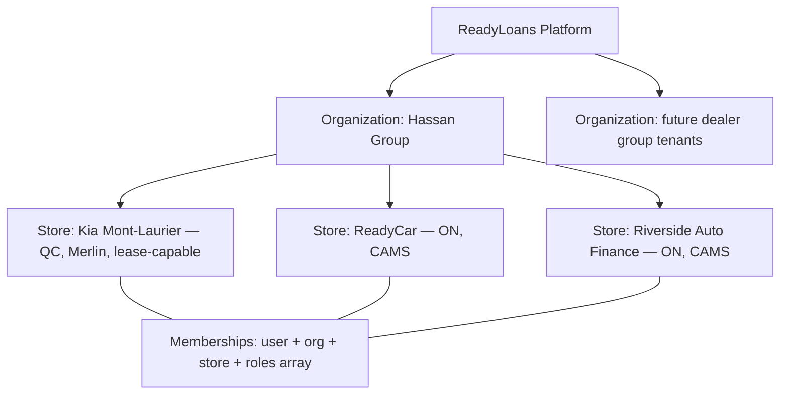
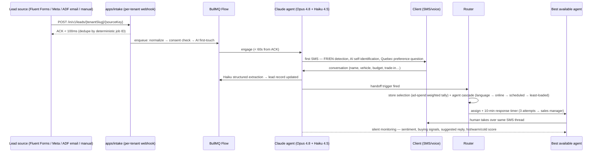

# ReadyLoans — Vision & Goals

This document states what the owner wants ReadyLoans to be — a production-grade, multi-tenant, white-label dealership CRM/DMS plus an AI lead-automation engine, evolved from the single-store Kia Mont-Laurier Deal Tracker — and defines the personas the platform serves, the business goals it must hit, and the boundaries of what it is not. It is the "why" behind the functional catalog in `functional-requirements.md` and the constraints in `non-functional-requirements.md`; every technology reference conforms to `00-overview/ARCHITECTURE-DECISIONS.md`.

## Table of Contents

1. [Origin: from Deal Tracker to Platform](#1-origin-from-deal-tracker-to-platform)
2. [Vision Statement](#2-vision-statement)
3. [The Three Products in One Platform](#3-the-three-products-in-one-platform)
4. [Platform Hierarchy](#4-platform-hierarchy)
5. [The AI Lead Engine](#5-the-ai-lead-engine)
6. [Business Goals & Success Metrics](#6-business-goals--success-metrics)
7. [Personas](#7-personas)
8. [Persona → Platform Role Mapping](#8-persona--platform-role-mapping)
9. [Guiding Principles](#9-guiding-principles)
10. [Non-Goals](#10-non-goals)

---

## 1. Origin: from Deal Tracker to Platform

The owner (Hassan) operates three rooftops today:

| Rooftop | Type | Province | Bill of Sale system | Lender platforms | Safety regime |
|---|---|---|---|---|---|
| Kia Mont-Laurier | Franchise (Kia) | Quebec | Merlin | DealerTrack + RouteOne | Quebec inspection (internal garage) |
| ReadyCar (Ready Group) | Used-car store | Ontario | CAMS | DealerTrack + CreditApp | Ontario safety (external garages only) |
| Riverside Auto Finance (Ready Group) | Used-car / finance | Ontario | CAMS | DealerTrack + CreditApp | Ontario safety (external garages only) |

The existing system — the **Kia Mont-Laurier Deal Tracker** (React 18 + Vite + Tailwind SPA, Express API, Supabase Postgres, react-i18next EN/FR) — was built for a single store. It accumulated genuinely valuable dealership logic: a 10-stage deal pipeline with kanban, a desking calculator with correct Quebec GST 5% + QST 9.975% structure, 12 real commission pay plans (rates 5%–35%, $1,500 pads, monthly tiers, supervisor overrides), lead scoring and assignment engines, inventory with acquisition/recon/safety cost tracking, dispatch with 4-hour conflict detection, an accounting/expenses module, and complete 944-key EN/FR i18n.

The July 2026 adversarial audit scored the product value at **7/10** but security **1/10**, multi-tenancy **1/10**, and financial correctness **2/10**. The verdict (adopted as ADR-026): **strangler rebuild** — treat the current app as an executable spec, port the business rules into `packages/core` with tests, and rebuild the foundation (auth, tenancy, money model) on the canonical stack. Kia Mont-Laurier becomes **tenant #1**.

## 2. Vision Statement

> **ReadyLoans is the operating system for Canadian dealership groups: one white-label platform that runs the entire deal lifecycle — lead, conversation, desking, funding, delivery, accounting — for many rooftops, with an AI agent that answers every lead in under 60 seconds, in French or English, and routes it to the best store and the best available human.**

Three convictions drive it:

1. **Speed-to-lead wins deals.** A lead answered in the first minutes converts; one answered tomorrow is lost. The AI layer exists to make first contact instant, 24/7, bilingual, and compliant — then hand off to a human at exactly the right moment.
2. **Dealership groups, not dealerships, are the customer.** The Platform → Organization → Store hierarchy (ADR-007) is native: cross-store inventory visibility (with cost hiding), store-to-store internal wholesale, ad-spend-weighted lead distribution across rooftops, and one login spanning stores.
3. **Quebec-first compliance is a moat, not a tax.** Bill 96 French-equivalence, Law 25 residency and automated-decision rules, CASL/CRTC consent and quiet hours, OMVIC disclosures — built into the send layer and the AI engine (ADR-019, ADR-022), not bolted on. Incumbents (VinSolutions, DealerSocket, Reynolds) do none of this well for Quebec.

## 3. The Three Products in One Platform

| Pillar | What it is | Anchor decisions |
|---|---|---|
| **CRM/DMS core** | Contacts, leads, 10-stage deal pipeline, desking (finance/cash/lease), F&I products, funding & stips, pre-delivery checklist, delivery ops, dispatch, inventory command center, garage work orders, wholesale, documents, accounting/expenses, commissions, reporting | ADR-001/002/003/009/017/021 |
| **AI lead-automation engine** | Webhook + ADF/XML lead intake → AI SMS (and later voice) conversation → structured capture → routing to best store → assignment to best available agent → silent monitoring with live coaching panel → drips and nurture | ADR-005/012/020/022 |
| **Multi-tenant white-label SaaS** | Shared-schema tenancy with forced RLS, runtime branding (CSS variables, custom domains, branded emails/PDFs), per-rooftop Stripe subscriptions with metered AI/SMS usage, tenant-scoped rate limits and entitlements | ADR-006/007/011/018/024 |

The sequencing (ADR-026): tenancy + auth + RLS foundation first, then core schema and data migration (Kia ML as tenant #1), then module parity, then the AI layer. No new features land on the legacy codebase.

## 4. Platform Hierarchy

Every business row carries `tenant_id` (organization) and `store_id`; Postgres RLS is ENABLED AND FORCED (ADR-007). Store-level configuration is data, not code: province, tax treatment, Twilio number, `bill_of_sale_system` ('cams'|'merlin'), `esign_platform` ('onespan'|'docusign'), `submission_platforms`, `available_fi_products` (used-car stores sell only extended warranty + GAP; franchise stores sell all 9), `business_hours`, `holiday_dates`, `alert_thresholds`. Lease deals exist only for franchise stores.

## 5. The AI Lead Engine

The strategic differentiator. The flow the owner asked for, end to end:

Non-negotiable behaviors carried over from the specs and hardened by ADR-022: the agent never quotes pricing, rates, or approval odds; sends at most 3 vehicles by MMS with no links; respects CRTC quiet hours; honors STOP instantly; discloses it is an AI in the first turn (FR + EN); no automated outbound voice call without recorded express consent (ADAD); financing-significant automated decisions carry a Law 25 s.12.1 human-review path. Voice (Twilio ConversationRelay, shared Claude brain) is Phase 2 of the AI layer.

## 6. Business Goals & Success Metrics

| # | Goal | Metric | Target |
|---|---|---|---|
| G1 | Run all three of Hassan's rooftops on one platform | Stores live on ReadyLoans | 3 stores; Kia ML first (ADR-026) |
| G2 | Instant lead response | AI first-touch after intake ACK | < 60 s (SLO, ADR-025) |
| G3 | Never lose a lead to slowness | Intake ACK p99 | < 1 s (ADR-025) |
| G4 | Human follow-through | Agent response before reassignment | 10 min; ≤ 3 attempts then sales manager |
| G5 | Sell it as SaaS | Per-rooftop subscription wedge | $300–$800/mo + metered AI minutes/SMS (ADR-024) |
| G6 | White-label credibility | Hardcoded Kia branding anywhere | Zero — release blocker (ADR-018) |
| G7 | Money you can take to court | Desking/tax/commission math in `packages/core` | ≥ 90% test coverage, golden-number tests (ADR-023) |
| G8 | Quebec compliance | EN↔FR key parity in CI; French-first contracts | 100% parity, build fails otherwise (ADR-019) |
| G9 | Operational trust | API p95 latency | < 300 ms (ADR-025) |
| G10 | Pipeline hygiene | Deals rotting > 7 days in stage | Surfaced daily to salesperson + GM dashboards |

## 7. Personas

Eight primary personas. Scope column reflects the visibility hierarchy: Owner → all stores; store roles → own store; Salesperson → own deals and assigned leads only.

### 7.1 Owner (Hassan)

- **Scope:** all organizations he owns; all stores; all financials including costs.
- **Wants:** one login for Kia ML, ReadyCar, Riverside; cross-store P&L; the ad-spend lead-distribution dashboard (Google and Meta split per store, target vs actual %); internal wholesale between his stores; to eventually onboard *other* dealer groups as paying tenants.
- **Key screens:** GM Command Center (cross-store), Distribution Dashboard, Accounting, Wholesale, tenant/billing settings.
- **Pain today:** no store concept — everything is one bucket; leaked keys and an unauthenticated API mean he cannot expose the system to anyone; commission data for named employees sits in the repo.

### 7.2 General Manager (GM)

- **Scope:** own store, full financials and commissions.
- **Wants:** the GM Command Center as the default login view — pipeline by stage, total gross this month, units sold, avg front/back gross, funding pipeline ($ submitted-not-funded), inventory aging, lead conversion; "deals needing attention" (rotting > 7 days, overdue funding, incomplete checklists); approval authority on recon spends > $2,000 and checklist overrides (notified on every override, MEDIUM alert).
- **Key screens:** GM dashboard, reports, automation-rule manager, store settings (thresholds, business hours, holidays), scheduled reports (daily 7 PM sales summary, Monday 8 AM weekly, monthly P&L).

### 7.3 Sales Manager

- **Scope:** own store — salespeople, pipeline, lead assignments.
- **Wants:** live pipeline kanban with rotting colors (green < 3 d, amber 3–7 d, red > 7 d); to see every lead reassignment in real time; escalation to them when the AI can't hand off (chatbot handoff failed = HIGH alert) and when a lead sits unanswered 10 minutes; team leaderboard.
- **Key screens:** deal kanban, leads dashboard, schedule manager (weekly staff grid), salespeople manager.

### 7.4 Salesperson

- **Scope:** **own deals + own assigned leads only** — sale-price-level financials, own commissions only; costs hidden.
- **Wants:** mobile-first day view (bottom-tab nav, swipe right = call); instant notification when a lead is assigned (MEDIUM) with the AI conversation summary; the AI coaching panel while texting a client (sentiment, buying signals, suggested response, hot/warm/cold); commission statement they can trust (pad subtracted before rate, tiers computed on full monthly gross).
- **Pain today:** commissions silently recomputed on edits with no audit trail; overrides never pay out (inverted logic); notifications bell is static.

### 7.5 F&I Manager (Finance & Insurance)

- **Scope:** own store — submissions, approvals, funding, document signing; commissions of others hidden.
- **Wants:** the Finance Desk — lender submissions per deal (buy rate vs sell rate, rate spread = reserve), credit-tier submission strategy (prime 1–2 lenders … deep subprime 5+), one-click "Select This Approval"; the funding tracker with per-stip status (proof of income, insurance binder, co-signer…); IDV send/track via CreditApp; desking scenarios compared 4-up; wet-ink file preparation; takes over AI conversations post-handoff in the same SMS thread.
- **Pain today:** desking never persists (tax write-back missing), Bill of Sale double-counts warranty — legally wrong totals; lender list is a static client-side array.

### 7.6 Dispatcher (Logistics / Operations)

- **Scope:** own store — dispatch, drivers, deliveries, work orders.
- **Wants:** booking that auto-computes drivers needed (2 without trade-in — chaser required; 1 with trade-in); auto-email to the driver company with pickup/delivery addresses, cash to collect, wet-ink file status; a hard rule that dispatch cannot book until the wet-ink file is prepared; status timeline Booked → Confirmed → Picked Up → En Route → Delivered; today's-deliveries board; HIGH alert on failed delivery.
- **Key screens:** dispatch dashboard, delivery board, driver-company manager, work-order queue.

### 7.7 Mechanic (Garage / Recon)

- **Scope:** work orders addressed to their garage — the internal Kia garage (Quebec side: QC inspections, maintenance, repairs; **never** Ontario safety) or an external partner garage.
- **Today (as-is):** mechanics have no login. Garages receive a Resend work-order email (WO-YYYY-NNNN, vehicle block with VIN/mileage/stock #, service type, "please confirm receipt") and reply by phone/email; staff manually advance the WO status (sent → received → in_progress → completed; safety additionally passed/failed).
- **Target:** a lightweight garage-facing view to acknowledge WOs, post status/ETA, and attach inspection reports and invoices — feeding `recon_cost` roll-up and the safety hard-block automatically. Parts & Service (mechanic labor, parts inventory) is a Tier-3 accounting-roadmap module.

### 7.8 Admin (Office Staff)

- **Scope:** own store — payments, filing, data entry; no reports.
- **Wants:** payment confirmation workflow (Expected → Received → Confirmed → Deposited; mismatch fires HIGH alert to Admin + GM); the unmatched-delivery-photos review queue; bulk signed-document upload with type matching; expense entry with receipt upload (anyone can add; managers approve).
- **Key screens:** payments panel, unmatched photos queue, document manager, expenses.

### 7.9 Secondary personas (full role model)

The RBAC model has 10 roles (ADR-006); the remaining three are: **Used Car Manager** (inventory, recon approvals, photo compliance, trade-in inspection at the lot), **Wholesale Manager** (aging board, auction listings on TradeRev/ACV/EBlock, offers), and **BDC / Lead Handler** (incoming leads, chatbot handoffs, initial contact). One person can hold multiple roles; permissions are additive.

## 8. Persona → Platform Role Mapping

| Persona | Platform role (ADR-006) | Store scope | Financial visibility |
|---|---|---|---|
| Owner | `owner` | All stores, cross-org | Full incl. costs |
| General Manager | `gm` | Own store | Full |
| Sales Manager | `sales_manager` | Own store | Full; own team commissions |
| Salesperson | `salesperson` | Own deals/leads only | Sale price only; own commissions |
| F&I Manager | `fi_manager` | Own store | Full financials; others' commissions hidden |
| Dispatcher | `logistics` | Own store | Delivery-related only |
| Mechanic | (external/garage identity; Target: scoped WO access) | Assigned work orders | None |
| Admin | `admin_office` | Own store | Payments only |
| Used Car Manager | `used_car_manager` | Own store | Inventory costs own store |
| Wholesale Manager | `wholesale_manager` | Own store | Inventory costs own store |
| BDC | `bdc_agent` | Own store | None |

## 9. Guiding Principles

1. **The current app is the executable spec.** Where it implements a rule correctly (tax structure, amortization, dispatch conflict window, pay plans), port it verbatim into `packages/core` with tests before touching UI (ADR-026).
2. **One brain, many channels.** SMS, voice, and drips share one Claude agent, one conversation history, one consent ledger (ADR-020/022).
3. **Everything tenant-parameterized.** Branding, tax, documents, lender platforms, F&I catalogs, business hours, thresholds — data on the tenant/store record, never code branches (ADR-018).
4. **Compliance in the platform layer.** Quiet hours, STOP, DNCL, consent expiry live in the send layer once — no feature implements its own (ADR-022).
5. **Money is integer cents, always** — and tax is stored as split GST/QST/PST/HST components per deal (ADR-009).
6. **French is not a translation pass.** fr-CA is the default for Quebec tenants; CI fails on EN↔FR key drift (ADR-019).

## 10. Non-Goals

| Non-goal | Rationale |
|---|---|
| Public marketing/SEO site inside the SPA | Separate tiny Next/Astro app later (ADR-002) |
| Lender API integration (DealerTrack/RouteOne/CreditApp) at launch | Manual tracking as today; CreditApp Open API is a stated future item |
| E-signature API integration (OneSpan/DocuSign) at launch | Envelope IDs tracked manually; all docs re-signed wet-ink at delivery |
| GPS driver tracking / route optimization | Status timeline only; future |
| OCR document auto-ingest | Future phase per Document Manager spec |
| DB-per-tenant by default | Neon-branch escalation reserved for a compliance-demanding enterprise group only (ADR-007) |
| Patching the legacy Express app into SaaS | Explicitly rejected by the audit; strangler rebuild only (ADR-026) |
| AG Grid Enterprise, native mobile apps | Deferred until a concrete need (ADR-017); responsive PWA-style web first |
