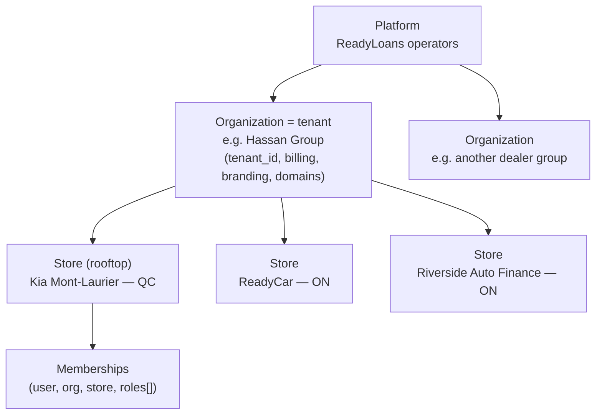
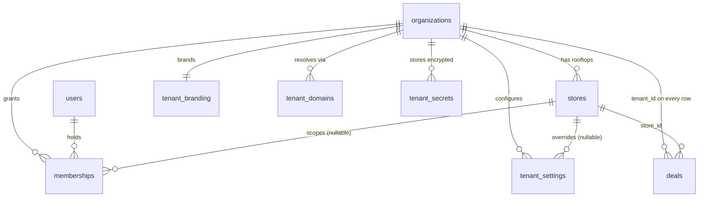
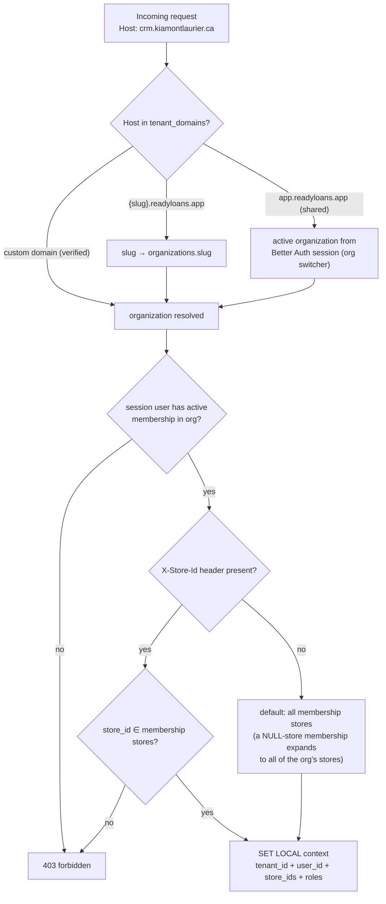
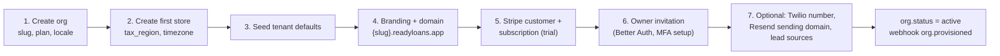

# Multi-Tenancy

This document specifies the ReadyLoans tenancy model: the Platform → Organization → Store hierarchy, the shared-schema `tenant_id` + forced Postgres RLS isolation model (ADR-007), tenant resolution from custom domains and subdomains, provisioning and offboarding flows, per-tenant configuration and secrets, noisy-neighbor controls, and the concrete migration path from the current single-store Kia Mont-Laurier schema. Sections labeled **Current** document the legacy system as it is; everything else is **Target**.

## Table of Contents

1. [Tenant Hierarchy](#1-tenant-hierarchy)
2. [Current State (as-is)](#2-current-state-as-is)
3. [Tenancy Data Model](#3-tenancy-data-model)
4. [Row-Level Security Model](#4-row-level-security-model)
5. [Tenant Context Resolution](#5-tenant-context-resolution)
6. [Cross-Tenant Access (Service Role)](#6-cross-tenant-access-service-role)
7. [Tenant Provisioning](#7-tenant-provisioning)
8. [Tenant Offboarding](#8-tenant-offboarding)
9. [Per-Tenant Configuration & Secrets](#9-per-tenant-configuration--secrets)
10. [Noisy-Neighbor Controls](#10-noisy-neighbor-controls)
11. [Migration Path from the Single-Store Schema](#11-migration-path-from-the-single-store-schema)
12. [Enterprise Escalation Path](#12-enterprise-escalation-path)

---

## 1. Tenant Hierarchy

Three levels (ADR-007):



| Level | Table | Owns | Examples |
|---|---|---|---|
| Platform | — (platform admin role, no tenant row) | Global reference data (`expense_categories`, provider price books), platform ops, cross-tenant AI network routing | ReadyLoans staff |
| Organization (**= `tenant_id`**) | `organizations` | Billing (Stripe customer), branding, domains, plan/entitlements, org-wide settings, memberships | Hassan Group |
| Store (rooftop) | `stores` | Tax region, Twilio number, hours/holidays, operational thresholds, inventory/deals/leads scoping | Kia Mont-Laurier, ReadyCar, Riverside |

Rules:

- **`tenant_id` = `organizations.id`.** Every business row carries `tenant_id` and (where store-scoped) `store_id` (ADR-007).
- Billing is **per rooftop** (per store) under one org subscription with quantity = store count (ADR-024).
- Users belong to organizations via **memberships** — `(user_id, organization_id, store_id, roles[])`. A `NULL store_id` membership grants org-wide access (owner/gm). Users may hold memberships in several stores or several organizations (Hassan's staff span all three stores).
- Cost-field visibility across stores (e.g., cross-store inventory sharing without exposing `acquisition_cost`) is **application-level column masking**, not RLS (ADR-007).

## 2. Current State (as-is)

**Current** facts the target design replaces:

- `stores` is the only tenancy anchor (seeded: `Kia Mont-Laurier` / code `KIA-ML` / QC / `tax_rate 0.14975`; UUID `4edcf6fb-d93e-4fe7-8d0f-9440dd60c907`). No organization level, no memberships — `users.store_id` is a single nullable column.
- `store_id` exists on ~30 tables but is **missing** on: `tags`, `lead_tags`, `appointments`, `lead_communications`, `message_templates`, `workflow_sequences/steps/enrollments`, `lead_assignment_rules/state/history`, `suppliers`, `expense_categories`, `required_documents`, `deal_stage_history`, `deal_parties`, `staff_schedules`, `lead_scores`.
- **Every RLS policy is `USING (true)`** — policy names claim restrictions ("Only admins can insert stores") that are not implemented. Several tables (`appointments`, `lead_communications`, `expenses`, `message_templates`, workflow tables, `suppliers`) have **no RLS at all**.
- `scopeToStore` middleware resolves `req.storeId` in priority order: `x-store-id` header → `store_id` query param → `req.user.store_id` → `null`; role `owner` is forced to `null` ("all stores"). The header/query sources are client-controlled and unvalidated; scoping is opt-in per route.
- The server uses the Supabase **service-role key** for all queries, so RLS would be bypassed even if implemented.

## 3. Tenancy Data Model



### `organizations`

| Column | Type | Notes |
|---|---|---|
| `id` | UUID PK | **the `tenant_id`** referenced platform-wide |
| `name` | TEXT NOT NULL | legal/display name |
| `slug` | TEXT UNIQUE NOT NULL | `^[a-z0-9](?:[a-z0-9-]{1,38})[a-z0-9]$`; used in subdomain + intake URLs; immutable after creation |
| `status` | TEXT NOT NULL DEFAULT `'active'` | CHECK: `'active','trial','past_due','read_only','suspended','offboarding','purged'` |
| `plan_tier` | TEXT NOT NULL DEFAULT `'core'` | CHECK: `'core','growth','scale','enterprise'` — drives entitlements/quotas (ADR-024, ADR-011) |
| `stripe_customer_id` | TEXT UNIQUE | |
| `default_locale` | TEXT NOT NULL DEFAULT `'fr-CA'` | CHECK `'fr-CA','en-CA'` (ADR-019) |
| `country` | TEXT NOT NULL DEFAULT `'CA'` | Law 25 residency: all tenants in `ca-central-1` (ADR-008) |
| `created_at` / `updated_at` / `deleted_at` | TIMESTAMPTZ | soft delete (ADR-009) |

### `stores`

| Column | Type | Notes |
|---|---|---|
| `id` | UUID PK | |
| `tenant_id` | UUID NOT NULL FK organizations | |
| `name`, `code` | TEXT NOT NULL; `code` UNIQUE per tenant | e.g. `KIA-ML` |
| `province` | TEXT NOT NULL | CHECK: 13 CA province/territory codes |
| `tax_region` | TEXT NOT NULL DEFAULT `'QC'` | selects the desking engine tax table (GST 5% + QST 9.975% for QC); replaces the legacy blended `tax_rate DECIMAL(6,4)` — per-deal `gst_cents/qst_cents/pst_cents/hst_cents` are written by `packages/core` (ADR-009) |
| `timezone` | TEXT NOT NULL DEFAULT `'America/Montreal'` | quiet-hours + drip scheduling are tenant-local (ADR-012/020) |
| `default_locale` | TEXT NOT NULL DEFAULT `'fr-CA'` | |
| `address`, `city`, `postal_code`, `phone`, `email` | TEXT | |
| `hours`, `holiday_calendar` | JSONB | carried over from legacy |
| `aging_threshold_days` | INTEGER NOT NULL DEFAULT 60 | legacy defaults preserved |
| `safety_overdue_days` | INTEGER NOT NULL DEFAULT 14 | |
| `funding_overdue_days` | INTEGER NOT NULL DEFAULT 7 | |
| `bill_of_sale_system` | TEXT DEFAULT `'CAMS'` | CHECK `'CAMS','Merlin','Other'` (Ready Group = CAMS, Kia = Merlin) |
| `twilio_number` | TEXT | one SMS number per store (ADR-020) |
| `status` | TEXT NOT NULL DEFAULT `'active'` | `'active','paused','closed'` |
| timestamps + `deleted_at` | | |

### `memberships`

| Column | Type | Notes |
|---|---|---|
| `id` | UUID PK | |
| `user_id` | UUID NOT NULL FK users | Better Auth user (ADR-006) |
| `tenant_id` | UUID NOT NULL FK organizations | |
| `store_id` | UUID FK stores, NULLable | `NULL` = org-wide (owner/gm/admin_office) |
| `roles` | TEXT[] NOT NULL | subset of the 10 platform roles: `owner, gm, sales_manager, used_car_manager, fi_manager, salesperson, wholesale_manager, logistics, admin_office, bdc_agent`; additive multi-role |
| `status` | TEXT NOT NULL DEFAULT `'active'` | `'invited','active','revoked'` |
| `invited_by` | UUID FK users | |
| `created_at` / `revoked_at` | TIMESTAMPTZ | role changes are audited to `activity_events` |

Unique: `(user_id, tenant_id, store_id)` — declared `NULLS NOT DISTINCT` (Postgres 16) so a user gets at most one org-wide (`store_id NULL`) row per organization. Composite indexes: `(tenant_id, user_id)`, `(user_id, status)`.

### `tenant_domains`

| Column | Type | Notes |
|---|---|---|
| `id` | UUID PK | |
| `tenant_id` | UUID NOT NULL FK organizations | |
| `domain` | TEXT UNIQUE NOT NULL | e.g. `crm.kiamontlaurier.ca` or generated `{slug}.readyloans.app` |
| `kind` | TEXT NOT NULL | CHECK `'subdomain','custom'` |
| `verified_at` | TIMESTAMPTZ | custom domains verified via the DNS-validated ACM record; per-domain ACM certs served by CloudFront (SaaS Manager / multi-tenant distribution model — ADR-014/018) |
| `is_primary` | BOOLEAN NOT NULL DEFAULT false | one primary per tenant |

`tenant_branding` (logo/dark logo/favicon/email logo, OKLCH color set, font, radius/density, legal name, support contacts) is specified by ADR-018 and lives 1:1 with `organizations`.

## 4. Row-Level Security Model

### 4.1 Invariants (ADR-007)

1. Every tenant-scoped table has `tenant_id UUID NOT NULL REFERENCES organizations(id)`; store-scoped tables also have `store_id UUID NOT NULL REFERENCES stores(id)`.
2. `ENABLE ROW LEVEL SECURITY` **and** `FORCE ROW LEVEL SECURITY` on every tenant table (owner-role not exempt).
3. **`USING (true)` policies are permanently banned** — CI greps migrations and fails the build on match.
4. Every column referenced by a policy carries a composite index `(tenant_id, …)` (ADR-008).
5. App-level scoping (the `tenant-context` hook) remains the first line; RLS is the backstop that turns a missing `WHERE tenant_id = ?` into a non-event instead of a breach.

### 4.2 Session context — pooler-safe `SET LOCAL`

The API/workers connect through **RDS Proxy** (ADR-008), so tenant context must be transaction-scoped, never connection-scoped — `SET LOCAL` inside a transaction is proxy-safe (no connection pinning):

```sql
BEGIN;
SET LOCAL app.tenant_id  = '018f6b2a-…';           -- organization id
SET LOCAL app.user_id    = 'ea422f90-…';
SET LOCAL app.store_ids  = '4edcf6fb-…,9c1d2e3f-…'; -- membership-derived allow-list; a NULL-store
                                                    -- (org-wide) membership expands to ALL org stores
SET LOCAL app.roles      = 'gm,fi_manager';         -- effective roles for the active context
SET LOCAL statement_timeout = '5s';                 -- 60s in workers, 120s in report jobs; overrides the
                                                    -- per-role safety nets (app_api 15s / app_worker 120s,
                                                    -- database-architecture.md §2) for this transaction
-- … queries …
COMMIT;
```

The GUC set (`app.tenant_id`, `app.user_id`, `app.store_ids`, `app.roles`) is exactly the one stamped by `withTenantContext` in [database-architecture.md §3](../05-database/database-architecture.md). The tenant-scoped DB executor in `apps/api` is the only code path that issues these; it derives values exclusively from the authenticated session + validated `X-Store-Id`, never from request bodies.

### 4.3 Helper functions

The helper catalog is defined once, with full DDL, in [indexing-and-rls.md §4](../05-database/indexing-and-rls.md) (canonical). Summary:

| Helper | Returns | Reads |
|---|---|---|
| `app.current_tenant_id()` | `uuid` | `app.tenant_id` GUC |
| `app.current_user_id()` | `uuid` | `app.user_id` GUC |
| `app.accessible_store_ids()` | `uuid[]` | `app.store_ids` GUC |
| `app.has_any_role(VARIADIC text[])` | `boolean` | `app.roles` GUC (used by role-gated write policies, template T-ROLE) |
| `app.shares_org_with(other_user uuid)` | `boolean` | `SECURITY DEFINER` membership lookup — for tables without a `tenant_id` column (`users`) |

All helpers are `STABLE` SQL functions so policies that wrap them in `(SELECT …)` evaluate once per statement (initPlan), not per row; every `SECURITY DEFINER` helper pins an explicit `search_path` (hard security requirement).

### 4.4 Policy template

Applied verbatim (via a migration generator in `packages/db`) to every tenant table:

```sql
ALTER TABLE deals ENABLE ROW LEVEL SECURITY;
ALTER TABLE deals FORCE ROW LEVEL SECURITY;

-- T-STORE template (indexing-and-rls.md §4, canonical): tenant isolation + store scoping.
-- A row with store_id IS NULL is org-wide and visible to every member of the tenant.
CREATE POLICY deals_select ON deals FOR SELECT TO app_api, app_worker
  USING (tenant_id = (SELECT app.current_tenant_id())
     AND (store_id IS NULL OR store_id = ANY ((SELECT app.accessible_store_ids()))));

CREATE POLICY deals_insert ON deals FOR INSERT TO app_api, app_worker
  WITH CHECK (tenant_id = (SELECT app.current_tenant_id())
     AND (store_id IS NULL OR store_id = ANY ((SELECT app.accessible_store_ids()))));

CREATE POLICY deals_update ON deals FOR UPDATE TO app_api, app_worker
  USING (tenant_id = (SELECT app.current_tenant_id())
     AND (store_id IS NULL OR store_id = ANY ((SELECT app.accessible_store_ids()))))
  WITH CHECK (tenant_id = (SELECT app.current_tenant_id())
     AND (store_id IS NULL OR store_id = ANY ((SELECT app.accessible_store_ids()))));
```

Notes:

- `(SELECT …)` wrapping triggers the Postgres initPlan optimization — the function is evaluated once per statement instead of once per row (documented >100x wins on large tables).
- `UPDATE` needs both `USING` and `WITH CHECK`; the template supplies both. Org-wide tables use the simpler T-TEN template; the full template legend (T-TEN, T-STORE, T-APPEND, T-OWN, T-ROLE, P-READ) and the per-table policy catalog live in [indexing-and-rls.md §4–6](../05-database/indexing-and-rls.md) (canonical).
- Org-wide **access** is store-list expansion, not a policy flag: a NULL-store membership makes the API set `app.store_ids` to all of the org's stores (§4.2). Org-wide **rows** carry `store_id IS NULL`.
- Postgres DB roles (canonical catalog with grants in [indexing-and-rls.md §5](../05-database/indexing-and-rls.md)): `app_api` (RLS-bound; `apps/api`), `app_worker` (same policies; workers set context from job payloads), `app_intake` (dedicated minimal-grant role for `apps/intake` — `INSERT` on `intake_events` plus read-only endpoint resolution, so a compromised intake service cannot read CRM data), `service_role` (a plain Postgres role with BYPASSRLS; used **only** by the audited cross-tenant functions in §6). Realtime needs no DB role: Socket.IO authorization is application-level at join/emit time (ADR-004). DDL/migrations run as the privileged `postgres` owner over the direct (non-proxy) connection in CI ([migrations-operations.md §1](../05-database/migrations-operations.md)).
- Soft-delete filtering (`deleted_at IS NULL`) remains application-level (query-layer default scope) — RLS handles tenancy only, mirroring the current system's behavior.

### 4.5 Testing

- pgTAP suite in `packages/db`: for each tenant table, assert (a) RLS is enabled+forced, (b) a cross-tenant `SELECT/INSERT/UPDATE/DELETE` under `app_api` (and `app_worker`) with tenant A context returns zero rows / is rejected against tenant B data.
- CI leakage canary (ADR-023): seed two synthetic tenants in the migration dry-run database and run the contract test suite once per tenant context, diffing for cross-contamination.
- Policies are never validated from an owner/superuser session (`postgres` bypasses RLS) — only through the pooled `app_api` role.

## 5. Tenant Context Resolution

Resolution order (ADR-018): **custom domain → subdomain → login org context.**



Rules:

1. The **web SPA** loads `GET /api/v1/tenant/context` (public branding subset before login, full config after) keyed by `Host`; branding is cached in Valkey (`t:{tenantId}:branding`) and served with `Cache-Control: max-age=60, stale-while-revalidate=600`.
2. `X-Store-Id` selects the working store within the resolved org. It is **validated against memberships** on every request — a mismatch is `403`, never a silent fallback. This replaces the legacy client-trusted `x-store-id` (**Current** behavior documented in §2).
3. There is no legacy-style "owner bypass to all tenants": org-wide access never crosses the organization boundary. Platform admins use the separate service-role surface (§6).
4. Intake requests resolve tenant from the URL path (`/in/v1/leads/{tenantSlug}/{sourceKey}`) plus the per-source secret — never from headers.
5. **TLS for tenant domains terminates on CloudFront** (ADR-014): both `{slug}.readyloans.app` subdomains and verified custom domains resolve via Route 53 / the tenant's DNS to the CloudFront multi-tenant distribution (SaaS Manager model), each custom domain carrying its own DNS-validated ACM cert. The `Host` header is forwarded intact to the ALB and `apps/api`, which perform the resolution above — tenant-resolution logic never lives at the edge.

## 6. Cross-Tenant Access (Service Role)

Only three legitimate cross-tenant read/write paths exist (ADR-007); all run as `service_role` through named, audited `SECURITY DEFINER` SQL functions ([indexing-and-rls.md §5](../05-database/indexing-and-rls.md)) — application code cannot compose ad-hoc cross-tenant queries:

| Path | Function surface | Audit |
|---|---|---|
| AI network lead routing (route a lead to the best dealership across orgs that opted into the ReadyCar network) | `service.match_network_stores(lead_envelope jsonb)` — returns candidate `store_id`s + routing features; opt-in flag `tenant_settings key='network.lead_sharing'` | every call logged to `service_access_log` (caller, purpose, tenant_ids touched) |
| Platform admin (support, billing ops) | `service.admin_get_tenant(p_tenant uuid)`, impersonation issues a time-boxed session recorded in `activity_events` | mandatory reason string |
| Aggregate platform analytics | `service.platform_metrics()` — pre-aggregated, no row-level PII | nightly job only |

Financing-significant automated routing decisions carry the Law 25 s.12.1 human-review path (ADR-022).

## 7. Tenant Provisioning

Provisioning is a BullMQ flow triggered by `POST /api/v1/platform/organizations` (platform admin) or self-serve signup with a 14-day trial (ADR-024).



| Step | Writes | Detail |
|---|---|---|
| 1 | `organizations` | slug validated + reserved-word list (`www`, `api`, `app`, `admin`, `in`, `status`) |
| 2 | `stores` | `tax_region` from province; `timezone` default `America/Montreal` |
| 3 | per-tenant seed copies | 22 PDI template items, 5 automation rules (safety-overdue 14d, funding-overdue 7d, aging 60d, stage-change, task-overdue — legacy defaults), 9 bilingual lost reasons, 5 message templates (**tenant-parameterized, no Kia branding**), default lead-scoring rules |
| 4 | `tenant_branding`, `tenant_domains` | neutral ReadyLoans theme until the org uploads branding; WCAG AA auto-validation on custom colors (ADR-018); custom domain added later: DNS-validated ACM cert issued for the tenant domain, then attached to the CloudFront multi-tenant distribution (SaaS Manager model, ADR-014) — the tenant publishes the ACM validation CNAME |
| 5 | Stripe | per-rooftop subscription quantity = store count; entitlements cached `t:{id}:entitlements` |
| 6 | Better Auth org + invitation | first membership: `roles=['owner']`, `store_id=NULL`; TOTP MFA enforced at first login (ADR-006) |
| 7 | `tenant_secrets`, `lead_sources` | Twilio number purchase per store; per-source intake keys generated (`sourceKey` = 22-char base62 + per-source HMAC secret) |

Adding a store to an existing org repeats steps 2–3 + Stripe quantity increment. Provisioning is idempotent (deterministic job IDs keyed on slug) and completes in < 60s excluding DNS.

## 8. Tenant Offboarding

State machine on `organizations.status` (dunning path per ADR-024 — **never hard data deletion on payment failure**):

```
active → past_due (dunning, full access) → read_only (writes 403, exports allowed)
       → suspended (logins blocked, data intact)
       → offboarding (export window) → purged
```

| Phase | Trigger | Behavior | Duration |
|---|---|---|---|
| `read_only` | dunning exhausted or cancellation requested | API rejects mutations with `403 tenant_read_only`; AI outbound, drips, and webhooks paused; inbound leads still spooled | until resolved |
| `offboarding` | contract end confirmed | Export bundle generated by workers: full JSON + CSV per table + documents/photos zip, delivered via signed URL (72h expiry); outbound webhook `org.offboarding_started` | 30 days |
| `purged` | 30-day window elapsed | Hard delete of tenant rows + storage prefixes + Valkey keys + Twilio number release. **Retention exceptions:** deal/financial records required for tax audit are exported to cold storage before purge (7-year books-and-records horizon); PII within retained records is minimized per Law 25 destruction requirements; consent-ledger and STOP records retained 3 years (CASL defense) | irreversible |

Offboarding jobs run in a dedicated `tenant-lifecycle` queue with manual platform-admin confirmation required before the purge job is enqueued.

## 9. Per-Tenant Configuration & Secrets

### 9.1 `tenant_settings`

Typed key-value with org-level defaults and store-level overrides: `(tenant_id, store_id NULL, key, value JSONB)`, `UNIQUE (tenant_id, store_id, key)`. Values validated by a Zod registry in `packages/schemas` (one schema per key). Cached in Valkey `t:{id}:settings:{storeId|org}`, invalidated on write.

| Key | Scope | Example value | Consumer |
|---|---|---|---|
| `pipeline.stages` | org | ordered stage list (from `packages/schemas` vocabulary) | boards, reports |
| `desking.fees` | store | doc/admin fee defaults in cents | `packages/core` |
| `dispatch.vendors` | store | `[{"name":"supreme"},{"name":"denises_guys"}]` — replaces the hardcoded `'supreme'` | dispatch service |
| `alerts.thresholds` | store | `{"aging_days":60,"safety_overdue_days":14,"funding_overdue_days":7,"recon_approval_cents":200000}` | automation engine |
| `ai.persona` | org | assistant display name, FR/EN scripts refs, escalation targets | `packages/ai` |
| `ai.quiet_hours_override` | store | stricter-than-CRTC windows only | send layer |
| `network.lead_sharing` | org | `{"enabled":true,"radius_km":150}` | cross-tenant router (§6) |
| `comms.email_from` | store | verified sender identity | email workers |

### 9.2 `tenant_secrets`

Per-tenant third-party credentials (Twilio subaccount SID/token, per-source webhook secrets, outbound-webhook endpoint secrets, e-sign API keys):

| Column | Type | Notes |
|---|---|---|
| `id` | UUID PK | |
| `tenant_id` | UUID NOT NULL FK | |
| `name` | TEXT NOT NULL | e.g. `twilio.auth_token`, `webhook.endpoint.{id}.secret` |
| `ciphertext` | BYTEA NOT NULL | AES-256-GCM envelope-encrypted; data key wrapped by AWS KMS per-tenant key (ADR-015) |
| `key_version` | INTEGER NOT NULL | dual-secret rotation support |
| `rotated_at` / `created_at` | TIMESTAMPTZ | annual rotation or on incident |

Plaintext secrets never reach logs, Valkey, or the SPA; decryption is server-side only and audit-logged. The same KMS envelope scheme covers PII fields (SIN, licence, DOB, income, banking) with blind HMAC indexes for equality lookup (ADR-015).

## 10. Noisy-Neighbor Controls

| Control | Mechanism | Default | ADR |
|---|---|---|---|
| API rate quotas | Token bucket per tenant (plan-tier), then per user, then per endpoint | Core 300 req/min, Growth 900, Scale 2,400 (details in [scalability-performance.md §8](./scalability-performance.md)) | ADR-011 |
| Query runtime | `SET LOCAL statement_timeout` per transaction, layered over the per-role safety nets (`app_api` 15s / `app_worker` 120s — [database-architecture.md §2](../05-database/database-architecture.md)) | 5s API / 60s workers / 120s reports | ADR-007/008 |
| Job fairness | BullMQ per-tenant group limiters | max 5 concurrent jobs per tenant per queue; bulk-import queue: 1 concurrent + 1 enqueue/min per tenant | ADR-012 |
| Expensive endpoints | Per-endpoint buckets | PDF 10/min/tenant, Excel 6/min/tenant, AI call initiation 10/min/store, search 60/min/user | ADR-011 |
| AI/SMS spend | Stripe Meters as hard quotas at plan ceilings; overage per plan config | e.g. Core: 500 AI conversations + 1,000 SMS segments/mo included | ADR-024 |
| Storage | Per-tenant prefix quota check in upload workers | Core 50 GB / Growth 250 GB / Scale 1 TB | ADR-013 |
| Realtime | One multiplexed Socket.IO connection per client; room joins authorized against the session context | join quota 50 rooms/client | ADR-004 |
| Blast-radius isolation | An enterprise tenant with contractual isolation moves to a dedicated Neon-branch database (§12) | — | ADR-007/008 |

Sizing rationale: without tenant-aware quotas, error rates spike 40–60% under peak load (research brief); the limiter layers are enforced before compute in the Fastify `onRequest` phase.

## 11. Migration Path from the Single-Store Schema

Strangler order (ADR-026): **tenancy + auth + RLS foundation → core schema → data migration (Kia ML = tenant #1) → module parity → AI layer.** All schema changes follow expand-and-contract (ADR-023).

| Step | Action | Notes |
|---|---|---|
| 1 | Create `organizations`; insert **Hassan Group** (`slug='hassan-group'`) | the single tenant at cutover |
| 2 | Extend `stores` with `tenant_id`, `tax_region`, `timezone`, `status`; backfill Kia ML (existing UUID `4edcf6fb-d93e-4fe7-8d0f-9440dd60c907`) → Hassan Group; create ReadyCar + Riverside store rows | legacy `tax_rate 0.14975` maps to `tax_region='QC'` |
| 3 | Create `memberships`; migrate `users.store_id` + `role` → membership rows (`roles=[role]`); `owner` role → `store_id=NULL` org-wide membership | users table re-homed under Better Auth (ADR-006) |
| 4 | Add `tenant_id UUID` to **every** business table; backfill via `store_id → stores.tenant_id`; rows with `store_id IS NULL` backfill to Kia ML; then `SET NOT NULL` + FK + composite indexes `(tenant_id, …)` | expand phase — nullable first, backfill batched, contract later |
| 5 | Add missing `tenant_id`/`store_id` to the unscoped tables from §2 (**tags, appointments, lead_communications, message_templates, workflow tables, assignment rules, suppliers, deal_stage_history, deal_parties, staff_schedules, lead_scores, required_documents**); global `tags` become tenant-scoped with a uniqueness change: `UNIQUE (tenant_id, name)` | `expense_categories` is the one platform catalog (nullable `tenant_id`, 17 seeded codes stay global — [migrations-operations.md §6.1](../05-database/migrations-operations.md)); `required_documents` is tenant-scoped (`tenant_id NOT NULL`), seeded per tenant from the provisioning template ([schema-design.md §12](../05-database/schema-design.md)) |
| 6 | Drop every `USING (true)` policy; apply the §4.4 template to all tenant tables; `FORCE ROW LEVEL SECURITY`; create the `app.*` helpers and DB roles `app_api`, `app_worker`, `app_intake` ([indexing-and-rls.md §4–5](../05-database/indexing-and-rls.md)); `service_role` stays reserved for the audited service functions; DDL keeps running as the `postgres` owner in CI | pgTAP suite must pass before step 7 |
| 7 | Cut API traffic to the Fastify app using pooled `app_api` connections + `SET LOCAL` context; retire the service-role-everywhere Express client; rotate the leaked service-role/Resend keys | ADR-008/023 |
| 8 | Data-convention cleanup in the same wave (ADR-009): finish the cents conversion (`commissions` NUMERIC dollars, `sourced_units.deposit_amount`, `source_costs.spend`), replace name-keyed references (`salesperson_name`, `override_on`) with FKs, collapse duplicate status axes (`deal_status`/`pipeline_stage`, `status`/`dispatch_status`) to the `packages/schemas` vocabularies | migrate-then-drop |
| 9 | Verification: two-tenant leakage canary in CI, RLS performance pass (`EXPLAIN` on hot board queries, initPlan confirmed), load test at 2× current traffic | gate for multi-tenant GA |

Rollback posture: steps 1–5 are additive and reversible; step 6–7 cut over behind a feature flag per module (strangler), with the legacy Express path kept read-only for two weeks post-cutover.

## 12. Enterprise Escalation Path

Shared schema + RLS is the default for dozens-to-hundreds of rooftops (ADR-007). A tenant may escalate to a **dedicated database (Neon branch)** only when it presents: hard contractual isolation, data-residency carve-outs, or noisy-neighbor SLAs that logical isolation cannot meet. The escalated tenant keeps the identical schema/migrations (one migration path), connects through a per-tenant connection string resolved at the DB-executor layer, and pays an enterprise tier. Schema-per-tenant is rejected outright (catalog bloat, N-migration pain, pooler incompatibility).
