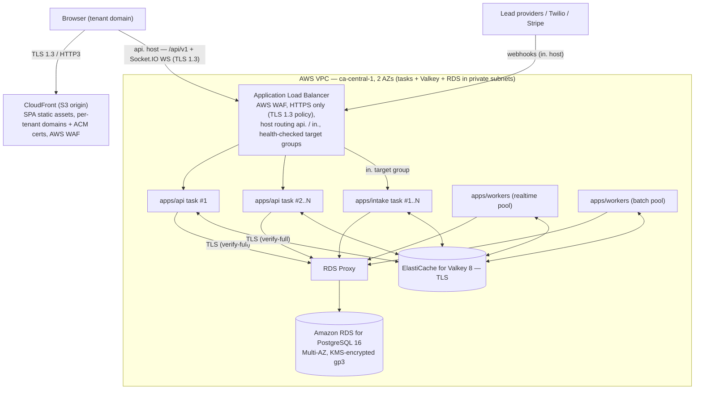

# Scalability & Performance

This document specifies how ReadyLoans stays fast and fair as tenants are added: the load-balancing topology, horizontal-scaling and statelessness rules, the Valkey caching layers and their invalidation contracts, the layered rate-limiting tiers (per tenant / user / IP / endpoint), the background-job and queue catalog, N+1 prevention discipline, and the concrete performance budgets every release is measured against. It conforms to the ADRs in [ARCHITECTURE-DECISIONS.md](../00-overview/ARCHITECTURE-DECISIONS.md) (notably ADR-008, ADR-010, ADR-011, ADR-012, ADR-014, ADR-025). Sections labeled **Current** describe the legacy system as it is; everything else is **Target**. Section numbering is load-bearing: [system-architecture.md §5.3](./system-architecture.md) links here for the queue catalog (§9) and [multi-tenancy.md §10](./multi-tenancy.md) for rate-limit tiers (§8).

## Table of Contents

1. [Performance Budgets & SLOs](#1-performance-budgets--slos)
2. [Current State (as-is)](#2-current-state-as-is)
3. [Load Balancing Topology](#3-load-balancing-topology)
4. [Horizontal Scaling & Stateless Services](#4-horizontal-scaling--stateless-services)
5. [Caching Layers & Invalidation](#5-caching-layers--invalidation)
6. [Database Scalability](#6-database-scalability)
7. [N+1 Prevention & Query Discipline](#7-n1-prevention--query-discipline)
8. [Rate Limiting Tiers](#8-rate-limiting-tiers)
9. [Background Jobs & Queues](#9-background-jobs--queues)
10. [Realtime Scaling](#10-realtime-scaling)
11. [Frontend Performance Budgets](#11-frontend-performance-budgets)
12. [Load Testing & Capacity Planning](#12-load-testing--capacity-planning)

---

## 1. Performance Budgets & SLOs

Platform SLOs (ADR-025) — alerting is on error-budget burn rate, not single spikes:

| SLO | Target | Measured at |
|---|---|---|
| API latency | **p95 < 300 ms** (reads and writes) | Fastify OTel span, per route |
| Lead-intake ACK | **p99 < 1 s**, typical < 100 ms | `apps/intake` ACK span |
| AI first touch | **< 60 s** from intake ACK to first outbound SMS/voice turn | lead-pipeline Flow telemetry (product metric, ADR-025) |
| Availability | 99.9% monthly on `/api/v1` (≤ 43.2 min error budget) | Better Stack uptime + ALB health checks |

Finer budgets that roll up into the SLOs — regressions block release:

| Budget | Target | Notes |
|---|---|---|
| Kanban board query (deals by stage, one store) | < 150 ms DB time | covering composite index, §6/§7 |
| Lead queue query | < 100 ms DB time | partial index on active statuses |
| Full-text search (`q=` tsvector) | p95 < 200 ms | GIN index; 60/min/user limit (§8) |
| Realtime propagation (commit → client event) | < 2 s | Socket.IO emit on write, §10 |
| PDF render job (bill of sale, reports) | p95 < 20 s queue-to-done | sandboxed Playwright workers (§9) |
| Excel export job | p95 < 30 s | ExcelJS in workers |
| Image processing job (sharp, per photo) | p95 < 10 s | EXIF strip + blurhash + variants |
| Webhook delivery first attempt | < 5 s from event commit | `webhook-delivery` queue |
| SPA initial JS | ≤ 350 KB gzip | §11 |
| SPA LCP / INP | < 2.5 s / < 200 ms on mid-tier hardware | §11 |

Every request/job carries `tenant_id` + trace ID (pino + OpenTelemetry, ADR-025), so all budgets are also inspectable **per tenant** — a prerequisite for diagnosing noisy-neighbor incidents.

## 2. Current State (as-is)

**Current** facts that motivate this design:

- One Express process (port 3001), no load balancer, no second instance, no health-checked deploys.
- **No cache layer, no rate limiting, no queues.** Resend emails, PDFKit PDFs, and ExcelJS workbooks run inline in request handlers — a report request blocks the event loop for every other user.
- One Supabase service-role client for all queries; no connection pooling discipline, no `statement_timeout`.
- No pagination on most list endpoints (full-table reads client-side filtered); react-query with 30 s stale time papers over it.
- Realtime = Supabase subscriptions on 17 tables with `USING (true)` policies — every client receives every store's changes.
- Automation specs (escalations, drips, `next_run_at` pollers) exist in schema only; no scheduler runs them.

## 3. Load Balancing Topology

Topology per ADR-014 — SPA on S3 served by CloudFront; API/intake/workers as Docker images (ECR) running as ECS Fargate services in AWS `ca-central-1` (Montreal), in private subnets across 2 AZs behind one Application Load Balancer, with ElastiCache for Valkey and Amazon RDS for PostgreSQL 16 (behind RDS Proxy) in the same VPC's private subnets:

| Aspect | Rule |
|---|---|
| Task floor | **≥ 2 always-on `apps/api` Fargate tasks, spread across 2 AZs** at all times (ADR-014) — a deploy, task crash, or single-AZ event never drops the API to zero |
| Health checks | `GET /healthz` = liveness (process up, no dependency checks); `GET /readyz` = readiness (Postgres `SELECT 1` through the pool + Valkey `PING` + migration-ledger match — canonical contract in [hosting-topology.md §5](../07-infrastructure/hosting-topology.md)); ALB target-group health checks route only to ready targets |
| Deploys | **CodeDeploy blue/green (decided 2026-07-23, ADR-023)**: green task set passes `/healthz` + `/readyz` health gates → ALB listener traffic shifts (canary/linear, ci-cd.md §8) → CloudWatch alarms snap traffic back to blue in seconds on failure; blue retained 1 h post-cutover for instant revert; old tasks drain gracefully (SIGTERM, §4); `workers` (no ALB target) uses circuit-breaker task swaps with previous-revision redeploy |
| Stickiness | Realtime WebSockets (Socket.IO — ADR-004) terminate on the `apps/api` tasks behind the ALB: target-group **stickiness is enabled for the Socket.IO handshake/upgrade path** and the ALB idle timeout is raised for long-lived connections; the `@socket.io/redis-adapter` fans events out across tasks, so any task can serve any room. REST traffic remains fully stateless (§4) — stickiness is a transport convenience, never a state dependency |
| TLS | TLS 1.3 policy on CloudFront and the ALB, HTTP→HTTPS redirect at the ALB, **re-encrypted to origin** — no plaintext internal hops; `sslmode=verify-full` to Postgres, TLS to Valkey (ADR-015) |
| Intake isolation | `apps/intake` is its own ECS service + target group (`in.` host rule on the shared ALB) — it scales and fails independently of `apps/api`, so a core-API deploy can never drop provider webhooks; the Hono-on-edge split remains available later without contract changes (ADR-005/014) |
| Exit path | **Discharged (2026-07-24).** Compute already ran on the target primitives (ECS + ALB — ADR-014), and the formerly documented DB-side exit — RDS if Supabase ever had to be shed — was exercised before build start: the database is Amazon RDS inside this VPC, making every platform dependency single-vendor AWS (ADR-008/014) |

## 4. Horizontal Scaling & Stateless Services

Every app container is disposable: any instance can serve any request, any worker can take any job.

Statelessness rules (violations are review blockers):

1. **No in-process session state.** Sessions are DB-backed (Better Auth, ADR-006) with a Valkey lookup cache (§5); no instance-local login state.
2. **No local durable files.** Uploads go to Amazon S3 via presigned URLs (ADR-013); PDF/Excel jobs write to OS temp and upload before completing; temp is wiped on job end.
3. **Shared state lives in Postgres (truth) or Valkey (cache/coordination)** — idempotency records, rate-limit buckets, queue state. The only in-process memory is the L1 config LRU with a 30–60 s TTL (§5), whose staleness is explicitly acceptable.
4. **No instance-local cron.** All scheduled work is BullMQ repeatable jobs (§9) — adding worker instances never duplicates schedules (BullMQ dedupes repeatables by job key).

Scaling triggers — implemented as **ECS service auto-scaling** (ADR-014): target-tracking policies on CPU + ALB request count per target for `apps/api`/`apps/intake`; the worker pools scale on **custom BullMQ queue-depth CloudWatch metrics** published by the workers themselves:

| Service | Scale out when | Scale in when |
|---|---|---|
| `apps/api` | CPU > 70% for 5 min **or** route p95 > 250 ms for 10 min | CPU < 30% for 30 min (never below 2 tasks) |
| `apps/intake` | ACK p99 > 500 ms or RPS > 200/task | idle margin restored (floor 1 in prod; 2 at ≥10 stores — [hosting-topology.md §5](../07-infrastructure/hosting-topology.md)) |
| `apps/workers` (realtime pool) | oldest waiting job age > 30 s **or** waiting count > 500 on `lead-pipeline`/`ai-turn`/`sms` | queues drained for 15 min |
| `apps/workers` (batch pool) | waiting count > 1,000 on `pdf-render`/`excel-export`/`image-process` | queues drained |

Graceful shutdown (identical in api/intake/workers): on `SIGTERM` — stop accepting new work (LB deregistration / `worker.close()` stops job pickup) → drain in-flight HTTP requests (30 s deadline) → wait for active jobs to finish (60 s deadline, long AI/PDF jobs checkpoint and re-enqueue with their deterministic ID) → flush pino/OTel → exit 0. BullMQ's stalled-job detection re-queues anything a killed instance held.

## 5. Caching Layers & Invalidation

Three layers (ADR-010). Rule zero: **no correctness-critical data lives only in cache** — Valkey loss degrades latency, never consistency.

| Layer | Where | Holds | TTL | Invalidation |
|---|---|---|---|---|
| L0 — HTTP/CDN | CloudFront + browser | SPA assets (content-hashed, `immutable`); `GET /api/v1/tenant/context` branding subset (`Cache-Control: max-age=60, stale-while-revalidate=600`) | ∞ / 60 s | new deploy hash + CloudFront invalidation on deploy (ADR-023) / TTL |
| L1 — in-process LRU | each api/worker instance | tenant branding, feature flags, `tenant_settings`, entitlements | 30–60 s, max 1,000 entries | TTL + Valkey pub/sub `cache-invalidation` broadcast on write |
| L2 — Valkey | shared, TLS | everything below | per-key | explicit on write (config-class) or TTL (aggregate-class) |

L2 key catalog — keys are **always tenant-prefixed** (`t:{tenantId}:…`, ADR-010), which makes tenant offboarding a prefix scan-and-delete:

| Key | Content | TTL | Invalidation |
|---|---|---|---|
| `t:{tenantId}:branding` | `tenant_branding` record | 24 h | explicit on `PUT /org/branding` + pub/sub to L1 |
| `t:{tenantId}:settings:{storeId\|org}` | merged `tenant_settings` | 24 h | explicit on settings write |
| `t:{tenantId}:entitlements` | plan quotas/flags from Stripe subscription | 5 min | explicit on Stripe webhook (ADR-024) |
| `session:{sha256(token)}` | Better Auth session lookup result | 5 min | explicit on logout/revocation/role change (ADR-006 — revocation is immediate, cache included) |
| `t:{tenantId}:idem:{key}` | idempotency `{fingerprint,status,response}` | 24 h | TTL ([api-design.md §9](./api-design.md)) |
| `t:{tenantId}:inv:summary:{storeId}` | inventory summary fed to the AI prompt prefix (ADR-022) | 15 min | explicit on inventory write (also refreshes the Claude prompt-cache prefix) |
| `t:{tenantId}:stats:{dashboard}:{storeId}` | dashboard aggregate rows | 60 s | TTL only |
| `rl:{layer}:{scope}` | rate-limit token buckets (§8) | rolling | consumed by `rate-limiter-flexible` |
| `bull:{queue}:*` | BullMQ state (§9) | managed by BullMQ | `removeOnComplete/Fail` TTLs |

Discipline:

- **Pattern:** cache-aside (read → miss → load → set). No write-through, no cache-as-source-of-truth.
- **Config-class keys** (branding, settings, entitlements, sessions) invalidate explicitly on write; **aggregate-class keys** (stats, summaries) rely on TTL — a 60 s stale dashboard is acceptable, a stale entitlement is not.
- **Stampede protection** on expensive rebuilds (stats, inventory summaries): single-flight lock `SET t:{id}:lock:{key} NX PX 5000`; losers serve the stale value or wait; TTLs are jittered ±10% so tenant caches don't expire in lockstep.
- **Valkey outage:** api serves from L1 where possible and falls back to Postgres reads (slower, correct); rate limiting falls back to a conservative in-process limiter (§8); BullMQ producers buffer briefly then surface `503 dependency_unavailable`. An alert fires immediately (ADR-025).

## 6. Database Scalability

A single Amazon RDS for PostgreSQL 16 instance (Multi-AZ at production launch) in `ca-central-1`, VPC-private behind RDS Proxy (ADR-008) — the database is the expected bottleneck, so the design spends effort here rather than on framework throughput.

| Concern | Rule |
|---|---|
| Pooling | **RDS Proxy** for api/intake/workers (tenant context via `SET LOCAL` per transaction — transaction-scoped, proxy-safe, [multi-tenancy.md §4.2](./multi-tenancy.md)); pool budget per api instance: 10 connections; workers: 5 per instance; plus one small **direct** (non-proxy) pool reserved for migrations and `LISTEN` |
| Statement timeouts | `SET LOCAL statement_timeout` in every transaction: **5 s API / 60 s workers / 120 s reports** — the operative per-transaction budget, layered over the per-role safety nets (`app_api` 15 s / `app_worker` 120 s — [database-architecture.md §2](../05-database/database-architecture.md)) that catch any path bypassing the tenant executor; a runaway tenant query cannot hold a pooled connection |
| Indexing | Composite `(tenant_id, <hot column>)` on every policy/filter column; partial indexes for active-pipeline queries (e.g. `CREATE INDEX deals_board_idx ON deals (tenant_id, store_id, pipeline_stage, stage_entered_at DESC) WHERE deleted_at IS NULL AND pipeline_stage NOT IN ('complete','lost')`); GIN for tsvector + JSONB; every keyset sort key covered `(tenant_id, sort_key, id)` ([api-design.md §6](./api-design.md)) |
| RLS cost | Policies use `(SELECT app.current_tenant_id())` initPlan wrapping — evaluated once per statement, not per row (>100× documented wins); `SECURITY DEFINER` membership helpers; RLS performance is asserted in the migration-gate `EXPLAIN` pass ([multi-tenancy.md §11 step 9](./multi-tenancy.md)) |
| Partitioning | None at launch. Monthly range partitions **pre-planned** for `messages`, `activity_events`, `notifications` when any exceeds ~10 M rows (ADR-008); partition keys `(created_at)` with `tenant_id` in every index — the DDL is staged in `packages/db` so the cutover is a rehearsed migration, not a redesign |
| Read replica | Deferred until reporting load demands it; when added, `/reports`, `/analytics`, and the nightly `service.platform_metrics()` route to the replica via a second pool — replica lag is acceptable there and nowhere else |
| Hot writes | `activity_events` is append-only in the same transaction as the state change (ADR-009); it is the first partitioning candidate and never emits realtime events — only the entities the UI actually watches are emitted (§10) |
| Vertical headroom | RDS instance class upsized (db.t4g.medium → larger, ADR-008 cost ramp) before any sharding conversation; the enterprise escape valve is a dedicated Neon-branch database per contract-isolated tenant ([multi-tenancy.md §12](./multi-tenancy.md)), never ad-hoc sharding |

## 7. N+1 Prevention & Query Discipline

The legacy app avoids N+1 mostly by fetching everything; the target API paginates strictly, which makes per-row lazy loading the main regression risk. Discipline:

1. **Query budget per endpoint:** any list endpoint completes in **≤ 4 SQL statements** (page query + ≤ 3 batch hydrations). Detail endpoints ≤ 6. The budget is asserted in integration tests via the pg OTel instrumentation (statement count per trace).
2. **Batch hydration, never per-row queries.** Relations for a page of N rows load with one `WHERE id = ANY($1)` (or lateral join) per relation, assembled in the service layer. A per-request DataLoader-style batcher in `apps/api` collapses duplicate lookups (e.g., 50 deals → 12 distinct salespeople → 1 query).
3. **Join-or-batch decided in the contract.** Each ts-rest response schema declares its embedded relations (`deal.salesperson`, `deal.contact` summary objects); anything not in the schema is a separate endpoint call — no ad-hoc `?include=` explosion.
4. **Aggregates in SQL, not JS.** Board column counts/sums are one `GROUP BY pipeline_stage` query; the kanban board is a single statement using a window function to cap rows per stage: `ROW_NUMBER() OVER (PARTITION BY pipeline_stage ORDER BY stage_entered_at DESC) <= 25`, backed by the `deals_board_idx` partial index (§6).
5. **Banned:** queries inside loops (code-review checklist + a lint rule flagging `await` on the DB executor within `for`/`map`), `SELECT *` in application SQL, unpaginated collection reads.
6. **Detection in production:** OTel traces alert when a single request emits > 10 statements or > 3 statements with the same fingerprint; `pg_stat_statements` is reviewed at each capacity checkpoint (§12); new hot-path queries land with an `EXPLAIN (ANALYZE, BUFFERS)` plan attached to the PR.

## 8. Rate Limiting Tiers

Token bucket via `rate-limiter-flexible` (atomic Lua) on Valkey (ADR-011). Layered, **narrowest-wins**; sizing rationale: without tenant-aware quotas, error rates spike 40–60% under peak load (research brief). [multi-tenancy.md §10](./multi-tenancy.md) references these numbers.

Enforcement is two-phase in the Fastify pipeline ([system-architecture.md §7.1](./system-architecture.md)): cheap identity-free layers run in `onRequest` **before** session resolution; tenant/user/endpoint buckets run immediately after tenant context is established. All buckets for a request are checked before the handler runs.

| # | Layer | Scope key | Default limits | Applies to |
|---|---|---|---|---|
| 1 | Global infra ceiling | `rl:global` | 10,000 req/s cluster-wide | everything — protects Postgres/Valkey during incident traffic |
| 2 | Per-IP (unauthenticated) | `rl:ip:{ip}` | 60 req/min; **auth endpoints 10/min + exponential lockout** on failures; intake sources get high-burst buckets: burst 100, refill 25/s per source | pre-auth traffic, brute-force defense (ADR-011) |
| 3 | Per-tenant plan quota | `rl:t:{tenantId}` | **Core 300 req/min (burst 100) · Growth 900 (burst 300) · Scale 2,400 (burst 600) · Enterprise custom** — read from cached entitlements (ADR-024) | all authenticated `/api/v1` traffic |
| 4 | Per-user | `rl:t:{tenantId}:u:{userId}` | 120 req/min (burst 60) | fair share inside a tenant |
| 5 | Per-endpoint (expensive paths) | `rl:t:{tenantId}:ep:{name}` | PDF export 10/min/tenant · Excel export 6/min/tenant · AI call initiation 10/min/store · search 60/min/user · bulk import 1 concurrent + 1 enqueue/min/tenant | protects workers + provider spend |

Behavior:

- Rejection: `429` + `Retry-After` (seconds) + `X-RateLimit-Limit/Remaining/Reset` for the **narrowest** exhausted bucket ([api-design.md §4](./api-design.md)).
- Plan quotas and AI/SMS meters share one source: entitlements on the tenant record — the same numbers drive limits here and Stripe metering (ADR-011/024). Metered-quota exhaustion returns `quota_exceeded`, not `rate_limited`.
- Valkey outage → **fail-open with a conservative in-process fallback** (per-instance token bucket at 1/Nth of the tenant limit for N instances) + immediate alert; auth endpoints fail-closed at layer 2.
- Enterprise tenants with SLAs can get dedicated bucket configs (and, ultimately, dedicated placement per [multi-tenancy.md §12](./multi-tenancy.md)).

## 9. Background Jobs & Queues

BullMQ 5 on Valkey (ADR-012). Global rules: every payload carries `tenant_id`; jobs are **idempotent with deterministic IDs** (webhook redelivery and retries collapse); `removeOnComplete: {age: 86400, count: 1000}`, `removeOnFail: {age: 604800}` bound Valkey memory; each queue has a DLQ (`{queue}:dlq`) with a forensic worker and an alert when depth > 0 for 15 min; **per-tenant group limiters cap 5 concurrent jobs per tenant per queue** (bulk-import: 1) so one dealership's import can't starve others ([multi-tenancy.md §10](./multi-tenancy.md)).

Workers deploy as two pools so speed-to-lead is never starved by batch rendering (§4):

| Pool | Queues | Why |
|---|---|---|
| Realtime-critical | `lead-pipeline`, `ai-turn`, `voice-orchestration`, `sms`, `webhook-delivery` | protects the AI-first-touch < 60 s SLA |
| Batch | `email`, `pdf-render`, `excel-export`, `image-process`, `drip-engine`, `report-schedule`, `tenant-lifecycle`, `billing-usage` | throughput-oriented, retry-tolerant |

Queue catalog (referenced by [system-architecture.md §5.3](./system-architecture.md)):

| Queue | Job ID pattern (deterministic) | Concurrency / worker | Attempts × backoff | Notes |
|---|---|---|---|---|
| `lead-pipeline` (Flow) | `lead-intake:{tenantSlug}:{providerId\|sha256}` | 10 | 3 × exp(5 s) | parent Flow: normalize/dedupe → consent-check → ai-first-touch → extraction → routing → agent-assignment; child failure fails up to the parent for forensic replay |
| `ai-turn` | `ai-turn:{conversationId}:{turnSeq}` | 10 | 3 × exp(2 s) | Claude Messages API + tool runner; per-tenant limiter 5; turn seq makes redelivery a no-op |
| `voice-orchestration` | `voice:{callSid}` | 10 | 2 × exp(2 s) | ConversationRelay WebSocket sessions (ADR-020/022) |
| `sms` | `sms:{messageId}` | 20 (I/O-bound) | 5 × exp(30 s) | consent + CRTC quiet-hours + STOP gates run **in the processor**, not the enqueuer — state is rechecked at send time (ADR-020/022) |
| `email` | `email:{messageId}` | 20 | 5 × exp(30 s) | React Email render + Resend; tenant-branded, server-side i18n (ADR-018/019) |
| `pdf-render` | `pdf:{documentId}:{payloadHash}` | **2**, sandboxed process | 3 × exp(10 s) | Playwright/Chromium (ADR-021); CPU-bound — low concurrency; immutable snapshot + hash on success |
| `excel-export` | `xlsx:{exportId}` | 4 | 3 × exp(10 s) | ExcelJS |
| `image-process` | `img:{photoId}` | 4 | 3 × exp(5 s) | sharp: EXIF/GPS strip, max-dimension, blurhash, watermark + WebP/AVIF `srcset` variants (ADR-013) |
| `webhook-delivery` | `wh:{eventId}:{endpointId}` | 20 | 6 retries: 30 s → 2 m → 10 m → 1 h → 6 h → 24 h | HMAC-signed ([api-design.md §11–12](./api-design.md)); DLQ + per-tenant delivery log |
| `drip-engine` | `drip:{enrollmentId}:{stepOrder}` | 10 | 3 × exp(60 s) | workflow sequences; step order makes re-fires idempotent |
| `report-schedule` | `report:{scheduleId}:{periodKey}` | 2 | 2 × exp(60 s) | periodKey (e.g. `2026-07`) prevents duplicate period sends |
| `billing-usage` | `meter:{tenantId}:{meterKey}:{hourBucket}` | 5 | 5 × exp(60 s) | pushes AI-minutes/SMS counts to Stripe Meters (ADR-024) |
| `tenant-lifecycle` | `lifecycle:{tenantId}:{phase}` | 1 | manual retry | provisioning/offboarding/purge; purge requires platform-admin confirmation ([multi-tenancy.md §7–8](./multi-tenancy.md)) |

Repeatable jobs (replace every cron/poller spec — ADR-012; the legacy system had schedulers specified but never built):

| Repeatable | Schedule | Work |
|---|---|---|
| `sweep:task-overdue` | every 15 min | overdue tasks → notifications + escalation rules (`escalation_minutes`) |
| `sweep:daily-thresholds` | 07:00 tenant-local | aging (`aging_threshold_days`), safety overdue, funding overdue, photo-missing, incoming-ETA checks per store thresholds |
| `drip:enrollment` | 10:00 tenant-local | enroll/advance nurture drips (quiet-hours safe by construction) |
| `compliance:dncl` | daily | DNCL scrub freshness ≤ 31 days; consent-expiry sweep (6/24-month CASL windows, ADR-022) |
| `report:schedules` | per tenant config | scheduled report generation + email |
| `platform:metrics` | 02:00 UTC | `service.platform_metrics()` aggregate (no row-level PII) |

## 10. Realtime Scaling

Socket.IO 4 + `@socket.io/redis-adapter` on the `apps/api` tasks is the primary realtime layer (ADR-004) — capacity scales with the API service itself, and the adapter (ElastiCache Valkey) fans events out across tasks so any task can serve any room:

- **One multiplexed Socket.IO connection per client**, join quota **50 rooms/client** ([multi-tenancy.md §10](./multi-tenancy.md)); the SPA joins only the visible board/store rooms, leaving them on route change.
- **Tight event list:** only entities the UI actually watches (`deals`, `leads`, `notifications`, `messages`, `tasks`) are emitted — events come from the API/worker layer on writes, not DB change-capture, so payloads carry exactly the fields the UI needs; high-churn `activity_events` is never emitted (the legacy Supabase publication of 17 tables is not carried over).
- Room authorization happens at connect/join time against the Better Auth session ([api-design.md §13](./api-design.md)); emitters tenant-scope every payload via the lint-guarded helper — there is no RLS backstop on the stream, so join/emit-time enforcement is the control (ADR-004).
- **Behind the ALB** (§3): WebSocket upgrade on the `api.` host, target-group stickiness for the Socket.IO handshake path, raised idle timeout; connection counts and emit rates are CloudWatch metrics that feed the §4 scaling triggers for `apps/api`.
- **Degradation path:** on socket disconnect the SPA falls back to TanStack Query refetch-on-focus + 30 s polling — the app stays functional, just less live; presence entries expire in Valkey, so a crashed task never strands agents "online".
- Supabase Realtime — the previous primary — was superseded 2026-07-24 and remains only as a considered alternative (ADR-004).

## 11. Frontend Performance Budgets

| Budget | Target | Mechanism |
|---|---|---|
| Initial JS | ≤ 350 KB gzip | route-level code splitting (react-router v7 lazy routes); PDF/chart-heavy modules lazy-loaded |
| LCP | < 2.5 s (mid-tier laptop, Fast 3G+) | CloudFront (TLS 1.3, HTTP/3, compression), content-hashed immutable assets, branding CSS variables injected pre-paint (no FOUC, ADR-018) |
| INP | < 200 ms | virtualized grids (TanStack Table v8 + virtualizer) mandatory above 100 rows; no synchronous heavy compute on the main thread |
| Server-state freshness | TanStack Query `staleTime: 30 s` default (legacy parity), realtime events invalidate targeted query keys | ADR-002/004 |
| Images | `srcset` from sharp pre-generated WebP/AVIF variants in S3, served via CloudFront (origin access control); blurhash placeholders | ADR-013 |
| Fonts | self-hosted WOFF2 per tenant branding, `font-display: swap` | ADR-018 |

CI enforces the bundle budget (build fails on > 350 KB gzip initial chunk) and runs Playwright smoke flows with tracing (ADR-023).

## 12. Load Testing & Capacity Planning

- **Tooling:** k6 scenarios in the repo (`tools/load/`), run against staging with two seeded synthetic tenants (the same fixtures as the RLS leakage canary, [multi-tenancy.md §4.5](./multi-tenancy.md)).
- **Gates:** the multi-tenant GA migration gate requires a pass at **2× current production traffic** ([multi-tenancy.md §11 step 9](./multi-tenancy.md)); thereafter a monthly capacity run at 2× the trailing-30-day peak.
- **Scenarios:** (1) board/list read mix at tenant-quota rates; (2) burst lead intake — 50 leads/min/tenant sustained 10 min, asserting ACK p99 < 1 s **and** AI first-touch < 60 s under load; (3) noisy-neighbor: one tenant at 10× quota, asserting other tenants' p95 stays within budget (validates §8 fairness); (4) PDF/Excel batch alongside scenario 1 (validates worker-pool isolation, §9).
- **Capacity model:** track req/s per api instance at p95 = 300 ms and jobs/min per worker per queue; review with `pg_stat_statements` and index-bloat checks at each monthly run; scale-out thresholds in §4 are recalibrated from these numbers, not guessed.
- **SLO reporting:** burn-rate alerts (fast: 2% budget/hour; slow: 5%/day) via Better Stack + Sentry metrics (ADR-025); per-tenant latency percentiles retained 90 days for noisy-neighbor forensics.
