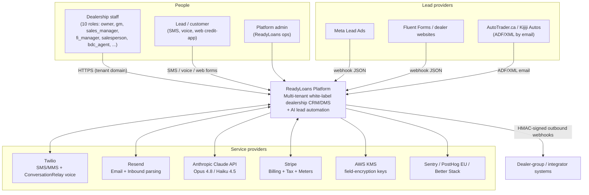
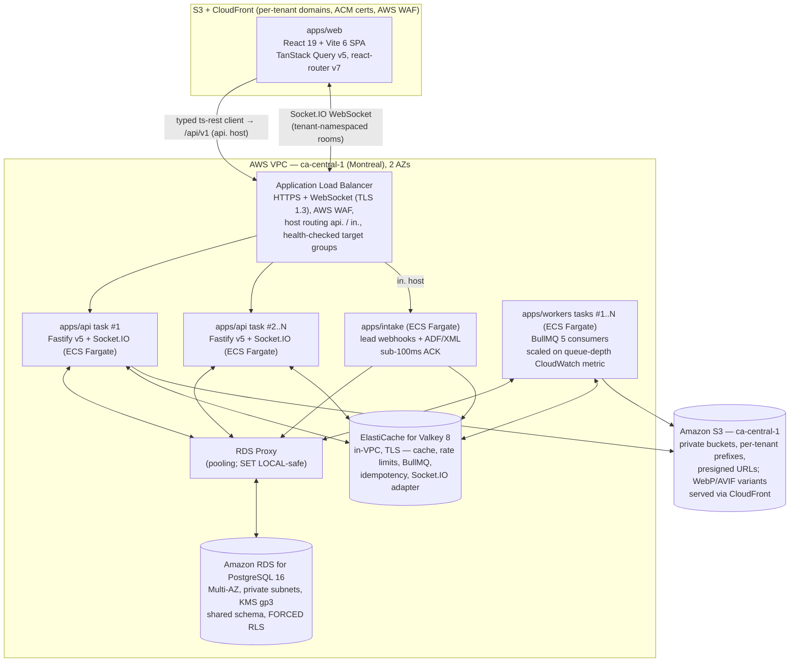
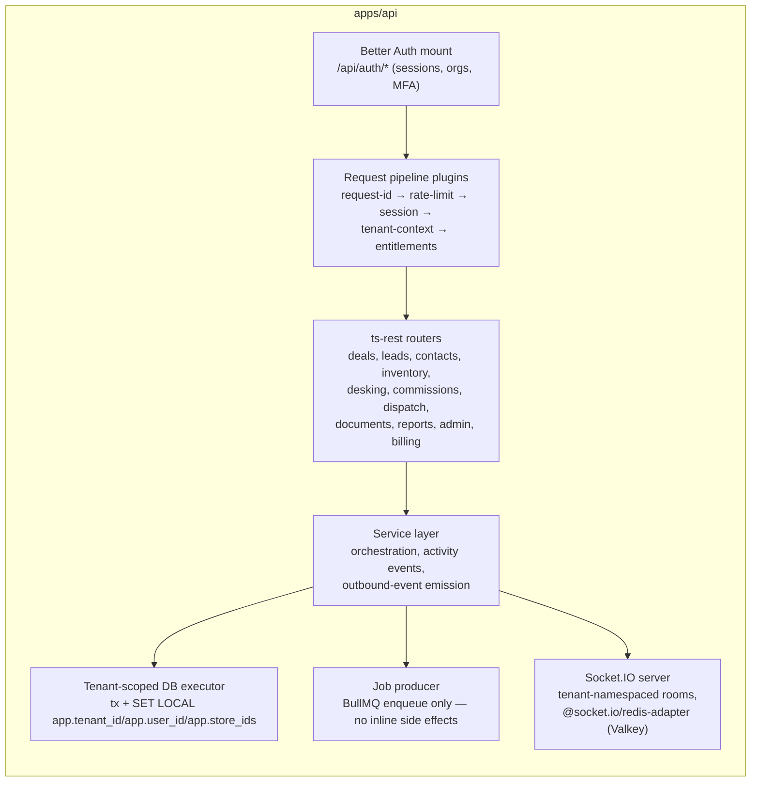
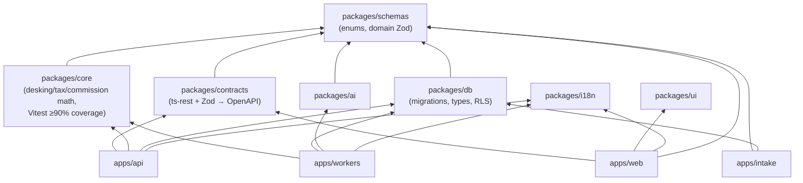
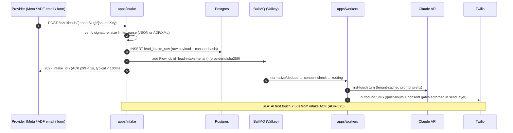

# System Architecture

This document defines the target C4-style architecture for ReadyLoans — the multi-tenant, white-label dealership platform that evolves the single-store Kia Mont-Laurier Deal Tracker — covering the system context, containers, key components, monorepo layout, and the end-to-end request lifecycle. It is the structural companion to [ARCHITECTURE-DECISIONS.md](../00-overview/ARCHITECTURE-DECISIONS.md); every element here conforms to those ADRs. Sections labeled **Current** describe the legacy system as it exists; everything else is **Target** architecture for the strangler rebuild (ADR-026).

## Table of Contents

1. [Architecture at a Glance](#1-architecture-at-a-glance)
2. [Current State Summary](#2-current-state-summary)
3. [C4 Level 1 — System Context](#3-c4-level-1--system-context)
4. [C4 Level 2 — Containers](#4-c4-level-2--containers)
5. [C4 Level 3 — Components](#5-c4-level-3--components)
6. [Monorepo Layout & Package Dependencies](#6-monorepo-layout--package-dependencies)
7. [Request Lifecycle](#7-request-lifecycle)
8. [Realtime Data Flow](#8-realtime-data-flow)
9. [Environments](#9-environments)
10. [Legacy → Target Mapping](#10-legacy--target-mapping)

---

## 1. Architecture at a Glance

| Concern | Decision | ADR |
|---|---|---|
| Repo | pnpm + Turborepo monorepo, TypeScript 5.9 strict | ADR-001 |
| Frontend | React 19 + Vite 6 SPA on S3 + CloudFront (per-tenant custom domains, ACM certs) | ADR-002, ADR-014 |
| API | Fastify v5, ts-rest + Zod contracts, `/api/v1` REST, OpenAPI 3.1 | ADR-003 |
| Workers | BullMQ 5 on managed Valkey 8 | ADR-010, ADR-012 |
| Lead intake | Dedicated `apps/intake` service (JSON + ADF/XML + inbound email) | ADR-005 |
| Database | Amazon RDS for PostgreSQL 16 (`ca-central-1`), VPC-private, RDS Proxy pooling; shared schema + forced RLS | ADR-007, ADR-008 |
| Realtime | Socket.IO 4 + `@socket.io/redis-adapter` (ElastiCache Valkey), tenant-namespaced rooms | ADR-004 |
| Auth | Better Auth 1.3+ (organization plugin), DB-backed sessions | ADR-006 |
| AI | Claude Opus 4.8 (conversation) + Haiku 4.5 (extraction), `packages/ai` | ADR-022 |
| Hosting | AWS `ca-central-1` (Montreal): SPA on S3 + CloudFront; API/workers/intake on ECS Fargate, ≥2 API tasks across 2 AZs behind one ALB | ADR-014 |

## 2. Current State Summary

**Current** (reference implementation only — retired module-by-module per ADR-026):

- Single Express.js process (`server/index.js`, port 3001) mounting 45 routers under `/api`, all using one Supabase client holding the `SUPABASE_SERVICE_ROLE_KEY` (bypasses RLS entirely).
- Auth: Supabase Auth JWT → app profile lookup in `users` (`auth_id` link), applied per-route, not globally.
- Proto-tenancy: `scopeToStore` middleware resolves `req.storeId` from client-controlled `x-store-id` header / `store_id` query param before the authenticated user's store, is mounted *after* all routers (effectively opt-in), and forces `null` (all stores) for the `owner` role.
- Every RLS policy in the database is `USING (true)` — isolation is purely application code.
- Emails (Resend), PDFs (PDFKit) and Excel (ExcelJS) run inline in request handlers; no queues, no rate limiting, no WebSocket layer, no OpenAPI spec.

These facts drive the target design: the service-role-everywhere pattern dies (ADR-008), tenancy becomes DB-enforced (ADR-007), and all slow/side-effecting work moves to workers (ADR-012).

## 3. C4 Level 1 — System Context



| Actor / System | Interaction | Protocol |
|---|---|---|
| Dealership staff | Full CRM/DMS UI on tenant domain (`{dealer}.readyloans.app` or custom domain) | HTTPS, session cookie |
| Leads/customers | AI conversation (SMS/voice), public credit-app pages, delivery notifications | Twilio SMS/voice, HTTPS |
| Meta Lead Ads | Lead webhooks, signature `X-Hub-Signature-256` | POST JSON |
| AutoTrader.ca / Kijiji | ADF/XML lead emails via Resend Inbound | Email → webhook |
| Twilio | Inbound/outbound SMS/MMS, ConversationRelay WebSocket (BYO-Claude voice, $0.07/min) | Webhooks + WS |
| Anthropic | Messages API with tool use, prompt caching per tenant | HTTPS |
| Stripe | Subscriptions, metered AI/SMS usage, GST/QST/HST tax, entitlements | Signed webhooks |
| Integrators | Consume OpenAPI 3.1 REST + HMAC-signed outbound webhooks | HTTPS |

## 4. C4 Level 2 — Containers



| Container | Package | Runtime / hosting | Scaling model | Responsibilities |
|---|---|---|---|---|
| Web SPA | `apps/web` | Static on S3, served by CloudFront (ACM certs, per-tenant domains) | CDN (infinite) | All staff UI; white-label theming at runtime (ADR-018); talks only to `/api/v1` via the `packages/contracts` client — direct browser→database queries are banned (ADR-002) |
| Core API | `apps/api` | Docker (ECR) on ECS Fargate, ≥2 always-on tasks across 2 AZs | Target-tracking auto-scaling behind the ALB (CPU + ALB request count) | Auth (Better Auth mounted), tenant resolution, all REST endpoints, Socket.IO realtime server (tenant-namespaced rooms, Redis-adapter fan-out), SSE for AI panels, outbound webhook event emission |
| Lead intake | `apps/intake` | Docker (ECR) on ECS Fargate — own service + target group behind the shared ALB (`in.` host; Hono-on-edge split available later) | Horizontal (target tracking) | Per-tenant webhook endpoints `/in/v1/leads/{tenantSlug}/{sourceKey}`, ADF/XML parsing, provider signature verification, canonical Lead envelope, persist + enqueue, ACK < 100ms |
| Workers | `apps/workers` | Docker (ECR) on ECS Fargate, N tasks | Scaled on BullMQ queue-depth CloudWatch metric | BullMQ queues: email, SMS, AI turns, voice orchestration, PDF (Playwright sandboxed), Excel, image (sharp), webhook delivery, drip engine, lead-pipeline Flow, repeatable jobs |
| Postgres | Amazon RDS for PostgreSQL 16 | Multi-AZ in the VPC's private subnets (`ca-central-1`); KMS-encrypted gp3, deletion protection, backups + PITR | Vertical (instance class) + read replica when reporting demands (ADR-008) | Single source of truth; RLS-enforced tenancy; RDS Proxy connection pooling |
| Realtime | Socket.IO 4 (in `apps/api`) | Runs on the API tasks; `@socket.io/redis-adapter` on Valkey | Scales with `apps/api` — the adapter fans out across tasks | Board/lead-queue updates, agent presence, AI-analysis streams — events emitted by API/workers on writes, no DB change-capture (ADR-004) |
| Storage | Amazon S3 + CloudFront | Private buckets `ca-central-1` (Block Public Access, SSE-KMS) | Managed | Vehicle photos, documents; presigned URLs only; sharp pre-generated WebP/AVIF `srcset` variants served via CloudFront (ADR-013) |
| Valkey | ElastiCache for Valkey | In-VPC (private subnets), TLS | `cache.t4g.micro` at pilot; replica/Multi-AZ before GA (ADR-014) | L2 cache, rate-limit state, BullMQ backing, idempotency keys, session lookup cache, Socket.IO adapter pub/sub |

## 5. C4 Level 3 — Components

### 5.1 `apps/api` (Fastify v5)



| Component | Detail |
|---|---|
| Request pipeline | Ordered Fastify `onRequest` hooks; see [§7](#7-request-lifecycle) |
| Better Auth mount | Handles `/api/auth/*` (login, MFA TOTP, org switch, invitations); sessions are DB-backed, rotating, `Secure`/`HttpOnly`/`SameSite=Lax` cookies (ADR-006) |
| ts-rest routers | One router per resource domain from `packages/contracts`; Zod-validated input *and* output |
| Service layer | Business orchestration; calls `packages/core` for all desking/tax/commission math; writes `activity_events` in the same transaction as the state change (ADR-009) |
| Tenant-scoped DB executor | The only path to Postgres for tenant data: opens a transaction through RDS Proxy, issues `SET LOCAL`, runs queries under RLS. No service-role key exists; workers/admin functions use scoped DB roles with Secrets Manager credentials (ADR-008) |
| Socket.IO server | Attached to the Fastify HTTP server: Better Auth session verified at the handshake, room joins authorized per membership; the service layer (and workers, via the Redis adapter) emit tenant-scoped events on writes (ADR-004) |
| Job producer | All emails, SMS, PDFs, AI calls, webhook deliveries are enqueued — never executed inline (ADR-012) |

### 5.2 `apps/intake`

| Component | Detail |
|---|---|
| Source router | Resolves `{tenantSlug}/{sourceKey}` to a configured `lead_sources` row (tenant, provider type, secret) |
| Signature verifiers | Meta `X-Hub-Signature-256`, Twilio signature, svix headers (Resend Inbound), per-source shared secret otherwise (ADR-005) |
| ADF/XML parser | ADF 1.0 → canonical Lead envelope; malformed XML → quarantine table, never a 5xx to the provider |
| Consent recorder | Stamps CASL basis (`implied_inquiry`, 6-month expiry) into the envelope (ADR-022) |
| Spool + enqueue | Persists raw payload to `lead_intake_raw` (Postgres) then enqueues `lead-pipeline` Flow with deterministic job ID (provider lead ID or payload SHA-256) — at-least-once with dedupe |

### 5.3 `apps/workers`

Queue catalog, concurrency and retry policy are specified in [scalability-performance.md §9](./scalability-performance.md). Architectural rules: every job payload carries `tenant_id`; jobs are idempotent with deterministic IDs; the lead pipeline is a BullMQ Flow (`intake → normalize/dedupe → consent-check → ai-first-touch → extraction → routing → agent-assignment`); PDF rendering (Playwright/Chromium) runs in sandboxed workers (ADR-021); repeatable jobs replace all cron specs (ADR-012).

### 5.4 `apps/web`

| Layer | Detail |
|---|---|
| Contracts client | Generated ts-rest client from `packages/contracts`; TanStack Query v5 for all server state |
| Theming | `tenant_branding` fetched pre-paint, injected as `:root` CSS variables; neutral skeleton until loaded (ADR-018) |
| i18n | react-i18next + i18next-icu from `packages/i18n`; detector: user profile → tenant default → browser; `fr-CA` default for Quebec tenants (ADR-019) |
| Realtime | Socket.IO client — one multiplexed WebSocket, authenticated by the Better Auth session cookie at the handshake; room naming per [api-design.md §13](./api-design.md) |
| UI system | `packages/ui` (shadcn/ui on Base UI, Tailwind v4 tokens), TanStack Table v8 grids, shadcn Charts (ADR-017) |

## 6. Monorepo Layout & Package Dependencies

Layout (ADR-001):

```
readyloans/
  apps/web            # React SPA (staff platform)
  apps/api            # Fastify core API + Socket.IO realtime server
  apps/workers        # BullMQ workers (jobs, AI pipeline, drips, crons)
  apps/intake         # Lead-intake service (webhooks + ADF/XML)
  packages/db         # schema, migrations, generated types, RLS policies
  packages/contracts  # ts-rest + Zod API contracts (→ OpenAPI 3.1)
  packages/schemas    # shared Zod domain schemas & enums (single source of truth)
  packages/core       # domain logic: tax, desking math, commissions, pipeline rules
  packages/ui         # shadcn-based component library + tenant theming
  packages/i18n       # shared EN/FR resources (client + server)
  packages/ai         # Claude agent: prompts, tools, extraction, compliance guards
```



Dependency rules:

1. `packages/schemas` is the **only** place an enum or status vocabulary is defined (ADR-009, ADR-016). DB `CHECK` constraints in `packages/db` are generated to mirror them.
2. `packages/core` is pure TypeScript — no I/O, no framework imports. It is the ported 7/10 business-rule asset (commission plans incl. pads/tiers/overrides, GST/QST split math, pipeline gates) and carries the ≥90% Vitest coverage gate (ADR-023).
3. Apps never import from other apps. Cross-app communication is Postgres, Valkey (queues), or HTTP.
4. `.passthrough()` in any Zod schema fails lint (ADR-016).

## 7. Request Lifecycle

### 7.1 Authenticated API request (read/write)

```mermaid
sequenceDiagram
    autonumber
    participant B as Browser (apps/web)
    participant CDN as CloudFront (S3 origin, WAF)
    participant LB as ALB (WAF, api. host)
    participant API as apps/api (Fastify on Fargate)
    participant V as Valkey
    participant PG as RDS Postgres (RLS, via RDS Proxy)
    participant Q as BullMQ

    B->>CDN: GET app shell (tenant domain, ACM cert)
    CDN-->>B: SPA assets (cached)
    B->>LB: POST /api/v1/deals (cookie, X-Store-Id, Idempotency-Key)
    LB->>API: route to healthy Fargate task (target group)
    API->>API: hook 1: request-id (ULID) + pino child logger + OTel span
    API->>V: hook 2: rate limits (global → IP → tenant → user → endpoint)
    API->>API: hook 3: Better Auth session → user + memberships
    API->>API: hook 4: tenant context (domain org + X-Store-Id ∈ memberships)
    API->>V: hook 5: entitlement check (plan quotas, suspended → 402/403)
    API->>API: ts-rest + Zod body validation (422 on failure)
    API->>PG: BEGIN; SET LOCAL app.tenant_id / app.user_id / app.store_ids / statement_timeout
    PG-->>API: rows (RLS-filtered)
    API->>PG: INSERT deal + INSERT activity_events (same tx); COMMIT
    API->>Q: enqueue side effects (email, outbound webhook event)
    API-->>B: 201 + X-Request-Id + X-RateLimit-* headers
    API--)B: Socket.IO: deal event → tenant room (board update, Redis-adapter fan-out)
```

Hook order is fixed and identical on every route:

| # | Hook | Failure result |
|---|---|---|
| 1 | `request-id` — ULID `req_01J…`, attached to logs/traces/error envelope | — |
| 2 | `rate-limit` — token buckets in Valkey, narrowest wins | `429` + `Retry-After` |
| 3 | `session` — Better Auth cookie → user, memberships; MFA enforcement for owner/gm/admin | `401 unauthorized` |
| 4 | `tenant-context` — organization from domain/session; store from `X-Store-Id` **validated against membership** (client-supplied store IDs are never trusted — fixes the legacy `x-store-id` hole) | `403 forbidden` |
| 5 | `entitlements` — tenant status + plan quota from cache | `403 tenant_suspended` |
| 6 | ts-rest route: Zod parse of params/query/body | `422 validation_failed` |
| 7 | Handler → service → tenant-scoped transaction | typed errors → envelope |

### 7.2 Lead intake → AI first touch (speed-to-lead path)



## 8. Realtime Data Flow

- **Transport** — Socket.IO 4 on the `apps/api` tasks with `@socket.io/redis-adapter` on ElastiCache Valkey (ADR-004): the ALB carries the WebSocket upgrade; the adapter fans events out across API tasks so any task serves any room.
- **Events on writes** — deal board, lead queue, notifications: the API/worker code path that commits a write emits the corresponding event to the tenant-namespaced room — no database change-capture. Authorization is enforced at join/emit time, so emitters must tenant-scope every payload (lint-guarded helper, ADR-004).
- **Presence** — agent availability via socket heartbeats backed by Valkey (replaces the legacy 60s polling spec); feeds lead routing.
- **AI streams** — conversation token streams and the F&I live-analysis panel: workers emit through the Redis adapter; the agent console may alternatively consume SSE from `apps/api` — same payload contract (ADR-004).
- Supabase Realtime — the previous primary — was superseded 2026-07-24 and is recorded in alternatives-considered (ADR-004).

Room naming, connection authentication, and authorization are specified in [api-design.md §13](./api-design.md).

## 9. Environments

| Environment | Frontend | API/workers/intake | Database | Notes |
|---|---|---|---|---|
| `dev` | Vite dev server | local processes | local Docker Postgres (compose) | seeded synthetic tenants |
| `preview` (per PR) | per-PR S3 prefix on a preview CloudFront distribution | ephemeral ECS services behind the shared ALB via host-header rules (`pr-{n}.preview.readyloans.app`, wildcard ACM cert) | staging RDS instance | created/destroyed by the PR workflow (ADR-014/023) |
| `staging` | staging S3 + CloudFront | separate AWS account + ECS cluster | own db.t4g.small Single-AZ RDS instance | migration dry-runs in ephemeral Postgres containers (testcontainers) in CI; RDS snapshot-restore rehearsals for risky changes (ADR-023) |
| `prod` | S3 + CloudFront (tenant domains, ACM certs) | ECS Fargate `ca-central-1`, ≥2 API tasks across 2 AZs | Multi-AZ RDS `ca-central-1` (VPC-private) | CI-applied expand-and-contract migrations before app rollout |

Secrets live only in AWS Secrets Manager (runtime, injected into task definitions) and GitHub Actions secret stores; GitHub Actions authenticates to AWS via OIDC — no long-lived keys (ADR-014/023). The leaked service-role/Resend keys in the legacy tree are rotated on migration day (ADR-023).

## 10. Legacy → Target Mapping

| Legacy element (Current) | Target replacement | ADR |
|---|---|---|
| Express `server/index.js`, 45 routers under `/api` | Fastify `apps/api`, ts-rest routers under `/api/v1` | ADR-003 |
| `SUPABASE_SERVICE_ROLE_KEY` in every route | Tenant-scoped pooled connections (RDS Proxy) + RLS; no service-role key exists — scoped DB roles from Secrets Manager, BYPASSRLS confined to the audited service functions | ADR-007/008 |
| `scopeToStore` (client-controlled `x-store-id`, owner bypass) | `tenant-context` hook: membership-validated `X-Store-Id` + `SET LOCAL` + RLS backstop | ADR-007 |
| Supabase Auth + localStorage `kia_user` fallback | Better Auth 1.3+ organization plugin, DB-backed rotating sessions, MFA | ADR-006 |
| Inline Resend/PDFKit/ExcelJS in handlers | BullMQ queues; Playwright HTML→PDF; ExcelJS retained in workers | ADR-012/021 |
| Hardcoded "Kia Mont-Laurier" branding (#1e3a5f/#c4342d) in emails/PDFs | `tenant_branding` record, server-side branding path; hardcoded brand = release blocker | ADR-018 |
| English-only emails, `en` default | `packages/i18n` server-side, `fr-CA` default per Quebec tenant, CI parity gate | ADR-019 |
| `USING (true)` RLS everywhere | Forced RLS with `current_setting`-based policies; `USING(true)` permanently banned | ADR-007 |
| Name-keyed joins (`salesperson_name`, `override_on`) | Real FKs (`deals.salesperson_id → users.id`) | ADR-009 |
| Mixed dollars/cents (NUMERIC commissions, `source_costs.spend`) | INTEGER cents everywhere; GST/QST/PST/HST split columns from the desking engine | ADR-009 |
