# API Security

This document is the binding security specification for every HTTP surface of ReadyLoans: the Fastify `/api/v1` core API (ADR-003), the `apps/intake` webhook service (ADR-005), and static/SPA delivery. It covers server-side Zod validation on every endpoint, the OWASP Top 10 / ASVS mapping, layered rate limiting (ADR-011), CORS, CSP and security headers, file-upload security, SSRF/injection/XXE defenses, webhook signing, and audit logging of sensitive actions. Legacy behavior is documented **as-is** where it motivates a rule; all Target rules are CI-enforceable and reviewed in the security PR gate (`security-operations.md` §5).

## Table of Contents

1. [Baseline Posture & As-Is Gaps](#1-baseline-posture--as-is-gaps)
2. [Server-Side Validation — Zod on Every Endpoint](#2-server-side-validation--zod-on-every-endpoint)
3. [Middleware Pipeline](#3-middleware-pipeline)
4. [OWASP Mapping — Top 10 (2021) and ASVS Target](#4-owasp-mapping--top-10-2021-and-asvs-target)
5. [Rate Limiting (ADR-011)](#5-rate-limiting-adr-011)
6. [CORS](#6-cors)
7. [Security Headers & CSP](#7-security-headers--csp)
8. [File-Upload Security](#8-file-upload-security)
9. [SSRF, Injection, XXE & Webhook Defenses](#9-ssrf-injection-xxe--webhook-defenses)
10. [Audit Logging of Sensitive Actions](#10-audit-logging-of-sensitive-actions)
11. [Error Handling & Information Disclosure](#11-error-handling--information-disclosure)

---

## 1. Baseline Posture & As-Is Gaps

The legacy Express server's security posture (audit score 1/10) motivates a global-deny rebuild. Verified as-is facts:

| As-is fact | Source | Target rule |
|---|---|---|
| `cors()` mounted with no origin allowlist (any origin, any header) | `server/index.js` | Strict allowlist CORS (§6) |
| Most of the 45 routers have zero auth; `scopeToStore` mounted *after* all routers so global scoping applies to nothing | `server/index.js` line 102 | Global-deny auth hook; scoping from session only (`authentication-authorization.md` §7) |
| Every handler leaks internals via `res.status(500).json({ error: err.message })` | all `server/routes/*.js` | Standardized error envelope, no internals (§11) |
| Upload route has no auth, trusts client MIME, uses `Date.now()_originalname` as storage path, and returns `getPublicUrl` on a private bucket | `server/routes/upload.js` | §8 |
| Zod validation exists but `createDealSchema`/`createSalespersonSchema`/`updateStoreSchema` use `.passthrough()` — unvalidated fields flow to the DB | `server/schemas/index.js` | `.passthrough()` banned (ADR-016); lint rule `no-zod-passthrough` |
| No rate limiting, no security headers, no CSP, no webhook signature checks anywhere | `server/` | §5, §7, §9 |
| Audit logging is fire-and-forget (`logActivity` catches and console-logs errors) | `server/middleware/activityLogger.js` | Security-class events written synchronously (§10) |

## 2. Server-Side Validation — Zod on Every Endpoint

Contract-first per ADR-003/016: every endpoint is declared in `packages/contracts` (ts-rest) with **Zod 4** request *and* response schemas; Fastify refuses to mount a route without a contract.

Rules:

1. **Input:** body, params, query, and relevant headers validated before the handler runs. Unknown keys are stripped (`.strip()` default); `.passthrough()` is banned repo-wide (ESLint rule + CI grep). Type coercion is explicit (`z.coerce.number().int()`) — never implicit string math.
2. **Output:** responses are serialized through the response schema. This is a security control, not a convenience: over-fetch leaks (e.g., returning `auth_id`, cost fields, ciphertext columns) are impossible because the serializer drops undeclared keys. Masked-column rules (`inventory:costs:read`) run here.
3. **Shared refinements** (`packages/schemas`, ADR-016): VIN (exactly 17, regex `^[A-HJ-NPR-Z0-9]+$` — I/O/Q forbidden; carried over from `server/schemas/index.js`), Canadian postal code `^[A-Za-z]\d[A-Za-z]\s?\d[A-Za-z]\d$`, phone normalized to E.164, `language` enum `['fr','en']` default `'fr'`, money as `z.number().int().nonnegative()` **cents** (ADR-009), UUIDs via `z.uuid()`.
4. **IDs are opaque:** all route params validated as UUID; sequential-ID enumeration doesn't exist by construction. Cross-tenant UUID guessing is dead-ended by RLS (ADR-007) and answered with `404`.
5. **Workers validate too:** BullMQ job payloads are parsed with the same schemas on dequeue (ADR-012) — a poisoned queue entry fails validation, goes to the DLQ, and alerts.
6. **Limits:** global JSON body limit on `apps/api` 1 MiB (`bodyLimit: 1_048_576`); `apps/intake` enforces the tighter [api-design.md §10](../03-architecture/api-design.md) caps — **256 KB JSON, 1 MB ADF/XML, 10 MB inbound email** (larger → `413`); upload multipart limits in §8. Arrays in bulk endpoints capped (`.max(500)` items) to prevent memory abuse.
7. Validation failures return `422 validation_failed` in the standard error envelope with one `details[]` entry per Zod issue ([api-design.md §8](../03-architecture/api-design.md)); `400` is reserved for malformed requests (unparseable JSON, invalid cursor, unknown filter). The legacy `validate.js` shape (`{ error: 'Validation failed', details: [{ field, message }] }`, returned as `400`) is replaced by the envelope. Messages are localized FR/EN (ADR-019) and never echo raw input back.

## 3. Middleware Pipeline

Ordered Fastify hooks on `apps/api` — order is load-bearing and covered by an integration test:

```mermaid
flowchart LR
    A["AWS WAF managed + rate rules\nthen TLS 1.3 at ALB - ADR-014"] --> B[requestId + pino logger\ntenant/actor added later]
    B --> C[security headers @fastify/helmet §7]
    C --> D[CORS allowlist §6]
    D --> E[Rate limits: global → IP §5]
    E --> F[Session auth Better Auth\nglobal-deny; allowlist: /health, /auth public]
    F --> G[Tenant context from session\nnever from client headers]
    G --> H[Rate limits: tenant → endpoint §5]
    H --> I[requirePermission + scope resolution]
    I --> J[Zod input validation §2]
    J --> K[Handler → BEGIN; SET LOCAL app.tenant_id...\nFORCED RLS backstop]
    K --> L[Zod response serialization + masking]
    L --> M[Audit hook for sensitive actions §10]
```

## 4. OWASP Mapping — Top 10 (2021) and ASVS Target

Assurance target: **OWASP ASVS 4.0.3 Level 2** across the platform (L3 controls selectively for the crypto/PII paths). Verified annually by pen test (`security-operations.md` §4).

| OWASP Top 10 (2021) | ReadyLoans control | Where |
|---|---|---|
| A01 Broken Access Control | Global-deny auth; permission matrix with scoped actions; FORCED RLS backstop; `USING(true)` permanently banned; 404-on-out-of-scope | `authentication-authorization.md` §6–7, ADR-007 |
| A02 Cryptographic Failures | TLS 1.3 all hops; AES-256 at rest; field-level AES-256-GCM + KMS envelope for C3; scrypt password hashing; no homegrown crypto | `data-protection.md` §2–5, ADR-015 |
| A03 Injection | Parameterized queries only (no string-built SQL — CI semgrep rule); Zod-validated inputs; XML hardening (§9); React auto-escaping + no `dangerouslySetInnerHTML` with user content; i18next interpolation escaping | §2, §9 |
| A04 Insecure Design | Contract-first API; threat model per module; compliance engine (consent, quiet hours) as platform layer not per-feature | ADR-003/022, `security-operations.md` §5 |
| A05 Security Misconfiguration | Helmet headers + CSP (§7); no default credentials; Docker images minimal (distroless Node); config via typed env schema (Zod) that fails fast on boot | §7, ADR-023 |
| A06 Vulnerable Components | pnpm audit gate, Dependabot, lockfile-only installs | `security-operations.md` §2 |
| A07 Identification & Authentication Failures | Better Auth DB sessions, rotation, MFA, brute-force limits on auth endpoints, no credential hints in errors | `authentication-authorization.md` §8–9, §5 below |
| A08 Software & Data Integrity Failures | Signed provider webhooks verified; outbound HMAC signing; CI provenance (locked actions by SHA); immutable document snapshots with hashes (ADR-021) | §9, ADR-005 |
| A09 Logging & Monitoring Failures | Structured pino logs w/ tenant+request IDs; synchronous security audit events; Sentry + Better Stack alerting; SLO burn alerts | §10, ADR-025 |
| A10 SSRF | Outbound fetch allowlist + RFC1918/metadata IP block; no user-supplied URL fetching outside the proxy | §9 |

## 5. Rate Limiting (ADR-011)

Token bucket via `rate-limiter-flexible` with atomic Lua on Valkey (TLS), keys tenant-prefixed. Layered, narrowest wins; every 429 carries `Retry-After` and `X-RateLimit-Limit/Remaining/Reset`. **AWS WAF rate-based rules at the edge (CloudFront + ALB web ACLs, ADR-014) sit in front of all of this** — they absorb volumetric abuse before it reaches the app and complement, never replace, the app-level limits below.

**[scalability-performance.md §8](../03-architecture/scalability-performance.md) is the single source of truth for limiter defaults** — the table below restates those numbers (any change lands there first) and adds the auth-abuse rules that are security-specific:

| Layer | Key | Default limit (= scalability-performance.md §8) | Notes |
|---|---|---|---|
| 1. Global | `rl:global` | 10,000 req/s cluster-wide ceiling | Infra protection; alarms at 70% |
| 2. Per-IP (unauthenticated) | `rl:ip:{ip}` | 60 req/min | Pre-auth traffic on public auth routes |
| 2a. Auth brute force | `rl:auth:{ip}` and `rl:auth:{email}` | 10 attempts/min per IP with exponential lockout; plus (security-layer addition) 5 failures / 15 min per account → 15-min lockout with backoff | Also covers password reset + MFA verify; lockouts audited; auth buckets **fail closed** on Valkey outage |
| 3. Per-tenant | `rl:t:{tenantId}` | Core 300 req/min (burst 100) · Growth 900 (burst 300) · Scale 2,400 (burst 600) · Enterprise custom | Entitlements from Stripe subscription (ADR-024) cached on tenant record |
| 3a. Per-user | `rl:t:{tenantId}:u:{userId}` | 120 req/min (burst 60) | Fair share inside a tenant |
| 4. Per-endpoint (expensive) | `rl:t:{tenantId}:ep:{name}` | PDF export 10/min/tenant · Excel export 6/min/tenant · AI call initiation 10/min/store · search 60/min/user · bulk import 1 concurrent + 1 enqueue/min/tenant | Doubles as billing meter input (ADR-011/024) |
| Intake webhooks | `rl:src:{tenantSlug}:{sourceKey}` | High-burst bucket per source: burst 100, refill 25/s | Never blocks ACK below the burst ceiling (sub-100ms ACK SLO, ADR-005) |

## 6. CORS

- Allowlist only, resolved per request: `https://app.readyloans.app`, `https://*.readyloans.app` (tenant subdomains), plus **verified tenant custom domains** loaded from the tenant record (Valkey-cached, invalidated on domain change). Everything else gets no CORS headers.
- `Access-Control-Allow-Credentials: true` (cookie sessions); therefore **no wildcard origin, ever**. `Allow-Methods: GET,POST,PUT,PATCH,DELETE`; `Allow-Headers: Content-Type, X-Request-Id`; `Max-Age: 600`.
- CSRF defense-in-depth on top of `SameSite=Lax`: state-changing requests must present an `Origin` (or `Sec-Fetch-Site: same-origin/same-site`) matching the allowlist; mismatches are rejected `403` and counted toward abuse metrics. No cross-site form posts exist (JSON-only API).
- `apps/intake` sets no CORS headers at all (server-to-server only).

## 7. Security Headers & CSP

Served via `@fastify/helmet` (API) and a CloudFront response headers policy on the SPA distribution (ADR-014):

| Header | Value |
|---|---|
| `Strict-Transport-Security` | `max-age=63072000; includeSubDomains; preload` |
| `Content-Security-Policy` (SPA) | `default-src 'self'; script-src 'self'; style-src 'self' 'unsafe-inline'; img-src 'self' data: blob: https://media.readyloans.app; font-src 'self'; connect-src 'self' https://api.readyloans.app wss://api.readyloans.app https://readyloans-*.s3.ca-central-1.amazonaws.com https://o*.ingest.sentry.io https://eu.i.posthog.com; frame-ancestors 'none'; base-uri 'self'; form-action 'self'; object-src 'none'; upgrade-insecure-requests` |
| `Content-Security-Policy` (API responses) | `default-src 'none'; frame-ancestors 'none'` |
| `X-Content-Type-Options` | `nosniff` |
| `X-Frame-Options` | `DENY` (legacy agents; CSP `frame-ancestors` is authoritative) |
| `Referrer-Policy` | `strict-origin-when-cross-origin` |
| `Permissions-Policy` | `camera=(), microphone=(), geolocation=(), payment=()` |
| `Cross-Origin-Opener-Policy` | `same-origin` |
| `Cross-Origin-Resource-Policy` | `same-site` |
| `Cache-Control` (authenticated API responses) | `no-store` |

Notes: `style-src 'unsafe-inline'` is required by the runtime tenant-theming CSS-variable injection (ADR-018) — scripts stay nonce-free `'self'` only; tenant branding values are validated server-side (OKLCH color format, URL allowlist for logos) so they cannot smuggle CSS exfiltration payloads. In `connect-src`/`img-src`: `media.readyloans.app` is the CloudFront media distribution serving pre-generated vehicle-image variants, and the S3 origin covers presigned upload/download calls (ADR-013, amended 2026-07-24); `wss://api.readyloans.app` is the Socket.IO realtime connection (ADR-004) — document downloads are attachment navigations, so no further origins are needed. Per-tenant custom domains inherit the same header set automatically — they terminate on the shared CloudFront distribution (SaaS Manager / multi-tenant model, ADR-014), so its response headers policy applies to every tenant domain.

## 8. File-Upload Security

**As-is (banned):** `server/routes/upload.js` accepts unauthenticated multipart posts, stores at `{dealId}/{category}/{Date.now()}_{originalname}` (client-controlled filename → path/key injection), trusts client `mimetype`, and returns `getPublicUrl()` for a private bucket.

Target pipeline (ADR-013):

1. **AuthN/AuthZ first:** upload endpoints require a session + `documents:upload` (or `inventory:update` for vehicle photos); the deal/inventory row must be in scope.
2. **Limits:** images ≤ 10 MiB, documents ≤ 25 MiB, ≤ 10 files per request; multipart parsed with `@fastify/multipart` hard limits (fields, parts, file size) — memory-bounded streaming, no unbounded buffering.
3. **Type verification by magic bytes** (`file-type` sniffing), not extension or client MIME. Allowlists: images `image/jpeg, image/png, image/webp, image/heic`; documents `application/pdf` plus the image list. SVG is **rejected** (script vector). Mismatch → `415`.
4. **Storage path is fully server-generated:** `tenant/{tenantId}/{entity}/{entityId}/{category}/{uuidv7}.{ext}` — the original filename is stored only as a `documents.filename` metadata column, never in the key. Bucket is private (S3 Block Public Access, SSE-KMS); tenant-prefix authorization is enforced by the presigned-URL issuer — no client ever holds bucket credentials (ADR-013).
5. **Post-processing in workers** (ADR-012/013): sharp re-encode (defuses polyglot/steg payloads and image-parser exploits), EXIF/GPS strip, max-dimension enforcement, blurhash; PDFs get structure validation (header + `%%EOF`, no embedded JS acceptance for C3 document class); AV scan (ClamAV container) for the `documents` bucket class (**Target**, before enterprise tenants).
6. **Serving:** presigned URLs only — 15-minute TTL for documents, 1-hour for vehicle media; `Content-Disposition: attachment` + `X-Content-Type-Options: nosniff` on document downloads; listing images served as pre-generated WebP/AVIF `srcset` variants through the CloudFront media distribution (origin access control; variants produced by sharp in workers — ADR-013, amended 2026-07-24) — never original bytes for public listing pages.

## 9. SSRF, Injection, XXE & Webhook Defenses

- **SQL injection:** all queries go through the typed query layer in `packages/db` with parameter binding; string-concatenated SQL fails CI (semgrep rule `no-sql-concat`). No `EXECUTE` of user input; `search` uses `websearch_to_tsquery` (never raw `to_tsquery` on user text).
- **XXE / ADF-XML:** `apps/intake` parses ADF with an XML parser configured `{ dtd: false, entities: false, externalEntities: false }` (fast-xml-parser — no DTD processing at all); payloads > 1 MB (the §2.6 intake XML cap, [api-design.md §10](../03-architecture/api-design.md)) or > 200 nodes rejected; parser runs in the intake process with a 500 ms CPU budget, then the normalized JSON envelope (not raw XML) enters BullMQ (ADR-005).
- **SSRF:** the platform fetches remote URLs in exactly three places — outbound webhook delivery, lead-source photo ingestion, and OAuth/SSO metadata. All use a single `safeFetch()` in `packages/core`: scheme allowlist (`https:` only), DNS-resolve-then-connect pinning (no rebinding), deny RFC1918/RFC4193/loopback/link-local and `169.254.169.254` (cloud metadata), max 3 redirects re-validated per hop, 10 s timeout, 10 MiB response cap. Tenant-configured webhook endpoints are validated with `safeFetch` rules at save time *and* at send time.
- **Inbound webhook authenticity** (ADR-005): Meta `X-Hub-Signature-256` (HMAC-SHA256 of raw body with the app secret), Twilio `X-Twilio-Signature` validation, Stripe `constructEvent` with `STRIPE_WEBHOOK_SECRET` (±5 min tolerance); generic sources use per-source shared secrets in the URL path + optional HMAC header. Signature checks run on the **raw body** before JSON parsing; failures return `401` without processing and increment abuse counters.
- **Outbound webhook signing** (ADR-005): `X-ReadyLoans-Signature: v1=hex(hmac_sha256(secret, "{timestamp}.{body}"))` + `X-ReadyLoans-Timestamp`; receivers instructed to enforce ±5 min replay window; **dual-secret rotation** — old+new both signed during the **72 h overlap** after which the old secret expires ([api-design.md §12](../03-architecture/api-design.md)); deliveries via BullMQ with exponential backoff to 24 h, DLQ, and a per-tenant delivery log UI.
- **Prompt injection (AI layer):** conversation content is untrusted input — tool calls are restricted to the audited tool set with Zod-validated arguments and tenant-scoped data access; the model cannot emit raw SQL/URLs to fetch; guardrail phrases (pricing/rate/approval promises) are post-filtered (ADR-022). C3 data never enters prompts (`data-protection.md` §1).
- **Header/log injection:** pino serializers strip CR/LF from logged request values; user input is never reflected into response headers.

## 10. Audit Logging of Sensitive Actions

`activity_events` (append-only, tenant-scoped, ADR-009) is the audit ledger. The as-is fire-and-forget `logActivity` pattern is retained **only** for low-stakes UI activity; **security-class events are written synchronously in the same DB transaction as the action** — if the audit insert fails, the action fails.

Mandatory synchronous audit events:

| Category | Actions |
|---|---|
| Auth | login success/failure, MFA enroll/disable/reset, password change/reset, session revocation, impersonation start/stop |
| Access control | `users:roles:update` (old/new roles), `users:invite`, `users:deactivate`, membership changes, SSO connection changes |
| PII | `pii_decrypted` (field list, subject id), `contacts:export`, `leads:export`, DSAR request lifecycle events |
| Money | commission plan changes, clawback initiation/reversal, expense approval/payment, desking approval, deal `sale_price`/`vehicle_cost` changes post-approval |
| Config | store settings, branding, tax profile, webhook endpoint/secret changes, AI config changes, automation rule changes |
| Platform | service-role function invocations (cross-tenant reads), migration application, feature-flag overrides |

Event shape (columns exist today; `request_id`/`actor_ip` are additive): `id, tenant_id, store_id, entity_type, entity_id, action, actor_id, actor_ip, request_id, old_value JSONB, new_value JSONB, metadata JSONB, created_at`. Rules: `old_value`/`new_value` are **PII-scrubbed** (C3 fields logged as `"<redacted>"`); no UPDATE/DELETE grants on the table (RLS: INSERT + tenant-scoped SELECT for `audit:read` holders only); retention per `data-protection.md` §9; anomaly alerting (403 spikes, decrypt bursts) in `security-operations.md` §6.

## 11. Error Handling & Information Disclosure

- Single error envelope per [api-design.md §8](../03-architecture/api-design.md): `{ "error": { "code", "message", "request_id", "details"? } }` where `code` is a stable lowercase snake_case machine token (`unauthorized`, `forbidden`, `validation_failed`, `rate_limited`, `not_found`, `conflict`, `internal` — full catalog in api-design.md). `message` is a localized, user-safe string (ADR-019).
- **`err.message` never reaches clients** for 5xx (as-is pattern banned): the Fastify error handler logs the full error with `request_id` to pino/Sentry and returns a generic `internal` envelope. Stack traces, SQL errors, Zod internals, and provider error bodies are server-side only.
- 404-for-out-of-scope (no existence oracle); auth failures are uniform (`Invalid credentials` — no user-exists hint, constant-time compare on tokens).
- `X-Powered-By` disabled; API returns no server version banners; OpenAPI docs for the public surface exclude internal-only routes and are gated behind the developer portal login (Target).
