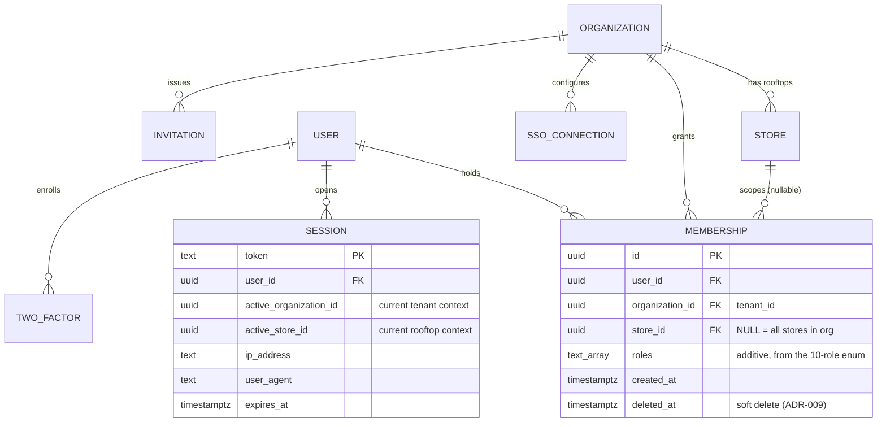

# Authentication & Authorization

This document specifies the ReadyLoans identity, session, and access-control architecture: the Better Auth stack (ADR-006), the Platform → Organization → Store membership model (ADR-007), the full role × permission matrix for all platform modules with scoped actions, session lifecycle controls (cookies, rotation, revocation, device sessions), MFA policy, and SSO for enterprise tenants. It documents the legacy Kia-tracker behavior as it exists today (marked **as-is**) and the production design every new endpoint must implement (marked **Target** where not yet built). Anything conflicting with this document or the ADRs is a defect.

## Table of Contents

1. [Current State (as-is) and Why It Is Replaced](#1-current-state-as-is-and-why-it-is-replaced)
2. [Chosen Auth Stack (ADR-006)](#2-chosen-auth-stack-adr-006)
3. [Tenancy & Membership Model (ADR-007)](#3-tenancy--membership-model-adr-007)
4. [Roles](#4-roles)
5. [Permission Model & Scoped Actions](#5-permission-model--scoped-actions)
6. [RBAC Matrix — Roles × Permissions per Module](#6-rbac-matrix--roles--permissions-per-module)
7. [Request Authorization Pipeline](#7-request-authorization-pipeline)
8. [Session Control](#8-session-control)
9. [MFA (TOTP)](#9-mfa-totp)
10. [SSO for Enterprise Tenants](#10-sso-for-enterprise-tenants)
11. [Machine & Service Authentication](#11-machine--service-authentication)
12. [Auth Event Auditing](#12-auth-event-auditing)

---

## 1. Current State (as-is) and Why It Is Replaced

The legacy Express server (`server/`) implements a split identity: a Supabase Auth account (`auth_id`) plus an application profile row in `users` (`id, name, email, role, store_id, language_pref`). Facts from source:

| As-is behavior | Location | Verdict |
|---|---|---|
| `authenticateUser` validates `Authorization: Bearer <jwt>` via `supabase.auth.getUser(token)`, loads profile by `auth_id` | `server/middleware/auth.js` | Concept survives; implementation replaced by Better Auth sessions |
| `requireRole(...allowedRoles)` — 403 with `{ error, required, current }` | `server/middleware/auth.js` | Survives as the coarse layer; superseded by the permission matrix (§6) |
| **Passwordless legacy login**: `POST /api/users/login` accepts `{name, email}` and **creates a user row if the email is unknown** — no password, no verification | `server/routes/users.js` | **Deleted, not migrated** (ADR-006 consequence) |
| Client stores the profile in `localStorage` key `kia_user` as an auth fallback | `client/src/App.jsx` | **Deleted** — sessions are HttpOnly cookies only |
| `GET /api/users` (full directory) and `PUT /api/users/:id` are **unauthenticated**; `PUT` only strips `auth_id`/`id`, so **anyone can change any user's `role`** | `server/routes/users.js` | Privilege-escalation hole; endpoints re-created behind auth + `users:*` permissions |
| Auth is **opt-in per route**; most of the 45 routers never call `authenticateUser` | `server/index.js` | Inverted: Target is global-deny — auth is a global Fastify hook, public routes are an explicit allowlist |
| Store scoping trusts client-controlled `x-store-id` header / `store_id` query before the user's own `store_id`; `owner` role forces `storeId = null` (all stores) | `server/middleware/scopeToStore.js` | **Banned** — tenant context is derived server-side from the session membership only (§7) |
| Server uses `SUPABASE_SERVICE_ROLE_KEY` for every query — RLS bypassed everywhere; all DB policies are `USING (true)` | `server/middleware/supabase.js`, `supabase/schema.sql` | Replaced by per-request scoped DB context + FORCED RLS (ADR-007, ADR-008) |
| `POST /api/users/create-account` is correctly gated `requireRole('owner','gm','admin_office')` | `server/routes/users.js` | Rule preserved: those three roles hold `users:invite` in the Target matrix |

The 10-role taxonomy and the create-account role allowlist are the two as-is rules carried forward unchanged.

## 2. Chosen Auth Stack (ADR-006)

**Better Auth 1.3+ (self-hosted TypeScript), organization plugin, sessions in our Postgres.** Supabase Auth is retired; Auth0 and Clerk are rejected (ADR-006). Auth tables live in the same Amazon RDS PostgreSQL database (ADR-008, amended 2026-07-24) under the `auth` application schema owned by `packages/db` migrations.

Canonical configuration (`apps/api/src/auth.ts`):

```ts
export const auth = betterAuth({
  database: pgPool,                          // Amazon RDS for PostgreSQL, ca-central-1 (ADR-008)
  baseURL: env.AUTH_BASE_URL,                // https://api.readyloans.app
  secret: env.BETTER_AUTH_SECRET,            // 32+ bytes, platform secret store only (ADR-023)
  emailAndPassword: {
    enabled: true,
    minPasswordLength: 12,                   // raises legacy min 8 (createAccountSchema)
    maxPasswordLength: 128,
    requireEmailVerification: true,
  },
  session: {
    expiresIn: 60 * 60 * 24 * 7,             // 7-day absolute lifetime
    updateAge:  60 * 60 * 24,                // rolling rotation: token re-issued daily on activity
    freshAge:   60 * 15,                     // "fresh session" window for sensitive ops (§8.3)
    cookieCache: { enabled: true, maxAge: 60 } // signed cookie cache ≤60s; revocation lag bounded at 60s
  },
  advanced: {
    useSecureCookies: true,                  // Secure on every environment except localhost
    defaultCookieAttributes: { httpOnly: true, sameSite: "lax", secure: true },
    crossSubDomainCookies: { enabled: true, domain: ".readyloans.app" },
    ipAddress: { ipAddressHeaders: ["cf-connecting-ip", "x-forwarded-for"] },
  },
  rateLimit: { enabled: true },              // backstop; primary limits in Fastify (api-security.md §5)
  plugins: [
    organization({ /* §3 */ }),
    twoFactor({ issuer: "ReadyLoans" }),     // §9
    sso(),                                   // §10 — Better Auth SSO package (SAML 2.0 + OIDC)
    admin(),                                 // platform-staff impersonation, audited (§12)
  ],
})
```

Key consequences (ADR-006):

- **DB-backed sessions, not stateless JWTs** — a role/membership change or revocation takes effect on the next request (≤60s cookie-cache lag), eliminating the Supabase stale-claims problem documented in the research brief.
- Password hashing is Better Auth's default **scrypt**; passwords checked against the legacy 8-char rule are force-upgraded to the 12-char policy at next change.
- Login, password reset, and verification emails are tenant-branded via the server-side branding path (ADR-018) and bilingual FR-first (ADR-019).

## 3. Tenancy & Membership Model (ADR-007)

Hierarchy: **Platform → Organization (dealer group, tenant) → Store (rooftop)**. `tenant_id` ≡ organization id. Hassan Group is organization #1 with stores Kia Mont-Laurier, ReadyCar, Riverside Auto Finance.



Rules:

- **Membership = (user, organization, store, roles[])** — additive multi-role. `store_id NULL` means the roles apply to every store in the organization (typical for `owner`).
- A user may hold memberships in **multiple organizations and stores** (Hassan's staff span Kia ML / ReadyCar / Riverside). The session carries exactly one `active_organization_id` + `active_store_id` pair at a time; the store/org switcher calls `POST /api/v1/auth/context` which validates the target against memberships and updates the session row server-side. Client-supplied tenant/store identifiers in headers or query strings are **never** trusted (fixes the as-is `x-store-id` hole).
- The active context feeds the per-transaction `SET LOCAL app.tenant_id / app.user_id / app.store_ids` used by RLS policies (ADR-007); §7 shows the pipeline.
- **Platform staff** (ReadyLoans employees) are not tenant members. Cross-tenant access exists only through the audited service-role functions (ADR-007) and the `admin()` plugin impersonation flow, both logged (§12). There is no "platform superuser" row in tenant membership tables.
- Invitations: org-scoped, single-use token, 7-day expiry, role preset by the inviter, accept requires email verification. Only holders of `users:invite` may issue them (§6).

## 4. Roles

The 10 platform roles are unchanged from the legacy `createAccountSchema` enum and are defined once in `packages/schemas` (ADR-001, ADR-016):

| Role | Description | MFA required (§9) |
|---|---|---|
| `owner` | Dealer principal / org owner; full org scope incl. billing | Yes |
| `gm` | General manager of a store; full store scope | Yes |
| `sales_manager` | Runs the sales floor: leads, deals, assignments, workflows | No (recommended) |
| `used_car_manager` | Inventory acquisition, recon, work orders, aging | No |
| `fi_manager` | F&I: desking approval, lenders, funding, credit-app PII | Yes |
| `salesperson` | Own leads/deals; desking on own deals | No |
| `wholesale_manager` | Wholesale listings, auctions, buyer network | No |
| `logistics` | Dispatch, delivery checklists, plates/chasers, sourcing pickups | No |
| `admin_office` | Office admin: documents, expenses, licensing, user invites | Yes |
| `bdc_agent` | BDC: works the store lead queue, communications, appointments, AI takeover | No |

Notes:

- `owner` scope is **org**, every other role scopes to the store(s) on its membership rows. The as-is "owner sees all stores" rule survives as `owner → org` scope — but resolved from membership, never by nulling the filter.
- `fi_manager`, `admin_office` are added to the MFA-required set beyond ADR-006's owner/gm/admin baseline because both hold `contacts:pii:read` (decrypt path for Restricted data, see `data-protection.md` §4).

## 5. Permission Model & Scoped Actions

Permission strings are `resource:action:scope`:

- **Scopes:** `own` (rows where `assigned_to`/`created_by`/`salesperson_id` = user) ⊂ `store` (rows in the active store) ⊂ `org` (all stores of the active organization). `all` (cross-tenant) exists only inside audited service-role functions — it is not grantable to any tenant role.
- The matrix is data, not code: it lives in `packages/schemas/src/permissions.ts` as a typed constant, consumed by the Fastify `requirePermission()` preHandler, by the SPA (to hide affordances), and mirrored in RLS helper functions. One source of truth (ADR-016).
- Enforcement is two-layer (ADR-007): the API checks `requirePermission('leads:read')` and resolves the effective scope to a query filter; RLS is the backstop that makes a missed filter a non-event.
- Column-level rules that RLS cannot express (e.g., cost masking on cross-store inventory, ADR-007) are applied by the contract serializer in `packages/contracts` — response schemas have `costs` fields marked `maskedUnless: 'inventory:costs:read'`.

```ts
// packages/schemas/src/permissions.ts (shape)
export const PERMISSIONS = {
  salesperson: {
    'leads:read': 'own', 'leads:create': 'store', 'deals:read': 'own',
    'inventory:read': 'org' /* costs masked */, 'commissions:read': 'own', /* ... */
  },
  // ... 9 more roles; additive union across membership.roles[]
} as const satisfies Record<Role, Partial<Record<Permission, Scope>>>
```

## 6. RBAC Matrix — Roles × Permissions per Module

Legend: cell = widest scope granted (`own` / `store` / `org`); `—` = no access. Roles holding multiple memberships get the **union** (widest scope wins per permission). Abbreviations: SP = salesperson, SM = sales_manager, UCM = used_car_manager, FI = fi_manager, WM = wholesale_manager, LOG = logistics, AO = admin_office, BDC = bdc_agent.

| Permission | owner | gm | SM | UCM | FI | SP | WM | LOG | AO | BDC |
|---|---|---|---|---|---|---|---|---|---|---|
| **Leads** |||||||||||
| `leads:read` | org | store | store | — | store | own | — | — | — | store |
| `leads:create` | org | store | store | — | — | store | — | — | — | store |
| `leads:update` | org | store | store | — | — | own | — | — | — | store |
| `leads:assign` | org | store | store | — | — | — | — | — | — | store |
| `leads:delete` | org | store | store | — | — | — | — | — | — | — |
| `leads:export` | org | store | store | — | — | — | — | — | — | — |
| **Contacts** |||||||||||
| `contacts:read` | org | store | store | store | store | store | store | store | store | store |
| `contacts:create` | org | store | store | — | store | store | — | — | store | store |
| `contacts:update` | org | store | store | — | store | own | — | — | store | store |
| `contacts:merge` | org | store | store | — | — | — | — | — | — | — |
| `contacts:pii:read` ¹ | org | store | — | — | store | — | — | — | store | — |
| `contacts:export` | org | store | — | — | — | — | — | — | — | — |
| **Deals** |||||||||||
| `deals:read` | org | store | store | store | store | own | store | store | store | — |
| `deals:create` | org | store | store | store | — | own | — | — | — | — |
| `deals:update` | org | store | store | — | store ² | own ² | — | — | — | — |
| `deals:transition_stage` | org | store | store | — | store ³ | own ³ | — | — | — | — |
| `deals:cancel` | org | store | store | — | — | — | — | — | — | — |
| `deals:delete` | org | store | — | — | — | — | — | — | — | — |
| **Desking & Finance** |||||||||||
| `desking:use` | org | store | store | — | store | own | — | — | — | — |
| `desking:approve` | org | store | — | — | store | — | — | — | — | — |
| `lenders:manage` | org | store | — | — | store | — | — | — | — | — |
| `submissions:manage` | org | store | — | — | store | — | — | — | — | — |
| **Commissions** |||||||||||
| `commissions:read` | org | store | store | — | own | own | own | — | store | — |
| `commissions:plans:manage` | org | store | — | — | — | — | — | — | — | — |
| `commissions:clawback` | org | store | — | — | — | — | — | — | — | — |
| **Inventory** |||||||||||
| `inventory:read` ⁴ | org | org ⁴ | org ⁴ | org ⁴ | store | org ⁴ | org ⁴ | store | store | org ⁴ |
| `inventory:costs:read` | org | store | — | store | — | — | store | — | — | — |
| `inventory:create` | org | store | — | store | — | — | — | — | — | — |
| `inventory:update` | org | store | — | store | — | — | — | store ⁵ | — | — |
| `inventory:recon:approve` | org | store | — | store | — | — | — | — | — | — |
| **Work Orders** |||||||||||
| `work_orders:read` | org | store | — | store | — | — | — | store | store | — |
| `work_orders:manage` | org | store | — | store | — | — | — | store | — | — |
| **Wholesale** |||||||||||
| `wholesale:read` | org | store | — | store | — | — | store | — | — | — |
| `wholesale:manage` | org | store | — | — | — | — | store | — | — | — |
| **Dispatch & Delivery** |||||||||||
| `dispatch:read` | org | store | store | — | — | own | — | store | — | — |
| `dispatch:manage` | org | store | — | — | — | — | — | store | — | — |
| `delivery:checklist:update` | org | store | store | — | — | own | — | store | — | — |
| `delivery:pdi:sign` | org | store | store | — | — | — | — | — | — | — |
| **Documents** |||||||||||
| `documents:upload` | org | store | store | store | store | own | store | store | store | — |
| `documents:read` | org | store | store | store | store | own | store | store | store | — |
| `documents:delete` | org | store | — | — | — | — | — | — | store | — |
| `documents:generate` ⁶ | org | store | store | — | store | — | — | — | store | — |
| **Expenses** |||||||||||
| `expenses:create` | org | store | — | store | — | — | — | store | store | — |
| `expenses:read` | org | store | — | store | — | — | — | — | store | — |
| `expenses:approve` | org | store | — | — | — | — | — | — | — | — |
| `expenses:mark_paid` | org | store | — | — | — | — | — | — | store | — |
| **Reports & Analytics** |||||||||||
| `reports:run` | org | store | store | store | store | own | store | — | store | own |
| `reports:schedule` | org | store | — | — | — | — | — | — | — | — |
| **AI & Conversations** |||||||||||
| `conversations:read` | org | store | store | — | — | own | — | — | — | store |
| `conversations:takeover` | org | store | store | — | — | own | — | — | — | store |
| `ai:config:update` ⁷ | org | store | — | — | — | — | — | — | — | — |
| **Automation** |||||||||||
| `automations:manage` | org | store | store | — | — | — | — | — | — | — |
| **Users & Settings** |||||||||||
| `users:read` | org | store | store | store | store | store | store | store | store | store |
| `users:invite` ⁸ | org | store | — | — | — | — | — | — | store | — |
| `users:roles:update` | org | store | — | — | — | — | — | — | — | — |
| `users:deactivate` | org | store | — | — | — | — | — | — | — | — |
| `settings:store:update` | org | store | — | — | — | — | — | — | — | — |
| `settings:branding:update` | org | — | — | — | — | — | — | — | — | — |
| `billing:manage` | org | — | — | — | — | — | — | — | — | — |
| `audit:read` | org | store | — | — | — | — | — | — | — | — |

Footnotes:

1. `contacts:pii:read` gates **decryption of Restricted fields** (SIN, driver's licence, DOB, income, banking — `data-protection.md` §4). Every exercise writes an `activity_events` audit row (`api-security.md` §10). MFA-required roles only.
2. Field-restricted update: `fi_manager` may write finance fields (`financing_bank`→lender FK, funding fields, `fi_reserve`); `salesperson` may not write `sale_price`/`vehicle_cost` after `desking:approve` has locked the deal.
3. Stage-restricted: `salesperson` transitions `new → approved` request only; funding transitions (`submitted → funded`) require `fi_manager`; `delivered/complete` confirmations follow the pipeline rules in `packages/core`.
4. Cross-store network inventory read (org scope) serves the AI routing feature; **cost fields (`acquisition_cost`, `transport_cost`, `recon_cost`) are masked** unless the caller also holds `inventory:costs:read` (app-level column masking, ADR-007).
5. `logistics` updates `location_status`/`location_details` only.
6. `documents:generate` = rendering branded PDFs (bill of sale, worksheets) via the Playwright worker (ADR-021).
7. Tenant-editable AI config: persona name, greeting, hours. Platform compliance guardrails (STOP, quiet hours, ADAD consent gate, disclosure lines — ADR-022) are **not** tenant-editable at any role.
8. Preserves the as-is `requireRole('owner','gm','admin_office')` rule on account creation. An inviter can never grant a role whose permission set exceeds their own (`no-privilege-amplification` check).

## 7. Request Authorization Pipeline

Every `/api/v1` request passes the same ordered Fastify hooks (global-deny; the public allowlist is: `/api/v1/auth/*` public subroutes, the unversioned `/healthz` + `/readyz` probes ([hosting-topology.md §5](../07-infrastructure/hosting-topology.md)), and intake endpoints in `apps/intake`):

```mermaid
sequenceDiagram
    participant B as Browser (SPA)
    participant F as Fastify /api/v1 (ADR-003)
    participant BA as Better Auth
    participant PG as Postgres (FORCED RLS)

    B->>F: GET /api/v1/leads (Cookie: readyloans.session_token)
    F->>F: requestId + rate limits (api-security.md §5)
    F->>BA: resolve session (cookie cache ≤60s, else DB)
    BA-->>F: user, active_organization_id, active_store_id
    F->>F: load memberships → effective roles for active context
    F->>F: requirePermission('leads:read') → scope = store
    F->>PG: BEGIN; SET LOCAL app.tenant_id/app.user_id/app.store_ids
    F->>PG: SELECT ... FROM leads WHERE store_id = $activeStore AND deleted_at IS NULL
    PG-->>F: rows (RLS backstop re-verifies tenant_id)
    F-->>B: 200 (contract-serialized; masked columns removed)
```

Failure semantics use the standard error envelope ([api-design.md §8](../03-architecture/api-design.md)): missing/invalid session → `401` with `error.code: 'unauthorized'`; valid session lacking the permission → `403` with `error.code: 'forbidden'` and the missing permission in `details[]` (`{ "path": "permission", "code": "permission_required", "message": "leads:read" }` — no data-shape hints); permission held but row outside scope → `404 not_found` (existence not disclosed).

## 8. Session Control

### 8.1 Cookies

| Attribute | Value | Note |
|---|---|---|
| Name | `readyloans.session_token` (+ `__Secure-` prefix in prod) | Better Auth session cookie |
| `HttpOnly` | yes | never readable by JS; the `kia_user` localStorage pattern is deleted |
| `Secure` | yes | HTTPS-only on all environments except localhost dev |
| `SameSite` | `Lax` | top-level navigation works; CSRF surface minimized; state-changing routes additionally require `Origin` allowlist check (api-security.md §6) |
| `Domain` | `.readyloans.app` for platform subdomains; **host-only** on tenant custom domains (ADR-014/018) | a session on `crm.dealerx.ca` never leaks to another tenant's domain |
| `Path` | `/` | |
| Max-Age | rolling ≤ 7 days (§2 config) | |

### 8.2 Rotation & revocation

- **Rotation:** session token re-issued when older than `updateAge` (24 h) on any authenticated request; rotation invalidates the prior token (theft-window bounding). Password change, MFA enrollment/reset, and role change trigger immediate rotation of the current session and revocation of all others (`revokeOtherSessions`).
- **Revocation surfaces:** (a) self-serve per-device (§8.4); (b) admin per-user (`users:deactivate` → all sessions destroyed); (c) **per-tenant revocation** — destroy every session whose `active_organization_id` = tenant, used at offboarding, dunning→read-only (ADR-024), and incident containment (`security-operations.md` §6); (d) global (platform incident). Cookie cache bounds revocation lag to ≤60 s.
- **Permission freshness:** memberships are read from DB per request (with a ≤30 s Valkey cache, tenant-prefixed keys, ADR-010, invalidated on membership write) — a demoted user loses access within 30 s without waiting for token expiry.

### 8.3 Fresh-session (step-up) requirement

Actions requiring session age ≤ `freshAge` (15 min) — otherwise the API returns `403 { code: 'REAUTH_REQUIRED' }` and the SPA prompts a password (or TOTP) re-entry:

`users:roles:update`, `users:deactivate`, `settings:branding:update`, `billing:manage`, `commissions:plans:manage`, `commissions:clawback`, `contacts:pii:read` (first decrypt per session), MFA disable, SSO connection changes, webhook secret rotation.

### 8.4 Device sessions

`GET /api/v1/auth/sessions` lists the user's active sessions (Better Auth `listSessions`): device (parsed user agent), IP, city-level geo, `created_at`, `last_active_at`, current-session marker. `DELETE /api/v1/auth/sessions/:token` revokes one; `DELETE /api/v1/auth/sessions` revokes all others. New-device login (unseen UA+IP pair) sends a bilingual notification email to the account address.

## 9. MFA (TOTP)

- Better Auth `twoFactor` plugin: TOTP (RFC 6238, 30 s step, 6 digits, issuer `ReadyLoans`, tenant display name in the label) + **10 single-use backup codes** (hashed at rest).
- **Required** for: `owner`, `gm`, `fi_manager`, `admin_office`, and all platform staff (§4). Enforcement: on first login after the role grant, the user enters a mandatory enrollment flow; a 7-day grace period applies to pre-existing accounts at migration, after which login is blocked pending enrollment.
- Optional (nudged in settings) for the other six roles; an organization can flip `require_mfa_all_members = true` on its org settings (Target).
- SMS OTP is **not** offered (SIM-swap risk); WebAuthn/passkeys are the planned second factor addition (Target, Better Auth passkey plugin).
- Reset: an `owner`/`gm` with a fresh session (§8.3) may reset a member's MFA; the action revokes all target-user sessions and is audited (§12). Platform staff resets for `owner` accounts require the support identity-verification script.

## 10. SSO for Enterprise Tenants

For dealer groups with corporate IdPs (Azure AD / Entra, Okta, Google Workspace):

- **Primary:** Better Auth **SSO package** — OIDC and SAML 2.0, SP-initiated. One connection per organization: `POST /api/v1/orgs/:orgId/sso-connections` (permission `settings:store:update` at org scope + fresh session). Metadata: SP entity ID `https://api.readyloans.app/api/auth/sso/saml2/sp/{orgId}`, ACS URL `.../callback/{orgId}`.
- **Domain routing:** verified email domains (DNS TXT proof) map to the connection; the login form detects `@dealergroup.ca` and redirects to the IdP.
- **JIT provisioning:** first SSO login creates the user + a membership in the connection's organization with the connection's `default_role` (default `salesperson`, never `owner`/`gm`); role elevation stays a manual `users:roles:update` action.
- MFA satisfied at the IdP is accepted for SSO users (`skip_mfa_when_sso = true` per connection, default true; the IdP asserts AMR).
- **Fallback (buy):** **WorkOS at $125/connection** when a tenant demands SCIM directory sync (deprovisioning from the IdP) before we build it. **Auth0 and Clerk are rejected** (ADR-006 — cost, add-on pricing).
- SSO does not bypass authorization: memberships and the §6 matrix still govern every request.

## 11. Machine & Service Authentication

| Caller | Mechanism | Notes |
|---|---|---|
| Inbound lead webhooks | Per-source shared secret in `/in/v1/leads/{tenantSlug}/{sourceKey}`; provider signatures verified (Meta `X-Hub-Signature-256`, Twilio `X-Twilio-Signature`) | ADR-005; no session/cookie involvement |
| Outbound platform webhooks | HMAC-SHA256 `X-ReadyLoans-Signature` over `{timestamp}.{body}`, ±5 min window, dual-secret rotation | ADR-005; spec in `api-security.md` §9 |
| `apps/workers` → DB | Dedicated DB role with service credentials; every job payload carries `tenant_id` and workers `SET LOCAL` it before queries | ADR-008/012; the only holders of service credentials besides admin functions |
| Stripe / Resend / Twilio callbacks | Provider signature verification (`stripe.webhooks.constructEvent`, Twilio validator) | ADR-024/020 |
| Public API keys for integrators | **Target** — per-tenant API keys (`rl_live_...`), hashed at rest, scoped to a permission subset, rate-limited per key (ADR-011) | Not in v1 launch scope |

## 12. Auth Event Auditing

All events below write append-only `activity_events` rows (tenant-scoped, `entity_type='auth'`), synchronously for the starred items (`api-security.md` §10): login success/failure*, MFA enroll/disable/reset*, password change/reset*, session revocations*, invitation issued/accepted, `users:roles:update`* (old→new roles in `old_value`/`new_value`), `users:deactivate`*, SSO connection create/update*, org/store context switches, platform-staff impersonation start/stop* (impersonator id + reason recorded). Sentry receives auth errors with PII scrubbed (ADR-025); PostHog receives no auth-credential events.
