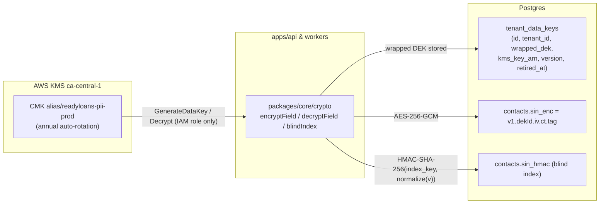
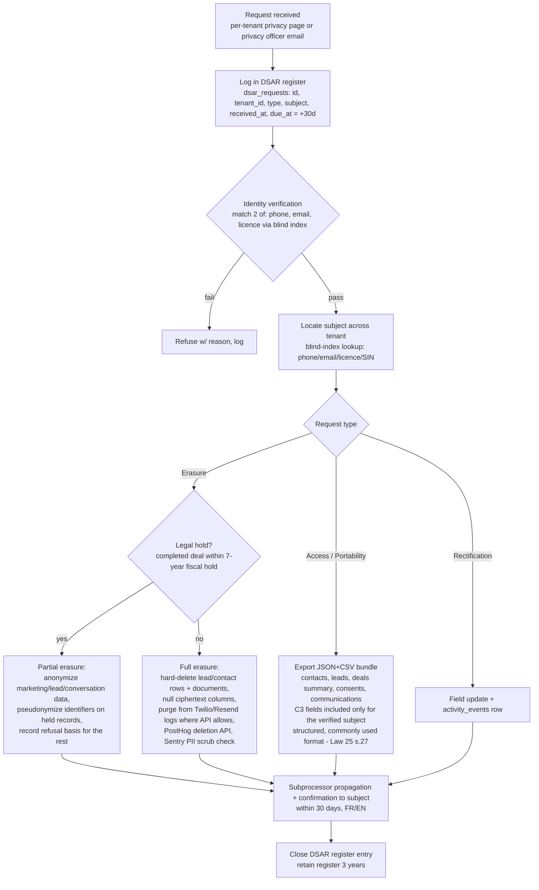

# Data Protection

This document specifies how ReadyLoans protects data throughout its lifecycle: transport encryption (TLS 1.3 on every hop), encryption at rest, field-level envelope encryption for high-sensitivity PII (SIN, driver's licence, DOB, income, banking) with AWS KMS and blind HMAC indexes (ADR-015), key management and rotation, secrets handling, the platform data-classification scheme, backup encryption, data residency/subprocessors, and the right-to-erasure and retention flows required by Law 25 and PIPEDA. Where the legacy Kia tracker's behavior is relevant it is documented **as-is**; everything else is the binding Target design.

## Table of Contents

1. [Data Classification](#1-data-classification)
2. [Encryption in Transit — TLS 1.3 Everywhere](#2-encryption-in-transit--tls-13-everywhere)
3. [Encryption at Rest — Provider Baseline](#3-encryption-at-rest--provider-baseline)
4. [Field-Level Encryption for Restricted PII](#4-field-level-encryption-for-restricted-pii)
5. [Key Management](#5-key-management)
6. [Secrets Handling](#6-secrets-handling)
7. [Backups](#7-backups)
8. [Data Residency & Subprocessors](#8-data-residency--subprocessors)
9. [Retention Schedule](#9-retention-schedule)
10. [Right to Erasure & DSAR Flows](#10-right-to-erasure--dsar-flows)

---

## 1. Data Classification

Four classes. Every table/column in `packages/db` carries a class annotation in its schema comment; new columns without a class fail migration review.

| Class | Name | Examples (concrete fields) | Mandatory controls |
|---|---|---|---|
| **C0** | Public | Marketing site content, public inventory listings (price, photos, specs), status page | None beyond integrity (signed deploys) |
| **C1** | Internal | Store hours/holiday calendars, `pdi_templates`, `expense_categories`, aggregate non-PII metrics, tenant branding tokens | Auth required; tenant-scoped RLS |
| **C2** | Confidential | `contacts.first_name/last_name/email/phone/address`, `deals.*` (prices, costs, `fi_reserve`), `commissions.*`, `leads.*` activity, `conversations`/`messages` bodies, `activity_events`, staff emails/roles | Tenant RLS + permission matrix; TLS; encrypted at rest (provider); PII-scrubbed in logs/Sentry; masked in PostHog replay; export gated (`*:export` permissions) |
| **C3** | Restricted | **SIN**, **driver's licence number**, **date of birth**, `leads.monthly_income` / `monthly_housing`, banking details (institution/transit/account from void cheque), credit-app payloads, ID-document images, MFA secrets, hashed passwords, API/webhook secrets | Everything in C2 **plus** field-level AES-256-GCM envelope encryption (§4), audited decrypt gated by `contacts:pii:read`, never in logs/analytics/AI prompts, never in ad-hoc SQL (ciphertext only), stricter storage bucket class for images |

Hard rules for C3:

- Never included in Claude prompts (ADR-022) — the AI agent collects a credit-app **link** (`send_credit_app_link` tool); the form posts directly to the API, not through the conversation.
- Never in `pino` logs, Sentry events, PostHog, BullMQ job payloads (jobs carry row IDs, workers fetch + decrypt), or OpenTelemetry span attributes (ADR-025).
- Reporting uses derived non-PII aggregates (e.g., `income_band` computed at write time), never decrypted values (ADR-015 consequence).

## 2. Encryption in Transit — TLS 1.3 Everywhere

TLS 1.2 minimum, **TLS 1.3 preferred**, on every hop (ADR-015). No plaintext internal hops — TLS terminated at the edge is re-encrypted to origin.

| Hop | Config |
|---|---|
| Browser → CloudFront (SPA, S3 origin) | TLS 1.3 (HTTP/3); HSTS `max-age=63072000; includeSubDomains; preload`; ACM-issued certs incl. DNS-validated per-tenant custom domains (ADR-014/018) |
| Browser → `api.readyloans.app` (AWS ALB) | TLS 1.3 security policy, HTTPS only (HTTP→HTTPS redirect); HSTS same policy; AWS WAF in front (ADR-014) |
| Lead sources → `apps/intake` | TLS 1.3; signature verification on top (ADR-005) |
| API/workers → RDS PostgreSQL via RDS Proxy (in-VPC) | `sslmode=verify-full` with the AWS RDS CA bundle pinned in the container image (ADR-008/015, amended 2026-07-24) — not `require`; traffic never leaves the VPC |
| API/workers → ElastiCache for Valkey (in-VPC) | TLS (`rediss://`), server cert verification on (ADR-010/014) |
| API/workers → Resend, Twilio, Anthropic, Stripe, AWS KMS | HTTPS, TLS 1.2+ enforced by SDKs; certificate validation never disabled (`NODE_TLS_REJECT_UNAUTHORIZED=0` is a banned pattern, CI-linted) |
| Socket.IO realtime (browser → ALB) | `wss://` only (ADR-004) |

**As-is gap:** the legacy stack has no HSTS, no TLS enforcement on the Express origin, and the client calls Supabase directly. All retired with the strangler rebuild (ADR-026).

## 3. Encryption at Rest — Provider Baseline

- **Amazon RDS for PostgreSQL (ca-central-1):** gp3 storage encrypted with a customer-managed **AWS KMS** key — covering database files, indexes, WAL, automated backups, snapshots, and logs; deletion protection on (ADR-008/015, amended 2026-07-24). This is the baseline for all C1/C2 data.
- **Amazon S3 (ca-central-1):** **SSE-KMS** at rest; private buckets only (Block Public Access), per-tenant path prefixes `tenant/{tenantId}/...`, presigned URLs for both upload and download (ADR-013, amended 2026-07-24). Two bucket classes: `vehicle-media` (photos; pre-generated variants served via CloudFront origin access control) and `documents` (contracts, IDs, credit apps — stricter class: object lock/retention, no CDN). The legacy single `deal-files` bucket with bucket-wide CRUD policies is closed (**as-is** gap, `supabase/schema.sql`).
- **ElastiCache for Valkey (ca-central-1, in-VPC):** encryption at rest and in transit enabled; contains only cache/session/queue data, never C3 plaintext (ADR-010/014).
- Laptops/BYOD: no production data may be exported to local files except through the audited export permissions; exports are watermarked with actor + timestamp (Target).

## 4. Field-Level Encryption for Restricted PII

Provider disk encryption does not protect against application-level compromise or over-privileged SQL. Per ADR-015, C3 fields get **application-layer AES-256-GCM envelope encryption with AWS KMS** and blind HMAC indexes. **pgsodium is banned** (pending deprecation); pgcrypto is acceptable only for low-tier fields, not C3.

### 4.1 Encrypted columns

| Table.column (ciphertext) | Source field | Blind index column | Notes |
|---|---|---|---|
| `contacts.sin_enc` | Social Insurance Number | `contacts.sin_hmac` | New column — legacy schema has no SIN; arrives with credit-app module |
| `contacts.driver_license_enc` | `driver_license` (legacy plaintext TEXT, max 50) | `contacts.driver_license_hmac` | Legacy plaintext migrated then dropped |
| `contacts.date_of_birth_enc` | `date_of_birth DATE` | — (no equality lookup; `age_band` derived at write) | Also `leads.date_of_birth` |
| `leads.monthly_income_enc` | `monthly_income INTEGER cents` | — (`income_band` derived at write for scoring) | Lead scoring reads the band, never the value |
| `leads.monthly_housing_enc` | `monthly_housing INTEGER cents` | — | |
| `credit_apps.payload_enc` | Full structured credit application | `credit_apps.applicant_hmac` (normalized name+DOB) | One envelope per application snapshot |
| `bank_details.account_enc` | institution / transit / account (void cheque) | — | |

### 4.2 Envelope format & flow

Ciphertext column value (TEXT): `v1.{dek_id}.{iv_b64}.{ct_b64}.{tag_b64}` — AES-256-GCM, 12-byte random IV per value, 16-byte auth tag, AAD = `{table}.{column}:{row_id}` (binds ciphertext to its cell; prevents cut-and-paste swaps).

- **Per-tenant DEKs** (ADR-015): one active 256-bit data key per tenant, generated via `kms:GenerateDataKey`, stored **wrapped** in `tenant_data_keys`; plaintext DEKs live only in process memory with a 5-minute LRU cache. Tenant offboarding = retire + schedule deletion of the wrapped DEK (**crypto-shredding**, §10).
- **Blind indexes:** `HMAC-SHA-256(field_index_key, normalize(value))`, hex, stored beside the ciphertext with a normal btree index — supports equality lookup only (licence/SIN search, dedupe). `field_index_key` is a separate per-field platform key from Secrets Manager, never the DEK. Normalization: uppercase + strip non-alphanumerics (licence), digits-only (SIN), E.164 (phone).
- **Decrypt path:** only `packages/core/crypto` exposes `decryptField()`; callers must pass the request context, which is checked for `contacts:pii:read` (see RBAC matrix) and a fresh session on first use; every decrypt emits a **synchronous** `activity_events` row (`action='pii_decrypted'`, field list in `metadata`). Ad-hoc SQL sees ciphertext only.

## 5. Key Management

| Key | Where | Rotation | Access |
|---|---|---|---|
| KMS CMK `alias/readyloans-pii-{env}` | AWS KMS, **ca-central-1** | Annual automatic rotation; manual on incident | IAM roles of `apps/api` + `apps/workers` only (`kms:GenerateDataKey`, `kms:Decrypt`); deny-all otherwise; CloudTrail on every call |
| Per-tenant DEKs | `tenant_data_keys` (wrapped) | Re-wrapped on CMK rotation (KMS handles transparently); versioned re-encryption job on compromise — new DEK version, background BullMQ re-encrypt of the tenant's C3 columns | `packages/core/crypto` only |
| Blind-index field keys | AWS Secrets Manager | Rotated only with a full re-index migration (expensive — rotate on compromise, not on schedule) | crypto service only |
| `BETTER_AUTH_SECRET` (session/cookie signing) | AWS Secrets Manager | 180 days, dual-accept window during rotation | `apps/api` |
| Outbound webhook secrets | DB (encrypted with tenant DEK), per endpoint | Dual-secret rotation, tenant-initiated (ADR-005) | webhook delivery worker |
| TLS certs | AWS ACM (CloudFront + ALB), DNS-validated incl. per-tenant custom domains (ADR-014) | Automatic renewal | Platform-managed |

Non-negotiables: no key material in the repo, in images, or in `pino` logs; KMS key policy denies deletion without a 30-day waiting window; decrypt-path IAM is environment-separated (staging roles cannot touch prod CMK).

## 6. Secrets Handling

**As-is finding (verified in tree):** `server/.env` contains a live `SUPABASE_SERVICE_ROLE_KEY` and `RESEND_API_KEY`, and `client/.env` contains the Supabase URL + anon key — committed to the repository. Per ADR-023, **rotating every one of these is a migration-day blocking task**, and the git history must be treated as compromised (rotate, don't scrub-and-hope).

Target rules:

- Secrets live only in platform secret stores: **AWS Secrets Manager**, injected into the ECS task definitions of API/workers/intake (ADR-014), and GitHub Actions environments (CI — which authenticates to AWS via **OIDC**, no long-lived keys, ADR-023). The SPA build embeds **only** `VITE_`-prefixed public values (S3/CloudFront serves static assets; no secrets exist client-side). No `.env` files in the repo; `.env*` is gitignored and `gitleaks` runs in CI + GitHub push protection is on (`security-operations.md` §3).
- Inventory & cadence:

| Secret | Holder | Rotation |
|---|---|---|
| `DATABASE_URL` (RDS Proxy endpoint) / direct instance URL | api, workers, CI (migrations — fetched via the OIDC-assumed role) | 90 days (Secrets Manager rotation); **no service-role key exists at all** (ADR-008, amended 2026-07-24) |
| `VALKEY_URL` (TLS) | api, workers | 90 days |
| `RESEND_API_KEY` | workers (email queue only, ADR-020) | 90 days |
| `TWILIO_ACCOUNT_SID`/`AUTH_TOKEN` | workers, intake (signature validation) | 90 days |
| `ANTHROPIC_API_KEY` | workers (AI queues) | 90 days |
| `STRIPE_SECRET_KEY`, `STRIPE_WEBHOOK_SECRET` | api (billing webhooks) | 90 days / on incident |
| `BETTER_AUTH_SECRET` | api | 180 days (dual-accept) |
| AWS KMS access | api, workers via ECS task IAM roles (no static AWS keys; CI via GitHub OIDC) | Ephemeral |
| Sentry DSN, PostHog key, Better Stack token | respective apps | Annual (low sensitivity) |

- Access to prod secret stores requires platform-staff MFA; every change is captured in the provider audit log and mirrored to the incident channel.

## 7. Backups

- **Postgres:** RDS automated backups + PITR (continuous WAL archiving, 5-min log granularity) — **RPO ≤ 5 min**, retention window **14 days**, plus nightly encrypted logical dumps (30 daily + 12 monthly — `migrations-operations.md` §4). All RDS backups and snapshots are **KMS-encrypted** (encryption inherits from the instance) and stored in **ca-central-1** (no cross-border copies — Law 25 residency, ADR-008, amended 2026-07-24).
- **S3 buckets:** versioned; the `documents` bucket class (object lock) additionally syncs nightly cross-account to the offsite backup bucket (`reliability-and-cost.md` §7).
- **Field-level ciphertext in backups** stays ciphertext — a stolen backup without KMS access exposes no C3 plaintext. This is the reason envelope encryption is applied *before* rows reach the database.
- **Valkey is never backed up** — it holds no source-of-truth data (ADR-010 consequence: loss degrades performance, never consistency).
- Restore drills: quarterly staging restore from PITR with checksum verification; RTO target ≤ 4 h (`security-operations.md` §8).
- Backup access: platform-staff IAM roles (MFA-enforced) only — RDS snapshot/restore and backup-bucket permissions are deny-by-default; restores to any environment are change-managed PRs, never console ad-hoc.

## 8. Data Residency & Subprocessors

Residency: **full Canadian residency for both compute and data — everything in `ca-central-1` (Montreal), single-vendor AWS**. Platform compute (SPA delivery, API, workers, intake, cache) runs on AWS `ca-central-1` (ADR-014) and the primary data stores are **Amazon RDS for PostgreSQL and S3, also `ca-central-1`** (ADR-008/013, amended 2026-07-24). Network posture strengthens residency into unreachability: the database is **VPC-private with no public endpoint at all** — it lives in the VPC's private subnets, security-group ingress is allowed only from the ECS task security groups, and human access exists only through an SSM Session Manager bastion (MFA-gated IAM, CloudTrail-audited). Personal information at rest is therefore not addressable from the internet at any layer, and all of it is KMS-encrypted (§3). The core platform therefore involves **no cross-border transfer of personal information at all** — this closes residency concern Q-11 and reduces the Law 25 cross-border analysis for the core platform to "none". Each dealership tenant is the controller; ReadyLoans is the service provider — Law 25-grade data-processing terms are part of every tenant contract, and the subprocessor register below feeds tenant-facing documentation and cross-border PIAs (Law 25 requires a PIA before communicating personal info outside Québec) — required only for the external US/EU providers listed.

| Subprocessor | Purpose | Data categories | Region | Cross-border PIA |
|---|---|---|---|---|
| AWS (RDS for PostgreSQL — VPC-private) | Primary database (ADR-008) | C1–C3 (C3 as ciphertext) | ca-central-1 | Not required (in-country) |
| AWS (S3 + CloudFront) | SPA hosting/CDN + tenant file storage `vehicle-media`/`documents` (ADR-013/014) | C0 assets; C2 media; C3 document images (SSE-KMS, presigned-only, **never on the CDN**) | ca-central-1 at rest; CloudFront edge caches static assets and public vehicle imagery only | Not required (in-country at rest) |
| AWS (ECS Fargate, ALB, ElastiCache) | API/workers/intake compute + cache (ADR-014) | C1–C3 in transit/memory | ca-central-1 | Not required (in-country) |
| AWS KMS | Key wrapping | Key material only, no personal data | ca-central-1 | Not required |
| Twilio | SMS/MMS/voice (ADR-020) | Phone numbers, message bodies (C2) | US | **Required** — in place before launch |
| Resend | Email + Inbound parsing (ADR-020) | Emails, names (C2) | US | **Required** |
| Anthropic | AI conversation/extraction (ADR-022) | Conversation content (C2; C3 excluded by design, §1) | US | **Required**; zero-data-retention terms |
| Stripe | Billing (ADR-024) | Tenant billing contacts, payment methods (PCI held by Stripe) | US | **Required** (tenant business data, minimal consumer PII) |
| Sentry | Errors/traces (ADR-025) | Scrubbed technical data; no request bodies | US/EU | Assessed — PII scrubbed at source |
| PostHog | Analytics/replay/flags (ADR-025) | Consent-gated usage events, masked replays | **EU cloud** | Required — consent + masking documented |
| Better Stack | Logs/uptime (ADR-025) | Structured logs (PII-scrubbed), no C3 | EU/US | Assessed |

## 9. Retention Schedule

Retention is enforced by BullMQ repeatable jobs (ADR-012), not manual cleanup. Personal information is destroyed or anonymized when its purpose is fulfilled (Law 25); transaction records honor fiscal/consumer-protection holds.

| Data | Retention | Then |
|---|---|---|
| Deals, bill-of-sale snapshots, funding records, commissions, expenses | **7 years** from deal completion (CRA/Revenu Québec books-and-records; OPC/AMF consumer files) | Hard delete; PII pseudonymized after 24 months post-completion where severable |
| Documents bucket (contracts, IDs, credit apps) | Credit apps of non-converted leads: **90 days**; converted-deal docs: 7 years | Hard delete from Storage + `documents` row |
| Leads (non-converted) + lead communications | **24 months** after last activity (aligns CASL implied-consent outer bound) | Anonymize (keep source/date/outcome for ROI aggregates) |
| Conversations / messages (AI + human) | 24 months | Anonymize; compliance-relevant consent turns copied to the consent ledger first |
| Consent ledger (CASL/ADAD, ADR-022) | **3 years** after consent expiry/withdrawal (CRTC enforcement window) | Hard delete |
| `activity_events` (audit) | 24 months hot, then archived to cold storage 5 more years (security/audit) | Hard delete |
| Auth sessions | Rows purged 30 days after expiry | — |
| Backups | PITR window (14 days); nightly dumps 30 daily + 12 monthly | Ages out automatically |
| Sentry events / Better Stack logs | 90 days | Provider purge |
| PostHog | 12 months event retention | Provider purge; deletion API on DSAR |

## 10. Right to Erasure & DSAR Flows

Law 25 (access, rectification, deletion, de-indexation, **portability** since Sept 2024) and PIPEDA both apply; the platform ships the workflow as a product feature so each dealer tenant (the controller) can meet its 30-day response deadline.

Implementation notes:

- **Erasure vs soft delete:** `deleted_at` (ADR-009) is an application lifecycle state, *not* erasure. DSAR erasure hard-deletes or anonymizes, including Storage objects and blind-index values.
- **Crypto-shredding at tenant offboarding:** retiring the tenant's DEK (§5) renders all of that tenant's C3 ciphertext permanently unreadable — used when a dealership leaves the platform (after the contractual export window; dunning never deletes data, ADR-024).
- **Backups:** erased data may persist in backups until they age out; the DSAR record notes this and the windows (14-day PITR; offsite dumps on their 30-daily/12-monthly schedule, §7) — accepted practice under OPC guidance, with re-erasure triggered if a restore occurs.
- Each tenant record stores its **privacy officer** name + contact (Law 25 Phase 1) rendered on the tenant's privacy page; ReadyLoans' own privacy officer handles platform-level requests. Breach-notification duties live in `security-operations.md` §7.
