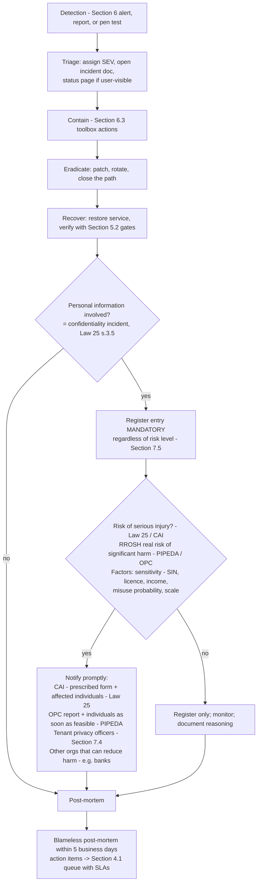

# Security Operations

This document defines how ReadyLoans runs security as an ongoing operation: the operating model and shared-responsibility split with tenants, dependency and supply-chain scanning, secrets-leak prevention and rotation operations, vulnerability management and the penetration-test cadence, the secure-SDLC gates in CI/CD, security monitoring/detection and the containment toolbox, the incident-response runbook with breach-notification duties under Law 25 and PIPEDA, and resilience drills. Section numbers are load-bearing — `authentication-authorization.md`, `data-protection.md`, and `api-security.md` reference them (§2–§8) — do not renumber without updating those files. Everything here is **Target** unless marked **as-is**: the legacy Kia tracker has no security operations of any kind (audit score 1/10 — no scanning, no monitoring, no incident process, live keys committed to the repo).

## Table of Contents

1. [Security Operating Model & Shared Responsibility](#1-security-operating-model--shared-responsibility)
2. [Dependency & Supply-Chain Scanning](#2-dependency--supply-chain-scanning)
3. [Secrets Operations](#3-secrets-operations)
4. [Vulnerability Management & Penetration Testing](#4-vulnerability-management--penetration-testing)
5. [Secure SDLC — Security Gates in CI/CD](#5-secure-sdlc--security-gates-in-cicd)
6. [Monitoring, Detection & Containment Toolbox](#6-monitoring-detection--containment-toolbox)
7. [Incident Response Runbook & Breach Notification (Law 25 / PIPEDA)](#7-incident-response-runbook--breach-notification-law-25--pipeda)
8. [Resilience — Restore Drills, DR Scenarios, Tabletops](#8-resilience--restore-drills-dr-scenarios-tabletops)

---

## 1. Security Operating Model & Shared Responsibility

ReadyLoans is a small team; security is an owned function, not a department. Named roles (recorded on the platform org record, reviewed quarterly):

| Role | Holder | Duties |
|---|---|---|
| Security Owner | Chief Architect (until a dedicated hire) | Owns this document, triage queue, pen-test scoping, CI gate exceptions |
| Privacy Officer (Law 25 Phase 1) | Named individual, contact published on readyloans.app and every tenant privacy page (`data-protection.md` §10) | Breach-notification decisions, DSAR escalations, PIA sign-off, CAI/OPC liaison |
| Incident Commander (rotating) | On-call engineer (Better Stack rotation, ADR-025) | Runs §7 during an incident |
| Tenant Privacy Officer | Per-tenant field on the organization record | The dealership's Law 25 officer; recipient of tenant-facing breach notices (§7.4) |

Shared-responsibility split (mirrors the data-processing terms in tenant contracts, `data-protection.md` §8):

| Concern | ReadyLoans (platform) | Tenant (dealership) |
|---|---|---|
| Infrastructure, RLS, encryption, backups, patching | ✔ | — |
| Platform incident response, CAI/OPC platform-level notices | ✔ | — |
| User/role hygiene inside the org (`users:roles:update`, deactivating departed staff) | Tooling + audit trail | ✔ |
| Consent capture correctness for their leads (CASL/ADAD, ADR-022) | Compliance engine enforces | ✔ owns the consent basis |
| Breach notification to *their* customers when the tenant is controller | Notify tenant ≤ 72 h + evidence package (§7.4) | ✔ decides + files with CAI |

**As-is posture being replaced:** no dependency scanning, no CI security gates, no monitoring/alerting, no incident process, `USING (true)` RLS everywhere, and live `SUPABASE_SERVICE_ROLE_KEY` / `RESEND_API_KEY` committed in `server/.env` (ADR-023: rotation is a migration-day blocking task, §3.3).

## 2. Dependency & Supply-Chain Scanning

Applies to the pnpm/Turborepo monorepo (ADR-001) and the Docker images for `apps/api` / `apps/workers` / `apps/intake` (ADR-014).

| Control | Tool / config | Gate behavior |
|---|---|---|
| Lockfile-only installs | `pnpm install --frozen-lockfile` in every CI job and Docker build | Build fails on lockfile drift |
| Vulnerability audit | `pnpm audit --prod --audit-level=high` in the CI `security` job | **Blocking** on high/critical; medium/low filed to the §4 queue |
| Automated upgrades | Dependabot — security updates daily; version bumps weekly, grouped per workspace (`apps/*`, `packages/*`) | Security PRs auto-merge after green CI for patch-level; minor/major require review |
| SAST | GitHub CodeQL (JS/TS default suite) + semgrep custom ruleset (§5.2) | CodeQL alerts ≥ high block merge |
| Container scanning | Trivy scan of the distroless Node images in the Docker build job; base images rebuilt weekly by a scheduled workflow (stale-base CVEs) | Blocking on high/critical in the final image |
| GitHub Actions provenance | All third-party actions **pinned by commit SHA** (api-security.md §4 A08); Dependabot keeps the SHAs current | PR review rejects tag-pinned actions |
| New-dependency review | Adding a package to `dependencies` of `apps/api`, `apps/workers`, `apps/intake`, or `packages/core`/`db`/`ai` requires a CODEOWNERS security review (§5.1) | Blocking |

Remediation SLAs for dependency findings (clock starts at detection):

| Severity (CVSS v3.1) | SLA | Notes |
|---|---|---|
| Critical (9.0–10.0) | 48 h | Patch or mitigate (AWS WAF rule, feature disable) — mitigation does not close the finding |
| High (7.0–8.9) | 7 days | |
| Medium (4.0–6.9) | 30 days | |
| Low (< 4.0) | 90 days / next scheduled upgrade | |

Exceptions (no fix available, false positive) are recorded in `docs/security/exceptions.md` with owner + expiry ≤ 90 days; expired exceptions fail CI.

## 3. Secrets Operations

Complements `data-protection.md` §6 (inventory + rotation cadence). This section is the operational side.

### 3.1 Leak prevention

- **gitleaks** runs in CI on every PR (diff scan, blocking) and as a weekly scheduled full-history scan of the monorepo.
- **GitHub secret scanning + push protection** enabled org-wide — a push containing a matched credential is rejected at the remote.
- `.env*` gitignored repo-wide; the only env surface in the repo is `.env.example` files with placeholder values; a CI check diffs `.env.example` keys against the typed Zod env schema (api-security.md §4 A05) so drift is caught.
- Provider dashboards and consoles (AWS Console/IAM, Stripe, Twilio, Resend) require platform-staff MFA (`authentication-authorization.md` §9); secret-store changes (AWS Secrets Manager) mirror to the incident channel (`data-protection.md` §6).

### 3.2 Leaked-secret runbook (SEV2 by default, SEV1 if C3-capable)

1. **Rotate first, investigate second** — issue the replacement credential, deploy via the platform secret store, revoke the old one. Target: ≤ 4 h from detection.
2. Pull provider usage logs for the exposed credential's window (AWS CloudTrail for KMS/RDS/IAM, RDS Postgres logs in CloudWatch, Stripe/Twilio/Resend dashboards); any use from an unrecognized source escalates to §7 as a suspected confidentiality incident.
3. History is compromised forever: **rotate, never scrub-and-hope** — no force-push "cleanup" counts as remediation.
4. Record in the incident register (§7.5) even when no misuse is found (near-miss class).

### 3.3 Migration-day rotation (blocking task, ADR-023)

The legacy repo contains, verified in tree: `server/.env` → `SUPABASE_SERVICE_ROLE_KEY`, `RESEND_API_KEY`; `client/.env` → Supabase URL + anon key. All are rotated on migration day, the legacy anon-writable bucket policies are closed (ADR-013), and the old Supabase JWT secret is cycled so pre-rotation tokens die.

## 4. Vulnerability Management & Penetration Testing

### 4.1 Intake sources → single triage queue

Findings from **pnpm audit / Dependabot / CodeQL / Trivy (§2)**, **pen tests (§4.3)**, **external reports (§4.4)**, **tenant reports** (support escalation), and **internal review (§4.5)** land in one GitHub Project queue labeled `security`, triaged twice weekly by the Security Owner against the §2 SLA table. Application vulnerabilities (not just dependency CVEs) use the same severity ladder, with one override: **any confirmed cross-tenant access path is Critical regardless of CVSS** — tenant isolation is the product's core promise (ADR-007).

### 4.2 Verification standard

Assurance target is **OWASP ASVS 4.0.3 Level 2** platform-wide, L3 controls on the crypto/PII paths (api-security.md §4). ASVS is the pen-test checklist and the internal review checklist — not aspirational language.

### 4.3 Penetration-test cadence

| Test | When | Scope |
|---|---|---|
| Pre-launch pen test | Before the first non-Hassan tenant goes live | Full platform; **multi-tenant isolation battery is the primary objective**: cross-tenant IDOR on every module, RLS bypass attempts via pooled connections (`SET LOCAL` context bleed), storage-prefix traversal, Socket.IO room authorization (`tenant:{id}:*` — ADR-004), cost-mask bypass |
| Annual full-scope pen test | Every 12 months, external firm, ASVS L2 methodology | API, SPA, intake webhooks, auth (session fixation/rotation, MFA, SSO), file upload, AI tool-runner abuse (prompt-injection → tool misuse) |
| Targeted delta tests | Before GA of a major new surface: AI voice layer (ADR-022), SSO (ADR-006), Stripe billing (ADR-024), public integrator API keys | The new surface + its authz boundary |
| Re-test | ≤ 30 days after remediating high/critical pen-test findings | Fixed findings only |

Reports are stored in the platform document vault; the summary letter is available to enterprise tenants under NDA (sales enablement for dealer groups).

### 4.4 Vulnerability disclosure

- `/.well-known/security.txt` on readyloans.app: `Contact: mailto:security@readyloans.app`, `Preferred-Languages: fr, en`, `Expires:` refreshed annually.
- Acknowledgement to reporters ≤ 3 business days; status update ≤ 14 days; no legal threats against good-faith research within the published scope. Public bug bounty: **Target, not at launch**.

### 4.5 Internal review cadence

- **Quarterly security review** (half-day): sample audit-log anomalies (§6), review platform-staff access + impersonation events, verify MFA coverage of required roles, re-run the RLS test suite report, review open exceptions (§2).
- **Per-migration RLS audit:** any migration adding a table must add its RLS policies and isolation tests in the same PR (§5.3) — reviewed by CODEOWNERS of `packages/db`.
- **Access recertification:** semi-annual export of platform-staff provider access + tenant `owner`/`gm` role lists (tenant-facing report), confirming least privilege.

## 5. Secure SDLC — Security Gates in CI/CD

Extends ADR-023's pipeline (lint, typecheck, Vitest, OpenAPI check, i18n parity, migration dry-run, Playwright smoke) with security-specific gates.

### 5.1 Security PR gate

CODEOWNERS forces a second, security-focused review on PRs touching: `packages/db/**` (schema, migrations, RLS policies), `apps/api/src/auth.ts` + auth plugins, `packages/core/src/crypto/**`, `packages/schemas/src/permissions.ts`, `apps/intake/**`, webhook signing code, CSP/headers config, and CI workflow files. The reviewer checklist (PR template, checked, not decorative):

1. New tables: `tenant_id`/`store_id` columns, FORCED RLS, no `USING (true)`, composite `(tenant_id, …)` index, isolation tests present.
2. New endpoints: contract in `packages/contracts`, `requirePermission()` with explicit scope, 401/403/404 tests, matrix row added to `authentication-authorization.md` §6 if a new permission string was minted.
3. No new C3 field without a `data-protection.md` §4.1 row (encryption + class annotation).
4. No secret material, no `.passthrough()`, no string-built SQL, no direct provider SDK call in a route handler (ADR-020).

New modules and any feature processing personal information with significant privacy risk get a lightweight **STRIDE threat model** (one page, stored in `docs/security/threat-models/`) before implementation — this same artifact seeds the Law 25 **PIA** when the feature involves new PI processing or a new cross-border subprocessor (`data-protection.md` §8).

### 5.2 CI security jobs (blocking unless noted)

| Job | Tool | Fails on |
|---|---|---|
| `security:audit` | `pnpm audit --prod --audit-level=high` | high/critical advisory |
| `security:sast` | semgrep with custom rules: `no-sql-concat`, `no-zod-passthrough`, `no-service-role-in-api`, `no-tls-verify-disable` (`NODE_TLS_REJECT_UNAUTHORIZED`), `no-raw-html-user-content`; plus CodeQL | any custom-rule hit; CodeQL ≥ high |
| `security:secrets` | gitleaks (PR diff) | any finding |
| `security:rls-lint` | SQL lint over `packages/db/migrations`: rejects `USING (true)`, `WITH CHECK (true)`, tables created without `ENABLE`+`FORCE ROW LEVEL SECURITY`, SECURITY DEFINER functions without explicit `search_path` | any hit |
| `security:rls-tests` | Isolation test suite (§5.3) against the migration-dry-run branch database (ADR-023) | any cross-tenant leak |
| `security:headers` | Playwright smoke asserts the api-security.md §7 header set + cookie attributes on staging | missing/weakened header |
| `security:container` | Trivy (§2) | high/critical in image |

### 5.3 RLS isolation test suite

Generated per tenant-scoped table from the schema manifest in `packages/db`; runs as Vitest against a disposable database with two seeded tenants (A, B) and one user per role:

- As tenant-A context (`SET LOCAL app.tenant_id = A`): `SELECT count(*)` from the table where rows belong to B **must be 0**; `INSERT` with `tenant_id = B` **must error**; `UPDATE`/`DELETE` targeting B rows **must affect 0 rows**.
- As no context (missing `SET LOCAL`): all reads return 0 rows (fail-closed default policy).
- Service-role paths are tested separately: each audited cross-tenant function has an explicit test and an `activity_events` assertion (api-security.md §10, Platform category).

A table added without a manifest entry fails `security:rls-tests` by construction — the manifest diff is checked against migration DDL.

## 6. Monitoring, Detection & Containment Toolbox

### 6.1 Signal sources

pino structured logs (tenant_id, request_id, actor) → Better Stack; Sentry errors/traces; OpenTelemetry metrics from Fastify/BullMQ/pg (ADR-025); `activity_events` audit ledger (api-security.md §10); AWS CloudTrail on every KMS call and on IAM/API activity (`data-protection.md` §5); **CloudWatch** as the AWS-native infra transport (Fargate container stdout → CloudWatch Logs; ALB and AWS WAF metrics/alarms — ADR-014); GitHub org audit log; RDS Postgres logs + Performance Insights via CloudWatch (ADR-008); provider dashboards (Stripe Radar, Twilio debugger).

### 6.2 Detection rules (Better Stack alerts unless noted; thresholds are starting values, tuned quarterly)

| # | Signal | Threshold | Response |
|---|---|---|---|
| D1 | Auth lockouts (`rl:auth:*` triggers, api-security.md §5) | ≥ 10 distinct accounts locked / 10 min platform-wide | Page on-call — credential-stuffing pattern → §7 triage |
| D2 | `403 forbidden` spike | > 50 / 5 min for one actor, or > 200 / 15 min for one tenant | Alert; auto-flag actor session for review — scope-probing pattern |
| D3 | `pii_decrypted` audit events | > 20 / h per actor, or any decrypt 00:00–06:00 actor-local | Page on-call + require step-up re-auth on the actor's next request (`authentication-authorization.md` §8.3) |
| D4 | Cross-tenant service-role function invocations | Any call outside the AI-routing and platform-admin allowlist, or > 3σ volume deviation | Page on-call |
| D5 | Webhook signature failures (inbound) | > 25 / 5 min per `{tenantSlug}/{sourceKey}` | Alert; auto-pause the source key after **100 consecutive failures** (the intake rule, api-design.md §10; replayable — queue holds nothing unverified) |
| D6 | Outbound webhook DLQ depth | > 0 for 15 min | Alert (delivery-log UI shows tenant impact, ADR-005) |
| D7 | Sustained 429s per tenant | > 15 min continuous | Ops review — abuse vs. plan-quota undersizing (ADR-011/024) |
| D8 | New-country login for `owner`/`gm`/platform staff | Any | Bilingual notification email to the account + audit row; no auto-block |
| D9 | KMS `Decrypt` call volume | > 3σ vs 7-day baseline | Alert — possible bulk-exfiltration attempt via decrypt path |
| D10 | SLO burn (API p95 300 ms, intake ACK p99 1 s, AI first-touch 60 s) | Burn-rate alerts per ADR-025 | On-call; sustained intake degradation is also a security signal (DoS) |
| D11 | gitleaks scheduled scan / GitHub secret-scanning alert | Any | §3.2 runbook |

### 6.3 Containment toolbox

Pre-built, tested actions the Incident Commander can execute without improvisation. Each is itself audited (Platform category, api-security.md §10):

| Action | Mechanism | Defined in |
|---|---|---|
| Revoke one user's sessions | `users:deactivate` or admin session revocation | `authentication-authorization.md` §8.2(b) |
| **Per-tenant session purge** | Destroy all sessions with `active_organization_id = tenant` | `authentication-authorization.md` §8.2(c) |
| Global session purge | Platform-wide revocation (all tenants re-login) | §8.2(d) |
| Tenant read-only mode | Same entitlement switch used by dunning (never deletes data) | ADR-024 |
| Kill switch: AI outbound | Feature flag halts all outbound AI SMS/voice queues (CASL/ADAD blast-radius control) | ADR-022 compliance engine |
| Kill switch: intake source | Disable a `{tenantSlug}/{sourceKey}` endpoint; events buffer at the provider | ADR-005 |
| Rotate webhook/API secrets | Dual-secret rotation, per endpoint | ADR-005; `data-protection.md` §5 |
| Freeze C3 decryption | Detach the api/workers IAM role's `kms:Decrypt` grant — platform keeps running, Restricted fields become unreadable | `data-protection.md` §5 |
| Block IP/CIDR | AWS WAF IP-set rule, applied on both CloudFront and the ALB web ACLs | ADR-014 |
| Deploy rollback | ECS deployment circuit breaker auto-rollback (or manual redeploy of the previous task definition); SPA: re-sync previous build to S3 + CloudFront invalidation | ADR-023 |

## 7. Incident Response Runbook & Breach Notification (Law 25 / PIPEDA)

### 7.1 Severity ladder

| SEV | Definition | Examples | Ack / engage |
|---|---|---|---|
| SEV1 | Confirmed personal-info exposure, cross-tenant access, active exploitation, or full platform outage | C3 field exfiltration; RLS bypass in prod; ransomed infra | 15 min, 24/7; Privacy Officer engaged immediately |
| SEV2 | Exploitable vulnerability or credential exposure without confirmed misuse; single-tenant outage | Leaked API key (§3.2); authz bug found internally in prod | 1 h business / 4 h off-hours |
| SEV3 | Contained/degraded issue, no data exposure | DLQ buildup on webhook delivery; high dependency CVE with no exploit path | 1 business day |
| SEV4 | Hygiene findings | Expired exception, header regression on staging | Backlog via §4.1 queue |

### 7.2 Roles & phases

**Incident Commander** (on-call, runs the timeline), **Privacy Officer** (breach-law decisions, regulator contact), **Comms lead** (status page via Better Stack, tenant notices), **Scribe** (timestamps everything into the incident doc — the register entry and any CAI/OPC filing are built from this record).

### 7.3 Which law applies

- **Law 25** (Quebec Private Sector Act, s.3.5–3.8): any "confidentiality incident" — unauthorized access, use, communication, or loss of personal information. Register entry is mandatory for **every** incident; notification to the **CAI** (prescribed regulation form) and affected individuals is required when there is a **risk of serious injury**. Penalties: AMPs to $10M/2% of worldwide turnover; penal fines to $25M/4%.
- **PIPEDA** (s.10.1–10.3): report to the **OPC** and notify individuals "as soon as feasible" on a **real risk of significant harm (RROSH)** — use the OPC's RROSH self-assessment tool; breach records must be kept **≥ 24 months** even for non-reportable breaches; knowingly failing to report is an offence (fines to $100,000). Applies to non-Quebec tenants and inter-provincial flows.
- Most incidents will engage **both** (Quebec platform, tenants across provinces): file both, one evidence package.
- The credit-app context makes almost any C3 incident "serious injury"/RROSH-positive by sensitivity alone (SIN, licence, income enable identity theft) — the Privacy Officer decides, but the default posture for C3 is **notify**.

### 7.4 Tenant notification (controller/processor split)

For tenant-controlled data, the dealership is the controller and ReadyLoans the service provider: contractual commitment to notify each affected tenant's privacy officer **≤ 72 h** from confirming an incident affecting their data, with an evidence package (what/when/whose data, row counts by table and class, containment done, recommended notice text FR/EN). The tenant decides its own CAI/individual notifications; ReadyLoans supports with data extracts. Platform-level data where ReadyLoans is controller (tenant billing contacts, staff accounts) follows §7.3 directly.

### 7.5 Incident register

Postgres table `security_incidents` (platform schema, append-only like `activity_events`, retained **≥ 5 years** — CAI's prosecution window; satisfies PIPEDA's 24-month floor):

`id, detected_at, occurred_at_estimate, sev, summary, pi_involved BOOLEAN, pi_categories TEXT[] (data classes per data-protection.md §1), individuals_count_estimate, tenant_ids UUID[], risk_of_serious_injury BOOLEAN, risk_assessment TEXT (reasoning, mandatory), contained_at, notified_cai_at, notified_opc_at, notified_individuals_at, notified_tenants_at, remediation TEXT, postmortem_url, closed_at`.

Notification content (both regimes): description of the incident, PI categories affected, date/period, measures taken to reduce injury, measures the individual can take, and the Privacy Officer's contact — bilingual FR-first (ADR-019).

## 8. Resilience — Restore Drills, DR Scenarios, Tabletops

- **Restore drills:** quarterly restore of prod PITR into a staging project with row-count + checksum verification against source; target **RTO ≤ 4 h, RPO ≤ 5 min** (`data-protection.md` §7). Drill results logged; a failed drill is a SEV3.
- **DR scenario matrix** (documented recovery step per dependency):

| Failure | Blast radius | Response |
|---|---|---|
| RDS PostgreSQL failure (ca-central-1) | Full platform | Multi-AZ automatic failover to the standby (minutes — ADR-008); status page; PITR restore to a new instance is the last resort (runbook tested by the quarterly drill) |
| ECS/ALB disruption — single AZ | Degraded API capacity; SPA (CloudFront) still loads | `apps/api` runs ≥ 2 Fargate tasks across 2 AZs behind the ALB — single-AZ loss self-heals via auto-scaling; the single NAT gateway at pilot is an accepted single-AZ egress risk (ADR-014); queues resume from Valkey/Postgres state |
| ElastiCache Valkey loss | Performance + queues only — never consistency (ADR-010) | Recreate/failover the node (replica/Multi-AZ before GA, ADR-014); BullMQ repeatables re-register on worker boot; sessions unaffected (DB-backed) |
| CloudFront/S3 disruption | SPA delivery | API unaffected (ALB path independent); last resort: serve the SPA bundle from a static-fallback route on the ECS API service |
| AWS KMS unavailable | C3 decrypt paths fail **closed** | Platform degrades gracefully — everything except Restricted-field views works; no plaintext fallback exists by design |
| Anthropic API outage | AI first-touch SLA | Lead pipeline Flow falls through to immediate human routing/notification (ADR-012); intake ACK unaffected |
| Stripe outage | Billing webhooks | Entitlements cached on tenant records keep quotas working; webhook retries reconcile |

- **Tabletop exercises:** annual, alternating a breach scenario (walk §7 end-to-end incl. drafting the CAI form and tenant notice) and a DR scenario (execute a restore drill under time pressure). Findings feed the §4.1 queue.
- **Status page:** Better Stack public status page (ADR-025) is the single external comms channel during incidents; per-tenant white-labeled status pages are Target.
