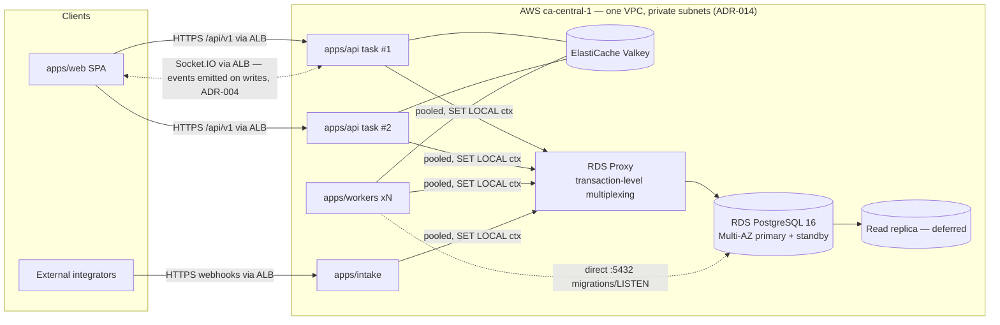

# Database Architecture

This document defines the physical database architecture for ReadyLoans: engine and hosting, connection pooling and tenant-context propagation, replica and failover posture, the partitioning plan for high-volume tables, and the platform-wide data conventions (money-in-integer-cents, soft deletes, timestamps and audit columns). It implements ADR-007 (multi-tenancy), ADR-008 (database — Amazon RDS for PostgreSQL, amended 2026-07-24), ADR-009 (data conventions) and ADR-015 (encryption); the logical schema itself is in [schema-design.md](./schema-design.md), indexes and RLS in [indexing-and-rls.md](./indexing-and-rls.md), and operational procedures in [migrations-operations.md](./migrations-operations.md).

## Table of Contents

1. [Engine & Hosting](#1-engine--hosting)
2. [Connection Topology & Pooling](#2-connection-topology--pooling)
3. [Tenant Context Propagation](#3-tenant-context-propagation)
4. [Read Replicas](#4-read-replicas)
5. [High Availability & Failover](#5-high-availability--failover)
6. [Partitioning Strategy](#6-partitioning-strategy)
7. [Data Conventions](#7-data-conventions)
   - [7.1 Money in integer cents](#71-money-in-integer-cents)
   - [7.2 Soft deletes](#72-soft-deletes)
   - [7.3 Timestamps & audit columns](#73-timestamps--audit-columns)
   - [7.4 Keys, FKs and enums](#74-keys-fks-and-enums)
   - [7.5 Generated columns](#75-generated-columns)
   - [7.6 Encrypted columns](#76-encrypted-columns)
8. [Extensions](#8-extensions)
9. [Performance Budgets](#9-performance-budgets)

---

## 1. Engine & Hosting

| Concern | Decision | Reference |
|---|---|---|
| Engine | PostgreSQL **16+** | ADR-008 |
| Provider | **Amazon RDS for PostgreSQL** — **VPC-private**: no public accessibility, security-group ingress only from the ECS task security groups; deletion protection on; automated backups + PITR; credentials in **Secrets Manager** | ADR-008 |
| Region | **`ca-central-1`** — Canadian data residency; avoids a Law 25 cross-border transfer PIA | ADR-008 |
| Instance plan | Build phase: local **Docker Postgres** dev ($0) + **db.t4g.small Single-AZ** staging (separate AWS account). Production launch: **Multi-AZ db.t4g.medium** + **RDS Proxy**; documented cheaper option **Multi-AZ db.t4g.small** (line ≈ US$90/mo) if load testing permits | ADR-008/023 |
| Cost line | Build ≈ **US$28–30/mo** (staging ~$26 + 20 GB gp3 ~$2.50; no proxy, no Multi-AZ pre-launch). Production launch ≈ **US$140–170/mo** (instance ~$103 + RDS Proxy ~$23 + gp3 Multi-AZ 50–100 GB ~$13–25 + backup overage ~$0–5) | ADR-008/014 |
| Tenancy model | Single shared database, shared schema, `tenant_id`/`store_id` on every business row, **RLS ENABLED + FORCED** | ADR-007 |
| At-rest encryption | **KMS-encrypted gp3 storage** (AES-256 — data files, indexes, WAL, backups/snapshots) | ADR-015 |
| In-transit | TLS 1.2 min / 1.3 preferred; app connects with `sslmode=verify-full` | ADR-015 |
| Monitoring | **CloudWatch + Performance Insights** (free 7-day retention tier at launch) | ADR-008/025 |
| Escalation path | Per-tenant database on a **Neon branch** only for a compliance-demanding enterprise dealer group; never a default | ADR-007/008 |

The legacy pattern of shipping `SUPABASE_SERVICE_ROLE_KEY` to every Express route (the old Kia tracker's `server/middleware/supabase.js` service client) is retired — in the target architecture **no service-role key exists at all** (ADR-008). Every process connects as a scoped, non-bypassing database role with credentials from Secrets Manager: `apps/api` as `app_api`, workers as `app_worker`, intake as `app_intake`; cross-tenant work runs only through the audited `SECURITY DEFINER` service functions (see [indexing-and-rls.md §5](./indexing-and-rls.md)). The database is unreachable from the public internet; developer access is via bastion/SSM port-forwarding only.



Security-group ingress to the RDS instance and RDS Proxy is limited to the ECS task security groups; nothing outside the VPC can reach either endpoint.

## 2. Connection Topology & Pooling

Two connection classes exist (ADR-008):

| Class | Endpoint | Mode | Used by | Pool size |
|---|---|---|---|---|
| Pooled | **RDS Proxy** endpoint | **Transaction-level multiplexing** | `apps/api`, `apps/workers`, `apps/intake` | per-process `max: 10` (API), `max: 5` (worker/intake process) |
| Direct | RDS instance endpoint `:5432` | Session | Migrations (CI, in-VPC job), `LISTEN/NOTIFY` consumers, ad-hoc admin (bastion/SSM) | `max: 2`, short-lived |

Rules that make transaction-level multiplexing safe (anything that pins the session defeats the proxy):

- **No session state.** Every request/job wraps its queries in one transaction; all GUCs are set with `SET LOCAL` (or `set_config(..., true)`), never plain `SET` — `SET LOCAL` is transaction-scoped and therefore **proxy-safe** (ADR-008). Session-scoped GUCs on a pooled connection leak tenant context to the next borrower *and* trigger RDS Proxy session pinning — this is the single most dangerous failure mode of the architecture.
- **Advisory locks are transaction-scoped only**: `pg_advisory_xact_lock`, never `pg_advisory_lock`.
- **No `LISTEN/NOTIFY` through RDS Proxy** — notifications do not survive transaction-level multiplexing (the proxy may hand each transaction a different backend); use the direct pool (or, preferably, Socket.IO events / BullMQ which already cover our push needs, ADR-004/012).
- **Named prepared statements are disabled** in the driver config (`prepare: false` for postgres.js / `statement_cache_size: 0` equivalents); the proxy does not guarantee the same backend between transactions, and session-named statements force session pinning.
- RDS Proxy `MaxConnectionsPercent` is tuned so `Σ(client pools)` stays inside the instance `max_connections` headroom; alert (Better Stack, ADR-025) on the proxy's CloudWatch `DatabaseConnectionsCurrentlySessionPinned` and `ClientConnectionsQueued` metrics (a rising pinned count means some code path is defeating multiplexing) and on `pg_stat_activity` saturation > 80%.

Timeouts are layered — a per-role **safety net** plus a stricter per-transaction budget:

```sql
-- Layer 1: per-role safety nets (survive pooling; catch any code path that bypasses the tenant executor)
ALTER ROLE app_api SET statement_timeout = '15s';
ALTER ROLE app_api SET idle_in_transaction_session_timeout = '10s';
ALTER ROLE app_api SET lock_timeout = '3s';
ALTER ROLE app_worker SET statement_timeout = '120s';  -- ceiling; also the report-job budget
```

Layer 2 is the operative budget: `withTenantContext` (§3) issues `SET LOCAL statement_timeout` in every transaction — **5 s API / 60 s workers / 120 s report jobs** — overriding the role default for that transaction, so a runaway tenant query cannot hold a pooled connection. The same layering is stated in [multi-tenancy.md §4.2](../03-architecture/multi-tenancy.md) and [scalability-performance.md §6](../03-architecture/scalability-performance.md); the role-level values only ever fire for connections that skip the executor.

## 3. Tenant Context Propagation

Every unit of work runs inside a transaction that first stamps the tenant context; RLS policies read it back with `current_setting()` (full policy catalog in [indexing-and-rls.md](./indexing-and-rls.md)). This is the pooler-safe `SET LOCAL` pattern mandated by ADR-007.

```ts
// packages/db — withTenantContext(ctx, fn); ONLY entry point apps/api uses to touch the DB
await db.transaction(async (tx) => {
  await tx.execute(sql`
    SELECT set_config('app.tenant_id',  ${ctx.tenantId},            true),
           set_config('app.user_id',    ${ctx.userId},              true),
           set_config('app.store_ids',  ${ctx.storeIds.join(',')},  true),
           set_config('app.roles',      ${ctx.roles.join(',')},     true)
  `);
  return fn(tx);
});
```

- `app.tenant_id` — the active organization (from the Better Auth session, ADR-006).
- `app.store_ids` — CSV of store UUIDs the user's memberships grant in this org (users can span stores — Hassan's staff span Kia ML / ReadyCar / Riverside).
- Workers set the same GUCs from the `tenant_id` carried in every BullMQ payload (ADR-012). A job with no tenant context can only touch platform tables.
- Cross-tenant work (AI network routing, platform admin) never sets a spoofed tenant; it calls one of the audited `SECURITY DEFINER` service functions (ADR-007), which execute as the `app_service` definer role ([indexing-and-rls.md §5](./indexing-and-rls.md)).
- App-level scoping middleware remains the first line; RLS is the backstop. A missing `WHERE tenant_id = ?` becomes a zero-row result, not a breach.

## 4. Read Replicas

**Deferred until reporting demands it** (ADR-008). Triggers to provision the first replica (an RDS read replica in `ca-central-1` — replicas must also stay in Canada for Law 25):

- Reporting/export endpoints (`/api/v1/reports/*`, Excel/PDF jobs) push primary CPU > 60% sustained, or
- p95 of board/queue queries degrades > 2× baseline during report generation.

Routing rules once added:

| Workload | Target |
|---|---|
| All writes, board/queue reads, anything followed by a write | Primary |
| `reports.*` queries, source-ROI / win-loss analytics, AI analytics snapshots, Excel/PDF generation reads | Replica |
| Realtime | n/a — Socket.IO events are emitted by the API/worker layer on writes (ADR-004), never captured from the database |

Replica lag is surfaced as a health metric; report jobs tolerate ≤ 60 s staleness and stamp `generated_at` on output. No user-facing transactional read ever routes to the replica.

## 5. High Availability & Failover

| Layer | Mechanism | Notes |
|---|---|---|
| Compute | **RDS Multi-AZ**: synchronous standby in a second AZ, automatic failover (typically 60–120 s) | AWS-managed; health-checked by Better Stack uptime monitors (ADR-025) |
| Storage/WAL | KMS-encrypted gp3 replicated synchronously to the standby + automated backups with continuous WAL archiving (PITR) | Basis of the RPO target in [migrations-operations.md §4](./migrations-operations.md) |
| Pooler | RDS Proxy is a managed, multi-AZ endpoint; it holds client connections through a failover and reconnects to the promoted standby, shrinking the visible outage; API retries transient connection errors (jittered backoff, max 3) | Idempotent handlers make retry safe |
| App tier | ≥ 2 always-on `apps/api` Fargate tasks spread across 2 AZs behind the ALB (ADR-014) | DB outage degrades to 503 with `Retry-After`, never data loss |
| Queue tier | BullMQ jobs persist in Valkey; workers reconnect and drain after DB recovery | At-least-once + idempotent job IDs (ADR-012) |
| Cache | Valkey loss degrades performance only — no correctness-critical data lives solely in cache (ADR-010) | |

Failover behavior contract: on primary failover, in-flight transactions abort; the API surfaces 503s for the failover window; workers pause queues on repeated connection failure and resume automatically. RPO/RTO targets and the DR runbook live in [migrations-operations.md §4–5](./migrations-operations.md).

## 6. Partitioning Strategy

**None at launch** (ADR-008). Partitioning is *pre-planned* so it can be enabled without re-keying tables. Candidates are the append-only, high-volume tables:

| Table | Growth driver | Partition when |
|---|---|---|
| `activity_events` | Every state change on every entity emits a row (ADR-009) | > 10M rows or > 20 GB |
| `messages` | Every AI/SMS/web chat turn | > 10M rows |
| `communications` | Unified outbound/inbound email/SMS/call log (all sends flow through it, ADR-020) | > 10M rows |
| `notifications` | Per-user fan-out of automation rules | > 10M rows |
| `webhook_deliveries` | Outbound delivery log incl. retries (ADR-005) | > 10M rows |
| `intake_events` | Raw inbound lead payload log | > 10M rows |
| `usage_events` | AI minutes / SMS metering (ADR-024) | > 10M rows |

Design rules (applied **now**, so conversion is non-breaking):

1. **Partition key = `created_at`**, monthly `RANGE` partitions. All candidate tables are append-only/insert-mostly and queried by recency.
2. **Primary key includes the partition key**: these tables use `PRIMARY KEY (id, created_at)` from day one (Postgres requires the partition key in unique constraints). Foreign keys *into* these tables are avoided; they reference outward only.
3. Conversion procedure (expand-and-contract, see [migrations-operations.md §2](./migrations-operations.md)): create the partitioned parent alongside, attach the legacy table as the initial partition or copy in batches, swap names in one transaction.
4. **Partition maintenance is a BullMQ repeatable job** (ADR-012 — no pg_cron): monthly job calls `app.ensure_partitions(table, months_ahead := 3)` and detaches partitions past retention (archival policy in [migrations-operations.md §7](./migrations-operations.md)). A `DEFAULT` partition catches stragglers and alerts if it ever receives rows.
5. Indexing on partitioned tables: `BRIN (created_at)` for range scans plus the tenant-leading B-trees defined in [indexing-and-rls.md](./indexing-and-rls.md); indexes are declared on the parent so new partitions inherit them.
6. RLS applies identically to the parent and all partitions (policies attach to the parent).

## 7. Data Conventions

### 7.1 Money in integer cents

**Rule (ADR-009): every monetary amount is an `INTEGER` number of cents, no exceptions. Rates/percentages stay `DECIMAL`.** Column names carry the `_cents` suffix (the convention already used by `expenses.amount_cents/tax_cents/total_cents`).

Current state, documented as-is from the legacy schema (`20260406_soft_delete_cents.sql` et al.):

| Area | Legacy state | Status |
|---|---|---|
| `deals` money (`money_down_amount`, `cash_back_amount`, `lien_amount`, `sale_price`, `vehicle_cost`, `fi_reserve`), `contacts.lifetime_value` | Converted to INTEGER cents by F-007 (`ROUND(old * 100)::INTEGER`) | ✔ cents (no `_cents` suffix) |
| `inventory` costs, `work_orders`, `wholesale_listings`, `deal_submissions.monthly_payment`, `clawback_log`, `leads.monthly_income/monthly_housing/trade_in_value`, `lead_distribution_config.contribution_amount`, `expenses.*_cents` | Native INTEGER cents | ✔ cents |
| `commissions` (`pad_amount`, `gross_for_commission`, `commission_amount`, `override_amount`) | `NUMERIC` **dollars** — the F-007 conversion was promised in comments but never implemented | ✗ gap |
| `salespeople.pad_amount` | `NUMERIC` **dollars** (e.g. 1500 = $1,500 pad) | ✗ gap |
| `sourced_units.deposit_amount` | `DECIMAL(10,2)` dollars | ✗ gap |
| `source_costs.spend` | `DECIMAL(12,2)` dollars | ✗ gap |

**Target:** the migration converts the four gap areas to `*_cents INTEGER NOT NULL DEFAULT 0` (`CHECK (x >= 0)` where negative values are impossible; `wholesale_listings.profit_loss_cents` and rule scores may be negative) and renames all legacy cents columns to the `_cents` suffix. Rates remain decimal: `stores.gst_rate/qst_rate DECIMAL(6,5)`, `commission_plans.commission_rate DECIMAL(5,4)` (fraction, 0.3000 = 30%), `deal_submissions.rate DECIMAL(5,2)` (% APR). Tax is stored per-deal as split components `gst_cents`, `qst_cents`, `pst_cents`, `hst_cents` written by the desking engine in `packages/core` — never recomputed from a blended rate (the legacy single `stores.tax_rate = 0.14975` is decomposed; see [schema-design.md §Tenancy](./schema-design.md)).

### 7.2 Soft deletes

**Rule (ADR-009): every business table carries `deleted_at TIMESTAMPTZ NULL`.** `NULL` = live. Delete endpoints set the timestamp; restore nulls it; both emit `activity_events` rows (`action = 'deleted' | 'restored'`).

Current state as-is: `deleted_at` exists on deals, users, salespeople, commissions, delivery_checklists, sourced_units, chaser_vehicles, dealer_plates, dispatch_assignments, contacts, tasks, leads, inventory, work_orders, documents, wholesale_listings — but is **absent** on stores, lenders, deal_submissions, appointments, lead_communications, message_templates, workflow tables, suppliers (uses `is_active`), expenses (uses `status='void'`), and the lead-config tables (use `is_active`/`active`). `deals.js` even hard-deletes while `bulk.js` soft-deletes the same table.

Target rules:

1. `deleted_at` added to every business table listed in [schema-design.md](./schema-design.md); hard `DELETE` is revoked from `app_api` on those tables (RLS has no DELETE policy — see [indexing-and-rls.md](./indexing-and-rls.md)).
2. Config/catalog tables keep their **activation flag** (`is_active BOOLEAN`) *in addition to* `deleted_at`: deactivation is a business state (hidden from pickers), deletion is lifecycle.
3. `expenses` keeps `status='void'` (audit-preserving) — its documented as-is behavior — plus `deleted_at` for true removal of erroneous rows.
4. **Filtering is application-level** (repository layer always appends `deleted_at IS NULL`); RLS deliberately does *not* hide soft-deleted rows so that restore, audit and merge tooling can see them. Hot-path partial indexes are declared `WHERE deleted_at IS NULL`.
5. Append-only tables (`activity_events`, `deal_stage_history`, `lead_assignment_history`, `messages`, `clawback_log`, `webhook_deliveries`, `intake_events`) never soft-delete; they age out via retention ([migrations-operations.md §7](./migrations-operations.md)).

### 7.3 Timestamps & audit columns

| Column | Type | Rule |
|---|---|---|
| `created_at` | `TIMESTAMPTZ NOT NULL DEFAULT now()` | Every table. UTC always; tenant timezone applied at render (ADR-009) |
| `updated_at` | `TIMESTAMPTZ NOT NULL DEFAULT now()` | Every mutable table; maintained by the shared trigger below — **attached by a CI lint, fixing the legacy gap** where 2026-04-11+ tables (appointments, message_templates, saved_filters, source_costs, workflow tables, suppliers, scoring/assignment rules) defined the column but never attached the trigger |
| `deleted_at` | `TIMESTAMPTZ NULL` | §7.2 |
| `created_by` | `UUID REFERENCES users(id) ON DELETE SET NULL` | Actor who created the row |
| `<verb>_by` / `<verb>_at` pairs | UUID FK + TIMESTAMPTZ | State-transition audit stamps, e.g. `approved_by/approved_at`, `funding_confirmed_by/funded_at`, `manager_signed_by/manager_signed_at` — the existing pattern, kept |

```sql
CREATE OR REPLACE FUNCTION app.set_updated_at() RETURNS trigger
LANGUAGE plpgsql AS $$
BEGIN NEW.updated_at = now(); RETURN NEW; END $$;
-- one trigger per table, generated by packages/db tooling:
CREATE TRIGGER <table>_updated_at BEFORE UPDATE ON <table>
  FOR EACH ROW EXECUTE FUNCTION app.set_updated_at();
```

Beyond column stamps, **every state change emits an `activity_events` row** (append-only, tenant-scoped, ADR-009): `entity_type`, `entity_id`, `action`, `actor_id`, `old_value`/`new_value` JSONB. Emission happens in `packages/core` command handlers (not DB triggers) so events carry request context (actor, request_id, trace_id per ADR-025).

### 7.4 Keys, FKs and enums

- **Primary keys:** `id UUID PRIMARY KEY DEFAULT gen_random_uuid()` (pgcrypto-native, no `uuid-ossp` dependency). Partitioned tables: `PRIMARY KEY (id, created_at)` (§6).
- **Tenancy columns:** `tenant_id UUID NOT NULL REFERENCES organizations(id)` on every business row; `store_id UUID REFERENCES stores(id)` — `NOT NULL` on store-anchored tables, nullable on org-wide config (NULL = applies to all stores of the org). Both are covered by tenant-leading composite indexes ([indexing-and-rls.md §2](./indexing-and-rls.md)).
- **Real foreign keys everywhere** (ADR-009): the legacy name-string joins are eliminated — `deals.salesperson_name` → `deals.salesperson_id → users(id)`; `commissions.salesperson_name` → `commissions.salesperson_id`; `salespeople.override_on` (name) → `commission_plans.override_on_user_id`; `clawback_log.commission_id` gains its missing FK. Polymorphic references (`entity_type` + `entity_id` on tasks/notifications/activity_events) remain FK-less by design but are constrained by a `CHECK (entity_type IN (...))` against the enum in `packages/schemas`.
- **`ON DELETE` conventions:** `CASCADE` only from a true parent to owned children (deal → checklist/submissions/parties, conversation → messages, lead → lead_tags); `SET NULL` for actor/reference links; `RESTRICT` (default) from business rows to catalog rows (lenders, expense_categories).
- **Enums:** one vocabulary per entity, defined once in `packages/schemas` (Zod, ADR-016) and mirrored into the DB as `CHECK` constraints generated by `packages/db` tooling. `TEXT + CHECK` is used instead of native `ENUM` types (adding a value is an `ALTER TABLE ... DROP/ADD CONSTRAINT`, not a type migration). The complete enum catalog is in [schema-design.md §2](./schema-design.md).

### 7.5 Generated columns

Generated columns must be **immutable** (ADR-009). `expenses.total_cents GENERATED ALWAYS AS (amount_cents + tax_cents) STORED` is the model citizen and stays. Volatile pseudo-derivations are banned: the legacy `inventory.days_on_lot INTEGER` denormalized column is **dropped**; day counts (`days_on_lot`, lead `created_days_ago`, deal `days_in_stage`) are computed in queries/views (`GREATEST(0, (CURRENT_DATE - lot_arrival_date))`) or in `packages/core` — never stored with `CURRENT_DATE`/`now()` inputs.

### 7.6 Encrypted columns

Per ADR-015, high-sensitivity fields (SIN, driver's licence number, date of birth, income details, banking data on credit apps) are stored as AES-256-GCM ciphertext (envelope-encrypted with per-tenant AWS KMS data keys) in `BYTEA`/`TEXT` columns named `<field>_enc`, with a sibling **blind index** `<field>_hmac TEXT` (HMAC-SHA256 with a per-tenant index key) for equality lookup. Encrypted columns are never indexed directly, never appear in FTS vectors, and are excluded from Socket.IO event payloads (ADR-004) and PostHog/Sentry telemetry (ADR-025). Which columns this applies to is marked per-table in [schema-design.md](./schema-design.md). `pgsodium` is banned; the crypto lives in `packages/core` application code.

## 8. Extensions

| Extension | Use | Status |
|---|---|---|
| `pgcrypto` | `gen_random_uuid()`; low-tier symmetric encryption where KMS envelope is overkill | Required |
| `pg_trgm` | Trigram GIN indexes for VIN/stock/name `ILIKE` search | Required (new) |
| `unaccent` | Accent-insensitive FR name search (Québec names: "Gagné", "Côté") in the FTS config | Required (new) |
| `uuid-ossp` | Legacy only — installed today but unused (PKs already use `gen_random_uuid()`) | Dropped in target |
| `pg_cron` | — | **Not used**; all scheduling is BullMQ repeatable jobs (ADR-012) |
| `pgsodium` | — | **Banned** (ADR-015, pending deprecation); not offered on RDS — field crypto lives in `packages/core` application code |

All required extensions (`pgcrypto`, `pg_trgm`, `unaccent`, `pg_stat_statements`) are on the RDS for PostgreSQL 16 supported-extension list; none require `rds_superuser` beyond `CREATE EXTENSION` in a migration.

## 9. Performance Budgets

Derived from the ADR-025 SLOs (API p95 < 300 ms, intake ACK p99 < 1 s, AI first-touch < 60 s):

| Query class | Budget (p95) | Enforcement |
|---|---|---|
| Point reads (`/:id`) | < 10 ms | PK lookup + RLS initPlan (wrapped `(SELECT ...)` settings, see indexing doc) |
| Board/queue lists (deals kanban, lead queue) | < 50 ms | Covering partial indexes; **pagination is mandatory** — the legacy unpaginated full-table list endpoints (leads, deals, inventory) are not ported |
| Search (FTS/trigram) | < 80 ms | GIN indexes; result caps (limit ≤ 25) |
| Report aggregates | < 2 s | Replica-eligible (§4); pre-aggregated monthly rollups when exceeded |
| Intake insert path (`intake_events` + enqueue) | < 30 ms | Minimal synchronous work; everything else in BullMQ Flow (ADR-012) |

`pg_stat_statements` stays enabled and **Performance Insights** (free 7-day retention tier, ADR-008) provides wait-event analysis on the RDS instance; the top-10 by `total_exec_time` is reviewed at each release; OpenTelemetry `pg` instrumentation ties slow queries to traces (ADR-025).
