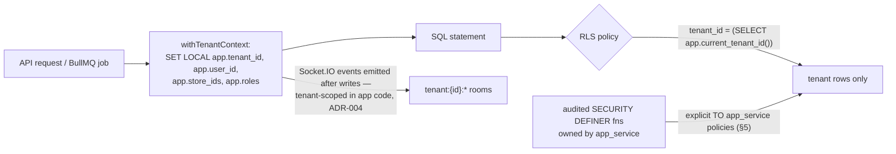

# Indexing & Row-Level Security

This document is the physical performance and isolation layer for the target schema in [schema-design.md](./schema-design.md): the complete per-table index catalog (tenant-leading composites, partial, covering, BRIN), the search infrastructure (FTS + trigram + unaccent), and the full RLS policy catalog that turns ADR-007's "shared schema + FORCED RLS" decision into concrete SQL. It documents the legacy as-is state (every policy `USING (true)` — decorative) and replaces it entirely; `USING (true)` policies are permanently banned (ADR-007). Connection/pooling context that these policies depend on is defined in [database-architecture.md §3](./database-architecture.md); migration mechanics for creating these objects are in [migrations-operations.md](./migrations-operations.md).

## Table of Contents

1. [Legacy State (As-Is)](#1-legacy-state-as-is)
2. [Index Strategy & Catalog](#2-index-strategy--catalog)
   - [2.1 Rules](#21-rules)
   - [2.2 Catalog: Tenancy, Identity, Billing](#22-catalog-tenancy-identity-billing)
   - [2.3 Catalog: CRM, Leads & Lead Ops](#23-catalog-crm-leads--lead-ops)
   - [2.4 Catalog: Conversations, Communications, AI Compliance](#24-catalog-conversations-communications-ai-compliance)
   - [2.5 Catalog: Deals, Finance, Commissions](#25-catalog-deals-finance-commissions)
   - [2.6 Catalog: Inventory, Delivery, Documents](#26-catalog-inventory-delivery-documents)
   - [2.7 Catalog: Tasks, Automation, Audit, Accounting, Integration](#27-catalog-tasks-automation-audit-accounting-integration)
3. [Search: FTS, Trigram, Unaccent](#3-search-fts-trigram-unaccent)
4. [RLS Architecture](#4-rls-architecture)
5. [Database Roles & Grants](#5-database-roles--grants)
6. [RLS Policy Catalog](#6-rls-policy-catalog)
7. [Verification & CI Gates](#7-verification--ci-gates)

---

## 1. Legacy State (As-Is)

Documented faithfully from `supabase/schema.sql` and the 32 dated migrations so nobody mistakes it for a baseline to extend:

| Finding | Detail |
|---|---|
| Every existing policy is `USING (true)` / `WITH CHECK (true)` | Policy *names* claim restrictions ("Only admins can insert stores", "Users see their own notifications") that are **not implemented** |
| Tables with **no RLS at all** | `appointments`, `lead_communications`, `message_templates`, `workflow_sequences`, `workflow_steps`, `workflow_enrollments`, `suppliers`, `expenses`, `expense_categories` — fully open to any key that can reach PostgREST |
| Store isolation | Never enforced in RLS; `store_id` is an optional application-level filter; server routes use the service-role key for everything |
| Soft-delete filtering | Application-level only; RLS never references `deleted_at` (kept as target behavior — see §6 note) |
| Storage | Single `deal-files` bucket; `storage.objects` policies allow all four verbs bucket-wide, no per-tenant paths |
| Indexes | Single-column only (`idx_<table>_<col>`); no composite tenant-leading, no partial, no covering, no trigram |

**None of the legacy policies migrate.** The target catalog in §6 is written from scratch against the tenant-context mechanism of [database-architecture.md §3](./database-architecture.md).

## 2. Index Strategy & Catalog

### 2.1 Rules

1. **Tenant-leading composite on every business table** (ADR-008): the dominant list query of each table gets one composite index starting `(tenant_id, …)`. RLS compares `tenant_id` on every row touched — a missing tenant index is the #1 RLS performance killer (documented >100× regressions).
2. **Partial indexes for hot lists**: active-pipeline queries declare `WHERE deleted_at IS NULL` (and often a status predicate) so the index stays small and the planner picks it for board/queue reads.
3. **Covering (`INCLUDE`) indexes** for the two index-only-scan hot paths: the deals kanban board and the lead queue. Card-level display columns ride in `INCLUDE` so the query never visits the heap.
4. **Child-side FK indexes**: every FK that is queried from the child side (`deal_id`, `lead_id`, `conversation_id`, `inventory_id`, …) gets a B-tree; Postgres does not auto-index FKs.
5. **BRIN on append-only `created_at`**: `activity_events`, `messages`, `communications`, `notifications`, `intake_events`, `webhook_deliveries`, `usage_events` — cheap range pruning now, inherited by partitions later ([database-architecture.md §6](./database-architecture.md)).
6. **Index every column referenced in a policy** — with GUC-comparison policies this means `tenant_id`, `store_id`, `target_user_id`, `created_by`, `salesperson_id` where the policy names them.
7. Naming: `idx_<table>__<cols>` (double underscore between table and column list), `uq_<table>__<cols>` for unique. All index creation in migrations uses `CREATE INDEX CONCURRENTLY` ([migrations-operations.md §2](./migrations-operations.md)).
8. Unique **business keys are tenant-scoped**: legacy global uniques (`stores.code`, `tags.name`, `dealer_plates.plate_number`) become `UNIQUE (tenant_id, …)` per [schema-design.md](./schema-design.md).

The two covering indexes, in full:

```sql
-- Deals kanban board: stage columns, cards ordered by time-in-stage, index-only scan
CREATE INDEX CONCURRENTLY idx_deals__board
  ON deals (tenant_id, store_id, pipeline_stage, stage_entered_at DESC)
  INCLUDE (contact_id, salesperson_id, stock_number, vin, year, make, model,
           sale_price_cents, funding_status, tentative_delivery_date)
  WHERE deleted_at IS NULL;

-- Lead queue: newest-first per status lane
CREATE INDEX CONCURRENTLY idx_leads__queue
  ON leads (tenant_id, store_id, status, created_at DESC)
  INCLUDE (first_name, last_name, phone, source, score, assigned_to, vehicle_interest)
  WHERE deleted_at IS NULL;
```

### 2.2 Catalog: Tenancy, Identity, Billing

| Table | Indexes |
|---|---|
| `organizations` | PK; `uq_organizations__slug (slug)`; `uq_organizations__stripe (stripe_customer_id)` |
| `stores` | `uq_stores__tenant_code (tenant_id, code)`; `idx_stores__tenant (tenant_id) WHERE deleted_at IS NULL` |
| `tenant_branding` | `uq_tenant_branding__tenant_store (tenant_id, store_id)` (NULLS NOT DISTINCT) |
| `tenant_domains` | `uq_tenant_domains__domain (domain)`; `idx_tenant_domains__tenant (tenant_id)` — domain→tenant resolution is the white-label hot path (cached in Valkey, ADR-010) |
| `billing_subscriptions` | `uq_billing_subscriptions__stripe (stripe_subscription_id)`; `idx_billing_subscriptions__tenant (tenant_id, store_id)` |
| `tenant_entitlements` | `uq_tenant_entitlements__tenant_key (tenant_id, key)` — read by the rate limiter (ADR-011) via Valkey cache |
| `usage_events` | `idx_usage_events__meter (tenant_id, meter, occurred_at DESC)`; `uq_usage_events__idem (idempotency_key)`; `brin_usage_events__occurred (occurred_at) USING brin` |
| `users` | `uq_users__email (lower(email))`; `idx_users__default_store (default_store_id)` — Better Auth adds its own session/account indexes |
| `memberships` | `uq_memberships__user_tenant_store (user_id, tenant_id, store_id) NULLS NOT DISTINCT` (single membership table — [schema-design.md §4](./schema-design.md)); `idx_memberships__tenant_user (tenant_id, user_id)` — read by `app.shares_org_with()` (§4); `idx_memberships__user_status (user_id, status)` — per-request context loader |
| `staff_schedules` | `idx_staff_schedules__user (user_id, day_of_week) WHERE active`; `idx_staff_schedules__tenant_store (tenant_id, store_id)` — lead-router availability lookup |

### 2.3 Catalog: CRM, Leads & Lead Ops

| Table | Indexes |
|---|---|
| `contacts` | `gin_contacts__search (search_vector) USING gin` (§3); `idx_contacts__tenant_phone (tenant_id, phone_normalized) WHERE deleted_at IS NULL`; `idx_contacts__tenant_email (tenant_id, lower(email)) WHERE deleted_at IS NULL`; `idx_contacts__tenant_name (tenant_id, last_name, first_name) WHERE deleted_at IS NULL`; `gin_contacts__phone_trgm (phone_normalized gin_trgm_ops)` — legacy `ilike %digits%` typeahead; `idx_contacts__dl_hmac (tenant_id, driver_license_hmac)` — blind-index equality (ADR-015) |
| `deal_parties` | `uq_deal_parties__deal_contact_role (deal_id, contact_id, role)`; `idx_deal_parties__contact (contact_id)` |
| `leads` | `idx_leads__queue` covering (§2.1); `idx_leads__assignee (tenant_id, assigned_to) WHERE deleted_at IS NULL AND status NOT IN ('lost','converted')` — workload/cap counting (assignment engine terminal set); `idx_leads__tenant_phone (tenant_id, phone)`; `gin_leads__phone_trgm (phone gin_trgm_ops)` — last-7-digit dupe match; `idx_leads__source (tenant_id, source, created_at DESC)` — ROI analytics; `idx_leads__score (tenant_id, score DESC) WHERE deleted_at IS NULL`; `idx_leads__trade_in (tenant_id) WHERE has_trade_in` (partial, as-is); `idx_leads__converted_deal (converted_deal_id) WHERE converted_deal_id IS NOT NULL`; `idx_leads__duplicate_of (duplicate_of) WHERE duplicate_of IS NOT NULL`; `idx_leads__nurture (tenant_id, nurture_expires_at) WHERE nurture_drip_status = 'active'` — drip sweep |
| `tags` | `uq_tags__tenant_name (tenant_id, name)` |
| `lead_tags` | `uq_lead_tags__lead_tag (lead_id, tag_id)`; `idx_lead_tags__tag (tag_id)` |
| `lost_reasons` | `uq_lost_reasons__tenant_name (tenant_id, name)`; `idx_lost_reasons__tenant (tenant_id, store_id) WHERE is_active` |
| `lead_duplicates` | `uq_lead_duplicates__pair (lead_id, duplicate_of)`; `idx_lead_duplicates__tenant_status (tenant_id, store_id, status)`; `idx_lead_duplicates__canonical (duplicate_of)` |
| `lead_scoring_rules` | `idx_lead_scoring_rules__tenant (tenant_id, store_id, priority DESC) WHERE is_active` — the global+store rule read |
| `lead_scores` | `uq_lead_scores__lead (lead_id)`; `idx_lead_scores__tenant_score (tenant_id, score DESC)` |
| `lead_assignment_rules` | `idx_lead_assignment_rules__tenant (tenant_id, priority) WHERE active` — first-match-wins scan order |
| `lead_assignment_state` | `uq_lead_assignment_state__rule (rule_id)` |
| `lead_assignment_history` | `idx_lah__lead (lead_id)`; `idx_lah__assignee (tenant_id, assigned_to, assigned_at DESC)` — 24 h workload window |
| `lead_distribution_config` | `uq_ldc__store_platform_month (store_id, platform, month)`; `idx_ldc__tenant_month (tenant_id, month)` — cross-tenant routing tally (service functions only) |
| `source_costs` | `uq_source_costs__source_month_store (source, month, store_id)` (NULLS NOT DISTINCT); `idx_source_costs__tenant_month (tenant_id, month DESC)` |
| `saved_filters` | `idx_saved_filters__tenant_owner (tenant_id, created_by)`; `idx_saved_filters__shared (tenant_id) WHERE is_shared` |
| `message_templates` | `idx_message_templates__tenant (tenant_id, type, category)` |
| `appointments` | `idx_appointments__assignee_time (tenant_id, assigned_to, start_time) WHERE status IN ('scheduled','confirmed') AND deleted_at IS NULL` — salesperson conflict check; `idx_appointments__vehicle_time (tenant_id, vehicle_id, start_time) WHERE type = 'test_drive' AND status NOT IN ('cancelled','no_show','rescheduled') AND deleted_at IS NULL` — vehicle double-booking check; `idx_appointments__lead (lead_id)`; `idx_appointments__calendar (tenant_id, store_id, start_time) WHERE deleted_at IS NULL` |

### 2.4 Catalog: Conversations, Communications, AI Compliance

| Table | Indexes |
|---|---|
| `conversations` | `idx_conversations__inbox (tenant_id, store_id, status, updated_at DESC)`; `idx_conversations__phone_open (tenant_id, phone_number) WHERE status <> 'closed'` — Twilio inbound match ("most recent non-closed conversation for this number"); `idx_conversations__lead (lead_id)`; `idx_conversations__agent (tenant_id, assigned_agent_id) WHERE status IN ('handed_off','agent_active')` |
| `messages` | `idx_messages__conversation (conversation_id, created_at)`; `idx_messages__tenant (tenant_id, created_at DESC)`; `brin_messages__created (created_at) USING brin`; `uq_messages__twilio (twilio_sid) WHERE twilio_sid IS NOT NULL` — inbound webhook redelivery dedupe |
| `communications` | `idx_communications__lead (tenant_id, lead_id, created_at DESC) WHERE lead_id IS NOT NULL`; same partial pattern for `contact_id` and `deal_id`; `brin_communications__created (created_at) USING brin`; `idx_communications__provider (provider_message_id) WHERE provider_message_id IS NOT NULL` — delivery-status webhook correlation |
| `consent_records` | `idx_consent__contact (tenant_id, contact_id, channel) WHERE contact_id IS NOT NULL`; `idx_consent__lead (tenant_id, lead_id, channel) WHERE lead_id IS NOT NULL`; `idx_consent__expiry (tenant_id, expires_at) WHERE revoked_at IS NULL AND expires_at IS NOT NULL` — CASL 6/24-month expiry sweep (ADR-022) |
| `suppressions` | `uq_suppressions__scope (COALESCE(tenant_id,'00000000-0000-0000-0000-000000000000'::uuid), channel, identifier)`; `idx_suppressions__identifier (identifier, channel)` — the pre-send gate lookup (must be <1 ms; also cached in Valkey) |
| `dncl_checks` | `idx_dncl__phone (phone, checked_at DESC)` — freshness lookup (≤31 days, ADR-022) |
| `ai_decision_log` | `idx_ai_decision__lead (tenant_id, lead_id, created_at DESC)`; `idx_ai_decision__review (tenant_id) WHERE requires_human_review AND reviewed_at IS NULL` — Law 25 s.12.1 review queue |

### 2.5 Catalog: Deals, Finance, Commissions

| Table | Indexes |
|---|---|
| `deals` | `idx_deals__board` covering (§2.1); `uq_deals__store_stock (store_id, stock_number) WHERE deleted_at IS NULL AND stock_number IS NOT NULL`; `idx_deals__funding (tenant_id, store_id, funding_status) WHERE deleted_at IS NULL AND funding_status <> 'funded'` — funding desk queue; `idx_deals__delivery (tenant_id, store_id, tentative_delivery_date) WHERE deleted_at IS NULL AND tentative_delivery_date IS NOT NULL` — delivery dashboard (soonest first); `idx_deals__salesperson_funded (tenant_id, salesperson_id, funded_at) WHERE funded_at IS NOT NULL` — commission tier month window ([schema-design.md §9](./schema-design.md)); `idx_deals__contact (contact_id)`; `idx_deals__inventory (inventory_id)`; `gin_deals__stock_trgm (stock_number gin_trgm_ops)`, `gin_deals__vin_trgm (vin gin_trgm_ops)` — search (§3); `idx_deals__stage_entered (tenant_id, stage_entered_at) WHERE deleted_at IS NULL` — deal-rotting sweep |
| `deal_stage_history` | `idx_dsh__deal (deal_id, changed_at)` |
| `lenders` | `idx_lenders__tenant (tenant_id, store_id) WHERE active AND deleted_at IS NULL` |
| `deal_submissions` | `idx_deal_submissions__deal (deal_id, submitted_at DESC)`; `idx_deal_submissions__lender (tenant_id, lender_id, status)` — lender turnaround analytics |
| `commission_plans` | `uq_commission_plans__user_window (user_id, effective_from)`; `idx_commission_plans__tenant (tenant_id, store_id) WHERE active`; `idx_commission_plans__override (override_on_user_id) WHERE override_on_user_id IS NOT NULL` — overrider fan-out lookup |
| `commissions` | `uq_commissions__deal (deal_id)`; `idx_commissions__salesperson (tenant_id, salesperson_id, calculated_at DESC)`; `idx_commissions__override_user (override_user_id) WHERE override_user_id IS NOT NULL` — override pay reports |
| `clawback_log` | `idx_clawback__deal (deal_id)`; `idx_clawback__tenant (tenant_id, store_id, created_at DESC)` |

### 2.6 Catalog: Inventory, Delivery, Documents

| Table | Indexes |
|---|---|
| `inventory` | `uq_inventory__store_stock (store_id, stock_number) WHERE deleted_at IS NULL`; `idx_inventory__lot (tenant_id, store_id, availability_status) WHERE deleted_at IS NULL`; `idx_inventory__location (tenant_id, store_id, location_status) WHERE deleted_at IS NULL`; `idx_inventory__safety (tenant_id, store_id) WHERE safety_status IN ('sent_to_garage','in_progress') AND deleted_at IS NULL` — safety-overdue sweep; `idx_inventory__aging (tenant_id, store_id, lot_arrival_date) WHERE deleted_at IS NULL AND availability_status = 'available'` — aging alerts (days computed in query, ADR-009); `gin_inventory__vin_trgm (vin gin_trgm_ops)`, `gin_inventory__stock_trgm (stock_number gin_trgm_ops)` |
| `vehicle_photos` | `idx_vehicle_photos__inventory (inventory_id, angle_type)` |
| `garages` | `idx_garages__tenant (tenant_id, store_id) WHERE active AND deleted_at IS NULL` |
| `work_orders` | `idx_work_orders__inventory (inventory_id)`; `idx_work_orders__queue (tenant_id, store_id, status, created_at DESC) WHERE deleted_at IS NULL`; `idx_work_orders__garage (garage_id, status)` |
| `wholesale_listings` | `idx_wholesale__inventory (inventory_id)`; `idx_wholesale__tenant_result (tenant_id, store_id, result) WHERE deleted_at IS NULL` |
| `delivery_checklists` | `uq_delivery_checklists__deal (deal_id)` |
| `pdi_templates` | `idx_pdi_templates__tenant (tenant_id, store_id, section, sort_order) WHERE active` |
| `sourced_units` | `uq_sourced_units__deal (deal_id)` |
| `chaser_vehicles` | `idx_chaser__tenant (tenant_id, store_id, status) WHERE deleted_at IS NULL` |
| `dealer_plates` | `uq_dealer_plates__tenant_plate (tenant_id, plate_number)`; `idx_plates__tenant_status (tenant_id, store_id, status) WHERE deleted_at IS NULL` |
| `dispatch_assignments` | `uq_dispatch__deal (deal_id)`; `idx_dispatch__conflicts (tenant_id, store_id) WHERE conflict_flag`; `idx_dispatch__active (tenant_id, store_id, status) WHERE status NOT IN ('completed','cancelled') AND deleted_at IS NULL` |
| `documents` | `idx_documents__deal (deal_id) WHERE deal_id IS NOT NULL`; same partial pattern for `contact_id`, `inventory_id`; `idx_documents__tenant_cat (tenant_id, store_id, category) WHERE deleted_at IS NULL` |
| `required_documents` | `idx_required_documents__tenant_stage (tenant_id, pipeline_stage, sort_order)` |

### 2.7 Catalog: Tasks, Automation, Audit, Accounting, Integration

| Table | Indexes |
|---|---|
| `tasks` | `idx_tasks__my_open (tenant_id, assignee_id, due_date) WHERE status IN ('pending','in_progress') AND deleted_at IS NULL` — serves overdue/today/upcoming buckets; `idx_tasks__entity (tenant_id, entity_type, entity_id)`; `idx_tasks__overdue_sweep (tenant_id, due_date) WHERE status IN ('pending','in_progress') AND deleted_at IS NULL` — 15-min BullMQ sweep (ADR-012) |
| `notifications` | `idx_notifications__unread (tenant_id, target_user_id, created_at DESC) WHERE NOT acknowledged`; `idx_notifications__user (tenant_id, target_user_id, created_at DESC)`; `brin_notifications__created (created_at) USING brin` |
| `automation_rules` | `idx_automation_rules__tenant_event (tenant_id, trigger_event) WHERE active` |
| `workflow_sequences` | `idx_workflow_sequences__tenant (tenant_id) WHERE is_active` (partial, as-is) |
| `workflow_steps` | `uq_workflow_steps__order (workflow_id, step_order)` |
| `workflow_enrollments` | `uq_workflow_enrollments__wf_lead (workflow_id, lead_id)`; `idx_enrollments__due (next_run_at) WHERE status = 'active' AND next_run_at IS NOT NULL` — drip poller cursor (as-is, kept); `idx_enrollments__lead (lead_id)` |
| `activity_events` | `idx_activity__entity (tenant_id, entity_type, entity_id, created_at DESC)`; `idx_activity__actor (tenant_id, actor_id, created_at DESC)`; `brin_activity__created (created_at) USING brin` — partition candidate #1 |
| `expenses` | `idx_expenses__inventory (inventory_id) WHERE inventory_id IS NOT NULL`; `idx_expenses__deal (deal_id) WHERE deal_id IS NOT NULL`; `idx_expenses__stock (stock_number) WHERE stock_number IS NOT NULL` (partials as-is); `idx_expenses__tenant_date (tenant_id, store_id, expense_date DESC)`; `idx_expenses__status (tenant_id, status) WHERE status = 'pending'` — approval queue |
| `expense_categories` | `uq_expense_categories__scope_code (COALESCE(tenant_id, zero-uuid), code)` |
| `suppliers` | `idx_suppliers__tenant (tenant_id) WHERE is_active AND deleted_at IS NULL`; `idx_suppliers__name (tenant_id, lower(name))` |
| `intake_events` | `uq_intake__dedupe (tenant_id, source_key, COALESCE(provider_event_id, payload_hash))` — the BullMQ deterministic-job-ID key (ADR-005/012); `idx_intake__status (tenant_id, status, received_at DESC)`; `brin_intake__received (received_at) USING brin` |
| `webhook_endpoints` | `idx_webhook_endpoints__tenant (tenant_id) WHERE active AND deleted_at IS NULL` |
| `webhook_deliveries` | `idx_deliveries__endpoint (tenant_id, endpoint_id, created_at DESC)`; `idx_deliveries__retry (next_retry_at) WHERE status IN ('pending','failed')` — retry scheduler scan; `brin_deliveries__created (created_at) USING brin` |

## 3. Search: FTS, Trigram, Unaccent

Extensions `pg_trgm` + `unaccent` required ([database-architecture.md §8](./database-architecture.md)). Quebec names ("Gagné", "Côté", "Bélanger") must match unaccented queries, so the FTS configuration wraps `unaccent` over the legacy `'simple'` config:

```sql
CREATE TEXT SEARCH CONFIGURATION fr_unaccent (COPY = simple);
ALTER TEXT SEARCH CONFIGURATION fr_unaccent
  ALTER MAPPING FOR hword, hword_part, word WITH unaccent, simple;
```

**`contacts.search_vector`** keeps the legacy weighted trigger, retargeted at `fr_unaccent` (as-is weights): **A** = `first_name || last_name`, **B** = `email || phone || phone_normalized`, **C** = `city`, **D** = `employer`. Queried with `websearch_to_tsquery('fr_unaccent', :q)` (replaces the legacy hand-joined `' & '` plain terms, which broke on punctuation).

Search surface contract (`GET /api/v1/search?q=`), evolving the legacy `search.js` as-is behavior:

| Entity | Mechanism | Rules (as-is unless noted) |
|---|---|---|
| Contacts | FTS on `search_vector`; phone digits ≥ 4 → `phone_normalized` trigram `ILIKE %digits%` | Min query length 2; limit 5; phone-first ordering; **Target:** ranked `ts_rank_cd` |
| Deals | Trigram `ILIKE` on `stock_number`, `vin`; buyer name resolves through `deal_parties → contacts` FTS | Limit 5 *(legacy searched dropped `customer_name` column)* |
| Vehicles (inventory) | Trigram `ILIKE` on `stock_number`, `vin`; B-tree prefix on `(make, model)` | **Target — new** (legacy declared `vehicles: []` in the response shape but never implemented it) |

Query construction is parameterized through the ts-rest contract layer — the legacy pattern of interpolating raw user input into PostgREST `.or(...ilike...)` strings (a documented injection-adjacent defect) does not survive the rewrite (ADR-003/016). All search endpoints cap results (≤ 25) and carry the p95 < 80 ms budget ([database-architecture.md §9](./database-architecture.md)).

Encrypted columns (`*_enc`) are **never** searchable and never enter tsvectors; equality lookup goes through the sibling `*_hmac` blind index only (ADR-015).

## 4. RLS Architecture

Context arrives per-transaction via `SET LOCAL` GUCs stamped by `withTenantContext` ([database-architecture.md §3](./database-architecture.md)) — set exclusively from a **verified Better Auth session** (ADR-006), never from client-supplied values. Realtime no longer touches these policies at all: Socket.IO events are emitted by the API/worker layer after the same `withTenantContext` authorization, and room joins are authorized in application code (ADR-004) — so the GUCs are the **only** context channel; no JWT-claims fallback exists:

```sql
CREATE SCHEMA IF NOT EXISTS app;

CREATE FUNCTION app.current_tenant_id() RETURNS uuid
LANGUAGE sql STABLE AS $$
  SELECT NULLIF(current_setting('app.tenant_id', true), '')::uuid
$$;

CREATE FUNCTION app.current_user_id() RETURNS uuid
LANGUAGE sql STABLE AS $$
  SELECT NULLIF(current_setting('app.user_id', true), '')::uuid
$$;

CREATE FUNCTION app.accessible_store_ids() RETURNS uuid[]
LANGUAGE sql STABLE AS $$
  SELECT string_to_array(NULLIF(current_setting('app.store_ids', true), ''), ',')::uuid[]
$$;

CREATE FUNCTION app.has_any_role(VARIADIC wanted text[]) RETURNS boolean
LANGUAGE sql STABLE AS $$
  SELECT string_to_array(NULLIF(current_setting('app.roles', true), ''), ',') && wanted
$$;

-- SECURITY DEFINER membership helper for tables without tenant_id (users):
CREATE FUNCTION app.shares_org_with(other_user uuid) RETURNS boolean
LANGUAGE sql STABLE SECURITY DEFINER SET search_path = public AS $$
  SELECT EXISTS (
    SELECT 1 FROM memberships m
    WHERE m.user_id = other_user AND m.tenant_id = app.current_tenant_id()
  )
$$;
```

Rules (from the RLS performance research, now binding):

1. **`ENABLE` + `FORCE ROW LEVEL SECURITY`** on every tenant table — FORCE so the table owner is not exempt.
2. Policies wrap helper calls in **`(SELECT …)`** so Postgres evaluates them once per statement (initPlan), not per row — the documented ~3-min→2-ms class of fix.
3. Policies name explicit roles (`TO app_api, app_worker`) so untargeted roles short-circuit; the role catalog is vanilla Postgres (§5) — no provider-injected roles exist.
4. `SECURITY DEFINER` helpers always pin `search_path`.
5. RLS does **not** filter `deleted_at` — restore/audit/merge tooling must see soft-deleted rows; the repository layer appends `deleted_at IS NULL` (ADR-009, [database-architecture.md §7.2](./database-architecture.md)).
6. App-level scoping middleware remains the first line; RLS is the backstop (defense in depth). Cost-field masking on cross-store inventory is app-level column masking, **not** RLS (ADR-007).

Policy templates referenced throughout §6:

```sql
-- T-TEN: tenant isolation (org-wide tables)
CREATE POLICY t_ten_select ON <t> FOR SELECT TO app_api, app_worker
  USING (tenant_id = (SELECT app.current_tenant_id()));
CREATE POLICY t_ten_write ON <t> FOR INSERT TO app_api, app_worker
  WITH CHECK (tenant_id = (SELECT app.current_tenant_id()));
CREATE POLICY t_ten_update ON <t> FOR UPDATE TO app_api, app_worker
  USING (tenant_id = (SELECT app.current_tenant_id()))
  WITH CHECK (tenant_id = (SELECT app.current_tenant_id()));

-- T-STORE: tenant + store scoping (store-anchored tables); NULL store_id = org-wide row
USING (tenant_id = (SELECT app.current_tenant_id())
   AND (store_id IS NULL OR store_id = ANY ((SELECT app.accessible_store_ids()))))

-- T-APPEND: append-only — SELECT (T-TEN/T-STORE visibility) + INSERT only; no UPDATE/DELETE policies exist
-- T-OWN(col): row ownership — T-TEN AND <col> = (SELECT app.current_user_id())
-- T-ROLE(r…): write predicate additionally requires (SELECT app.has_any_role(r…))
-- P-READ: platform catalog — FOR SELECT TO app_api, app_worker USING (true is replaced by
--         tenant_id IS NULL OR tenant_id = (SELECT app.current_tenant_id())); writes via service functions only
```

**File-storage isolation** (ADR-013): there is no database-coupled storage ACL layer in the target — the legacy `storage.objects` bucket policies were a Supabase construct and do not carry over. S3 buckets are private (Block Public Access on, SSE-KMS); every object lives under a per-tenant prefix `tenant/{tenant_id}/…`; the **only** access path is a short-lived presigned URL minted by the API *after* `withTenantContext` authorization, and the signing helper in `packages/core` constructs keys from the request's tenant context (it cannot sign outside the requester's prefix by construction). ECS task IAM policies scope `s3:GetObject`/`s3:PutObject` to the specific bucket ARNs; the documents bucket class additionally carries object-lock/retention and no CDN exposure.

Cross-tenant reads (AI network routing over `lead_distribution_config` tallies, platform admin) go exclusively through the small audited set of `SECURITY DEFINER` service functions owned by the `app_service` definer role (§5, ADR-007); no connectable role ever holds a policy that spans tenants.



## 5. Database Roles & Grants

| Role | Attributes | Holds | Used by |
|---|---|---|---|
| `postgres` (RDS master user) | `rds_superuser` — **not** a true superuser; owns the schema. FORCE RLS keeps even the owner policy-subject | DDL | Migrations only (CI job in-VPC, direct `:5432`, never through RDS Proxy) — [migrations-operations.md §1](./migrations-operations.md); ad-hoc access via bastion/SSM only (ADR-008) |
| `app_api` | `NOSUPERUSER NOBYPASSRLS LOGIN` | `SELECT/INSERT/UPDATE` on business tables; `DELETE` only on the hard-delete allowlist below; `EXECUTE` on `app.*` helpers | `apps/api` via RDS Proxy; timeouts per [database-architecture.md §2](./database-architecture.md) |
| `app_worker` | `NOSUPERUSER NOBYPASSRLS LOGIN` | As `app_api` + `EXECUTE` on partition/archival maintenance functions | `apps/workers` (tenant GUCs from job payloads) |
| `app_intake` | `NOSUPERUSER NOBYPASSRLS LOGIN` | `INSERT` on `intake_events`, `SELECT` on `organizations/stores/tenant_domains` (endpoint resolution) — nothing else | `apps/intake` — a compromised intake service cannot read CRM data |
| `app_service` | **`NOLOGIN` definer role** — no credentials exist for it (ADR-008: "no service-role key at all"). RDS cannot grant `BYPASSRLS` (a superuser-only attribute), so cross-tenant access is granted by **explicit, enumerated `TO app_service` policies** on precisely the tables the audited functions touch (tenant provisioning, `lead_distribution_config` tallies, platform catalogs, `app.anonymize_contact`) | Owns the audited cross-tenant `SECURITY DEFINER` service functions (ADR-007) | Reachable only via `EXECUTE` grants on those functions to `app_api`/`app_worker` — never as a connection (the legacy `SERVICE_ROLE_KEY`-everywhere pattern is dead, ADR-008) |

The Supabase-specific roles of the legacy platform (`service_role`, `authenticated`, `anon`) have no successor: realtime authorization moved into the application layer (Socket.IO join/emit checks, ADR-004), and no anonymous database path exists — the legacy anon-writable surface dies with the platform, and unauthenticated intake traffic reaches the database only through `app_intake`'s single-table grant. Every role above is created by a plain migration; credentials for the three `LOGIN` roles live in Secrets Manager and rotate without code changes.

Hard-`DELETE` allowlist for `app_api`/`app_worker` (pure association/preference rows with no audit value): `lead_tags`, `saved_filters`, `workflow_steps`, `staff_schedules`, `lead_assignment_state`. Every other business table: `DELETE` is **revoked**; removal is `deleted_at` soft delete, and append-only tables additionally have no UPDATE grant (`activity_events`, `deal_stage_history`, `lead_assignment_history`, `messages`, `clawback_log`, `consent_records`, `intake_events`, `webhook_deliveries`, `usage_events`, `dncl_checks` — `ai_decision_log` allows the review-stamp UPDATE only, §6).

```sql
REVOKE DELETE ON ALL TABLES IN SCHEMA public FROM app_api, app_worker;
GRANT DELETE ON lead_tags, saved_filters, workflow_steps, staff_schedules,
                lead_assignment_state TO app_api;
REVOKE UPDATE ON activity_events, deal_stage_history, lead_assignment_history,
               messages, clawback_log, consent_records, intake_events,
               webhook_deliveries, usage_events, dncl_checks FROM app_api, app_worker;
```

## 6. RLS Policy Catalog

Template legend: **T-TEN** tenant isolation; **T-STORE** tenant + store; **T-APPEND** SELECT+INSERT only; **T-OWN(col)** ownership; **T-ROLE(r…)** role-gated writes; **P-READ** platform catalog read; **SVC** writes only through the audited service functions (executed as `app_service`, §5). All tables listed are `ENABLE + FORCE ROW LEVEL SECURITY`.

### Tenancy, identity, billing

| Table | SELECT | INSERT | UPDATE | DELETE | Notes |
|---|---|---|---|---|---|
| `organizations` | `id = (SELECT app.current_tenant_id())` | SVC (provisioning) | T-ROLE(owner) on branding-adjacent columns; billing fields SVC | — | Platform admin via service functions |
| `stores` | T-TEN | T-ROLE(owner,gm) | T-ROLE(owner,gm) | — | Store settings edits were unauthenticated in legacy — closed |
| `tenant_branding`, `tenant_domains` | T-TEN | T-ROLE(owner,gm) | T-ROLE(owner,gm) | — | Branding cache invalidation on write (ADR-010/018) |
| `billing_subscriptions`, `tenant_entitlements` | T-TEN (read-only to tenants) | SVC | SVC | — | Written by Stripe webhook consumers only (ADR-024) |
| `usage_events` | T-TEN | SVC (metering workers) | — | — | T-APPEND |
| `users` | `id = (SELECT app.current_user_id()) OR app.shares_org_with(id)` | Better Auth server API | self or T-ROLE(owner,gm,admin_office) | — | Fixes legacy open `PUT /users/:id` role-escalation hole |
| `memberships` | T-TEN | T-ROLE(owner,gm,admin_office) | T-ROLE(owner,gm,admin_office) | — | Role changes emit `activity_events` (ADR-009) |
| `staff_schedules` | T-STORE | T-ROLE(sales_manager,gm,owner) or T-OWN(user_id) | same | same | Hard delete allowed (allowlist) |

### CRM, leads & lead ops

| Table | SELECT | INSERT | UPDATE | DELETE | Notes |
|---|---|---|---|---|---|
| `contacts` | T-STORE | T-STORE | T-STORE | — | `*_enc` columns excluded from Socket.IO event payloads (ADR-004/015) |
| `deal_parties` | T-STORE | T-STORE | T-STORE | — | |
| `leads` | T-STORE | T-STORE (API); `app_intake` has **no** grant — leads are created by the normalize worker | T-STORE | — | |
| `tags`, `lead_tags` | T-TEN | T-TEN | T-TEN | `lead_tags` hard delete | |
| `lost_reasons`, `lead_scoring_rules`, `lead_assignment_rules`, `message_templates`, `pdi_templates`, `automation_rules`, `workflow_sequences`, `workflow_steps` | T-TEN | T-ROLE(sales_manager,gm,owner,admin_office) | same | `workflow_steps` hard delete | Config tables: managers configure, everyone reads |
| `lead_scores`, `lead_assignment_state` | T-TEN | app+worker T-TEN | same | `lead_assignment_state` hard delete | Engine-maintained caches |
| `lead_assignment_history` | T-STORE | T-STORE | — | — | T-APPEND |
| `lead_duplicates` | T-STORE | T-STORE | T-STORE (merge/dismiss stamps) | — | |
| `lead_distribution_config` | T-TEN | T-ROLE(owner,gm) | T-ROLE(owner,gm); tally columns SVC | — | Cross-tenant tally reads only via audited service fns (ADR-007) |
| `source_costs` | T-TEN | T-ROLE(sales_manager,gm,owner) | same | — | |
| `saved_filters` | T-TEN AND (`created_by = (SELECT app.current_user_id())` OR `is_shared`) | T-OWN(created_by) | T-OWN(created_by) | T-OWN(created_by), hard | Fixes legacy "everyone sees everyone's filters" |
| `appointments` | T-STORE | T-STORE | T-STORE | — | Soft delete (was hard delete) |

### Conversations, communications, compliance

| Table | SELECT | INSERT | UPDATE | DELETE | Notes |
|---|---|---|---|---|---|
| `conversations` | T-STORE | T-STORE | T-STORE | — | |
| `messages` | T-STORE (via tenant_id) | T-STORE | — | — | T-APPEND; AI/worker writes carry job tenant ctx |
| `communications` | T-STORE | T-STORE | — | — | T-APPEND (legacy PATCH/DELETE endpoints die; corrections are new rows) |
| `consent_records` | T-STORE | T-STORE | — | — | T-APPEND; revocation = new `revoked_at` row event via service fn |
| `suppressions` | `tenant_id IS NULL OR` T-TEN | SVC + T-ROLE(gm,owner) for tenant rows; global rows SVC only | — | — | Global STOP rows visible to every tenant's send gate |
| `dncl_checks` | P-READ (all app roles) | SVC (DNCL worker) | — | — | Platform-level, no tenant_id |
| `ai_decision_log` | T-STORE | SVC + app_worker | Only `reviewed_by`/`reviewed_at` via T-ROLE(fi_manager,gm,owner) — enforced by column-level trigger | — | Law 25 s.12.1 review trail |

### Deals, finance, commissions

| Table | SELECT | INSERT | UPDATE | DELETE | Notes |
|---|---|---|---|---|---|
| `deals` | T-STORE | T-STORE | T-STORE | — | Stage/funding transitions additionally guarded in `packages/core` |
| `deal_stage_history` | T-STORE | T-STORE | — | — | T-APPEND |
| `lenders` | T-TEN | T-ROLE(fi_manager,gm,owner) | same | — | |
| `deal_submissions` | T-STORE | T-ROLE(fi_manager,gm,owner,salesperson) | T-ROLE(fi_manager,gm,owner) | — | |
| `commission_plans` | T-TEN AND (`user_id = (SELECT app.current_user_id())` OR T-ROLE(gm,owner,sales_manager,admin_office)) | T-ROLE(gm,owner) | T-ROLE(gm,owner) | — | Pay plans are sensitive: reps see only their own |
| `commissions` | T-TEN AND (`salesperson_id = (SELECT app.current_user_id())` OR `override_user_id = (SELECT app.current_user_id())` OR T-ROLE(gm,owner,sales_manager,fi_manager,admin_office)) | app_worker (engine) | app_worker (engine recalc) | — | |
| `clawback_log` | same visibility as `commissions` | T-ROLE(gm,owner,fi_manager) | — | — | T-APPEND |

### Inventory, delivery, documents

| Table | SELECT | INSERT | UPDATE | DELETE | Notes |
|---|---|---|---|---|---|
| `inventory`, `vehicle_photos`, `garages`, `work_orders`, `wholesale_listings` | T-STORE | T-STORE (`wholesale_listings` T-ROLE(wholesale_manager,used_car_manager,gm,owner)) | same | — | Cross-store network visibility of inventory is an app-level projection with cost columns masked (ADR-007), not an RLS carve-out |
| `delivery_checklists`, `sourced_units`, `chaser_vehicles`, `dealer_plates`, `dispatch_assignments` | T-STORE | T-STORE | T-STORE; `manager_signed*` columns T-ROLE(sales_manager,gm,owner) via trigger | — | |
| `documents` | T-STORE | T-STORE | Blocked when `immutable = true` (trigger) | — | Signed URLs only; storage policy §4 |
| `required_documents` | T-TEN | T-ROLE(gm,owner,admin_office) | same | — | |

### Tasks, automation, audit, accounting, integration

| Table | SELECT | INSERT | UPDATE | DELETE | Notes |
|---|---|---|---|---|---|
| `tasks` | T-STORE | T-STORE | T-STORE | — | |
| `notifications` | T-TEN AND `target_user_id = (SELECT app.current_user_id())` | app_worker (automation engine) | same predicate as SELECT (acknowledge own only) | — | Finally enforces what the legacy policy *name* claimed |
| `workflow_enrollments` | T-TEN | T-TEN | app_worker (drip engine cursor) + T-TEN cancel | — | |
| `activity_events` | T-STORE | T-STORE | — | — | T-APPEND; partition parent carries the policies |
| `expenses` | T-STORE | T-STORE | T-STORE, plus `WITH CHECK (status = 'pending' OR (SELECT app.has_any_role('fi_manager','gm','owner','admin_office')))` — non-managers cannot write an approved/paid/rejected/void row | — | Replaces the legacy honor-system "manager-only" approve |
| `expense_categories` | P-READ | tenant rows T-ROLE(gm,owner,admin_office); platform rows SVC | same | — | |
| `suppliers` | T-TEN | T-ROLE(admin_office,gm,owner,fi_manager) | same | — | |
| `intake_events` | T-TEN | `app_intake` (T-TEN WITH CHECK) | app_worker (status/lead_id stamps) | — | |
| `webhook_endpoints` | T-TEN | T-ROLE(owner,gm) | T-ROLE(owner,gm) | — | Secrets returned masked by the API layer |
| `webhook_deliveries` | T-TEN | app_worker | app_worker (attempt/status) | — | |

## 7. Verification & CI Gates

RLS correctness is a release gate (ADR-023), not a review convention:

1. **Coverage lint** (CI, runs against the migrated ephemeral dry-run container — [migrations-operations.md §3](./migrations-operations.md)):

```sql
-- every public business table must have RLS enabled AND forced
SELECT relname FROM pg_class c JOIN pg_namespace n ON n.oid = c.relnamespace
WHERE n.nspname = 'public' AND c.relkind IN ('r','p')
  AND (NOT c.relrowsecurity OR NOT c.relforcerowsecurity);   -- must return 0 rows

-- USING(true) ban (ADR-007)
SELECT schemaname, tablename, policyname FROM pg_policies
WHERE qual = 'true' OR with_check = 'true';   -- must return 0 rows outside the enumerated
                                              -- TO app_service cross-tenant allowlist (§5)
```

2. **Policy-column index lint**: a `packages/db` script parses `pg_policies.qual` for referenced columns and asserts a matching leading-column entry in `pg_indexes` — the "index every policy column" rule enforced mechanically.
3. **initPlan check**: `EXPLAIN (FORMAT JSON)` on the top-10 board/queue queries asserts helper calls appear as `InitPlan`, not per-row `SubPlan` (catches an unwrapped `app.current_tenant_id()`).
4. **pgTAP isolation tests** in `packages/db/tests`: for every table in §6, a fixture creates two tenants (A, B) with rows; connecting as `app_api` with tenant-A context must see **0** tenant-B rows on SELECT, fail INSERT/UPDATE with tenant-B ids (`WITH CHECK` violation), and fail DELETE where revoked. The notifications/saved_filters/commissions ownership predicates get dedicated cases.
5. **Test as the client roles, never as the RDS master user** — master-user sessions (bastion/SSM psql) don't exercise the policy set the apps see: with `FORCE` the owner is policy-subject but has no tenant GUCs (zero rows), while a table missing `FORCE` silently exempts the owner entirely — both are false-confidence traps; all tests connect as `app_api`/`app_worker`.
6. **Migration-time guard**: the migration lint ([migrations-operations.md §1](./migrations-operations.md)) rejects any `CREATE TABLE` in `public` that lacks `tenant_id` (allowlist: platform tables `dncl_checks`, Better Auth internals) or lacks an accompanying `ENABLE/FORCE ROW LEVEL SECURITY` + policy block in the same migration.
