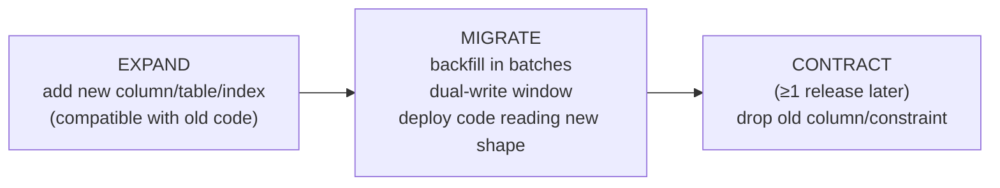
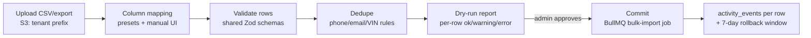

# Migrations & Database Operations

This document defines how the ReadyLoans database changes and survives: migration tooling and conventions in `packages/db`, zero-downtime expand-and-contract patterns, the environment/CI pipeline (ADR-023), backup and point-in-time-recovery posture, disaster recovery with explicit RPO/RTO targets, data seeding (platform provisioning templates + synthetic data), the clean-start production launch posture (no legacy data migration — decided 2026-07-23, §6.2), the bulk data-onboarding pipeline for tenants (§6.4), and archival/retention rules for the append-only tables. Physical architecture is in [database-architecture.md](./database-architecture.md); the target schema in [schema-design.md](./schema-design.md); indexes/RLS in [indexing-and-rls.md](./indexing-and-rls.md).

## Table of Contents

1. [Migration Tooling & Conventions](#1-migration-tooling--conventions)
2. [Zero-Downtime Migration Patterns](#2-zero-downtime-migration-patterns)
3. [Environments & CI Pipeline](#3-environments--ci-pipeline)
4. [Backups & Point-in-Time Recovery](#4-backups--point-in-time-recovery)
5. [Disaster Recovery — RPO/RTO Targets & Runbook](#5-disaster-recovery--rporto-targets--runbook)
6. [Data Seeding & Tenant Onboarding](#6-data-seeding--tenant-onboarding)
7. [Archival & Retention](#7-archival--retention)

---

## 1. Migration Tooling & Conventions

| Concern | Decision | Reference |
|---|---|---|
| Tool | **Plain forward-only SQL migrations** in `packages/db/migrations/`, applied by the `packages/db` migration runner (a small node-postgres CLI: ordered file replay + `schema_migrations` ledger + the advisory-lock serialization below) — no vendor migration service | ADR-008 |
| Direction | **Forward-only.** No down migrations; a bad change is reverted by a new forward migration | ADR-023 |
| Naming | `YYYYMMDDHHMMSS_<verb>_<subject>.sql` (e.g. `20260801093000_add_deals_tax_split_cents.sql`); one logical change per file | |
| Auth tables | Better Auth CLI (`@better-auth/cli migrate`) emits SQL that is **committed into the same `packages/db/migrations/` stream** — one ordered history, no second migration system | ADR-006 |
| Generated artifacts | After every migration merge, CI regenerates: TypeScript row types (`packages/db/src/types.gen.ts`, generated by the `packages/db` introspection codegen against the migrated schema), the enum CHECK constraints from `packages/schemas` (codegen — single enum source, ADR-009/016), and the OpenAPI schema drift check | ADR-016/023 |
| Application | CI applies migrations **before** app rollout, via the direct `:5432` connection (never through RDS Proxy) with `lock_timeout='5s'`, `statement_timeout='10min'`; because the instance is VPC-private (ADR-008), the prod/staging migration step runs as a **one-off ECS task inside the VPC**, triggered by the CI release job | [database-architecture.md §2](./database-architecture.md) |
| Serialization | A `pg_advisory_xact_lock(hashtext('readyloans_migrate'))` taken at the top of the runner prevents two CI runs from interleaving | |

**Migration lint** (blocking CI step, script in `packages/db/scripts/lint-migrations.ts`) rejects a migration that:

1. Creates a `public` table without `tenant_id UUID NOT NULL REFERENCES organizations(id)` (allowlist: `dncl_checks`, Better Auth internals, platform catalogs with nullable `tenant_id`).
2. Creates a table without `ENABLE ROW LEVEL SECURITY` + `FORCE ROW LEVEL SECURITY` + at least one policy in the same file ([indexing-and-rls.md §7](./indexing-and-rls.md)).
3. Contains `USING (true)` or `WITH CHECK (true)` (ADR-007 ban; sole exception: the enumerated `TO app_service` cross-tenant policies on the lint allowlist — [indexing-and-rls.md §5](./indexing-and-rls.md)).
4. Declares a money column as `NUMERIC`/`DECIMAL` or an `INTEGER` money column without the `_cents` suffix (ADR-009) — rates on a named allowlist (`*_rate`, `contribution_percentage`, `rate`).
5. Uses `CREATE INDEX` without `CONCURRENTLY` on an existing table (allowed only inside `CREATE TABLE` migrations).
6. Uses a native `CREATE TYPE ... AS ENUM` (vocabularies are `TEXT + CHECK`, ADR-009).
7. Adds a volatile generated column (`CURRENT_DATE`/`now()` in `GENERATED ALWAYS AS`) — ADR-009.
8. Defines `updated_at` without attaching the `app.set_updated_at()` trigger (fixes the legacy stale-`updated_at` class of bug).

## 2. Zero-Downtime Migration Patterns

With ≥2 always-on API instances (ADR-014), old and new app versions overlap during every deploy — schema changes must be compatible with **both**. The universal pattern is **expand → migrate → contract**:

Concrete recipes (each is a reviewed template in `packages/db/templates/`):

| Change | Recipe |
|---|---|
| Add column | `ADD COLUMN ... NULL` or with constant `DEFAULT` (PG16 fast default — metadata-only). Never add `NOT NULL` without default in one step. |
| Make column `NOT NULL` | `ADD CONSTRAINT ... CHECK (col IS NOT NULL) NOT VALID;` → batched backfill → `VALIDATE CONSTRAINT` (share-update lock only) → `SET NOT NULL` (PG16 uses the validated constraint, no table scan) → drop the check. |
| Rename/retype (e.g. `sale_price` → `sale_price_cents`) | Expand: add `sale_price_cents`; install a sync trigger (`NEW.sale_price_cents := COALESCE(NEW.sale_price_cents, ROUND(NEW.sale_price*100))` and the reverse) so old and new writers coexist. Migrate: batched `UPDATE ... WHERE sale_price_cents IS NULL`; deploy code reading `_cents` only. Contract: drop trigger + old column. This is the standing recipe for any future rename/retype of a live production column. |
| Backfill | Batched keyset loop: `UPDATE ... WHERE id IN (SELECT id FROM t WHERE <predicate> ORDER BY id LIMIT 5000)` + `pg_sleep(0.1)` between batches; run as a BullMQ job (resumable, observable), never one giant UPDATE (bloat + lock + replication lag). |
| New index | `CREATE INDEX CONCURRENTLY` in a `-- transaction: false` migration; on failure, `DROP INDEX CONCURRENTLY` the `INVALID` leftover and retry. |
| New FK | `ADD CONSTRAINT ... FOREIGN KEY ... NOT VALID` → `VALIDATE CONSTRAINT` in a follow-up statement. |
| Enum value add/remove | `TEXT + CHECK` makes this `ALTER TABLE ... DROP CONSTRAINT chk_x, ADD CONSTRAINT chk_x CHECK (col IN (...)) NOT VALID` + `VALIDATE` — no type migration (the reason ENUM types are banned). Removal requires a prior data migration mapping the retired value. |
| Partitioning conversion | Create partitioned parent alongside, attach the legacy table as initial partition (or batch-copy), swap names in one short transaction — pre-planned keys make this non-breaking ([database-architecture.md §6](./database-architecture.md)). |
| Lock hygiene | Every DDL migration sets `lock_timeout = '5s'` and retries up to 3× with backoff; an `ACCESS EXCLUSIVE` that can't be acquired in 5 s aborts rather than queueing behind (and blocking) live traffic. |

**Contract discipline:** drop/rename-old steps ship no earlier than one full release after the migrate step, and only after Sentry/pg_stat_statements show zero references to the old shape (ADR-025).

## 3. Environments & CI Pipeline

| Environment | Database | Migration trigger |
|---|---|---|
| `dev` | Local **Docker Compose Postgres 16** (ADR-023); `pnpm db:reset` drops, replays all migrations + dev seed (§6) | Developer, on demand |
| PR dry-run | **Ephemeral Postgres 16 container (testcontainers)** in CI — full migration history applied from zero; the ADR-023 "migration dry-run" gate (replaces DB branching). Risky/destructive changes additionally rehearse against a **staging RDS snapshot restore** before merge | CI on PR update |
| `staging` | Dedicated **db.t4g.small Single-AZ RDS** instance in the separate staging AWS account (ca-central-1, ADR-023), synthetic tenants (§6) | CI on merge to `main`, before staging app deploy |
| `prod` | **Multi-AZ RDS** instance (ca-central-1, ADR-008) | CI release job, before the CodeDeploy blue/green deploy (ADR-014/023); app deploys only after migration job succeeds |

CI gates on every PR touching `packages/db` (ADR-023): migration lint (§1) → apply from zero to the ephemeral CI container → schema drift check (the `packages/db` drift script diffs the migrations-applied state against the committed declarative schema snapshot — must be empty) → RLS coverage lint + pgTAP isolation tests ([indexing-and-rls.md §7](./indexing-and-rls.md)) → type/enum codegen diff must be committed. Rollback stance: **roll forward**; if a prod migration fails mid-apply, the failed transaction rolls back automatically (single-file migrations are transactional unless flagged `-- transaction: false`), the release halts, and the fix ships as a new migration. PITR (§4) is the last resort, not the rollback mechanism.

## 4. Backups & Point-in-Time Recovery

Layered so no single mechanism is a single point of failure. All backup artifacts remain in Canada (Law 25 residency, ADR-008).

| Layer | Mechanism | Frequency | Retention | Restores |
|---|---|---|---|---|
| WAL / PITR | **RDS automated backups** — daily snapshot + continuous transaction-log (WAL) archiving; KMS-encrypted like the volume (ADR-015) | Continuous | **14 days** (configurable to 35) | PITR to any second within the window (latest restorable time typically ≤ 5 min behind now) → **new instance**; basis of the committed **RPO ≤ 5 min** — the platform-wide posture also stated in `reliability-and-cost.md` §7, `data-protection.md` §7, `security-operations.md` §8 |
| Logical dump | `pg_dump --format=custom --no-owner` via a scheduled worker job (in-VPC, direct connection — the DB is unreachable from outside the VPC, ADR-008); encrypted (age, key in platform secret store), shipped to a backup S3 bucket in a **separate AWS account** | Nightly 03:00 ET | 30 daily + 12 monthly | Full or per-table (`pg_restore -t`); survives account-level failure/compromise |
| Storage files | S3 **versioning + same-Region cross-account replication** of the `vehicle-photos` + `documents` buckets to the backup account (`ca-central-1` — Law 25 residency) | Continuous (replication) | 90 days versioned | Documents are immutable snapshots with `sha256` (ADR-021) — integrity verifiable after restore |
| Pre-migration marker | The prod migration job records the pre-apply timestamp + LSN in the release annotation, and takes a **manual RDS snapshot** before migrations flagged risky/destructive (the same class that triggers the §3 staging snapshot-restore rehearsal) | Every release | With release history (manual snapshots until deleted) | Precise PITR/snapshot target if a migration corrupts data |
| Valkey | **Not backed up.** Cache-only by design (ADR-010); BullMQ queues use AOF persistence on the managed instance but jobs are idempotent and re-derivable | — | — | — |

**Restore verification is mandatory:** a monthly scheduled job restores the latest nightly dump into a scratch RDS instance in the staging account and runs the validation suite from §6.3 (row counts per tenant, money-sum invariants, FK orphan check, RLS smoke); the quarterly D2 game-day (§5) exercises the snapshot/PITR path the same way. A backup that hasn't been restored is treated as nonexistent; the drill result feeds a Better Stack heartbeat monitor (ADR-025).

## 5. Disaster Recovery — RPO/RTO Targets & Runbook

| # | Scenario | RPO | RTO | Mechanism |
|---|---|---|---|---|
| D1 | Compute/instance failure | 0 | ≤ 15 min | **RDS Multi-AZ automatic failover** to the synchronous standby (typically 60–120 s; RDS Proxy holds client connections through it); API surfaces 503 + `Retry-After`; BullMQ pauses and drains after recovery ([database-architecture.md §5](./database-architecture.md)) |
| D2 | Bad migration / logical corruption (writes gone wrong) | ≤ 5 min | ≤ 2 h | PITR restore to the pre-migration marker or pre-migration snapshot (§4) into a **new instance** → validate → repoint `DATABASE_URL` → replay intervening intake via `intake_events`/BullMQ where applicable |
| D3 | Single-tenant data damage (bad import, hostile admin) | ≤ 5 min | ≤ 4 h | PITR restore into a scratch instance → `COPY` the tenant's rows (every table is `tenant_id`-scoped, which is what makes this surgical) → reinsert via an audited service-function script with FK-ordered load |
| D4 | Region loss (`ca-central-1`) | ≤ 24 h (nightly dump) | ≤ 8 h | Provision a new RDS instance in the alternate **Canadian** region (`ca-west-1`, Calgary) → `pg_restore` the latest cross-account dump → point file paths at the replicated backup-account S3 buckets → rotate connection strings in AWS Secrets Manager and force new ECS deployments |
| D5 | Accidental row deletion by a user | 0 | minutes | Not a DR event: soft delete + restore endpoint (`deleted_at = NULL`, `activity_events` `restored`) — ADR-009 |
| D6 | Valkey loss | 0 (no correctness data) | ≤ 30 min | Recreate managed instance; caches warm lazily; repeatable jobs re-register on worker boot (ADR-010/012) |

Runbook (owned by the on-call engineer; incident comms via the Better Stack status page, ADR-025):

1. **Declare** the incident; freeze deploys (`gh workflow disable release`); for D2/D3 put the API in read-only mode (feature flag) to stop divergence.
2. **Identify the restore target**: last-good timestamp from Sentry first-error time, `activity_events`, and the pre-migration marker.
3. **Restore** per the scenario table — always into a **new** instance, never in place.
4. **Validate** with the §6.3 suite plus a manual spot-check of the affected tenant's deals board and commission totals.
5. **Repoint** the `DATABASE_URL` secret in AWS Secrets Manager (and re-target RDS Proxy at the restored instance); force new ECS deployments (api/workers/intake tasks pick up the new values on start); workers resume queues.
6. **Reconcile the gap window**: replay `intake_events` newer than the restore point (idempotent deterministic job IDs make replay safe, ADR-012); notify affected tenants of any unrecoverable window.
7. **Post-mortem** within 5 business days; update targets if breached.

A quarterly game-day executes D2 end-to-end on staging (snapshot-restore of the staging RDS instance, ADR-023); D4 is exercised annually. The former "Supabase provider failure" scenario and its RDS/Aurora exit path are discharged — the platform runs natively on RDS (ADR-008/014, amended 2026-07-24), so provider-level failure is subsumed by D1/D4 with no separate exit plan to maintain.

## 6. Data Seeding & Tenant Onboarding

### 6.1 Seed layers

| Layer | Contents | Applied |
|---|---|---|
| **Platform catalog** (`packages/db/seed/platform.sql`) | `expense_categories` — the 17 seeded codes (purchase…other, with `is_cogs`); `dncl_checks` empty; nothing else is global | Every environment, idempotent upserts |
| **Tenant provisioning templates** (`packages/db/seed/templates/*.json`) | Copied per-tenant by `provisionTenant(orgId)` at org creation: `pdi_templates` (22 items, photo-required on body condition/odometer/insurance/VIN plate), `lost_reasons` (9 EN/FR reasons), `automation_rules` (5 rules: safety 14 d → used_car_manager/high/esc-gm-30 m; funding 7 d → fi_manager/high/esc-gm-60 m; aging 60 d → used_car_manager/medium; stage-change → salesperson/low; task-overdue → sales_manager/medium/esc-gm-10 m), `required_documents` (7 rows across signed/pending_delivery/delivered), default `lead_scoring_rules` (6 rules incl. has_phone +10, has_trade_in +20, created_days_ago ≥7 → −10, unassigned → −15), **de-branded** `message_templates` (5, with `body_fr`) | On tenant provisioning; tenants edit their copies freely |
| **Synthetic staging/dev seed** (`packages/db/seed/synthetic.ts`) | Replaces `seed.js`. Keeps its documented QC flavor as-is: weighted 40% Kia make mix, years 2022–2026, French names/addresses, `819-###-####` phones, lender set (TD Auto, Scotiabank, BMO, RBC, Desjardins, National Bank, CIBC), and its business invariants (funded ⇒ `money_down_collected`; delivered ⇒ photos + wet-ink flags; lien only with trade-in; cosigner ~25%). Fixes as Target: money generated in **cents**, no hardcoded UUIDs (the legacy store `4edcf6fb-…` / user `ea422f90-…` seeds break fresh installs), deterministic faker seed for reproducible Playwright E2E, **two** synthetic tenants so RLS isolation is exercised by default | `dev` reset + staging refresh; **never prod** |

### 6.2 Clean-start production launch — no legacy data migration (decided 2026-07-23)

All data in the legacy Kia Mont-Laurier tracker is **test data**. There is no ETL, no historical reconciliation, no dual-run window, and no read-only-legacy cutover period: production launches with a **clean, empty database** plus the seed/reference configuration of §6.1. The legacy tracker is retained strictly as a **business-rules reference** (the "executable spec" role of ADR-026 — its logic is harvested, never its data), and no `packages/db/etl` legacy-import tooling is built.

Kia Mont-Laurier is onboarded as **tenant #1 through the same path as every other tenant**:

| Step | Action | Rules |
|---|---|---|
| 1. Provision | Create org **Hassan Group** + stores Kia Mont-Laurier (`KIA-ML`), ReadyCar, Riverside; run `provisionTenant` (§6.1 templates); tax config entered as `gst_rate 0.05` + `qst_rate 0.09975` | [schema-design.md §3](./schema-design.md) |
| 2. Identity | Staff created fresh via Better Auth admin invitations (no credentials or user rows carried over); `memberships` rows assigned per role/store; commission plans entered by hand in the admin UI (legacy pay-plan definitions used as the reference, values in cents — `pad_cents 150000`, tier thresholds in cents) | [schema-design.md §4](./schema-design.md); ADR-009 |
| 3. Reference data | Tenant-editable catalogs entered or adjusted during onboarding: lenders, lost reasons, scoring/assignment rules, message templates — starting from the §6.1 provisioning templates | ADR-026 |
| 4. Business data | Any starting operational data the store wants in the system (active inventory, open deals, contacts) is entered by hand or through the §6.4 bulk-import pipeline — exactly as for an external rooftop | §6.4 |

### 6.3 Validation suite (blocking; used by §4 restore drills and §6.4 import commits)

| Check | Assertion |
|---|---|
| Row parity | `count(*)` per table matches the restore source (drills) or accepted import rows (batches), ± documented skips |
| Money invariants | Every money column is INTEGER cents; commission totals recomputed by `packages/core` match stored `commission_cents` within rounding |
| FK integrity | Zero orphans on every FK |
| Enum domain | Every status/source value passes the CHECK constraints |
| RLS smoke | As the target tenant: full row visibility; as a second synthetic tenant: **0 rows** on every table ([indexing-and-rls.md §7](./indexing-and-rls.md)) |

### 6.4 Tenant Data Onboarding

Every rooftop — tenant #1 included (§6.2), and each external rooftop (ROADMAP Phase 5 requires ≥3 external paying rooftops retained 90 days) — may arrive with existing contacts, leads, inventory, and open deals in a prior CRM/DMS. That data enters ReadyLoans through the **bulk-import pipeline** below — run after provisioning ([admin-console.md §4.3](../09-admin-whitelabel/admin-console.md), which seeds catalogs only) and before go-live. Nothing else writes historical data; ad-hoc SQL inserts into a tenant are banned.

#### Supported inputs

| Entity | CSV template (`packages/db/import/templates/*.csv`) | Key columns (superset optional) |
|---|---|---|
| Contacts | `contacts.csv` | `first_name`, `last_name`, `phone`, `email`, `address`, `preferred_language` (`fr`/`en`), `last_transaction_date`, consent columns (below) |
| Leads | `leads.csv` | `phone` (required — same rule as live intake), `source` (mapped to the canonical enum, unknown → `other` with the original kept in `source_form_data`), `status`, `assigned_to` (matched by user email), `vehicle_interest`, trade-in block |
| Inventory | `inventory.csv` | `stock_number`, `vin`, `year`/`make`/`model`/`trim`, `mileage`, `acquisition_cost`, `transport_cost`, `recon_cost`, `list_price` (dollars accepted, converted to cents), `location_status` |
| Open deals | `deals.csv` | customer reference (contact row ref or phone/email), `pipeline_stage` (mapped to the 10-stage vocabulary), `funding_status`, `sale_price`, salesperson (user email), `stock_number` link to the inventory file |

Common CRM/DMS export formats (e.g., VinSolutions/DealerSocket/Activix lead exports, DMS inventory feeds) are handled by **per-format mapping presets** that translate into the same four canonical shapes; anything unrecognized goes through the manual column-mapping step.

#### Pipeline

Batch state machine (`import_batches.status`): `uploaded → mapped → validated → dry_run → committed | failed | cancelled`.

1. **Upload** — file stored under `tenant/{tenant_id}/imports/{batch_id}/` (private bucket, ADR-013); an `import_batches` row records `tenant_id`, `store_id`, `entity_type`, filename, `row_count`, declared consent basis, `created_by`.
2. **Mapping** — auto-matched headers + per-tenant saved presets; target fields come from the **shared Zod schemas in `packages/schemas`** (ADR-016) — the importer cannot write a column the schema does not define.
3. **Validation** — every row parsed through the same refinements as the live API (VIN check-digit, E.164 phone, postal code, enum membership); **all money normalized to INTEGER cents** (`ROUND(x × 100)`, ADR-009); dates to UTC.
4. **Dedupe** — reuses the documented duplicate-detection rules (`leads.md` §8 normalization): contacts by normalized phone (last 10 digits) / lowercased email, leads likewise, inventory by VIN. Each match is resolved per row as `skip | merge | create_anyway` (defaults: `merge` for contacts, `skip` for exact-VIN inventory matches).
5. **Dry run (mandatory)** — a report with per-row results (`ok | warning | error` + column + message), aggregate counts, and all dedupe decisions; downloadable as CSV. Commit skips `error` rows and lists them; a batch with **>20% error rows is blocked** pending re-mapping.
6. **Commit** — a **BullMQ bulk-import job** (deterministic job ID `import:{batch_id}` — retry-safe, resumable; chunks of 500 rows per transaction) running **under the tenant's rate-limit bucket and plan quotas** (ADR-011/012) so one onboarding cannot starve live traffic. Every inserted row is stamped `tenant_id` + `store_id` and receives an `activity_events` row (`action='imported'`, `batch_id` in metadata) — imported data is fully auditable and reversible: **rollback = soft-delete by `batch_id`, available ≤7 days after commit**.

#### CASL consent basis (mandatory per batch — ADR-022)

Implied-inquiry consent **cannot be assumed for historical data**. The importing admin must declare the consent basis applied to every contact/lead in the batch:

| Declared basis | Effect | Requirement |
|---|---|---|
| `express` | Non-expiring express `consent_records` row per person | Attestation checkbox (dealer holds proof) recorded on `import_batches` |
| `implied_business_relationship` | Implied consent, **24-month expiry from `last_transaction_date`** | `last_transaction_date` column required; rows without it fall to `none` |
| `none` | Imported for record-keeping only — **excluded from all outbound messaging** (AI, drips, SMS, email) until consent is captured in-product | Default when nothing is declared |

One `consent_records` row is written per imported person; the send layer (ADR-020/022) enforces the resulting state exactly as it does for live-captured consent.

#### API surface (Target `/api/v1`, roles: org owner/gm or platform admin)

`POST /api/v1/imports` (create batch) · `PUT /api/v1/imports/:id/mapping` · `POST /api/v1/imports/:id/validate` (dry run) · `POST /api/v1/imports/:id/commit` · `GET /api/v1/imports/:id` (status + report) · `POST /api/v1/imports/:id/rollback` (≤7 days).

Commit results feed the same §6.3-style gates scoped to the batch: row parity (accepted = inserted + skipped), money-sum invariants on converted columns, zero FK orphans, and an RLS smoke check that a second tenant sees 0 of the imported rows.

## 7. Archival & Retention

Hot data lives in Postgres; aged partitions of the append-only tables detach and export to an **archive bucket** (S3, `ca-central-1`, per-tenant prefixes — ADR-013) as gzipped CSV via `COPY ... TO STDOUT`, with a manifest (row count, min/max `created_at`, sha256) per file — then the detached partition is dropped. The monthly BullMQ maintenance job (`ensure_partitions` + `archive_partitions`, ADR-012 — no pg_cron) executes this; a `DEFAULT` partition receiving rows raises an alert ([database-architecture.md §6](./database-architecture.md)).

| Data class | Hot (Postgres) | Archive | Total retention | Basis |
|---|---|---|---|---|
| Deals, contacts, commissions, expenses, documents metadata + files | Life of tenant | — (files: S3 archive storage class) | **7 years** past fiscal year-end | CRA / Revenu Québec books-and-records |
| `activity_events`, `deal_stage_history`, `clawback_log` | 24 months (partitions) | gzipped CSV | 7 years | Audit trail for financial records |
| `consent_records`, `suppressions` | Never aged out while the person exists | — | 3 years past revocation/expiry, minimum | CASL proof-of-consent defense (ADR-022) |
| `conversations` + `messages`, `communications` | 24 months | gzipped CSV | 36 months; 7 years when linked to a deal | Law 25 minimization vs. transaction records |
| `ai_decision_log` | 24 months | gzipped CSV | 5 years | Law 25 s.12.1 explainability |
| `intake_events` | 12 months | gzipped CSV | 24 months | Lead-provider dispute/debug |
| `webhook_deliveries` | 90 days | — | 90 days | Ops-only |
| `notifications` | 6 months | — | 6 months (hard-deleted by sweep) | Transient UI fan-out |
| `usage_events` | 24 months | gzipped CSV | 7 years | Billing audit (Stripe records are authoritative, ADR-024) |
| `dncl_checks` | 12 months | — | 12 months | ≤31-day freshness makes old rows worthless |
| Soft-deleted business rows | 24 months after `deleted_at` | — | Purged by sweep unless under the 7-year financial class | ADR-009 + Law 25 minimization |

**Law 25 erasure requests:** statutory retention (7-year financial class) overrides erasure for records of a transaction; everything else is **anonymized, not deleted**, by `app.anonymize_contact(contact_id)` (service function, audited): name → `'Supprimé / Deleted'`, phone/email/address/`*_enc`/`*_hmac` → NULL, `search_vector` re-triggered, linked `leads` PII nulled, `consent_records` retained (hashed identifier) as proof of the erasure itself, aggregates (`lifetime_value_cents`, deal money) untouched for the books. Tenant offboarding follows ADR-024: dunning → read-only, then a contractual wind-down export (full per-tenant dump: `COPY` of every table filtered by `tenant_id` + storage prefix archive) — **never silent deletion**.
