# Target Multi-Tenant Schema Design

This document is the complete logical schema for the ReadyLoans platform. It evolves the existing ~40-table Kia Mont-Laurier schema (documented faithfully from `supabase/schema.sql`, `supabase-migration.sql`, `migration_v2.sql` and the 32 dated migrations) into the multi-tenant target: every business row gains `tenant_id`/`store_id` scoping (ADR-007), money becomes integer cents with `_cents` suffixes (ADR-009), name-string joins become real FKs, duplicate status fields collapse into single vocabularies, and new platform domains (tenancy, auth, billing, AI compliance, webhooks) are added. Physical conventions (pooling, partitioning, column standards) are in [database-architecture.md](./database-architecture.md); indexes and RLS in [indexing-and-rls.md](./indexing-and-rls.md); the legacy→target data migration in [migrations-operations.md](./migrations-operations.md).

**Legend used in the column tables:** columns with no marker exist in the legacy schema and are carried over as-is; **NEW** = added for the target; *(was `x`)* = renamed/retyped from legacy; **DROPPED** entries are listed in each table's notes and in the [Appendix](#16-legacy--target-mapping-appendix). The standard column block below is implied on every table and not repeated.

## Table of Contents

1. [Standard Column Block & Conventions](#1-standard-column-block--conventions)
2. [Enum Catalog (single source: packages/schemas)](#2-enum-catalog)
3. [Domain: Tenancy & Platform](#3-domain-tenancy--platform)
4. [Domain: Identity & Access](#4-domain-identity--access)
5. [Domain: CRM — Contacts](#5-domain-crm--contacts)
6. [Domain: Leads & Lead Operations](#6-domain-leads--lead-operations)
7. [Domain: Conversations, Communications & AI Compliance](#7-domain-conversations-communications--ai-compliance)
8. [Domain: Deals & Finance Desk](#8-domain-deals--finance-desk)
9. [Domain: Commissions](#9-domain-commissions)
10. [Domain: Inventory, Recon & Wholesale](#10-domain-inventory-recon--wholesale)
11. [Domain: Delivery & Dispatch](#11-domain-delivery--dispatch)
12. [Domain: Documents](#12-domain-documents)
13. [Domain: Tasks, Notifications, Automation & Audit](#13-domain-tasks-notifications-automation--audit)
14. [Domain: Accounting](#14-domain-accounting)
15. [Domain: Integration & Webhooks](#15-domain-integration--webhooks)
16. [Legacy → Target Mapping Appendix](#16-legacy--target-mapping-appendix)

---

## 1. Standard Column Block & Conventions

Every business table implicitly carries (see [database-architecture.md §7](./database-architecture.md)):

| Column | Type | Notes |
|---|---|---|
| `id` | `UUID PK DEFAULT gen_random_uuid()` | Partitioned tables: `PK (id, created_at)` |
| `tenant_id` | `UUID NOT NULL REFERENCES organizations(id)` | **NEW on every business table** — the organization (dealer group) |
| `store_id` | `UUID REFERENCES stores(id)` | `NOT NULL` on store-anchored tables; `NULL` on org-wide config = applies to all stores |
| `created_at` | `TIMESTAMPTZ NOT NULL DEFAULT now()` | UTC |
| `updated_at` | `TIMESTAMPTZ NOT NULL DEFAULT now()` | `app.set_updated_at()` trigger, attached by CI lint |
| `deleted_at` | `TIMESTAMPTZ NULL` | Soft delete; absent only on append-only and pure-catalog tables |
| `created_by` | `UUID REFERENCES users(id) ON DELETE SET NULL` | Where an actor creates rows |

Tables that are **append-only** (no `updated_at`, no `deleted_at`, no UPDATE/DELETE RLS policies): `activity_events`, `deal_stage_history`, `lead_assignment_history`, `messages`, `clawback_log`, `consent_records`, `intake_events`, `webhook_deliveries`, `usage_events`, `dncl_checks`.

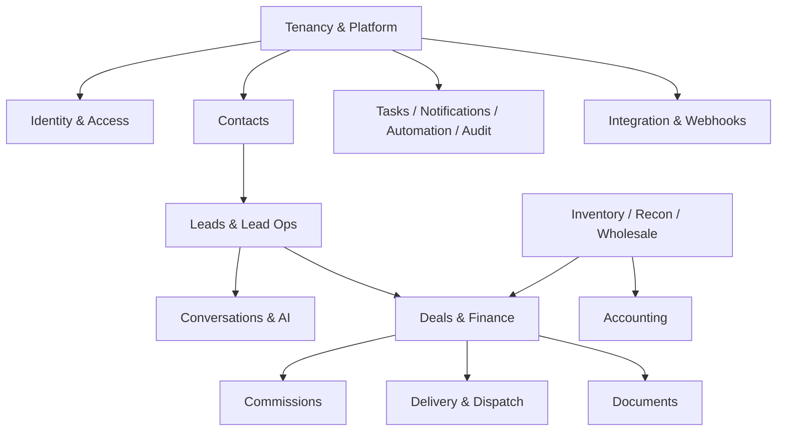

## 2. Enum Catalog

All vocabularies live once in `packages/schemas` (Zod, ADR-016) and are mirrored as `TEXT + CHECK` constraints by `packages/db` codegen. The canonical sets (legacy drift resolved — see notes):

| Entity.field | Values | Notes |
|---|---|---|
| `deals.pipeline_stage` | `new, submitted, approved, signed, sourcing, pending_delivery, scheduled, delivered, complete, lost` | The canonical 10-stage vocabulary (`client/src/lib/pipeline.js` `PIPELINE_STAGES`; see `deals-pipeline.md` §2); **target adds the missing DB CHECK** over all 10 values |
| `deals.funding_status` | `not_submitted, submitted, stips_required, funded` | Canonical 4-value set (`FundingStatus` in `packages/schemas` — `backend-stack.md` §6, `deals-pipeline.md` §3); CHECK added. Absorbs legacy `finance_status` and drifted spec values: `pending→not_submitted`, `approved→submitted` (approved-not-funded stays on the funding desk), `conditional→stips_required`, `funded→funded`. Per-lender `approved`/`conditional`/`declined` outcomes live on `deal_submissions.status` (below), never on the deal |
| `deals.sale_type` | `retail, wholesale` | As-is |
| `deals.licensing_province` | `ontario, quebec, other` | As-is |
| `deals.clawback_status` | `none, flagged, reversed` | As-is |
| `deal_parties.role` | `buyer, cosigner` | As-is |
| `leads.status` | `new, chatbot_engaged, assigned, contacted, qualified, converted, unresponsive, nurture, expired, lost` | 10-state lifecycle, as-is |
| `leads.source` | `fluent_form, meta_lead_form, manual, chatbot, website, walk_in, phone, web, referral, repeat, instagram, google_ads, facebook, autotrader, cargurus, kijiji, marketplace, oem, service, appointment_promotion, other` | Resolves the drift between the DB CHECK (5 values), route `VALID_SOURCES` (18), and seeds (`facebook`, `google_ads`); `kia_oem→oem` (white-label, ADR-018) |
| `leads.nurture_drip_status` | `none, active, paused, opted_out, expired` | As-is |
| `lead_duplicates.status` / `.match_type` | `pending, merged, dismissed` / `phone, email, name, phone_email, phone_name, email_name, phone_email_name` | As-is |
| `appointments.type` | `test_drive, showroom_visit, follow_up, phone_call` | As-is |
| `appointments.status` | `scheduled, confirmed, showed, no_show, rescheduled, cancelled` | Resolves DB (`completed`) vs route (`showed, rescheduled`) drift; `completed` migrates to `showed` |
| `conversations.status` | `bot_active, handed_off, agent_active, closed` | As-is |
| `conversations.channel` | `sms, web, whatsapp, voice` | `voice` **NEW** (ADR-020/022) |
| `messages.sender_type` | `client, bot, agent, system` | `system` **NEW** (disclosure/compliance turns) |
| `communications.type` / `.direction` | `call, sms, email, visit, note` / `inbound, outbound` | As-is from `lead_communications` |
| `tasks.priority` / `.type` / `.status` / `.recurring_interval` | `low, medium, high, urgent` / `call, email, meeting, follow_up, delivery, other` / `pending, in_progress, completed, cancelled` / `daily, weekly, biweekly, monthly` | As-is |
| `notifications.urgency` | `low, medium, high` | As-is |
| `inventory.vehicle_type` | `new, used` | As-is |
| `inventory.acquisition_type` | `auction, dealer_trade, trade_in, internal_wholesale, consignment, lease_return, factory_order` | Last two **NEW** (seed data used them; DB CHECK didn't) |
| `inventory.location_status` | `at_source, in_transit, on_lot, at_garage, delivered, wholesale` | As-is |
| `inventory.safety_status` | `not_required, not_started, sent_to_garage, in_progress, passed, failed` | As-is |
| `inventory.recon_status` | `not_needed, needs_assessment, assessed, recon_approved, in_progress, complete` | As-is |
| `inventory.availability_status` | `available, reserved, sold_pending, delivered, wholesale` | *(was `inventory.deal_status`)* — renamed to stop colliding with deal vocabulary |
| `work_orders.type` / `.status` / `.safety_result` | `safety_inspection, mechanical, body_work, detailing, general_maintenance` / `draft, sent, received, in_progress, completed, invoiced` / `passed, failed` | As-is |
| `deal_submissions.status` | `submitted, approved, declined, conditional, funded` | As-is |
| `wholesale_listings.result` | `pending, sold, no_sale, withdrawn` | As-is |
| `expenses.status` / `.payment_method` | `pending, approved, paid, rejected, void` / `cash, cheque, etransfer, credit, ap` | As-is |
| `dispatch_assignments.status` | `pending, assigned, departed, arrived, completed, cancelled` | **Merges** legacy dual fields `status` + `dispatch_status` |
| `documents.category` | `bill_of_sale, credit_app, insurance, registration, trade_docs, safety_cert, financing, id_verification, funding_proof, payment_proof, other` | Two **NEW** values absorb `upload.js` categories |
| `message_templates.type` | `email, sms` | As-is |
| `workflow_sequences.trigger_on` | `lead_status_change, lead_created, lead_assigned, deal_created, no_response` | As-is |
| `workflow_steps.action_type` | `email, sms, call_reminder, task, notification, wait` | As-is |
| `workflow_enrollments.status` | `active, completed, cancelled, failed` | As-is |
| `automation_rules.trigger_event` / `.action_type` | `deal_stage_changed, task_overdue, vehicle_aging, safety_overdue, funding_overdue` / `notify, email, create_task` | As-is |
| `contacts.source` | `walk_in, phone, web, referral, repeat, other` | As-is |
| Platform roles | `owner, gm, sales_manager, used_car_manager, fi_manager, salesperson, wholesale_manager, logistics, admin_office, bdc_agent` | 10 roles, as-is (ADR-006) |
| `consent_records.basis` | `express, implied_inquiry, implied_business_relationship` | **NEW** (ADR-022; CASL) |
| Language | `fr, en` — **`fr` default** everywhere a language column exists | ADR-019 |

## 3. Domain: Tenancy & Platform

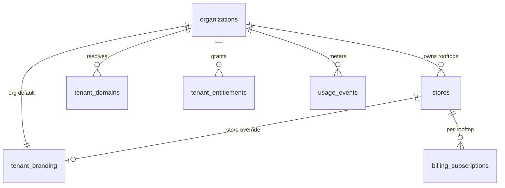

### organizations — **NEW** (the tenant)

Hierarchy: Platform → Organization (dealer group, e.g. "Hassan Group") → Store (rooftop). `tenant_id` on every business row references this table. Backed by the Better Auth organization plugin (ADR-006): Better Auth owns the core row; the platform columns are Better Auth "additional fields".

| Column | Type | Constraints / Notes |
|---|---|---|
| `id` | UUID PK | Better Auth organization id |
| `name` | TEXT NOT NULL | Display name |
| `slug` | TEXT UNIQUE NOT NULL | Subdomain segment: `{slug}.readyloans.app` (ADR-018) |
| `legal_name` | TEXT | Contracts/invoices |
| `default_locale` | TEXT NOT NULL DEFAULT `'fr'` CHECK (`fr`,`en`) | Bill 96: `fr` for Quebec tenants (ADR-019) |
| `timezone` | TEXT NOT NULL DEFAULT `'America/Toronto'` | IANA name; render-time conversion |
| `country` / `province` | TEXT NOT NULL DEFAULT `'CA'` / TEXT | Drives tax profile defaults |
| `status` | TEXT NOT NULL DEFAULT `'active'` CHECK (`active`,`trial`,`past_due`,`read_only`,`suspended`,`offboarding`,`purged`) | Full lifecycle state machine in [multi-tenancy.md §8](../03-architecture/multi-tenancy.md): `active → past_due → read_only → suspended → offboarding → purged`. Dunning degrades to `read_only`, never deletion (ADR-024) |
| `stripe_customer_id` | TEXT UNIQUE | ADR-024 |
| `settings` | JSONB NOT NULL DEFAULT `'{}'` | Non-relational org prefs |
| `created_at` / `updated_at` | TIMESTAMPTZ | No `deleted_at` — orgs are suspended, not deleted |

### stores — evolved from legacy `stores` (F-004)

The rooftop. Legacy columns kept as-is; the single blended `tax_rate` is decomposed into split rates that the desking engine consumes (ADR-009).

| Column | Type | Constraints / Notes |
|---|---|---|
| `tenant_id` | UUID NOT NULL FK organizations | **NEW** |
| `name` | TEXT NOT NULL | e.g. "Kia Mont-Laurier" |
| `code` | TEXT NOT NULL | e.g. `KIA-ML`, `READY-AUTO`; **UNIQUE (tenant_id, code)** *(was globally UNIQUE)* |
| `province` | TEXT NOT NULL DEFAULT `'QC'` | Drives safety-cert routing (QC vs ON) |
| `gst_rate` | DECIMAL(6,5) NOT NULL DEFAULT `0.05000` | **NEW** *(split from `tax_rate`)* |
| `qst_rate` | DECIMAL(6,5) NOT NULL DEFAULT `0.09975` | **NEW** |
| `pst_rate` / `hst_rate` | DECIMAL(6,5) NOT NULL DEFAULT `0` | **NEW** — non-QC rooftops |
| `tax_rate` | DECIMAL(6,4) | Legacy blended `0.14975` — retained read-only during migration, **DROPPED at contract phase** |
| `address` / `city` / `postal_code` / `phone` / `email` | TEXT | As-is |
| `hours` | JSONB | `{ "mon": "8:00-17:00", … }` — feeds quiet-hours + AI availability |
| `holiday_calendar` | JSONB | Array of ISO dates |
| `aging_threshold_days` | INTEGER NOT NULL DEFAULT 60 | Inventory aging alerts |
| `safety_overdue_days` | INTEGER NOT NULL DEFAULT 14 | Safety SLA |
| `funding_overdue_days` | INTEGER NOT NULL DEFAULT 7 | Funding SLA |
| `bill_of_sale_system` | TEXT DEFAULT `'CAMS'` CHECK (`CAMS`,`Merlin`,`Other`) | As-is |
| `esign_platform` | TEXT | As-is |
| `twilio_number` | TEXT | **NEW** — per-store SMS/voice number (ADR-020), E.164 |
| `deleted_at` | TIMESTAMPTZ | **NEW** |

### tenant_branding — **NEW** (ADR-018)

One row per org, optional per-store override (`store_id NULL` = org default). Resolution: custom domain → subdomain → login org context.

| Column | Type | Notes |
|---|---|---|
| `tenant_id` / `store_id` | UUID NOT NULL / UUID NULL | UNIQUE (tenant_id, store_id) |
| `logo_url` / `logo_dark_url` / `favicon_url` / `email_logo_url` | TEXT | S3 object keys under the tenant prefix (ADR-013) |
| `primary_color` / `accent_color` | TEXT NOT NULL | OKLCH strings, e.g. `oklch(0.55 0.15 250)` |
| `semantic_colors` | JSONB | success/warning/danger overrides |
| `dark_overrides` | JSONB | Manual overrides on the derived dark palette |
| `font_family` / `font_url` | TEXT | Self-hosted WOFF2 |
| `radius` / `density` | TEXT | Token presets |
| `legal_name` / `support_email` / `support_phone` | TEXT | Feeds emails/PDFs (server-side branding path) |
| `ai_persona_name` | TEXT | Tenant-parameterized AI identity (ADR-022) |
| `wcag_validated_at` | TIMESTAMPTZ | Set by the AA auto-validation pass |

### tenant_domains — **NEW** (ADR-014/018)

| Column | Type | Notes |
|---|---|---|
| `tenant_id` | UUID NOT NULL | |
| `domain` | TEXT UNIQUE NOT NULL | e.g. `crm.readycar.ca` |
| `kind` | TEXT NOT NULL CHECK (`custom`,`subdomain`) | |
| `verified_at` / `cert_issued_at` | TIMESTAMPTZ | ACM-managed cert lifecycle (DNS-validated, attached to the CloudFront distribution — ADR-014) |

### billing_subscriptions / tenant_entitlements / usage_events — **NEW** (ADR-024)

| Table | Columns |
|---|---|
| `billing_subscriptions` | `tenant_id`, `store_id` (per-rooftop subscription), `stripe_subscription_id TEXT UNIQUE`, `tier TEXT CHECK ('core','growth','scale','enterprise')` ($300–$800/mo wedge; matches `organizations.plan_tier`), `status TEXT CHECK ('trialing','active','past_due','canceled','read_only')`, `current_period_end TIMESTAMPTZ`, timestamps |
| `tenant_entitlements` | `tenant_id`, `key TEXT` (e.g. `seats`, `stores`, `ai_minutes_month`, `sms_segments_month`, `feature.wholesale`), `value JSONB`, `source TEXT CHECK ('plan','addon','manual')`, UNIQUE (tenant_id, key). Cached in Valkey (ADR-010); rate limiter reads the same quotas (ADR-011) |
| `usage_events` (append-only, partition candidate) | `tenant_id`, `store_id`, `meter TEXT CHECK ('ai_voice_minutes','sms_segments','ai_conversations')`, `quantity INTEGER NOT NULL`, `occurred_at TIMESTAMPTZ NOT NULL`, `stripe_reported_at TIMESTAMPTZ`, `idempotency_key TEXT UNIQUE` |

## 4. Domain: Identity & Access

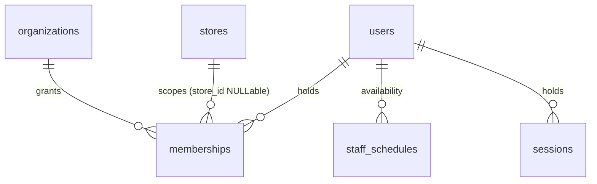

**Better Auth (ADR-006) owns and generates**: `users` (core identity), `sessions` (rotating, DB-backed → per-tenant revocation), `accounts` (credential/OAuth), `verifications`, `organizations`+`memberships` (organization plugin: orgs, members, invitations), `two_factor` (TOTP — required for owner/gm/admin_office). These live in our Postgres, migrated by Better Auth's CLI within the same `packages/db` pipeline. Platform-specific columns are Better Auth "additional fields" — including `store_id` and `roles[]` on `memberships`: there is **one** membership table, `(user, organization, store, roles[])`, exactly as modeled in [multi-tenancy.md §3](../03-architecture/multi-tenancy.md) and [authentication-authorization.md §3](../04-security/authentication-authorization.md); no separate store-membership table exists.

### users — evolved from legacy `users` (20260406_auth_rbac)

| Column | Type | Constraints / Notes |
|---|---|---|
| `id` | UUID PK | Better Auth user id *(absorbs legacy `auth_id` linkage — legacy `users.auth_id` DROPPED)* |
| `name` | TEXT NOT NULL | As-is |
| `email` | TEXT UNIQUE NOT NULL | As-is (citext-equivalent lowercase normalization in app) |
| `email_verified` | BOOLEAN NOT NULL DEFAULT false | Better Auth |
| `language_pref` | TEXT NOT NULL DEFAULT `'fr'` CHECK (`en`,`fr`) | *(was DEFAULT `'en'` — flipped per ADR-019)* |
| `image` | TEXT | Better Auth avatar |
| `default_store_id` | UUID FK stores | **NEW** *(replaces single `users.store_id` — actual access via `memberships`)* |
| `deleted_at` | TIMESTAMPTZ | As-is |

**DROPPED:** `users.role` single-column role (moved to `memberships.roles[]`), `users.store_id` (moved to `memberships.store_id`), and the entire legacy `salespeople` table — salespeople become `users` with the `salesperson` role; their pay plans move to `commission_plans` (§9). The legacy `POST /users/login` passwordless flow and localStorage `kia_user` die with this schema (ADR-006).

### memberships — Better Auth organization plugin + platform additional fields (ADR-006 "memberships = (user, org, store, roles[])")

| Column | Type | Notes |
|---|---|---|
| `user_id` | UUID NOT NULL FK users | Better Auth member |
| `tenant_id` | UUID NOT NULL FK organizations | Better Auth organization id |
| `store_id` | UUID FK stores, NULLable | **Additional field** — `NULL` = org-wide membership (roles apply to every store in the org; typical for `owner`/`gm`/`admin_office`) |
| `roles` | TEXT[] NOT NULL | **Additional field** — additive multi-role from the 10-role catalog (§2); CHECK via trigger against the `packages/schemas` list |
| `status` | TEXT NOT NULL DEFAULT `'active'` CHECK (`invited`,`active`,`revoked`) | Deactivation without membership loss |
| `invited_by` | UUID FK users | |
| `created_at` / `revoked_at` | TIMESTAMPTZ | Role changes audited to `activity_events` |

`UNIQUE (user_id, tenant_id, store_id) NULLS NOT DISTINCT` (Postgres 16 — at most one org-wide row per user per org). Composite indexes `(tenant_id, user_id)` and `(user_id, status)` per [multi-tenancy.md §3](../03-architecture/multi-tenancy.md); RLS reads it via `app.shares_org_with()` ([indexing-and-rls.md §4](./indexing-and-rls.md)). The plugin's coarse member `role` (`owner`/`admin`/`member`) is derived by hook from `roles[]` (`owner`→owner; `gm`,`admin_office`→admin; others→member) for Better Auth's own invitation checks — platform authorization reads **only** `roles[]` (authentication-authorization.md §5–6).

### staff_schedules — as-is + tenancy (lead-routing availability)

| Column | Type | Notes |
|---|---|---|
| `tenant_id` / `store_id` | UUID NOT NULL | **NEW** (legacy had neither) |
| `user_id` | UUID NOT NULL FK users CASCADE | As-is |
| `day_of_week` | INTEGER NOT NULL CHECK 0–6 | As-is |
| `start_time` / `end_time` | TIME NOT NULL | As-is; interpreted in store timezone |
| `active` | BOOLEAN DEFAULT true | As-is |

Live availability is Socket.IO presence — connection state + heartbeats backed by Valkey (ADR-004) — not a table; `staff_schedules` is the planned-hours baseline the router combines with presence.

## 5. Domain: CRM — Contacts

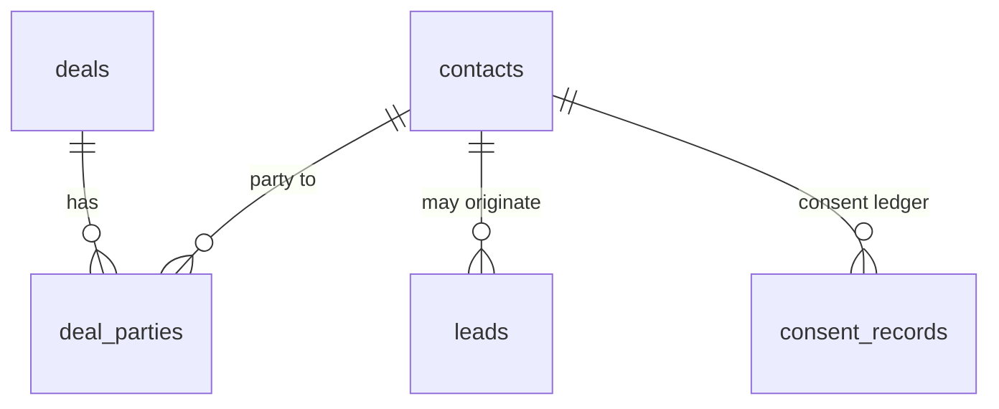

### contacts — evolved from F-003 `contacts`

| Column | Type | Constraints / Notes |
|---|---|---|
| `tenant_id` | UUID NOT NULL | **NEW**; `store_id` NOT NULL (was nullable) |
| `first_name` / `last_name` | TEXT NOT NULL | As-is |
| `email` / `phone` | TEXT | As-is |
| `phone_normalized` | TEXT | Digits-only, maintained by the existing BEFORE trigger (`regexp_replace(phone,'[^0-9]','','g')`) — kept |
| `address` / `city` / `province` / `postal_code` | TEXT | As-is |
| `driver_license_enc` | TEXT | *(was plaintext `driver_license`)* — AES-256-GCM envelope (ADR-015) |
| `driver_license_hmac` | TEXT | **NEW** blind index for equality lookup |
| `date_of_birth_enc` | TEXT | *(was `date_of_birth DATE`)* — encrypted (ADR-015) |
| `employer` | TEXT | As-is |
| `preferred_language` | TEXT NOT NULL DEFAULT `'fr'` CHECK (`en`,`fr`) | As-is (French default — Bill 96) |
| `marketing_consent` | BOOLEAN DEFAULT false | As-is; **authoritative record is `consent_records`** (§7) — this is a cached flag |
| `consent_date` | TIMESTAMPTZ | As-is (set iff consent true — existing rule kept) |
| `source` | TEXT CHECK (§2) | As-is |
| `customer_since` | TIMESTAMPTZ DEFAULT now() | As-is |
| `lifetime_deals` | INTEGER DEFAULT 0 | As-is (maintained by deal-complete handler) |
| `lifetime_value_cents` | INTEGER DEFAULT 0 | *(was `lifetime_value`)* |
| `search_vector` | TSVECTOR | As-is: weighted trigger — A: first+last name, B: email+phone+phone_normalized, C: city, D: employer; target config adds `unaccent` |
| `notes` | TEXT | As-is |

Duplicate handling as-is: create returns **409 with candidates** on phone (exact `phone_normalized`, ≥7 digits) or email match; `POST /contacts/force` bypasses. Kept as the target behavior, now tenant-scoped.

### deal_parties — as-is + tenancy

| Column | Type | Notes |
|---|---|---|
| `tenant_id` / `store_id` | UUID NOT NULL | **NEW** |
| `deal_id` | UUID NOT NULL FK deals CASCADE | As-is |
| `contact_id` | UUID NOT NULL FK contacts CASCADE | As-is |
| `role` | TEXT NOT NULL CHECK (`buyer`,`cosigner`) | As-is; UNIQUE (deal_id, contact_id, role) |

## 6. Domain: Leads & Lead Operations

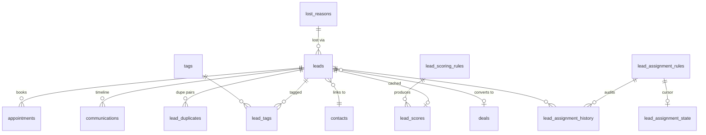

### leads — evolved from A-001 `leads` (+ 20260412 trade-in fields)

| Column | Type | Constraints / Notes |
|---|---|---|
| `tenant_id` / `store_id` | UUID NOT NULL | **NEW** / was nullable-with-first-store-default — the "first store row" fallback is deleted; intake resolves the store from the per-tenant endpoint (ADR-005) |
| `source` | TEXT NOT NULL CHECK (§2 canonical list) | Drift resolved |
| `source_platform` | TEXT CHECK (`google`,`meta`) | As-is |
| `source_campaign` / `source_url` | TEXT | As-is |
| `source_form_data` | JSONB | Raw payload, as-is; raw wire payload also lands in `intake_events` (§15) |
| `contact_id` | UUID FK contacts SET NULL | As-is |
| `first_name` / `last_name` / `email` | TEXT | As-is |
| `phone` | TEXT NOT NULL | As-is — the only required contact field |
| `preferred_language` | TEXT NOT NULL DEFAULT `'fr'` | As-is |
| `date_of_birth_enc` | TEXT | *(was `date_of_birth DATE`)* — encrypted (ADR-015) |
| `vehicle_interest` / `monthly_budget` / `current_vehicle` | TEXT | As-is (credit-app fields) |
| `employment_status` / `income_timeframe` / `job_title` / `address` / `address_length` | TEXT | As-is |
| `monthly_income_cents` / `monthly_housing_cents` | INTEGER | *(was `monthly_income`/`monthly_housing`)* — already cents, renamed; **encrypted at field level when tied to a credit app** (ADR-015) |
| `housing_status` | TEXT CHECK (`rent`,`own`) | As-is |
| `income_threshold` | BOOLEAN | As-is (Meta form) |
| `score` | INTEGER DEFAULT 0 | As-is (0–100 clamp); `score_factors` JSONB **DROPPED** — breakdown lives only in `lead_scores` (kills the duplicate scoring store) |
| `chatbot_engaged` / `chatbot_engaged_at` / `chatbot_summary` / `chatbot_handoff_at` | BOOL / TIMESTAMPTZ / TEXT / TIMESTAMPTZ | As-is |
| `status` | TEXT NOT NULL DEFAULT `'new'` CHECK (10 states, §2) | As-is |
| `assigned_to` | UUID FK users SET NULL | As-is; + `assigned_at`, `assignment_method`, `assignment_attempts INTEGER DEFAULT 0`, `previous_agents JSONB '[]'` |
| `contact_attempts` / `first_contacted_at` / `last_contacted_at` / `response_time_seconds` | INT / TS / TS / INT | As-is (speed-to-lead metric — first-class telemetry, ADR-025) |
| `converted_deal_id` / `converted_at` | UUID FK deals / TIMESTAMPTZ | As-is |
| `lost_reason_id` / `lost_reason_note` / `lost_at` | UUID FK lost_reasons / TEXT / TIMESTAMPTZ | As-is; free-text `lost_reason` **DROPPED** (merge flow now writes `lost_reason_id` for a seeded "Merged" reason) |
| `nurture_drip_status` | TEXT DEFAULT `'none'` CHECK (§2) | As-is + `nurture_started_at`, `nurture_expires_at` (90-day rule), `nurture_last_sent_at` |
| `is_duplicate` / `duplicate_of` | BOOLEAN / UUID FK leads | As-is |
| `has_trade_in` | BOOLEAN NOT NULL DEFAULT false | As-is (partial index) |
| `trade_in_year/make/model/trim/mileage/condition/vin/color/notes` | as legacy | As-is; `trade_in_value_cents` *(was `trade_in_value`)* |
| `notes` | TEXT | As-is |

Status auto-timestamp rules (documented as-is from `leads.js`, kept in `packages/core`): `assigned→assigned_at`, `contacted→first_contacted_at`, `converted→converted_at`, `lost→lost_at` (+ requires `lost_reason_id`), `nurture→nurture_started_at + drip active + expires now()+90d`; leaving `lost` clears the lost fields.

### tags / lead_tags — as-is + tenancy (fixes "global, no store scoping")

| Table | Columns |
|---|---|
| `tags` | `tenant_id` **NEW** (org-wide; `store_id` NULL allowed for store-local tags), `name VARCHAR(50) NOT NULL`, **UNIQUE (tenant_id, name)** *(was global UNIQUE)*, `color VARCHAR(7) DEFAULT '#3B82F6'` |
| `lead_tags` | `tenant_id` **NEW**, `lead_id FK CASCADE`, `tag_id FK CASCADE`, UNIQUE (lead_id, tag_id) |

### lost_reasons — as-is + tenancy

`tenant_id` **NEW**; `name TEXT NOT NULL`, `name_fr TEXT NOT NULL` *(was nullable — Bill 96 parity gate makes FR mandatory, ADR-019)*, `icon TEXT`, `display_order INTEGER DEFAULT 0`, `is_active BOOLEAN DEFAULT true`, `store_id` nullable. UNIQUE (tenant_id, name). The 9 seeded EN/FR reasons become the tenant-provisioning template ([migrations-operations.md §6](./migrations-operations.md)).

### lead_duplicates — as-is + tenancy

`tenant_id`/`store_id` **NEW NOT NULL**; `lead_id`/`duplicate_of` FKs CASCADE (newer = `lead_id`, older = canonical — existing direction rule kept), `match_type` CHECK (§2), `confidence INTEGER NOT NULL DEFAULT 100` (100 phone/email, 90 name-only — as-is), `status` CHECK (`pending`,`merged`,`dismissed`), `merged_by`/`merged_at`, `resolved_by`/`resolved_at`, UNIQUE (lead_id, duplicate_of). The hardcoded store UUID `4edcf6fb-…` in the full-scan endpoint is replaced by the request's tenant context.

### lead_scoring_rules / lead_scores — as-is + tenancy

| Table | Columns / Notes |
|---|---|
| `lead_scoring_rules` | `tenant_id` **NEW NOT NULL**, `store_id` nullable (**NULL = org-global rule; store rules override-supplement — the existing "global + store" read pattern is kept as the platform template**), `name`, `description`, `field` (virtual fields: `budget, source, status, has_trade_in, has_phone, has_email, vehicle_interest, tags, assigned_to, created_days_ago` + direct columns), `operator` CHECK (12 operators: `gt,gte,lt,lte,eq,neq,contains,not_contains,exists,not_exists,in,not_in`), `value TEXT`, `score INTEGER NOT NULL` (may be negative), `is_active`, `priority INTEGER DEFAULT 0` |
| `lead_scores` | `tenant_id` **NEW**, `lead_id UNIQUE FK CASCADE`, `score INTEGER DEFAULT 0`, `breakdown JSONB '[]'`, `scored_at TIMESTAMPTZ` — the single scoring cache (leads.score is a mirror updated on recalc, as-is) |

Scoring algorithm as-is (documented from `scoringRules.js`, ported to `packages/core` with tests per ADR-026): base 0, sum of matching rule scores, **clamped [0,100]**, fallback 10 on rules-load error.

### lead_assignment_rules / lead_assignment_state / lead_assignment_history

| Table | Columns / Notes |
|---|---|
| `lead_assignment_rules` | `tenant_id` **NEW NOT NULL**, `store_id` nullable **NEW** (was entirely unscoped), `name`, `description`, `strategy` CHECK (`round_robin`,`load_balanced`,`source_based`), `active`, `priority INTEGER NOT NULL DEFAULT 1` (lower = higher priority, first match wins — as-is), `sources TEXT[] '{}'` (empty = catch-all), `included_users UUID[]`, `excluded_users UUID[]`, `source_mappings JSONB '{}'`, `max_leads_per_user INTEGER DEFAULT 0` (0 = unlimited; cap counts non-terminal statuses — terminal set as-is: `lost`,`converted`,`closed`) |
| `lead_assignment_state` | `rule_id UNIQUE FK CASCADE`, `last_assigned_index INTEGER NOT NULL DEFAULT -1` (round-robin cursor, as-is) |
| `lead_assignment_history` (append-only) | `tenant_id`/`store_id` **NEW**, `lead_id FK CASCADE`, `assigned_to FK users SET NULL`, `rule_id SET NULL`, `rule_name`, `strategy`, `lead_source` (denormalized snapshot), `assigned_at` |

Target: the same engine is invoked as the `route` step of the BullMQ lead-pipeline Flow (ADR-012), with presence + `staff_schedules` + `lead_distribution_config` tallies as additional inputs (ADR-022).

### lead_distribution_config — as-is + tenancy (multi-store ad-spend sharing)

`tenant_id` **NEW**; `store_id NOT NULL`, `platform` CHECK (`google`,`meta`), `contribution_amount_cents` *(was `contribution_amount`)*, `contribution_percentage DECIMAL(5,2)`, `month DATE NOT NULL`, `leads_received INTEGER DEFAULT 0`, `actual_percentage DECIMAL(5,2)`, UNIQUE (store_id, platform, month). Rule as-is: stores contribute ad budget; network leads distribute proportionally; `actual_percentage` tracks realized share — this is the cross-tenant AI-routing tally read via audited service functions (ADR-007).

### source_costs — as-is + tenancy + cents

`tenant_id` **NEW NOT NULL**; `source TEXT NOT NULL`, `month DATE NOT NULL` (first-of-month), `spend_cents INTEGER NOT NULL DEFAULT 0` *(was `spend DECIMAL(12,2)` dollars — converted)*, `notes`, `store_id` nullable, UNIQUE (source, month, store_id). Upsert-on-conflict semantics kept (one spend record per source/month/store).

### saved_filters — as-is + tenancy + ownership fix

`tenant_id` **NEW NOT NULL**; `name`, `filters JSONB NOT NULL`, `is_default`, `is_shared`, `created_by`, `store_id` nullable. Target behavior fix: list returns **own + `is_shared=true`** rows (the legacy endpoint returned everything); single-default-per-user rule kept (`POST /:id/set-default` unsets other defaults of the same `created_by`).

### message_templates — as-is + tenancy (white-label fix)

`tenant_id` **NEW NOT NULL** (was unscoped with Kia-branded seed content — a release blocker per ADR-018); `store_id` nullable; `name`, `type` CHECK (`email`,`sms`), `subject`, `body` with `{{merge_fields}}` (supported fields as-is: `first_name, last_name, email, phone, vehicle_interest, monthly_budget, current_vehicle, job_title, address, preferred_language, salesperson_name`), `body_fr` **NEW** (FR variant — Bill 96 parity), `category DEFAULT 'general'`, `is_default`. Seed templates ship de-branded as provisioning templates.

### appointments — as-is + tenancy + polymorphic attachment fix

| Column | Type | Notes |
|---|---|---|
| `tenant_id` / `store_id` | UUID NOT NULL | **NEW** (legacy had neither — flagged gap) |
| `lead_id` | UUID FK leads CASCADE | As-is |
| `contact_id` / `deal_id` / `vehicle_id` | UUID FKs SET NULL | **NEW as columns** (routes already read/write them; the migration adds the missing columns + FKs — `vehicle_id → inventory(id)`) |
| `assigned_to` | UUID FK users SET NULL | As-is |
| `type` | TEXT NOT NULL CHECK (§2) | As-is |
| `title` | TEXT NOT NULL; `description`, `location` TEXT | As-is |
| `start_time` / `end_time` | TIMESTAMPTZ NOT NULL, CHECK (`end_time > start_time`) | As-is |
| `status` | TEXT DEFAULT `'scheduled'` CHECK (§2 unified set) | Drift resolved |
| `reminder_sent` | BOOLEAN DEFAULT false | As-is |
| `deleted_at` | TIMESTAMPTZ | **NEW** (was hard-delete) |

Conflict rules as-is (ported to `packages/core`): salesperson overlap on `scheduled/confirmed`; vehicle overlap for `test_drive` excluding `cancelled/no_show/rescheduled`; create returns 409 with conflict lists unless `force`; the no-show/showed auto-task side effects move to the automation engine (§13) writing unified `tasks`.

## 7. Domain: Conversations, Communications & AI Compliance

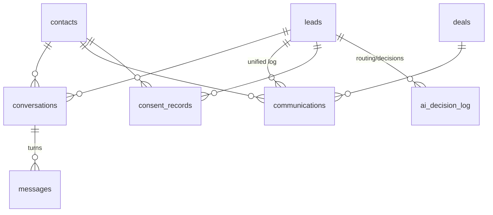

### conversations — evolved from A-002

| Column | Type | Notes |
|---|---|---|
| `tenant_id` | UUID NOT NULL | **NEW**; `store_id` NOT NULL (was nullable) |
| `lead_id` / `contact_id` | UUID FKs SET NULL | As-is |
| `channel` | TEXT NOT NULL DEFAULT `'sms'` CHECK (`sms`,`web`,`whatsapp`,`voice`) | `voice` **NEW** (ConversationRelay, ADR-020) |
| `phone_number` | TEXT | As-is (E.164 normalized) |
| `twilio_sid` | TEXT | As-is (conversation/call SID) |
| `status` | TEXT DEFAULT `'bot_active'` CHECK (`bot_active`,`handed_off`,`agent_active`,`closed`) | As-is |
| `language` | TEXT NOT NULL DEFAULT `'fr'` | *(was `'en'` — inconsistency fixed per ADR-019)* |
| `assigned_agent_id` | UUID FK users | As-is |
| `handed_off_at` / `closed_at` | TIMESTAMPTZ | As-is |
| `bot_summary` | TEXT | As-is (AI summary at handoff) |
| `bot_score` | INTEGER | As-is |
| `ai_disclosure_sent_at` | TIMESTAMPTZ | **NEW** — first-turn AI self-identification stamp (ADR-022, FR+EN) |

### messages — as-is + tenancy (append-only; partition candidate)

`tenant_id` **NEW**; `conversation_id NOT NULL FK CASCADE`, `sender_type` CHECK (`client`,`bot`,`agent`,`system`), `sender_id FK users` (null for client/bot), `body TEXT NOT NULL`, `media_url`, `twilio_sid`, `metadata JSONB` (intent, sentiment, model, token counts), `created_at`. `PRIMARY KEY (id, created_at)` for partition-readiness.

### communications — evolved from `lead_communications` (unified log; partition candidate)

The manual/system communications timeline, generalized from lead-only to polymorphic (fixes the flagged "lead-only" gap) and written by the send layer for every outbound email/SMS/call (ADR-020: all sends via BullMQ, logged, consent-checked).

| Column | Type | Notes |
|---|---|---|
| `tenant_id` / `store_id` | UUID NOT NULL | **NEW** (legacy had neither — flagged gap) |
| `lead_id` / `contact_id` / `deal_id` | UUID FKs SET NULL, CHECK (at least one NOT NULL) | *(was `lead_id NOT NULL` only)* |
| `type` | TEXT NOT NULL CHECK (`call`,`sms`,`email`,`visit`,`note`) | As-is |
| `direction` | TEXT CHECK (`inbound`,`outbound`) | As-is |
| `subject` / `body` | TEXT | As-is |
| `duration_seconds` | INTEGER | As-is (calls) |
| `provider_message_id` | TEXT | **NEW** — Resend/Twilio id for delivery correlation |
| `consent_record_id` | UUID FK consent_records | **NEW** — which consent basis authorized an outbound send |
| `metadata` | JSONB DEFAULT `'{}'` | As-is |

### consent_records — **NEW** (ADR-022 consent ledger; append-only)

| Column | Type | Notes |
|---|---|---|
| `tenant_id` / `store_id` | UUID NOT NULL | |
| `contact_id` / `lead_id` | UUID FKs SET NULL, CHECK (one NOT NULL) | |
| `channel` | TEXT NOT NULL CHECK (`email`,`sms`,`voice`,`voice_adad`) | `voice_adad` = express consent for automated outbound AI calls — hard gate (CRTC ADAD) |
| `basis` | TEXT NOT NULL CHECK (`express`,`implied_inquiry`,`implied_business_relationship`) | CASL |
| `source` | TEXT NOT NULL | e.g. `fluent_form`, `sms_reply_yes`, `signed_credit_app` |
| `evidence` | JSONB | Raw proof (message SID, form payload hash) |
| `captured_at` | TIMESTAMPTZ NOT NULL | |
| `expires_at` | TIMESTAMPTZ | implied_inquiry: +6 months; implied_business_relationship: +24 months; express: NULL |
| `revoked_at` / `revoke_reason` | TIMESTAMPTZ / TEXT | STOP, unsubscribe, manual |

### suppressions — **NEW** (STOP / DNC)

`tenant_id UUID NULL` (**NULL = platform-global STOP**, per ADR-022 "immediate global STOP"), `channel` CHECK (`sms`,`email`,`voice`,`all`), `identifier TEXT NOT NULL` (E.164 phone or lowercased email), `reason` CHECK (`stop_reply`,`unsubscribe`,`dncl`,`manual`,`bounce`), `created_at`. UNIQUE (COALESCE(tenant_id,'00000000-…'), channel, identifier). The send layer checks suppressions + consent + quiet hours before every dispatch.

### dncl_checks — **NEW** (append-only)

`phone TEXT NOT NULL`, `listed BOOLEAN NOT NULL`, `checked_at TIMESTAMPTZ NOT NULL`. Platform-level (no tenant_id — a number's DNCL status is global). Freshness rule: a check older than **31 days** is stale and must be re-verified before solicitation (ADR-022); refreshed by a BullMQ repeatable job.

### ai_decision_log — **NEW** (Law 25 s.12.1; append-only)

`tenant_id`/`store_id`, `lead_id FK`, `decision_type` CHECK (`routing`,`scoring`,`qualification`,`financing_significant`), `model TEXT` (e.g. `claude-opus-4-8`), `inputs_summary JSONB`, `output JSONB`, `requires_human_review BOOLEAN NOT NULL DEFAULT false` (always true for `financing_significant`), `reviewed_by FK users`, `reviewed_at`, `created_at`.

## 8. Domain: Deals & Finance Desk

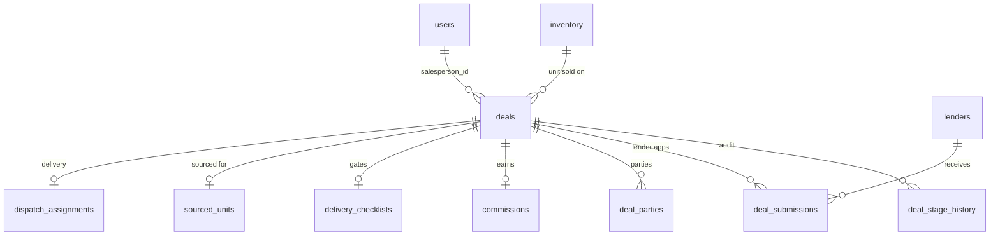

### deals — the core entity, evolved

Legacy duplicate state (`deal_status`, `finance_status`, `vehicle_status`, `is_sold`, `sold_type`) collapses into `pipeline_stage` + `funding_status` + inventory linkage per ADR-009; the migration mapping is in [migrations-operations.md §6](./migrations-operations.md).

| Column | Type | Constraints / Notes |
|---|---|---|
| `tenant_id` / `store_id` | UUID NOT NULL | **NEW** / was nullable |
| `contact_id` | UUID FK contacts SET NULL | As-is; buyer/cosigner authoritative in `deal_parties` |
| `salesperson_id` | UUID FK users SET NULL | **NEW** *(replaces `salesperson_name` TEXT — name-ILIKE matching banned, ADR-009)* |
| `created_by` | UUID FK users SET NULL | As-is |
| `pipeline_stage` | TEXT NOT NULL DEFAULT `'new'` CHECK (§2) | As-is + **CHECK added** |
| `stage_entered_at` | TIMESTAMPTZ NOT NULL DEFAULT now() | As-is (time-in-stage / deal-rotting metrics) |
| `funding_status` | TEXT NOT NULL DEFAULT `'not_submitted'` CHECK (§2) | As-is + CHECK; absorbs `finance_status` |
| `lost_reason_id` | UUID FK lost_reasons SET NULL | *(was free-text `lost_reason`)* — unified with the leads catalog; `lost_reason_detail TEXT`, `lost_at` as-is |
| **Vehicle** | | |
| `inventory_id` | UUID FK inventory SET NULL | **NEW** — the unit being sold; snapshot columns below persist the sold-state record |
| `stock_number` / `vin` / `year INTEGER` / `make` / `model` / `trim` **NEW** / `color` | TEXT/INT | As-is (snapshot) |
| `vehicle_source` | TEXT | As-is (legacy free text) |
| `sale_type` | TEXT CHECK (`retail`,`wholesale`) | As-is; `sold_type` **DROPPED** (was duplicate) |
| `listed_online` | BOOLEAN DEFAULT false | As-is |
| `is_sourced_unit` | BOOLEAN DEFAULT false | As-is |
| **Money (INTEGER cents)** | | |
| `sale_price_cents` | INTEGER NOT NULL DEFAULT 0 | *(was `sale_price`)* |
| `vehicle_cost_cents` | INTEGER NOT NULL DEFAULT 0 | *(was `vehicle_cost`)* |
| `fi_reserve_cents` | INTEGER NOT NULL DEFAULT 0 | *(was `fi_reserve`)* — F&I reserve income |
| `money_down_cents` / `money_down_collected BOOLEAN` | INTEGER / BOOL | *(was `money_down_amount`)* |
| `cash_back_cents` / `cash_back_sent BOOLEAN` | INTEGER / BOOL | *(was `cash_back_amount`)* |
| `gst_cents` / `qst_cents` / `pst_cents` / `hst_cents` | INTEGER NOT NULL DEFAULT 0 | **NEW** — written by the desking engine (`packages/core`), never recomputed from a blended rate (ADR-009) |
| `fees` | JSONB DEFAULT `'[]'` | **NEW** — desking fee lines `[{code,label,amount_cents,taxable}]` |
| `total_price_cents` | INTEGER NOT NULL DEFAULT 0 | **NEW** — desking engine output (bill-of-sale total) |
| `tax_exempt_basis` | TEXT NULL CHECK (`indigenous_status`) | *(evolves `native_status BOOLEAN` — Indigenous tax-status exemption now linked to actual tax logic)* |
| `accessories` | TEXT | As-is |
| **Trade-in** | | |
| `has_trade_in` BOOLEAN, `trade_year INTEGER`, `trade_make/model/color/plate/vin/stock_number` TEXT | | As-is |
| `trade_value_cents` | INTEGER DEFAULT 0 | **NEW** — trade allowance for tax credit math (QC/ON trade-in tax treatment) |
| `has_lien` BOOLEAN, `lien_bank` TEXT, `lien_cents` INTEGER | | *(was `lien_amount`)* |
| **Delivery** | | |
| `tentative_delivery_date` | DATE | As-is (indexed) |
| `delivery_date` / `driver_booked_date` | TIMESTAMPTZ | As-is |
| `pickup_location` / `delivery_address` | TEXT | As-is; `chaser_vehicle_info` **DROPPED** (dispatch_assignments authoritative) |
| `licensing_province` | TEXT CHECK (`ontario`,`quebec`,`other`) | As-is |
| `licensing_completed` / `photos_taken` / `wet_ink_signed` / `idv_completed` | BOOLEAN DEFAULT false | As-is (delivery gates) |
| `delivered_at` / `delivery_confirmed_by` | TIMESTAMPTZ / UUID FK users | As-is |
| **Funding** | | |
| `funded_at` / `funding_confirmed_by` | TIMESTAMPTZ / UUID FK users | As-is |
| `funding_proof_url` / `funding_proof_uploaded_at` / `funding_submitted_to_bank_at` / `funding_docs_sent_at` | TEXT / TIMESTAMPTZ ×3 | As-is (M-007/M-008); `financing_bank` TEXT **DROPPED** (lenders/deal_submissions authoritative) |
| `clawback_status` | TEXT DEFAULT `'none'` CHECK (§2) | As-is |

**DROPPED after data migration** (mapping in migrations doc): `deal_status`, `finance_status`, `vehicle_status`, `is_sold`, `sold_type`, `salesperson_name`, `customer_name`, `customer_address`, `customer_phone`, `has_cosigner`, `cosigner_name`, `financing_bank`, `chaser_vehicle_info`, `lost_reason` (text), `native_status`. Customer identity reads resolve through `deal_parties → contacts` (the legacy `sync-customer` bridge endpoint dies).

### deal_stage_history — as-is + tenancy (append-only)

`tenant_id`/`store_id` **NEW**; `deal_id NOT NULL FK CASCADE`, `from_stage`, `to_stage NOT NULL`, `changed_by FK users`, `changed_at DEFAULT now()`, `note`.

### lenders — as-is + tenancy

`tenant_id` **NEW NOT NULL**; `store_id` nullable (org-wide lender panel); `name NOT NULL`, `contact_name/email/phone`, `rate_sheet_url`, `avg_turnaround_days INTEGER DEFAULT 3`, `approval_criteria TEXT`, `active BOOLEAN DEFAULT true`, `deleted_at` **NEW**. Target adds the missing update/deactivate endpoints (flagged gap).

### deal_submissions — as-is + tenancy (multi-lender shopping)

`tenant_id`/`store_id` **NEW**; `deal_id NOT NULL FK CASCADE`, `lender_id NOT NULL FK lenders`, `status` CHECK (§2), `rate DECIMAL(5,2)` (% APR — stays decimal), `term INTEGER` (months), `monthly_payment_cents` *(was `monthly_payment`)*, `conditions TEXT`, `submitted_at DEFAULT now()`, `responded_at`, `funded_at`, `notes`. Status side effects as-is: `approved/declined/conditional → responded_at`, `funded → funded_at`; target adds: a submission reaching `funded` advances `deals.funding_status='funded'` + `funded_at` through the pipeline engine.

## 9. Domain: Commissions

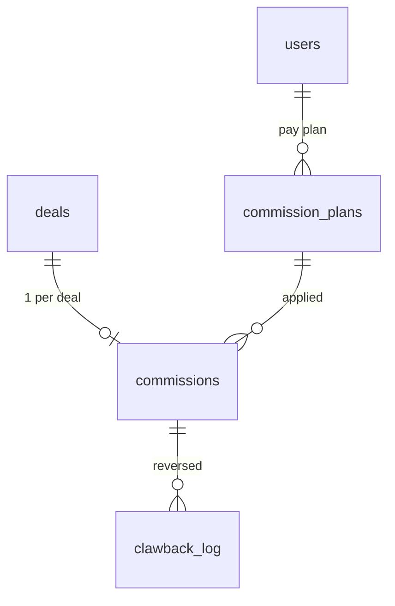

### commission_plans — **NEW** (replaces `salespeople`)

The legacy `salespeople` registry (name-keyed, unlinked to `users`) is retired; each plan row belongs to a real user. Historical plans are preserved via effective dating.

| Column | Type | Notes |
|---|---|---|
| `tenant_id` / `store_id` | UUID NOT NULL | |
| `user_id` | UUID NOT NULL FK users | *(was `salespeople.name`)* |
| `commission_rate` | DECIMAL(5,4) NOT NULL DEFAULT 0 | Fraction (0.3000 = 30%) — as-is semantics |
| `has_pad` | BOOLEAN NOT NULL DEFAULT true | As-is |
| `pad_cents` | INTEGER NOT NULL DEFAULT 150000 | *(was `pad_amount NUMERIC` **dollars** 1500 — converted ×100; fixes the $1,500-pad-as-$15 bug class)* |
| `has_tiered_rate` | BOOLEAN NOT NULL DEFAULT false | As-is |
| `tier_threshold_cents` | INTEGER | *(was `tier_threshold` dollars — e.g. 6,000,000 = $60,000 monthly gross)* |
| `tier_rate` | DECIMAL(5,4) | As-is semantics (tier rate applies to the whole deal once monthly gross exceeds threshold — documented as-is; see formula below) |
| `override_on_user_id` | UUID FK users | *(was `override_on` name string)* — this plan's owner earns an override on that user's deals |
| `override_rate` | DECIMAL(5,4) | As-is (e.g. 0.05) |
| `active` | BOOLEAN NOT NULL DEFAULT true | As-is |
| `effective_from` / `effective_to` | DATE NOT NULL / DATE NULL | **NEW** — plan history; the plan in force at `deals.funded_at` governs |

Commission formula, documented as-is from `deals.js` (ported to `packages/core` with ≥90% test coverage, ADR-023; known defects fixed as noted):

```
grossProfit          = sale_price_cents − vehicle_cost_cents
totalGross           = grossProfit + fi_reserve_cents          // ≤ 0 → no commission
grossForCommission   = totalGross − (has_pad ? pad_cents : 0)  // ≤ 0 → no commission
rate                 = commission_rate
                       // tier: if has_tiered_rate AND month-to-date gross (Σ over the
                       // salesperson's deals funded this calendar month, pre-pad,
                       // incl. this deal) > tier_threshold_cents → rate = tier_rate
commission_cents     = round(grossForCommission × rate)
override_cents       = round(grossForCommission × override_rate)   // one row per overrider
```

Target fixes (marked **Target**, legacy behavior noted): tier window keys on **`funded_at`** over the full last day of the month (legacy used `created_at` with a month-end-at-midnight bug); overrides fire for **every** plan whose `override_on_user_id` matches the seller (legacy required the seller to have their own override config and kept only the last overrider). Trigger condition as-is: recompute when `funding_status='funded'` or `pipeline_stage='complete'`.

### commissions — as-is + tenancy + cents + FKs

| Column | Type | Notes |
|---|---|---|
| `tenant_id` / `store_id` | UUID NOT NULL | |
| `deal_id` | UUID NOT NULL FK deals CASCADE, **UNIQUE** | 1 row per deal, upsert semantics — as-is |
| `salesperson_id` | UUID NOT NULL FK users | *(was `salesperson_name`)* |
| `plan_id` | UUID FK commission_plans | **NEW** — audit which plan version applied |
| `commission_rate` | DECIMAL(5,4) NOT NULL | Final rate used (post-tier) — as-is |
| `pad_cents` | INTEGER NOT NULL DEFAULT 0 | *(was `pad_amount` NUMERIC dollars — the missing F-007 conversion, done)* |
| `gross_for_commission_cents` | INTEGER NOT NULL DEFAULT 0 | *(was `gross_for_commission`)* |
| `commission_cents` | INTEGER NOT NULL DEFAULT 0 | *(was `commission_amount`; also fixes the `amount` vs `commission_amount` field-name mismatch that zeroed clawback totals)* |
| `override_user_id` | UUID FK users | *(was `override_salesperson` name)* |
| `override_cents` | INTEGER NOT NULL DEFAULT 0 | *(was `override_amount`)* |
| `calculated_at` | TIMESTAMPTZ | **NEW** |

### clawback_log — as-is + tenancy + real FK (append-only)

`tenant_id`/`store_id` **NEW**; `deal_id NOT NULL FK CASCADE`, `commission_id UUID FK commissions` *(FK was missing)*, `salesperson_id FK users` *(was name)*, `original_cents INTEGER NOT NULL DEFAULT 0` *(was `original_amount`)*, `reversed_cents` *(was `reversed_amount`)*, `reason TEXT NOT NULL`, `initiated_by FK users SET NULL`. Lifecycle as-is: deal `clawback_status` `none → flagged → reversed`; confirm transitions only from `flagged` (guarded eq-update kept); reversal remains flag + log, never a silent mutation of `commissions`.

## 10. Domain: Inventory, Recon & Wholesale

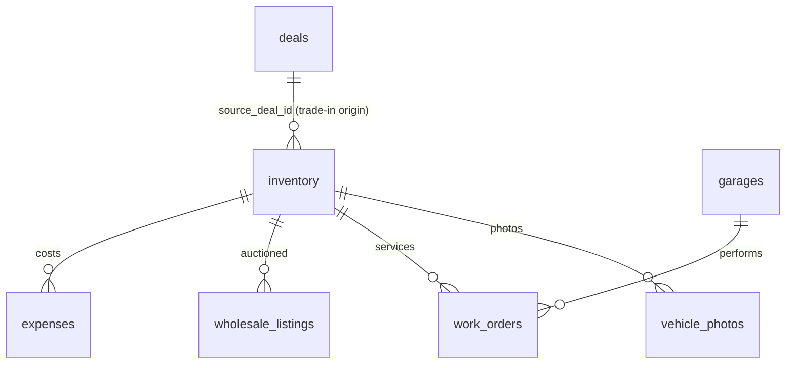

### inventory — as-is + tenancy (M-002)

| Column group | Columns (as-is unless noted) |
|---|---|
| Tenancy | `tenant_id` **NEW NOT NULL**; `store_id NOT NULL` (as-is) |
| Identification | `vin`, `stock_number NOT NULL`, `year INTEGER NOT NULL`, `make NOT NULL`, `model NOT NULL`, `trim`, `body_type`, `engine`, `drive_type`, `fuel_type`, `doors INTEGER`, `exterior_color`, `interior_color`, `mileage INTEGER`, `country_of_origin`; **NEW** UNIQUE (store_id, stock_number) WHERE deleted_at IS NULL |
| Classification | `vehicle_type DEFAULT 'used'` CHECK; `acquisition_type NOT NULL` CHECK (§2, +`lease_return`,`factory_order`); `acquisition_date DATE NOT NULL DEFAULT CURRENT_DATE` |
| Costs (cents) | `acquisition_cost_cents NOT NULL DEFAULT 0`, `transport_cost_cents DEFAULT 0`, `recon_cost_cents DEFAULT 0`, `list_price_cents NULL` *(all renamed with `_cents`; already cents)* |
| Location | `location_status DEFAULT 'on_lot'` CHECK (§2); `location_details TEXT` |
| Safety | `safety_status DEFAULT 'not_started'` CHECK (§2); `safety_sent_at`, `safety_completed_at`, `safety_province` CHECK (`ontario`,`quebec`) **(CHECK added — was free text)**, `safety_notes` |
| Recon | `recon_status DEFAULT 'needs_assessment'` CHECK (§2); `recon_items JSONB '[]'`; `recon_estimated_total_cents`; approval gate: `recon_approval_required BOOLEAN DEFAULT false`, `recon_approved_by FK users`, `recon_approved_at` |
| Photos | `photo_count INTEGER DEFAULT 0`, `photo_complete BOOLEAN`, per-angle flags `photos_front/back/driver_side/passenger_side/interior/odometer` (the 6 required angles, ADR-013) |
| Deal linkage | `deal_id FK deals` (selling deal), `availability_status DEFAULT 'available'` CHECK (§2) *(was `deal_status`)*, `source_deal_id FK deals` (originating deal, e.g. trade-in) |
| Aging | `lot_arrival_date DATE` — as-is; `days_on_lot` **DROPPED** (volatile denormalization; computed in queries — ADR-009). The legacy bug where the `location_status` default bypassed `lot_arrival_date` stamping is fixed in `packages/core` (set whenever effective status is `on_lot`) |

### vehicle_photos — as-is + tenancy

`tenant_id`/`store_id` **NEW**; `inventory_id NOT NULL FK CASCADE`, `angle_type` CHECK (`front`,`back`,`driver_side`,`passenger_side`,`interior`,`odometer`,`additional`), `storage_path NOT NULL` (per-tenant prefix `tenant/{id}/…`, ADR-013), `file_name`, `blurhash TEXT` **NEW**, `uploaded_by FK users`.

### garages — as-is + tenancy

`tenant_id` **NEW NOT NULL**; `store_id NOT NULL` (as-is); `name NOT NULL`, `email`, `phone`, `contact_name`, `address`, `province`, `services JSONB '[]'` (`safety_inspection`,`mechanical`,`body_work`,`detailing`), `does_ontario_safety BOOLEAN DEFAULT false`, `does_quebec_safety BOOLEAN DEFAULT false` (province-capability routing rule — as-is), `is_internal BOOLEAN DEFAULT false`, `standard_rates JSONB '{}'`, `avg_turnaround_days INTEGER DEFAULT 3`, `active BOOLEAN DEFAULT true`, `deleted_at` **NEW**.

### work_orders — as-is + tenancy

`tenant_id` **NEW**; `store_id NOT NULL`, `inventory_id FK CASCADE`, `garage_id FK garages`, `type` CHECK (§2), `status DEFAULT 'draft'` CHECK (§2), `description`, `line_items JSONB '[]'` (`[{description, estimated_cost_cents, actual_cost_cents}]`), `estimated_cost_cents DEFAULT 0`, `actual_cost_cents DEFAULT 0` *(renamed)*, `safety_result` CHECK (`passed`,`failed`), `safety_province` CHECK (`ontario`,`quebec`), timeline stamps `sent_at/received_at/started_at/completed_at/invoiced_at` (auto-set on status transitions — as-is), `assigned_to FK users`, `notes`, `deleted_at`.

Inventory side effects as-is (ported to `packages/core`): create safety WO → `inventory.safety_status='sent_to_garage'` + `safety_sent_at`; create other WO → `recon_status='in_progress'` + `location_status='at_garage'`; complete safety WO → `safety_status = passed|failed` + `safety_completed_at`; complete other → `recon_status='complete'`.

### wholesale_listings — as-is + tenancy

`tenant_id` **NEW**; `inventory_id NOT NULL FK CASCADE`, `store_id NOT NULL` (was nullable), `auction_house`, `auction_date DATE`, `reserve_price_cents DEFAULT 0`, `final_price_cents NULL`, `result` CHECK (§2), `buyer_name`, `buyer_contact`, `profit_loss_cents` (may be negative), `notes`, `deleted_at`. P&L rule as-is: on `result='sold'` with `final_price_cents`, `profit_loss_cents = final_price_cents − (acquisition_cost_cents + transport_cost_cents + recon_cost_cents)`; target adds the missing DELETE (soft) endpoint.

## 11. Domain: Delivery & Dispatch

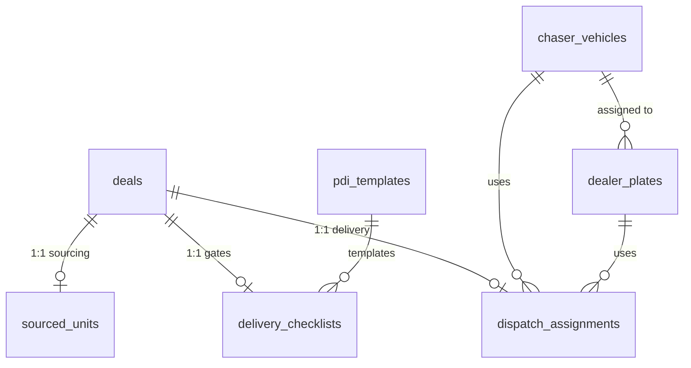

### delivery_checklists — as-is + tenancy (1:1 deals, UNIQUE(deal_id), CASCADE)

The 4 critical pre-delivery gates as-is: `client_insurance_uploaded` (+ `client_insurance_file_url`), `deal_funded` (+ `deal_funded_proof_url`), `safety_done`, `registration_done` — all BOOLEAN DEFAULT false; `is_ready` = all four true (computed, not stored). Booking: `drivers_booked`, `driver_names`, `booking_company` CHECK (`supreme`,`denises_guys`), `booked_delivery_time TIMESTAMPTZ`, `chaser_car_required/booked`, `dealer_plate_required`, `dealer_plate_assigned TEXT`. PDI (M-004): `checklist_items JSONB '[]'` (item shape `{id, section, label, checked, photo_required, photo_url, notes}`), `compliance_pct INTEGER DEFAULT 0`, `manager_signed BOOLEAN`, `manager_signed_by FK users`, `manager_signed_at`. Plus `tenant_id` **NEW**, `store_id NOT NULL`.

### pdi_templates — as-is + tenancy

`tenant_id` **NEW NOT NULL**; `store_id` nullable (org default vs store override); `section` CHECK (`exterior`,`interior`,`mechanical`,`documents`,`accessories`), `label NOT NULL`, `label_fr TEXT` **NEW** (Bill 96), `photo_required BOOLEAN DEFAULT false`, `sort_order INTEGER DEFAULT 0`, `active BOOLEAN DEFAULT true`. The 22 seeded default items (photo required on body condition, odometer, insurance verified, VIN plate) become the provisioning template.

### sourced_units — as-is + tenancy + cents (1:1 deals)

`tenant_id` **NEW**; `deal_id UNIQUE FK CASCADE`; `seller_name`, `seller_location`, `pickup_date DATE`, `picked_up_delivered BOOL`, `vehicle_paid BOOL`, `bill_of_sale_received BOOL` + `bill_of_sale_file_url`, `deposit_premium_paid BOOL`, `deposit_cents INTEGER` *(was `deposit_amount DECIMAL(10,2)` dollars — converted)*, `payment_method` CHECK (`wire`,`etransfer`,`cc`), `proof_of_payment_url`, `drivers_booked_for_pickup BOOL`, `pickup_driver_names`, `pickup_company`, `pickup_datetime TIMESTAMPTZ`, `comes_with_safety BOOL`.

### chaser_vehicles / dealer_plates — as-is + tenancy

| Table | Columns |
|---|---|
| `chaser_vehicles` | `tenant_id`/`store_id` **NEW NOT NULL**, `name NOT NULL`, `status DEFAULT 'available'` CHECK (`available`,`in_use`), `deleted_at` |
| `dealer_plates` | `tenant_id`/`store_id` **NEW NOT NULL**, `plate_number NOT NULL` — **UNIQUE (tenant_id, plate_number)** *(was global)*, `status` CHECK (`available`,`in_use`), `assigned_chaser_id FK chaser_vehicles SET NULL`, `deleted_at` |

### dispatch_assignments — as-is + tenancy, dual-status merged (1:1 deals)

`tenant_id` **NEW**; `deal_id UNIQUE FK CASCADE`; `chaser_vehicle_id FK SET NULL`, `dealer_plate_id FK SET NULL`, `num_drivers_needed INTEGER NOT NULL DEFAULT 1`, `dispatch_company` CHECK (`supreme`,`denises_guys`), `has_trade_in BOOL`, **`status` single CHECK (`pending`,`assigned`,`departed`,`arrived`,`completed`,`cancelled`)** *(merges legacy `status` + `dispatch_status` parallel fields)*, `conflict_flag BOOL` + `conflict_reason TEXT` (AI conflict detection — as-is), driver ETA block as-is: `driver_name`, `driver_phone`, `driver_vehicle`, `eta_departure`, `eta_arrival`, `actual_departure`, `actual_arrival`, `customer_notified BOOL` + `customer_notified_at`, `assigned_at`, `completed_at`, `deleted_at`.

## 12. Domain: Documents

### documents — as-is + tenancy + immutable snapshots (ADR-021)

| Column | Type | Notes |
|---|---|---|
| `tenant_id` / `store_id` | UUID NOT NULL | **NEW** / as-is |
| `deal_id` / `contact_id` / `inventory_id` | UUID FKs SET NULL | As-is (polymorphic attachment) |
| `category` | TEXT NOT NULL CHECK (§2, incl. **NEW** `funding_proof`,`payment_proof`) | Absorbs the 4 fixed `upload.js` categories |
| `filename` / `storage_path` | TEXT NOT NULL | As-is; path convention `tenant/{tenant_id}/deals/{deal_id}/{category}/…` (ADR-013) |
| `file_size` / `mime_type` | INTEGER (bytes) / TEXT | As-is |
| `uploaded_by` | UUID FK users | As-is |
| `sha256` | TEXT | **NEW** — content hash; generated PDFs are immutable snapshots (ADR-021) |
| `generated_payload` | JSONB | **NEW** — the exact desking/BoS payload at generation time (fixes "BoS never persisted, localStorage-only") |
| `immutable` | BOOLEAN NOT NULL DEFAULT false | **NEW** — immutable rows reject UPDATE via trigger |
| `locale` | TEXT CHECK (`fr`,`en`) | **NEW** — which language the document was rendered in (Bill 96: FR presented first) |
| `notes` / `deleted_at` | TEXT / TIMESTAMPTZ | As-is |

### required_documents — as-is + tenancy

`tenant_id` **NEW NOT NULL** (platform default rows carry the platform template and are copied at provisioning); `pipeline_stage NOT NULL`, `category NOT NULL`, `label NOT NULL`, `label_fr` **NEW**, `sort_order INTEGER DEFAULT 0`. Stage gates as-is: `signed` → credit_app, id_verification, insurance; `pending_delivery` → bill_of_sale, financing, registration; `delivered` → trade_docs.

## 13. Domain: Tasks, Notifications, Automation & Audit

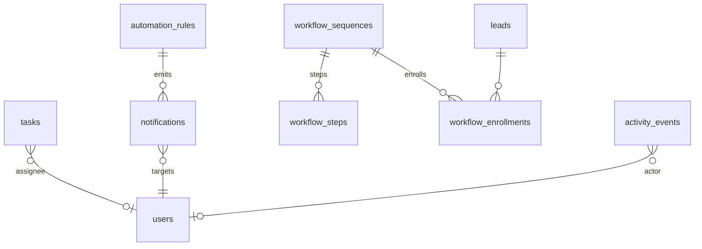

### tasks — unified task system (absorbs `lead_tasks`)

The two parallel legacy systems (`tasks` with `assignee_id`; `lead_tasks` with `assigned_to`, used by appointment auto-tasks) merge into one table — flagged gap resolved.

| Column | Type | Notes |
|---|---|---|
| `tenant_id` / `store_id` | UUID NOT NULL | **NEW** / as-is |
| `title` | TEXT NOT NULL; `description` TEXT | As-is |
| `assignee_id` | UUID FK users SET NULL | As-is (`lead_tasks.assigned_to` migrates here) |
| `due_date` | TIMESTAMPTZ | As-is |
| `priority` / `type` / `status` | TEXT CHECKs (§2) | As-is |
| `entity_type` / `entity_id` | TEXT CHECK (`deal`,`contact`,`lead`,`inventory`) / UUID | As-is polymorphic (+`lead`,`inventory` values) |
| `recurring_interval` | TEXT CHECK (§2) | As-is; completion clones the next instance: daily +1d, weekly +7d, biweekly +14d, monthly +1 month |
| `source` | TEXT | **NEW** *(from `lead_tasks`)* — e.g. `appointment_no_show`, `appointment_showed_no_deal`, `automation_rule` |
| `appointment_id` | UUID FK appointments SET NULL | **NEW** *(from `lead_tasks` runtime-fallback column, now real)* |
| `completed_at` / `deleted_at` | TIMESTAMPTZ | As-is |

### notifications — as-is + tenancy (partition candidate)

`tenant_id`/`store_id` **NEW**; `type NOT NULL` (`deal_stage_changed`,`task_overdue`,`task_assigned`,`deal_created`,…), `title NOT NULL`, `body`, `target_user_id NOT NULL FK users CASCADE`, `urgency` CHECK (§2), `acknowledged BOOLEAN NOT NULL DEFAULT false`, `acknowledged_at`, `entity_type`/`entity_id`. RLS finally enforces the "own notifications" rule the legacy policy names only claimed ([indexing-and-rls.md](./indexing-and-rls.md)).

### automation_rules — as-is + tenancy

`tenant_id` **NEW NOT NULL**; `store_id` nullable; `name`, `description`, `trigger_event` CHECK (§2), `trigger_condition JSONB '{}'` (`{from_stage,to_stage}` | `{days_overdue}` | `{days_threshold}`), `action_type` CHECK (§2), `action_config JSONB` (`{target_role, urgency, template}`), `escalation_minutes INTEGER`, `escalation_target_role TEXT`, `active BOOLEAN DEFAULT true`. The 5 seeded rules (safety 14d→used_car_manager/high/esc-gm-30m; funding 7d→fi_manager/high/esc-gm-60m; aging 60d→used_car_manager/medium; stage-change→salesperson/low; task-overdue→sales_manager/medium/esc-gm-10m) become provisioning templates. **Execution engine — Target:** BullMQ repeatable sweeps + event consumers (ADR-012); the legacy schema had config only, no executor.

### workflow_sequences / workflow_steps / workflow_enrollments — as-is + tenancy

| Table | Columns / Notes |
|---|---|
| `workflow_sequences` | `tenant_id` **NEW NOT NULL**, `store_id` nullable, `name`, `description`, `trigger_on` CHECK (§2), `trigger_config JSONB '{}'`, `is_active BOOLEAN DEFAULT false` (new workflows start disabled — safety default kept) |
| `workflow_steps` | `workflow_id FK CASCADE`, `step_order INTEGER NOT NULL`, UNIQUE (workflow_id, step_order), `delay_minutes INTEGER DEFAULT 0`, `action_type` CHECK (§2), `template_id FK message_templates SET NULL`, `custom_subject`, `custom_body`, `config JSONB '{}'` |
| `workflow_enrollments` | `tenant_id` **NEW**, `workflow_id FK CASCADE`, `lead_id FK CASCADE`, `deal_id UUID FK deals` **NEW** (the `deal_created` trigger finally has a subject; CHECK one of lead_id/deal_id NOT NULL), UNIQUE (workflow_id, lead_id), `status` CHECK (§2), `current_step INTEGER DEFAULT 0`, `next_run_at TIMESTAMPTZ` (poller cursor — partial index kept), `enrolled_at`, `completed_at`, `last_error TEXT` |

**Target executor:** the drip engine is a BullMQ repeatable job scanning `next_run_at` (10:00 tenant-local enrollment sends per ADR-012), with every send passing the consent/quiet-hours/suppression gate (§7).

### activity_events — as-is + tenancy (append-only; partition #1 candidate)

`tenant_id` **NEW NOT NULL**; `store_id` as-is; `entity_type TEXT NOT NULL` CHECK (enum of entity names), `entity_id UUID NOT NULL` (polymorphic, no FK — as-is), `action TEXT NOT NULL` (`created`,`updated`,`deleted`,`restored`,`stage_changed`,…), `actor_id FK users SET NULL`, `old_value JSONB`, `new_value JSONB`, `metadata JSONB` (e.g. `{field, from, to}`), `request_id TEXT` **NEW**, `created_at`. `PRIMARY KEY (id, created_at)`. The ad-hoc legacy `lead_activities` table merges into this stream (`entity_type='lead'`).

## 14. Domain: Accounting

### expenses — as-is + tenancy (model citizen for cents)

`tenant_id` **NEW**; `store_id NOT NULL` (was nullable). Linkage rule as-is: `CHECK (inventory_id IS NOT NULL OR deal_id IS NOT NULL OR stock_number IS NOT NULL)`; `inventory_id`/`deal_id` FKs SET NULL, `stock_number` denormalized (auto-filled from inventory by the existing `expenses_fill_stock` trigger — kept). `category_code NOT NULL FK expense_categories(code)`, `supplier_id FK suppliers SET NULL` + `supplier_name` fallback. Money as-is: `amount_cents INTEGER NOT NULL CHECK ≥ 0`, `tax_cents INTEGER NOT NULL DEFAULT 0 CHECK ≥ 0`, `total_cents GENERATED ALWAYS AS (amount_cents + tax_cents) STORED`; **NEW** `gst_cents INTEGER DEFAULT 0`, `qst_cents INTEGER DEFAULT 0` (input-tax-credit split — the flagged gap; `tax_cents` remains the lump total). `invoice_number`, `expense_date DATE NOT NULL DEFAULT CURRENT_DATE`, `description`, `notes`, `receipt_url`. Approval workflow as-is: `status` CHECK (`pending`,`approved`,`paid`,`rejected`,`void`), `approved_by`/`approved_at`, `paid_at`, `payment_method` CHECK (§2). Target: approve/reject/pay transitions require the `fi_manager|gm|owner|admin_office` roles via RLS + API guard (legacy was honor-system).

### expense_categories — as-is + platform/tenant scoping

`tenant_id` **NEW nullable** (NULL = platform catalog; tenant rows override/extend), `code TEXT NOT NULL`, **UNIQUE (COALESCE(tenant_id,zero-uuid), code)** *(was global UNIQUE on code)*, `label NOT NULL`, `label_fr` **NEW**, `description`, `is_cogs BOOLEAN NOT NULL DEFAULT true` (COGS vs opex — as-is), `display_order INTEGER DEFAULT 100`, `is_active BOOLEAN DEFAULT true`. The 17 seeded codes (purchase, transport, safety_pdi, recon_mech, recon_body, detail, parts, sublet, keys, advertising, pack, floorplan, commission_sales, commission_fi, warranty_cost, admin, other) ship as the platform catalog.

### suppliers — as-is + tenancy

`tenant_id` **NEW NOT NULL**; `store_id` nullable; whitelisted fields as-is: `name NOT NULL`, `category` (`mechanical`,`detail`,`transport`,`parts`,`advertising`), `contact_name`, `phone`, `email`, `fax`, `address`, `city`, `postal_code`, `province`, `country`, `tax_number` (GST/HST/BN), `pst_number`, `rin_number` (Ontario RIN), `dealer_number`, `driver_license`, `driver_license_expiry`, `payment_terms` (`net30`,`cod`,…), `default_expense_type`, `default_account`, `posted`, `tax_exempt`, `memo`, `notes`, `is_active BOOLEAN DEFAULT true`, `deleted_at` **NEW**.

### VIEW vehicle_expense_summary — as-is + tenancy

Per inventory unit: `expense_count`; `total_cents` = Σ where status ∈ (`approved`,`paid`); `pending_cents` = Σ where `pending`; `paid_cents` = Σ where `paid`. Recreated with `tenant_id`/`store_id` pass-through columns so RLS on the underlying tables governs it (`security_invoker = true`).

## 15. Domain: Integration & Webhooks

All **NEW** (ADR-005). Append-only, partition candidates.

### intake_events — inbound lead payload log

| Column | Type | Notes |
|---|---|---|
| `tenant_id` / `store_id` | UUID NOT NULL | Resolved from the endpoint path `/in/v1/leads/{tenantSlug}/{sourceKey}` |
| `source_key` | TEXT NOT NULL | Per-tenant source configuration key |
| `provider_event_id` | TEXT | Provider's id (Meta leadgen_id, ADF id) |
| `payload_hash` | TEXT NOT NULL | SHA-256 of the normalized body; **UNIQUE (tenant_id, source_key, COALESCE(provider_event_id, payload_hash))** — the deterministic BullMQ job-ID dedupe key (ADR-012) |
| `content_type` | TEXT CHECK (`json`,`adf_xml`,`email`) | ADF/XML + Resend Inbound supported |
| `raw_payload` | JSONB NOT NULL | Verbatim envelope |
| `signature_valid` | BOOLEAN | Provider signature verification result (Meta `X-Hub-Signature-256`, Twilio) |
| `status` | TEXT NOT NULL DEFAULT `'received'` CHECK (`received`,`processed`,`rejected`,`duplicate`) | |
| `lead_id` | UUID FK leads SET NULL | Set by the normalize step |
| `received_at` / `processed_at` | TIMESTAMPTZ | ACK-to-processed latency feeds the intake p99 < 1 s SLO (ADR-025) |

### webhook_endpoints — outbound webhook config

`tenant_id NOT NULL`, `url TEXT NOT NULL`, `events TEXT[] NOT NULL` (e.g. `deal.stage_changed`, `lead.created`), `secret_current TEXT NOT NULL`, `secret_next TEXT` (dual-secret rotation), `active BOOLEAN DEFAULT true`, `deleted_at`.

### webhook_deliveries — outbound delivery log

`tenant_id NOT NULL`, `endpoint_id FK webhook_endpoints CASCADE`, `event_type TEXT NOT NULL`, `payload JSONB NOT NULL`, `attempt INTEGER NOT NULL DEFAULT 1`, `status` CHECK (`pending`,`delivered`,`failed`,`dead`), `response_code INTEGER`, `response_ms INTEGER`, `next_retry_at TIMESTAMPTZ`, `delivered_at TIMESTAMPTZ`, `created_at`. Signature `HMAC-SHA256({timestamp}.{body})` in `X-ReadyLoans-Signature`, ±5-min replay window; retries via BullMQ exponential backoff to 24 h then DLQ (ADR-005/012).

## 16. Legacy → Target Mapping Appendix

| Legacy object | Disposition |
|---|---|
| `stores.tax_rate` (blended 0.14975) | Split into `gst_rate`/`qst_rate`/`pst_rate`/`hst_rate`; dropped at contract phase |
| `users.role`, `users.store_id`, `users.auth_id` | → `memberships.roles[]` + `memberships.store_id` (single membership table, §4); Better Auth identity |
| `salespeople` table (+ seeded 12 commission plans) | → `users` (role `salesperson`) + `commission_plans` (rates/pads/tiers/overrides preserved, dollars→cents) |
| `deals.deal_status` (`open/complete/cancelled`), `finance_status`, `vehicle_status`, `is_sold`, `sold_type` | → `pipeline_stage` + `funding_status` + `inventory.location_status`; mapping rule as-is: complete→`complete`; cancelled→`lost`; vehicle delivered→`delivered`; funded+not delivered→`pending_delivery`; approved→`approved`; else `new`; funding funded→`funded`, approved→`submitted`, conditional (present only in drifted data/specs)→`stips_required`, else `not_submitted` — targets are the canonical 4-value `funding_status` set (§2) |
| `deals.salesperson_name`, `commissions.salesperson_name`, `salespeople.override_on` | → `salesperson_id` / `override_on_user_id` FKs (name-resolution once, at migration) |
| `deals.customer_*`, `has_cosigner`, `cosigner_name` | → `contacts` + `deal_parties` (buyer/cosigner); legacy parse rule (first token = first_name) already applied by the F-003 data migration |
| `deals.financing_bank` | → `deal_submissions` rows against `lenders` |
| `deals.native_status` | → `tax_exempt_basis='indigenous_status'` |
| `lead_tasks`, `tasks` (two systems) | → unified `tasks` (+`source`, `appointment_id`) |
| `lead_activities` | → `activity_events` (`entity_type='lead'`) |
| `lead_communications` | → `communications` (polymorphic) |
| `leads.score_factors`, `leads.lost_reason` (text) | → `lead_scores.breakdown`; `lost_reason_id` |
| `dispatch_assignments.status` + `dispatch_status` | → single merged `status` |
| `inventory.deal_status` | → `availability_status` |
| `inventory.days_on_lot` | Dropped; computed |
| Dollars columns: `commissions.*`, `salespeople.pad_amount`, `sourced_units.deposit_amount`, `source_costs.spend` | ×100 → `*_cents` INTEGER |
| Hardcoded UUIDs (store `4edcf6fb-d93e-4fe7-8d0f-9440dd60c907`, user `ea422f90-7d91-427a-a811-49d4715aca4f`) | Eliminated; provisioning creates tenant #1 (Hassan Group → Kia ML / ReadyCar / Riverside) with generated ids |
| Storage bucket `deal-files` (single, bucket-wide policies) | → private S3 buckets with per-tenant prefixes `tenant/{id}/…` and presigned-URL-only access (ADR-013); stricter documents bucket class for contracts/IDs |
| Seed catalogs (pdi_templates ×22, lost_reasons ×9, expense_categories ×17, automation_rules ×5, required_documents) | → platform provisioning templates ([migrations-operations.md §6](./migrations-operations.md)) |
