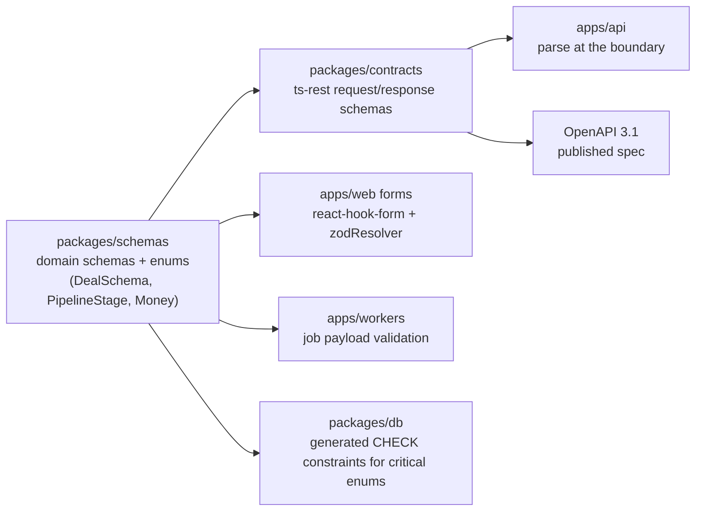

# Backend Stack — apps/api, apps/workers, apps/intake

This document specifies the backend technology stack for ReadyLoans: runtime and framework per the canonical ADRs, project structure across the three server apps, the service-layer architecture, the shared Zod validation system, OpenAPI generation, and the testing strategy. The legacy Express server (all logic in route handlers, ~150 unauthenticated endpoints, no transactions, no job system — audit-confirmed) is the reference for business rules only; nothing about its architecture migrates as-is (ADR-026).

## Table of Contents

1. [Runtime & Language](#1-runtime--language)
2. [Framework: Fastify v5](#2-framework-fastify-v5)
3. [Project Structure](#3-project-structure)
4. [Request Lifecycle](#4-request-lifecycle)
5. [Service Layer Architecture](#5-service-layer-architecture)
6. [Shared Validation Schemas](#6-shared-validation-schemas)
7. [Contracts & OpenAPI Generation](#7-contracts--openapi-generation)
8. [Workers & Intake Services](#8-workers--intake-services)
9. [Errors, Logging, Observability](#9-errors-logging-observability)
10. [Configuration](#10-configuration)
11. [Testing Strategy](#11-testing-strategy)

---

## 1. Runtime & Language

- **Node.js 22 LTS** (active LTS), pinned via `.nvmrc` + `engines` in every `package.json`; the same version runs in the Docker images (ECR) deployed to ECS Fargate (ADR-014).
- **TypeScript 5.9 `strict`** everywhere (ADR-001): `noUncheckedIndexedAccess`, `exactOptionalPropertyTypes`, `verbatimModuleSyntax` on. No `any` without an eslint-disable comment naming the reason.
- ESM modules throughout; `tsx` for local dev, compiled `tsc` output (or `tsup`) for Docker images.
- Package management: **pnpm** workspaces, tasks orchestrated by **Turborepo** (ADR-001) — `turbo run build --filter=apps/api...` builds an app plus its internal package graph.

## 2. Framework: Fastify v5

**Fastify v5** replaces Express (ADR-003). Why it matters here, concretely:

- Schema-driven serialization: response schemas from `packages/contracts` compile to fast-json-stringify serializers — output is both validated and fast.
- Plugin encapsulation: tenancy, auth, and rate limiting are scoped plugins; a route physically cannot be registered outside the auth scope (the legacy failure mode — `scopeToStore` registered after routes so Express never invoked it — is structurally impossible).
- Long-lived process: required for BullMQ producers, the Socket.IO realtime gateway, and graceful drains (ADR-004/012/014).

Core Fastify plugins used:

| Plugin | Purpose |
|---|---|
| `@ts-rest/fastify` | mounts the contract router (ADR-003) |
| `@fastify/helmet` | security headers (carried forward from Tier-0 spec) |
| `@fastify/cors` | strict allowlist: platform domains + verified tenant custom domains (ADR-014/018); wildcard CORS is banned |
| `@fastify/cookie` | Better Auth cookie parsing (ADR-006) |
| `@fastify/under-pressure` | event-loop/heap health → load-shedding 503 before the LB health check fails |
| custom `tenantContext` plugin | resolves membership → sets tenant/store context (§4) |
| custom `rateLimit` plugin | rate-limiter-flexible on Valkey, layered buckets (ADR-011) |

## 3. Project Structure

Three server apps share one dependency graph (ADR-001):

```
apps/api/src/
  server.ts              # buildServer(): registers plugins in order, returns Fastify instance
  main.ts                # listen + graceful shutdown (SIGTERM: stop accepting, drain 10s, close pools)
  plugins/
    auth.ts              # Better Auth integration: session → user + memberships
    tenant-context.ts    # active org/store resolution, request-scoped context
    rate-limit.ts        # ADR-011 layered token buckets
    observability.ts     # OTel + pino bindings, request_id/tenant_id decoration
  modules/               # one folder per bounded context — routes are thin adapters
    deals/
      deals.routes.ts    # ts-rest route implementations (no business logic)
      deals.service.ts   # orchestration, activity events, notifications
      deals.repo.ts      # SQL via db client; every query inside withTenant()
    desking/             # persists computeDeal() outputs from packages/core
    leads/  contacts/  inventory/  accounting/  suppliers/
    documents/  reports/  notifications/  admin/
  realtime/
    io.ts                # Socket.IO server on the Fastify HTTP server; @socket.io/redis-adapter on Valkey (ADR-004)
    emit.ts              # tenant-scoped emit helpers (tenant:{id}:... rooms) called by services/workers
  db/
    client.ts            # pg Pool → RDS Proxy endpoint (ADR-008)
    withTenant.ts        # transaction helper that sets RLS context (§4)
  lib/                   # AppError, money re-exports from packages/core, pagination

apps/workers/src/
  queues/                # queue definitions + repeatable job schedules (ADR-012)
  processors/            # email, sms, ai-turn, voice-orchestration, pdf-render, excel-export,
                         # image-process, webhook-delivery, drip-engine, lead-pipeline/*
  lib/                   # idempotency helpers, tenant-scoped service clients

apps/intake/src/
  routes/leads.ts        # POST /in/v1/leads/{tenantSlug}/{sourceKey} (ADR-005)
  routes/email.ts        # Resend Inbound webhook (ADF-by-email, delivery photos)
  adf/                   # ADF/XML parser → canonical Lead envelope
  verify/                # provider signature verification (Meta X-Hub-Signature-256, Twilio)
```

Shared packages consumed by all three: `packages/db` (migrations, generated types, RLS policies), `packages/schemas`, `packages/contracts`, `packages/core`, `packages/i18n` (server-side i18next for emails/PDFs/SMS), `packages/ai` (workers only).

## 4. Request Lifecycle

Every `/api/v1` request passes through the same ordered pipeline; there is no route that opts out except the explicit public allowlist (`/api/v1/auth/*`, `/api/v1/openapi.json` — the `/healthz` and `/readyz` probes sit outside `/api/v1` entirely, §9).

```mermaid
sequenceDiagram
  participant C as Client (typed ts-rest client)
  participant F as Fastify onRequest hooks
  participant H as Route handler (thin)
  participant S as Service
  participant R as Repository
  participant PG as Postgres (FORCED RLS)

  C->>F: HTTPS request + Better Auth cookie
  F->>F: 1. rate limit (global → IP → tenant → endpoint)
  F->>F: 2. auth: session → user + memberships (ADR-006)
  F->>F: 3. tenant context: active org/store from membership (never from client header)
  F->>H: 4. Zod parse of params/query/body (ts-rest)
  H->>S: call service with (ctx, validatedInput)
  S->>R: repo call(s)
  R->>PG: BEGIN; SET LOCAL app.tenant_id/app.user_id/app.store_ids; ...; COMMIT
  PG-->>R: rows (RLS-filtered backstop)
  S-->>H: domain result (+ activity event, jobs enqueued)
  H-->>C: Zod-serialized response
```

The transaction helper is the only way repositories touch the database (ADR-007/008):

```ts
// apps/api/src/db/withTenant.ts
export async function withTenant<T>(ctx: RequestCtx, fn: (tx: Tx) => Promise<T>): Promise<T> {
  return pool.transaction(async (tx) => {
    await tx.query(`SELECT set_config('app.tenant_id', $1, true),
                           set_config('app.user_id',  $2, true),
                           set_config('app.store_ids',$3, true)`,
      [ctx.tenantId, ctx.userId, ctx.storeIds.join(',')]);
    return fn(tx);
  });
}
```

`SET LOCAL` (`set_config(..., true)`) is transaction-scoped and therefore safe under RDS Proxy connection multiplexing — tenant context can never leak across pooled connections (ADR-008). App-level `WHERE tenant_id = $1` filters remain in every repository query as the first line; RLS is the backstop (ADR-007).

## 5. Service Layer Architecture

Thin routes → services → repositories (the audit's target architecture, now canonical):

| Layer | Owns | Forbidden |
|---|---|---|
| Route (ts-rest impl) | HTTP mapping, status codes, calling exactly one service method | business logic, SQL, provider SDKs |
| Service | orchestration, invariants, `activity_events` emission (ADR-009), enqueueing BullMQ jobs, cross-module calls | raw SQL, HTTP concerns |
| Repository | SQL inside `withTenant()`, pagination, row↔domain mapping | business decisions, calling other repos' tables |
| `packages/core` | pure domain math: `computeDeal()`, `calculateTaxes()`, commission engine, pipeline gates (`canComplete`), money utils | I/O of any kind — pure functions only |

Cross-cutting service rules (each fixes an audit-confirmed defect):

1. **Transactions are mandatory** for multi-write operations (lead→deal conversion, dispatch resource assignment, commission recompute) — the legacy server has zero transactions; round-robin assignment uses `SELECT ... FOR UPDATE` inside `withTenant()`.
2. **Pagination is mandatory**: repositories expose `list({ cursor, limit ≤ 100 })` only; aggregation happens in SQL, never by loading all rows (legacy reports silently truncate at PostgREST's 1,000-row cap — banned by construction).
3. **Nothing slow runs inline** (ADR-012): emails, PDFs, Excel, AI calls, image processing are enqueued; the handler returns `202` with a job reference where the client needs progress.
4. **Every mutation emits an `activity_events` row** (ADR-009) via the service layer — field updates diff old vs new and log only changed fields (Tier-0 rule, preserved).
5. **Provider SDKs live in workers** (ADR-020): no route handler calls Resend/Twilio/Anthropic directly.
6. Cross-tenant reads (AI network routing, platform admin) exist only as audited `SECURITY DEFINER` / privileged-role functions in a single module (`modules/admin`), per ADR-007.

## 6. Shared Validation Schemas

**Zod 4** is the single validation source (ADR-016), layered as:



Concrete conventions in `packages/schemas`:

- **Enums defined once**: `PipelineStage` (10 values: `new, submitted, approved, signed, sourcing, pending_delivery, scheduled, delivered, complete, lost`), `FundingStatus` (`not_submitted, submitted, stips_required, funded`), `ExpenseStatus` (`pending, approved, paid, rejected, void`), `Role` (10 platform roles), `Province` (13 codes). Legacy duplicate vocabularies (`status.deal` open/complete/cancelled vs the 10-stage pipeline) are migrated then dropped (ADR-009).
- **Branded types**: `Cents = z.number().int().min(0).brand<'Cents'>()` — the type system distinguishes cents from dollars, killing the $1,500-pad-read-as-$15 bug class.
- **Canadian refinements** (defined once, reused everywhere): `Vin` `/^[A-HJ-NPR-Z0-9]{17}$/`; `PostalCode` `/^[A-Za-z]\d[A-Za-z] ?\d[A-Za-z]\d$/` normalized to `A1A 1A1`; `Phone` normalized to E.164 (`+1...`); `Locale = z.enum(['fr','en']).default('fr')` (Bill 96, ADR-019).
- `.passthrough()` is banned on business payloads; `.strict()` is the default posture — unknown keys are rejected as `422 validation_failed` ([api-design.md §8](../03-architecture/api-design.md)), which closes the legacy mass-assignment holes (unauthenticated `PUT /api/users/:id` setting `role='owner'`).
- Workers validate every job payload with the same schemas before processing; a payload that fails validation goes straight to the DLQ with the Zod issues attached.

## 7. Contracts & OpenAPI Generation

Contract-first REST (ADR-003):

1. Every endpoint is declared in `packages/contracts` as a ts-rest router entry: method, `/api/v1/...` path, `pathParams`/`query`/`body`/`responses` — all Zod.
2. `apps/api` implements the contract with `@ts-rest/fastify`; the compiler fails if an implementation drifts from the contract.
3. `apps/web` consumes the generated typed client — tRPC-grade safety without a second protocol.
4. **OpenAPI 3.1** is generated from the contract in CI (`pnpm openapi:generate`), committed to `packages/contracts/openapi.json`, and served at `GET /api/v1/openapi.json` with Scalar/Redoc docs for integrators (lead providers, telephony vendors, dealer groups).
5. CI gate (ADR-023): the generation step re-runs and diffs against the committed spec — an uncommitted API change fails the PR. A breaking-change detector (`oasdiff`) flags removals/renames; breaking changes require a `/v2` route and a ≥6-month deprecation window on `/v1` (ADR-003).

Versioning and deprecation headers on responses from deprecated routes: `Deprecation: true`, `Sunset: <RFC 8594 date>`, `Link: <successor>; rel="successor-version"`.

## 8. Workers & Intake Services

### 8.1 apps/workers (ADR-012)

BullMQ 5 on ElastiCache for Valkey (ADR-010/014). Queue names below follow the canonical catalog in [scalability-performance.md §9](../03-architecture/scalability-performance.md) (declared canonical by system-architecture.md §5.3 — it also carries the deterministic job-ID patterns, per-queue concurrency, and backoff schedules):

| Queue | Processor concurrency | Notes |
|---|---|---|
| `email` | high (I/O-bound) | Resend + React Email, tenant-branded, FR/EN server-side i18n |
| `sms` | high | Twilio; CRTC quiet-hours + consent checks in the send layer (ADR-020/022) |
| `ai-turn` | per-tenant limiter | Claude conversation turns (ADR-022) |
| `voice-orchestration` | per-tenant limiter | ConversationRelay orchestration |
| `pdf-render` / `excel-export` | low, **sandboxed** child processes | Playwright/Chromium rendering (ADR-021), ExcelJS |
| `image-process` | low | sharp: EXIF strip, blurhash, watermark, pre-generated WebP/AVIF `srcset` variants (ADR-013) |
| `webhook-delivery` | high | HMAC-signed deliveries, exponential backoff ≤24h, DLQ (ADR-005) |
| `lead-pipeline` (BullMQ **Flow**) | — | intake → normalize/dedupe → consent check → AI first-touch → extraction → routing → agent assignment |
| `drip-engine` / `report-schedule` / `billing-usage` / `tenant-lifecycle` | low–medium | drip sequences, scheduled reports, Stripe Meters pushes, tenant provisioning/offboarding — full specs in the canonical catalog |
| repeatable jobs | — | task-overdue sweep (15 min), escalation checker (5 min), drip enrollment 10:00 tenant-local, DNCL freshness, scheduled reports — replaces the nonexistent legacy scheduler |

Invariants: deterministic job IDs (webhook redelivery dedupe), idempotent processors (check-state-before-acting; never double-send), `tenant_id` in every payload, `removeOnComplete/Fail` TTLs, DLQ per queue with Better Stack alerting (ADR-025).

### 8.2 apps/intake (ADR-005)

- `POST /in/v1/leads/{tenantSlug}/{sourceKey}` — accepts JSON and ADF/XML; verifies provider signatures; normalizes to the canonical Lead envelope; records CASL consent basis (implied-inquiry, 6-month expiry); enqueues to `lead-pipeline`; ACKs in **<100 ms** (p99 < 1 s SLO, ADR-025). No database reads on the hot path — tenant slug→id resolution comes from the Valkey-cached tenant map.
- Resend Inbound webhook for ADF-by-email (AutoTrader.ca, Kijiji Autos) and delivery-photo emails.
- Deployed as its own ECS Fargate service behind the shared ALB (host-based routing on `in.` — ADR-014); the contract allows a later Hono-on-edge split without changes.

## 9. Errors, Logging, Observability

- **AppError taxonomy** in `apps/api/src/lib/errors.ts`: `BadRequestError(400)` (malformed requests only — unparseable JSON, invalid cursor, unknown filter), `AuthenticationError(401)`, `PermissionError(403)`, `NotFoundError(404)`, `ConflictError(409)` (e.g., contact duplicate detection returns `409` + `duplicates[]`, preserving the legacy desking contract), `ValidationError(422)` (Zod/schema failures and domain gate failures such as `delivery_blocked`), `RateLimitError(429 + Retry-After)`, `AppError(500)`. Every error serializes to the single envelope of [api-design.md §8](../03-architecture/api-design.md) — `{ "error": { code, message, request_id, details? } }` with stable lowercase snake_case codes (`validation_failed`, `unauthorized`, `forbidden`, …) and `message` localized FR/EN server-side (ADR-019). RFC 9457 problem+json is **not** used; one envelope serves the SPA client, workers, and external integrators.
- Raw Postgres errors never reach the client (no table/column/constraint names — Guardrail Sign 024 carried forward); they are logged and mapped.
- **pino** structured JSON logs with mandatory bindings `{request_id, tenant_id, store_id, user_id, trace_id}` shipped to Better Stack (ADR-025). `console.*` is an eslint error (legacy has 201 raw calls).
- **OpenTelemetry** auto-instrumentation on Fastify, `pg`, BullMQ; trace context propagated into job payloads so a lead's intake→AI→assignment path is one trace. Exported to Sentry (errors + traces, PII-scrubbed `beforeSend`, no request bodies with personal data).
- Health endpoints (canonical contract in [hosting-topology.md §5](../07-infrastructure/hosting-topology.md)): `GET /healthz` (liveness, no dependency checks), `GET /readyz` (Postgres through RDS Proxy + Valkey `PING` + migration-ledger match, 200/503) — the legacy health check tests nothing; `/readyz` gates the ALB target-group health checks and the blue/green rollout health gates (ADR-014/023). `GET /api/v1/health/deep` is the monitoring-only dependency probe for Better Stack and the deploy canary watch — never used for restart or rollout decisions.

## 10. Configuration

Carried forward from the Tier-0 spec and made canonical: **Zod-validated environment; the process refuses to start if any required variable is missing or malformed.**

```ts
// apps/api/src/config.ts
const Env = z.object({
  NODE_ENV: z.enum(['development','staging','production']),
  PORT: z.coerce.number().default(3001),
  DATABASE_URL: z.string().url(),          // RDS Proxy endpoint DSN, sslmode=verify-full (ADR-015)
  DATABASE_DIRECT_URL: z.string().url(),   // direct-to-RDS: migrations / LISTEN only (ADR-008)
  VALKEY_URL: z.string().url(),            // TLS required (ADR-010)
  BETTER_AUTH_SECRET: z.string().min(32),
  RESEND_API_KEY: z.string(),
  TWILIO_ACCOUNT_SID: z.string(), TWILIO_AUTH_TOKEN: z.string(),
  ANTHROPIC_API_KEY: z.string(),
  KMS_KEY_ID: z.string(),                  // field-level encryption (ADR-015)
  SENTRY_DSN: z.string().url().optional(),
  ALLOWED_ORIGINS: z.string(),             // comma-separated allowlist
});
export const env = Env.parse(process.env);
```

Secrets live only in platform secret stores (AWS Secrets Manager injected into ECS task definitions for runtime, RDS credentials included — ADR-008/014; GitHub Actions environment secrets for deploy-time) — never in the repo; the legacy leaked service-role and Resend keys are rotated on migration day (ADR-023).

## 11. Testing Strategy

| Layer | Tool | What & gates |
|---|---|---|
| Pure domain (`packages/core`) | **Vitest** | **≥90% coverage gate (ADR-023)**. **Golden-number tests** for every tax/desking/commission path (audit Phase-2 requirement): e.g., QC $40,000 sale + $10,000 trade allowance → GST $1,500.00 / QST $2,992.50; Section 87 → $0 tax; pad $150,000¢ subtracted **before** rate; overrides paid to supervisor; rebate-after-tax rule. Fixtures encode the 12 pay plans and the 10-stage pipeline gates (`canComplete` requires `delivered_at` + `funding_status='funded'`). |
| Schema/contract | Vitest | `packages/schemas` refinement tables (valid/invalid VIN, postal, E.164); contract↔OpenAPI snapshot; breaking-change diff (§7). |
| API integration | Vitest + `buildServer()` via `fastify.inject`, real Postgres from **ephemeral testcontainers** in CI (ADR-023 migration dry-run DB) | per-module: auth required (401 without session), role matrix (403), pagination limits, error-envelope shapes ([api-design.md §8](../03-architecture/api-design.md)). |
| **RLS policy tests** | SQL test harness (pgTAP or Vitest + two pooled roles) | for every tenant table: tenant A cannot read/write tenant B's rows through the app role; `FORCE RLS` verified; `USING(true)` grep-gate in CI fails the build if any policy contains it (ADR-007). Tests run as the app role, never as `postgres` (the legacy false-confidence trap). |
| Workers | Vitest + real Valkey container | idempotency (same job ID twice → one side effect), DLQ routing, flow step ordering. |
| E2E | **Playwright** smoke (ADR-023) | staging with seeded synthetic tenants; covers login, pipeline drag, desking save, lead intake→assignment. |
| Load (pre-launch) | k6 against staging | verifies SLOs: API p95 < 300 ms, intake ACK p99 < 1 s (ADR-025); per-tenant rate-limit fairness under a noisy-neighbor scenario (ADR-011). |

Non-negotiables inherited from the audit: no test may merely assert a module loads (~90% of legacy server tests do); no financial code path ships without a golden-number test; CI runs the full forward-only migration chain from an empty ephemeral Postgres container (testcontainers, ADR-023) so the "migrations cannot build a fresh DB" failure cannot recur.
