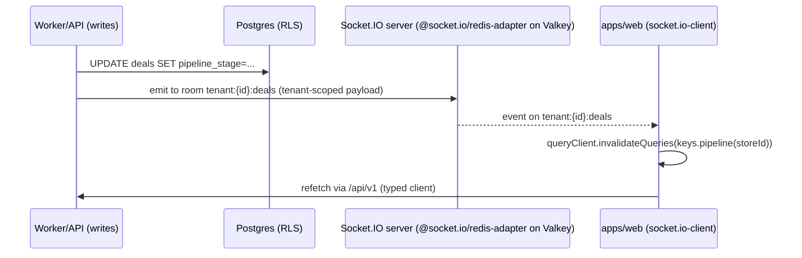

# Frontend Stack — apps/web

This document specifies the frontend technology stack for the ReadyLoans SPA (`apps/web`): framework and runtime choices per the canonical ADRs, server-state and client-state management, forms, routing, code splitting, the PWA/mobile approach, performance budgets, and the testing strategy. Where the legacy Kia Mont-Laurier client (React 18 + Vite + JSX) already implements a rule, it is documented as-is and the ReadyLoans behavior is marked **Target**.

## Table of Contents

1. [Framework & Runtime](#1-framework--runtime)
2. [Application Structure](#2-application-structure)
3. [Routing](#3-routing)
4. [Server State & Data Fetching](#4-server-state--data-fetching)
5. [Client State](#5-client-state)
6. [Forms](#6-forms)
7. [Code Splitting & Bundle Strategy](#7-code-splitting--bundle-strategy)
8. [PWA & Mobile Approach](#8-pwa--mobile-approach)
9. [Performance Budgets](#9-performance-budgets)
10. [Testing](#10-testing)
11. [Legacy → Target Migration Notes](#11-legacy--target-migration-notes)

---

## 1. Framework & Runtime

| Concern | Legacy (as-is) | Target (canonical) |
|---|---|---|
| Framework | React 18, JSX, no TypeScript | **React 19** + **TypeScript 5.9 `strict`** (ADR-001, ADR-002) |
| Build tool | Vite (v4-era config) | **Vite 6** (ADR-002) |
| Rendering model | SPA, client-rendered | SPA, client-rendered — **no Next.js/SSR** (ADR-002) |
| Router | react-router-dom v6 | **react-router v7** (ADR-002) |
| Server state | react-query (v4-era) | **TanStack Query v5** (ADR-002) |
| Styling | Tailwind v3 + "KIA Command" CSS variables | Tailwind v4 + `packages/ui` tokens (ADR-017/018 — see `ui-design-system.md`) |
| Package location | `client/` standalone | `apps/web` in the pnpm + Turborepo monorepo (ADR-001) |

Rationale (ADR-002): ReadyLoans is a logged-in, data-dense B2B tool. SSR/SEO adds cost without benefit; one SPA serves every tenant with white-labeling applied at runtime (ADR-018). Public marketing pages, if ever needed, are a separate tiny app — never a reason to move the product to Next.js.

**Hard rule carried from ADR-002:** direct browser → database queries are **banned**. The legacy DeskingPage reads/writes `deal_parties` straight against the old Supabase backend with the anon key from the browser; that pattern does not migrate — the RDS database is VPC-private and unreachable from a browser by construction (ADR-008). All data flows through the typed `packages/contracts` client against `/api/v1`. No database SDK ships in `apps/web`; realtime is **socket.io-client** (ADR-004), authenticated by the Better Auth session on connect (§4.3).

## 2. Application Structure

Target layout of `apps/web/src` (feature-sliced, mirroring the module map that the legacy i18n namespaces already define — `pipeline`, `desking`, `inventory`, `leads`, `contacts`, `accounting`, `dispatch`, `delivery`, `reports`, `appointments`, `templates`, `workflows`, `suppliers`):

```
apps/web/src/
  app/                  # bootstrap: providers, router, error boundaries
    providers.tsx       # QueryClientProvider → AuthProvider → TenantThemeProvider → I18nProvider → Router
    router.tsx          # route tree, lazy imports, role guards
  features/
    pipeline/           # kanban board, stage components
    desking/            # worksheet UI; math imported from packages/core (never re-implemented here)
    leads/              # queue, scoring, assignment rules, duplicates, be-back
    contacts/
    inventory/
    delivery/
    dispatch/
    accounting/
    reports/
    appointments/
    templates/
    workflows/
    suppliers/
    settings/           # tenant branding, users/roles, lender catalog, fee/F&I catalogs
  shared/
    api/                # ts-rest client instance, query-key factory, mutation helpers
    realtime/           # socket.io-client hooks (tenant-namespaced rooms, ADR-004)
    hooks/
    lib/                # formatters (currency/date via Intl), guards
  styles/               # Tailwind entry; tokens come from packages/ui
```

Cross-package imports (ADR-001):

- `packages/ui` — every visual component (shadcn/Base UI system).
- `packages/core` — desking/tax/commission math. The frontend **never** contains a formula; it renders `computeDeal()` output.
- `packages/schemas` — Zod schemas + enums (pipeline stages, statuses) for form validation and display maps.
- `packages/contracts` — ts-rest contract + generated typed client.
- `packages/i18n` — EN/FR resources.

## 3. Routing

### 3.1 Route map

The legacy route map (26 routes, documented in the client-shell brief) is the parity baseline. Target routes keep the same information architecture under react-router v7 with three changes: (a) every route is lazy-loaded, (b) role guards replace the flat `ProtectedRoute`, (c) the unprotected `/bill-of-sale` window-print hack is replaced by server-rendered PDF documents (ADR-021).

| Path | Feature | Guard (Target) |
|---|---|---|
| `/login` | auth | public (redirects if session) |
| `/` | dashboard | any authenticated member |
| `/pipeline` | pipeline kanban | any |
| `/deal/new`, `/deal/:id` | deals | all roles except `logistics`, `bdc_agent` for create |
| `/desking` (`?dealId=`) | desking | any; **Vehicle Cost + Profitability visible only to manager roles** (owner, gm, sales_manager, used_car_manager, fi_manager) — replaces the legacy hardcoded `isManager={true}` |
| `/leads`, `/leads/:id`, `/leads/assignment-rules`, `/leads/scoring-rules`, `/leads/duplicates`, `/leads/be-back` | leads | any; rules pages manager+ |
| `/contacts`, `/contacts/:id` | contacts | any |
| `/inventory`, `/inventory/:id` | inventory | any |
| `/deliveries`, `/dispatch` | logistics | any |
| `/appointments`, `/templates`, `/workflows` | productivity | any |
| `/reports`, `/analytics/win-loss`, `/analytics/source-roi`, `/analytics/leaderboard` | reporting | owner, gm, sales_manager, fi_manager |
| `/accounting` | accounting | owner, gm, fi_manager, admin_office |
| `/suppliers` | suppliers | any; edit manager+ |
| `/salespeople` | team | owner, gm, sales_manager |
| `/settings/*` | tenant admin | owner, gm, admin |
| `*` | catch-all | redirect `/` |

Static-first route declarations are preserved (legacy already orders `/leads/assignment-rules` before `/leads/:id`).

### 3.2 Guards

- `RequireAuth` — session check via Better Auth client (ADR-006); unauthenticated → `/login` with `returnTo`.
- `RequireRole(roles[])` — reads the active membership `(user, org, store, roles[])`; renders 403 page, never hides the failure silently. Role checks are UX only — the API + RLS enforce authorization (ADR-006/007); the legacy pattern of client-side-only enforcement is explicitly dead.
- Store switcher: active store lives in the session context; changing it invalidates the entire query cache (`queryClient.clear()`) because every query key is store-scoped (§4.2).

## 4. Server State & Data Fetching

### 4.1 TanStack Query v5 configuration

Legacy defaults (documented in `client/src/lib/queryClient.js`, kept as the starting point):

```ts
// apps/web/src/shared/api/queryClient.ts
export const queryClient = new QueryClient({
  defaultOptions: {
    queries: {
      staleTime: 30_000,          // 30s — carried from legacy
      refetchOnWindowFocus: true, // carried from legacy
      retry: 1,                   // carried from legacy
      throwOnError: false,
    },
    mutations: { retry: 0 },
  },
});
```

### 4.2 Typed client + query keys

All requests go through the ts-rest client generated from `packages/contracts` (ADR-003). No raw `fetch`, no per-file `API_URL` constants (the audit found `API_URL` re-declared in 51 files and 44/52 fetch files sending no auth header — the shared client is the structural fix). Auth is cookie-based (Better Auth `HttpOnly` cookies, ADR-006), so the client sends `credentials: 'include'`; there is no bearer-token plumbing in the SPA.

Query-key convention — hierarchical, store-scoped:

```ts
// shared/api/keys.ts
export const keys = {
  deals:    (storeId: string) => ['store', storeId, 'deals'] as const,
  deal:     (storeId: string, id: string) => ['store', storeId, 'deals', id] as const,
  pipeline: (storeId: string) => ['store', storeId, 'pipeline'] as const,
  leads:    (storeId: string, filters: LeadFilters) => ['store', storeId, 'leads', filters] as const,
  inventory:(storeId: string) => ['store', storeId, 'inventory'] as const,
  branding: (tenantId: string) => ['tenant', tenantId, 'branding'] as const,
};
```

Rules:

- One cache per entity. The audit found `/deals` living in **three unsynced caches**; the query-key factory plus mandatory invalidation in mutation `onSuccess` prevents recurrence.
- List endpoints are always paginated (server enforces it — see `backend-stack.md` §5); infinite lists use `useInfiniteQuery` with cursor pagination.
- Optimistic updates only for kanban drag (stage change) and task-complete; everything else invalidates.

### 4.3 Realtime integration (ADR-004)

Socket.IO events do not replace queries; they *invalidate* them:



- Client: **socket.io-client** over the ALB WebSocket path with stickiness (ADR-004/014). The connection authenticates with the Better Auth session cookie on connect; the server joins the socket only to its tenant's rooms — `tenant:{tenantId}:deals`, `tenant:{tenantId}:leads`, `tenant:{tenantId}:notifications`. Presence (agent availability) rides socket heartbeats + Valkey; the AI-analysis panel streams via SSE or the same socket.
- Events are emitted by the API/worker layer after writes (no database change-capture, ADR-004); the refetch always goes through the API (single data plane) — the socket event payload is treated as a signal, not as data.

## 5. Client State

Deliberately minimal — no Redux/Zustand/global store is introduced:

| State | Mechanism | Persistence |
|---|---|---|
| Auth session + active membership | Better Auth client + React context | Better Auth cookies (ADR-006) |
| Tenant branding/theme | `TenantThemeProvider` context; CSS variables injected pre-paint (ADR-018) | server record, cached |
| Light/dark theme | context + `dark` class on `<html>` (carried from legacy `useTheme`) | `localStorage` `rl_theme` |
| Locale | i18next (`packages/i18n`) | user profile (server) → `localStorage` fallback |
| Sidebar collapsed | local component state | `localStorage` `rl_sidebar_collapsed` |
| Desking worksheet | `useReducer` around `packages/core` `computeDeal()` (ported from legacy `useDesking`) | server draft via `PATCH /api/v1/desking-sessions/:id` — **replaces** the legacy write-only `kia_desking_state_v1` localStorage key |
| Desking scenarios (max 4, one recommended) | same reducer | server (`desking_scenarios` rows) — replaces `kia_desking_scenarios_v1` |
| Ephemeral UI (modals, slide-outs, drag) | component state | none |

**localStorage policy (Target):** allowed for pure UI preferences only (theme, sidebar, recent Cmd+K searches — last 5, carried from Tier-0 spec). Business data in localStorage (legacy `kia_user` session fallback, `kia_bos_payload_v1` bill-of-sale handoff, `dealTracker_customLenders`) is banned; each of those becomes server state (lender catalog per tenant, BoS as immutable server document per ADR-021, session via cookies).

## 6. Forms

- **react-hook-form + `@hookform/resolvers/zod`** with schemas imported from `packages/schemas` (ADR-016). The same `DealCreateSchema` that validates `POST /api/v1/deals` on the server validates the form on the client — zero drift.
- Canadian refinements come standardized from `packages/schemas`: VIN `/^[A-HJ-NPR-Z0-9]{17}$/`, postal `A1A 1A1`, phone normalized to E.164, money fields as **integer cents** (ADR-009) — the form layer converts display dollars ⇄ cents at the input boundary only, using the shared money utilities from `packages/core`.
- Error messages are i18n keys resolved through `packages/i18n` (ADR-019), never hardcoded strings; Zod issues map to keys via a shared `zodErrorMap` configured once for `fr-CA`/`en-CA`.
- Numeric inputs keep the legacy coercion contract (empty/NaN → 0, `min 0`, currency step `.01`) via shared `MoneyInput` / `NumberInput` components in `packages/ui`.
- Multi-step flows (deal creation, credit app) use one schema per step + a composed schema for final submit; each step is `zodResolver(schema.pick(...))`.

## 7. Code Splitting & Bundle Strategy

The legacy app has **no code splitting** — the audit notes the login page downloads the PDF parser and chart libraries. Target rules:

1. **Route-level splitting**: every feature route is `React.lazy()` behind the router; login loads only the auth chunk.
2. **Library-level splitting** via Vite `manualChunks`:
   - `vendor-react` (react, react-dom, react-router)
   - `vendor-query` (TanStack Query)
   - `charts` (Recharts — loaded only by dashboard/report routes)
   - `pdf-import` (DealerTrack PDF parser — loaded only when the desking drop-zone activates, `import()` on drag-enter)
   - `i18n-fr` / `i18n-en` — locale resources lazy-loaded per active language (the legacy app bundles both 1,017-line files eagerly)
3. **Icon strategy**: `lucide-react` with per-icon imports (tree-shaken), no icon fonts.
4. Suspense boundaries per route with skeleton screens (see `ui-design-system.md` §11 — skeletons, not spinners).
5. `@vitejs/plugin-react` with the React Compiler enabled once stable on React 19; until then, memoization is manual and only where profiling shows need.

## 8. PWA & Mobile Approach

ReadyLoans ships **responsive-first SPA now, installable PWA at module parity** — a native app is out of scope (consistent with the Foundation Plan, which deferred "Mobile PWA" to Tier 2).

As-is: the legacy client is responsive (768px sidebar/drawer switch, framer-motion mobile nav) but has no manifest, no service worker, and no offline behavior.

Target:

- **`vite-plugin-pwa`** generating the web manifest + Workbox service worker.
- Manifest is **tenant-branded at runtime**: `name`, `theme_color`, and icons served from `GET /api/v1/tenant/manifest.webmanifest` so an installed white-label app carries the dealer's identity (ADR-018).
- Caching strategy: `CacheFirst` for hashed static assets; `NetworkOnly` for `/api/v1/*` (financial data is never served stale from a service worker); `StaleWhileRevalidate` for the branding record and locale bundles.
- **No offline writes at launch.** Offline shows a branded offline page; queued mutations are a future ADR if field staff demand it (delivery photos are the likely first case).
- Mobile UX rules (from the CRM UI/UX research, adopted in ADR-017): bottom tab bar with 5 entries on <640px (Dashboard, Pipeline, Leads, Appointments, More), horizontally scrollable kanban with ~85%-width snap columns, 44px minimum touch targets, sticky primary action buttons.
- Web push for the notification center (urgency ≥ high) via the service worker, gated behind Law 25-compliant permission UX.

## 9. Performance Budgets

Enforced in CI (Lighthouse CI against the per-PR preview deploy — S3 prefix on the preview CloudFront distribution, ADR-014/023 — plus `rollup-plugin-visualizer` size check), aligned with the platform SLOs in ADR-025:

| Metric | Budget | Where enforced |
|---|---|---|
| Initial JS (login → dashboard critical path) | ≤ 350 KB gzip | CI bundle check, hard-fails the PR above budget (same gate as ci-cd.md §4 check 8 and scalability-performance.md §11) |
| Any single route chunk | ≤ 150 KB gzip | CI bundle check |
| LCP (dashboard, mid-tier laptop, Fast 3G CPU 4x) | ≤ 2.5 s | Lighthouse CI |
| INP | ≤ 200 ms | Lighthouse CI + Sentry Web Vitals |
| CLS | ≤ 0.1 (branding/font injection must not shift layout — neutral skeleton until branding loads, `font-display: swap` + preload per ADR-018) | Lighthouse CI |
| Kanban board render (200 visible deals) | ≤ 100 ms commit | React Profiler test |
| Table rows without virtualization | ≤ 100 rows; beyond that TanStack Virtual is mandatory | code review + lint rule |
| API perceived latency | p95 < 300 ms (server SLO, ADR-025); optimistic UI for drag interactions | Sentry tracing |

Anti-patterns banned by review checklist: N+1 client fetching (the legacy P&L-by-vehicle tab issues up to 200 sequential requests — the replacement endpoint aggregates server-side), unpaginated list queries, `select('*')`-style over-fetch through the contract layer.

## 10. Testing

Test pyramid for `apps/web` (tooling per ADR-023):

| Layer | Tool | Scope & gates |
|---|---|---|
| Unit | **Vitest** | hooks, reducers, formatters. Desking math itself is tested in `packages/core` (≥90% coverage gate, ADR-023) — web tests only assert wiring. |
| Component | Vitest + **React Testing Library** | `packages/ui` components (both themes, both locales); feature components with mocked API. |
| API mocking | **MSW** with handlers generated from `packages/contracts` | mock responses are type-checked against the contract — a contract change breaks tests at compile time, not at runtime. |
| E2E smoke | **Playwright** (ADR-023) | login → pipeline drag → desking compute → deal save; leads intake → assignment; runs against staging seed tenants on every PR. |
| i18n | CI parity gate (ADR-019) | EN↔FR key parity — missing key fails the build; plus a render test that mounts each route under `fr-CA` and asserts zero raw fallback keys. |
| Accessibility | `vitest-axe` on `packages/ui`; Playwright + axe on the 5 core screens | zero serious/critical violations (AODA exposure — legacy app has 9 aria attributes total). |
| Visual | Playwright screenshots of `packages/ui` in light/dark + 2 tenant themes | catches token regressions and white-label breakage. |

## 11. Legacy → Target Migration Notes

Concrete defects in the legacy client that this stack closes (audit-confirmed; listed so parity work does not re-import them):

1. `App.jsx:103` escaped template literal `fetch(\`\${API_URL}/users/me\`)` breaks session restore → the typed client removes hand-built URLs entirely.
2. `localStorage.kia_user` forgeable login fallback → deleted; Better Auth cookies only (ADR-006).
3. 44/52 fetch call-sites without auth headers → impossible by construction (single client, cookie auth).
4. Three styling systems + 90 references to undefined CSS variables → single token source in `packages/ui` (ADR-017/018).
5. Dead desking persistence (`kia_desking_state_v1` written, never read) → server-side desking sessions.
6. Per-browser lender customization (`dealTracker_customLenders`) → per-tenant lender catalog via API.
7. No error boundary → per-route error boundaries + Sentry (ADR-025).
8. `window.print()` bill-of-sale from localStorage → immutable server-generated PDF snapshots (ADR-021).
