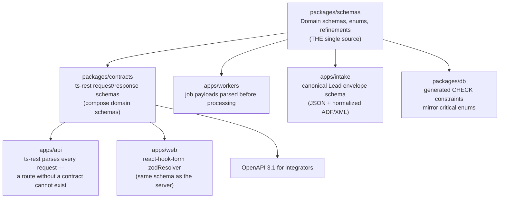

# Media Pipeline, i18n Architecture & Validation Architecture

This document specifies three cross-cutting platform subsystems: the image/media pipeline (upload processing, pre-generated WebP/AVIF variants, CDN — ADR-013), the internationalization architecture (French-first per Bill 96, key management, EN↔FR parity enforcement, locale-aware formatting — ADR-019), and the validation architecture (shared Zod schemas as the single source of truth across client, server, workers, and database — ADR-016). Existing behavior from the Kia Mont-Laurier tracker is documented as-is; ReadyLoans behavior is marked **Target** where it differs.

## Table of Contents

1. [Image & Media Pipeline](#1-image--media-pipeline)
   - [1.1 Buckets & Access Model](#11-buckets--access-model)
   - [1.2 Upload Pipeline](#12-upload-pipeline)
   - [1.3 Serving: Pre-Generated Variants, WebP/AVIF, CDN](#13-serving-pre-generated-variants-webpavif-cdn)
   - [1.4 Cost Model & Fallback](#14-cost-model--fallback)
2. [i18n Architecture](#2-i18n-architecture)
   - [2.1 Stack & Locale Resolution](#21-stack--locale-resolution)
   - [2.2 Key Management](#22-key-management)
   - [2.3 EN↔FR Parity Enforcement](#23-enfr-parity-enforcement)
   - [2.4 Server-Side i18n](#24-server-side-i18n)
   - [2.5 Locale-Aware Currency, Dates, Numbers](#25-locale-aware-currency-dates-numbers)
   - [2.6 Bill 96 Compliance Mapping](#26-bill-96-compliance-mapping)
3. [Validation Architecture](#3-validation-architecture)
   - [3.1 Single Source of Truth](#31-single-source-of-truth)
   - [3.2 Standard Refinements](#32-standard-refinements)
   - [3.3 Enforcement at Every Layer](#33-enforcement-at-every-layer)
   - [3.4 Error Contract](#34-error-contract)

---

## 1. Image & Media Pipeline

Vehicle photos are the dominant workload (6 required angles per unit, ADR-013), plus expense receipts, delivery photos (inbound by email), tenant branding assets, and sensitive documents (contracts, IDs, credit apps).

### 1.1 Buckets & Access Model

As-is: the legacy app uses a public `expense-receipts` bucket (public URLs stored in `receipt_url`) and a `deal-files` bucket the audit found **anon-writable** (insurance/funding docs effectively public). Both patterns are terminated.

Target bucket classes on **Amazon S3** in ca-central-1 (ADR-013), all **private** (Block Public Access on, SSE-KMS encryption), per-tenant path prefixes `tenant/{tenantId}/...`, **presigned URLs only** for upload and download; vehicle photos and branding assets are additionally served through **CloudFront with origin access control (OAC)** — the buckets themselves are never public:

| Bucket | Content | Path convention | Access / presigned TTL | Retention |
|---|---|---|---|---|
| `vehicle-photos` | inventory photos (6 angles), trade-in photos | `tenant/{tenantId}/inventory/{inventoryId}/{angle}-{hash}.jpg` | variants via CloudFront (OAC, §1.3); presigned upload only | life of unit + 24 mo |
| `receipts` | expense receipts (image/PDF) | `tenant/{tenantId}/expenses/{expenseId}/{ts}.{ext}` | presigned, 1 h | 7 y (fiscal) |
| `branding` | logos (light/dark/email/favicon), fonts (WOFF2) | `tenant/{tenantId}/branding/{asset}.{ext}` | CloudFront (OAC), immutable filenames, long-lived cache | life of tenant |
| `documents` | contracts, BoS snapshots, IDs, credit apps | `tenant/{tenantId}/deals/{dealId}/{docType}-{hash}.pdf` | presigned, 15 min, download-only — **no CDN** | per document-retention schedule (Law 25); S3 Object Lock |
| `delivery-photos` | delivery/PDI photos (incl. Resend Inbound intake, ADR-005) | `tenant/{tenantId}/deliveries/{dealId}/{ts}.jpg` | presigned, 24 h | 24 mo |

The `documents` bucket is a stricter class (ADR-013): S3 Object Lock retention, no CloudFront distribution — access is exclusively short-lived presigned download URLs issued by the API.

Uploads go through the API (presigned S3 upload URL issued per file after auth + tenant scoping + entitlement check) — the browser never holds AWS credentials.

### 1.2 Upload Pipeline

All uploads pass a **sharp** preprocessing job in `apps/workers` (`image-process` queue — canonical name per scalability-performance.md §9, ADR-012/013) before the file is considered available:

```mermaid
flowchart LR
  A["Client upload\n(presigned S3 URL, direct to staging prefix)"] --> B["images queue job\n(deterministic ID = file hash)"]
  B --> C["sharp pipeline"]
  C --> C1["validate MIME by magic bytes\n(jpeg/png/webp/heic; pdf receipts pass through)"]
  C1 --> C2["strip EXIF + GPS\n(privacy: Law 25)"]
  C2 --> C3["max-dimension clamp 3200px,\nre-encode quality 85"]
  C3 --> C4["blurhash / LQIP string\nstored on the DB row"]
  C4 --> C5["optional dealer watermark\n(tenant branding, vehicle photos only)"]
  C5 --> C6["pre-generate WebP/AVIF variants\nat srcset widths (§1.3)"]
  C6 --> D["move to final per-tenant prefix\n+ mark row image_status='ready'"]
  D --> E["emit activity_event photo_uploaded"]
```



Rules: MIME sniffing by content, never by extension (closes the legacy unauthenticated-upload/path-traversal finding); max accepted upload 25 MB; HEIC (iPhone) transcoded to JPEG at ingest; failed processing → DLQ, row stays `image_status='failed'` with a visible retry. **Variants are pre-generated at upload time, not derived at serve time**: one clean origin per image plus WebP/AVIF files at the fixed `srcset` widths (§1.3) — serving is static from S3/CloudFront with no transform service in the request path.

### 1.3 Serving: Pre-Generated Variants, WebP/AVIF, CDN

Serving is **static pre-generated variants from private S3 behind CloudFront** (origin access control — the buckets stay private; ADR-013/014):

- The `image-process` job writes, per origin image, **WebP and AVIF variants at each shared breakpoint width** plus the cleaned JPEG origin. Filenames are content-hashed and immutable → `Cache-Control: public, max-age=31536000, immutable` at the CDN edge; a re-upload is a new hash, never an invalidation.
- **Format selection is `<picture>` markup, not server-side negotiation**: an AVIF `<source>`, a WebP `<source>`, JPEG `` fallback. Both modern formats ship day one — sharp encodes them at upload time, so AVIF support does not depend on any provider's transform-service roadmap.
- Responsive images are variant-URL `srcset`s generated by a single shared helper in `packages/ui`:

```tsx
// packages/ui/src/media/vehicleImageSrcSet.ts — the only place widths are defined
export const IMG_BREAKPOINTS = [320, 640, 960, 1280, 1920] as const;
// <picture>
//   <source type="image/avif" srcSet=".../{angle}-{hash}-320.avif 320w, .../{angle}-{hash}-640.avif 640w, ..."
//           sizes="(max-width: 640px) 100vw, 33vw" />
//   <source type="image/webp" srcSet="..." sizes="..." />
//   
// </picture>
```

- Every `` ships `loading="lazy"` (except the LCP hero image, which gets `fetchpriority="high"`), explicit `width`/`height` (CLS budget, see `frontend-stack.md` §9), and a blurhash placeholder.
- Emails and PDFs use fixed-width **JPEG** variants (`640` email, `1280` print — email clients do not reliably render AVIF/WebP) via the server-side branding path (ADR-018/021).

### 1.4 Cost Model & Fallback

- With pre-generated variants there is **no per-transform fee** (ADR-013): cost is S3 storage + CloudFront egress. Shape of the bill: 5 widths × 2 modern formats + the JPEG origin ≈ 11 objects (roughly 1–1.5 MB total) per photo, so an inventory of 200 units × 6 photos ≈ 1,200 origin images lands in the low-single-digit GB of S3 — single-digit dollars per month — and dealership image traffic sits comfortably inside CloudFront's always-free 1 TB/mo egress tier. Variant encoding is worker CPU already budgeted in the `image-process` queue (ADR-012).
- Designated fallback (ADR-013): **Cloudflare Images** ($5/mo base; 5,000 free unique transformations then $0.50/1,000; `format=auto` incl. AVIF counts as one) — switch triggers: on-the-fly transform needs appear (smart-crop, named variants, arbitrary widths beyond the fixed breakpoints), or variant storage/regeneration cost outgrows per-transform pricing. The `vehicleImageSrcSet` helper is the single abstraction point, so a fallback swap touches one file plus infrastructure.
- Watermarking stays a **sharp upload-time step** (not a serve-time transform) so it works identically on either serving path.

---

## 2. i18n Architecture

### 2.1 Stack & Locale Resolution

- Libraries (ADR-019): **react-i18next** (kept from legacy) + **i18next-icu** (ICU MessageFormat for plurals/selects/number-dates) on the client; **i18next core** instances on the server (API + workers) sharing the same resources.
- Resources live in `packages/i18n` (ADR-001): the legacy `client/src/locales/en.json` + `fr.json` (1,017 lines each, full parity — a genuine asset per the audit) are migrated there as the seed catalog.
- Supported locales: `fr-CA`, `en-CA`. `fr` is the platform default (ADR-016 `Locale` schema default; ADR-019).

Locale resolution order (Target — fixes the legacy `lng: localStorage.kia_language || 'en'` Bill 96 gap):

| Priority | Source | Notes |
|---|---|---|
| 1 | user profile `language_pref` | per-user choice, stored server-side (`'fr'` default on user creation, per Tier-0 users schema) |
| 2 | tenant default locale | `fr-CA` for Quebec tenants (tenant record field `default_locale`) |
| 3 | browser `Accept-Language` / navigator | pre-login only |
| fallback | `fr-CA` | `fallbackLng: 'fr'` — **inverts the legacy `fallbackLng: 'en'`** |

Customer-facing locale (emails, SMS, documents, AI conversations) is resolved from the **contact**, not the staff user: `contacts.preferred_language` (default `'fr'`, Tier-0 schema) → tenant default. The AI agent opens FR-first for Quebec leads (area codes 438/514/450/819/873 + an explicit preference question, ADR-022) and records the answer back to `contacts.preferred_language`.

### 2.2 Key Management

- Namespaces are the module map (as-is, preserved): `nav`, `login`, `dashboard`, `filters`, `deal`, `status`, `province`, `saleType`, `actions`, `email`, `common`, `delivery`, `sourced`, `dispatch`, `reports`, `salespeople`, `contacts`, `pipeline`, `inventory`, `leads`, `followUp`, `speedToLead`, `scoring`, `duplicates`, `templates`, `appointments`, `winLoss`, `sourceRoi`, `tradeIn`, `desking` (largest — 182 keys), plus Target namespaces `settings`, `billing`, `ai`, `consent`, `errors`, `emails`, `documents`, `sms`.
- Key convention: `namespace.section.key` camelCase (`desking.paymentSummary.totalObligation`); enum labels follow `enums.{enumName}.{value}` (`enums.pipelineStage.pending_delivery`) generated from `packages/schemas` so a new enum value without labels fails CI.
- One JSON file per namespace per locale (`packages/i18n/locales/{fr,en}/{namespace}.json`) — replaces the two monolithic 1,017-line files; namespaces lazy-load per route (see `frontend-stack.md` §7).
- ICU everywhere for plurals/gender/select: `"daysInStage": "{count, plural, one {# jour} other {# jours}}"` — no `_plural` key suffixes.
- Interpolated values are typed: a `pnpm i18n:types` step generates a TS union of all keys + their interpolation variables, so `t('desking.unknownKey')` and a missing `{count}` are compile errors.

### 2.3 EN↔FR Parity Enforcement

Bill 96 requires the French version be **equivalent in content and functionality** — including the staff-facing SaaS UI. Enforcement is mechanical (ADR-019/023):

1. **CI parity gate** (`pnpm i18n:check`, blocking): key sets of `fr/*` and `en/*` must be identical; empty-string values fail; ICU syntax is parsed and variable sets must match across locales. Missing key = failed build.
2. **No hardcoded strings**: eslint rule (`i18next/no-literal-string`) errors on string literals in JSX outside `t()` — this closes the audit finding that money screens (desking, leads) leak hardcoded English precisely where francophone staff work most.
3. **Runtime tripwire**: in dev/staging, `missingKeyHandler` throws; in prod it logs to Sentry with the key name (never silently shows the key to a Quebec user — the `fr` fallback renders).
4. **Route-render test**: CI mounts every route under `fr-CA` and asserts zero untranslated fallbacks (see `frontend-stack.md` §10).
5. Server catalogs (emails/PDFs/SMS/AI scripts) run through the same parity gate — a template that exists only in English does not ship (ADR-019: "every string, enum label, email, PDF, and AI script ships in both languages or doesn't ship").

### 2.4 Server-Side i18n

The API and workers instantiate i18next with `packages/i18n` resources (no react layer):

| Surface | Locale source | Examples |
|---|---|---|
| API validation errors / error-envelope messages | request user's locale | `errors.validation.vinInvalid` |
| Notifications (in-app) | recipient user `language_pref` | `notifications.dealStageChanged` |
| Emails (Resend + React Email) | contact `preferred_language`; staff emails by user locale | closing report, quotes, drip steps |
| SMS (Twilio) | contact `preferred_language` | AI conversation, STOP confirmations (STOP/ARRET both honored) |
| PDFs (Playwright, ADR-021) | document locale — **contracts of adhesion render French first**; English version only after the French has been presented (Bill 96) | bill of sale, worksheets |
| AI scripts (ADR-022) | contact language; first-turn AI self-identification in **both** FR and EN | prompts in `packages/ai`, strings in `packages/i18n` |

The legacy Ontario/OMVIC BoS template printing on Quebec deals is a documented defect; document templates are per-province **and** per-locale in the new catalog.

### 2.5 Locale-Aware Currency, Dates, Numbers

All formatting via `Intl`, wrapped once in `packages/core` (client and server share it):

```ts
// packages/core/src/format.ts
export const formatCents = (cents: Cents, locale: 'fr-CA' | 'en-CA') =>
  new Intl.NumberFormat(locale, { style: 'currency', currency: 'CAD' }).format(cents / 100);
// fr-CA: 1 234,56 $   en-CA: $1,234.56
```

Rules:

- Money is stored as integer cents (ADR-009) and formatted only at the render boundary; `fr-CA` renders `1 234,56 $` (narrow no-break space, trailing symbol), `en-CA` renders `$1,234.56`.
- Dates/times stored UTC (ADR-009); rendered in the **tenant timezone** with `Intl.DateTimeFormat(locale, { timeZone })`; date-only business fields (delivery date) are calendar dates, never shifted by timezone.
- Numbers/percentages via `Intl.NumberFormat` (`fr-CA` uses comma decimals: `14,975 %`).
- Tax breakdown labels come from the tax engine as structured data (`{ kind: 'QST', rate: 0.09975, amountCents }`) and are labeled through i18n (`enums.taxKind.QST`) — never as pre-baked English strings (the legacy engine emits `"QST (9.975%)"` strings; the port to `packages/core` returns structured components per ADR-009's split-column rule).
- Province names bilingual from the canonical province table (legacy `PROVINCES[code].name/nameFr` — preserved in `packages/schemas`).

### 2.6 Bill 96 Compliance Mapping

| Bill 96 obligation | Platform mechanism |
|---|---|
| French UI equivalent for Quebec workers (SaaS incl. staff tools) | parity gate §2.3; `fr` fallback locale; per-user `language_pref` default `'fr'` |
| Commercial publications available in French, at least as prominent | tenant public surfaces (credit-app forms, review requests) default `fr-CA`; language toggle shows the *other* language (as-is pattern) |
| Contracts of adhesion: French presented first | document generation renders FR first; EN version gated behind an explicit "English requested after French examined" flag stored on the deal document record |
| Penalties $3,000–$30,000/violation | i18n gates are release-blocking, not advisory (ADR-019) |

---

## 3. Validation Architecture

### 3.1 Single Source of Truth

**Zod 4** (ADR-016). The legacy system has a complete Zod schema library **imported by zero routes** (audit) — the target architecture makes unvalidated input structurally impossible, not merely discouraged:



A field, enum value, or rule added anywhere is added in **exactly one place** (`packages/schemas`) and propagates by the type system. `.passthrough()` on business payloads is banned; `.strict()` is the default (mass-assignment class of bugs closed at the boundary).

### 3.2 Standard Refinements

Defined once in `packages/schemas/src/refinements.ts`, reused by every schema:

| Refinement | Rule | Notes |
|---|---|---|
| `Vin` | `/^[A-HJ-NPR-Z0-9]{17}$/` (17 chars, no I/O/Q) | NHTSA rule, carried from Tier-0 spec |
| `PostalCode` | `/^[A-Za-z]\d[A-Za-z] ?\d[A-Za-z]\d$/`, normalized to `A1A 1A1` uppercase | legacy supplier-modal rule, standardized |
| `Phone` | strip non-digits, 10–11 digits, normalize to E.164 `+1XXXXXXXXXX` | replaces 5 divergent legacy implementations |
| `Email` | `z.email()` lowercased/trimmed | |
| `Cents` | `z.number().int().min(0).brand<'Cents'>()` | ADR-009 — all money |
| `Rate` | `z.number().min(0).max(1)` decimal (0.25 = 25%) | commission/tax rates; NUMERIC(5,4) convention |
| `Locale` | `z.enum(['fr','en']).default('fr')` | Bill 96 default (ADR-016/019) |
| `Province` | `z.enum([...13 codes])` | AB BC MB NB NL NS NT NU ON PE QC SK YT |
| `PipelineStage`, `FundingStatus`, `ExpenseStatus`, `Role`, `LostReason` | single enum definitions | see `backend-stack.md` §6 |
| `Uuid` | `z.uuid()` | all IDs |
| `IsoDateTime` / `CalendarDate` | UTC instant vs date-only | date-only never timezone-shifted (§2.5) |

Sanitization runs inside the schemas (`.trim()`, phone/email normalization as `transform`s) — pre-validation, per the Tier-0 rule, but expressed once instead of per-route.

### 3.3 Enforcement at Every Layer

| Layer | Mechanism | Failure behavior |
|---|---|---|
| SPA forms | `zodResolver(schema)` — same schema object as the server | inline field errors, i18n messages (§3.4) |
| API boundary | ts-rest parses `pathParams`/`query`/`body`; unparsed data never reaches a handler | `422 validation_failed` envelope with `details[]` issue list (`api-design.md` §8; `400` only for malformed requests) |
| API responses | response schemas compiled to serializers — over-fetch/PII leak in a response shape is a build/type error | CI failure |
| Workers | `Schema.parse(job.data)` first line of every processor | job → DLQ with Zod issues attached |
| Intake | canonical Lead envelope schema over JSON and parsed ADF/XML | `202` ACK still returned (at-least-once), invalid payload quarantined + logged per source |
| Database | generated CHECK constraints for critical enums + `NOT NULL tenant_id` + FK integrity (ADR-009) | last-resort backstop; a CHECK violation in prod is a Sentry alert, since the upper layers should have caught it |

Environment configuration is validated with the same discipline (`Env.parse(process.env)`, refuse to start — see `backend-stack.md` §10).

### 3.4 Error Contract

- Zod issues map to a stable wire format inside the standard error envelope (`api-design.md` §8): `details: [{ path: 'vehicle.vin', code: 'vin_invalid', message }]` where `message` is resolved server-side through `packages/i18n` in the requester's locale (§2.4).
- The client renders by `path` + `code`; codes (not English text) are the API contract, so FR/EN messages can evolve without breaking integrators.
- The shared `zodErrorMap` lives in `packages/schemas` and is registered once on client and server — a new refinement must register its error code + FR/EN messages or the i18n parity gate (§2.3) fails.
