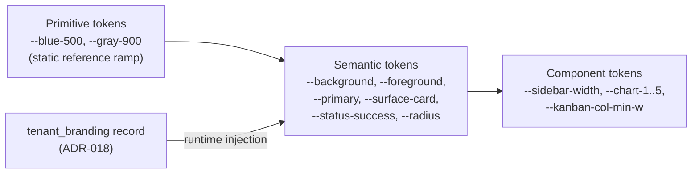

# UI & Design System — packages/ui

This document specifies the ReadyLoans design system: the component library stack and its costs (ADR-017), the token architecture that makes white-labeling a runtime concern (ADR-018), the color palettes — including the existing **KIA Command** token set preserved as the first tenant theme — typography, spacing, dark mode, responsive breakpoints, accessibility requirements, data-grid and chart standards for CRM density, and animation guidelines. Everything visual lives in `packages/ui` (ADR-001); no app imports a UI primitive from anywhere else.

## Table of Contents

1. [Library Stack & Costs](#1-library-stack--costs)
2. [Token Architecture](#2-token-architecture)
3. [Color Palettes](#3-color-palettes)
4. [Typography Scale](#4-typography-scale)
5. [Spacing & Density](#5-spacing--density)
6. [Dark Mode](#6-dark-mode)
7. [Responsive & Mobile-First Breakpoints](#7-responsive--mobile-first-breakpoints)
8. [Accessibility](#8-accessibility)
9. [Data Grids for CRM Density](#9-data-grids-for-crm-density)
10. [Charts](#10-charts)
11. [Animation Guidelines](#11-animation-guidelines)
12. [Component Inventory & Legacy Mapping](#12-component-inventory--legacy-mapping)

---

## 1. Library Stack & Costs

Per ADR-017; costs as researched mid-2026, re-verify at purchase time.

| Library | Role | License / cost | Status |
|---|---|---|---|
| **Tailwind CSS v4** | utility CSS, CSS-first `@theme` token config (Oxide engine) | MIT, free | Adopted |
| **shadcn/ui on Base UI primitives** (`@base-ui/react`, July 2026 default) | component system, vendored into `packages/ui` as a **private registry** (shadcn GitHub Registries) | MIT, free | Adopted |
| **TanStack Table v8** | all data grids (headless, ~15 KB gzip) | MIT, free | Adopted |
| **TanStack Virtual** | row virtualization >100 rows | MIT, free | Adopted |
| **shadcn Charts (Recharts)** | dashboards/report charts, CSS-variable themed | MIT, free | Adopted |
| **Tremor blocks** | KPI card/dashboard shells where useful | MIT core, free | Allowed |
| **framer-motion** | micro-interactions (already in legacy: sidebar, nav indicator, drawers) | MIT, free | Adopted |
| **lucide-react** | icon set (legacy already uses it) | ISC, free | Adopted |
| Tailwind Plus | marketing/site chrome templates | $299 one-time | **Rejected** (decided 2026-07-23 — the product is a system, not a landing page; no template purchase needed) |
| **AG Grid Enterprise** | Excel-grade grid (range selection, pivot, server-side row model) | **~$999/dev perpetual** (2026 subscription quotes $995–$1,995/dev/yr) | **Deferred** — see §9.3 trigger criteria |
| MUI X Pro/Premium | — | $180–$588/dev/yr | **Rejected** (ecosystem clash with Tailwind/shadcn) |
| Untitled UI React | — | $59–$2,499 one-time | **Rejected** (React Aria primitive layer conflicts with Base UI) |

Distribution: `packages/ui` hosts the vendored shadcn components (we own the code) plus ReadyLoans compositions (`DataTable`, `WorksheetLine`, `SlideOutPanel`, `StatusBadge`, `KanbanColumn`…). Apps consume via `@readyloans/ui`; adding a new shadcn component is `pnpm ui:add <component>` against the private registry.

There are **no paid UI kit purchases** (owner decision 2026-07-23): Tailwind Plus is not bought — the product is a logged-in system, not a landing page, so template chrome adds nothing. Professional UI/UX is delivered entirely by the free stack above plus the design-selection process below.

### 1.1 Design selection process (decided 2026-07-23)

The design direction, color palette, and UI style are selected **before any UI code is written**, using **Google Stitch** (AI design tool). This step precedes and gates all UI build work (roadmap step H-01):

1. **Stitch generates candidate design directions** (color palette, typography feel, component style, overall density/mood) for the ReadyLoans staff platform. Stitch is driven via its **MCP server** — registered user-scope and verified connected 2026-07-24 (tools: `build_site`, `get_screen_code`, `get_screen_image`); manual use of Stitch in the browser is the fallback if the MCP connection isn't available.
2. **The owner picks a direction** from the generated candidates (iterating in Stitch as needed).
3. **The chosen direction is locked as design tokens**: its palette/typography/style are translated into the token architecture (§2) — primitive ramp + semantic token defaults (OKLCH) in `packages/ui` — and become the platform default theme. After lock, token changes go through the normal design-review process, not ad-hoc edits.
4. **shadcn/ui is themed against those tokens**: the vendored components consume the locked semantic tokens untouched; no component work starts before the lock.
5. **Stitch stays in the loop during build (not just at selection):** for each major screen family (dashboard, leads kanban, deal pipeline, desking worksheet, delivery board, admin console), the UI agent may generate candidate layouts in Stitch under the locked direction and pull them back via `get_screen_code`/`get_screen_image` as a starting point — then re-implements them properly on `packages/ui` components and locked tokens. Stitch output is a design reference, never shipped code: everything merged must pass the token, accessibility, and i18n rules of this document.

White-label runtime theming (ADR-018) is unaffected: Stitch selects the *platform default* theme; tenant branding still rewrites semantic tokens at runtime, and the KIA Command theme (§3.1) remains tenant #1's branding record.

Three layers, all CSS custom properties (Tailwind v4 maps every token to utilities via `@theme`):

Rules:

1. **Components reference semantic tokens only.** No component ever uses a raw hex or a primitive token directly — hardcoded brand color = release blocker (ADR-018).
2. **Tenant theming rewrites semantic tokens at runtime**: the `tenant_branding` record (logo + dark logo + favicon + email logo, OKLCH `primary`/`accent`/semantic colors, font WOFF2 URL, `radius`, density) resolved by custom domain → subdomain (`{dealer}.readyloans.app`) → login org context, injected as a `` block before first paint; neutral skeleton until loaded (no brand flash, no CLS).
3. Semantic token names follow the shadcn convention so vendored components work untouched: `--background`, `--foreground`, `--card`, `--popover`, `--primary`, `--primary-foreground`, `--secondary`, `--muted`, `--accent`, `--destructive`, `--border`, `--input`, `--ring`, `--radius`, `--chart-1`…`--chart-5`, `--sidebar-*`.
4. Colors stored as **OKLCH** triplets in the branding record so shades and dark palettes are derivable (§6) and WCAG contrast is computable (§8).
5. A parallel **server-side branding path** feeds the same record into React Email templates and Playwright-rendered PDFs (ADR-018/021) — the design system covers email/print, not just the SPA.

## 3. Color Palettes

### 3.1 Theme #1 — "KIA Command" (existing tokens, preserved as-is)

The legacy token set from `client/src/index.css` (consumed via `tailwind.config.js` utility names `bg-surface-page`, `text-content-primary`, `text-brand-red`, `bg-brand-accent`, `text-status-danger`, …) becomes the seed `tenant_branding` record for tenant #1 (Kia Mont-Laurier). Documented as-is:

| Token | Light | Dark |
|---|---|---|
| `--color-brand-red` | `#E53935` | `#EF5350` |
| `--color-accent` / hover | `#3B82F6` / `#2563EB` | `#60A5FA` / `#93C5FD` |
| `--color-bg-page` | `#F5F7FA` | `#0F1117` |
| `--color-bg-sidebar` | `#FFFFFF` | `#141720` |
| `--color-bg-card` | `#FFFFFF` | `#1A1D27` |
| `--color-bg-elevated` | `#FFFFFF` | `#232738` |
| `--color-bg-input` | `#F9FAFB` | `#1A1D27` |
| `--color-border` / subtle | `#E5E7EB` / `#F3F4F6` | `#2A2D3A` / `#1F2231` |
| `--color-text-primary` | `#1A1D23` | `#F0F2F5` |
| `--color-text-secondary` | `#6B7280` | `#9CA3AF` |
| `--color-text-muted` | `#9CA3AF` | `#6B7280` |
| `--color-text-inverse` | `#F0F2F5` | `#1A1D23` |
| `--color-success` / light | `#10B981` / `#D1FAE5` | `#34D399` / `#064E3B` |
| `--color-warning` / light | `#F59E0B` / `#FEF3C7` | `#FBBF24` / `#451A03` |
| `--color-danger` / light | `#EF4444` / `#FEE2E2` | `#F87171` / `#450A0A` |
| `--color-info` / light | `#6366F1` / `#EEF2FF` | `#818CF8` / `#1E1B4B` |

Migration note: these names map 1:1 onto the semantic layer (`--color-bg-card` → `--card`, `--color-accent` → `--primary`, etc.). Known legacy defect (audit): newer pages (Desking, Accounting, InventoryDetail) bypass these tokens with raw Tailwind grays — those screens are rebuilt on tokens during module parity (ADR-017), not patched.

### 3.2 ReadyLoans default theme (Target)

New tenants without custom branding get a neutral default: primary `oklch(0.55 0.18 255)` (≈ `#3B82F6` family), neutral gray surface ramp identical in structure to §3.1, radius `0.5rem`. This is the theme used in screenshots/tests so nothing accidentally depends on Kia branding. **Note (2026-07-23):** these values are placeholders — the actual default-theme tokens are locked by the Stitch design-selection process (§1.1) before UI build; the structure (OKLCH, ramp shape, token names) stands regardless of the direction chosen.

### 3.3 Pipeline & status colors (product constants, not tenant-themable)

Stage colors are **domain constants** in `packages/schemas` (source: legacy `lib/pipeline.js`) — consistent across tenants so cross-store dashboards read identically:

| Pipeline stage (10) | Hex | | Funding status | Hex |
|---|---|---|---|---|
| `new` | `#3B82F6` | | `not_submitted` | `#9CA3AF` |
| `submitted` | `#6366F1` | | `submitted` | `#F59E0B` |
| `approved` | `#06B6D4` | | `stips_required` | `#F97316` |
| `signed` | `#F59E0B` | | `funded` | `#22C55E` |
| `sourcing` | `#8B5CF6` | | | |
| `pending_delivery` | `#14B8A6` | | **Deal aging** (days in stage) | |
| `scheduled` | `#10B981` | | `< 3` | `#22C55E` |
| `delivered` | `#22C55E` | | `3–7` | `#F59E0B` |
| `complete` | `#6B7280` | | `> 7` ("rotting") | `#EF4444` |
| `lost` | `#EF4444` | | | |

Inventory aging badges (accounting/inventory, as-is): ≥90 days red, ≥60 amber, else green. Expense status badges (as-is): `pending` amber, `approved` blue, `paid` emerald, `rejected` red, `void` gray.

## 4. Typography Scale

Default font **Inter** (weights 300–700), self-hosted WOFF2 (no Google Fonts CDN request — Law 25 posture + CSP); tenants may override `--font-sans` with their own self-hosted WOFF2 (preloaded, `font-display: swap`). Scale adopted from the CRM UI/UX research (already matches legacy usage):

| Role | Size / weight | Tailwind |
|---|---|---|
| Page title | 24px / 600 | `text-2xl font-semibold` |
| Section heading | 18px / 600 | `text-lg font-semibold` |
| Card title | 15px / 600 | `text-[15px] font-semibold` |
| Body | 14px / 400 | `text-sm` |
| Label / form | 13px / 500 | `text-[13px] font-medium` |
| Caption / meta | 12px / 400 | `text-xs` |
| Badge / chip | 11px / 600 uppercase | `text-[11px] font-semibold uppercase tracking-wide` |
| Monospace (VIN, stock #) | 13px | `font-mono text-[13px]` |
| Hero number (desking payment) | 48px / 700, `tabular-nums` | `text-5xl font-bold tabular-nums` |

`font-variant-numeric: tabular-nums` is mandatory on every money/number column so grids align.

## 5. Spacing & Density

- **4px base unit** (Tailwind default scale). Card padding 12–16px (`p-3`/`p-4`); page gutter `p-4` mobile / `p-6` desktop; max content width `max-w-[1400px] mx-auto` (carried from legacy Layout).
- Layout constants (component tokens): `--sidebar-width: 240px`, `--sidebar-collapsed-width: 60px` (as-is); top bar 56px; kanban column min-width 280px, cards 260–300px wide with 3–4px left stage-color border, max 4–5 info items per card.
- **Density modes** (Target, part of `tenant_branding.density`): `comfortable` (default, row height 44px) and `compact` (row height 36px, table font 13px) — implemented as a token swap (`--row-h`, `--cell-py`), no component forks. CRM users live in tables; compact mode is a real requirement, not a nicety.

## 6. Dark Mode

- Strategy (as-is, kept): class toggle — `.dark` on `<html>`; every semantic token redefined under `.dark`. Preference = stored user choice, else `prefers-color-scheme` (legacy `useTheme` behavior, preserved).
- **Elevation via lighter surfaces, not shadows** (Monday.com pattern, already encoded in KIA Command: page `#0F1117` → sidebar `#141720` → card `#1A1D27` → elevated `#232738`).
- Per-tenant dark palettes are **derived algorithmically** from the tenant's OKLCH brand color (lightness/chroma transforms) with optional manual override in the branding record (ADR-018) — dealerships are never required to author two palettes.
- Status "light" backgrounds invert to deep tints in dark (e.g., success light `#D1FAE5` → `#064E3B`) — derivation preserves this pattern.
- Both themes are first-class: CI visual tests render `packages/ui` in light + dark (the legacy failure — newer pages light-only — is a regression class under test).

## 7. Responsive & Mobile-First Breakpoints

Breakpoints (from the UI/UX research, aligned with Tailwind defaults):

| Range | Name | Layout |
|---|---|---|
| `<640px` | mobile | single column; **bottom tab bar with 5 entries** (Dashboard, Pipeline, Leads, Appointments, More); slide-in drawer for full nav; kanban columns ~85% width with scroll-snap |
| `640–1024px` | tablet | 2-column grids; sidebar overlays (drawer) |
| `1024–1440px` | desktop | fixed sidebar 240px (collapsible to 60px); 3-column record views |
| `>1440px` | wide | max-width 1400px centered; desking two-pane + sticky right rail |

Rules:

- Mobile-first authoring: base styles are mobile; `sm:`/`md:`/`lg:` add up.
- **44px minimum touch targets** on interactive elements <1024px.
- HubSpot-style 3-column record view (left 280px properties / center timeline / right 300px associations — Tier-0 spec) collapses to stacked tabs below `lg`.
- Tables never cause page-level horizontal scroll: wide grids scroll inside their own `overflow-x-auto` container; on mobile, list views switch to card layouts for the top 3 columns + expandable detail.
- **Tailwind logical properties from day one** (`ms-`, `me-`, `ps-`, `pe-`, `text-start`) for future RTL readiness (ADR-019).

## 8. Accessibility

Legal context: AODA + WCAG 2.1 AA; the legacy app has **9 aria attributes total** (audit) — accessibility is rebuilt into the system layer, not sprinkled on screens.

1. **Base UI primitives give correct semantics by default** (focus management, aria wiring, keyboard nav on menus/dialogs/comboboxes) — one of the reasons for ADR-017. Custom components must pass the same bar.
2. **Contrast**: WCAG AA (4.5:1 text, 3:1 large text/UI) **auto-validated on tenant colors** — the branding save endpoint computes contrast in OKLCH and auto-adjusts `--primary-foreground` (white/near-black flip) when a dealer picks a low-contrast brand color (ADR-018). CI runs axe on `packages/ui` stories in both themes.
3. **Keyboard**: every flow operable without a mouse — kanban drag has keyboard equivalents (focus card → `m` opens "move to stage" menu); Cmd/Ctrl+K palette; visible `:focus-visible` ring (`--ring` token, 2px offset).
4. **Forms**: every input has a programmatic label; errors linked via `aria-describedby`; error summary focused on submit failure.
5. **Live regions**: toast/notification announcements via `aria-live="polite"`; realtime board updates do not steal focus.
6. **Language**: `<html lang>` switches `fr-CA`/`en-CA` with the active locale (Bill 96 + screen-reader correctness, ADR-019).
7. **Motion**: `prefers-reduced-motion` disables all non-essential animation (§11).
8. Gates: `vitest-axe` on `packages/ui`, Playwright+axe on the 5 core screens — zero serious/critical violations to merge (see `frontend-stack.md` §10).

## 9. Data Grids for CRM Density

### 9.1 Standard: TanStack Table v8 + shadcn DataTable

One `DataTable` composition in `packages/ui` used by every list screen (deal lists, lead queues, inventory, expenses, suppliers, reports). Built-in capabilities:

- Server-side pagination (cursor), sorting, and filtering wired to the ts-rest contract query params — client-side-only data ops are allowed under 200 rows.
- Column visibility/order/pin persistence per user per table (`user_table_prefs` server record, not localStorage).
- Row virtualization via TanStack Virtual automatically above 100 rows.
- Row selection + bulk action bar (bulk stage change, bulk assign — Tier-0 bulk-ops contract: per-item success/failure results).
- Cell renderers from the system: `MoneyCell` (cents → `Intl` CAD, tabular-nums, right-aligned), `StatusBadgeCell`, `AgingCell` (thresholds §3.3), `VinCell` (mono, copy button), `DateCell` (tenant timezone).
- Sticky header, sticky first column on mobile, `overflow-x-auto` containment.

### 9.2 Density interaction

Density mode (§5) drives row height and cell padding via tokens; the grid never defines its own spacing values.

### 9.3 AG Grid Enterprise — deferred trigger criteria (ADR-017)

Buy AG Grid Enterprise (~$999/dev) only when a screen concretely needs **≥2** of: Excel-like range selection/copy-paste, inline editable grid across many columns (bulk inventory repricing), pivoting/grouping UI, server-side row model for 100k+ rows. Candidate screens: bulk inventory editor, accounting journals at dealer-group scale. If adopted, it is themed via the same CSS variables and confined to that module — TanStack Table remains the platform standard.

## 10. Charts

- **shadcn Charts (Recharts)** for all dashboards and reports (ADR-017): themed via `--chart-1`…`--chart-5` CSS variables → white-label-safe with zero chart-code changes.
- Chart token defaults per theme; tenant branding may override `--chart-1` with its primary.
- Standard chart set (parity with legacy reports): monthly commission bars, gross+F&I stacked bars, retail/wholesale donut, sales trend line, funnel bars for the two status pipelines (`incoming→at_garage→delivered`, `pending→approved→funded`), lead-source ROI.
- Rules: numbers duplicated in an accessible table (toggle or sr-only) for screen readers; money axes formatted via the shared `Intl` CAD formatter (fr-CA aware — `1 234,56 $`); no 3D, no dual-axis without explicit design review; Tremor KPI blocks allowed for stat tiles.
- No additional chart library may be introduced without a superseding ADR.

## 11. Animation Guidelines

Motion tokens (as-is from KIA Command, kept): `--transition-fast: 150ms ease`, `--transition-normal: 250ms ease`, `--transition-slow: 350ms ease`; Tailwind `duration-fast/normal/slow`.

| Interaction | Spec | Source |
|---|---|---|
| Sidebar collapse 240↔60px | 200ms easeInOut (framer-motion) | as-is |
| Active-nav indicator | shared `layoutId` 3px bar (framer-motion layout animation) | as-is |
| Slide-out panels / drawers | in 250ms ease-out, out 200ms ease-in (`slide-in-right`/`slide-out-right` keyframes) | as-is |
| Kanban drag | lift: 200ms, `scale(1.02)` + shadow + 1–2° rotation; column drop-target highlight; 150–200ms snap on drop | research, adopted |
| Loading | **skeleton screens, not spinners** — every route Suspense fallback is a layout-matching skeleton | research, adopted |
| Toasts | fade+slide 200ms; success auto-dismiss 5s, error persistent | Tier-0 spec |
| Pulsing live dot | `pulse-dot` 2s keyframe — only for genuinely live indicators (agent presence); the legacy decorative bell dot is removed | as-is (repurposed) |
| Deal Won | confetti, sparingly (once per deal, dismissible) | research |
| Numbers | payment hero animates via count-up ≤300ms on recompute; no animation on grid cells | new |

Hard rules: animate only `transform` and `opacity` (compositor-friendly); nothing animates longer than 350ms except confetti; `prefers-reduced-motion: reduce` disables all of the above except focus indication; no animation may gate task completion (interruptible, non-blocking).

## 12. Component Inventory & Legacy Mapping

High-value legacy components are harvested as design-system compositions (the app is the executable spec — ADR-026):

| `packages/ui` component | Legacy source | Notes |
|---|---|---|
| `WorksheetLine` | `desking/WorksheetLine.jsx` | props preserved: `label, amount, credit, editable, strong, total, subtotal, indent, prefix, tag, onClick` |
| `SlideOutPanel` | `desking/SlideOutPanel.jsx` | generic right slide-out; becomes Base UI Dialog variant |
| `SectionCard` + `Field/MoneyInput/NumberInput/TextInput/Toggle` | `desking/SectionCard.jsx` | numeric coercion contract kept (empty/NaN→0) |
| `CommandPalette` | `components/CommandPalette` | Ctrl/Cmd+K, grouped results, recent-5 |
| `KanbanBoard/Column/Card` | `DealPipeline` | stage colors from `packages/schemas` (§3.3) |
| `StatusBadge` | scattered | single enum→color map, replaces per-page badge code |
| `PaymentSummaryRail` | `desking/PaymentSummary.jsx` | sticky right rail, hero payment, profitability section (role-gated) |
| `ThreeColumnRecord` | Tier-0 spec (ContactDetail) | 280/flex/300 layout, collapses per §7 |
| `DataTable` | new (shadcn recipe) | replaces all hand-rolled tables |
| `BottomTabBar` | new | mobile nav (§7) |

Definition of done for any `packages/ui` component: renders in light+dark, EN+FR, all densities; axe-clean; visual snapshot in 2 tenant themes; no hardcoded color/spacing/duration (tokens only); Storybook-style doc entry in the private registry.
