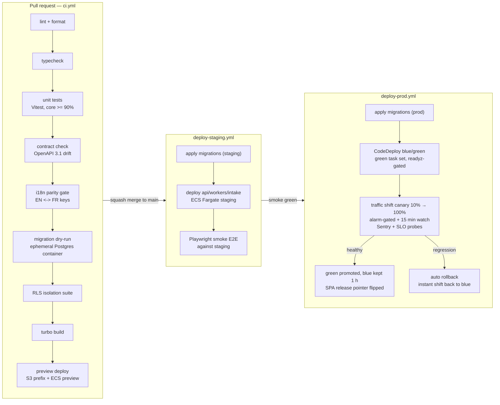

# CI/CD Pipeline

This document defines the branch strategy, the GitHub Actions pipeline (lint → typecheck → tests → contract/i18n gates → migration dry-run → build → smoke E2E), preview deployments, migration gating with expand-and-contract, and the blue-green deploy/rollback procedure for ReadyLoans. It implements ADR-023 (CI/CD & environments, amended 2026-07-23: **blue-green with instant revert**) against the AWS hosting target of ADR-014: GitHub Actions authenticates to AWS via **OIDC** (no long-lived keys); the SPA ships to **S3 + CloudFront** as **versioned releases** (immutable per-SHA prefixes, active release selected by a pointer, rollback = pointer flip + invalidation), and the services ship as Docker images to **ECR** and deploy on **ECS Fargate** via **CodeDeploy blue/green** (two ALB target groups per routed service, canary/linear traffic shifting, CloudWatch-alarm-gated automatic rollback). It also touches ADR-016 (shared Zod schemas), ADR-019 (i18n parity gate), and ADR-026 (migration order). Everything is **Target** state: the legacy tracker has no CI at all — no pipeline, no automated tests in CI, manual deploys, and live service-role/Resend keys committed in the tree (rotation is a migration-day task per ADR-023).

## Table of Contents

1. [Principles](#1-principles)
2. [Branch strategy](#2-branch-strategy)
3. [Pipeline overview](#3-pipeline-overview)
4. [PR checks in detail](#4-pr-checks-in-detail)
5. [Preview deployments](#5-preview-deployments)
6. [Migration gating](#6-migration-gating)
7. [Deploy flow: staging → prod](#7-deploy-flow-staging--prod)
8. [Blue-green traffic shifting, canary watch, and rollback](#8-blue-green-traffic-shifting-canary-watch-and-rollback)
9. [Secrets and supply chain](#9-secrets-and-supply-chain)
10. [Workflow files](#10-workflow-files)

---

## 1. Principles

- **Every prod change is a PR** (ADR-023). No manual deploys, no console edits, no direct pushes to `main`.
- **The pipeline is the release manager.** Merge to `main` deploys staging automatically; prod promotion is automated behind gates, not a human FTP session.
- **Database changes ride ahead of code** via expand-and-contract (§6), so app rollback never requires schema rollback.
- **Gates are binary.** A red i18n-parity check or a failed migration dry-run blocks merge — there is no "merge anyway" path except a documented `ci-override` label requiring an owner-role approval, which itself is audit-logged.

## 2. Branch strategy

Trunk-based development, short-lived branches:

| Rule | Value |
|---|---|
| Default branch | `main` — protected: PRs only, ≥1 approving review, all checks green, linear history (squash merge) |
| Branch naming | `feat/<scope>-<slug>`, `fix/<scope>-<slug>`, `chore/...`, `migration/...` — e.g. `feat/desking-qst-split` |
| Commit style | Conventional Commits (`feat:`, `fix:`, `chore:`, `db:`); enforced by commitlint in CI |
| Branch lifetime | Target < 3 days; anything older gets flagged in the weekly retro |
| Release branches | None — continuous delivery from `main`; emergency fixes are normal PRs (the pipeline is fast enough to be the hotfix path) |
| Versioning | Apps are continuously deployed and identified by git SHA; `packages/*` are internal workspace packages (no npm publishing) |

## 3. Pipeline overview



Turborepo remote caching is enabled so unchanged packages skip their lint/typecheck/test/build steps; a docs-only PR completes in under 2 minutes, a full run in under 12.

## 4. PR checks in detail

| # | Check | Command / tool | Pass condition |
|---|---|---|---|
| 1 | Lint + format | `turbo lint` (eslint 9 flat config + prettier `--check`) | Zero errors; warnings fail on `packages/core` and `packages/db` |
| 2 | Typecheck | `turbo typecheck` (`tsc -b`, TS 5.9 strict — ADR-001) | Zero errors, no `any`-suppressions added (`eslint no-explicit-any` on core packages) |
| 3 | Unit tests | `turbo test` (Vitest) | All green; **coverage ≥ 90% lines/branches on `packages/core`** (desking/tax/commission math — ADR-023); other packages report but don't gate at launch |
| 4 | Contract check | `pnpm --filter contracts generate:openapi` then `git diff --exit-code openapi/v1.json` | Generated OpenAPI 3.1 matches the committed artifact — API changes must ship their contract diff in the same PR (ADR-003) |
| 5 | i18n parity | `pnpm --filter i18n check:parity` | EN and FR resource key sets in `packages/i18n` are identical (missing key = failed build — Bill 96 equivalence, ADR-019); also validates ICU syntax of every message |
| 6 | Migration dry-run | **Ephemeral Postgres 16 container (testcontainers)** spun up inside the CI job (ADR-023, amended 2026-07-24); apply `packages/db/migrations` from zero, then SQL lint | All migrations apply cleanly, forward-only, in order (ADR-008); PRs labeled `migration:risky` or `migration:contract` additionally pass the staging snapshot-restore rehearsal (§6 rule 7) |
| 7 | RLS isolation suite | Vitest suite against the same ephemeral container | For every tenant-scoped table: cross-tenant `SELECT` returns 0 rows, `INSERT` with foreign `tenant_id` is rejected, and `FORCE ROW LEVEL SECURITY` is on; any table missing a policy fails the run (ADR-007) |
| 8 | Build | `turbo build` (Vite 6, Fastify bundles, worker bundles) | All apps build; SPA bundle-size budget: initial JS ≤ 350 KB gzip, any route chunk ≤ 150 KB gzip — exceeding either **fails the build** (frontend-stack.md §9, scalability-performance.md §11) |
| 9 | Secret scan | gitleaks | No secrets in diff (the audit found live keys in tree — never again) |
| 10 | Dependency audit | `pnpm audit --prod` + lockfile check | No critical vulns; `pnpm-lock.yaml` in sync |

Checks 6–7 only run when the PR touches `packages/db` or `packages/schemas` (path filter); everything else runs on every PR.

## 5. Preview deployments

Preview environments follow the ADR-014/ADR-023 model: a per-PR prefix on a dedicated **preview CloudFront distribution** for the SPA, and **ephemeral ECS Fargate services behind the shared ALB** (host-header rules on a wildcard ACM cert `*.preview.readyloans.app`) for the API — created and destroyed by the PR workflow.

| Surface | Mechanism | URL pattern |
|---|---|---|
| SPA | Per-PR build synced to an S3 prefix (`pr-<N>/`) on the preview CloudFront distribution (automatic) | `preview.readyloans.app/pr-<N>/` |
| Database | **Ephemeral Postgres 16 container (testcontainers)** in the CI job for PRs touching `packages/db` — migrations applied from zero, seeded with synthetic tenants (ADR-023, amended 2026-07-24); `preview-api` services point at the **staging RDS instance** (synthetic tenants only) | Container dies with the CI job |
| API | Preview SPA points at **staging** API by default; a `preview-api` label provisions an ephemeral ECS Fargate service behind the shared ALB via a host-header rule (wildcard ACM cert) for PRs that change API behavior needing isolated review; torn down on PR close | `pr-<N>.preview.readyloans.app` |

Preview environments never contain production data; seeds are the synthetic-tenant fixtures from `packages/db/seed` (two orgs, three stores, FR and EN tenants — so reviewers see white-label + i18n behavior on every preview).

## 6. Migration gating

Migrations live in `packages/db/migrations`, are SQL, forward-only, and are applied **by CI before app rollout** in each environment (ADR-023). Rules:

1. **Expand-and-contract for every breaking change.** Example — replacing the legacy dual status axes (`deal_status`/`finance_status`, ADR-009):
   - *Expand* (deploy N): add new column `deals.stage` with CHECK constraint generated from `packages/schemas`; dual-write from application code; backfill script as a BullMQ job.
   - *Migrate reads* (deploy N+1): all reads use `stage`; old columns become write-only mirrors.
   - *Contract* (deploy N+2, ≥1 week later): drop dual-write, then drop old columns. The contract migration ships only after a `SELECT` audit shows zero readers.
2. **No destructive DDL in the same deploy as the code that depends on it.** `DROP`/`ALTER ... TYPE`/`NOT NULL` tightening always land in a later deploy than the code change they finalize.
3. **RLS is part of the migration.** A migration creating a tenant-scoped table must, in the same file: add `tenant_id`/`store_id`, `ENABLE` + `FORCE ROW LEVEL SECURITY`, create policies, and create the composite `(tenant_id, …)` index (ADR-007/008). The RLS isolation suite (§4 check 7) enforces this structurally.
4. **Rollback = roll forward.** There are no down-migrations. If a migration is bad, a new forward migration fixes it. App-level rollback (§8) is always safe because of rule 2.
5. **Prod apply is serialized**: `deploy-prod.yml` takes a migration lock (Postgres advisory lock `pg_advisory_lock(42)`) so two pipelines can't interleave DDL.
6. **Blue and green run simultaneously (decided 2026-07-23).** During a blue/green traffic shift (§7–8) the outgoing and incoming app versions serve live traffic against the same schema at the same time. Rules 1–2 are exactly what makes this safe — every migration is compatible with both the previous and the new release by construction — so **nothing about migration gating changes under blue-green**; the expand-and-contract discipline is the enabler, not a casualty, of instant revert.
7. **Staging snapshot-restore rehearsal for risky changes (ADR-023, amended 2026-07-24).** The CI container (§4 check 6) proves migrations are correct from zero; PRs labeled `migration:risky` or `migration:contract` must also prove behavior on realistic data: the workflow restores the latest automated **staging RDS snapshot** to a temporary instance, applies the migration, runs the RLS isolation suite plus a duration check (flags anything that would exceed the prod lock budget), then destroys the instance. This gate is blocking for those labels and never touches prod.

## 7. Deploy flow: staging → prod

**On merge to `main`:**

1. `deploy-staging.yml` — apply migrations to the staging database (its own RDS instance — `db.t4g.small` Single-AZ in the staging account, ADR-023), deploy the `api`/`workers`/`intake` images from ECR to the **staging ECS cluster** (separate AWS account — ADR-023) using the **same CodeDeploy blue/green mechanics as prod** one size smaller (`AllAtOnce` shifting — staging exercises the target-group swap and rollback machinery, not a simulation), and ship the SPA as a **versioned release** (per-SHA prefix + pointer flip) on the staging distribution.
2. **Staging smoke** — Playwright suite against `app.staging.readyloans.app`: login (Better Auth session), create lead via intake webhook → appears in lead queue, deal board renders with seeded data, locale switch renders FR (`fr-CA` default tenant), PDF generation job completes, `/api/v1` OpenAPI endpoint serves the committed contract. ~6 minutes.
3. **Prod promotion** — smoke green triggers `deploy-prod.yml` against the GitHub `production` environment. The environment carries required-reviewer protection **only** for PRs labeled `migration:contract` (destructive DDL); all other deploys promote automatically — "no manual deploys" (ADR-023) with a human gate reserved for the one irreversible class.
4. Prod sequence: apply migrations → **CodeDeploy blue/green deploy** (`api` first, then `workers`, then `intake` — decided 2026-07-23, ADR-023):
   - **ALB-fronted services (`api`, `intake`):** each service owns **two ALB target groups** (blue = live, green = idle). CodeDeploy starts the **green task set** from the new task definition, gates it on the ECS container check (`/healthz`) and the green target group's check (`/readyz`), then shifts live listener traffic per the configured pattern (§8) with **CloudWatch-alarm-gated automatic rollback** — a firing alarm snaps traffic back to blue in seconds. The blue task set is **retained for 1 hour** after 100% cutover for instant revert, then reaped; the ALB deregistration delay gives in-flight requests a 30 s drain on every shift.
   - **`workers`** (no ALB target — nothing to traffic-shift): task-definition swap with the **ECS deployment circuit breaker + automatic rollback**; BullMQ workers close gracefully so active jobs finish or re-queue (idempotent — ADR-012). Rollback = redeploy of the previous task-definition revision, < 2 minutes.

   Then: canary/traffic-shift watch (§8) → tag release `deploy-<date>-<sha>` and notify Sentry of the release for release-health tracking. Blue-green is the **default and only** prod deploy mode — the earlier "rolling with circuit breaker, blue/green as optional hardening" posture is superseded (ADR-023, amended 2026-07-23).

The prod SPA ships in the same workflow after the API cutover completes, as a **versioned release**: every build is uploaded to an immutable per-SHA prefix (`releases/<sha>/`) in `readyloans-web`; the **active release is a pointer** — CloudFront serves the entry points (`index.html`, release manifest) from the pointer target while hashed static assets are cached immutably. Activation = pointer update + CloudFront invalidation of the entry points (seconds); **rollback = flip the pointer back to the previous SHA + invalidate — instant, no rebuild, no re-upload**. Releases are retained ≥ 30 days. A new SPA never runs against an older API contract (contracts are additive within `/api/v1` — ADR-003).

## 8. Blue-green traffic shifting, canary watch, and rollback

Prod deploys are **CodeDeploy blue/green** (decided 2026-07-23 — ADR-023): the green task set receives real traffic progressively, so the canary is **proportional, not temporal**. Traffic-shifting configuration per service (selectable without code changes):

| Option | Pattern | Use |
|---|---|---|
| `CodeDeployDefault.ECSCanary10Percent5Minutes` | 10% → hold 5 min → 100% | **Default** for `api` and `intake` |
| `CodeDeployDefault.ECSLinear10PercentEvery1Minutes` | +10% per minute to 100% | Larger/riskier releases (PR label `deploy:linear`) |
| `CodeDeployDefault.ECSAllAtOnce` | Immediate 100% | Staging, and emergency-fix deploys only |

**Alarm-gated automatic rollback:** the CodeDeploy deployment group attaches CloudWatch alarms — ALB target-group 5xx rate, unhealthy-host count, target p95 latency, and a Sentry-fed new-`fatal`-issue alarm (pushed to CloudWatch by the ops pipeline). Any alarm firing during the shift **or** the post-cutover bake triggers automatic rollback: **traffic snaps back to the blue target group in seconds** — blue is still running, so revert is a listener re-point, not a redeploy.

**Canary watch job** (`post-deploy-watch`, runs through the traffic shift + 15 min after 100% cutover — inside the 1-hour blue-retention window, so its rollbacks are also instant re-points; polls every 60 s):

| Probe | Source | Rollback trigger |
|---|---|---|
| Error rate | Sentry release health API (new release vs prior release, same window) | > 2× baseline errors, or any new issue tagged `fatal` |
| Crash-free sessions (SPA) | Sentry | < 99.5% |
| API latency | Better Stack probe on `GET /api/v1/health/deep` | p95 > 300 ms for 3 consecutive polls (SLO — ADR-025) |
| Intake ACK | Better Stack probe on `in.readyloans.app/healthz` | p99 > 1 s |
| Queue health | `workers` metrics endpoint | DLQ depth increases during the window |
| Readiness flapping | ECS service events + CloudWatch (task health, ALB target health) | Any task restarts > 2 times |

**Rollback procedure (automated):**

1. **Services, within the blue-retention window (≤ 1 h post-cutover):** CodeDeploy re-points the ALB listener to the **blue target group** — rollback in **seconds**, no redeploy (this is the same action the CloudWatch alarms trigger mid-shift). `workers` (no ALB) redeploys the previous task-definition revision (< 2 minutes; jobs idempotent per ADR-012).
2. **Services, after blue is reaped:** redeploy the **previous image digest** (ECR retains prior images) through the same blue/green pipeline — the old version simply becomes the new green and traffic shifts to it.
3. **SPA:** flip the release pointer back to the previous SHA + CloudFront invalidation — instant (§7).
4. Do **not** revert migrations — §6 rules guarantee the previous app version runs on the expanded schema (the same property that lets blue and green serve simultaneously during a shift).
5. Mark the Sentry release as unhealthy, page on-call (observability.md §8), and open an incident on the Better Stack status page if user-facing.
6. The offending commit is reverted in a normal PR (`git revert`) — `main` must always equal what prod runs after a rollback settles.

Manual rollback is the same procedure invoked via `workflow_dispatch` on `rollback.yml` with a target SHA — instant traffic/pointer revert when the target is still warm (blue retained / release prefix present), previous-digest redeploy otherwise. Still a logged, reviewed pipeline action, not an SSH session.

## 9. Secrets and supply chain

| Concern | Mechanism |
|---|---|
| Secret storage | **AWS Secrets Manager** for runtime secrets, injected into ECS task definitions (api/workers/intake — ADR-014); GitHub Actions environment secrets for the few remaining deploy-time tokens; SPA build-time values are `VITE_`-prefixed publics only. **No secrets in the repo** (ADR-023) |
| Secret classes in Actions | AWS access is via **GitHub OIDC role assumption — no long-lived AWS keys** (ADR-023). Remaining stored secret: `SENTRY_AUTH_TOKEN` (source maps) — scoped per GitHub environment (`staging`, `production`). Migration DB credentials are fetched at run time from **Secrets Manager** through the OIDC-assumed role (ADR-008) — never stored in GitHub |
| Client-side rule | The SPA bundle may contain only `VITE_`-prefixed publishable values (API base URL, Sentry DSN, PostHog key). Service-role keys never reach the SPA build, the S3 buckets, or CloudFront |
| Scanning | gitleaks on every PR + a full-history scan scheduled weekly; push protection enabled on the org |
| Dependencies | pnpm lockfile committed; **Dependabot** (canonical config in security-operations.md §2): security updates daily, version bumps weekly grouped per workspace (`apps/*`, `packages/*`), patch-level security PRs auto-merged after green CI, SHA-pinned GitHub Actions kept current; `pnpm audit --prod` gate; engines pinned (Node 22 LTS) |
| Build provenance | Docker images built in Actions, tagged `sha-<git-sha>`, pushed to **ECR**; ECS task definitions pin the image by digest — the image that passed CI is the image that runs |
| Migration-day task | Rotate the leaked legacy Supabase service-role and Resend keys **before** any prod cutover (ADR-023; audit finding) |

## 10. Workflow files

```
.github/workflows/
  ci.yml              # PR: checks 1–10 of §4 + preview deploy (S3 prefix + optional ECS preview service)
  preview-cleanup.yml # PR close: destroy ECS preview service + ALB rule, delete S3 prefix
                      # (CI database containers die with their job — nothing to clean)
  deploy-staging.yml  # main: migrate + blue/green deploy staging (AllAtOnce) + smoke
  deploy-prod.yml     # staging-smoke success: migrate + CodeDeploy blue/green traffic shift
                      # + canary watch + SPA release pointer flip
  rollback.yml        # workflow_dispatch: instant revert — re-point traffic to blue /
                      # flip SPA release pointer (previous-digest redeploy if blue reaped)
  nightly.yml         # full gitleaks history scan, pnpm audit, stale-branch report,
                      # staging DR probe (restore-check, see reliability-and-cost.md §8)
```

Skeleton of the PR workflow (illustrative — job names are the contract, steps evolve):

```yaml
name: ci
on: pull_request
permissions: { id-token: write, contents: read }   # OIDC to AWS — no long-lived keys (ADR-023)
concurrency: { group: ci-${{ github.ref }}, cancel-in-progress: true }
jobs:
  quality:
    runs-on: ubuntu-latest
    steps:
      - uses: actions/checkout@v4
      - uses: pnpm/action-setup@v4
      - run: pnpm install --frozen-lockfile
      - run: pnpm turbo lint typecheck test build --cache-dir=.turbo
      - run: pnpm --filter contracts generate:openapi && git diff --exit-code openapi/v1.json
      - run: pnpm --filter i18n check:parity
  db-gates:
    runs-on: ubuntu-latest
    steps:
      - uses: actions/checkout@v4
      - uses: dorny/paths-filter@v3   # path gate for §4 checks 6–7
        id: filter
        with:
          filters: |
            db: ['packages/db/**', 'packages/schemas/**']
      - if: steps.filter.outputs.db == 'true'
        run: pnpm --filter db test:migrate   # migration dry-run — testcontainers Postgres 16 (§4 check 6)
      - if: steps.filter.outputs.db == 'true'
        run: pnpm --filter db test:rls       # RLS isolation suite, same container (§4 check 7)
```
