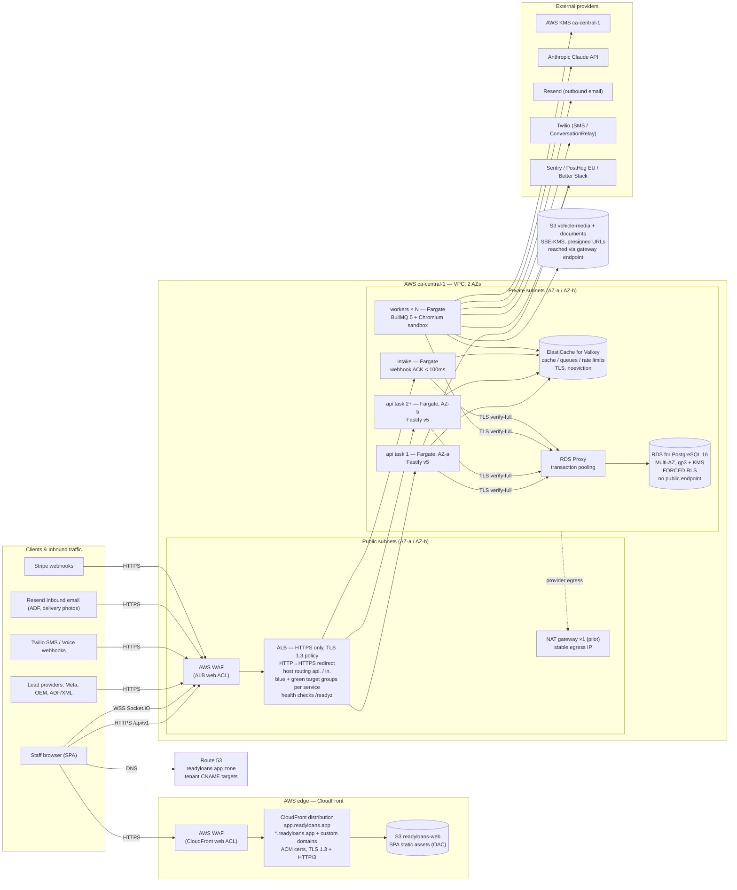
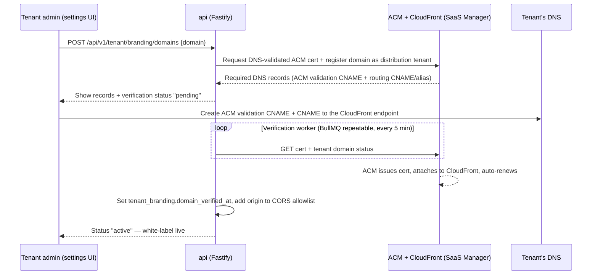

# Hosting Topology

This document defines where every ReadyLoans component runs, how the pieces are wired together across dev/staging/prod, and how white-label tenant domains get automatic TLS. It implements ADR-014 (AWS hosting/LB), ADR-008 (database — Amazon RDS for PostgreSQL 16, amended 2026-07-24), ADR-010 (cache — ElastiCache for Valkey), ADR-015 (encryption in transit), and ADR-018 (white-label domain resolution). Everything below is **Target** state — the legacy tracker runs as a single Express process on port 3001 with no load balancer, queue, cache, or CDN; the few as-is facts that inform the migration are listed in §2.

## Table of Contents

1. [Topology at a glance](#1-topology-at-a-glance)
2. [Legacy baseline (as-is)](#2-legacy-baseline-as-is)
3. [Environments](#3-environments)
4. [Production deployment diagram](#4-production-deployment-diagram)
5. [Compute services](#5-compute-services)
6. [Regions, network, and TLS hops](#6-regions-network-and-tls-hops)
7. [Data plane: Postgres, Valkey, Storage](#7-data-plane-postgres-valkey-storage)
8. [White-label domains and automatic TLS](#8-white-label-domains-and-automatic-tls)
9. [Scaling posture and exit paths](#9-scaling-posture-and-exit-paths)

---

## 1. Topology at a glance

| Layer | Product | Region | Why |
|---|---|---|---|
| SPA static assets + CDN | **S3** bucket `readyloans-web` + **CloudFront** distribution (TLS 1.3, HTTP/3), **ACM** certs | Edge (origin `ca-central-1`) | Per-tenant white-label custom domains with automatic DNS-validated ACM certs — the white-label mechanism (ADR-014, ADR-018) |
| Core API + WS gateway | **ECS Fargate** service `api` (Docker image in ECR, Fastify v5), behind the ALB | `ca-central-1` (Montréal) | Long-lived Node processes required for the Socket.IO realtime gateway (ADR-004, amended 2026-07-24) + BullMQ producers; **min 2 tasks across 2 AZs** (ADR-003, ADR-014) |
| Background workers | ECS Fargate service `workers` (Docker, BullMQ 5) | `ca-central-1` | Queue consumers, PDF/Chromium sandbox, AI pipeline; scaled on queue depth (ADR-012, ADR-021) |
| Lead intake | ECS Fargate service `intake` (Docker) | `ca-central-1` | Sub-100ms webhook ACK surface, isolated blast radius (ADR-005) |
| L7 load balancing + edge security | One **ALB** (HTTPS only, TLS 1.3 policy, HTTP→HTTPS redirect, host routing `api.` / `in.`; **two target groups per routed service — blue/green via CodeDeploy**, decided 2026-07-23) + **AWS WAF** on both CloudFront and the ALB | `ca-central-1` | Managed core rule sets + rate-based rules; complements app-level limits (ADR-011, ADR-014); alarm-gated traffic shifting with instant revert (ADR-023, ci-cd.md §7–8) |
| Cache / queues / rate limits | **ElastiCache for Valkey** (in-VPC, TLS; `cache.t4g.micro` single node at pilot, replica/Multi-AZ before GA) | `ca-central-1` | Sessions, branding cache, BullMQ, token buckets (ADR-010, ADR-011) |
| Postgres | **Amazon RDS for PostgreSQL 16** — Multi-AZ `db.t4g.medium`, **VPC-private** (no public accessibility; security-group ingress only from the ECS task SGs), gp3 storage KMS-encrypted, deletion protection, **RDS Proxy** pooling (ADR-008, amended 2026-07-24) | `ca-central-1` (Montréal) | Law 25 data residency for personal information at rest; single-vendor AWS — the database is unreachable from the internet |
| Realtime | **Socket.IO 4** on the `api` service + `@socket.io/redis-adapter` on Valkey — tenant-namespaced rooms `tenant:{id}:...`, Better Auth session verified on connect (ADR-004, amended 2026-07-24) | `ca-central-1` | WSS through the ALB (WebSocket + stickiness); events emitted from the API/worker layer on writes — no DB change-capture |
| Files / images | **S3** private buckets (`vehicle-media`, `documents`) — SSE-KMS, per-tenant prefixes, presigned URLs only; media variants via CloudFront with origin access control (ADR-013, amended 2026-07-24) | `ca-central-1` | Documents in a stricter bucket class (object lock/retention, no CDN) |
| Field-level key management | AWS KMS (`ca-central-1`) | `ca-central-1` | Envelope encryption CMK for SIN/licence/credit PII (ADR-015) |
| Secrets | AWS **Secrets Manager**, injected into ECS task definitions | `ca-central-1` | No keys in repo (ADR-023) |
| DNS | **Route 53** — `readyloans.app` zone, ACM validation records, tenant CNAME targets | Global | Alias records for CloudFront/ALB (ADR-014) |

Everything — compute **and** data — runs in AWS `ca-central-1` (Montréal): **full Canadian residency**, closing the Q-11 residency concern; the Law 25 cross-border-transfer analysis for the core platform reduces to "none" (ADR-014). The RDS instance lives in the same VPC's private subnets as the app tasks (ADR-008, amended 2026-07-24), so app compute and the database share one region, one network, and one jurisdiction (sub-millisecond RTT, no public database endpoint). The previously documented Railway (`us-east4`) + Vercel topology and the Fly.io alternate were **not chosen** — cheaper and lower-ops, but neither runs platform compute in a Canadian region (see ADR-014, alternatives considered).

## 2. Legacy baseline (as-is)

Facts from the current codebase that the topology must replace:

- Single Express process, `PORT || 3001`, started directly; SPA served by Vite dev server on 5173. No LB, no second instance, no health-check-gated deploys.
- `cors()` mounted with **no origin allowlist** — the new API derives its CORS allowlist from the tenant domain registry (§8.4).
- One Supabase client built with `SUPABASE_SERVICE_ROLE_KEY` for all requests — RLS bypassed everywhere. In the target topology **no service-role key exists at all** — every connection authenticates with Secrets Manager-held RDS credentials and runs under forced RLS (ADR-008, amended 2026-07-24).
- Legacy health check: `GET /api/health` → `{ status: 'ok', timestamp }`. Replaced by the `/healthz` + `/readyz` pair in §5.
- Emails (Resend) and PDF/Excel generation run inline in request handlers — banned by ADR-012; both move to `workers`.
- Live service-role and Resend keys exist in the repo tree — rotated on migration day (ADR-023).

## 3. Environments

Three environments (ADR-023). Promotion is always dev → staging → prod via CI (see ci-cd.md); no environment shares a database, Valkey, bucket, or secret with another. Staging and prod live in **separate AWS accounts**.

| | `dev` | `staging` | `prod` |
|---|---|---|---|
| Web | `http://localhost:5173` (Vite) | `app.staging.readyloans.app` (CloudFront + S3, staging account) | `app.readyloans.app`, `{dealer}.readyloans.app`, tenant custom domains (CloudFront + S3) |
| API | `http://localhost:3000` | `api.staging.readyloans.app` (staging ALB) | `api.readyloans.app` (prod ALB) |
| Intake | `http://localhost:3002` | `in.staging.readyloans.app` | `in.readyloans.app` |
| Postgres | Local Docker Compose Postgres 16 | RDS `db.t4g.small` Single-AZ, `ca-central-1` (staging account) | RDS **Multi-AZ** `db.t4g.medium` + RDS Proxy, `ca-central-1` (prod account) |
| Valkey | Docker `valkey/valkey:8` via `docker compose` | ElastiCache for Valkey `cache.t4g.micro` (staging account) | ElastiCache for Valkey `cache.t4g.micro` at pilot; replica/Multi-AZ before GA |
| AWS | — (local `pnpm dev` via Turborepo) | AWS account `readyloans-staging`: own VPC + ECS cluster, `ca-central-1` | AWS account `readyloans-prod`: VPC + ECS cluster, `ca-central-1` |
| Data | Seed script (`packages/db/seed`) — synthetic tenants only | Seeded synthetic tenants (never prod data; anonymized fixtures only) | Real tenants; Kia Mont-Laurier = tenant #1 (ADR-026) |
| Secrets | `.env.local` (gitignored) | AWS Secrets Manager (staging account) | AWS Secrets Manager (prod account) + AWS KMS |
| Deploy trigger | manual | auto on merge to `main` | auto-promote after staging smoke (ci-cd.md §9) |

Rules:

- Staging mirrors prod topology one size smaller (1× `api` task, 1× `workers` task) so deploy/health-check behavior is exercised, not simulated.
- **Per-PR preview environments** (ADR-014/023, the chosen approach): ephemeral ECS services behind the shared ALB via host-header rules `pr-{n}.preview.readyloans.app` (wildcard ACM cert), plus SPA previews synced to a per-PR S3 prefix on a preview CloudFront distribution — created and destroyed by the PR workflow.
- Migration dry-runs execute against **ephemeral Postgres containers (testcontainers) in CI** per PR, with **staging RDS snapshot-restore rehearsals** for risky changes (ADR-023, amended 2026-07-24; ci-cd.md §6) — never against prod.
- The entire AWS topology is **infrastructure as code (Terraform or CDK) in the monorepo, applied by CI** (ADR-014) — hand-built console resources are banned.
- The status page (`status.readyloans.app`, Better Stack) monitors prod only; staging monitors alert to Slack without paging.

## 4. Production deployment diagram



Notes:

- The SPA never queries the database directly (ADR-002); its only data paths are `api.readyloans.app` and the Socket.IO realtime connection — WSS through the ALB to the `api` tasks, Better Auth session verified on connect, tenant-namespaced rooms `tenant:{id}:...` (ADR-004, amended 2026-07-24).
- `intake` enqueues to BullMQ (Valkey) and returns within 100 ms; all lead processing happens in `workers` as a BullMQ Flow (ADR-005, ADR-012).
- All outbound provider calls (Resend, Twilio, Anthropic) originate from `workers` — never from request handlers (ADR-020).
- S3 traffic (tenant media/documents, offsite backups, SPA deploys from CI) uses the **free S3 gateway endpoint**, bypassing the NAT gateway; Postgres and Valkey traffic never leaves the VPC (RDS Proxy and the RDS instance sit in the private subnets); all other private-subnet egress (providers, ECR pulls, CloudWatch) traverses the single pilot NAT gateway (ADR-014).
- **Blue-green deploys (decided 2026-07-23 — ADR-023):** `api` and `intake` each own **two ALB target groups** (blue = live, green = idle). CodeDeploy starts the green task set, health-gates it on `/healthz` + `/readyz`, shifts listener traffic (canary/linear per ci-cd.md §8), and any attached CloudWatch alarm firing snaps traffic back to blue in seconds; blue is retained 1 hour post-cutover for instant revert. The SPA ships as **versioned S3 releases** with pointer-flip rollback on CloudFront (ci-cd.md §7).

## 5. Compute services

| Service | Image / entry | Tasks (prod pilot) | Task size (start) | Public? | Health checks |
|---|---|---|---|---|---|
| `api` | `apps/api` Dockerfile → ECR, Fastify listens on `$PORT` | **≥2 always-on, spread across 2 AZs** (ADR-014) | 0.5 vCPU / 1 GB | Via ALB — `api.readyloans.app` | ECS container `GET /healthz`; ALB target group `GET /readyz` |
| `intake` | `apps/intake` Dockerfile → ECR | 1 (2 at ≥10 stores) | 0.25 vCPU / 0.5 GB | Via ALB — `in.readyloans.app` | ECS `GET /healthz`; ALB `GET /readyz` |
| `workers` | `apps/workers` Dockerfile → ECR (includes Playwright Chromium) | 1, scaled by queue depth | 0.5 vCPU / 1 GB (raise to 1 vCPU / 2 GB if Chromium/PDF load demands — first scaling knob) | No (no ALB target) | ECS container `GET /healthz` |
| Valkey | **ElastiCache for Valkey** (managed — no task) | 1 node `cache.t4g.micro`; replica + Multi-AZ before GA | — | No (in-VPC only) | ElastiCache-managed |

**ARM64/Graviton images are preferred** (~20% cheaper than x86 Fargate — ADR-014); the Dockerfiles build multi-arch.

Health endpoint contract (replaces legacy `/api/health`):

- `GET /healthz` — liveness. Returns `200 {"status":"ok"}` with **no dependency checks**; used by the ECS container health check to decide task restart.
- `GET /readyz` — readiness. Returns `200` only when: Postgres reachable through RDS Proxy, Valkey `PING` succeeds, and the migration ledger in `packages/db` matches the deployed code's expected head. Returns `503 {"status":"not_ready","failing":["..."]}` otherwise; used by the ALB target group to gate traffic and by ECS rollouts (ci-cd.md §7).
- `GET /api/v1/health/deep` (`api` only) — monitoring-only dependency check returning `{"db":"ok","valkey":"ok","realtime":"ok"}`; probed by Better Stack (observability.md §10) and the deploy canary watch (ci-cd.md §8). Never consulted by ECS or the ALB for restarts or rollout gating — a degraded dependency must page on-call, not trigger a restart loop.

Deploy behavior (decided 2026-07-23 — ADR-023): **CodeDeploy blue/green** for the ALB-fronted services. `api` and `intake` each carry **two ALB target groups**; CodeDeploy launches the replacement (green) task set, requires the ECS container check (`/healthz`) and the green target group's check (`/readyz`) to pass, then shifts live traffic (canary/linear per ci-cd.md §8) with **CloudWatch-alarm-gated automatic rollback** — a firing alarm re-points traffic to the blue task set in seconds, and blue is retained 1 hour post-cutover for instant revert. `workers` (no ALB target — nothing to traffic-shift) deploys as a task-definition swap with the **ECS deployment circuit breaker**; rollback = redeploy of the previous revision. The ALB deregistration delay gives in-flight requests a 30 s drain window on every cutover; workers close BullMQ workers gracefully (`worker.close()`) so active jobs finish or are re-queued (jobs are idempotent per ADR-012, so re-delivery is safe).

## 6. Regions, network, and TLS hops

Network layout (ADR-014): one VPC in `ca-central-1`, two AZs. **Public subnets** hold the ALB and the NAT gateway; **private subnets** hold all Fargate tasks, ElastiCache Valkey, RDS Proxy, and the RDS instance — none has a public endpoint (RDS public accessibility is **off**, ADR-008). Security groups are least-privilege: ALB→`api`/`intake` on the app port only; tasks→Valkey on 6379 only; RDS ingress **only from the ECS task security groups** on 5432. Outbound: the **free S3 gateway endpoint** carries S3 traffic; database traffic never leaves the VPC; everything else (providers, ECR pulls, CloudWatch) egresses via a **single NAT gateway at pilot** — accepted cost and single-AZ egress risk (ADR-014); ECR/CloudWatch/Secrets interface endpoints are deferred until NAT data-processing charges justify them. The NAT's Elastic IP provides a stable egress address for provider allowlists. Postgres is reached through RDS Proxy with `sslmode=verify-full` (AWS RDS CA bundle); human/dev database access exists only via an SSM Session Manager bastion (ADR-008) — there is no other path.

Every hop is TLS 1.2 minimum / 1.3 preferred (ADR-015):

| Hop | Protocol | Enforcement |
|---|---|---|
| Browser → CloudFront | HTTPS (TLS 1.3, HTTP/3) | ACM certs; HSTS + preload on all `readyloans.app` hosts; AWS WAF web ACL |
| CloudFront → S3 origin | HTTPS | Origin Access Control (OAC); bucket blocks all public access |
| Browser → `api.readyloans.app` / `in.readyloans.app` | HTTPS | ALB HTTPS-only listener, TLS 1.3 security policy, HTTP→HTTPS redirect, ACM cert; AWS WAF web ACL |
| ALB → tasks | HTTPS | Re-encrypted to the container (HTTPS target group) inside private subnets |
| Browser → Socket.IO realtime (`api.readyloans.app`) | WSS | Same ALB HTTPS listener/ACM cert; ALB WebSocket support + stickiness (ADR-004) |
| api/intake/workers → RDS Proxy → RDS | Postgres TLS | `sslmode=verify-full`, AWS RDS CA bundle pinned; in-VPC only — never traverses the NAT |
| api/intake/workers → Valkey | Redis TLS (`rediss://`) | ElastiCache in-transit encryption + AUTH token; in-VPC only |
| workers → KMS / Anthropic / Resend / Twilio | HTTPS | Provider-managed; via NAT |
| Tenant custom domain → CloudFront | HTTPS | DNS-validated ACM cert per tenant domain, auto-renewed (§8) |

## 7. Data plane: Postgres, Valkey, Storage

### 7.1 Postgres connections (ADR-008, amended 2026-07-24)

| Path | Port | Mode | Used by | Notes |
|---|---|---|---|---|
| RDS Proxy | 5432 | Transaction pooling | `api`, `intake`, `workers` | Every request/job wraps a transaction that runs `SET LOCAL app.tenant_id / app.user_id / app.store_ids` before queries (ADR-007) — proxy-safe by construction: `SET LOCAL` scopes to the transaction, so multiplexing never bleeds tenant context |
| Direct to instance | 5432 | Session | Migrations (CI), `LISTEN`-based tooling | Small pool (≤3); never used by request paths |

Pool sizing (start), per the canonical figures in database-architecture.md §2 and scalability-performance.md §6: `api` 10 connections/task, `workers` 5/task, `intake` 5. RDS Proxy (~US$23/mo at the t4g classes' 2 vCPUs — reliability-and-cost.md §9) comfortably multiplexes the 2×10 + 1×5 + 5 = 30 client connections at pilot sizing; revisit at the 50-store capacity checkpoint (reliability-and-cost.md §4).

### 7.2 Valkey — ElastiCache (ADR-010, ADR-012)

Configuration is non-negotiable because BullMQ shares the instance; on ElastiCache it is expressed as a custom parameter group + cluster settings:

```
maxmemory-policy noeviction     # parameter group — BullMQ requirement; evicting job keys corrupts queues
transit encryption ENABLED      # TLS only (rediss://); no plaintext listener
AUTH token                      # from Secrets Manager; + tenant-prefixed keyspace t:{tenantId}:...
automatic snapshots (daily)     # ElastiCache backup; see reliability-and-cost.md §6–7 for the recovery model
```

Pilot: single `cache.t4g.micro` node (accepted: node loss empties queues/cache — recovery via the intake request log replay, reliability-and-cost.md §6); **replica + Multi-AZ automatic failover added before GA**; ElastiCache Serverless is the documented alternate if usage stays tiny (ADR-014).

Workloads on the single instance: the BullMQ queue catalog — canonical names per scalability-performance.md §9 — `lead-pipeline` (Flow), `ai-turn`, `voice-orchestration`, `sms`, `email`, `pdf-render`, `excel-export`, `image-process`, `webhook-delivery`, `drip-engine`, `report-schedule`, `billing-usage`, `tenant-lifecycle` (ADR-012); rate-limit buckets (ADR-011); session lookups; tenant branding cache; inventory summaries for the AI agent. Valkey loss degrades performance and delays jobs but never loses correctness-critical data (ADR-010); recovery expectations in reliability-and-cost.md §6.

### 7.3 S3 file storage (ADR-013, amended 2026-07-24)

| Bucket class | Path convention | Access | Serving |
|---|---|---|---|
| `vehicle-media` | `tenant/{tenantId}/inventory/{unitId}/...` | Private (Block Public Access, SSE-KMS); presigned URLs for upload and download | Pre-generated WebP/AVIF `srcset` variants (sharp in workers) served via CloudFront with origin access control; Cloudflare Images stays the documented fallback for on-the-fly transforms |
| `documents` | `tenant/{tenantId}/deals/{dealId}/...` | Private, stricter bucket class — object lock/retention, no CDN | Presigned URLs only, short expiry; immutable PDF snapshots with hashes (ADR-021) |

The legacy anon-writable upload bucket is closed at migration (ADR-013).

## 8. White-label domains and automatic TLS

### 8.1 Domain classes and resolution order (ADR-018)

Tenant resolution, first match wins:

1. **Custom domain** — e.g. `portail.kiamontlaurier.ca` → `tenant_branding` lookup by verified domain.
2. **Subdomain** — `{dealer}.readyloans.app` (wildcard DNS + wildcard ACM cert on CloudFront).
3. **Login org context** — `app.readyloans.app` resolves branding after authentication.

The **API is a single host** (`api.readyloans.app`) for all tenants — tenant identity comes from the session (ADR-006/007), never from the API hostname. Only the web surface is white-labeled per domain.

Custom domains terminate on CloudFront using the **CloudFront SaaS Manager / multi-tenant distribution model** (ADR-014): one distribution configuration, one tenant entry per custom domain, each with its own **DNS-validated ACM certificate** — no per-tenant distribution sprawl.

### 8.2 Custom-domain onboarding flow



Facts: certificates are issued and renewed automatically by **ACM** per domain — renewal is hands-off as long as the tenant keeps the ACM validation CNAME in place; subdomains use a `CNAME` to the CloudFront endpoint; apex domains use a Route 53 **alias record** (if the tenant's zone is on Route 53) or ANAME/CNAME-flattening at their DNS provider (CloudFront has no fixed IP); domains pending verification never resolve tenant data. Cert issuance/renewal failures surface in the tenant's settings UI and in Better Stack monitoring (observability.md §10).

### 8.3 SPA serving

One deployment serves all tenants (ADR-018): CloudFront serves the same `apps/web` bundle from the `readyloans-web` S3 origin on every domain (SPA route fallback to `index.html` via CloudFront error mapping); the SPA reads `window.location.hostname`, calls `GET /api/v1/branding/resolve?host=...` (cacheable, no auth), injects the `tenant_branding` CSS variables before first paint, and renders a neutral skeleton until branding loads.

### 8.4 CORS

The API's CORS allowlist = `app.readyloans.app` + `*.readyloans.app` + every **verified** tenant custom domain, loaded from the domain registry and cached in Valkey with explicit invalidation on domain verification/removal. This replaces the legacy unrestricted `cors()`.

## 9. Scaling posture and exit paths

Scaling triggers, floors, and ceilings live in reliability-and-cost.md §5. Summary: `api` scales horizontally via ECS target-tracking (CPU + ALB request count per target) across 2 AZs; `workers` scale on the BullMQ queue-depth CloudWatch metric; `intake` on ACK latency; Valkey and Postgres scale vertically first.

**Not chosen (ADR-014, alternatives considered):** **Railway** — the previous topology decision — and **Fly.io** remain documented only as rejected alternatives: genuinely cheaper at pilot (~US$40–80/mo vs ~US$192/mo, reliability-and-cost.md §9) and lower-ops, but neither offers a Canadian compute region. The owner explicitly chose AWS, accepting the cost and ops effort for full residency and enterprise credibility.

Documented future exit and hardening paths (**no migration planned** for any of them):

| Component today | Documented path | Trigger / notes |
|---|---|---|
| RDS for PostgreSQL 16 (ADR-008, amended 2026-07-24) | Read replicas on demand; Aurora PostgreSQL `ca-central-1` if write scaling ever demands it | Replica when reporting/exports contend with OLTP (~35–50 stores, ADR-008). The former Supabase→RDS exit path (ADR-014) was **taken 2026-07-24, before build start — zero migration cost**; that exit-path clause is discharged |
| ElastiCache single node (pilot) | Replica + Multi-AZ failover (committed **before GA**); ElastiCache Serverless alternate | Usage-driven (ADR-014) |
| Single NAT gateway (pilot) | Second NAT (one per AZ) + interface endpoints | When NAT data-processing charges or the single-AZ egress risk justify it (ADR-014) |

CodeDeploy blue/green, formerly listed here as optional later hardening, was **adopted 2026-07-23 as the default deploy mode** (ADR-023; §5 above, ci-cd.md §7–8) — it is current state, not a future path.

Nothing in application code changes for any of these moves — the contract is Docker images + environment variables (ADR-014).
