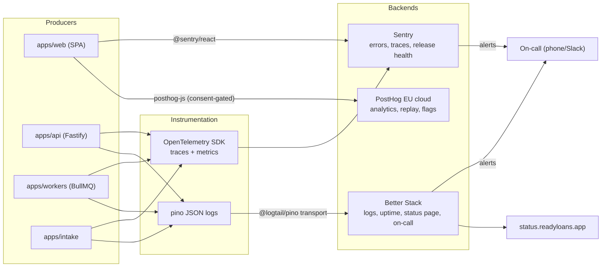
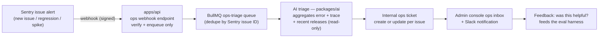

# Observability

This document defines the full telemetry stack for ReadyLoans — Sentry for errors/traces/release health, PostHog EU for consent-gated product analytics, OpenTelemetry for vendor-portable instrumentation, pino structured logs shipped to Better Stack, uptime monitoring and the public status page — plus the SLOs, alert rules, per-tenant dashboard strategy, and the **AI ops assistant** that triages production errors into the admin console (§12, decided 2026-07-23). It implements ADR-025 and depends on ADR-007 (tenant context available on every request), ADR-012 (job telemetry), and ADR-023 (release tagging). All of it is **Target**: the legacy tracker has zero monitoring — no error tracker, no metrics, no log shipping, and its audit trail (`activity_events`) is fire-and-forget console logging on failure.

## Table of Contents

1. [Signal map](#1-signal-map)
2. [Correlation IDs — the non-negotiables](#2-correlation-ids--the-non-negotiables)
3. [Sentry — errors, traces, release health](#3-sentry--errors-traces-release-health)
4. [OpenTelemetry — instrumentation layer](#4-opentelemetry--instrumentation-layer)
5. [Logs — pino → Better Stack](#5-logs--pino--better-stack)
6. [PostHog — product analytics, replay, flags](#6-posthog--product-analytics-replay-flags)
7. [SLOs](#7-slos)
8. [Alerting rules and routing](#8-alerting-rules-and-routing)
9. [Dashboards per tenant](#9-dashboards-per-tenant)
10. [Uptime monitoring and status page](#10-uptime-monitoring-and-status-page)
11. [PII protection and retention](#11-pii-protection-and-retention)
12. [AI Ops Assistant (decided 2026-07-23)](#12-ai-ops-assistant-decided-2026-07-23)

---

## 1. Signal map



One rule governs the whole stack: **every signal carries `tenant_id`, `store_id`, `request_id`, and `trace_id`** so any incident can be sliced per tenant in any backend (ADR-025).

## 2. Correlation IDs — the non-negotiables

| Field | Origin | Propagation |
|---|---|---|
| `request_id` | Fastify `genReqId` — ULID prefixed `req_` (e.g. `req_01J2X9GQ4NV8`; format contract in api-design.md §4/§8 and system-architecture.md §7.1) | Response header `X-Request-Id`; logged on every line; attached to Sentry events; identical value in every error envelope's `request_id` field |
| `trace_id` / `span_id` | OTel W3C `traceparent` | Browser → API via `traceparent` header; API → job via `job.data._otel.traceparent`; job → provider calls via undici instrumentation |
| `tenant_id`, `store_id` | Session (ADR-006) or intake tenant slug (ADR-005) | Fastify request decorator → OTel span attributes `tenant.id`/`store.id` → pino bindings → Sentry tags → PostHog group |
| `actor_id` | Better Auth session user | pino binding + Sentry `user.id` (internal UUID only — never email/name in telemetry) |
| `release` | git SHA (`deploy-<date>-<sha>`, ci-cd.md §7) | Sentry release; `service.version` OTel resource attribute; log field `release` |

A request or job missing tenant context is itself a bug: the API layer rejects unauthenticated business routes, and workers assert `tenant_id` in every payload (ADR-012).

## 3. Sentry — errors, traces, release health

Four Sentry projects, one per app: `readyloans-web`, `readyloans-api`, `readyloans-workers`, `readyloans-intake`. SaaS Team plan (ADR-025); `environment` set to `staging`/`production`.

Configuration values:

| Setting | Web | API / workers / intake |
|---|---|---|
| `tracesSampleRate` | 0.1 prod, 1.0 staging | 0.1 prod, 1.0 staging (parent-based — a sampled browser trace samples its API spans) |
| `profilesSampleRate` | 0 | 0.05 prod (Fastify only) |
| `replaysOnErrorSampleRate` | 0 — session replay lives in PostHog, not Sentry (one replay system, one masking config) | n/a |
| Source maps | Uploaded by CI (`SENTRY_AUTH_TOKEN`), release = git SHA | n/a (server stack traces native) |
| `sendDefaultPii` | `false` | `false` |

**PII scrubbing (`beforeSend`, shared helper in `packages/core/telemetry`):**

- Drop request bodies entirely (`event.request.data = undefined`) — credit-app payloads must never reach Sentry (ADR-025).
- Strip headers: `authorization`, `cookie`, `x-api-key`.
- Field denylist scrubbed from all contexts/extra/breadcrumbs: `sin`, `date_of_birth`, `dob`, `driver_license`, `licence`, `income`, `bank_account`, `void_cheque`, `email`, `phone`, `customer_name`, `address` → replaced with `[Filtered]`.
- Sentry server-side Advanced Data Scrubbing enabled with the same denylist as a backstop.

**Standard tags** on every event: `tenant_id`, `store_id`, `request_id`, `queue` (workers), `job_id` (workers), `source_key` (intake). Release health tracks crash-free sessions per release and feeds the deploy canary watch (ci-cd.md §8).

## 4. OpenTelemetry — instrumentation layer

`@opentelemetry/sdk-node` initialized first-thing in `apps/api`, `apps/workers`, `apps/intake` (ADR-025 — vendor-portable; exporter currently Sentry, swappable without re-instrumenting).

| Target | Instrumentation | Notes |
|---|---|---|
| Fastify | `@opentelemetry/instrumentation-fastify` + http | Route-templated span names (`GET /api/v1/deals/:id`) |
| Postgres | `@opentelemetry/instrumentation-pg` | Statements recorded without parameter values (PII) |
| Valkey | `@opentelemetry/instrumentation-ioredis` | Rate-limiter and cache ops visible in traces |
| BullMQ | Manual: producer injects `traceparent` into `job.data._otel`; worker wrapper opens a consumer span linked to the producer trace | Queue latency = span link delta; every job span carries `queue`, `job.id`, `tenant.id`, `attempt` |
| Outbound HTTP | `@opentelemetry/instrumentation-undici` | Anthropic/Twilio/Resend/Stripe latency per provider |
| Playwright PDF workers | Manual span around render (`pdf.render`, attrs: `template`, `pages`, `tenant.id`) | Slowest job class — watched explicitly |

Resource attributes: `service.name` (`readyloans-api` etc.), `service.version` (git SHA), `deployment.environment`. Custom metrics emitted via OTel metrics API and mirrored as structured log events (Better Stack log-based metrics): `intake_ack_ms`, `ai_first_touch_ms`, `queue_wait_ms{queue}`, `dlq_depth{queue}`, `rate_limit_rejections{layer}`, `webhook_delivery_attempts`.

**Database-side telemetry (ADR-008, amended 2026-07-24):** the RDS instance is monitored through **CloudWatch** (CPU, `DatabaseConnections`, `FreeStorageSpace`, IOPS/throughput against the gp3 baseline, replica lag once a replica exists) and **RDS Performance Insights** on the free 7-day tier — per-query database load by wait state and top-SQL ranking. Performance Insights is the DB-side aggregate view; the pg spans above remain the per-request truth. Both feed the §8 Postgres alerts, and the Performance Insights top-SQL review is part of the weekly ops review (reliability-and-cost.md §10).

## 5. Logs — pino → Better Stack

pino JSON on stdout in every Node app; shipped via `@logtail/pino` transport to Better Stack Logs (ADR-025).

**Base bindings (every line):** `level`, `time` (UTC ISO), `service`, `env`, `release`, `request_id`, `trace_id`, `tenant_id`, `store_id`, `actor_id`.

**Redaction (pino `redact`, censor `[Filtered]`):**

```js
redact: [
  'req.headers.authorization', 'req.headers.cookie',
  '*.password', '*.sin', '*.date_of_birth', '*.driver_license',
  '*.bank_account', '*.income', '*.email', '*.phone', '*.customer_name'
]
```

Levels: `info` in prod (request completion lines, job lifecycle, state changes), `debug` in staging/dev. Request-body logging is banned at every level — the `activity_events` table (ADR-009), not the log stream, is the business audit trail. Slow-query logging: pg instrumentation flags statements > 500 ms as `warn`.

Log-based metrics defined in Better Stack: error-line rate per service, `intake_ack_ms` p99, DLQ events, quiet-hours rejections (compliance signal — a spike means a scheduling bug in the send layer, ADR-020/022).

## 6. PostHog — product analytics, replay, flags

PostHog **EU cloud** (ADR-025 — Law 25 posture; the org already operates on `eu.posthog.com`).

**Consent gating (Law 25):** `posthog-js` initialized with `opt_out_capturing_by_default: true`; `posthog.opt_in_capturing()` fires only after the user grants the "analytics" purpose in the granular consent banner. This applies to staff users too — dealership staff are individuals under Law 25. No consent → no events, no replay, and feature-flag evaluation falls back to bootstrapped flags served by the API (flags must work without analytics consent).

**Group analytics:** two group types — `tenant` (organization) and `store`. Every event carries both groups, enabling per-dealership funnels and adoption dashboards without per-tenant projects.

**Session replay:** enabled with `maskAllInputs: true`, `maskTextSelector: '[data-private]'` (applied to customer-name, finance, and PII-bearing components in `packages/ui`), canvas capture off. Replay is consent-gated with the same purpose as analytics.

**Feature flags:** rollout flags per module during the strangler migration (ADR-026) — e.g. `desking-v2`, `ai-first-touch`, `inventory-command-center` — targeted by `tenant` group so one dealership can pilot a module. Kill switches for the AI layer (`ai-outbound-enabled`) are **not** PostHog flags; they are DB-backed tenant settings (compliance controls must not depend on a third-party flag service).

**Core product events (speed-to-lead is product telemetry, ADR-025):**

| Event | Properties | Fed by |
|---|---|---|
| `lead_created` | `source_key`, `channel`, `language` | intake worker (server-side capture, no consent dependency — no cookies involved) |
| `ai_first_touch_sent` | `latency_ms` (from intake ACK), `channel` | lead-pipeline flow |
| `lead_qualified` / `lead_routed` | `routing_mode` (deterministic/model), `store_id` | routing worker |
| `appointment_booked` | `via` (`ai`/`human`) | booking tool |
| `deal_stage_changed` | `from`, `to` | API |
| `deal_won` | `days_in_pipeline` | API |

Server-side events use `posthog-node` from workers with the tenant group attached; they carry internal UUIDs only, never customer PII.

## 7. SLOs

SLOs from ADR-025 plus derived availability targets. Windows are rolling 30 days; error budgets drive the alert rules in §8.

| SLO | Target | SLI measurement | Error budget / 30d |
|---|---|---|---|
| API availability | 99.9% | Better Stack probe success on `GET /api/v1/health/deep` (60s interval, 3 regions) | 43.2 min |
| API latency | p95 < 300 ms | OTel span duration on `/api/v1/*` excluding exports/AI initiation (those have per-endpoint budgets) | 5% of requests |
| Lead-intake ACK | p99 < 1 s | `intake_ack_ms` metric (measured inside intake, request receipt → 202) | 1% of webhooks |
| AI first touch | < 60 s from intake ACK | `ai_first_touch_ms` (per ADR-005: SLA measured from intake ACK) | 5% of eligible leads. First-touch is exempt from SMS quiet hours by default (`first_touch_quiet_exempt`, compliance-and-quality.md §3); leads deferred because a tenant disabled that exemption are excluded — compliance deferral is not an SLO miss |
| Realtime delivery | < 5 s board update | Synthetic: worker emits a probe event through the Socket.IO layer (ADR-004, amended 2026-07-24); SPA-side canary measures end-to-end delivery latency (staging continuous, prod hourly) | 1% of probes |
| Queue freshness | 95% of jobs start < 30 s after enqueue (email/SMS/AI queues) | `queue_wait_ms` | 5% of jobs |

## 8. Alerting rules and routing

Routing: Better Stack is the alerting hub (uptime + log alerts + heartbeats) and owns the on-call escalation policy; Sentry alerts route into Better Stack incidents via webhook. Severities: **P1 page** (phone/SMS, 24/7), **P2 Slack `#readyloans-alerts`** (business hours follow-up), **P3 weekly review**.

**SLO burn-rate alerts (multiwindow, on API availability + latency):**

| Alert | Condition | Severity |
|---|---|---|
| Fast burn | ≥ 14.4× budget burn over 1 h **and** 5 min | P1 — exhausts 2% of monthly budget in 1 h |
| Slow burn | ≥ 6× over 6 h **and** 30 min | P2 |

**Infrastructure and pipeline alerts:**

| Alert | Condition | Severity |
|---|---|---|
| DLQ non-empty | `dlq_depth > 0` for 5 min on any queue (ADR-012) | P1 for `lead-pipeline`, `webhook-delivery`; P2 others |
| Intake ACK degradation | `intake_ack_ms` p99 > 1 s for 10 min | P1 |
| AI first-touch breach | `ai_first_touch_ms` p95 > 60 s for 15 min | P1 (product SLA) |
| Queue backlog | waiting jobs > 1,000 or oldest wait > 5 min on any queue | P2 → P1 at 30 min |
| Valkey memory | > 80% of `maxmemory` (noeviction ⇒ writes will fail at 100%) | P1 |
| Postgres (RDS CloudWatch) | CPU > 80% 15 min; `DatabaseConnections` > 80% of the RDS Proxy pool; `FreeStorageSpace` < 20% of provisioned; replica lag (when replica exists) > 60 s | P2 |
| Repeatable-job heartbeats | Better Stack heartbeat missed for any scheduled job (drip enrollment 10:00 tenant-local, task-overdue sweep 15 min, DNCL freshness ≤31d — ADR-012/022) | P2; DNCL freshness → P1 (compliance) |
| Cert expiry | Any tenant custom-domain cert < 14 days to expiry without renewal | P2 |
| Webhook delivery failures | Outbound webhook success < 90% over 1 h for any endpoint (ADR-005) | P2 |
| Sentry new-issue spike | New issue > 50 events/h, or any `fatal` | P2 auto, P1 if in canary window (ci-cd.md §8) |
| Rate-limit anomaly | `rate_limit_rejections` for one tenant > 10× its 7-day median | P3 (possible abuse or integration bug) |

Every P1 has a runbook page linked in the alert body (`docs/new/07-infrastructure/runbooks/` — one file per alert, written when the alert is created; an alert without a runbook fails review).

## 9. Dashboards per tenant

Two distinct consumers; do not conflate them:

**Operators (ReadyLoans team)** — slice the shared backends by the tenant fields that §2 guarantees:

| View | Backend | Definition |
|---|---|---|
| Tenant health | Better Stack Logs saved view per tenant: `tenant_id:<uuid> level:error` | Error/latency lines for one dealership |
| Tenant errors | Sentry saved search `tenant_id:<uuid>` per project | Incident triage scope |
| Tenant adoption | PostHog dashboard filtered by `tenant` group | DAU per role, module adoption, speed-to-lead trend, AI containment rate |
| Tenant AI usage | PostHog + Stripe Meters cross-check | `ai_first_touch_sent` counts vs metered billing (ADR-024) — drift alarm at >5% |

**Tenants (dealer principals/GMs)** — never see the observability stack. In-product dashboards are rendered by the SPA from Postgres/`activity_events` via the API (RLS-scoped by construction): speed-to-lead, response SLA attainment, AI conversation outcomes, appointment show rate. A per-tenant white-labeled status page is a deferred option (§10).

## 10. Uptime monitoring and status page

Better Stack monitors (prod), 30 s interval, 3 probe regions (US-East, EU, and nearest-to-Montréal available region):

| Monitor | Type | Alert |
|---|---|---|
| `https://app.readyloans.app` | HTTP 200 + keyword (app shell marker) | P1 |
| `https://api.readyloans.app/healthz` | HTTP 200 | P1 |
| `https://api.readyloans.app/api/v1/health/deep` | HTTP 200 JSON `{"db":"ok","valkey":"ok","realtime":"ok"}` — authenticated synthetic check | P1 |
| `https://in.readyloans.app/healthz` | HTTP 200 | P1 |
| Socket.IO realtime (`wss://api.readyloans.app`) | WSS connect probe (ADR-004) | P2 |
| `status.readyloans.app` itself | External (Better Stack-hosted, static — stays up during origin failure) | — |
| Tenant custom domains | HTTP 200 per verified domain (auto-added by the domain-verification worker, hosting-topology.md §8.2) | P2 |

Public status page at `status.readyloans.app` with components: Web App, API, Lead Intake, AI Assistant, Realtime, Email/SMS delivery. Incident updates are published in **FR and EN** (Bill 96 — the status page is a commercial publication). Scheduled maintenance windows announced ≥48 h ahead. Per-tenant white-label status pages (`status.{dealer-domain}`) are deferred until a dealer group asks.

## 11. PII protection and retention

| Store | Contains | Retention | Law 25 notes |
|---|---|---|---|
| Sentry | Scrubbed errors/traces, internal UUIDs | 90 days | `beforeSend` scrubbing (§3) + server-side scrubbing; DPA on file; no request bodies |
| Better Stack Logs | Redacted structured logs | 30 days | Redaction list (§5); logs are ops data, not the audit trail |
| PostHog EU | Consent-gated events, masked replays | 12 months events, 30 days replays | EU residency; deletion API wired into the DSAR workflow (person deletion by internal UUID) |
| OTel traces (in Sentry) | Span metadata, no parameters | 90 days | pg instrumentation excludes bind parameters |

DSAR integration: the platform's Law 25 data-subject workflow (see compliance specs) fans out deletion to PostHog (`person.delete`) and checks Sentry for user-tagged events. Telemetry stores are listed in the vendor/cross-border register with their PIAs; Sentry and Better Stack host outside Canada, which is acceptable only because the payloads are scrubbed to non-PII by construction — the scrubbing configs in §3/§5 are therefore compliance controls and changing them requires privacy-officer review.

## 12. AI Ops Assistant (decided 2026-07-23)

The platform includes a built-in **AI error assistant** (ADR-022, amended 2026-07-23; FR-AI-020/021) that turns raw production errors into actionable, plain-language guidance for platform admins. It runs on the same **model-agnostic AI layer** as the conversation engine (`packages/ai`; per-task model selection via the eval/A-B harness — FR-AI-019) with **least-privilege, read-only** access to observability data. It annotates incidents; it never replaces the §8 alerting path, and paging severities remain owned by the alert rules.

### 12.1 Pipeline



1. **Trigger** — a Sentry issue-alert webhook (new issue, regression, or event-rate spike) hits a signature-verified endpoint on `apps/api`, which validates and enqueues only (the same async-first rule as lead intake — nothing slow runs in the request handler, ADR-012).
2. **Aggregate** — the `ops-triage` worker (a platform-internal BullMQ queue, additive to the tenant-facing queue catalog) pulls, read-only: the Sentry issue + latest scrubbed event (PII-free by construction, §3), the linked OTel trace, the release history around first-seen (`deploy-<date>-<sha>` tags, recent deploys/rollbacks from ci-cd.md §7–8), and the affected-tenant breakdown from the `tenant_id` tag aggregates.
3. **Triage** — the AI produces: a **plain-language description** (what broke, user-visible impact), a **probable cause** (correlated to a specific release/commit when the evidence supports it — e.g. "first seen 4 min after `deploy-2026-07-23-abc123`"), a **suggested fix or mitigation** (including "roll back via rollback.yml" when release-correlated), **affected tenants/stores**, and a severity suggestion.
4. **File** — creates or updates an **internal ops ticket** keyed by the Sentry issue ID: recurring events update the existing ticket instead of filing duplicates; a regression after resolution reopens it with the new context.
5. **Surface** — ticket + triage land in the **ops inbox in the admin console** (platform-admin RBAC only — see 04-security) and notify `#readyloans-alerts` (P2); P1 paging continues to flow through the §8 rules untouched.

### 12.2 Feedback loop

Every triage card carries **"Was this helpful?"** (helpful / partly / wrong) plus an optional free-text correction. Feedback is stored with the model + prompt version that produced the triage and feeds the `packages/ai` eval harness (FR-AI-019) — ops-triage quality is evaluated, A-B tested, and model-selected like any other AI task.

### 12.3 Admin "describe this screen / guide me" helper

The same layer powers an in-app helper in the admin console: an admin can ask what a screen does, what a setting means, or how to complete a task ("guide me"); answers are generated from the product documentation plus the current route/context — never from tenant business data. Admin-facing only; it shares the guardrails below.

### 12.4 Guardrails (non-negotiable)

| Rule | Enforcement |
|---|---|
| **Read-only** | The assistant's credentials grant read access to Sentry, release metadata, and log-derived aggregates only — no write scopes on any provider, no infra/deploy APIs, no database access beyond its own ops tables. Least privilege is structural, not policy |
| **No secrets/PII in prompts** | Prompt inputs are the already-scrubbed telemetry payloads (§3/§5 scrubbing is a compliance control); the prompt-assembly layer applies the same field denylist as a backstop; secrets stores are never readable by the assistant |
| **Suggestions only** | Output is guidance for a human operator — **never auto-executed** fixes, deploys, rollbacks, or config changes; deploy/rollback authority stays exclusively with the CI/CD pipeline (ci-cd.md §8) |
| **Admin-facing only** | Triage detail appears only in the platform admin console; end users always receive the generic error envelope (04-security/api-security.md §11) — internal diagnostics never leak to tenants or their customers |
| **Tenant slicing, not tenant data** | Affected-tenant reporting uses tag aggregates (`tenant_id` counts per §2), never row-level tenant business data |
