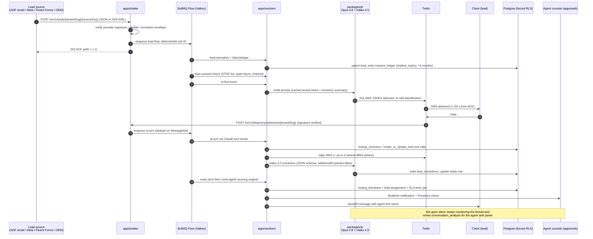

# AI Lead-Automation Layer — Overview

This document defines the ReadyLoans AI lead-engagement system: when a lead arrives via webhook (or ADF email), an AI agent engages within seconds over SMS/chat (voice in Phase 2), qualifies the lead, captures structured data into the CRM, routes it to the best dealership in the network, and then to the best available human agent. This layer is greenfield — the only existing pieces in the legacy codebase are the chatbot spec (`discussions/chatbot-engine-spec.md`), the `conversations`/`messages` tables (`supabase/migrations/20260406_chatbot.sql`), and the unauthenticated lead webhooks (`server/routes/leads.js`, `server/routes/conversations.js`, whose Twilio inbound handler returns empty TwiML with the bot responder marked "handled async" and never built). Everything here conforms to ADR-005 (intake), ADR-012 (jobs), ADR-020 (comms), ADR-022 (AI stack), and ADR-025 (SLOs).

## Table of Contents

1. [Why this layer exists](#1-why-this-layer-exists)
2. [What exists today (as-is inventory)](#2-what-exists-today-as-is-inventory)
3. [Target system at a glance](#3-target-system-at-a-glance)
4. [End-to-end lead journey](#4-end-to-end-lead-journey)
5. [The lead pipeline as a BullMQ Flow](#5-the-lead-pipeline-as-a-bullmq-flow)
6. [Channel matrix](#6-channel-matrix)
7. [SLOs](#7-slos)
8. [Build phases](#8-build-phases)
9. [Document map](#9-document-map)

---

## 1. Why this layer exists

Speed-to-lead is the single highest-leverage variable in automotive lead conversion. The numbers the product is built on (2025–2026 industry benchmarks):

| Statistic | Value |
|---|---|
| Lead contacted within 5 min vs after 30 min | **21x more likely to qualify** |
| Dealerships that respond within 5 minutes | **13.2%** |
| Dealerships taking more than 1 hour | **>75%** |
| Buyers who purchase from the first dealer to call back | **78%** |
| Automotive leads mishandled (missed/unlogged) | **43.2%** |
| Leads that never reach the CRM | **14.1%** |
| Phone-lead vs internet-lead appointment conversion | **74% vs 40%** |

The AI layer's promise: **instant (<60 s) bilingual AI text response to every lead, 24/7**, an AI-assisted or human call within 5 minutes where consent permits, and zero leads lost between webhook and CRM. Speed-to-lead metrics (`response_time_seconds`, contact rate, appointment rate) are first-class product telemetry (ADR-025) and the core sales story against Impel/Podium/Numa — none of which are Canada/Quebec-native or CASL/Law 25-first.

Positioning advantages this layer must exploit (from the competitive research brief):

1. **Quebec-native compliance** — CASL consent ledger, Law 25 s.12.1 disclosures, Bill 96 FR-first conversations are built into the engine, not bolted on.
2. **AI writes into its own system of record** — the agent's tools read real inventory, real agent availability, and real finance products; no CRM integration tax.
3. **Network routing** — Hassan's multi-entity setup (Kia Mont-Laurier + ReadyCar + Riverside Auto Finance) enables cross-dealership "best rooftop, then best agent" routing that single-rooftop competitors cannot do.
4. **Finance-first qualification** — credit-band, income and trade-equity capture feeds Riverside; incumbents are appointment-setters, not finance originators.

## 2. What exists today (as-is inventory)

| Piece | Location | State |
|---|---|---|
| `conversations` table | `supabase/migrations/20260406_chatbot.sql` | Built. Columns: `lead_id`, `contact_id`, `store_id`, `channel` ('sms','web','whatsapp'), `phone_number`, `twilio_sid`, `status` ('bot_active','handed_off','agent_active','closed'), `language` (default 'en'), `assigned_agent_id`, `handed_off_at`, `closed_at`, `bot_summary`, `bot_score`. RLS is `USING(true)` (decorative). |
| `messages` table | same migration | Built. `sender_type` ('client','bot','agent'), `body`, `media_url`, `twilio_sid`, `metadata JSONB`. Append-only, Realtime-enabled. |
| Conversations API | `server/routes/conversations.js` | Built: CRUD, `PUT /:id/handoff` (sets `bot_summary`, `bot_score`), `PUT /:id/close`, `POST /webhook/twilio` inbound SMS. **No Twilio signature validation; bot responder is absent** — inbound messages are stored and an empty TwiML is returned. |
| Lead webhooks | `server/routes/leads.js` | Built: `POST /webhook/fluent` (16-field credit pre-qual, money → cents), `POST /webhook/meta` (6-field via Zapier). **No signature checks, no store defaulting, no dedupe/auto-assign on the webhook paths.** |
| Assignment engine | `server/routes/assignmentRules.js` | Built: rule-priority matching, strategies `round_robin` / `load_balanced` / `source_based`, `max_leads_per_user` caps, `lead_assignment_history` audit. Not store-scoped. |
| Chatbot behavior spec | `discussions/chatbot-engine-spec.md` | Spec only. Language detection (QC area codes 438/514/450/819/873), conversation style rules, required-field collection, 4 handoff triggers, silent monitoring (`chatbot_analysis`), drips, Phase-2 voice. An external "existing custom-coded chatbot (Node.js/Python)" is referenced but is not in this repo. |
| Lead fields for AI | `20260406_leads` migration | Built: `chatbot_engaged/_at`, `chatbot_summary`, `chatbot_handoff_at`, 10-state lead lifecycle incl. `chatbot_engaged`, `nurture_*`, `previous_agents JSONB`, `response_time_seconds`. |

Everything else in this folder is **Target** behavior. Where the legacy spec already defines a rule (language detection, handoff triggers, reassignment timers, business-hours behavior), the rule is documented as-is and carried forward; conflicts resolve in favor of the ADRs.

## 3. Target system at a glance

| Component | Lives in | Responsibility | ADR |
|---|---|---|---|
| Intake service | `apps/intake` | Per-tenant webhook endpoints `/in/v1/leads/{tenantSlug}/{sourceKey}` (JSON + ADF/XML), Resend Inbound email parser, provider signature verification, canonical Lead envelope, consent-basis recording, sub-100 ms ACK, BullMQ enqueue with deterministic dedupe IDs | ADR-005 |
| Lead pipeline workers | `apps/workers` | BullMQ Flow: normalize → dedupe → consent check → AI first-touch → extraction → routing → assignment; drip engine; SLA timers | ADR-012 |
| Conversation engine | `packages/ai` | Claude Opus 4.8 tool-runner conversation (SMS + voice, one brain), Haiku 4.5 structured extraction, prompt caching, guardrails, prompt-injection defense, evals | ADR-022 |
| Voice gateway | `apps/api` (WS endpoint) + `apps/workers` | Twilio ConversationRelay WebSocket ($0.07/min, BYO-Claude), barge-in, voicemail detection, transfer-to-human, recording + transcript → CRM | ADR-020 |
| Routing engine | `apps/workers` + `packages/core` | Deterministic store scoring → agent scoring (availability, skills, language, conversion rate, fairness), reassignment/SLA timers, Law 25 human-review gates | ADR-022 |
| Compliance engine | `packages/ai` + send layer | Consent ledger (6/24-month implied expiry), global STOP, CRTC quiet hours, DNCL ≤31-day freshness, ADAD express-consent gate, first-turn AI disclosure FR/EN | ADR-020/022 |
| Agent console | `apps/web` | Conversation view (thread + handoff divider + MMS), live AI-analysis panel via Socket.IO tenant-room events, takeover controls, Socket.IO presence | ADR-004 |
| Data | `packages/db` | All tables carry `tenant_id` + `store_id`, forced RLS, integer cents, soft deletes | ADR-007/009 |

## 4. End-to-end lead journey

Key phase transitions on the `conversations.status` enum: `bot_active → handed_off → agent_active → drip_active | closed` (the target enum adds `drip_active` to the four statuses in the existing migration, per the legacy chatbot spec).

## 5. The lead pipeline as a BullMQ Flow

Per ADR-012, the lead pipeline is one BullMQ Flow per intake event. All jobs are idempotent with deterministic IDs; redelivered webhooks collapse into the same job.

| Step | Queue | Deterministic job ID | Retry policy | Output |
|---|---|---|---|---|
| Normalize | `lead-pipeline` | `lead:{intakeEventId}:normalize` | 5x, exp backoff 2 s base | Canonical lead envelope → `leads` upsert |
| Dedupe | `lead-pipeline` | `lead:{intakeEventId}:dedupe` | 3x | `is_duplicate`/`duplicate_of` set; duplicate greeting variant selected |
| Consent check | `lead-pipeline` | `lead:{intakeEventId}:consent` | 3x | `consent_ledger` row (implied_inquiry, expires +6 mo); abort flow if suppressed |
| AI first-touch | `ai-conversation` | `lead:{leadId}:first-touch` | 3x, then fallback template | First outbound SMS; `chatbot_engaged_at`, `response_time_seconds` |
| Turn processing | `ai-conversation` | `turn:{conversationId}:{twilioMessageSid}` | 3x | Bot reply + tool side effects |
| Extraction | `ai-extraction` | `extract:{conversationId}:{messageId}` | 3x | `lead_extractions` row; `leads` field write-back |
| Store routing | `routing` | `route:{leadId}:store` | 3x | `routing_decisions` row (stage 'store') |
| Agent assignment | `routing` | `route:{leadId}:agent:{attempt}` | 3x | `leads.assigned_to`, SLA timer scheduled |
| Response SLA timer | `sla` | `sla:agent-response:{leadId}:{attempt}` | delayed job, 10 min | Reassign or escalate (see routing-engine.md §6) |
| Drip steps | `drip-engine` | `drip:{enrollmentId}:{step}` | 3x | Consent-gated scheduled sends |

Intake ACK dedupe key: `intake:{tenantId}:{sourceKey}:{providerLeadId | sha256(payload)}`. Every job payload carries `tenant_id` and `store_id`; per-tenant group limiters prevent one dealership's bulk import from starving others (ADR-012). Each queue has a DLQ with alerting to Better Stack.

## 6. Channel matrix

| Channel | Direction | Phase | Consent basis required | Engine |
|---|---|---|---|---|
| SMS/MMS | Outbound first-touch reply to inbound lead | 1 | Implied (inquiry, 6 months, CASL s.10(9)(b)) | Opus 4.8 conversation |
| SMS/MMS | Ongoing two-way conversation | 1 | Same conversation thread | Opus 4.8 |
| SMS | Drip/nurture campaigns | 1 | Unexpired implied or express; STOP-gated | Templates + Opus personalization |
| Web chat | Website widget | 3 | Terms notice at widget | Same brain, `channel='web_chat'` |
| Voice | Inbound answering, 24/7 | 2 | N/A (they called us); recording notice required | ConversationRelay + Opus 4.8 |
| Voice | Outbound AI call | 2 | **Express consent only (CRTC ADAD)** — "Can our assistant call you now? Reply YES" captured in SMS | ConversationRelay + Opus 4.8 |
| Email | ADF/lead-provider intake, delivery photos | 1 | Inbound only (Resend Inbound) | Parser, not conversational |

## 7. SLOs

Per ADR-025, alerting on burn rate:

| SLO | Target | Measured |
|---|---|---|
| Intake ACK | p99 < 1 s (sub-100 ms design target) | `apps/intake` request duration |
| AI first-touch | < 60 s from intake ACK | `leads.response_time_seconds` (renamed semantics: creation → first AI outbound) |
| SMS turn reply | p95 < 15 s (with 3–8 s humanizing delay included) | `ai.turn` job duration |
| Voice turn latency | p95 < 800 ms, ideal < 500 ms | ConversationRelay round-trip |
| Agent handoff-to-human-reply | 10 min hard SLA before reassignment | `sla:agent-response` timers |
| Extraction lag | < 30 s behind last client message | `ai-extraction` queue depth |

## 8. Build phases

### Phase 1 — MVP: SMS engagement (single store, Kia Mont-Laurier as tenant #1)

| Scope | Detail |
|---|---|
| Intake | `/in/v1/leads/...` JSON + ADF/XML + Resend Inbound; signature verification; BullMQ Flow |
| Conversation | Opus 4.8 tool runner, 7-tool set ([conversation-engine.md §4](./conversation-engine.md), matching ADR-022), FR/EN detection (as-is rules), guardrails, prompt caching |
| Extraction | Haiku 4.5 per-turn structured extraction → `lead_extractions` + `leads` write-back |
| Routing | Single-store; existing 4-criteria agent match (language → online → schedule → load), 10-min reassignment, 3 attempts → sales manager |
| Compliance | Consent ledger, immediate global STOP, first-turn AI disclosure FR/EN, SMS quiet-hours policy |
| Console | Conversation view + live analysis panel + takeover |
| Exit criteria | SLOs green for 2 consecutive weeks on tenant #1; 100% pass on compliance eval suite; zero unlogged leads in reconciliation audit |

### Phase 2 — Voice

| Scope | Detail |
|---|---|
| Inbound | 24/7 AI answering on per-store Twilio numbers via ConversationRelay |
| Outbound | Express-consent-only AI calls (ADAD gate), quiet-hours engine, voicemail detection + SMS fallback |
| Plumbing | Barge-in tuning, warm transfer-to-human, recording + consent announcement, transcript → `messages` (channel `voice_transcript`) + post-call extraction |
| Exit criteria | Voice turn p95 < 800 ms; transfer success rate > 95%; ADAD gate provably blocks unconsented outbound in evals |

### Phase 3 — Full network routing

| Scope | Detail |
|---|---|
| Store scoring | Multi-store deterministic scoring (brand/inventory/geo/hours/ad-spend/performance) |
| Cross-tenant | Network routing across organizations via audited service-role functions only (ADR-007) |
| Model-assist | Opus scoring assist on ambiguous leads; Law 25 s.12.1 human-review workflow for finance-significant routing |
| Ops | Fairness dashboards, per-tenant routing config UI, reassignment analytics, Stripe AI-usage meters (ADR-024) |
| Exit criteria | Two-plus rooftops live with measured lift in contact rate; routing_decisions audit passes Law 25 review |

## 9. Document map

| File | Contents |
|---|---|
| [conversation-engine.md](./conversation-engine.md) | Claude API design: prompts, tools, extraction schema, conversation style, guardrails, injection defense |
| [voice-agent.md](./voice-agent.md) | Telephony pipeline, provider comparison, barge-in, voicemail, transfer, recording consent, transcripts |
| [routing-engine.md](./routing-engine.md) | Store + agent scoring formulas with weights, timers, escalation, data model |
| [compliance-and-quality.md](./compliance-and-quality.md) | CASL/CRTC/Law 25 engine, consent ledger, QA rubric, eval suite, human takeover, red-team cases |
