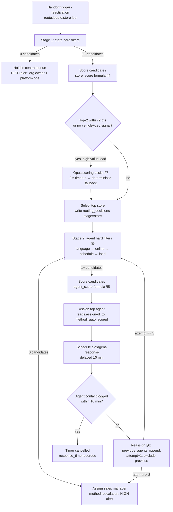

# Routing Engine — Best Dealership, Then Best Available Agent

This document specifies the two-stage routing engine that takes a qualified (or handoff-triggered) lead and selects first the best store (rooftop) in the tenant's network, then the best available human agent — with concrete scoring formulas and weights, round-robin fairness, reassignment and escalation timers, and SLA enforcement. Routing is **deterministic-first with model-assisted scoring only on ambiguous cases**, and any financing-significant automated decision carries the Law 25 s.12.1 human-review path (ADR-022). The legacy system already implements ad-spend-weighted store distribution and a 4-criteria agent match with a 10-minute reassignment timer (`server/routes/assignmentRules.js`, Lead Manager spec §9.2–9.4); those rules are preserved as-is and extended. Runs in `apps/workers` with pure scoring functions in `packages/core` (unit-tested per ADR-023).

## Table of Contents

1. [Scope and principles](#1-scope-and-principles)
2. [Pipeline overview](#2-pipeline-overview)
3. [Stage 1 — store match: hard filters](#3-stage-1--store-match-hard-filters)
4. [Stage 1 — store scoring formula](#4-stage-1--store-scoring-formula)
5. [Stage 2 — agent match: hard filters and scoring](#5-stage-2--agent-match-hard-filters-and-scoring)
6. [Reassignment, escalation and SLA timers](#6-reassignment-escalation-and-sla-timers)
7. [Model-assisted routing and Law 25 human review](#7-model-assisted-routing-and-law-25-human-review)
8. [Data model](#8-data-model)
9. [Configuration and API endpoints](#9-configuration-and-api-endpoints)
10. [Fairness monitoring and metrics](#10-fairness-monitoring-and-metrics)

---

## 1. Scope and principles

| Principle | Rule |
|---|---|
| Deterministic first | Every routing decision is computable from stored data with published weights; the model assists only in the narrow cases of §7 and can only re-rank candidates the deterministic engine produced |
| Two stages | `route:{leadId}:store` selects the rooftop; `route:{leadId}:agent:{attempt}` selects the human. Both write a `routing_decisions` audit row before any side effect |
| As-is preserved | Ad-spend running-tally distribution (Google/Meta separate splits), the language → online → schedule → load agent criteria order, the 10-minute reassignment timer, 3 attempts → sales manager |
| Tenant boundary | Routing operates inside one organization by default. Cross-organization network routing (Kia ML ↔ ReadyCar ↔ Riverside) runs only through the audited service-role functions of ADR-007 and only when both orgs have `network_routing_enabled = true` |
| Explainable | Every decision stores per-candidate factor scores; the agent console and the Law 25 review queue render them verbatim |
| Fail toward humans | Any scoring failure, timeout, or empty candidate set escalates to a human (sales manager → GM), never to silence |

Trigger points for `route:{leadId}:store`: handoff trigger fired in the conversation engine (conversation-engine.md §9), lead reactivation from drip/nurture, `credit_band` change from extraction (re-evaluation), or manual re-route by a manager.

## 2. Pipeline overview



Latency SLO: handoff trigger → agent assigned p95 < 5 s (the client-facing handoff message is sent only after the agent is known, so the bot can name them — as-is behavior).

## 3. Stage 1 — store match: hard filters

A store must pass **all** filters to become a candidate. Filters run as one SQL query in `packages/core/src/routing/storeFilters.ts` against tenant-scoped data (`SET LOCAL app.tenant_id`, ADR-007).

| # | Filter | Rule | Source |
|---|---|---|---|
| 1 | Active tenant/store | `stores.active = true` AND subscription not in dunning read-only state (ADR-024 entitlements) | Target |
| 2 | Intake not paused | `store_routing_config.paused = false` (per-store kill switch for vacations/staff shortage) | Target |
| 3 | Brand eligibility | If extraction says `vehicle.new_or_used = 'new'` and a franchise make (e.g., Kia): store must carry that franchise (`stores.franchise_makes TEXT[]`). Used-vehicle leads pass all stores | Target (extends the used-car-store vs Kia-franchise split already encoded in `bill_of_sale_system`, F&I catalogs, lease availability) |
| 4 | Service area | Lead FSA centroid within `store_routing_config.delivery_radius_km` (default 300; the dealership delivers province-wide, so this is generous by default) — unknown location passes | Target |
| 5 | Language capability | At least one agent at the store with `lead.preferred_language` in `preferred_languages` on today's schedule (prevents routing a FR-locked lead to an EN-only rooftop) | Target, derived from the as-is language-match rule |
| 6 | Network scope | Same organization, unless `network_routing_enabled` on both orgs and the lead consent ledger permits sharing (compliance-and-quality.md §2) | Target (ADR-007) |

Single-store tenants (Phase 1, Kia Mont-Laurier) short-circuit Stage 1: the only store is selected with `method='deterministic'` and a one-candidate decision row — the audit trail exists from day one.

## 4. Stage 1 — store scoring formula

Each surviving candidate gets a score in [0, 100]:

```
store_score = 100 × ( 0.35·inventory_match
                    + 0.20·geo_proximity
                    + 0.15·adspend_deficit
                    + 0.10·hours_openness
                    + 0.10·performance
                    + 0.10·capacity_headroom )
```

Weights live in `routing_config.store_weights JSONB` (per-tenant override, Zod-validated to sum to 1.00 ± 0.001). Factor definitions — every factor is clamped to [0, 1]:

| Factor | Formula | Neutral value when unknown |
|---|---|---|
| `inventory_match` | `min(matching_units, 5) / 5` where matching_units = count of `inventory` rows with `deal_status='available'` at the store matching the extraction's `vehicle.make/model/type/new_or_used` (progressively relaxed: exact model → make → body type) | 0.5 (no vehicle signal yet) |
| `geo_proximity` | `1 − min(distance_km, 300) / 300`; distance = haversine between lead FSA centroid (from postal code, else area-code region centroid) and store lat/lng | 0.5 |
| `adspend_deficit` | `clamp((target_share − actual_share) / target_share, 0, 1)` for the lead's `source_platform` ('google' or 'meta') from `lead_distribution_config` for the current month. Stores with no contribution on that platform → 0 | 0 (organic/manual leads) |
| `hours_openness` | 1.0 if store open now (`stores.hours` + `holiday_calendar`); 0.5 if opening within 2 h; 0.25 otherwise (AI covers 24/7, but human follow-up speed still differs) | — always computable |
| `performance` | `clamp((store_appt_rate − p10) / (p90 − p10), 0, 1)` — trailing-90-day lead→appointment rate normalized against network p10/p90 from `store_routing_stats` | 0.5 (< 30 leads in window) |
| `capacity_headroom` | `1 − open_leads_today / daily_lead_capacity` (default capacity 50, per-store config), floor 0 | — always computable |

**Ad-spend running tally (as-is, preserved verbatim):** `lead_distribution_config` keeps per-store, per-platform, per-month rows (`contribution_amount` cents, `contribution_percentage`, `leads_received`, `actual_percentage`, `UNIQUE(store_id, platform, month)`). After every assignment the store's `leads_received` increments and `actual_percentage` recomputes. In the legacy system this tally *is* the whole algorithm ("assign to the store furthest below its target percentage — running tally, NOT random"); in the target engine it survives as the `adspend_deficit` factor **and** as the first tie-breaker: candidates within 2 points of the top score are re-ranked by raw deficit, then by least-recent `last_lead_assigned_at` (round-robin). The Owner/GM Distribution Dashboard (target vs actual per platform per store, deviation indicator, ad-spend update form, 3-month history) is carried forward unchanged (§9 endpoints).

## 5. Stage 2 — agent match: hard filters and scoring

### 5.1 Hard filters (as-is criteria, same order)

The legacy 4-criteria sequence is preserved exactly, extended with rule-engine and exclusion filters:

| # | Filter | Rule | As-is / Target |
|---|---|---|---|
| 1 | Language match | `lead.preferred_language ∈ users.preferred_languages` (default `{"en"}`) | As-is |
| 2 | Online | Socket.IO presence (connection state + Valkey-backed heartbeats) within **3 minutes** (replaces the legacy 60 s `PUT /api/users/heartbeat` polling, same 3-min threshold — ADR-004) | As-is threshold, Target transport |
| 3 | On schedule | `staff_schedules` row covering now (`day_of_week`, `start_time`–`end_time`, `active`) | As-is |
| 4 | Capacity | active (non-terminal: not `lost`/`converted`/`closed`) assigned leads < `max_active_leads` (default **10**) | As-is |
| 5 | Role and rules | Holds a lead-handling role (`bdc_agent`, `salesperson`, `fi_manager`, `sales_manager`) at the selected store; passes the matching `lead_assignment_rules` row (priority-ordered, `sources` match, `included_users` ∩ / `excluded_users` −, `max_leads_per_user` cap) — the legacy rule engine becomes the tenant-configurable eligibility layer | As-is engine, Target scoping (`tenant_id` added) |
| 6 | Not previously failed | `users.id ∉ lead.previous_agents[].user_id` for this lead | As-is |

If filters 1–6 leave zero candidates: escalate to the sales manager immediately (`assignment_method='escalation'`, HIGH alert) — as-is rule. Outside business hours: assignment is deferred, the bot sets the schedule-aware expectation ("first thing tomorrow morning" / "Monday morning"), and a delayed job re-runs Stage 2 at store opening.

### 5.2 Scoring formula

```
agent_score = 100 × ( 0.30·conversion
                    + 0.25·responsiveness
                    + 0.20·load_headroom
                    + 0.15·fairness
                    + 0.10·skills )
```

Weights in `routing_config.agent_weights JSONB`, same validation. Factors:

| Factor | Formula | Notes |
|---|---|---|
| `conversion` | Bayesian-smoothed appointment rate: `(appointments_90d + 10·network_mean) / (leads_90d + 10)`, min-max normalized across the candidate set | Smoothing (prior weight m=10) protects new agents from a cold-start zero; < 10 leads in window → the prior dominates |
| `responsiveness` | `1 − clamp(median_first_response_minutes_90d / 10, 0, 1)` | 10 min = the response SLA; an agent whose median is 2 min scores 0.8 |
| `load_headroom` | `1 − active_leads / max_active_leads` | Same load-balancing intent as the legacy `load_balanced` strategy |
| `fairness` | `clamp(minutes_since_last_assignment / 240, 0, 1)` | Round-robin pressure: 4 h without an assignment reaches full weight; replaces the legacy `lead_assignment_state.last_assigned_index` cursor with a drift-free time-based cursor |
| `skills` | `matched_skill_tags / required_skill_tags` (1.0 when no tags required) | `users.skill_tags TEXT[]` — `'subprime_finance'`, `'new_vehicle'`, `'commercial'`, `'trade_appraisal'`. Requirements derived from extraction: `credit_band ∈ (subprime, deep_subprime)` → `subprime_finance`; `new_or_used='new'` → `new_vehicle`; `has_trade_in` with lien → `trade_appraisal` |

Legacy strategy compatibility: `round_robin` maps to fairness-dominant weights `{fairness: 0.60, load_headroom: 0.20, conversion: 0.10, responsiveness: 0.10, skills: 0}`; `load_balanced` to `{load_headroom: 0.60, ...}`; `source_based` mappings are honored as a filter-5 pin (mapped user wins if eligible). Tenants migrating from the legacy rules get the equivalent weight preset.

Assignment write: `leads.assigned_to`, `assigned_at = now()`, `assignment_method` ∈ `('auto_language','auto_availability','auto_scored','manual','escalation','reassignment')` (as-is enum + `auto_scored`), `assignment_attempts += 1`, `lead_assignment_history` audit row (as-is), status bump `chatbot_engaged → assigned`, M9 "new lead assigned" notification to the agent, and the sales manager notified of every assignment (as-is).

## 6. Reassignment, escalation and SLA timers

All timers are BullMQ delayed jobs with deterministic IDs (ADR-012) — no cron sweep, no in-process `setTimeout` (the legacy spec's per-minute check is superseded).

### 6.1 Agent-response SLA (10 minutes, as-is)

| Item | Value |
|---|---|
| Timer | `sla:agent-response:{leadId}:{attempt}`, delayed **10 min** from assignment |
| Satisfied by | Any agent-authored outbound in the window: `messages` row with `sender_type='agent'` in the lead's conversation, an outbound `lead_communications` row (call/sms/email), or an answered transfer (`ai_calls.transferred_to`) |
| On satisfaction | Job cancelled; `first_response_seconds` recorded to `agent_routing_stats` |
| On expiry | Lead is **taken away** (not shared): removed from the agent's queue; `previous_agents` appended `{user_id, assigned_at, reassigned_at, reason: "no_response"}` (as-is shape); Stage 2 re-runs excluding all previous agents (`assignment_method='reassignment'`); the first agent is notified "Lead reassigned due to no response"; the sales manager gets a HIGH alert; the timer restarts for the new agent |
| Attempt cap | **3 assignment attempts**; after 3 failures the lead goes directly to the sales manager (`assignment_method='escalation'`) — as-is |
| After hours | The timer never starts outside `staff_schedules`/store hours; a delayed job re-enters Stage 2 at opening (the client already received the schedule-aware expectation message) |

### 6.2 Client-unresponsive cadence (as-is)

Contact attempts on an engaged-but-silent lead: (1) immediate AI SMS at engagement → wait **4 h**; (2) follow-up SMS at **+4 h** → wait **24 h**; (3) next-day SMS (or consented call) → mark unresponsive. After 3 failed attempts: `status='unresponsive'`, nurture drip activates, `nurture_expires_at = now + 90 days`; no engagement in 90 days → `status='expired'`. Any client reply at any point reactivates the lead and re-enters the assignment flow (Stage 2, attempt counter reset). Jobs: `contact-attempt:{leadId}:{n}`, all consent- and quiet-hours-gated (compliance-and-quality.md §3–5).

### 6.3 Escalation matrix

| Event | Action | Alert (tier → recipients) |
|---|---|---|
| No eligible store (Stage 1 empty) | Lead held in central queue, retried every 15 min ×4 | HIGH → org owner + platform ops |
| No eligible agent (Stage 2 empty) | Assign sales manager directly | HIGH → sales manager (as-is) |
| 3 failed assignment attempts | Assign sales manager directly | HIGH → sales manager + GM (as-is H-series `chatbot.handoff_failed` if the SM also fails to respond) |
| Sales manager no response in 10 min | Assign GM | HIGH → GM |
| Reassignment rate > 20% of assignments in a day (per store) | None automatic | MEDIUM → GM (staffing signal) |
| Routing job DLQ entry | Manual replay required | HIGH → platform ops (Better Stack, ADR-025) |
| Law 25 review overdue (> 1 business day) | Decision blocked from auto-execution | HIGH → fi_manager + GM (§7) |

## 7. Model-assisted routing and Law 25 human review

### 7.1 Model assist (narrow, bounded)

Opus 4.8 (`output_config.effort: "medium"`) is invoked **only** when: (a) the top-2 store scores are within 2 points *and* the lead is high-value (`credit_band='prime'` and `timeline ∈ (now, this_week)`), or (b) the extraction has neither a vehicle nor a geo signal (both factors neutral), or (c) cross-organization network routing is in play. The prompt receives only the deterministic candidate list with factor scores and the lead snapshot; the schema-constrained response is `{selected_id, rationale}` where `selected_id` **must** be one of the provided candidates (structured output enum). Timeout 2 s → deterministic top score wins. The decision row records `method='model_assisted'`, `model`, `model_rationale`.

### 7.2 Law 25 s.12.1 gate

| Decision class | s.12.1 significant effect? | Treatment |
|---|---|---|
| Store routing, agent assignment | No (no legal or similarly significant effect on the individual) | Fully automated; disclosure best-practice text available in the privacy policy |
| Referral to the finance arm (Riverside) driven by `credit_band`, auto pre-qualification signals, any decision affecting financing access or terms | **Yes** | `routing_decisions.requires_human_review = true`; the decision is queued, not auto-executed; the client-facing message includes the automated-decision disclosure (compliance-and-quality.md §6); reviewer (`fi_manager` or `gm`) approves/overrides within 1 business day via the review queue; reviewer identity and outcome stored on the decision row |

The classifier is deterministic: `decision_class = 'finance_significant'` iff the routing input set includes `credit_band` or any income/credit field, and the output changes which entity handles financing. This is code, not model judgment.

## 8. Data model

All tables: `tenant_id` + `store_id`, forced RLS, composite `(tenant_id, …)` indexes, soft-delete where mutable (ADR-007/008/009).

```
routing_decisions (
  id UUID PK, tenant_id UUID NOT NULL, store_id UUID,          -- store_id null until stage 'store' resolves
  lead_id UUID NOT NULL FK leads,
  stage TEXT NOT NULL CHECK ('store','agent'),
  attempt INT NOT NULL DEFAULT 1,
  candidates JSONB NOT NULL,        -- [{id, score, factors: {inventory_match: 0.8, ...}}]
  selected_id UUID,                 -- store or user id
  method TEXT NOT NULL CHECK ('deterministic','model_assisted','manual','escalation','fallback','reassignment'),
  decision_class TEXT NOT NULL DEFAULT 'operational' CHECK ('operational','finance_significant'),
  model TEXT, model_rationale TEXT,
  requires_human_review BOOL NOT NULL DEFAULT false,
  reviewed_by UUID FK users, reviewed_at TIMESTAMPTZ, review_outcome TEXT CHECK ('approved','overridden', NULL),
  created_at TIMESTAMPTZ NOT NULL DEFAULT now()
)  -- append-only; indexes (tenant_id, lead_id), (tenant_id, requires_human_review) WHERE reviewed_at IS NULL

agent_routing_stats (               -- maintained by nightly repeatable job routing-stats-rollup
  id UUID PK, tenant_id, store_id, user_id UUID NOT NULL,
  window TEXT NOT NULL DEFAULT '90d',
  leads_assigned INT, appointments_booked INT, deals_converted INT,
  conversion_rate NUMERIC(5,4), median_first_response_seconds INT,
  last_assigned_at TIMESTAMPTZ, computed_at TIMESTAMPTZ,
  UNIQUE (tenant_id, user_id, window)
)

store_routing_stats (same shape at store grain: appt_rate, p10/p90 snapshot, open_leads_today, last_lead_assigned_at)

store_routing_config (
  id UUID PK, tenant_id, store_id UNIQUE,
  paused BOOL NOT NULL DEFAULT false,
  delivery_radius_km INT NOT NULL DEFAULT 300,
  daily_lead_capacity INT NOT NULL DEFAULT 50,
  store_weights JSONB, agent_weights JSONB,    -- null = platform defaults (§4/§5)
  updated_at
)
```

Carried forward with `tenant_id` added and RLS forced: `lead_distribution_config` (as-is columns, cents), `lead_assignment_rules` / `lead_assignment_history` (as-is), `staff_schedules` (as-is), `leads.previous_agents JSONB` / `assignment_attempts` / `assignment_method` (as-is). `lead_assignment_state` (index cursor) is retired in favor of `last_assigned_at` fairness.

## 9. Configuration and API endpoints

All under `/api/v1` (ADR-003), ts-rest + Zod contracts, role-gated:

| Endpoint | Method | Role | Purpose |
|---|---|---|---|
| `/api/v1/routing/config` | GET/PUT | gm, owner | Weights, radius, capacity, pause switch per store |
| `/api/v1/leads/:leadId/routing-decisions` | GET | manager roles | Full decision audit for a lead (factor scores rendered in console) |
| `/api/v1/leads/:leadId/route` | POST | sales_manager+ | Force re-run of Stage 1+2 (`method` stays automatic) |
| `/api/v1/leads/:leadId/assign` | POST | sales_manager+ | Manual override, body `{agent_id}` → `method='manual'` (as-is manual assignment preserved) |
| `/api/v1/routing/review-queue` | GET | fi_manager, gm, owner | Pending `requires_human_review` decisions |
| `/api/v1/routing/decisions/:id/review` | POST | fi_manager, gm | Body `{outcome: 'approved'|'overridden', selected_id?}` |
| `/api/v1/routing/distribution` | GET/PUT | gm, owner | As-is Distribution Dashboard: target vs actual per platform per store, ad-spend updates, 3-month history |
| `/api/v1/routing/fairness` | GET | gm, owner | Fairness metrics (§10) |

Repeatable jobs (ADR-012): `routing-stats-rollup` nightly 02:00 tenant-local; `distribution-month-rollover` on the 1st (new `lead_distribution_config` month rows seeded from prior contributions).

## 10. Fairness monitoring and metrics

First-class telemetry (ADR-025), surfaced on the routing dashboard:

| Metric | Target | Source |
|---|---|---|
| Handoff → agent assigned | p95 < 5 s | `routing` queue OTel spans |
| Assignment → first human response | median < 5 min, SLA 10 min | `sla:agent-response` outcomes |
| Reassignment rate | < 10% of assignments | `previous_agents` writes |
| Escalation-to-manager rate | < 5% | `assignment_method='escalation'` |
| Ad-spend distribution deviation | < 5 pts vs target per platform per store (as-is dashboard threshold) | `lead_distribution_config.actual_percentage` |
| Agent assignment Gini coefficient (per store, weekly) | < 0.25 | `lead_assignment_history` |
| Law 25 review turnaround | 100% < 1 business day | `routing_decisions.reviewed_at` |
| Model-assist share of decisions | < 10% (higher means the deterministic signal is starved — fix extraction) | `method='model_assisted'` ratio |

Every factor-weight change is itself an `activity_events` row (`entity_type='routing_config'`) so fairness regressions are attributable to configuration history.
