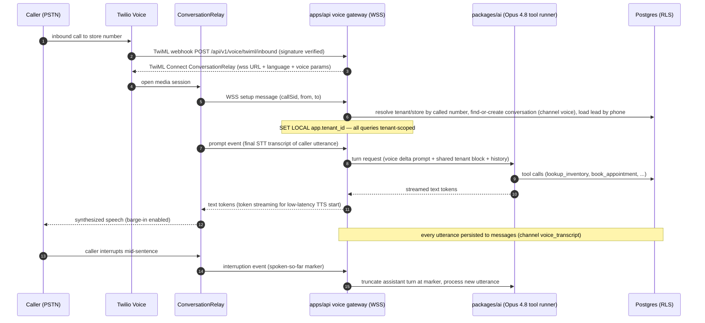

# Voice Agent — Telephony and Realtime Voice Pipeline

This document specifies the Phase-2 voice layer: an AI voice agent that answers inbound calls 24/7 on each store's Twilio number and places outbound calls only under CRTC ADAD express consent, sharing one conversational brain (system prompt core + tool set) with the SMS engine per ADR-020/022. It covers the provider decision with a latency/cost comparison, the realtime media pipeline, barge-in, voicemail detection, transfer-to-human, call-recording consent, and transcript-to-CRM flow. The legacy spec's Phase-2 voice section (platform "to be evaluated: Bland/Vapi/Retell", use-case priority order, voicemail behavior) is superseded by ADR-020 except where noted as carried forward.

## Table of Contents

1. [Provider decision](#1-provider-decision)
2. [Pipeline architecture](#2-pipeline-architecture)
3. [Latency budget](#3-latency-budget)
4. [Barge-in](#4-barge-in)
5. [Voicemail detection](#5-voicemail-detection)
6. [Transfer-to-human](#6-transfer-to-human)
7. [Call recording and consent](#7-call-recording-and-consent)
8. [Transcript to CRM](#8-transcript-to-crm)
9. [Inbound and outbound call flows](#9-inbound-and-outbound-call-flows)
10. [Shared brain with SMS](#10-shared-brain-with-sms)
11. [Configuration and endpoints](#11-configuration-and-endpoints)
12. [Use-case phasing](#12-use-case-phasing)

---

## 1. Provider decision

**Chosen: Twilio ConversationRelay** (ADR-020) — Twilio handles PSTN, STT, TTS, and turn orchestration; we bring Claude Opus 4.8 over a WebSocket. **Telnyx Voice AI is the documented alternate** if voice volume justifies a second telephony vendor on latency/cost grounds. 2026 comparison (from the AI research brief):

| Provider | Architecture | Realistic latency | Cost | Verdict |
|---|---|---|---|---|
| **Twilio ConversationRelay** | BYO-LLM over WebSocket; Twilio STT/TTS/orchestration | Platform p95 161 ms RTT; ~500–800 ms full turn with LLM | **$0.07/min** + Twilio voice minutes + Claude tokens | **Chosen** — same vendor as SMS (one number per store, Conversations API cross-channel memory), BYO-Claude keeps the single brain |
| Telnyx Voice AI | BYO-model on carrier-owned Tier-1 network | **p95 118 ms** RTT (June 2026 independent test, vs Twilio 161 ms) | STT+TTS $0.05/min combined | Documented alternate; escalation trigger below |
| ElevenLabs Agents | Managed full stack (STT+LLM+TTS bundled) | <500 ms first turn; sub-100 ms voice infra claim | $0.08–$0.12/min (up to ~$0.24 at low volume) | Rejected — best-in-class TTS naturalness but a second brain + bundled LLM conflicts with ADR-022 |
| Retell AI | Managed phone-agent platform | Stack-dependent | $0.055–$0.07/min infra; all-in $0.13–$0.31/min | Rejected — managed premium, second brain |
| Vapi | Orchestration layer, BYO everything | ~500–800 ms | $0.05/min platform + pass-through; all-in $0.15–$0.36/min | Rejected — extra orchestration hop over ConversationRelay for no brain benefit |
| OpenAI Realtime (gpt-realtime-2.1 / -mini) | Speech-to-speech model API | 400–600 ms production e2e | Audio in $32/M (~$0.06/min), out $64/M (~$0.24/min); mini $10/M in | Rejected — competing model stack (ADR-022); still needs Twilio/Telnyx for PSTN |

Budget planning figure: **$0.10–$0.20/min all-in** (ConversationRelay $0.07 + Twilio voice ~$0.014 + Claude tokens ~$0.02–$0.05 with caching). Metered per tenant into Stripe AI-minutes meters (ADR-024).

**Telnyx escalation triggers** (any one): sustained voice turn p95 > 800 ms attributable to Twilio media path; voice volume > 50,000 min/mo where Telnyx's carrier pricing materially beats Twilio; Twilio ConversationRelay feature stagnation on FR-CA voices.

## 2. Pipeline architecture



The voice gateway is a Fastify WebSocket route in `apps/api` (long-lived connections require the always-on instances of ADR-014). Turn jobs are processed inline on the gateway (not through BullMQ) because of the latency budget; persistence and post-call work (summarization, extraction) go through BullMQ (`ai-extraction`, `voice-postcall` queues).

## 3. Latency budget

Human-likeness target (research brief): **turn latency < 800 ms, ideal < 500 ms**, measured from caller end-of-speech to first TTS audio.

| Segment | Budget |
|---|---|
| Twilio STT finalization + media | ~150–200 ms |
| WSS hop to gateway (co-located region) | ~20 ms |
| Context assembly (Valkey-cached tenant block, in-memory history for active call) | ~15 ms |
| Claude Opus 4.8 time-to-first-token (prompt-cached prefix, `effort: low`, `max_tokens: 150`) | ~250–400 ms |
| Token streaming → ConversationRelay TTS start | ~100 ms |
| **Total to first audio** | **~535–735 ms** |

Latency tactics: prompt caching on the shared prefix (mandatory); stream tokens to ConversationRelay as generated (never wait for full completion); pre-computed inventory summary (no tool call needed for "what do you have" small talk); **pre-tool speech** — before slow tools (`book_appointment` conflict checks), the agent says a filler line ("Let me check that for you…") emitted immediately while the tool runs. Voice turns emit an OpenTelemetry span `voice.turn` with `stt_ms`, `llm_ttft_ms`, `tts_start_ms` (ADR-025).

## 4. Barge-in

ConversationRelay handles interruption natively with adjustable sensitivity. Configuration:

- Interruption enabled (`interruptible: true`), sensitivity default **medium**; per-tenant override in `tenant_voice_config.barge_in_sensitivity ('low'|'medium'|'high')`.
- On the `interruption` event, the gateway truncates the stored assistant message at the spoken-so-far marker so conversation history reflects **what the caller actually heard**, not what the model generated. The truncated remainder is discarded.
- The prompt's voice delta (§10) instructs short sentences and front-loaded answers so interruptions lose little content.
- Anti-false-trigger: sensitivity `low` recommended for speakerphone-heavy rural callers (Mont-Laurier reality); tuned per tenant from QA review of interruption counts (>4 interruptions/min flags a tuning problem).

## 5. Voicemail detection

Outbound calls only (inbound calls cannot hit voicemail). Twilio **AMD (Answering Machine Detection)** with `machineDetection: 'DetectMessageEnd'`:

| AMD result (`ai_calls.amd_result`) | Behavior |
|---|---|
| `human` | Proceed with the conversation (AI discloses itself in the first utterance, §9) |
| `machine_end_beep` / `machine_end_silence` | Leave the short templated voicemail (FR/EN per lead language, ≤20 s): identify dealership + AI assistant, reference the inquiry, say an SMS is coming; then enqueue an SMS follow-up (as-is rule from legacy spec: "if voicemail: leave brief message, follow up via SMS") |
| `machine_start` (no message opportunity) | Hang up silently; enqueue SMS follow-up |
| `unknown` | Treat as human but flag the call for QA sampling |

Voicemail template sends are logged as `messages` rows (`sender_type='bot'`, `channel='voice_transcript'`, metadata `{voicemail: true}`) and count toward the outbound frequency cap (max 3 outbound contacts/day per lead).

## 6. Transfer-to-human

Triggers: the same handoff triggers as SMS (client asks, high intent, cannot-answer twice, safety) plus voice-specific ones — caller frustration two turns running (`sentiment='frustrated'`), silence >10 s twice, AMD `unknown` misfire suspicion.

Warm-transfer flow:

1. Agent selection runs the routing engine's agent stage (routing-engine.md §5) with hard filter "on a phone-capable device now" (Presence + `users.phone`).
2. AI tells the caller: "Let me connect you with {agent_first_name} — one moment." ConversationRelay session ends with a handoff action; the gateway returns TwiML `<Dial>` to the agent's number with a 20 s timeout and a whisper prompt to the agent ("ReadyLoans transfer: {lead_first_name}, interested in {vehicle_interest}, {score}").
3. Agent answers → calls bridged; `conversations.status='agent_active'`; `ai_calls.transferred_to` set.
4. No answer in 20 s → AI resumes: apologizes, offers a callback (`book_appointment` type `phone_call`) or continues qualifying; fires the H-series alert to the sales manager. During business hours a second candidate agent is tried once before falling back.

## 7. Call recording and consent

Canada is one-party-consent for recording, but PIPEDA and Law 25 require **notice** when a business records; combined with the AI-disclosure obligation this is one sentence at call start.

- Per-tenant toggle `tenant_voice_config.record_calls` (default **true**). When enabled, the first AI utterance includes both disclosures — EN: "Hi, this is {persona_name}, the virtual assistant for {dealership}. Just so you know, this call is recorded for quality." FR: "Bonjour, ici {persona_name}, l'assistant virtuel de {dealership}. À noter que cet appel est enregistré à des fins de qualité." The utterance is templated (not model-generated) so it cannot be skipped; `ai_calls.recording_consent_announced` is set from the send, not the model.
- Caller objects to recording → AI stops recording via Twilio recording API (`recordingStatusCallback` confirms), says so, continues; objection logged in `consent_ledger` (`scope='call_recording'`, revoked).
- Recordings: Twilio dual-channel WAV → fetched by the `voice-postcall` worker → stored in S3 `tenant/{tenantId}/recordings/{callSid}.wav` (private documents bucket class for PII, ADR-013/015) → deleted from Twilio. Retention: 24 months, then purge (aligns with the CASL EBR window); per-tenant override downward only.

## 8. Transcript to CRM

- **Live:** every finalized caller utterance and every AI utterance is inserted into `messages` (`conversation_id` of the voice conversation, `channel='voice_transcript'`, `sender_type` 'client'/'bot', metadata `{call_sid, confidence}`). Agents watching the lead see the transcript stream via Socket.IO tenant-room events (ADR-004) — voice and SMS share one conversation timeline per lead (as-is requirement: "agent sees both in one view").
- **Post-call:** the `voice-postcall` worker runs Haiku 4.5 over the full transcript with the same extraction schema as SMS (conversation-engine.md §5) plus a call summary; writes `lead_extractions`, updates `leads`, and stamps the `ai_calls` row.

`ai_calls` table (Target):

```
ai_calls (
  id UUID PK, tenant_id UUID NOT NULL, store_id UUID NOT NULL,
  conversation_id UUID FK conversations, lead_id UUID FK leads,
  direction TEXT CHECK ('inbound','outbound'),
  twilio_call_sid TEXT UNIQUE, from_number TEXT, to_number TEXT,
  status TEXT CHECK ('queued','ringing','in_progress','completed','failed','no_answer','busy','voicemail'),
  consent_id UUID FK consent_ledger,        -- REQUIRED (NOT NULL) when direction='outbound'
  amd_result TEXT CHECK ('human','machine_start','machine_end_beep','machine_end_silence','unknown', NULL),
  started_at TIMESTAMPTZ, answered_at TIMESTAMPTZ, ended_at TIMESTAMPTZ,
  duration_seconds INT, billable_minutes INT,          -- Stripe meter source
  recording_url TEXT, recording_consent_announced BOOL NOT NULL DEFAULT false,
  transferred_to UUID FK users, transcript_status TEXT CHECK ('pending','complete','failed'),
  summary TEXT, cost_cents INT,             -- integer cents (ADR-009)
  created_at TIMESTAMPTZ DEFAULT now()
)
```

Forced RLS, composite index `(tenant_id, lead_id)`, `(tenant_id, created_at)`.

## 9. Inbound and outbound call flows

**Inbound (24/7):** call to a store number → tenant/store resolved from the called number → known lead (phone match) gets a personalized greeting with existing context; unknown callers get the standard greeting and become a new lead (`source='phone'`). Business hours: AI offers live transfer. After hours: AI qualifies fully and books the next-business-day callback (business-hours behavior mirrors the SMS as-is table).

**Outbound (ADAD-gated):** an outbound AI voice call is an Automatic Dialing-Announcing Device under CRTC rules — **permitted only with prior express consent**. Enforcement is structural: the call-origination worker requires a `consent_ledger` row with `consent_type='express'`, `scope='ai_outbound_call'`, unexpired and unrevoked; `ai_calls.consent_id` is NOT NULL for outbound rows, so an unconsented call cannot even be persisted. Consent is captured in the SMS flow ("Can our assistant call you now? Reply YES" / "Notre assistant peut-il vous appeler maintenant? Répondez OUI") via the `record_consent` tool. All outbound calls additionally pass the quiet-hours engine (weekdays 09:00–21:30, weekends 10:00–18:00, recipient-local) and DNCL/internal-DNC checks (compliance-and-quality.md §3–4). Caller ID is the store's real number; the AI identifies the dealership it calls on behalf of in the first utterance.

## 10. Shared brain with SMS

One qualification state machine, two channels (ADR-020/022). The voice agent reuses prompt blocks 1–3 and the full tool set from conversation-engine.md, with a **voice delta** appended to block 1:

- Spoken register: max ~2 sentences per turn; no emojis, no URLs, no formatting; numbers and times read naturally ("nine to five", not "09:00-17:00"); mileage as "thirty-five thousand kilometres."
- Front-load the answer, then elaborate (barge-in friendly).
- Confirm captured data verbally ("So that's a Sportage, around four hundred a month — did I get that right?") since the caller cannot re-read.
- No MMS: instead of photos, offer "I can text you photos of two or three matches" — which requires SMS consent already implied by the inquiry, and bridges the caller into the SMS thread (same conversation timeline).
- SSML hints allowed for prosody where ConversationRelay supports them; language auto-detection on, locked after the first exchange, Quebec preference question asked verbally for QC area codes (same as-is rule as SMS).

## 11. Configuration and endpoints

| Item | Value |
|---|---|
| TwiML endpoints | `POST /api/v1/voice/twiml/inbound`, `POST /api/v1/voice/twiml/outbound`, `POST /api/v1/voice/status` (call status callbacks), `POST /api/v1/voice/recording-status` — all Twilio-signature verified |
| Media WebSocket | `wss://api.readyloans.app/api/v1/voice/relay/{callSid}` (ConversationRelay target) |
| Call origination | `POST /api/v1/leads/:leadId/calls` (internal, consent-gated; supersedes legacy spec's `POST /api/voice/call/:leadId`) |
| Transcript fetch | `GET /api/v1/calls/:callId/transcript` (supersedes `GET /api/voice/transcript/:callId`) |
| Per-store config | `stores.twilio_number` (as-is), `tenant_voice_config`: `voice_name_fr`, `voice_name_en` (TTS voices), `barge_in_sensitivity`, `record_calls`, `max_outbound_attempts_per_day` (default 1 call), `persona_name` |
| Env/secrets | `TWILIO_ACCOUNT_SID`, `TWILIO_AUTH_TOKEN` (platform), per-tenant subaccount SIDs as tenants scale; `ANTHROPIC_API_KEY` — secret store only (ADR-023) |

## 12. Use-case phasing

The legacy spec's Phase-2 priority order, re-sequenced under the ADAD constraint (the legacy order assumed unrestricted outbound first-contact calling, which is not lawful for Canadian consumers without express consent):

| Priority | Use case | Legacy spec position | Consent posture |
|---|---|---|---|
| 1 | Inbound 24/7 answering | (not in legacy list) | None needed; solves the 28% unanswered-call industry problem |
| 2 | "Call me now" instant callback — lead replies YES in SMS, AI calls within 60 s | Variant of "first contact outbound call" | Express consent captured in-thread (`record_consent`) |
| 3 | Appointment confirmations and delivery-scheduling calls | (implied) | Express consent or EBR + non-solicitation classification; still quiet-hours gated |
| 4 | Cold-lead re-engagement calls (no reply 24 h+) and 3-failed-SMS last attempt | Legacy priorities 2–3 | **Only** for leads with recorded express call consent; otherwise these remain SMS-only |
