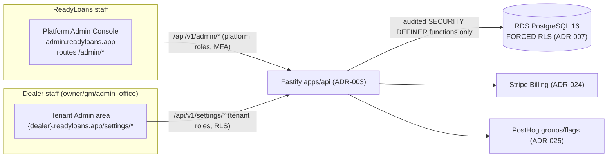
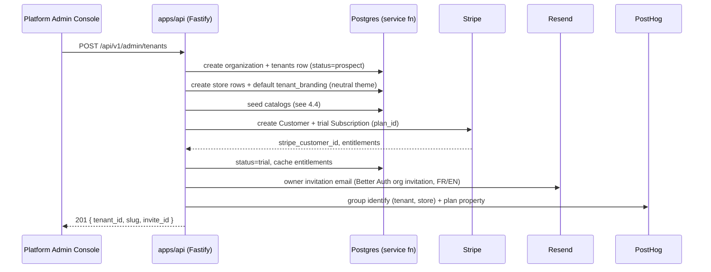

# Admin Console — Platform Super-Admin & Tenant Administration

This document specifies the two administration surfaces of ReadyLoans: the **Platform Admin Console** (internal, for ReadyLoans staff: tenant CRUD/provisioning, plans and feature flags, usage metrics, audited impersonation, announcements, support tooling) and the **Tenant Admin area** (`/settings/*` inside the tenant SPA: stores, users/roles, pipeline configuration, taxes/fees, templates, integrations). Where the legacy Kia Mont-Laurier tracker already implements a behavior it is documented **as it is** (from the analysis briefs and source); everything else is marked **Target** and conforms to the canonical ADRs in `../00-overview/ARCHITECTURE-DECISIONS.md`.

## Table of Contents

1. [Scope & Current State (As-Is)](#1-scope--current-state-as-is)
2. [Console Topology (Target)](#2-console-topology-target)
3. [Platform Staff Roles & Permission Matrix](#3-platform-staff-roles--permission-matrix)
4. [Tenant Lifecycle & Provisioning](#4-tenant-lifecycle--provisioning)
5. [Plans, Entitlements & Feature Flags](#5-plans-entitlements--feature-flags)
6. [Per-Tenant Usage Metrics (Platform View)](#6-per-tenant-usage-metrics-platform-view)
7. [Impersonation with Audit](#7-impersonation-with-audit)
8. [Announcements & Broadcast](#8-announcements--broadcast)
9. [Support Tooling](#9-support-tooling)
10. [Tenant Admin Area (/settings)](#10-tenant-admin-area-settings)
11. [Admin API Endpoint Summary](#11-admin-api-endpoint-summary)
12. [Audit Requirements](#12-audit-requirements)

---

## 1. Scope & Current State (As-Is)

The legacy tracker has **no platform-admin concept and no tenant concept** — only a partial `store_id` column sprinkled across tables. The admin-adjacent surfaces that exist today:

| As-is surface | Behavior today | Gap |
|---|---|---|
| `GET /api/stores`, `GET /api/stores/:id`, `PUT /api/stores/:id` | Store settings CRUD-lite. List projection: `id, name, code, province, tax_rate, city, phone, email, aging_threshold_days, safety_overdue_days, funding_overdue_days, bill_of_sale_system`. No create/delete routes — stores provisioned out-of-band. | **Unauthenticated** — anyone can edit store settings. |
| `POST /api/users/create-account` | The only role-gated endpoint in the codebase: `authenticateUser` + `requireRole('owner','gm','admin_office')`. Creates Supabase auth user (`email_confirm: true`), inserts profile with `store_id = body.store_id \|\| req.user.store_id` (tenant-inheritance rule), compensating delete of the auth user if the profile insert fails. | Password set by the admin, no invitation flow. |
| `GET /api/users`, `PUT /api/users/:id` | Public list of all users; unauthenticated update that allows **role escalation by anyone** (only `auth_id`/`id` are stripped). | Critical security gap (audit: security 1/10). |
| `POST /api/users/login` | Legacy passwordless name+email login, auto-creates users. Marked in code for removal. | Deleted under ADR-006. |
| Settings-flavored pages | `/salespeople`, `/templates`, `/workflows`, `/leads/assignment-rules`, `/leads/scoring-rules`, `/suppliers` — all reachable by every logged-in user (no roles anywhere; `isManager={true}` is hardcoded in `InventoryDetailPage`). | No RBAC. |
| Lender customization | Custom/hidden lenders persisted in browser `localStorage` (`dealTracker_customLenders`, `dealTracker_hiddenLenders`). | Not multi-user safe; moves server-side (Target §10.4). |

Everything below in this document that creates, gates, or audits is **Target** unless explicitly labeled as-is.

## 2. Console Topology (Target)

Two distinct surfaces, one codebase (`apps/web`, ADR-001/002):



Rules:

- **Platform Admin Console** is served on a dedicated host (`admin.readyloans.app`) and gated to members of the reserved platform organization (`org slug = readyloans-platform`) in Better Auth (ADR-006). **MFA (TOTP) is mandatory** for every platform-staff account, no exceptions.
- Platform staff never receive tenant RLS context. All cross-tenant reads/writes go through the **small set of audited `SECURITY DEFINER` service-role functions** mandated by ADR-007 — the console has no generic SQL access.
- **Tenant Admin** lives at `/settings/*` inside the normal tenant SPA, subject to tenant RLS and tenant roles. Minimum role per section is listed in §10.
- Every mutation from either surface emits an `activity_events` row (ADR-009) with `actor_type` = `platform` or `tenant`.

## 3. Platform Staff Roles & Permission Matrix

Platform roles are distinct from the 10 tenant roles (ADR-006). Three platform roles:

| Capability | `platform_super_admin` | `platform_support` | `platform_billing` |
|---|---|---|---|
| Create / suspend / churn tenants | Yes | No | No |
| Edit plans & entitlements | Yes | No | Yes |
| View tenant usage & health | Yes | Yes | Yes |
| Impersonate (read-only mode) | Yes | Yes | No |
| Impersonate (full mode) | Yes | No | No |
| Publish announcements | Yes | Yes (severity `info` only) | No |
| BullMQ DLQ retry / webhook redelivery | Yes | Yes | No |
| Trigger DSAR export for a tenant | Yes | Yes | No |
| Manage Stripe subscription overrides, credits | Yes | No | Yes |
| Manage platform staff accounts | Yes | No | No |

## 4. Tenant Lifecycle & Provisioning

### 4.1 Tenant data model

The tenant is the **Organization** level of the ADR-007 hierarchy (Platform → Organization → Store). Better Auth owns the `organization` row; platform metadata lives in a 1:1 `tenants` table in `packages/db`:

| Column | Type | Notes |
|---|---|---|
| `id` | uuid PK | = Better Auth organization id |
| `slug` | text UNIQUE | Used in subdomain `{slug}.readyloans.app` and intake URLs `/in/v1/leads/{slug}/{sourceKey}` (ADR-005) |
| `legal_name` | text | Appears on invoices, PDFs, consent records |
| `display_name` | text | UI brand name (branding record may override; see `white-labeling.md`) |
| `status` | enum | `prospect \| trial \| active \| past_due \| read_only \| suspended \| churned` |
| `plan_id` | uuid FK → `plans` | |
| `default_locale` | enum `fr-CA \| en-CA` | `fr-CA` for Quebec tenants (ADR-019) |
| `province` | text | Primary province of the organization (drives locale + tax defaults) |
| `stripe_customer_id` | text | ADR-024 |
| `privacy_officer_name` / `privacy_officer_email` | text | Law 25 requirement — see `localization-and-legal.md` |
| `created_at` / `activated_at` / `suspended_at` / `deleted_at` | timestamptz | Soft delete only (ADR-009) |

### 4.2 Status transitions

| From → To | Trigger | Effect |
|---|---|---|
| `prospect → trial` | Provisioning completes | 14-day trial subscription created (ADR-024) |
| `trial → active` | First successful Stripe payment | Full entitlements |
| `active → past_due` | Stripe `invoice.payment_failed` webhook | Dunning emails; UI banner; full functionality retained during grace period (14 days) |
| `past_due → read_only` | Grace period expires | All `POST/PUT/PATCH/DELETE` on business data return `402 PAYMENT_REQUIRED` except billing endpoints; reads, exports and DSAR remain available. **Never data deletion** (ADR-024). |
| `read_only → active` | Payment recovered | Immediate restore |
| `any → suspended` | Platform action (abuse, legal) | Sessions revoked per-tenant (ADR-006); intake webhooks return `410` |
| `suspended/read_only → churned` | Offboarding confirmed | Data export delivered; retention clock starts (see `localization-and-legal.md` §retention) |

### 4.3 Provisioning flow

`POST /api/v1/admin/tenants` — body: `{ legal_name, display_name, slug, province, default_locale, plan_id, owner_email, owner_name, stores: [{ name, code, province, city, timezone }] }`.



Provisioning is **idempotent on `slug`** (retry-safe; a second POST with the same slug returns `409` with the existing tenant id).

### 4.4 Seed catalog (per new tenant)

Defaults are the legacy business data ported into `packages/core`/`packages/db` seeds (ADR-026 — the 7/10 asset):

| Seeded object | Contents (source: legacy as-is values) |
|---|---|
| Fee catalog (per store) | 8 fees: `admin` $0 taxable on; `rdprm` (RDPRM/PPSA lien) $0 non-taxable on; `tire` $12 taxable on; `ac` (A/C excise) $100 non-taxable on; `freight` $0 taxable on; `license` $0 non-taxable on; `regulatory` (AMVIC/OMVIC) $0 off; `fuel` $0 off. Stored in **cents** (ADR-009). |
| F&I product catalog | 40 products in 9 categories with the legacy taxability rules (e.g., `gap` non-taxable, `depreciation` taxable, credit/life insurance non-taxable), all `enabled:false`, cost/price in cents |
| Pipeline stages | The 10 canonical stages (§10.3) with legacy colors and 3/7-day aging thresholds |
| Lost reasons | The 9 legacy reasons (`not_approved`, `changed_mind`, `went_elsewhere`, `ghosted`, `vehicle_unavailable`, `payment_too_high`, `trade_disagreement`, `idv_failed`, `other`) with `name` + `name_fr` |
| Lender list | The default lender catalog (PRIME/NEAR_PRIME/SUBPRIME/CAPTIVE categories) as **tenant-scoped rows**, replacing the legacy per-browser localStorage customization |
| Message templates | Bilingual skeleton templates (email + SMS) with the legacy merge-field set |
| Notification rules | The 10 pre-seeded automation rules from the master plan (lead 5-min SLA, 45-day aging, 5-day safety overdue, 48-h photo, funding 7-day, etc.), all created **inactive** until the tenant enables them |
| Store thresholds | `aging_threshold_days=45`, `safety_overdue_days=5`, `funding_overdue_days=7` (as-is `stores` columns) |

Provisioning seeds **default catalogs only** — it creates no business data. The tenant's existing records (contacts, leads, inventory, open deals from their prior CRM/DMS) enter through the bulk-import pipeline: CSV templates per entity, Zod-validated mapping, dedupe, mandatory dry-run report, BullMQ commit under the tenant's rate-limit bucket, and per-batch CASL consent-basis declaration — see [migrations-operations.md §6.4 Tenant Data Onboarding](../05-database/migrations-operations.md#64-tenant-data-onboarding-external-tenants). Every external rooftop onboarding (ROADMAP Phase 5) runs this pipeline between provisioning and go-live.

## 5. Plans, Entitlements & Feature Flags

### 5.1 `plans` table

| Column | Type | Notes |
|---|---|---|
| `id` | uuid PK | |
| `code` | enum `core \| growth \| scale \| enterprise` | Canonical tier vocabulary — matches `organizations.plan_tier` CHECK (`multi-tenancy.md` §3) and OPEN-QUESTIONS Q-01 |
| `monthly_price_cents_per_store` | integer | Per-rooftop pricing, $300–$800 wedge (ADR-024) |
| `included_seats` | integer | |
| `included_ai_minutes` | integer | Monthly, per rooftop |
| `included_sms_segments` | integer | |
| `included_ai_conversations` | integer | |
| `included_storage_gb` | integer | |
| `features` | jsonb | Boolean feature entitlements (below) |

Reference tiers (Target; final pricing is a business decision recorded in Stripe, not code):

| | Core $300/rooftop/mo | Growth $500 | Scale $800 |
|---|---|---|---|
| Seats | 10 | 25 | Unlimited |
| AI conversations / mo | 200 | 750 | 2,000 |
| AI voice minutes / mo | 0 (SMS-only AI) | 300 | 1,000 |
| SMS segments / mo | 2,000 | 7,500 | 20,000 |
| Custom domain | No | Yes | Yes |
| Outbound webhooks + API access | No | Yes | Yes |
| Wholesale module | No | Yes | Yes |
| Overage | Hard stop | Metered billing | Metered billing |

### 5.2 Entitlements

- Source of truth = the Stripe subscription; `customer.subscription.*` webhooks write a denormalized `tenant_entitlements` record (jsonb on the tenant row) and invalidate the Valkey key `t:{tenantId}:entitlements` (ADR-010).
- **Rate limiting reads the same record** — per-tenant plan quotas are layer 3 of the token-bucket stack (ADR-011).
- Enforcement hooks are specified in `analytics-and-adoption.md` §Billing/plan enforcement.

### 5.3 Feature flags — two kinds, never mixed

| Kind | Store | Examples | Who toggles |
|---|---|---|---|
| **Entitlement flags** (billing-derived) | `plans.features` → `tenant_entitlements` | `custom_domain`, `api_access`, `wholesale_module`, `ai_voice_enabled`, `desking_pdf_import` | Stripe subscription change / platform_billing override |
| **Rollout & experiment flags** | PostHog feature flags, targeted by group `tenant` (ADR-025) | `new-kanban-board`, `ai-first-touch-v2`, `bill-of-sale-v2-template` | Platform staff via PostHog; consumed through a typed wrapper in `packages/ui` |
| **Kill switches** | DB (`platform_settings` table), read every request via LRU cache | `ai_outbound_killswitch`, `sms_send_killswitch`, `webhook_delivery_pause` | `platform_super_admin` only; flipping one emits a Sentry event + Better Stack incident |

## 6. Per-Tenant Usage Metrics (Platform View)

`GET /api/v1/admin/tenants/:id/usage?period=mtd|30d|90d` returns:

| Metric | Source |
|---|---|
| `seats_active`, `dau`, `wau`, `mau` | PostHog group-scoped insights (see `analytics-and-adoption.md`) |
| `leads_ingested`, `deals_created`, `deals_delivered` | Internal counters (`usage_counters` table, §analytics doc) |
| `ai_conversations`, `ai_voice_minutes`, `sms_segments` | Stripe Meters mirror + `usage_counters` (real-time) |
| `storage_bytes` | S3 per-tenant prefix scan (nightly BullMQ repeatable job) |
| `api_calls_mtd`, `rate_limit_429s` | Rate limiter counters in Valkey, flushed hourly to Postgres |
| `intake_ack_p99_ms`, `ai_first_touch_p95_s` | OTel metrics (ADR-025) filtered by `tenant_id` |

The console renders a tenant health card: status, plan, quota consumption bars (80%/100% thresholds), last-7-day error count (Sentry tag `tenant_id`), DLQ depth.

## 7. Impersonation with Audit

Support staff can act as a tenant user only through a controlled impersonation session (Better Auth admin impersonation, ADR-006).

**Session creation:** `POST /api/v1/admin/impersonation-sessions`

```json
{
  "tenant_id": "…", "target_user_id": "…",
  "mode": "read_only",            // read_only | full
  "reason": "Ticket #4812 — deal board not loading for gm",
  "ticket_ref": "SUP-4812"
}
```

Rules:

| Rule | Value |
|---|---|
| `reason` | Required, minimum 20 characters |
| `mode` default | `read_only` (all mutating verbs return `403 IMPERSONATION_READ_ONLY`) |
| `full` mode | Requires `platform_super_admin` |
| Hard TTL | 60 minutes; session cookie carries `impersonation_id`; no refresh |
| UI | Persistent top banner: "Support session — acting as {user} at {tenant} — Ends {time}" with an End button, in the viewer's locale |
| Blocked even in `full` mode | Decrypting field-level-encrypted PII (SIN/licence/banking — ADR-015 decrypt paths reject impersonated sessions), billing changes, user deletion, data export initiation without a DSAR record |
| Tenant notification | Email to the tenant owner on session start (FR/EN per tenant locale); every session visible to the tenant at `/settings/security/support-access` |

**Audit:** `impersonation_sessions` table — `id, platform_user_id, tenant_id, target_user_id, mode, reason, ticket_ref, started_at, ended_at, end_reason (manual|ttl|revoked)`. Every request made during the session writes `activity_events` with `actor_type='platform'` and `impersonation_id`; these events are immutable and excluded from tenant-side deletion.

## 8. Announcements & Broadcast

`platform_announcements` table:

| Column | Type | Notes |
|---|---|---|
| `id` | uuid PK | |
| `severity` | enum `info \| maintenance \| incident \| marketing` | `incident` rows must link the Better Stack status-page incident id |
| `title_en` / `title_fr` / `body_en` / `body_fr` | text | **Both languages required at publish** — API returns `422 MISSING_TRANSLATION` otherwise (Bill 96, ADR-019) |
| `audience` | jsonb | `{"type":"all"}` \| `{"type":"plan","plan_codes":["core"]}` \| `{"type":"tenants","tenant_ids":[…]}` |
| `starts_at` / `ends_at` | timestamptz | Scheduled display window (UTC, rendered tenant-local) |
| `dismissible` | boolean | `maintenance`/`incident` banners are non-dismissible while active |
| `published_by` / `published_at` | | |

Delivery: in-app banner (top of shell) + a row per user in `notifications` (as-is table: `type, title, body, urgency, target_user_id, entity_type='announcement', entity_id`) fanned out by a BullMQ job. Per-user dismissals in `announcement_dismissals (announcement_id, user_id, dismissed_at)`. `marketing` severity is suppressed for tenants in `past_due|read_only`.

## 9. Support Tooling

| Tool | What it does | Backing |
|---|---|---|
| Tenant snapshot | Config, entitlements, seats, integration health (Twilio number status, Resend domain DKIM status, intake endpoint last-seen), recent deploy version | Aggregation endpoint `GET /api/v1/admin/tenants/:id/snapshot` |
| Job inspector | Per-queue depth, failed counts, DLQ browse, single-job retry, bulk requeue — scoped by `tenant_id` payload field | BullMQ (ADR-012); actions audited |
| Webhook delivery log | Outbound deliveries with status/attempts/response codes; manual redelivery button (re-signs with current secret) | ADR-005 delivery log |
| Comms log | Email/SMS sends per tenant with provider status; idempotent resend | Send layer (ADR-020) |
| Error triage | Deep link to Sentry filtered `tenant:{id}`; release health per deploy | ADR-025 |
| DSAR export trigger | Kicks the data-portability export flow for a named individual, recorded in the DSAR register | `localization-and-legal.md` |
| Data corrections | Only through named, audited service-role functions (e.g., `admin_reassign_deal_owner`) — **no SQL console exists in the product** | ADR-007 |

## 10. Tenant Admin Area (/settings)

Navigation and minimum role (roles per ADR-006; a user's effective roles are the union across their memberships):

| Section | Route | Minimum role |
|---|---|---|
| Stores | `/settings/stores` | `owner`, `gm` |
| Users & roles | `/settings/users` | `owner`, `gm`, `admin_office` |
| Pipeline | `/settings/pipeline` | `owner`, `gm` |
| Taxes & fees | `/settings/fees` | `owner`, `gm`, `fi_manager` |
| Templates | `/settings/templates` | `owner`, `gm`, `sales_manager` |
| Automations & scoring | `/settings/automations`, `/settings/scoring-rules`, `/settings/assignment-rules`, `/settings/lost-reasons` | `owner`, `gm`, `sales_manager` |
| Integrations | `/settings/integrations` | `owner` |
| Branding | `/settings/branding` | `owner`, `gm` — see `white-labeling.md` |
| Compliance & legal | `/settings/compliance` | `owner` — see `localization-and-legal.md` |
| Billing & usage | `/settings/billing`, `/settings/usage` | `owner` |
| Security (sessions, MFA, support access) | `/settings/security` | `owner`, `gm` |

Legacy top-nav pages `/templates`, `/workflows`, `/leads/scoring-rules`, `/leads/assignment-rules`, `/salespeople` migrate under `/settings/*` (the day-to-day team page remains at `/team`).

### 10.1 Stores

As-is store config fields are preserved and extended:

| Field | As-is / Target | Notes |
|---|---|---|
| `name`, `code`, `province`, `city`, `phone`, `email` | As-is | |
| `tax_rate` | As-is → **dropped** | Replaced by the platform-owned per-province tax engine writing split `gst_cents/qst_cents/pst_cents/hst_cents` per deal (ADR-009). Tenants cannot edit tax rates. |
| `aging_threshold_days` (45), `safety_overdue_days` (5), `funding_overdue_days` (7) | As-is | Drive alert rules; editable per store |
| `bill_of_sale_system` | As-is | `cams` (Ready Group) \| `merlin` (Kia) \| `internal` — selects document templates |
| `timezone` | Target | IANA tz; quiet-hours engine and "tenant-local" schedules use it (ADR-020) |
| `twilio_number` | Target | One number per store (ADR-020) |
| `adf_email` | Target | Per-store Resend Inbound address for ADF-by-email (ADR-005) |
| `default_locale` | Target | Store-level override of tenant locale (ADR-019) |

Endpoints (Target): `GET/POST /api/v1/stores`, `GET/PUT /api/v1/stores/:id` — tenant-scoped by RLS, role-gated `owner|gm` (the as-is unauthenticated `PUT /api/stores/:id` is not migrated).

### 10.2 Users & roles

- **Role taxonomy (as-is `validRoles`, kept verbatim as the 10 platform roles):** `owner, gm, sales_manager, used_car_manager, fi_manager, salesperson, wholesale_manager, logistics, admin_office, bdc_agent` (ADR-006).
- **Membership model (Target):** `(user, organization, store, roles[])` — additive multi-role; users can span stores/orgs (Hassan's staff span Kia ML / ReadyCar / Riverside).
- **Invitations replace admin-set passwords (Target):** `POST /api/v1/invitations { email, store_id, roles[] }` → Better Auth org invitation email; the as-is `create-account` behavior worth keeping is preserved as rules: role must be in the taxonomy (`400` otherwise), `store_id` defaults to the inviter's store, creation is transactional (the as-is compensating-delete pattern becomes a real transaction).
- **MFA:** TOTP enforced at next login for `owner`, `gm`, `admin_office` (ADR-006).
- **Deactivation:** soft (`deleted_at` on membership); sessions revoked immediately (DB-backed sessions, no stale-JWT window).
- The as-is `salespeople` name-registry table is retired; deals reference `users.id` FKs (`deals.salesperson_id`), per ADR-009's ban on name-ILIKE matching. Commission pay-plan fields (rate, pad, tiers, overrides) move to the `commission_plans` table keyed on `user_id` (values preserved from the legacy 12 pay plans).

### 10.3 Pipeline configuration

As-is (source of truth `client/src/lib/pipeline.js`): 10 fixed stages —

| # | Stage | Color | # | Stage | Color |
|---|---|---|---|---|---|
| 1 | `new` | `#3B82F6` | 6 | `pending_delivery` | `#14B8A6` |
| 2 | `submitted` | `#6366F1` | 7 | `scheduled` | `#10B981` |
| 3 | `approved` | `#06B6D4` | 8 | `delivered` | `#22C55E` |
| 4 | `signed` | `#F59E0B` | 9 | `complete` | `#6B7280` |
| 5 | `sourcing` | `#8B5CF6` | 10 | `lost` | `#EF4444` |

As-is rules preserved: kanban shows stages 1–8 (`complete`/`lost` excluded); aging color per stage-entry timestamp: `<3` days green, `3–7` amber, `>7` red ("rotting"); completion gate `canComplete = delivered_at IS NOT NULL AND funding_status = 'funded'`; funding statuses `not_submitted | submitted | stips_required | funded`.

Target — per-tenant `pipeline_stages` table: `id, tenant_id, key, label_en, label_fr, color, position, aging_amber_days (default 3), aging_red_days (default 7), is_system boolean`. Constraints: system stages `new`, `complete`, `lost` cannot be deleted or renamed (keys are contract for webhooks `deal.stage_changed`); custom stages insert between them; stage keys are immutable after creation; reordering emits `activity_events`. Enum validation lives in `packages/schemas` (ADR-016).

### 10.4 Taxes & fees

- **Tax rates are platform-owned, not tenant-editable.** The per-province engine in `packages/core` (ported from `utils/canadianTaxRates.js`: QC GST 5% + QST 9.975%, ON HST 13%, NS HST 14%, BC/MB no trade-in credit, Section 87 native-status exemption) is versioned with effective dates; tenant admins see a read-only rates page.
- Tenant-editable, per store: **fee catalog** (the 8 seeded fees + custom fees `{label_en, label_fr, amount_cents, taxable, enabled}`), **F&I product catalog** (cost/price cents, taxability, category — seeded 40), **doc/admin fee defaults**, OMVIC $10 auto-fee rule for ON stores (as-is BoS rule).
- **Lenders** (as-is `lenders` table: `name, contact_name, contact_email, contact_phone, rate_sheet_url, avg_turnaround_days, active, store_id`) get full CRUD at `/settings/fees#lenders` (`PUT`/`DELETE` were missing as-is); the localStorage customization dies.

### 10.5 Templates

As-is (`/api/templates` on `message_templates`): `type ∈ {email, sms}`, `subject`, `body`, `category` (default `general`), `is_default`; merge fields `{{first_name}} {{last_name}} {{email}} {{phone}} {{vehicle_interest}} {{monthly_budget}} {{current_vehicle}} {{job_title}} {{address}} {{preferred_language}} {{salesperson_name}}`; unknown placeholders left intact; `preferred_language` defaults to `'fr'`; `POST /api/templates/render` resolves against a lead.

Target changes: bilingual columns `subject_en/subject_fr/body_en/body_fr` (render picks the lead's `preferred_language`, falls back to tenant default); template versioning (`version`, immutable once used in a send — required for CASL evidence); single-default-per-category enforcement (the as-is gap); all sends go through BullMQ with quiet-hours + consent checks (ADR-020/022) — `render` stays read-only.

### 10.6 Integrations

| Integration | Config surfaced at `/settings/integrations` | Reference |
|---|---|---|
| Lead sources | Per-source `source_key`, generated intake URL `/in/v1/leads/{tenantSlug}/{sourceKey}`, shared secret, payload format `json \| adf_xml`, test-ping button, last-received timestamp | ADR-005 |
| ADF email intake | Per-store inbound address + parse log | ADR-005 |
| Outbound webhooks | Endpoint URL, subscribed events (`lead.created`, `deal.stage_changed`, …), current + next secret (dual-secret rotation), delivery log with redelivery | ADR-005 |
| E-sign | Provider per document type: `docusign \| onespan \| wet_ink` (as-is `signing_method` vocabulary) | Document Manager spec |
| Bill-of-sale system | `cams \| merlin \| internal` per store (as-is field) | §10.1 |
| Telephony | Twilio number per store, voice AI on/off (entitlement-gated), quiet-hours preview | ADR-020 |
| Email sending | Per-tenant sending domain + DKIM records status (Resend) | ADR-020 |
| Accounting export | Supplier bookkeeping fields already exist as-is (`default_expense_type`, `default_account`, `posted`, `tax_exempt` on `suppliers`) — export target config (CSV now; QuickBooks connector later) | |

## 11. Admin API Endpoint Summary

All Target, contract-first ts-rest + Zod under `/api/v1` (ADR-003, ADR-016):

| Method + Path | Role | Purpose |
|---|---|---|
| `POST /api/v1/admin/tenants` | platform_super_admin | Provision tenant (§4.3) |
| `GET /api/v1/admin/tenants?status=&plan=&q=` | any platform role | Tenant directory |
| `GET /api/v1/admin/tenants/:id/snapshot` | any platform role | Health snapshot |
| `GET /api/v1/admin/tenants/:id/usage` | any platform role | §6 |
| `PATCH /api/v1/admin/tenants/:id` | platform_super_admin | Status transitions, plan override |
| `POST /api/v1/admin/impersonation-sessions` / `DELETE …/:id` | per §7 | Impersonation |
| `POST /api/v1/admin/announcements` / `PATCH …/:id` | per §8 | Broadcast |
| `GET /api/v1/admin/queues/:name/dlq` / `POST …/retry` | super_admin, support | Job inspector |
| `GET /api/v1/settings/stores` … | tenant roles per §10 | Tenant admin CRUD |
| `GET /api/v1/branding` | public (host-resolved) | See `white-labeling.md` |

## 12. Audit Requirements

- Every mutation in both consoles writes `activity_events` (append-only, tenant-scoped where applicable): `id, tenant_id, store_id, actor_type (tenant|platform|system|ai), actor_id, impersonation_id, event (e.g. settings.pipeline_stage.updated), entity_type, entity_id, before jsonb, after jsonb, created_at` (ADR-009).
- Platform-actor events are visible to the tenant (transparency) except `suspended`-status investigations flagged `restricted`.
- Retention: audit events follow the tenant's retention schedule but never less than 24 months (PIPEDA breach-record minimum; see `localization-and-legal.md`).
- The impersonation register (§7) and announcement history (§8) are immutable.
