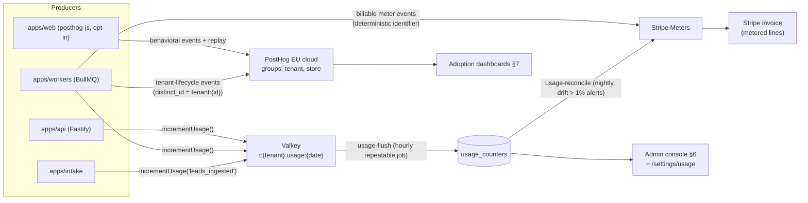

# Analytics & Adoption — Per-Tenant Usage Analytics, North-Star Metrics, Billing Enforcement

This document specifies how ReadyLoans measures itself: the two-plane telemetry architecture (consent-gated PostHog behavioral analytics per ADR-025 vs. non-behavioral operational usage counters that feed billing per ADR-024), the event taxonomy, the `usage_counters` metering pipeline referenced by `admin-console.md` §6, platform and tenant adoption dashboards, the north-star metric tree, and the concrete billing/plan enforcement hooks referenced by `admin-console.md` §5.2. As-is behavior of the legacy Kia Mont-Laurier tracker is labeled; everything else is Target and conforms to the canonical ADRs in `../00-overview/ARCHITECTURE-DECISIONS.md`.

## Table of Contents

1. [Scope & Current State (As-Is)](#1-scope--current-state-as-is)
2. [Telemetry Architecture — Two Planes](#2-telemetry-architecture--two-planes)
3. [PostHog Configuration](#3-posthog-configuration)
4. [Event Taxonomy](#4-event-taxonomy)
5. [Consent Gating (Law 25) & Coverage Effects](#5-consent-gating-law-25--coverage-effects)
6. [usage_counters — Internal Metering Pipeline](#6-usage_counters--internal-metering-pipeline)
7. [Adoption Dashboards](#7-adoption-dashboards)
8. [North-Star Metrics & Metric Tree](#8-north-star-metrics--metric-tree)
9. [Billing & Plan Enforcement Hooks](#9-billing--plan-enforcement-hooks)
10. [Quota Notifications & Lifecycle Automation](#10-quota-notifications--lifecycle-automation)

---

## 1. Scope & Current State (As-Is)

Two different things are called "analytics" around this product. This document covers **platform telemetry** (how ReadyLoans measures tenant usage, adoption, and billable consumption). The **tenant-facing business reporting** built into the product is a product feature specified in the reporting module docs — its as-is state is summarized here only to draw the boundary:

| As-is surface | Behavior today | Disposition |
|---|---|---|
| `GET /api/reports/*` — 4 report types (sales performance, commissions, financial summary, inventory pipeline) with PDF/Excel export | Business reporting with real formulas (per-person gross = `sale_price − vehicle_cost`; trend gross includes `fi_reserve`; conversion rate = completed/total × 100). No store filter; includes soft-deleted and cancelled deals. | Stays a product feature (reporting module spec); rebuilt tenant-scoped under RLS (ADR-007) |
| `GET /api/win-loss` | Win rate = won/(won+lost) × 100; won := status `converted` OR `converted_deal_id` set; lost-reason breakdown; monthly trend by lead-creation month | Product feature; kept |
| `GET /api/source-roi` | Cost per lead = spend/leads; ROI = (revenue − spend)/spend × 100 where revenue = `sale_price` of converted deals; monthly source buckets against `source_costs` | Product feature; kept |
| Speed-to-lead UI (`speedToLead` i18n namespace) | 5-minute SLA target, Excellent/Good/Fair/Slow ratings, "Log First Contact" action | Kept; becomes an input to the north-star tree (§8) |
| **Platform telemetry** | **None.** No PostHog, no Sentry, no usage metering, no billing, no adoption measurement of any kind. The notification bell is a decorative hardcoded red dot. | Entire §2–§10 is greenfield (Target) |

Context note: the owner's organization already operates PostHog on **EU cloud** (`eu.posthog.com`), which ADR-025 pins for Law 25 reasons — the ReadyLoans project lives in that same PostHog organization as a dedicated project.

## 2. Telemetry Architecture — Two Planes

The consent constraint (Law 25 — see `localization-and-legal.md` §7) forces a clean split. Billing and quota enforcement can never depend on data a staff member may decline to provide; behavioral analytics can never leak into invoices.

| Plane | What it records | Storage | Consent status | Consumers |
|---|---|---|---|---|
| **Operational usage counters** | Countable business facts about the tenant account: leads ingested, deals delivered, AI conversations, SMS segments, voice seconds, storage bytes, API calls | Valkey → `usage_counters` (Postgres) + Stripe Meters (ADR-024) | **Not consent-gated** — records of the commercial service rendered to the tenant (account-level, no behavioral profiling of individuals) | Billing, quotas (§9), admin console health card (`admin-console.md` §6), tenant `/settings/usage` |
| **Behavioral product analytics** | Screens, clicks, funnels, session replay, feature flags, experiments — tied to identified staff users | PostHog EU cloud (ADR-025) | **Consent-gated** — loads only after the staff member opts into the `analytics` cookie category | Adoption dashboards (§7), product decisions, experiments |
| **Ops telemetry** (reference only) | Traces, metrics, logs, errors | OTel → Sentry / Better Stack (ADR-025) | Legitimate interest, PII-scrubbed | SLO alerting; feeds two health-score inputs (§7.3) |

## 3. PostHog Configuration

- **Instance:** PostHog EU cloud, `api_host: 'https://eu.i.posthog.com'` (ADR-025). One PostHog **project** for the ReadyLoans product (all tenants), separated by group analytics — never one project per tenant.
- **Group analytics:** two group types — `tenant` (= organization) and `store`. Every event carries both groups. Group properties (set from the API on provisioning and on every entitlement change): `plan_code`, `status`, `province`, `default_locale`, `stores_count`, `activated_at`, `health_band` (§7.3). Group properties never contain names of people, revenue figures, or PII.
- **Identity:** `posthog.identify(user_id)` with the internal uuid only. Person properties limited to `role`, `locale`, `is_manager` (boolean). **No email, no name** — person profiles are joinable to real identities only inside our own database. `person_profiles: 'identified_only'`.
- **Capture policy:** `autocapture: false` — explicit events only (§4), keeping the taxonomy stable and the consent disclosure accurate. `$pageview` captured with sanitized route patterns (`/deal/:id`, not the uuid).
- **Session replay:** enabled, `maskAllInputs: true` plus a global `.ph-no-capture` class applied centrally in `packages/ui` to all PII-bearing components (contact fields, desking customer panel, credit-application forms, document viewers) — masked replay is an ADR-025 condition, not an option.
- **Feature flags / experiments:** rollout and experiment flags per `admin-console.md` §5.3 (`new-kanban-board`, `ai-first-touch-v2`, …), targeted by the `tenant` group, consumed through the typed wrapper `packages/ui/src/flags.ts`. Flag evaluation uses the local-evaluation server SDK in `apps/api` so flags work even for staff who have not opted into analytics capture (flag evaluation sends no behavioral data).
- **Server-side events** (`posthog-node` from `apps/workers`): emitted **only** for tenant-lifecycle facts with `distinct_id = 'tenant:{tenant_id}'` — never a staff identity — so the activation funnel (§7.1) is complete regardless of individual consent. `disableGeoip: true`.
- **Retention:** behavioral events 12 months, session replays 30 days — aligned with the retention register (`localization-and-legal.md` §11).

## 4. Event Taxonomy

Naming convention: `snake_case`, `<object>_<action>` past tense. Every client event carries the standard envelope — `tenant_id`, `store_id`, `role`, `locale`, `app_version` — plus event-specific **IDs only** (`deal_id`, `lead_id`); never customer names, phones, emails, or dollar amounts. Enum of allowed event names lives in `packages/schemas` (ADR-016); the capture wrapper rejects unknown names at compile time.

Core events (Target — extended per module as modules ship):

| Module | Event | Trigger | Key properties |
|---|---|---|---|
| Shell | `$pageview` | Route change | `route_pattern` |
| Shell | `command_palette_used` | Ctrl+K action executed | `action_type` |
| Pipeline | `deal_created` | Deal saved | `deal_id`, `source` (`manual\|lead_conversion\|desking`) |
| Pipeline | `deal_stage_changed` | Kanban drag or detail action | `deal_id`, `from_stage`, `to_stage`, `days_in_stage` |
| Pipeline | `deal_marked_lost` | Lost action | `deal_id`, `lost_reason_key` |
| Leads | `lead_first_contact_logged` | "Log First Contact" | `lead_id`, `minutes_since_created` (speed-to-lead input, as-is 5-min SLA) |
| Leads | `lead_converted` | Convert-to-deal | `lead_id`, `deal_id`, `lead_source` |
| Desking | `desking_worksheet_opened` | `/desking` load | `has_deal_link` |
| Desking | `desking_scenario_saved` | Scenario save (as-is max 4) | `deal_type` (`finance\|lease\|cash`), `scenario_count` |
| Desking | `bos_generated` | Bill-of-sale snapshot created | `deal_id`, `province`, `locale` |
| Inventory | `inventory_unit_created` | Unit added | `acquisition_type` |
| Inventory | `work_order_sent` | WO status → sent | `work_order_id`, `service_type` |
| Delivery | `delivery_scheduled` | Delivery date set (post-gate) | `deal_id`, `blocked_attempts` (count of 400s from the readiness gate before success) |
| Reports | `report_exported` | PDF/Excel export | `report_type`, `format` |
| Templates | `template_rendered` | Merge render | `template_id`, `type` (`email\|sms`) |
| Settings | `branding_published` | `white-labeling.md` §11 publish | `version`, `contrast_adjustments_count` |
| AI (server-side, tenant identity) | `ai_conversation_started` / `ai_handoff_accepted` / `ai_appointment_booked` | Workers pipeline | `conversation_id`, `channel` (`sms\|voice\|web`), `language` |
| Lifecycle (server-side, tenant identity) | `tenant_provisioned`, `owner_invite_accepted`, `store_configured`, `first_lead_ingested`, `first_ai_conversation`, `first_deal_created`, `first_deal_delivered` | Funnel steps (§7.1) | `days_since_provisioned` |

## 5. Consent Gating (Law 25) & Coverage Effects

Rules (the enforcement mechanics live in `localization-and-legal.md` §7; this section is what analytics must do about them):

1. **PostHog does not load until the staff member opts into the `analytics` cookie category** — `opt_out_capturing_by_default: true`, `posthog.opt_in_capturing()` called only after a recorded consent. This applies to staff exactly as to consumers (Law 25 does not exempt employees from profiling-tech consent).
2. **Coverage is therefore partial by design.** Every PostHog-derived adoption metric is displayed with its coverage denominator: `consent_coverage = consenting_active_staff / seats_active`. Dashboards label PostHog numbers "of consenting users (coverage N%)". Product decisions treat coverage < 60% for a cohort as insufficient evidence.
3. **Anything with billing, quota, health-score, or compliance consequences must come from the operational plane, never from PostHog:**
   - `seats_active` = distinct users with ≥1 authenticated Better Auth session in the period, computed server-side from the sessions table (business record, not behavioral tracking). It is mirrored onto the PostHog `tenant` group as a property for insight convenience, but `usage_counters` is authoritative — this is the authoritative source behind the `seats_active` row in `admin-console.md` §6.
   - Billable meters (§6) originate in workers/API code paths, not client events.
4. **No PII in any plane:** the capture wrapper strips non-envelope string properties by allow-list; `sanitize_properties` drops anything matching email/phone/postal-code patterns as a second net; replay masking per §3.
5. Consent revocation calls `posthog.opt_out_capturing()` immediately and the person profile is deleted via the PostHog deletion API within 30 days (wired into the DSAR deletion path, `localization-and-legal.md` §9).

## 6. usage_counters — Internal Metering Pipeline

### 6.1 Table

`usage_counters` in `packages/db` (referenced by `admin-console.md` §6):

| Column | Type | Notes |
|---|---|---|
| `tenant_id` | uuid FK → tenants | RLS-scoped; platform reads via service function |
| `store_id` | uuid FK → stores, nullable | null = tenant-level metric (e.g., storage) |
| `metric` | text | Enum in `packages/schemas` (§6.2) |
| `day` | date | Daily grain; monthly rollup via view `usage_monthly` |
| `value` | bigint | Additive count, or gauge for `storage_bytes` |
| `updated_at` | timestamptz | |

Unique constraint `(tenant_id, store_id, metric, day)`; composite index `(tenant_id, metric, day)` per ADR-008.

### 6.2 Metric catalog

| Metric | Unit | Incremented by | Billable meter (ADR-024) |
|---|---|---|---|
| `leads_ingested` | count | `apps/intake` normalize step | — |
| `deals_created` / `deals_delivered` | count | `apps/api` deal routes | — |
| `ai_conversations` | count | Workers `ai-first-touch` step (one per conversation opened) | `ai_conversations` |
| `ai_voice_seconds` | seconds | ConversationRelay call-end callback | `ai_voice_minutes` (reported as ceil(seconds/60) per call) |
| `sms_segments` | count | Send layer, on provider accept | `sms_segments` |
| `emails_sent` | count | Send layer | — |
| `documents_generated` | count | PDF worker (ADR-021) | — |
| `storage_bytes` | gauge | Nightly per-tenant prefix scan job (`admin-console.md` §6) | — |
| `api_calls` / `rate_limit_429s` | count | Rate limiter (ADR-011) | — |
| `seats_active` | gauge (daily distinct) | Sessions rollup job | — (seat limits enforced at invite time, §9) |

### 6.3 Pipeline rules

- **Write path:** `incrementUsage(tenantId, storeId, metric, delta)` in `packages/core` → `HINCRBY` on Valkey hash `t:{tenantId}:usage:{yyyy-mm-dd}` (ADR-010 tenant-prefixed keys). Never a synchronous Postgres write on the hot path.
- **Flush:** BullMQ repeatable job `usage-flush` every hour (ADR-012): atomically renames the hash, upserts deltas into `usage_counters`, deletes the renamed key — idempotent, at-least-once safe.
- **Billable events go to Stripe at occurrence time, not at flush:** each emits a Stripe Meter event with a deterministic `identifier` (`sms:{message_id}`, `aiconv:{conversation_id}`, `voice:{call_sid}`) so provider retries can never double-bill (mirrors the ADR-012 deterministic-job-ID rule).
- **Reconciliation:** nightly `usage-reconcile` job compares month-to-date Stripe meter sums against `usage_counters`; drift > 1% on any billable metric raises a Sentry alert and a `platform_billing` task — invoices are never issued from an unreconciled month.
- **Quota reads** (§9) use Valkey MTD counters (current hash + cached flushed total), accepting ≤ 1 hour of skew everywhere except voice, which re-checks at call start and caps call duration at remaining minutes.

## 7. Adoption Dashboards

### 7.1 Platform activation funnel (`/admin/analytics`, Platform Admin Console)

Funnel over the server-side lifecycle events (§4 — complete data, no consent gaps):

| Step | Event | Target |
|---|---|---|
| 1. Provisioned | `tenant_provisioned` | — |
| 2. Owner in | `owner_invite_accepted` | ≤ 2 days after invite |
| 3. Store configured | `store_configured` (Twilio number + intake source + branding published) | ≤ 5 days |
| 4. First lead | `first_lead_ingested` | ≤ 7 days |
| 5. First AI touch | `first_ai_conversation` | Same day as step 4 |
| 6. First deal | `first_deal_created` | ≤ 14 days |
| 7. First delivery | `first_deal_delivered` | ≤ 30 days |
| 8. Retained | `week4_retained` — seats_active ≥ 3 in week 4 | — |

**Activation definition (canonical):** a tenant is `activated` when it has ≥ 5 deals created AND ≥ 2 modules adopted (per §7.2) within 30 days of provisioning; `tenants.activated_at` is stamped by the nightly rollup and drives the trial-conversion playbook (§10).

### 7.2 Feature-adoption matrix

Grid of tenants × modules (`pipeline`, `desking`, `inventory`, `delivery`, `dispatch`, `leads`, `reports`, `wholesale`, `accounting`). A module counts as **adopted** for a tenant when, in the trailing 28 days, it has ≥ 3 distinct users with module events **or** ≥ 20 module events total (operational-plane events where available, PostHog with coverage label otherwise). Cells: green adopted / amber tried (≥1 event) / gray untouched. This matrix is the expansion-conversation tool for `platform_support`.

### 7.3 Tenant health score

Computed nightly per tenant, 0–100, stored on the tenant row and shown on the admin console health card (`admin-console.md` §6):

| Input | Weight | Source |
|---|---|---|
| Seat activity: `seats_active_7d / provisioned_seats` | 25 | `usage_counters` |
| Module breadth: adopted modules / 9 | 20 | §7.2 |
| Speed-to-lead: % of leads first-touched < 5 min (as-is SLA) | 20 | Operational events |
| Throughput: `deals_delivered_28d` vs the tenant's own trailing-90-day baseline | 15 | `usage_counters` |
| AI utilization: `ai_conversations_mtd / included_ai_conversations`, capped at 1.0 | 10 | §6 + entitlements |
| Friction (inverse): Sentry errors + `rate_limit_429s` per 1k `api_calls` | 10 | ADR-025 / §6 |

Bands: **≥ 70 healthy**, **40–69 watch**, **< 40 churn-risk** (auto-creates a `platform_support` task and flags the tenant card). `health_band` is mirrored to the PostHog tenant group for cohorting.

### 7.4 Tenant-facing usage page (`/settings/usage`, role `owner` per `admin-console.md` §10)

- Quota consumption bars per metered resource (plan quotas from `tenant_entitlements`), with 80%/100% markers matching §10 notifications.
- Usage by store and by month (picker), CSV export.
- Adoption nudges from the tenant's own data: "3 of 12 seats logged in this week", "Desking has not been used at {store}" — the same facts `platform_support` sees, shown to the customer (no information asymmetry).

## 8. North-Star Metrics & Metric Tree

**Platform north star: AI-assisted appointments kept per active rooftop per week.** It captures the wedge's promise (leads answered instantly, converted to showroom traffic) and cannot be gamed by raw message volume. Definition: `count(appointments.status = 'kept' where lead had ≥ 1 AI conversation, trailing 7d) / count(active rooftops)`, where an active rooftop is a store of a tenant with status `active|trial` and `seats_active_7d ≥ 1`.

| Level | Metric | Definition | Target |
|---|---|---|---|
| L1 North star | AI-assisted kept appointments / rooftop / week | Above | Growth metric — tracked, not capped |
| L2 input | Speed-to-lead | Median seconds intake-ACK → first AI outbound message | **< 60 s** (ADR-025 SLO) |
| L2 input | Conversation completion rate | Conversations reaching extraction with ≥ phone + intent captured / conversations started | ≥ 55% |
| L2 input | Booking rate | `ai_appointment_booked` / `ai_conversation_started` | ≥ 15% |
| L2 input | Show rate | Appointments kept / booked | ≥ 60% |
| L3 guardrail | STOP rate | STOP replies / SMS conversations | < 1.5% — breach pauses the tenant's outbound cadence (ADR-022 compliance engine) |
| L3 guardrail | Human-escalation rate | `request_human` tool calls / conversations | Watched both directions (too low = AI overreach, too high = AI failing) |
| L3 guardrail | Consent-block rate | Sends refused by the consent ledger / attempted sends | Rising trend = intake consent capture broken (`localization-and-legal.md` §10) |

**DMS-side companion metric:** deals delivered through the platform per rooftop per month — the CRM/DMS half of the product; inputs are weekly active seats and pipeline throughput (§7.3). Reported alongside the north star, never merged with it.

Ops SLOs feeding these (ADR-025, restated for traceability): API p95 < 300 ms; intake ACK p99 < 1 s; AI first-touch < 60 s — burn-rate alerts in Better Stack.

## 9. Billing & Plan Enforcement Hooks

Entitlements are the denormalized Stripe subscription (`tenant_entitlements`, cached at `t:{tenantId}:entitlements` — `admin-console.md` §5.2). Every hook below reads that cache plus MTD usage from §6.3. Overage behavior is plan-dependent per the plan table (`admin-console.md` §5.1): **Core = hard stop, Growth/Scale = metered overage billing**.

| Enforcement point | Code location | Quota checked | On limit — Core (hard stop) | On limit — Growth/Scale (metered) |
|---|---|---|---|---|
| AI conversation start | Workers lead-pipeline Flow, `ai-first-touch` step (ADR-012) | `ai_conversations` MTD < included | Skip AI: lead routes directly to human assignment; owner notified (`quota.ai_conversations.exhausted`); speed-to-lead SLA still measured (staff path) | Proceed; meter event bills overage |
| Outbound AI voice call | Voice orchestration queue, pre-dial | `ai_voice_minutes` MTD; re-checked at call start, call capped at remaining minutes | Voice blocked; AI falls back to SMS channel | Proceed; metered |
| SMS send | Send layer (ADR-020), post-consent-check, pre-provider | `sms_segments` MTD | Job parked with status `quota_held` (released on quota reset or upgrade); staff HIGH-urgency alert SMS exempt | Proceed; metered |
| Seat invitation | `POST /api/v1/invitations` | active seats < `included_seats` | `403 SEAT_LIMIT_REACHED` + upgrade CTA — seats are never silently metered on any plan | Same |
| Store creation | `POST /api/v1/stores` | store count vs Stripe subscription quantity | `402` with a Stripe quantity-update flow (per-rooftop pricing, ADR-024) | Same |
| API request rate | Rate-limiter layer 3 (ADR-011) | Plan req/min quota | `429` + `Retry-After` + `X-RateLimit-*` | Same (higher quota) |
| PDF/Excel export, bulk import, AI initiation bursts | Rate-limiter layer 4 (ADR-011) | Per-endpoint burst buckets | `429` | Same |
| Boolean features (`custom_domain`, `api_access`, `wholesale_module`, `ai_voice_enabled`, `hide_powered_by`) | Contract-level guard in `apps/api` + typed flag wrapper in SPA | `plans.features` flag | `403 FEATURE_NOT_IN_PLAN` (SPA hides the surface; API is the real gate) | Same |

Lifecycle enforcement (from `admin-console.md` §4.2, restated as the hook): tenant `status = read_only` → all mutating verbs on business data return `402 PAYMENT_REQUIRED` except billing endpoints; reads, exports, and DSAR flows stay available; **data deletion never occurs for non-payment** (ADR-024).

Stripe webhook wiring: `customer.subscription.created|updated|deleted` → rewrite `tenant_entitlements`, invalidate the Valkey key, emit `activity_events` `billing.entitlements_changed`; `invoice.payment_failed` → status `past_due` + dunning sequence; metered lines land on invoices automatically via Stripe Meters — the platform never computes overage charges itself, it only reports meter events (§6.3) and reconciles.

## 10. Quota Notifications & Lifecycle Automation

| Trigger | Detection | Action |
|---|---|---|
| Any metered quota crosses **80%** MTD | `usage-flush` job post-write check (once per metric per month) | Bilingual email (React Email, FR-first per tenant locale — ADR-019/020) + in-app `notifications` row to all `owner` users; `activity_events` `quota.warning` |
| Quota crosses **100%** | Same | Core: non-dismissible banner "AI paused — upgrade or wait for {reset_date}" + enforcement per §9. Growth/Scale: "overage billing active" notice; email states the overage rate |
| 3 consecutive months > 90% on any quota | Nightly rollup | Upgrade suggestion surfaced to the tenant owner and to `platform_billing` (expansion signal) |
| Trial day 10 with funnel stalled before step 4 (§7.1) | Nightly rollup | Onboarding-nudge email to owner + `platform_support` task ("no leads ingested — intake not wired") |
| Health band drops to churn-risk (< 40) | Nightly health-score job (§7.3) | `platform_support` task; tenant appears in the console churn-risk list; no automated customer-facing message (human outreach only) |
| STOP-rate guardrail breach (§8) | Compliance engine (ADR-022) | Tenant's outbound AI cadence paused automatically; owner + `platform_support` notified — compliance overrides adoption goals, always |

All notification sends flow through the standard send layer (BullMQ, quiet hours, logging — ADR-020); none of these automations ever email a tenant's *customers*, only tenant staff and platform staff.
