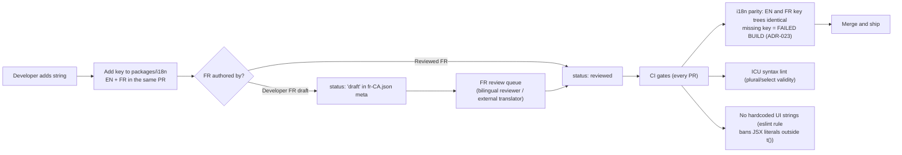

# Localization & Legal — EN/FR Translation Workflow, Bill 96, Law 25

This document specifies the ReadyLoans localization system (translation management workflow for EN/FR, per-tenant locale defaults per ADR-019) and the legal-compliance product surface each tenant needs as a Quebec/Canada dealership platform: Bill 96 obligations, per-tenant privacy policy and terms, Law 25 cookie consent, and the Law 25 data-processing register with PIA, breach, and DSAR workflows. Compliance features are **product features** here, not policy prose — each obligation maps to a table, endpoint, or CI gate. As-is behavior of the legacy tracker is labeled; everything else is Target.

## Table of Contents

1. [Current State (As-Is)](#1-current-state-as-is)
2. [Localization Architecture (Target, ADR-019)](#2-localization-architecture-target-adr-019)
3. [Translation Management Workflow EN/FR](#3-translation-management-workflow-enfr)
4. [Per-Tenant Locale Defaults](#4-per-tenant-locale-defaults)
5. [Bill 96 Obligations → Product Enforcement](#5-bill-96-obligations--product-enforcement)
6. [Privacy Policy & Terms per Tenant](#6-privacy-policy--terms-per-tenant)
7. [Cookie Consent (Law 25)](#7-cookie-consent-law-25)
8. [Data-Processing Register (Law 25)](#8-data-processing-register-law-25)
9. [PIA, Breach Register & DSAR Workflows](#9-pia-breach-register--dsar-workflows)
10. [Automated-Decision Disclosure & Consent Ledger](#10-automated-decision-disclosure--consent-ledger)
11. [Retention & Destruction Schedules](#11-retention--destruction-schedules)

---

## 1. Current State (As-Is)

| Area | As-is behavior | Gap |
|---|---|---|
| i18n stack | react-i18next, resources bundled at build time, `locales/en.json` + `fr.json` in full parity (1,017 lines each) covering all built features | Solid foundation — kept (ADR-019) |
| Default language | `lng = localStorage.kia_language`, **default `'en'`**, `fallbackLng: 'en'` | **Bill 96 gap** — a Quebec dealership platform defaulting to English |
| Language toggle | Layout button flips EN↔FR, persists to `localStorage.kia_language`; users table has `language_pref` column | Per-user preference exists but no tenant default layer |
| Server-side i18n | None — the 2 Resend email templates and PDFKit reports are English-only, hardcoded | Emails/PDFs/SMS must be bilingual, FR-first |
| Bilingual data fields | `lost_reasons.name_fr` exists; templates default `preferred_language='fr'` for merge rendering; tax breakdown labels support FR province names | Partial pattern — generalized in Target |
| Legal surface | None: no privacy policy, no terms, no cookie consent, no consent records, no processing register, no DSAR tooling | Entire §6–§11 is greenfield |

## 2. Localization Architecture (Target, ADR-019)

- **Stack:** react-i18next + **i18next-icu** (ICU MessageFormat for plurals/gender/number), shared resources in `packages/i18n`, consumed by the SPA, the Fastify API (validation errors, notification strings), and workers (emails, SMS, PDFs — i18next instances server-side).
- **Locales:** `fr-CA` and `en-CA`. `fr-CA` is the **default for Quebec tenants**; new locales (e.g., future `es`) require the same parity gate before shipping.
- **Detector order:** user profile `language_pref` → store `default_locale` → tenant `default_locale` → browser `Accept-Language` → `fr-CA`.
- **Formatting:** money/dates via `Intl` with the active locale — `Intl.NumberFormat('fr-CA', {style:'currency', currency:'CAD'})` renders `1 234,56 $`; all money is integer cents at rest (ADR-009), formatted only at render.
- **Namespaces:** the as-is namespace map is carried over (`nav`, `deal`, `pipeline`, `desking` (182 keys, largest), `reports`, `scoring`, …) and extended per new module; server-only namespaces `emails`, `sms`, `pdf`, `ai` live in the same package.
- **Bilingual data columns:** tenant-authored catalog content carries `_en`/`_fr` column pairs — `pipeline_stages.label_en/label_fr`, `lost_reasons.name/name_fr` (as-is), fee catalog `label_en/label_fr`, `message_templates.subject_en/subject_fr/body_en/body_fr`, announcements `title_en/title_fr/body_en/body_fr`. API rejects publishes with a missing pair (`422 MISSING_TRANSLATION`).
- **RTL readiness:** Tailwind logical utilities (`ms-`, `me-`, `ps-`, `pe-`) from day one; no RTL locale planned, no RTL debt accrued.

## 3. Translation Management Workflow EN/FR

Rules:

1. **A key ships in both languages or doesn't ship** (ADR-019). The parity gate compares flattened key trees of `en-CA` and `fr-CA` per namespace; any asymmetry fails CI.
2. **Draft-FR is allowed to merge, not to release:** keys flagged `draft` in the FR metadata file block the release pipeline (staging → prod promotion), not PR merge — developers aren't blocked, releases are held until FR review completes.
3. **Extraction:** `i18next-parser` runs in CI to detect `t()` calls referencing missing keys and orphaned keys (warning).
4. **Glossary (`packages/i18n/GLOSSARY.md`)** pins automotive/finance fr-CA terms so translations stay consistent. Seed entries:

| EN | fr-CA | Note |
|---|---|---|
| Deal | Dossier de vente | Not "deal" anglicism in customer-facing text |
| Trade-in | Véhicule d'échange | |
| Down payment | Mise de fonds | |
| Lien / payoff | Solde du prêt (privilège RDPRM) | RDPRM is the Quebec lien registry |
| Lender | Prêteur | |
| Bill of sale | Contrat de vente | Contract-of-adhesion rules apply (§5) |
| Extended warranty | Garantie prolongée | |
| Appointment | Rendez-vous | |
| Test drive | Essai routier | |
| Funded | Financé (déboursé) | Bank disbursement context |

5. **Pseudo-locale QA:** a `qa` pseudo-locale (bracketed, 35% elongated strings) is togglable in staging to catch truncation/overflow — French runs ~20% longer than English.
6. **Outsourced certified translation** (contracts, policies): exported per-namespace JSON → translator → re-import; if volume grows, ADR-019 names Lingui's PO workflow as the revisit point — not now.

## 4. Per-Tenant Locale Defaults

| Level | Field | Rule |
|---|---|---|
| Tenant | `tenants.default_locale` | Set at provisioning; **`fr-CA` required when `tenants.province = 'QC'`** (provisioning API enforces it; platform_super_admin override requires a recorded justification) |
| Store | `stores.default_locale` (nullable) | Optional override — e.g., an Ontario rooftop inside a Quebec group defaults `en-CA` |
| User | `users.language_pref` (as-is column) | Personal preference wins for the staff UI |
| Lead/customer | `leads.preferred_language`, `contacts.preferred_language` | Drives all outbound comms and AI conversation language; when unknown for a Quebec-area lead (codes 438/514/450/819/873), AI opens **in French** and asks preference (ADR-022) |
| Documents | Per-document rule | Contracts: French first for Quebec (see §5); reports/emails follow the recipient's preference, falling back through the chain above |

## 5. Bill 96 Obligations → Product Enforcement

Bill 96 is fully in force (final deadline June 1, 2025; penalties $3,000–$30,000 per violation, doubled on repeat; OQLF acts on complaints). Mapping obligations to enforcement:

| Obligation | What the law requires | ReadyLoans enforcement |
|---|---|---|
| French UI equivalence | SaaS used by Quebec workers must be available in French, **not inferior** to English — includes internal staff CRM/DMS screens | CI parity gate (§3); FR review before release; pseudo-locale QA; no feature flags that ship EN-only to Quebec tenants |
| French at least as prominent | Any commercial publication visible to Quebec consumers | Customer-facing pages (credit-app links, appointment confirmations, review-request pages) default FR with an EN toggle, never the inverse, for Quebec tenants |
| Contracts of adhesion, French first | Standard-form contracts (bill of sale, purchase/finance/lease agreements): French version presented **first**; customer may only be bound by English after examining the French | Document generation (ADR-021) produces FR by default for Quebec stores; generating the EN version requires the FR version to exist for the same deal, and the EN PDF carries the attestation line ("Les parties ont d'abord examiné la version française…"); both snapshots stored with hashes |
| Emails/SMS/AI scripts | Marketing and service communications French-first | Send layer renders from bilingual templates by `preferred_language` (default `fr`, the as-is merge default); AI first-touch FR-first for Quebec leads (ADR-022) |
| Trademark/brand terms | Generic/descriptive terms inside trademarks must be translated | Tenant-content lint: template editor warns on untranslated generic English terms in FR bodies (warning, not block — tenant judgment) |
| Francization (25+ employees) | Registration with OQLF, francization program | Not a platform obligation, but the platform being fully FR supports each tenant's francization file; the compliance page (`/settings/compliance`) links tenant obligations |

## 6. Privacy Policy & Terms per Tenant

Each dealership tenant is a **controller** of its customers' personal information; ReadyLoans is its service provider (Law 25 requires data-protection terms in the tenant contract — a signup-flow artifact, stored on the tenant record as `dpa_accepted_at`, `dpa_version`).

Table `tenant_legal_documents`:

| Column | Type | Notes |
|---|---|---|
| `id` | uuid PK | |
| `tenant_id` | uuid FK | |
| `doc_type` | enum | `privacy_policy \| terms_of_service \| cookie_policy` |
| `locale` | enum `fr-CA \| en-CA` | A document version publishes only when **both locales** exist (Bill 96) |
| `version` | integer | Immutable once published |
| `body_html` | text | Rendered from the editor; sanitized |
| `is_platform_default` | boolean | Platform ships lawyer-reviewed default templates with merge fields (`{{legal_name}}`, `{{privacy_officer_name}}`, `{{privacy_officer_email}}`, `{{support_email}}`) — tenants customize or replace |
| `effective_at` / `published_at` / `published_by` | | |

Rules:

- Public, unauthenticated routes on the tenant's domain: `/privacy` and `/terms` (and `/politique-de-confidentialite`, `/conditions` aliases), FR served by default for Quebec tenants; **linked from the login page footer and every customer-facing page** (OPC guidance: policy reachable from the homepage).
- The policy page must display the tenant's **Privacy Officer name and contact** (Law 25 Phase 1) — pulled live from `tenants.privacy_officer_name/email` (see `admin-console.md` §4.1); publishing a policy with these fields empty fails with `422 PRIVACY_OFFICER_REQUIRED`.
- **Acceptance tracking** `legal_acceptances`: `id, tenant_id, subject_type (user|contact), subject_id, doc_type, doc_version, locale_shown, accepted_at, ip_hash` — staff accept terms at first login after a version bump; customers accept where flows require it (credit application submit).

## 7. Cookie Consent (Law 25)

Law 25 requires **opt-in consent for non-essential cookies/tracking**; tracking and profiling technologies must be **off by default**, and consent must be granular per purpose (not bundled).

Implementation (self-built CMP, platform-wide):

| Category | Contents | Default |
|---|---|---|
| `essential` | Session cookie (Better Auth), CSRF, load balancing, language preference | Always on — no consent needed, disclosed in the cookie policy |
| `functional` | UI preferences beyond language (density, collapsed sidebar) when stored server-side per user this category is empty; only cookies count | Off |
| `analytics` | PostHog product analytics + session replay (ADR-025) | **Off — PostHog does not load until opt-in** (`opt_in_capturing`) |
| `marketing` | None at launch (no ad pixels in the product) | Off; category exists for tenant sites later |

- Banner: bottom sheet, first visit, FR-first per tenant locale, three actions of equal visual weight — "Tout accepter" / "Tout refuser" / "Personnaliser". No dark patterns: reject is one click, same styling.
- Record: `cookie_consents` — `id, tenant_id, subject_id (person or anonymous visitor uuid), categories jsonb ({"analytics": true, …}), locale_shown, granted_at, expires_at (12 months), user_agent_hash`. Re-prompt on expiry or category additions.
- **Staff UI:** internal staff analytics is still consent-gated the same way (Law 25 does not exempt employees for profiling tech; PostHog stays off until the staff member opts in — adoption metrics account for this, see `analytics-and-adoption.md` §consent).
- Sentry error capture runs without consent under legitimate interest but is PII-scrubbed (`beforeSend`, no request bodies with personal data — ADR-025) and disclosed in the cookie policy.

## 8. Data-Processing Register (Law 25)

The platform maintains a machine-readable register of processing activities, exposed per tenant at `/settings/compliance#register` and exportable (CSV/PDF) for CAI inquiries.

Table `processing_activities` (platform-seeded rows, tenant-extendable):

| Column | Notes |
|---|---|
| `id`, `tenant_id` (null = platform-level entry) | |
| `activity` | e.g., "Lead intake & AI first-touch", "Credit application collection", "Delivery photo storage" |
| `purpose` | Specific purpose (Law 25 purpose-specific consent) |
| `pi_categories` | jsonb — e.g., `["identity","contact","vehicle","financial","employment"]` |
| `sensitivity` | enum `standard \| sensitive` — financial/credit data is `sensitive` (express consent required, PIPEDA/OPC) |
| `legal_basis` | enum `consent_express \| consent_implied \| contract \| legitimate_interest \| legal_obligation` |
| `retention_rule_id` | FK → retention schedule (§11) |
| `subprocessors` | jsonb of subprocessor keys (below) |
| `cross_border` | boolean — triggers PIA-before-communication requirement |
| `pia_id` | FK → `pia_records` when required |
| `automated_decision` | boolean — triggers s.12.1 disclosure wiring (§10) |

Platform subprocessor register (seeded; the cross-border column is why ADR-008 and ADR-014 pin `ca-central-1` — **all platform compute and data are in Canada**, so the core platform involves no cross-border transfer at all):

| Subprocessor | Role | Data location | Cross-border |
|---|---|---|---|
| AWS (RDS for PostgreSQL + S3) | Primary datastore + file storage (ADR-008/013, amended 2026-07-24) | **ca-central-1 (Canada)** | No — chosen to avoid cross-border PIA on the core store (ADR-008) |
| AWS (S3 + CloudFront) | SPA static hosting/CDN (ADR-014) | Origin **ca-central-1 (Canada)**; CloudFront edge caches static assets only — no personal data at rest | No — no personal data |
| AWS (ECS Fargate / ALB / ElastiCache) | API/workers/intake compute + cache (ADR-014) | **ca-central-1 (Canada)** | No — full in-country compute |
| Resend | Email delivery (+ Inbound ADF) | US | **Yes — PIA required** |
| Twilio | SMS/voice transport | US | **Yes — PIA required** |
| Anthropic (Claude API) | AI conversation/extraction (ADR-022) | US | **Yes — PIA required**; no training on inputs per DPA; PII minimization in prompts |
| Stripe | Billing (tenant billing data, not consumer PI) | US | Yes — billing scope only |
| PostHog | Product analytics | **EU cloud** (ADR-025) | Yes (EU) — consent-gated, masked replay |
| Sentry | Error monitoring | US/EU per org config | Yes — PII-scrubbed before send |
| AWS KMS | Envelope-encryption keys (ADR-015) | ca-central-1 | Key material only, no PI |
| Better Stack | Logs/uptime | EU | Yes — logs carry tenant_id/request_id, no consumer PI by pino redaction rules |

## 9. PIA, Breach Register & DSAR Workflows

**PIA (Privacy Impact Assessment)** — mandatory for projects with significant privacy risk and before communicating PI outside Quebec:

- `pia_records`: `id, scope, trigger (new_tech|cross_border|sensitive|automated_decision), assessment_doc_url, risks jsonb, mitigations jsonb, approved_by, approved_at, review_due_at`. Platform ships completed PIAs for the seeded subprocessors; tenants adding integrations that export PI get a guided PIA template flow.

**Breach / confidentiality-incident register** (Law 25 Phase 1 + PIPEDA):

- `confidentiality_incidents`: `id, tenant_id (null = platform-wide), detected_at, description, pi_categories, individuals_affected_estimate, risk_of_serious_injury boolean (Law 25 / CAI test), rrosh boolean (PIPEDA "real risk of significant harm" / OPC test), cai_notified_at, opc_notified_at, individuals_notified_at, containment_actions, status (open|contained|closed)`.
- Workflow: incident created (platform staff or automated Sentry/security signal) → assessment task with the CAI and RROSH tests → if either threshold met, notification tasks to CAI/OPC and affected individuals with bilingual templates → register entry retained **minimum 24 months** (PIPEDA record-keeping) and per Law 25 for CAI inspection. Affected tenants are notified immediately regardless of thresholds (they are controllers with their own obligations).

**DSAR (data subject access / rectification / deletion / portability)**:

- `dsar_requests`: `id, tenant_id, subject_contact_id, type (access|rectification|deletion|portability|de_indexation), received_at, due_at (received_at + 30 days), status (received|verifying_identity|processing|delivered|refused), delivered_at, refusal_grounds`.
- Endpoints: tenant staff create/track at `/settings/compliance#dsar`; `POST /api/v1/dsar/:id/export` runs a BullMQ job assembling the person's data (contacts, leads, deals, conversations, consents, documents) into a **structured, commonly used format** (JSON + CSV bundle — Law 25 Phase 3 portability), delivered via time-limited signed URL.
- Deletion executes the retention engine's destruction path (§11) — soft-delete plus scheduled hard-purge/anonymization; financial records under legal retention are exempted with the exemption recorded on the request.

## 10. Automated-Decision Disclosure & Consent Ledger

- **Law 25 s.12.1:** when a decision is based exclusively on automated processing, the individual must be informed at or before the decision, with a right to human review. Wiring (ADR-022): AI lead scoring/routing that is **finance-significant** (e.g., prequalification hints, lender-routing suggestions affecting the consumer) attaches a bilingual disclosure to the message and creates a `human_review_requests` row on demand; deterministic routing among salespeople is internal staff allocation and is logged but not consumer-disclosed.
- **AI self-identification:** first conversation turn identifies the assistant as automated, FR+EN (ADR-022) — string is platform-owned, not tenant-editable (`white-labeling.md` §13).
- **Consent ledger** (platform compliance engine, ADR-022): per-lead `consent_records` — `id, tenant_id, lead_id, channel (email|sms|voice), basis (express|implied_inquiry|implied_transaction), source, captured_at, expires_at (implied inquiry = 6 months, existing business relationship = 24 months per CASL), revoked_at`. STOP on any channel writes `revoked_at` globally and immediately; outbound AI **calls** additionally require recorded **express** consent (ADAD rules) captured as "Can our assistant call you? Reply YES". The send layer refuses any send lacking a live consent row — this is the single enforcement point (ADR-020).

## 11. Retention & Destruction Schedules

Law 25 requires destruction or anonymization once the purpose is fulfilled. `retention_rules` (platform defaults, tenant-tightenable, never loosenable below legal minimums):

| Data class | Default retention | Rationale / legal floor |
|---|---|---|
| Leads never converted, no consent renewal | 24 months after last activity | CASL implied-consent horizon |
| Deals + financial documents (BoS, funding) | 7 years after fiscal year end | CRA/Revenu Québec bookkeeping requirements |
| Credit applications (encrypted fields, ADR-015) | 7 years, encrypted at field level; decrypt audit trail retained equally | Sensitive financial PI |
| Conversation logs (AI/SMS/email bodies) | 24 months, then anonymized (PI stripped, analytics aggregates kept) | Purpose-limited |
| Consent records | Life of relationship + 3 years | Evidence of CASL/Law 25 compliance |
| Audit `activity_events` | ≥ 24 months, tenant-configurable up to 7 years | PIPEDA breach records; ops forensics |
| Cookie consents | 12 months (re-prompt cadence) | §7 |
| Churned-tenant data | Export delivered, then 90-day grace, then destruction (except records under legal floors, held frozen) | Offboarding promise (`admin-console.md` §4.2) |

Execution: a nightly BullMQ repeatable job (`retention-sweep`) evaluates rules per tenant, hard-purges or anonymizes eligible rows, and writes a destruction log (`destruction_log: rule_id, entity_type, row_count, executed_at`) — the register's proof of destruction.
