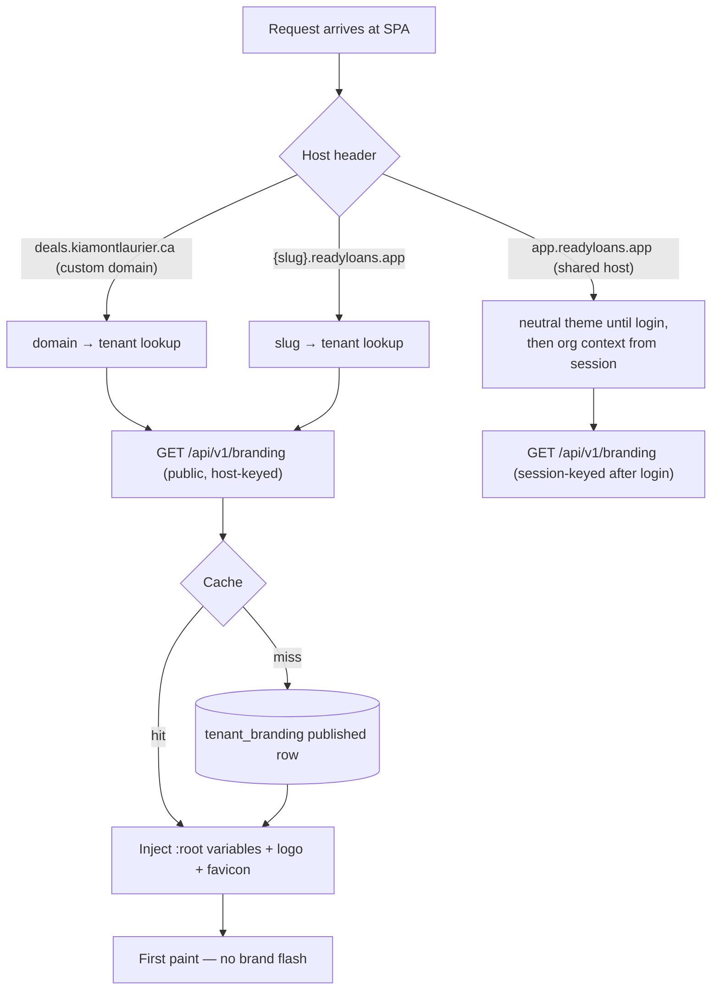

# White-Labeling — Per-Tenant Branding & Runtime Theming

This document specifies how ReadyLoans delivers a fully white-labeled experience per tenant from a **single deployment**: the `tenant_branding` record (logo, favicon, fonts, color palette, sizing/density), the runtime CSS-custom-property theming architecture (ADR-017/018), branded emails/PDFs/SMS via the parallel server-side branding path, custom domains and branded login pages, the theme editor with live preview, and the accessibility-contrast constraints that tenant-supplied colors must satisfy. Per ADR-018, **any hardcoded "Kia Mont-Laurier" branding is a release blocker** — the as-is occurrences are enumerated in §1 as the removal checklist.

## Table of Contents

1. [Current State (As-Is) — Hardcoded Branding Inventory](#1-current-state-as-is--hardcoded-branding-inventory)
2. [The `tenant_branding` Record](#2-the-tenant_branding-record)
3. [Tenant Resolution & Branding Delivery](#3-tenant-resolution--branding-delivery)
4. [Runtime CSS-Variable Theming Architecture](#4-runtime-css-variable-theming-architecture)
5. [Dark Mode — Derived Palettes](#5-dark-mode--derived-palettes)
6. [Fonts](#6-fonts)
7. [Sizing & Density](#7-sizing--density)
8. [Server-Side Branding: Emails, PDFs, SMS, AI Persona](#8-server-side-branding-emails-pdfs-sms-ai-persona)
9. [Custom Domains](#9-custom-domains)
10. [Branded Login Page](#10-branded-login-page)
11. [Theme Editor with Preview](#11-theme-editor-with-preview)
12. [Accessibility Contrast Constraints](#12-accessibility-contrast-constraints)
13. [What Tenants Cannot Customize](#13-what-tenants-cannot-customize)

---

## 1. Current State (As-Is) — Hardcoded Branding Inventory

The legacy tracker is single-brand. Every item below must be parameterized before multi-tenant release:

| Location (as-is) | Hardcoded value | Replacement |
|---|---|---|
| `components/Layout.jsx` + `MobileNav` brand block | Red Car icon + "Kia **Mont-Laurier**" wordmark | `branding.logo_light_url` / `logo_dark_url` + `display_name` |
| `index.css` tokens | `--color-brand-red: #E53935` (dark `#EF5350`); accent `#3B82F6` (dark `#60A5FA`) — the "KIA Command" palette | Tenant `primary`/`accent` OKLCH values; KIA Command becomes the **neutral default theme** for tenants with no branding configured |
| Desking print header (`DeskingPage`) | "Kia Mont-Laurier — Proposal" | Server-rendered PDF proposal with branding record (ADR-021) |
| Bill of Sale dealership block (`utils/billOfSale.js`) | `name: 'KIA MONT-LAURIER'`, empty address/city/phone | `tenants.legal_name` + store address block; BoS becomes an immutable branded snapshot (ADR-021) |
| Resend email templates (deal closing report, driver dispatch) | Kia branding baked into 2 HTML templates | React Email templates consuming the branding record (§8) |
| `index.html` favicon / title | Kia favicon, static title | `branding.favicon_url` + `display_name` injected at bootstrap |
| Newer pages (Accounting, Desking, InventoryDetail) | Raw Tailwind gray/red/emerald classes, hardcoded white cards — bypass the token system entirely (light-only) | Rebuilt on tokens (ADR-017); token-bypass is lint-blocked in `packages/ui` |
| localStorage keys | `kia_language`, `kia_theme`, `kia_sidebar_collapsed`, `kia_user`, … | Renamed `rl_*`; `kia_user` deleted outright (ADR-006) |

## 2. The `tenant_branding` Record

Table `tenant_branding` in `packages/db` (one row per tenant; optional per-store override rows):

| Column | Type | Default | Notes |
|---|---|---|---|
| `id` | uuid PK | | |
| `tenant_id` | uuid FK → tenants | | RLS-scoped (ADR-007) |
| `store_id` | uuid FK → stores, nullable | null | Non-null = store-level override (rooftop sub-brand); resolution picks store row first |
| `display_name` | text | tenant `display_name` | Wordmark text when no logo uploaded |
| `logo_light_url` | text | null | S3 key `tenant/{id}/branding/logo-light.svg` (branding bucket, ADR-013) — SVG or PNG, transparent background, max 512×160 px, max 200 KB |
| `logo_dark_url` | text | null | Dark-surface variant; falls back to `logo_light_url` |
| `favicon_url` | text | null | 64×64 PNG or SVG; served via `/api/v1/branding/favicon` with long-lived cache |
| `email_logo_url` | text | null | Raster PNG (email clients; SVG unreliable), max 400 px wide |
| `login_bg_url` | text | null | Optional login-page hero image, max 1 MB, EXIF-stripped by the sharp step (ADR-013) |
| `primary` | text (OKLCH) | `oklch(0.55 0.2 262)` (default accent blue) | Brand primary — buttons, active nav, links |
| `accent` | text (OKLCH) | = primary | Secondary emphasis; chart series 1 |
| `success` / `warning` / `danger` / `info` | text (OKLCH), nullable | platform defaults `#10B981/#F59E0B/#EF4444/#6366F1` equivalents | Semantic overrides are optional and contrast-validated (§12) |
| `font_family` | enum | `inter` | `inter \| system \| custom` |
| `font_woff2_url` / `font_woff2_bold_url` | text | null | Required when `font_family='custom'`; self-hosted WOFF2 (§6) |
| `radius` | enum | `md` | `none (0) \| sm (0.25rem) \| md (0.5rem) \| lg (0.75rem)` → `--radius` |
| `density` | enum | `comfortable` | `comfortable \| compact` (§7) |
| `dark_mode` | enum | `derived` | `derived \| custom \| disabled`; `custom` unlocks explicit dark values `primary_dark`, `accent_dark`, … |
| `legal_name` | text | tenant `legal_name` | Email footers, PDFs, consent text |
| `support_email` / `support_phone` | text | null | Transactional email footers, AI escalation copy |
| `sms_sender_name` | text | store name | CASL sender-ID footer line (ADR-020) |
| `ai_persona_name` | text | "Alex" | AI assistant self-identification name (ADR-022 first-turn disclosure) |
| `status` | enum | `draft` | `draft \| published`; the SPA only ever receives `published` |
| `version` | integer | 1 | Incremented on publish; used for cache busting |
| `published_at` / `updated_at` | timestamptz | | |

Colors are stored as **OKLCH** strings (research §2.2): perceptual lightness makes derived shades and dark-mode transforms predictable. Hex input in the editor is converted on save.

## 3. Tenant Resolution & Branding Delivery

Resolution order (ADR-018): **custom domain → subdomain → login org context.**



Delivery contract:

- `GET /api/v1/branding` — **public, no auth** (needed pre-login). Tenant resolved from the `Host` header (custom-domain and subdomain cases) or from the session (shared host). Response: the published branding record minus internal fields, plus resolved URLs (signed where private) and the computed dark palette.
- Caching: `Cache-Control: public, max-age=300, stale-while-revalidate=3600` + `ETag: "branding-v{version}"`. Server side: Valkey key `t:{tenantId}:branding` invalidated on publish; in-process LRU 30–60 s on top (ADR-010).
- The SPA's `index.html` contains a tiny synchronous bootstrap that fetches `/api/v1/branding`, writes the CSS variables onto `document.documentElement`, sets favicon and `<title>`, then mounts React. A **neutral skeleton** (grayscale, no brand color) renders until variables land — brand-flash of a wrong tenant is never acceptable.
- Fallback: if the fetch fails, the neutral default theme (KIA-Command-derived, de-branded) applies and the app still works.

## 4. Runtime CSS-Variable Theming Architecture

Single deployment, runtime theming (ADR-018). Tailwind v4 maps every design token to a CSS variable via `@theme`; shadcn/ui components consume only tokens — so per-tenant theming requires **zero component changes** (ADR-017).

Token mapping (subset — full list lives in `packages/ui/src/theme/tokens.ts`):

| CSS variable | Fed by | Consumers |
|---|---|---|
| `--primary` / `--primary-foreground` | `branding.primary` + auto-computed foreground (§12) | Buttons, active nav, focus rings |
| `--accent` / `--accent-foreground` | `branding.accent` | Secondary buttons, highlights |
| `--background` / `--foreground` | Platform neutrals (not tenant-editable) | Page/card surfaces, text |
| `--success` / `--warning` / `--destructive` / `--info` (+ `-foreground`) | Semantic overrides or platform defaults | Status pills, alerts, aging badges |
| `--chart-1` … `--chart-5` | Derived from `primary`/`accent` via OKLCH hue rotation (+30°, −30°, +60°, complementary) | shadcn Charts (Recharts) — dashboards inherit the brand automatically |
| `--radius` | `branding.radius` | All rounded corners |
| `--sidebar` / `--sidebar-foreground` / `--sidebar-accent` | Derived from primary (low-chroma tint) or platform neutral | App shell |
| `--font-sans` | `branding.font_family` (§6) | Everything |
| `--density` (spacing multiplier) | `branding.density` | Tables, forms, cards (§7) |

Injection: the bootstrap writes one `<style id="tenant-theme">` block:

```css
:root { --primary: oklch(0.55 0.2 262); --radius: 0.5rem; /* … */ }
:root[data-theme="dark"] { --primary: oklch(0.72 0.16 262); /* … */ }
```

Rules:

- Components in `packages/ui` may reference **tokens only** — a lint rule (`no-restricted-syntax` on hex colors + raw `bg-red-500`-class utilities) blocks the as-is token-bypass pattern (§1, last row).
- Pipeline-stage colors (the 10 stage hexes in `admin-console.md` §10.3) are **data, not theme** — they render via inline `style` from `pipeline_stages.color` and are tenant-configurable per stage, independent of branding.
- Theme switching (light/dark) toggles `data-theme` on `<html>` — the as-is `ThemeProvider` behavior (localStorage preference, OS `prefers-color-scheme` default) is preserved, key renamed `rl_theme`.

## 5. Dark Mode — Derived Palettes

Per ADR-018, dark palettes are **derived algorithmically** so dealers don't have to author two palettes:

- `dark_mode='derived'` (default): for each brand color `oklch(L C H)` the dark variant is `oklch(clamp(L + 0.17, 0.60, 0.85), C × 0.85, H)` — lighter and slightly desaturated on dark surfaces (mirrors the as-is KIA Command pattern: accent `#3B82F6` → `#60A5FA`, red `#E53935` → `#EF5350`). Neutral surfaces come from the platform dark scale (as-is values retained as defaults: page `#0F1117`, card `#1A1D27`, elevated `#232738`, border `#2A2D3A`).
- `dark_mode='custom'`: tenant supplies explicit dark values; same contrast validation applies (§12).
- `dark_mode='disabled'`: theme toggle hidden; `data-theme` locked to `light`.
- Derivation runs **server-side at publish time** and is stored in the branding response — the client never computes colors.

## 6. Fonts

- Options: `inter` (platform default, self-hosted — the as-is Google Fonts import is replaced with self-hosted WOFF2 to avoid third-party requests, a Law 25 data-minimization point), `system` (system-ui stack, zero download), `custom`.
- Custom fonts: tenant uploads WOFF2 regular + bold (max 300 KB each) to `tenant/{id}/branding/fonts/` in the S3 branding bucket; served through CloudFront (origin access control over the private bucket) with immutable filenames and long-lived cache (ADR-013). Injected as:

```css
@font-face {
  font-family: 'TenantBrand';
  src: url('…/font.woff2') format('woff2');
  font-weight: 400; font-display: swap;
}
```

- `<link rel="preload" as="font" type="font/woff2" crossorigin>` is emitted by the bootstrap for the two files to limit CLS; fallback stack `'TenantBrand', Inter, system-ui, sans-serif`.
- Licensing attestation checkbox required at upload ("we hold a web-embedding licence for this font"), stored on the branding record (`font_license_attested_at`, `attested_by`).

## 7. Sizing & Density

| Setting | `comfortable` (default) | `compact` |
|---|---|---|
| Base spacing multiplier `--density` | 1 | 0.85 |
| Table row height (TanStack Table) | 44 px | 34 px |
| Input height | 40 px | 34 px |
| Card padding | 16 px | 12 px |
| Kanban card width | 280 px | 260 px |

Density affects scale only — never touch-target minimums on mobile (44 px targets stay, per the as-is mobile spec). `radius` options in §2 map 1:1 to `--radius`.

## 8. Server-Side Branding: Emails, PDFs, SMS, AI Persona

Emails and PDFs cannot read CSS variables — ADR-018 mandates a **parallel server-side branding path**. One resolver, `getBrandingForTenant(tenantId, storeId?)` in `packages/core`, backed by the same cache, feeds:

| Output | Mechanism | Branded elements |
|---|---|---|
| Transactional email | React Email templates (ADR-020) receive a `branding` prop | `email_logo_url`, `primary` (buttons/links, hex-converted), `legal_name` + `support_email`/`support_phone` + store address in footer, locale (FR-first per ADR-019), CASL unsubscribe block |
| PDF documents (BoS, proposal, reports, the 13-document catalog) | React → HTML → Playwright/Chromium in workers (ADR-021); the HTML template imports the same token CSS with variables inlined server-side | Header logo, primary color rules/accents, `legal_name`, store address block, FR/EN per document rules; output is an **immutable snapshot** with hash |
| SMS | Send layer (ADR-020) | `sms_sender_name` in the CASL sender-ID footer; STOP wording bilingual |
| AI conversations | Per-tenant cached prompt prefix (ADR-022) | `ai_persona_name`, `display_name` ("You are {persona}, the virtual assistant for {display_name}…"), support contact for escalation copy; first-turn AI disclosure FR/EN |
| Excel exports | ExcelJS header row | `display_name`, logo image anchor |

Publish invalidates the shared cache, so client and server can never disagree on branding version.

## 9. Custom Domains

The white-label domain mechanism is per-tenant custom domains on the shared **CloudFront** distribution — the **SaaS Manager / multi-tenant distribution** model, one distribution config with per-domain **DNS-validated ACM certificates**, no distribution sprawl (ADR-014). Platform DNS itself lives in **Route 53**. Entitlement-gated (`custom_domain` feature, Growth+ plans).

Flow (`/settings/branding#domain`):

1. Tenant enters `deals.kiamontlaurier.ca`. API writes `tenant_domains (id, tenant_id, domain UNIQUE, status, verification_token, created_at, verified_at, cert_issued_at)` with `status='pending_dns'` and requests a **DNS-validated ACM certificate** for the domain (issued in `us-east-1` as CloudFront requires — certificate metadata only, no personal data leaves Canada).
2. UI shows the required records at the tenant's DNS host: `CNAME deals → {distribution}.cloudfront.net` (routing), the **ACM validation CNAME** (`_{hash}.deals → _{hash}.acm-validations.aws` — proves domain control and issues the certificate), plus `TXT _readyloans-verify.deals → {verification_token}` (platform-level proof of control before routing activates).
3. A BullMQ repeatable job polls DNS and the ACM issuance status; once the certificate is `ISSUED` and the records resolve, the API attaches the domain + certificate to the shared CloudFront distribution (SaaS Manager multi-tenant model); `status='active'`.
4. Status values: `pending_dns → verifying → active | failed`; failures surface the exact missing record (routing CNAME, ACM validation CNAME, or TXT).

Constraints:

- Apex domains require ALIAS/ANAME support at the tenant's DNS host (Route 53-hosted zones can alias apex records to CloudFront natively); the UI recommends a subdomain.
- Session cookies are scoped to the exact custom domain (ADR-006 — `Secure; HttpOnly; SameSite=Lax`); sessions do not carry across a tenant's custom domain and the shared host.
- Custom domains cover the SPA. The API stays on `api.readyloans.app` (ALB host-based routing; CORS allow-list per tenant domain); intake endpoints stay on the platform host (ADR-005).
- Removing a domain detaches it from the CloudFront distribution, schedules the ACM certificate for deletion, and immediately invalidates the host→tenant cache entry.

## 10. Branded Login Page

- `/login` on a custom domain or tenant subdomain resolves branding **pre-auth** via the public host-keyed `GET /api/v1/branding` (§3): logo, colors, optional `login_bg_url`, locale default (`fr-CA` for Quebec tenants — the login page itself must be French-first, Bill 96).
- On the shared host `app.readyloans.app`, login renders the neutral ReadyLoans theme; branding applies post-login from org context.
- The as-is login error taxonomy is preserved as i18n keys (`errorRequired`, `errorGeneral`, `errorNetwork`, `invalidCredentials`, `profileNotFound`), now served bilingual with FR default per tenant.
- Footer links on the branded login page: tenant privacy policy and terms (per-tenant documents — see `localization-and-legal.md` §Privacy policy), "Powered by ReadyLoans" (removable at Scale tier — entitlement `hide_powered_by`).

## 11. Theme Editor with Preview

Route `/settings/branding` (roles `owner|gm`, see `admin-console.md` §10):

- **Layout:** left panel = form (logo uploads with instant validation of format/dimensions/size per §2; color pickers accepting hex, stored OKLCH; font selector; radius/density; dark-mode strategy). Right panel = **live preview iframe** rendering real `packages/ui` components (app shell, kanban card with stage colors, data table, stat cards, buttons, a rendered email template) — the editor posts draft variables into the iframe via `postMessage`, so preview is the real component library, not a mock.
- **Preview toggles:** light/dark, comfortable/compact, EN/FR (catches label-length overflow in French), mobile width.
- **Draft → publish workflow:** edits save to the `draft` row (`PATCH /api/v1/settings/branding`); nothing user-visible changes until `POST /api/v1/settings/branding/publish`, which (1) runs the full validation suite (§12), (2) computes the derived dark palette (§5), (3) increments `version`, (4) copies draft → published, (5) invalidates caches. Publishing records `activity_events` `settings.branding.published` with before/after.
- **Version history:** last 10 published versions retained; one-click rollback (republish of an old version as a new version number).
- **Email/PDF preview:** "Send test email" (to the editing user only) and "Generate sample PDF" buttons exercise the server-side path (§8) so tenants verify both pipelines before publish.

## 12. Accessibility Contrast Constraints

Tenant-supplied colors are validated at publish (ADR-018: WCAG AA auto-validation, auto-adjust foreground). Rules, enforced server-side in `packages/core` (`validateBrandingContrast`):

| Check | Threshold | On failure |
|---|---|---|
| `primary` vs its computed foreground (button text) | ≥ 4.5:1 | **Auto-fix:** foreground snaps to white or near-black (`oklch(0.985 0 0)` / `oklch(0.145 0 0)`), whichever contrasts more |
| `primary` as text/link on `--background` (light and dark) | ≥ 4.5:1 | **Auto-fix:** a separate `--primary-text` variant is derived by shifting L toward the contrasting pole until 4.5:1 is met (hue/chroma preserved); components use `--primary-text` for text, raw `--primary` for fills |
| Semantic colors (`success/warning/danger/info`) vs surfaces | ≥ 3:1 (UI components), ≥ 4.5:1 when used as text | Auto-fix same as above; warning shown in editor |
| Focus ring vs adjacent colors | ≥ 3:1 | Auto-fix ring color |
| Logo on sidebar surface | Heuristic luminance check | Warning only: "your logo may be invisible on dark sidebars — upload a dark variant" |
| `login_bg_url` behind login card | n/a | Login card always renders on an opaque surface; no text over raw imagery |

Editor behavior: violations show inline as they type ("Contrast 2.9:1 — will be auto-adjusted to meet WCAG AA"); publish is **never blocked** by fixable contrast issues (auto-fix applies), but the applied adjustments are listed on the publish confirmation and stored in the branding record (`contrast_adjustments jsonb`) for transparency.

## 13. What Tenants Cannot Customize

Guardrails keeping the platform maintainable, accessible, and compliant:

| Locked | Why |
|---|---|
| Layout structure, navigation architecture, component behavior | One SPA, one support surface; white-label is skin-deep by design (ADR-018) |
| Neutral surface/text scales (`--background`, `--foreground`, borders) | Contrast system depends on them; brand expression is via `primary`/`accent`/semantics |
| Base type scale and touch-target minimums | Accessibility floor |
| French translations, legal/compliance strings, CASL footers, AI first-turn disclosure | Bill 96 / CASL / Law 25 obligations are platform-owned (ADR-019/022); tenants may add content, never remove |
| Tax rates, tax labels on documents | Compliance-owned (`admin-console.md` §10.4) |
| Email deliverability plumbing (SPF/DKIM structure, unsubscribe mechanics) | CASL; tenants configure their domain, not the mechanics |
| "Powered by ReadyLoans" below Scale tier | Commercial (entitlement `hide_powered_by`) |
